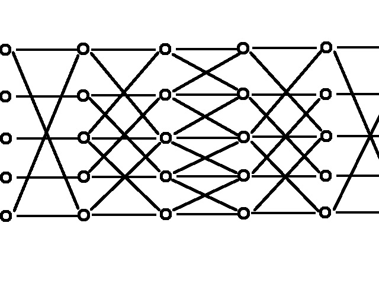
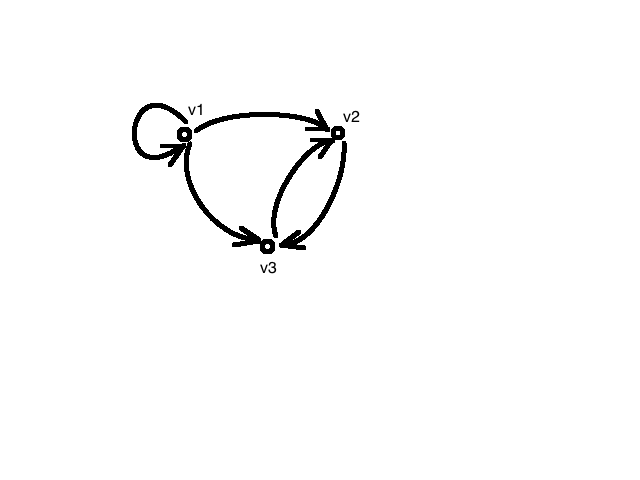

# Mathematics for Computer Science - MIT #
## Lec 1 ##
1. Mathematical proofs
2. Proof:
	1. Method for assertaining a truth
		1. Assertaining - establishing truth, verifying truth
			1. Experimentation and observation
			2. Sampling and counter examples
			3. Judge or jury
			4. Word of GOD (belief)
			5. Word of Boss or Customer or Professor
			6. Conviction (transfering the burden of proof to others)
	2. Mathematical proof:
		1. A verification of a proposition by a chain of logical deductions from a set of axioms
			1. Proposition: Is a statement that is either True or False
				1. Ex: 2 + 3 = 5 (True proposition)
				2. For all n in N, n^2 + n + 41 is a prime number (this is a predicate)
					1. Predicate: It is a proposition whose truth depends on the value of variable(s) - fails at 40
				3. a^4 + b^4 + c^4 = d^4 has no positive integers - false
					1. a = 95800, b = 217519, ...
				4. 313(x^3 + y^3) = d^3
					1. Eliptic curve - factoring large integers technique
						1. Can be used to break cryptosystems
				5. The regions in any map can be colored in 4 colors so that adjacent regions have different colors - 4 color theorem
					1. Proof by picture can be convincing but may be wrong
				6. Every even integer but 2 is the sum of 2 primes - no one knows - Christian Golbach conjecture - Globe article - unsolved mystery
				7. Riemann Hypothesis
				8. Poincare conjecture
				9. for all n in Z, n >= 2 => n^2 >= 4 (symbols are many)
			2. Logical deductions
			3. Axioms
3. Definition: An implication p => q is true if p is false or q is true

		p q p => q
		T T T
		T F F
		F T T
		F F T
		
4. For all n in Z, n >= 2 iff n^2 >= 4 - False
	1. Implication both ways
		1. True if both are True or both are False
5. Axioms:
	1. Definition: An axiom is a proposition that is assumed to be true (no proof) - think worthy (Greek)
		1. Identify what the assumptions are (other people has to agree)
			1. if a = b and b = c, then a = c (axiom)
6. Euclidean Geometry: Given a line L and a point p not on L, there is exactly one line through p parallel to L.
7. Spherical Geometry: Give a line L and a point p not on L, there is no line through p parallel to L (on a sphere)
8. Hyperbolic Geometry: Give a line L and a point p not on L, there are infinitely many lines through p parallel to L
	1. They make sense based on context
9. Axioms guiding principles:
	1. Should be consistent
		1. A set of axioms is consistent if no proposition can be proved to be both true and false
	2. Should be complete
		1. A set of axioms is complete if it can be used to prove every proposition is either true or false
			1. You can solve every problem (you can use them to get to the end)
				1. Trying to find a set of axioms spent careers
					1. Proved that it is impossible to find such axioms
						1. May be Goldbach's conjecture is true but it is impossible to prove

## Lec 2 ##
1. Any axiom that is acceptible which is consistent
2. Direct proofs:
	1. Start with axioms
	2. Logical deductions
	3. Solution
3. Indirect proofs:
	1. Assume the opposite of what is stated
	2. Logical deductions
	3. Contradiction (we assumed wrong in the beginning)
4. Proof by contradiction:
	1. To prove P is true, we assume P is False (i.e. ~P is T), then use that hypothesis to derive a falsehood is True or contradiction
		1. If ~P => F is True
			1. ~P must be False in this case therefore P is True (Since ~P => F is T is same as ~(~P)vF is T i.e. PvF is T. i.e. P is T)
	2. sqrt(2) is irrational:
		1. Pf by contradiction:
			1. Assume for the purpose of contraditiction that sqrt(2) is rational
				1. ~P is T
					1. sqrt(2) = a/b (fraction in lowest terms)
					2. Squaring on both sides
						1. 2 = a^2 / b^2
						2. a^2 = 2b^2 => a is even (2 | a)
						3. a^2 => 4 | a
						4. b^2 => 4 | 2b^2 => 2 | b^2
						5. b is even
				2. Therefore a and b are not in lowest terms
					1. contradiction x
					2. Therefore ~P must be F => P is T
		2. Rational numbers can have finite length decimals repeating
			1. 1/7 = 0.142857142857142857...
5. Induction:
	1. Induction axiom:
		1. Let P(n) be a predicate. If P(0) is true and for all n in N (P(n) => P(n + 1)) is true, then for all n in N, P(n) is true
			1. If P(0), P(0) -> P(1), P(1) => P(2), ..., then P(0), P(1), P(2), ... are true
				1. Series of dominos - if P(0) is knocked down, all the others get knocked down one after the other
	2. Example: for all n >= 0, 1 + 2 + 3 + ... + n = n(n + 1)/2
		1. sigma_i=1_to_n i = n(n + 1)/2
		2. sigma_1_<=\_i\_<=_n i (on top or bottom)
			1. if n = 1, 1 + 2 + ... + n = 1
			2. if n <= 0, 1 + 2 + ... + n = 0
			3. if n = 4, 1 + 2 + ... 4 = 10 = 10
		3. Proof: By induction
			1. Let P(n) be the predicate that sigma_i_=_1_to_n i = n(n + 1) / 2
			2. Base case: P(0) is true?
				1. sigma_i=1_to_0 i = 0
				2. 0(0 + 1) / 2 = 0
			3. Inductive step: For n >= 0, show P(n) => P(n + 1) is true
				1. Assume P(n) is true for purposes of induction
				2. i.e, assume 1 + 2 + ... + n = n(n + 1)/2
				3. Need to show P(n + 1): 1 + 2 + ... + (n + 1) = (n + 1)(n + 2)/2
				
						1 + 2 + ... + n + (n + 1)
						n(n + 1)/2 + (n + 1)
						(n^2 + n + 2n + 2)/2
						(n + 1)(n + 2)/2
						
					1. Therefore `P(n) => P(n + 1)` for all `n >= 0`
6. Limitations with Induction:
	1. We don't know why the theorem is true sometimes
	2. We cannot figure out the answer using induction (n(n + 1)/2)
		1. There are a few instances when we can figure out the answer using induction
7. Theorem: for all n in N 3 | (n^3 - n)
	1. Proof by induction:
		1. P(n): 3 | (n^3 - n)
		2. Base case: P(0): 3 | (0 - 0)
		3. Inductive step: For n >= 0, show P(n) => P(n + 1) is T
			1. Assume P(n) is T, i.e. 3 | (n^3 - n)
			2. Examine: (n + 1)^3 - (n + 1) = n^3 +3n^2 + 3n + 1 -n - 1
				1. = n^3 + 3n^2 + 2n = n^3 - n +3n^2 + 3n = (n^3 - n) + 3(n^2 + n).
				2. 3 | (n^3 - n) by inductive hypothesis and 3 | 3k where k = (n^2 + n)
				3. Therefore, 3 | (n + 1)^3 - (n - 1)
8. Steps:
	1. Base Case: P(b) is true
	2. Inductive Step: for all n ≥ b P(n) => P(n + 1)
	3. Conclude: for all n ≥ b P(n) is true
9. False proof: All horses are of the same color:
	1. Pf: By Induction
		1. P(n): In any set of n ≥ 1 horses, the horses are all of same color
		2. Base case: P(1): True since, just one horse
		3. Inductive step: Assume P(n) to prove P(n + 1)
			1. Consider a set of n + 1 horses: H1, H2, H3, ..., Hn+1
			2. Then H1, H2, ..., Hn are of the same color and H2,H3,...,Hn+1
			3. Since color(H1) = color(H2, ..., Hn) = color(Hn + 1) => color(H1) = color(Hn + 1)
			4. => all n + 1 are of same color
	2. Problem when n = 2!
		1. Does P(1) => P(2)?
			1. color(H1) = color(empty set) is wrong!
	3. P(1) & P(2) => P(3), P(3) => P(4) .... for all n belongs to Z
		1. P(1) => P(2) is F
	4. P(2) be the base case?
		1. Base case is wrong - If any pair of horses are of same color (which is not true always)
10. To prove there is a solution to the problem and to find one
	1. Example: Courtyard - 2^n x 2^n
		1. Statue in the middle
		2. Use L shaped tiles
			1. Tile the courtyard using L shaped tiles (2 x 2) leaving one space for statue
		3. Theorem: for all n, there exists a way to tile a 2^n x 2^n region with a center square missing
			1. Proof by induction: P(n)
				1. Base Case: P(0) - one space for statue - done
				2. Inductive Step: For n >= 0, assume P(n) to verify the inductive hypothesis.
					1. So we need to show P(n + 1) is true
					2. Consider a 2^(n + 1) x 2^(n + 1) courtyard
					3. Divide the courtyard into 4 blocks
			2. Change inductive hypothesis: for all n, there exists a way to tile a 2^n x 2^n region with a corner stone missing
				1. Stronger P(n): for all n, there exists a way to tile a 2^n x 2^n with **any** square missing:
					1. P(n) has got more powerful so that there are more assumptions
						1. Try something harder (assume stronger)

## Lec 3 ##
1. Good proofs are:
	1. Correct
	2. Complete (all the details must be there, key steps)
	3. Clear (we must be able to understand)
	4. Brief (too much detail is not good, key details and crisp)
	5. Elegant (nice one)
		1. Mathematical beauty (crisp, clever, short to the point) - like an art
	6. Well organized
		1. Lemmas (like sub-routines)
	7. In order
		1. Not haphazhard (high school - backwards)
			1. 1 = 1 to A = B is better (not the otherway)
	8. They are like good code
		1. This technique can be used to prove that programs are doing what they are supposed to do
			1. A-300 - software controlled - automated takeoff and landing
				1. Software opened rear door accidentally and the plane crashed
			2. Radiation device: got into race condition - killed patient with too much radiation
			3. American airlines: grounded entire fleet
			4. Akamai: MIT - Content delivery (software bugs may bring up all the sites)
		2. In a few years, our life depends on code written by people
			1. We need rock solid arguments to overcome these situations
	9. Problems:
		1. We are lazy and don't write all details (it is clear, let us move on)
		2. Top 10 proof techniques we should not use:
			1. Proof by example
			2. Proof by vigorous hand waving
			3. Proof by cumbursome notation
			4. Proof by exhaustion
			5. Proof by ommission (reader needs to fill in details)
			6. Proof is trivial
			7. Proof by picture
			8. Proof by vehement assertion
			9. Proof by appeal to intuition
			10. Proof by reference to eminent authority
				1. Fermat's theorem

						for all n > 2 there does not exist x, y, z in N
						x^n + y^n = z^n
						
					1. It is finally proved by someone else
2. Puzzles:
	1. Find a sequence of moves to go from one configuration to another
		1. Legal move - slide a letter to adjacent blank square (row or a column)
		2. Theorem: There is no sequence of legal moves to invert G & H and return all the other letters to their original order or position
			1. Invariant: It holds at initial state and it is preserved for any state reached from initial state (so it does not hold for the special state)
			2. Moves: Row move
				1. Ex: G =>
					1. Relative order of items did not change
						1. Natural order:

								1 2 3
								4 5 6
								7 9 9
								
				2. Lemma 1: A row move does not change the order of the items
					1. Proof: In a row move, we move an item from cell i into an adjacent cell i - 1 or i + 1. Nothing else moves. Hence the order of the items is preserved
						1. Everything is upto i - 2 and i + 1 onwards or upto i - 1 and i + 2 onwards 
				3. Lemma 3: During a move, the # of inversions can only increase by 2 or decrease by 2 or stay same.
					1. Proof: Row move - no changes (by Lemma 1)
						1. Colum move - 2 pairs change order (by Lemma 2)
							1. Case A: both pairs were in order (originally)
								1. Goes up by 2
							2. Case B: both pairs were inverted
								1. Decreases by 2
							3. Case C: One pair was inverted
								1. Stays the same
				4. Corollary 1: During a move, the parity (even/odd) of the # of inversions does not change
					1. If G goes up => GH changes order and GE changes order
					2. Proof: Adding or subtracting 2 does not change the parity
				3. Lemma 4: In every state reachable from start state, the parity of the number of inversions is odd
					1. Proof: (By induction - veriant proofs are always by induction)
						1. P(n): After any sequence of n moves from start state the parity is always odd (n is number of moves usually)
						2. Base Case: P(0) -> no moves
							1. Number of inversions is 1 => parity is odd
							2. Hence P(0) is true
						3. Inductive Step: For n >= 0, show P(n) => P(n + 1)
							1. Consider a sequence of n + 1 moves m1, ..., m_n+1
							2. Pairity of inversions after n moves is odd by P(n)
								1. By I.H, we know that parity after m1,...,m2 is odd
								2. By corrolary 1, we know that parity of # of inversions does not change during m_n+1 => the parity after m1,m2, ..., m_n+1 moves is odd => P(n + 1)
3. Corollary - simple consequence of something else
	1. Usually short proof
4. Lemma - used as a tool to prove a bigger thing
5. Theorem: 
	1. Proof: The parity of the # of inversions in the desired target state is even (0). By lemma 4, the desired state cannot be reached from the start state (the parity of # of inversions is odd)
6. Idea: Find invariant that is preserved in every step and that is not preserved in the target state
7. Practical example:
	1. Nuclear reactor software: From a given state, any sequence of moves does not rach the meltdown state
		1. Use invariant
	2. Aircraft software: from a given state to crash state
	3. Radiation device: ...
8. Strong induction: Easier to use for certain problems
	1. Strong Induction Axiom:
		1. Let P(n) be any predicate. If P(0) is true and for all n (P(0) ^ P(1) ^ ... ^ P(n)) => P(n + 1) is true, then for all n P(n) is true
			1. Assume P(0), ... P(n) is true to prove P(n + 1)
				1. Any proof that can be done with strong induction can be done with ordinary induction (it is a little harder)
	2. Example: Unstacking game

			8 -> 5, 3 (5 * 3 = 15 points)
			5 -> 4, 1 (4 * 1 = 4 points)
			...
			1 (1 point)
			
		1. Add the points for final score
	3. Theorem: All strategies for the n-block game produce the same score. S(n) = n(n - 1)/2 (stronger hypothesis)
		1. Ex: S(8) = 28
		2. Proof by strong induction:
			1. P(n): The theorem
				1. Base case: P(1). S(1) = 0 (1(1 - 1)/2 = 0)
				2. Inductive step: Assume P(1), P(2), ... P(n) to prove P(n + 1)
					1. Look at n + 1 blocks

							n + 1 -> k, n + 1 - k
							
						1. Score = k * (n + 1 - k) + P(k) + P(n + 1 - k)
							1. P(k) = k(k - 1)/2
							2. P(n + 1 - k) = (n + 1 - k)(n - k)/2
							3. score = n(n + 1)/2 => S(n + 1)

## Lec 4 ##
1. Number theory
	1. Study of the integers: 0, 1, 2, 3, ...
		1. Used in cryptography
			1. Study and practive of hiding numbers
				1. Medical data
	2. Definition: m | a (m divides a)
		1. Iff there exists an integer k such that a = k.m
			1. If a = 0, then 0.m = 0 and m | 0
2. Suppose a-gallon jub (a = 3 say), b-gallon jub (b = 5 say) and assume a <= b
	1. Theorem: If m | a and m | b, then m | any result
		1. State machine:
			1. States: pairs (x, y), where x = # gallons in the a-jug, y = # of gallons in b-jug
	2. Start-State: (0, 0)
	3. Transitions:
		1. Emptying: (x, y) -> (0, y) or (x, y) -> (x, 0)
		2. Filling: (x, y) -> (a, y) or (x, y) -> (x, b)
3. Pouring:
	
		(x, y) -> (0, x + y), x + y <= b
		(x, y) -> (x - (b - y), b) = (x + y - b, b), x + y >= b
		
	1. By symmetry

			(x, y) -> (x + y, 0), x + y <= a
			(x, y) -> (a, y + x - a), x + y >= a
			
4. Example: a = 3, b = 5: (0, 0) -> (0, 5) -> (3, 2) -> (0, 2) -> (2, 0) -> (2, 5) -> (3, 4)
	1. By induction: Assume m | a and m | b
		1. Invariant: P(n) = "If (x, y) is the state after n transitions, then m | x and m | y"
		2. Base case: (0, 0). m | 0 => P(0)
		3. Inductive step: Assume P(n)
			1. Suppose (x, y) is the state after n transitions. m | x and m | y (Assuming P(n) is true)
			2. After another transition, each of the jugs are filled with either 0, a, b, x, y, x + y, x + y - a, x + y - b gallons
				1. m | a, m | b, m | x, m | y => m divides any of the above => P(n + 1)
5. Definition: gcd(a, b) = the gratest common divisor of a and b
	1. gcd(52, 44) = 4
	2. Definition: a and b are relatively prime if gcd(a, b) = 1
6. Definition: a and b are relatively prime if gcd(a, b) = 1
	1. Corrolary: gcd(a, b) | any result
7. Theorem: Any linear combination L = sa + tb, of a and b with 0 <= L <= b can be reached (s and t can be negative or positive)
	1. Ex: 4 = (-2)3 + 2(5) = (-2)3 + 2(5) + 5.3 - 3.5 = (3)3 + (-1)5 (s > 0)
	2. We want s to be positive
	3. Proof: Notice L = sa + tb = (s + mb)a + (t - ma)b (where s + mb > 0)
		1. There exists s', t' L = s'a + t'b with s' > 0
		2. Assume 0 < L < b
		3. Algorithm: To obtain L gallons, repeat s' times the following:
			1. Fill the a-jug
			2. Pour into b-jug
			3. When if b-jug becomes full, empty it out
			4. Countinue the above process until a-jug is empty
		4. Example:
			1. First loop: (0, 0) -> (3, 0) -> (0, 3)
			2. Second loop: (0, 3) -> (3, 3) -> (1, 5) -> (1, 0) -> (0, 1)
			3. Third loop: (0, 1) -> (3, 1) -> (0, 4)
		5. Filled the 'a-jug' s' times
		6. Suppose that b jug emptied u times
		7. Let r be the remainder in the b-jug (0 <= r <= b) (assumption 0 < L < b)
		
				r = s'a - ub (entire system has this much)
				L = s'a + t'b
				
			1. We want to show r = L

					r = s'a + t'b - u.b - t'b = L - (t' + u)b
				
				1. If we subtract or add any posible multiple of b then L jumps out of given range. Therefore t' + u = 0
					1. if t' + u != 0, [r < 0 v r > b] -> contradiction
					2. t' + u = 0 => u = -t' => r = L
8. Why s' is positive? We want to repeat the algorithm s' times and if s' is nagative, we cannot repeat s' times
9. Example: 1 = 2.3 - 1.5 => we can reach any multiple of 1
10. Euclid's algorithm: Pulvurizer
	1. There exists a unique q (quotient) and r (remainder) such that b = qa + r with the property 0 <= r < a (assumed for now) - assumed for now
		1. r = rem(b, a)
	2. Lemma: gcd(a, b) = gcd(rem(b, a), a):
		1. Example: gcd(105, 224) = gcd(rem(224, 105), 105) = gcd(14, 105) = gcd(rem(105, 14), 14) = gcd(7, 14) = gcd(rem(14, 7), 7) = gcd(0, 7) = 7
	3. Proof: [m | a ^ m | b] => [m | b - qa = rem(b, a) ^ m | a]
		1. We have proved that gcd(rem(b, a), a) >= m (gcd(b, a) | gcd(rem(b, a), a))
		2. If rem(b, a) != 0 then [m | rem(b, a) = b - qa ^ m | a] => [m | a ^ m | b] (linear combination)
			1. Therefore: gcd(rem(b, a), a) <= gcd(b, a)
		3. If rem(b, a) = 0 => bq - a = 0 or bq = a
	4. Theorem: gcd(a, b) is a linear combination of a and b
		1. Proof by induction: Invariant - P(n) = If Euclid's algorithm reaches the gcd(x, y) after n steps, then both x and y are linear combinations of a and b, gcd(a, b) = gcd(x, y)
			1. Base case: P(0) is true
			2. Inductive step: Assume P(n), Notice that there exists a q such that rem(y, x) = y - qx.
				1. Since y and x are linear combinations of a and b (by inductive hypothesis), y - qx is also a linear combination of a and b => P(n + 1)
	5. Theorem: gcd(a, b) is the smallest positive linear combination of a and b
		1. Combine the three arguments and prove this

## Lec 5 ##
1. Encryption:
	1. Cryptology - art of hiding information
	2. Beforehand: "keys" are exchanged
	3. Encryption: m' = E_keys(m)
	4. Decryption: m = D_keys(m') (Only works if keys exist)
2. Man in the middle - If I don't have keys, I cannot find m' from m or m from m'
3. Turing's code V1:

		m = 22 09 03 20 15 18 25 13
		
	1. Change to a prime number P(m)
	2. Beforehand: Exchange secret prime - k
	3. Enc: m' = m.k (both are prime)
	4. Dec: m = m'/ k
4. Hard to factor a product of two large primes
5. How to break it?
	1. m1' = m1 . k
	2. m2' = m2 . k
	3. gcd(m1', m2') = k - key is revealed
6. Turing code V2:
	1. Beforehand: exchange a public prime p, a secret prime k
	2. Encryption: message - a number m in {0, 1, ..., p - 1}
	3. Compute encryption as: m' = rem(mk, p)
	4. Decryption: ?
7. Property: a, b are relatively prime iff gcd(a, b) = 1 iff there exists s, t such that sa + tb = 1
	1. Congruency:
		1. Definition: x is congruent to y modulo n : x = y (mod n) (three bars) iff n | (x - y)
			1. Ex: 31 = 16 (mod 5)
		2. Definition: The multiplicative inverse of x modulo n is a number x^-1 in {0, 1, ..., n - 1} such that x.x^-1 = 1 (mod n)
			1. Ex: 2.3 = 1 (mod 5)
				1. 2 = 3^-1 (mod 5)
				2. 3 = 2^-1 (mod 5)
			2. Ex: 5.5 = 1 (mod 6)
				1. 5 = 5^-1 (mod 6)
8. rem(mk, p) = mk (mod p)
	1. m' = mk (mod p)
	2. If k.k^-1 = 1 (mod p) - (not always possible), then m'k^-1 = m.k.k^ = m (mod p)
		1. Since m' = mk (mod p) => p | (m' - mk) => p | (m'k^-1 - mk.k^-1) => m'k^-1 = mk.k^-1 (mod p) (m is in {0, 1, ..., p - 1})
			1. m = rem(m'k^-1, p) - Decryption
	3. Attack: Known-plaintext attack
		1. Know message m and encryption m' = rem(mk, p)
			1. Proof:
				1. m'k^-1 = m (mod p) => p | (m'k^-1 - m) => m'k^-1 - m = ip (for some i) => m = -ip + m'k^-1 = rem(mk^-1, p)
		2. Know message m and encryption m' = rem(mk, p)
			1. m' = mk (mod p)
			2. gcd(m, p) = 1
			3. Compute m' such that m.m' = 1 (mod p)
				1. m'm^-1 = k.m.m^-1 = k (mod p)
					1. Compute k^-1 (mod p)
9. Definition: Euler's Totient Function: Phi(n) denotes the number of integers in {1, 2, ..., n - 1} that are relatively prime to n
	1. 1, 2, 3, 4, 5, 6, 7, 8, 9, 10, 11, 12
		1. Phi(12) = 4 (number of integers relatively prime)
		2. n = 15: 1, 2, 3, 4, 5, 6, 7, 8, 9, 10, 11, 12, 13, 14: 1, 2, 4, 7, 8, 11, 13, 14 => Phi(15) = 8
10. Euler's theorem: if gcd(n, k) = 1 => k^Phi(n) = 1 (mod n)
	1. Lemma: If gcd(n, k) = 1, then ak = bk (mod n) => a = b (mod n)
		1. Proof: 
	2. gcd(n, k) = 1 iff k has a multiplicative inverse
		1. Proof: gcd(n, k) = 1 <=> there exists s, t . ns + kt = 1 <=> there exists t n | (kt - 1) <=> kt = 1 (mod n) (t is the multiplicative inverse)
11. Lemma: Suppose that gcd(n, k) = 1, Let k1,...,kr in {1, 2, 3, ..., n - 1} denote the integers relatively prime to n (r = Phi(n)), Then {rem(k1.k, n), ..., rem(kr.k, n)} = {k1, ..., kr}
	1. Step 1: The set has r elements
		1. Proof: To prove that rem(ki.k, n) = rem(kj.k, n) happens only if ki = kj
			1. ki.k = kj.k (mod n) (ki.k = pn + rem(ki.k, n) and kj.k = sn + rem(kj.k, n) => (ki.k - kj.k) = (p - s)n => n | (ki.k - kj.k))
			2. ki.k = kj.k (mod n) => ki = kj (mod n) => n | (ki - kj) => (ki - kj) = 0 (since both ki and kj are in the range {0, 1, ..., n - 1}) => ki = kj
	2. Step 2: The set is a subset of the set
		1. gcd(n, rem(ki.k, n)) = gcd(n, ki.k) (gcd property - Euclid's theorem)
		2. gcd(n, k) = gcd(n, ki) = 1 => gcd(n, k.ki) = 1 => gcd(n, rem(ki.k, n) = 1 => rem(ki.k, n) must be part of the second set. Thus the first set is a subset of the second
12. Proof: Euler's theorem
	1. k1.k2....kr = rem(k1.k, n)....rem(kr.k, n) = k.k.k2.k....kr.k (mod n) = k1.k2...kr. k^r (mod n) => 1 = k^r (mod n) where r = Phi(n) (since ak C= bk (mod n) => a C= b (mod n)
13. Fermat (little) theorem: Suppose p is prime and k is in {1, 2, ..., p - 1} Then k^(p - 1) C= 1 (mod n)
	1. Proof: 1, 2, ..., p - 1 are relatively prime to p (since p is prime)
		1. k^Phi(p) C= 1 (mod p) => k^(p - 1) C= 1 (mod p) (since Phi(p) = p - 1 because all numbers upto p (not included) are relatively prime to p)
3. k.k^(p - 2) C= 1 (mod p) => k^(p - 2) is a multiplicative inverse of k
4. **RSA**: Beforehand - receiver constructs a public key and a secret key (public key is published)
	1. Generate two distinct primes p and q (we can generate and test for primality efficiently)
	2. Let n = pq (it is hard to factor a multiple of two primes)
	3. Select e such that gcd(2, (p - 1)(q - 1)) = 1
		1. public key is the pair (e, n)
	4. Compute d such that d.e C= 1 (mod (p - 1)(q - 1)) (d is a multiplicative inverse of e)
		1. Secret key is the pair (d, n)
	5. Encryption: m' = rem(m^e, n)
	6. Decryption: m = rem(m'^d, n)
5. Proof:
	1. m' = rem(m^e, n) C= m^e (mod n) => (m')^d C= m^(ed) (mod n) (?)
	2. There exists r such that ed = 1 + r.(p - 1)(q - 1) (ed C= 1 (mod (p - 1)(q - 1)))
	3. So, (m')d C= m^(ed) C= m.m^(r(p - 1)(q - 1)) (mod n)
		1. n = pq
		2. If m !C= 0 (mod p) then m^(p - 1) C= 1 (mod p)
		3. If m !C= 0 (mod q) then m^(q - 1) C= 1 (mod q)
		4. So m'^d C= m (mod p) => p | ((m')^d - m)
		5. And m'^d C= m (mod q) => q | ((m')^d - m)
			1. Possible if pq | ((m')^d - m) => (m')^d C= m (mod pq)
			2. => (m')^d C= m (mod n) (m is in {0, ..., n - 1})
				1. => m = rem((m')^d, n)
6. FHE over the integers
	1. Arithmetic operations can be performed on encrypted text?

## Lec 6 ##
1. Graphs:
	1. Applications - scheduling, optimization, communications, design-and-analysis of algorithms, industry
2. Claim: (U Chicago): on average, men have 74% more opposite gender partners than women.
	1. ABC news: Average man has 20 partners and average woman has 6 (233%)
3. Graph: It is dots (nodes) connected by lines (edges). Nodes are sometimes labelled
	1. Formal definition: A graph G is a pair of sets s (V, E) where V is a non-empty set of items called vertices or nodes and E is a set of 2-item subsets of V called edges.
		1. Ex: V = {X1, X2, X3, ..., X7} and E = {{X1, X2}, {X1, X3}, ..., {X5, X7}}
		2. Another notation: X1 --- X2 (edges)
		3. non-empty vertices - to prove certain theorems (which could be false otherwise)
		4. Ex: G = (V, E), V = {X1, X2, X3}, E = Phi
	2. Definition: Two nodes Xi and Xj are adjacent if {Xi, Xj} is in E
	3. Definition: An edge e = {Xi, Xj} is incident to Xi and Xj (e is label)
	4. Definition: The number of edges incident to a node is the degree of the node
		1. Ex: deg(X5) = 3
	5. Definition: A graph is simple if it has no loops or multiple edges
		1. Loop: connects to only one node
		2. Multi-edge: Two edges connect to two nodes
4. Partners:
	1. Tom ----- Nicole
	2. Ben ----- Penelope
	3. Jude ---- Katie
	4. Keith --- ...
	5. |V| ~ 300 m, |Vm| = 147.6m, |Vn| = 152.4m, |E| = ??
	6. Definition: 
		1. Am = average # of opposite gender partners for men
		2. Aw = average ,, ,, for women
		3. What is Am/Aw = 1.74, 3.33 (according to survey and news)
		4. Am = sigma_x_in_Vm deg(x) / |Vm| = |E| / |Vm|
		5. Aw = sigma_x_in_Vw deg(x) / |Vw| = |E| / |Vw|
		6. Am / Aw = (|E| / |Vm|)/(|E| / |Vw|) = |Vw| / |Vm| ~ 1.0325 (nothing to do with promiscuity of men or women?)
5. Scheduling exams: edge means they cannot be together
	1. Example: Pairs of classes with overlapping student enrollment
		1. Slots:
			1. Wed - 5-7 PM
			2. ,,  - 7-9 PM
			3. ,,  - 9-11 PM
			4. ,,  - 11-1 AM
			5. ,,  - 1-3 AM
		2. Goal: Assign slots to nodes  (as fewer as possible) without overlap (no edge between them)
			1. Graph coloring problem: Given a graph G and K colors, assign a color to each node so that adjacent nodes get different colors.
			2. Definition: The minimum value of k for which such a coloring exists is the chromatic number of the graph. (Chi(G))
			3. Example: Time slot is the color
				1. C1, C2, ..., C5
6. Chi(G) = 3 example
	1. No one knows a fast algorithm for coloring a graph
		1. It is easy to check that colors are different
		2. It takes exponential time to color a graph
	2. Even 3 coloring problem is exponential problem
		1. NP-Complete problem
			1. It is easy to check validity (polynomial)
			2. Figuring out is hard (exponential)
				1. We don't know if we can solve these problems simply
7. Basic Coloring Algorithm for G = (V, E) (Greedy algorithm)
	1. Order the nodes v1, v2, ..., vn
	2. Order the colors C1, C2, ...
	3. For i = 1, 2, ..., n:
		1. Assign the lowest legal color to vi
8. Greedy algorithm:
	1. Go one step at a time (simple)
	2. Take the best at each step
	3. Never go back and make it better
	4. Never do hill climbing
9. Theorem: If every node in G has degree <= d, then Basic Algorithm uses at most d + 1 colors
	1. If graph has 100s of nodes but max degree is 3, then 4 colors max
	2. In graphs put n for nodes. If it does not work, put n for edges
		1. If every node in an n-node graph G has degree <= d, then Basic Algorithm uses at-most d + 1 colors
			1. Base case: n = 1 => 0 edges (no loops) => d = 0, 1 color = d + 1 (0 + 1)
			2. Inductive step: Assume P(n) is true for induction. Let G = (V, E) be any n + 1 node graph, Let d be the largest degree in G, Order the nodes V1, V2, ..., Vn, Vn+1. Remove Vn+1 (and all edges connecting Vn+1) from G to construct G' = (V', E'). G' has max degree <= d & n nodes So P(n) says Basic Algorithm uses <= d + 1 colors for V1, V2, ..., Vn
			3. Vn+1 has <= d neighbors => There exists atleast one color in the set of d + 1 colors not used by any neighbor. Give Vn+1 that color => Basic algorithm uses <= d + 1 colors on G => P(n + 1).
	3. Kn = n-node complete graph (Clique - clique of friends - everyone likes everybody)
		1. d = n - 1
		2. Chi(Kn) = n = d + 1
	3. Induction in graphs is similar to this one
	4. Chi(G) is way off of d
		1. Bipartite graph: degree = n / 2, Chi(G) = 2
		2. Star graph: d = n - 1, Chi(G) = 2
			1. Basic algorithm: 2 colors no matter the order
	5. Bipartite graph with all edges except edges straight across
		1. Bad ordering:

				V1			V2
				V3			V4
				...
				Vn-1		Vn
					
			1. V1 - C1
			2. V2 - C1
			3. V3 - C2
			4. V4 - C3
			5. ...
	6. Definition: A graph G = (V, E) is bipartite if V can be split into VL, VR so that all the edges connect a node in VL connect to a node in VR
		1. Bipartite: We can do it with 2 colors
	7. Example: Akamai servers
		1. 75000 servers
		2. Software release every week
		3. Need to deploy efficiently
			1. If servers are brought down, there is downtime
			2. If we do one server at a time, it is extremely time consuming
		4. 75000 servers is a gigantic graph coloring problem
			1. If there are edges between pairs of servers, then they cannot be taken down at the same time
			2. Graph coloring algorithms: 8 colors
				1. 8 waves of installs - 8 times installation
	8. Assigning every variable to a register:
		1. We cannot have two variables active at the same time associated with the same register (minimize the number of registers)
			1. Colors - registers
	9. Map coloring problem
		1. 4 colors
	10. Assign frequencies to radio stations or cell towers
		1. If two towers have overlapping area, they cannot be given the same frequency (collision)
			1. Frequencies are very expensive (Govt needs to be paid)

## Lec 7 ##
1. Marriage - Matching problem
	1. Online dating agencies
	2. Assignment problems
		1. Matching interns to hospitals
	3. Resource allocation
		1. Load balancing traffic on the internet
	4. Graph:
		1. Edges represent compatibility
		2. Definition: Given a graph G = (V, E), a matching is a subgraph of G where every node has degree 1
2. Definition: A matching is perfect if it has size |V|/2

## Lec 8 ##
1. Walks & Paths
	1. Definition: Walk - A walk is a sequence of vertices connected by edges:
		1. vo (start) - v1 - v2 - ... - vk (end) - length k
	2. Definition: A path is a walk where all vertices vi's are different
	3. Lemma: If there exists a walk from u to v, then there exists a path from u to v
		1. Proof: There exists a walk from u to v, By well ordering principle; walk of minial length.

				u = v0 - v1 - v2 - ... - vk = v
				
			1. Case: k = 0 (right)
			2. Case: k = 1 (u - v)
			3. Case: k >= 2 (suppose walk is not a path). There exists i != j such that vi = vj
			
					u = v0 - v1 ... - ... vi = vj - ... - vk = v
					
				1. This is a shorter walk and this contradicts our assumption of minimality. Therefore shortest walk is a path
2. Connectivity:
	1. Definition: u and v are connected if there is a path from u to v
	2. Definition: A graph is connected when every pair of vertices are connected
3. Cycles & Closed Walks
	1. Definition: A closed walk is a walk which starts and ends at the same vertex v0 - v1 - ... - vk = v0. If k >= 3 and v0, v1, ..., vk-1 are different, then it is called cycle
4. Trees:
	1. Definition: A connected and acyclic graph is acalled a tree
	2. Definition: A leaf is a node with degree 1 in a tree
	3. Lemma: Any connected subgraph of a tree is a tree
		1. Proof: By contradiction. Suppose the connected subgraph is not a tree: has a cycle => whole graph has this cycle. But the whole graph is a tree (so no cycle). It is a contradiction
	4. Lemma: A tree with n vertices has n - 1 edges
		1. Proof: By induction on n.
			1. P(n): There are n - 1 edges in any n vertex tree
			2. Base case: P(1): There are 0 edges in any 1 vertex tree. This is true
			3. Inductive step: Suppose P(n) (is true)
				1. Let T be a tree that has n + 1 vertices (We need to remove a vertex such that the result is still a tree - remove leaf (only one edge is connected))
				2. Let v be a leaf of the tree. 
					1. Delete v: This leaves a connected subgraph and by the lemma this is a tree
				3. By P(n): it has n - 1 edges
			4. Re-attach v: T has (n - 1) + 1 = n edges => P(n + 1)
5. Definition: A spanning tree (ST) of a connected graph is a subgraph that is a tree with the same vertices as the graph
	1. Theorem: Every connected graph has a spanning tree.
		1. Proof by contradiction: Assume - a connected graph G that has no spanning tree. Let T be a connected subgraph of G with the same vertices as G and with the smallest number of edges possible. T is not a ST, so it must have a cycle. 
			1. Case 1: x is connect to y and does not contain e. If e is removed, x and y are still connected
			2. Case 2: All vertices in G are still connected after removing e from T.
			3. We have constructed a sub-graph with the same number of vertices as G but with fewer edges. This is a contradiction to our original assumption that T is a connected subgraph with smallest number of edges
6. Weight of ST: 19, can be reduced to 17
7. Definition: The MST of an edge weighted graph G is the ST of G with the smallest possible sum of edge weights.
8. Algorithm: Grow a subgrah one edge at a time, at each step:
	1. Add the minimum weight edge that keeps the subgraph acyclic
9. Lemma: Let S consist of the first m edges selected. By the algorithm. Then there exists an MST T = (V, E) for G such that S is a subset E.
10. Theorem: For any connected weighted graph G, the algorithm produced a MST
	1. Proof: |V| = n. 
		1. If < n - 1 edges are picked, then there exists an edge in E - S that can be added without adding a cycle. (The algorithm does not select an edge that adds a cycle and E - S does not have any edges that can add a cycle)
		2. Once m = n - 1, we know S is an MST (since S is a subset of E  and S has n - 1 edges and E has n - 1 edges => S = E)
11. Proof of Lemma:
	1. P(m) = for all G and for all S consisting of the first m selected edges, there exists an MST T = (V, E) of G such that S is a subset of E
		1. Base case: m = 0 => S = {}, S is a subset of E for any MST T = (V, E)
			1. For all G there exists a spanning tree by previous theorem
		2. Inductive step: Assume that P(m) holds.
			1. Let e denote the edge added in (m + 1)th step and let S denote the first m selected edges.
			2. By P(m): Let T* = (V, E\*) be a MST such that S is a subset of E\*
				1. Case 1: If e belongs to E*: S U {e} is a subset of E\* => P(m + 1)
				2. Case 2: If e is not in E*: Algorithm => S U {e} has no cycle. T\* is a tree => (V, E\* U {e}) has a cycle
					1. This cycle must have an edge e' in E* - S
					2. Algorithm could have selected e or e' => weight of e is at most the weight of e'
					3. Swap e and e' in T: Let T** = (V, E\*). E** = E* - {e}
					4. T** is acyclic because removed e' from the only cycle in E* U {e}
					5. T** is connected since e' was on a cycle
					6. T** contains all vertices in G
					7. The above statements prove that T** is a spanning tree
					8. Weight T** <= Weight T* and we know T* is an MST => T** is an MST

## Lec 9 ##
1. Communication networks:
	1. Highly structured networks (not internet)
		1. Parallel computing
		2. Telephone networks
	2. Table:

			NXN Network | Diameter | Switch-Size | #Switces | Congestion
			Binary Tree | 2(1+logN)| 3x3         | 2xN - 1  | N
			2D Array    | 2N       | 2x2         | N^2      | 2
			Butterfly   | 2 + logN | 2x2         | N(1+logN)| rt(N)/rt(N/2) 
			Benes       | 1 + 2logN| 2x2         | 2NlogN   | 1
			
		1. Complete binary tree: 

						 o
					   ()
				  	  o	  
				 	 ()   
					/  \  
				  []   []	  
					 
				1. o = switch
				2. direct packets through network (fixed size - 4096 bytes say)
				3. [] = Terminal (computer say. Source & destination of data)
				
		2. Latency:
			1. It is the time required for a packet to travel from an input to an output.
		3. Diameter: Of a network is the length of the shortest path between the input and the output that are furthest apart (worst case time between input and output)
			1. Travels through root in this case
				1. Diameter = 6
				2. Internal switches are 3 x 3
					1. For ternary trees, switch size increases but path size decreases
			2. Monster switch: All inputs to one node and to all outputs
				1. But we want to use small switches and do routing (conceals the actual problem - how do we route inside the switch?)
		2. Conjestion: Everything has to go through root and if it fails, then two disjoint subtrees cannot communicate
			1. A permutation: It is a function pi {0, ..., n - 1} -> {0, ..., n - 1} such that no two numbers are mapped to the same value
				1. pi(i) = pi(j) iff i = j
				2. Example: pi(i) = N - 1 - i, pi(i) = i
			2. Permutation Routing problem for:
				1. For each i, direct the packet at Input i to Output pi(i)
			3. Path taken is denoted by P_i.pi(i)
			4. Conjestion of paths P0.pi(0),...,PN-1,pi(N-1) is equal to the largest number of paths that pass through a single switch
				1. P(i) = N - i - 1 (congestion is N)
				2. P(i) = i (congestion is 1)
			5. Max congestion = max min(solutions of all paths) congestion P0,pi(0)...PN-1,pi(N-1)
2. All inputs are connected using 2-D array

		In0 -> [] -> o -> o ...
					   |	
					   o ...
					   |
					   o ...
					   |
					   [] ...
					   Out0
					   
	1. Theorem: The congestion of N input array is 2
		1. Proof: Let pi be a permutation. P.i,pi(i) = path from Ini rightward to column pi(i) and downward to output pi(i)
			1. Switch in row i and column pi(i) transmits <= 2 packets
				1. If Pi(0) = 0, Pi(N-1) = N - 1 => Conjestion of 2 (specific example)
3. Butterfly network:

		In0 [] -> o -> o -> ... -> o -> [] Out0
		          ^    ^
	             |  x |
	             v    v  
		... [] -> o -> o -> ... -> o -> [] Out1     

	1. Labeling switches: Columns - level 0, 1, 2, ..., Rows: 000, 001, 010, 011, 100, 101, 110, 111 (binary)
	2. Switch is uniquely identified by it's row and column

			(b1,...,b_log N, l) (l is level) routes to (b1, ..., ~b_l+1,..., b_logN, l+1) or to (b1, ..., b_l+1,..., b_logN, l+1)
			
		1. (X1, ..., X_logN, 0) all the way to (Y1, ..., Y_logN, logN)

				(X1,...,X_logN, 0) -> (Y1, ..., X_logN, 1) -> (Y1, Y2, ..., X_logN, 2) -> .... -> (Y1, Y2, ..., Y_logN, logN)
				
			1. Diameter: ~ logN (actual 2 + logN)
			2. Switches: 2x2
			3. Number of switches: N(1 + logN)
			4. Congestion: sqrt(N) (if N is even) or sqrt(N/2) (if N is odd)
	3. Benes Network: Butterfly back to back (with second half reversed)

		1. 
		2. It has recursive nature
			1. Two sub-networks are banes networks
		3. Theorem: The congestion of the N-input Benes network is 1, when N = 2^a for some a >= 1
			1. Proof: By induction on a: P(a) = "The theorem is true for a"
				1. Base Case: P(1): N = 2, 

						In1 [] -> o -> o -> [] Ou1
						          | x  |
						In2 [] -> o -> o -> [] Ou2
						
					1. pi(0) = 0, pi(1) = 1 (congestion is 1)
					2. pi(0) = 1, pi(1) = 0 (congestion is 1)
				2. Inductive Step: Assume P(a)
					1. If two packets must pass through different subnetworks, then there is an edge between them

							0 --- 4
							1 --- 5
							2 --- 6
							3 --- 7
							0 - - 1
							3 - - 4
							5 - - 7
							2 - - 6
							
						1. Constraint: The packet destined for Out_0 (pi(6) = 0) and the packet for Out_4 (pi(2) = 4) cannot pass through the same subnetwork.
						2. Key insight: A 2-coloring of the constraint graph (leads to best solution of the routing problem)
						3. Routing process:
							1. If a node is colored red, then direct it to the red sub-net
							2. All packets from input to output can be routed such that the entire network sees one packet at a time
							3. Proof: Recitation

## Lec 10 ##
1. Topics
	1. Euler Tours
	2. Directed graphs
		1. Definitions
		2. No of walks
		3. Strong connectivity
		4. DAGs (communication networks)
	3. Tournament Graphs
2. Euler Tours
	1. Definition: An euler tour is a walk that traverses every edge exactly once. (Un-directed graph) and starts + finishes at the same vertex
	2. Theorem: A connected graph has an Euler tour iff every vertex has even degree
		1. Proof:
			1. Two directions proof:
				1. If =>
					1. Assume G = (V, E) has an Euler tour;

							v0 - v1 - ... - vk-1 - vk = v0
							
						1. Walk where all edges are covered and covered only once
						2. Since every edge in E is traversed once
					2. Let u be a vertex that exists in the walk
						1. deg(u) = number of times u appears in the tour v0 to vk times 2 => deg(u) is even
				2. <=
					1. For G = (V, E), assume deg(v) is even for all v in V: Let W : v0 - v1 - ... - vk be the longest walk that traverses no edge more than once
					2. If vk - u not in W: 

							vo - v1 - ... - vk - u
							
						1. It is a longer walk and hence a contradiction => every edge is covered by the walk
						2. All edges incident to vk are used in W
					3. vk = v0?
						1. Proof: Proof by contradiction
							1. vk has odd degree in W (vk is in W)
							2. By 1, vk has odd degree in G. This is a contradiction to initial assumption
					4. Suppose W is not an Euler tour:
						1. We know that G is connected: so there exists an edge in E not used in W but incident to some vertex used in W. Let u - vi be this edge
							1. Let us start from u

									u - vi - ... - v0 = vk - ... - vi
									
								1. This is a longer walk which is a contradiction to the initial assumption that W is the longest walk
2. Directed graph: (digraph)
	1. 
	2. Edge

			v2 -> v3
			tail	head
			
		1. indegree(v2) = 2
		2. outdegree(v2) = 1
	3. Theorem: Let G = (V, E) be an n-node graph with V = {v1, ..., vn}. Let A = {aij} denote the adjacency matrix for G. That is

			aij = { 1 if vi -> vj is an edge
			      { 0 if otherwise
			      
		1. Let pij^k = number of directed walks of length k from vi to vj. Then A^k = {pij^k}
			1. Example:

						v1	v2	v3
					v1	1	1	1
					v2	0	0	1	= A
					v3	0	1	0
					
				1. A^2 =

						1	2	2
						0	1	0
						0	0	1
						
				2. A^3 =

						1	3	3
						0	0	1
						0	1	0
						
			2. Proof: By induction:
				1. Let aij^k deonte the (i, j) th entry in A^k
				2. P(K): Theorem is true for k
					1. P(k) = for all i, j ai,j^k = Pi,j^k
				3. Base Case: k = 1, 
					1. Edge vi -> vj : Pij^(1) = 1 = aij^(1). This is true because there is a walk between vi and vj of length 1.
					2. No edge vi -> vj: Pij^(1) = 0 = aij^(1). This is true because there is no walk of length 1 between vi and vj
				4. Inductive Step: Assume P^(k)

						Pij^(k+1) = sigmal_j:vh->vj is edge in G Pih^(k) = sigma_h=1 to n Pih^(k) . ahj = sigma_h=1 to n aij^(k) . ahj = sigma_h=1 to n aij^(k+1) (matrix multiplication). []
						
3. Definition: A digraph G = (V, E) is strongly connected if for all vertices u, v in V, there exists a directed path from u to v in G.
4. Definition: A directed graph is called a directed acyclic graph (DAG) if it does not contain any directed cycles
	1. Scheduling
	2. Optimization
	3. Partial orderings
5. Tournament graph: Vertex - team, directed edge - who wins against whom

		E -> A
		A -> B
		C -> B
		D -> C
		C -> E
		B -> E
		E -> C
		A -> D
		B -> D
		C -> A
		
	1. Either u beats v : u -> v
	2. or v beats u : v -> u
6. Example: A -> B -> D -> E -> C (but C beats A!)
	1. It is not clear who is the best player (If one is at left)
	2. Example: C -> A -> B -> D -> E
7. Hamiltonian path: Path that goes around the graph and covers each vertex exactly once
	1. Definition: A directed hamiltonian path is a directed walk that visits every vertex exactly once.
	2. Theorem: Every tournament graph contains a directed Hamiltonian path
		1. Proof: By induction on n where P(n) = "Every tournament graph on n nodes contains a directed Hamiltonian path"
			1. Base case: n = 1 => single node is a directed Hamiltonian path
			2. Inductive step: Assume P(n)
				1. Consider a tournament graph on n + 1 nodes.
				2. Take out one node v. This gives a tournament graph on n nodes
				3. By P(n): v1 -> v2 -> ... -> vn be a Hamiltonian path
					1. Case 1: if v -> v1, then we have a Hamiltonian path
					2. Case 2: if v1 -> v, smallest i such that v -> vi where i > 1
						1. v1 -> ... -> v(i - 1) -> vi -> ... -> vn
							1. If v -> v(i - 1) then it is a contradiction
								1. v(i - 1) -> v
						2. Another way: Use largest i such that vi -> v
8. Either chicken u pecks chicken v: u -> v or we have a chicken v that pecks chicken u: v -> u. 
	1. u virtually pecks v if
		1. u -> v or
		2. there exists w such that u -> w -> v
9. A chicken that virtually pecks every other chicken, is called a king chicken
	1. Theorem: The chicken with highest outdegree is definitely a king
		1. Proof: By contradiction. Let u have highest outdegree. Suppose u is not king.
			1. There exists v such that v -> u and for all w, w -> u or v -> w
				1. if u -> w then v -> w
					1. outdegree(v) >= outdegree(u) + 1. This is a contradiction (v has higher degree in this case)

## Lec 11 ##
1. Reading: Chapter 7
2. Topics
	1. Relations
		1. Properties
	2. Equivalence relations
	3. Partial Orders
		1. Hasse diagram
		2. Total order
		3. Topological sort
	4. Parallel Task scheduling
		1. Dilworth's lemma
3. Relations:
	1. A relation from a set A to a set B is a subset R in A x B
		1. Ex: R = {(a, b) : student a is taking class b}
			1. (a, b) is in R
			2. a R b (another notation)
			3. a ~_R b (sub-script R)
	2. A relation on A is a subset R in A x A
		1. Ex: A = Z : x R y iff x C y (mod 5)
		2. Ex: A = N : x R y iff x | y
		3. Ex: A = N : x R y iff x <= y
4. Set A together with R is a directed graph:
	1. G = (V, E), where V = A, E = R

			Julie ->	Bill
			Bill -> Bill
			Rob <-> Julie
			
		1. -> : likes relationship
	2. Properties: A relation R on A is:
		1. Reflexive if x R x for all x in A
		2. Symmetric: if x R y => y R x for all x, y in A
		3. Anti-symmetrix: if x R y and y R x => x = y for x in A
		4. Transitivity: if x R y and y R z => x R z (it is transitive)
	3. Example: 
		1. x C y (mod 5) : reflextive, symmetric, not anti-symmetric (7 C 2 (mod 5), transitive (equivalence relations)
		2. x | y : reflexive, not symmetric, anti-symmetrix, transitive (partial orders)
		3. x <= y : reflexive, not symmatric, anti-symmatrix, transitive
5. Equivalence relation: An equivalence relation is reflexive, symmatric and transitive
	1. Ex: quality (=) itself, x C y (mod n)
	2. Equivalence class of x in A is the set of all elements in A related to x by R: denoted by [x]
		1. Ex: x C y (mod 5)
			1. [7] = {..., -3, 2, 7, 12, 17, 22, ...}
			2. [7] = [12] = [17] = ...
6. A partition of A is a collection of disjoint non-empty sets A1, ..., An (which are subsets of A), whose union is A
	1. Ex: {..., -5, 0, 5, 10, ...}
	2. Ex: {..., -4, 1, 6, 11, ...} (x C 1 (mod 5))
	3. Ex: {..., -3, 2, 7, 17, ...}
	4. Ex: {..., -2, 3, 8, 13, ...}
	5. Ex: {..., -1, 4, 9, 14, ...} (if you add 1 to each element, we get the first equivalence class)
	6. The equivalence classes are partition of Integers
7. Theorem: The equivalence class of an equivalence relation on a set A form a partition of A
8. A relation is a (weak) partial order if it is reflexive, anti-symmetric and transitive
	1. strong - ir-reflexivity
9. A partial order relation is denoted with <= instead of R (we can give ranking to elements)
	1. Ex: (A, <=) is called a partially ordered set or poset
	2. A poset is a directed graph with vertex set A and edge set <= (<= is a set of tuples (pairs))
	3. Example:
	
			underwear -> pants
			shirt -> pants -> belt -> Jacket
			pants -> right shoe
			pants -> left shoe
			shirt -> tie -> jacket
			right sock -> right shoe
			left sock -> left shoe
			
		1. Hasse Diagram
			1. Or else due to transitivity, there are edges from previous to next item (which are ignored in Hasse diagram)
			
					uderwear -> belt
					...
			
			2. A Hasse diagram for a poset (A, <=) is a directed graph in which vertex set A and edge set <= minus
				1. all self loops
				2. all edges implied by transitivity
		2. Theorem: A poset has no directed cycles other than self loops
			1. Proof: By contradiction:
				1. Suppose there exists n >= 2 distinct elements a1, ..., an such that
				
						a1 <= a2 <= a3 <= ... <= an <= a1
						
					1. Since a1 <= a2 <= a3 => a1 <= a3
					2. Since a3 <= a4 => a1 <= a4
						1. Use induction to prove: a1 <= an
						2. But an <= a1 but a1 != an. This is a contradiction
		3. So deleting self loops from a poset, makes a directed acyclic graph (DAG)
		4. Why is it called as partial order? Since certain elements cannot be compared to the others
			1. Right sock cannot be compared to shirt
		5. Definition: a and b are incomparable if neither a <= b nor b <= a.
		6. Definition: a and b are comparable if a <= b or b <= a.
		7. Definition: 
			1. Total order: A total order is a partial order in which every pair of elements is comparable
				1. It is a straight line graph
					1. Finite line or
					2. Infinite line (or semi infinite line)
10. A total order is consistent with a partial order, it is called a topological sort.
	1. A topological sort of a poset (A, <=) is a total order (A, <=_T) (subscript) such that <= is a subset of <=_T (if x <= y then x <=_T y)
		1. Theorem: Every finite poset has a topological sort
		2. Definition: x in A is minimal if it is not true that there exists a y in A, y != x, such that y <= x
		3. Definition: x in A is maximal if it is not true that there exists a y in A, y != x, such that x <= y
		4. If it is infinite poset (Z, <=) there does not exist a minimal element (because we can always find a smaller element)
11. Lemma: Every finite poset has a minimal element:
	1. Definition: A chain is a sequence of distinct elements such that a1 <= a2 <= a3 <= ... <= at (t is the length)
	2. Proof: let a1 <= a2 <= ... <= an be a maximum length chain (how? well ordering principle can be used to prove this)
		1. Case 1: a is not in {a1, a2, ..., an}: if a <= a1, then we get a longer chain which is a contradiction => a is not <= a1
		2. Case 2: a is in {a1, a2, ..., an}: if a <= a1, then we have a cycle which is a contradiction => a is not <= a1
		3. Therefore a1 is minimal

## Lec 12 ##
1. Loan: student, home
	1. Annuity - financial instrument
		1. That pays a fixed amount of money every year for some number of years (there is a value associated with it)
		2. student loan: it is the value the bank gave you
			1. Every month or year we pay back
	2. We want to know whether we will get back money for the money we pay every month for certain number of years in the future
2. Definition: An n-year \$m-payment annuity pays \$m at the start of each year for n years (m can be finite or infinite)
3. Assumption: Fixed increase rate p
	1. \$1 today = \$(1 + p) in 1 year
	2. ,, = \$(1 + p)^2 in 2 years
	3. ...
4. \$(1/(1 + p)) = \$1 in a year
5. \$(1/(1 + p)^2) = \$1 in 2 years
6. Current value vs Payments
	1. \$m	= \$m
	2. \$(m/(1 + p)) = \$m in 1 year
	3. \$(m/(1 + p)^2) = \$m in 2 years
	4. ...
	5. \$(m/(1 + p)^(n - 1)) = \$m in n - 1 years
7. V = sigma_i=0 to n - 1 of m/(i + p)^i = Total current value

		V = m sigma_i=0 to n - 1 of x^i = m (1 - x^n)/(1 - x)
		
	1. Theorem: for all n >=1, x != 1, sigma_i = 0 to n - 1 of x^i = (1 - x^n)/(1 - x)
8. Perturbation method:
	1. S = 1 + x + x^2 + ... + x^(n - 1)
	2. Perturb
		1. xS = x + x^2 + ... + x^(n - 1) + x^n
	3. Subtract:

			(1 - x)S = 1 - x^n
			S = (1 - x^n)/(1 - x)
			
9. V = m (1 - x^n)/(1 - x)

		V = m (1 - (1/(1 + p))^n)/(1 - (1/(1 + p)))
		  = m (1 + p - (1/(1 + p)^(n - 1))/p
		  
	1. For m = $50k, n = 20, p = 0.6
	2. V = $607,906 (bigger p gets, the lesser it is worth)
10. Claim: If n = infinity, then V = m(1 + p)/p
	1. Proof:

			lim n -> infinity of m(1 + p - 1/(1 + p)^(n - 1))/p = m(1 + p)/p
			
		1. For m = \$50, n = 20, p = 0.6, V = \$833,333
10. Corollary: If |x| < 1, sigma_i = 0 to infinity x^i = 1/(1 - x)
	1. Proof: lim_x -> infinity of (1 - x^n)/(1 - x) (x^n = 0 if x < 1)
		1. 1/(1 - x)
	2. This is Geometric series
		1. Usually be close to the largest term
11. Complex sums: Perturbation method
	1. sigma_i = 1 to n of ix^i = x + 2x^2 + 3x^3 + ... + nx^n
	
			S = x + 2x^2 + 3x^3 + ... + nx^n
			xS =     x^2 + 2x^3 + .... + (n - 1)x^n + nx^(n+1)
			(1 - x)s = x + x^2 + x^3 + ... + x^n - nx^(n + 1)
			(1 - x)s = (1 - x^(n + 1))/(1 - x) - 1 - nx^(n + 1) = (x - (n + 1)x^(n + 1) + nx^(n + 2))/(1 - x)^2
12. Complex sums: Derivative method
	1. For x != 1, sigma_i = 0 to n x^i = (1 - x^(n + 1))/(1 - x)
	2. sigma_i = 0 to n of ix^(i - 1) = (1 - (n + 1)x^n + nx^(n + 1))/(1 - x)^2
	3. simga_i = 0 to n of ix^i = (x - (n + 1)x^(n + 1) + nx^(n + 2))/(1 - x)^2
	4. Theorem: If |x| < 1, sigma_i = 0 to infinity of ix^i = x/(1 - x)^2
		1. Value of a company grows my \$m (\$m gets added to profit every year)
			1. Ex: An annuity that pays $im at the end of year i (i = 1, 2, 3, ...) is worth

					m(1/(1 + p))/(1 - (1/(1 + p))^2 = m(1 + p)/p (sigma_i = 1 to infinity im (1/(1 + p)^i)
					
				1. m = \$50k, p = 0.06, V = \$14,722,222
				2. Geometric decrease diminishes linear growth
13. sigma_i = 1 to infinity i2^(-i) = 1/2 + 1/4 + 3/8 + 4/16 + ... = 1/2(1 - 1/2)^2 = 2
14. Arithmetic sums:
	1. sigma_i = 0 to n i = n(n + 1)/2
	2. sigma_i = 0 to n i^2 = n(n + 1)(2n + 1)/6
		1. Derivation: Guess that the sum is a cubic polynomial
			1. Guess: for all n, sigma_i = 1 to n i^2 = an^3 + bn^2 + cn + d
				1. Plugin: n = 0 => S = 0 = d
				2. Plugin: n = 1 => S = 1 = a + b + c + d
				3. Plugin: n = 2 => S = 5 = 8a + 4b + 2c + d
				4. Plugin: n = 3 => S = 14 = 27a + 9b + 3c + d
			2. Solve the system of equations:
				1. a = 1/3, b = 1/2, c = 1/6, d = 0
		2. To ensure the guess is right, use induction to prove it
15. Sum first n square roots: No closed form expression
	1. sigma_i = 1 to n of sqrt(i)
	2. Method: Using integration bounds
		1. for increasing series:
			1. sigma_i = 1 to n of f(i) when f is a positive increasing function.
				1. sigma_i = 1 to n of f(i) >= f(1) + integral_1 to n of f(x)dx
				2. sigma_i = 1 to n of f(i) <= f(n) + integral_1 to n of f(x)dx
					1. Slide area left by 1 unit - the area does not change (same integral)
						1. integral_x = 0 to n - 1 of f(x + 1)dx
	3. Example: f(i) = sqrt(i)

			integral = 2/3(n^(3/2) - 1)
			
		1. (2/3)n^(3/2) + 1/3 <= sigma <= sqrt(n) + (2/3)(n^(3/2)) - 2/3
			1. for n = 100

					667 <= sigma sqrt(i) <= 676
					
				1. Error: sqrt(n) grows slower than the function (n^(3/2))
					1. (2/3)n^(3/2) + delta(n) where 1/3 <= delta(n) <= sqrt(n) - 2/3
					2. sigma sqrt(i) ~ (2/3).n^(3/2) (the other terms become insignificant as n increases)
			2. Formal definition: g(x) ~ h(x) means lim_x -> infinity g(x)/h(x) = 1
				1. Example: lim_x -> infinity ((2/3)n^(3/2) + delta(n))/((2/3)n^(3/2)) = lim_n -> infinity 1 + delta(n)/((2/3)n^(3/2)) <= 1 + n^(1/2)/((2/3)n^(3/2)) = 1 + 1/pi(n) = 1
16. Integral bounds when f is decreasing
	1. Ex: sigma 1/i^(1/2)

			sigma_i = 1 to n f(i) <= f(1) + integral_x = 1 to n f(x).dx
			sigma_i = 1 to n f(i) >= f(n) + integral_x = 1 to n f(x).dx
			
		1. 2.sqrt(n) - 2 <= sigma_i = 1 to n 1/sqrt(i) <= 2.sqrt(n) - 1
		2. sigma_i = 1 to n 1/i^(1/2) = 2 sqrt(n) - delta(n) ~ 2 sqrt(n)
			1. 1 <= delta(n) <= 2 - 1/sqrt(n)

## Lec 13 ##
1. Stacking blocks
	1. Ls needed to balance perfectly
		1. On a single peg
2. Can we stack blocks such that the last block is k blocks out of the table
	1. Greedy strategy:
		1. Given n blocks of length 1.
		2. Definition: r_i = amount by which ith block extends beyond the table.

				r1
				r2
				...
				rn
				rn + 1 = 0
				
			1. Constraint: Stability constraint
				1. The center of mass C_k of the top k blocks must lie on the (k + 1)st block. (table = block n + 1)
				2. For Greedy stacking:
				
						C_k = r_(k + 1)
						
					1. r_(n + 1) is the edge of the table
					2. The center of mass of kth block is at rk - 1/2
					3. The center of mass of the top k blocks is Ck = ((k - 1)C_(k - 1) + 1(rk - 1/2))/(k - 1 + 1)

							= ((k - 1)C_(k - 1) + rk - 1/2)/k
							r_(k + 1) = ((k - 1)rk + rk - 1/2)/k
										= (krk - 1/2)/k
										= rk - 1/2k
										
							rk - r_(k + 1) = 1/2k (how much rk is out of r_(k + 1))
							
							r1 - r2 = 1/2
							r2 - r3 = 1/4
							r3 - r4 = 1/6
							...
							rn - r_(n + 1) = 1/2n
							---------------------
							r1 - r_(n + 1) = 1/2 + 1/4 + 1/6 + ... + 1/2n = sigma_i = 1 to n 1/2i
							r1 = 1/2 sigma_i = 1 to n 1/i
							
						1. nth harmonic number is Hn = sigma_i = 1 to n 1/i
							1. H1 = 1
							2. H2 = 1 + 1/2 = 3/2
							3. H3 = 3/2 + 1/3 = 11/6
							4. H4 = 11/6 + 1/4 = 25/12 (> 2) we can get it out of the table here
							5. ...
							6. H_1,000,000 = 14.3927 (7 out of the table)
3. Integration bounds for decreasing sum:
	1. f(n) + integral_1 to n f(x) dx <= sigma_i = 1 to n f(i) <= f(1) + integral_1 to n f(x) dx
	2. 1/n + ln(n) <= Hn <= 1 + ln(n)
		1. Hn ~ ln(n)
			1. Very close value: Hn = ln(n) + delta + 1/2n + 1/12n^2 + epsilon(n)/120n^4
				1. where for all n 0 < epsilon(n) < 1 and
				2. delta = Euler's constant = 0.577215664... (not sure if it is rational or irrational)
	3. There are other strategies:
		1. The top block is behind top + 1 block (this is optimal)
		2. There are two optimal solutions
4. n! = Pi_(i = 1 to n) i
	1. ln(n!) = ln(1.2.3...n) = ln1 + ln2 + ln3 + ... + ln(n) = sigma_(i = 1 to n) ln(i)
	2. Using integration bounds: It is an increasing function
	
			ln(1) + integral_1 to n ln(x) dx <= sigma_(i = 1 to n) ln(i) <= ln(n) + integral_1 to n ln(x) dx
			(xln(x) - x)|1 to n = nln(n) - n + 1
			
			nln(n) - n + 1 <= sigma_(i = 1 to n) ln(i) <= ln(n) + nln(n) - n + 1
			n^n/e^(n - 1) <= n! <= n^(n + 1)/e^(n - 1)
			
		1. Tighter bounds: Sterling's formula
			1. n! = (n/e)^n sqrt(2pin) e^(epsilon(n))
				1. Where 1/(12n + 1) <= epsilon(n) <= 1/(12n)
					1. 100! >= (100/e)^100 sqrt(200 pi)(1/e^1201) = 1.0008329...
					2. 100! <= ... (1/e^1200) = 1.00083368 (difference is a tiny fraction of 1 %)
5. n! ~ (n/e)^n.sqrt(2 pi n)
6. Asymptotic notation:
	1. tilde: f(x) ~ g(x) if lim_x -> inf f(x)/g(x) = 1
	2. Oh, big-Oh:
	
			f(x) = O(g(x)) if lim_x -> inf | f(x)/g(x) | < inf (finite) (cannot diverge)
		
		1. f(x) grows at the same rate or slower than g(x)
		2. Other notations: f(x) <= O(g(x)), f(x) is O(g(x)), f(x) in O(g(x))
			1. Where O(g(x)) is a set of functions that do not grow any faster than g(x). (Formal mathematical notation)
				1. Any above notation is fine
7. Theorem: Let f(x) = x, g(x) = x^2, Then f(x) = O(g(x))	1. Proof: lim_x -> inf |x/x^2| = 0 (finite) < inf
8. Theorem: x^2 != O(x)
	1. Proof: lim_x -> inf |x^2/x| = inf !< inf. []
9. Is x^2 = O(10^6 x)? No
	1. Proof: lim_x -> inf |x^2/10^6.x| = inf
10. Is 10^6 x^2 = O(x^2)? Yes (Ignore the constant and hence used in CS)
	1. Proof: lim_x -> inf 10^6.x^2/x^2 = 10^ < inf
11. x^2 + 100x + 10^7 = O(x^2)
12. Is x^10 = O(e^x)? Yes
	1. Proof: lim_x -> inf x^10/e^x = 0 < inf
13. Uses: Algorithms
	1. Summarizes the running time and space used by the algorithm
	2. Time to multiply n x n matrices is T(n) = O(n^3) (the algorithm grows at most at the cubic rate)
		1. Irrespective of the computer
14. Oscillations?
	1. If f(x) = sin(x)
		1. f(x) = O(x) (since it is not infinite)
		2. f(x) = O(1) since -1 <= sin(x) <= 1
15. Is 4^x = O(2^x)? No
	1. lim_x -> inf 4^x/2^x = lim_x -> inf 2^x
16. Is 10 = O(1)? Yes
	1. f(x) = 10, g(x) = 1
17. Hn = ln(n) + delta + O(1/n) (technically wrong way to write it)
	1. Hn - ln(n) - delta = O(1/n) (correct way to write it)
	2. Hn - ln(n) ~ delta (wrong way to write it)
		1. Hn ~ ln(n) + delta (true but delta needs to be bounded 10^6 also works)
18. f(x) >= O(g(x)) is meaningless
	1. f(x) = Omega(g(x)) if lim_x -> inf |f(x)/g(x)| > 0
	2. Theorem: f(x) = O(g(x) iff g(x) = Omega(f(x))
		1. f(x) >= Omega(g(x))
	3. Example: x^2 = Omega(x)
	4. Example: 2^x = Omega(x^2)
	5. Example: x/100 = Omega(100x + 25)
	6. Example: T(n) = Omega(n^2) (Running time of the algorithm is atleast quadratic)
19. f(x) = Theta(g(x)) if 0 < lim_x -> inf |f(x)/g(x)| < inf
	1. Theorem: f(x) = Theta(g(x)) iff f(x) = O(g(x)) and f(x) = Omega(g(x))
		1. Ex: 10x^3 - 20x + 1 = Theta(x^2)
		2. Ex: x/ln(x) =? Theta(x)
			1. lim_x -> inf x/ln(x)/x = 0 (it is not theta but it should be > 0)
	2. T(n) = Theta(n^2) means T grows quadratically in n
20. Summary: O means <=, Omega means >=, Theta means = (upto constant factors)
	1. o - strictly < (not equal)
	2. omega - strictly > (not equal)
20. Little oh:
	1. f(x) = o(g(x)) if lim_x -> inf |f(x)/g(x)| = 0 (strictly smaller)
	2. f(x) = omega(g(x)) if lim_x -> inf |f(x)/g(x)| = inf (strictly greater)
21. x/ln(x) = o(x)
	1. lim = 0
22. x/100 = Theta(x)
23. x^2 = omega(x)
24. Theorem (NOT!): Let f(n) = sigma_i = 1 to n i. Then f(n) = O(n)
	1. False proof: By induction on n.
		1. Induction hypothesis: P(n) = f(n) = O(n) (f(n) is not a function) - fixed n in P(n)
		2. Base case: f(1) = 1 = O(1)
		3. Inductive step: Assume P(n) to prove P(n + 1)
			1. P(n) => f(n) = O(n)
			2. f(n + 1) = f(n) + (n + 1) = O(n) + O(n) = O(n)
				1. Assymptotic notation works only for functions 
				2. Do not use O in a predicate (n gets fixed)

## Lec 14 ##
1. Tower of Hannoi problem:
	1. 3 pegs and n disks
	2. Start with a stack and move to another disk
		1. Cannot put big disk on top of small disk
		2. We can move one disk at a time
	3. 3 disks takes 7 moves (may be we can do better)
	4. Definition: T_n = min # of moves for n disks
		1. T_1 = 1
		2. T_2 = 3
		3. T_3 <= 7
2. Phase 1:
	1. Recursively move n - 1 from first peg to a second peg (T_(n - 1) steps)
3. Phase 2
	2. Move nth disk to third peg (1 step)
4. Phase 2
	3. Recursively move n - 1 from second peg to third peg (T_(n - 1) steps)
5. Number of moves T_n <= 2T_(n - 1) + 1
	1. T_3 <= 2T_2 + 1 = 7
	2. T_4 <= 15
6. Lower Bound:
	1. >= T_(n - 1) steps before big disk moves
	2. >= 1 step for big disk to move
	3. >= T_(n - 1) steps after last move of big disk
	4. => T_n >= 2T_(n - 1) + 1
	5. T_n = 2T_(n - 1) + 1
7. Methods to solve recursions:
	1. Substitution method: Guess the answer and then verify
		1. Guess: T_n = 2^n - 1
			1. Proof: Verify by induction
				1. P(n): T_n = 2^n - 1
				2. Base case: T_1 = 1 = 2^1 - 1 => P(1)
				3. Inductive step: Assume T_n = 2^n - 1 to prove T_(n + 1) = 2^(n + 1) - 1
					1. T_(n + 1) = 2T_n + 1 = 2.(2^n - 1) + 1 = 2^(n + 1) - 1 => P(n + 1)
		2. Problem: Guessing is not always easy
	2. Plug and Chug
	
			T_n = 1 + 2T_(n - 1)
				= 1 + 2(1 + 2T_(n - 2))
				= 1 + 2 + 4T_(n - 2)
				= 1 + 2 + 4(1 + 2T_(n - 3))
				= 1 + 2 + 4 + 8T_(n - 3)
				= 1 + 2 + 2^2 + 2^3T_(n - 3)
				= 1 + 2 + 2^2 + ... + 2^(i - 1) + 2^i.T_(n - i)
				= 1 + 2 + 2^2 + ... + 2^(n - 2) + 2^(n - 1)T_1 (= 1)
				= 1 + 2 + 2^2 + ... + 2^(n - 1)
				= 2^n - 1
			
		1. Problem: Need to check if we have not done a mistake
8. Merge Sort:
	1. To sort n > 1 (2^k), X1, X2, ..., Xn (n = power of 2)
		1. Sort X1, X2, ..., X(n/2) & X(n/2 + 1), ..., Xn
		2. Merge the two lists
	2. Example: Sort {10, 7, 23, 5, 2, 3, 4, 3}
		1. sort {10, 7, 23, 5} => {5, 7, 10, 23}
		2. sort {2, 4, 3, 9} => {2, 4, 3, 9}
		3. merge: Look at smallest items in each list and compare them
			1. {2, 3, 4, 5, 7, 9, 10, 23} => n - 1 comparisons
	3. Definition: T(n) = # comparisons used by merge sort to sort n numbers (in the worst case)
		1. Merging takes n - 1 comparisons (worst case)
		2. 2 T(n/2) comparisons for recursive sorting
		3. T(n) = 2T(n/2) + n - 1
		4. T(1) = 0 (no comparisons to sort 1 item)
		5. Solving:
			1. Guessing:
				1. T(2) = 1
				2. T(4) = 5
				3. T(8) = 17
				4. T(16) = 2.17 + 16 - 1 = 49 (Guess is not working)
			2. Plug and Chug:
			
					T(n) = n - 1 + 2T(n/2)
						= n - 1 + 2(n/2 - 1 + 2T(n/4))
						= n - 1 + n - 2 + 4T(n/4)
						= n - 1 + n - 2 + n - 4 + 8T(n/8)
						= n - 1 + n - 2 + n - 4 + n - 8 + ... + n - 2^(i - 1) + 2^i.T(n/2^i)
						= n - 1 + n - 2 + ... + n - 2^(logn - 1) + 2^logn T(1) (= 0)
						= sigma_i = 0 to log n - 1 (n - 2^i)
						= sigma_i = 0 to log n n - sigma_i = 0 to log n 2^i
						= n.log n - (2^log n - 1)
						= n.log n - n + 1
						
				1. Proof: Prove by induction
			3. Rule of thumb: Keep the terms while solving if it helps to understand the pattern
	4. T(n) = 2.T(n - 1) + 1 => T(n) ~ 2^n
	5. T(n) = 2T(n/2) + n - 1 => T(n) ~ nlog(n)
		1. Reducing the size much faster (cutting it by half)
		2. Example: 
			1. S(1) = 0
			2. S(n) = S(floor(n/2)) + S(ceil(n/2)) + 1 for n >= 2 (ceil: smallest integer >= n/2, biggest integer <= n/2)
				1. If n = 2^k, S(n) = 2S(n/2) + 1
				2. Guess method:
					1. S(1) = 0
					2. S(2) = 1
					3. S(3) = 2
					4. S(4) = 3
					5. S(5) = 4
					6. ...
					7. Guess: S(n) = n - 1
					8. Verify: By strong induction:
						1. P(n): S(n) = n - 1
						2. Base case: S(1) = 0 = 1 - 1 => P(1)
						3. Inductive step: Assume P(1), P(2), ..., P(n) to prove P(n + 1) for all n >= 1
							1. S(n + 1) = S(floor((n + 1)/2)) + S(ceil((n + 1)/2) + 1 = floor((n + 1)/2) - 1 + ceil((n + 1)/2) - 1 + 1 by inductive hypothesis
							2. S(n + 1) = 2((n + 1)/2) - 1 = (n + 1) - 1 => P(n + 1)
						4. S(n) ~ n
	6. T(x) = 2T(x/2) + 8/9.T(3x/4) + x^2 for x >= 1 or T(x) = 0 if x < 1
		1. Definition: Divide and conquer recurrence has the form
		
				T(x) = a1.T(b1.x) + eplison1(x)) + a2.T(b2.x) + epsilon2(x)) + ... + an.T(bn.x + epsilon_n(x)) + g(x) for x >= x0
				
			1. Where ai > 0, 0 < bi < 1, k is fixed, |epsiloni(x)| <= O(x/log^2x) (it should not be too big), |g'(x)| <= x^2 (it is polynomial and cannot be exponential)
				1. n - 1 or n - k is not divide and conquer (Tower of hannoi is not a divide and conquer)
				2. S(n) + S(floor(n/2)) + S(ceil(n/2)) + 1
					1. epsilon1(n) = n/2 - floor(n/2) <= 1
					2. epsilon2(n) = ceil(n/2) - n/2 <= 1
		2. Theorem (Akra & Bazzi: 96): Set p so that sigma_i = 1 to k aibi^p = 1
			1. Then T(x) + Theta(x^p + x^p integral_1 to x g(u)/u^(p + 1) du)
				1. Proof: Guess and verify but can be proved by induction (but a little hard)
		3. T(x) = 2.T(x/2) + x - 1
			1. a1 = 2, b1 = 1/2, k = 1 => p = 1
			2. T(x) = Theta(x^1 + x^1 integral_1 to x (u - 1)/u^2 du) = Theta(x + x.integral_1 to x (1/u - 1/u^2) du) = Theta(x + x.(log.u + 1/u)|1 to x) = Theta(x + x.(log(x) + 1/x - 1)) = Theta(x.log(x))
				1. This works for nasty equations too
		4. 2(1/2)^p + 8/9(3/4)^p = 1 => p = 2 works
			1. T(x) = Theta(x^2 + x^2.integral_1 to x u^2/(u^3)du) = Theta(x^2 + x^2.log u|1 to x) = Theta(x^2.log(x))
			2. It gives the assymptotic growth only
				1. For algorithms it is sufficient because actual constants are ignored
					1. In ~, constant factors matter (log_2 x is different from log_e x)
		5. T(x) = 3.T(x/3) + 4.T(x/4) + x^2
			1. 3(1/3)^p = 4(1/4)^p = 1 => p is a fraction
				1. There is an interesting insight:
					1. T(x) = Theta(x^p + x^p.integral_t to x u^2/(u^(p + 1) du) = Theta(x^p + x^p.integral u^(1 - p) du) = Theta(x^p + x^p.x^(2 - p)) = Theta(x^p + x^2) = Theta(x^2) (since p < 2)
					2. Theorem: If g(x) = Theta(x^t) for t >= 0 and sigma_i = 1 to k ai.bi < 1, then T(x) = Theta(g(x))
						1. Proof: Similar to the example above
9. T(n) = 2.T(n/2) + Theta(n) => T(n) + Theta(n.log n) (wrong!)
	1. Theorem (NOT!). If T(n) = 2.T(n/2) + n - 1 and T(1) = 0, then T(n) = O(n) (Wrong!)
		1. Proof: By strong induction:
			1. Induction Hypothesis: P(n): T(n) = O(n) (n in predicate cannot be in O(n), lim_n -> inf T(n)/n < inf. This makes no sense if n is given (since it is not definite))
			2. Base Case: T(1) = 0 = O(1)
			3. Inductive step: Assume P(1), P(2), P(3), ..., P(n).
				1. T(n) = 2.T(n/2) + n - 1 => 2.O(n/2) + n - 1 = O(n)

## Lec 15 ##
1. Linear Recurrence:
	1. Example: Graduate student Job Problem (nightmare)
		1. Total # jobs = m (budgetery constraints - fixed over time)
		2. Each professor generates 1 graduate (new professor) per year
		3. Except - 1st year professors produce 0
		4. No retirements - filled for every
		5. Question: When are all m jobs filled?
		6. Boundary condition: 1st professor hired in year 1
		7. Solution: Let f(n) = # professors during year n
			1. f(0) = 0
			2. f(1) = 1
			3. f(2) = 1
			4. f(3) = 2
			5. f(4) = 3
			6. f(5) = 5
			7. For n >= 2, f(n) = f(n - 1) + f(n - 2) (no of professors who were there 2 years ago)
2. Definition: A recurrence is linear if it is of the form f(n) = a1.f(n - 1) + a2.f(n - 2) + ... + ad.f(n - d) = sigma_i = 1 to d ai.f(n - i) for fixed ai,d (d = order of the recurrence) 

## Lec 16 ##
1. Counting 1: Reading 7.2, 11.1 - 11.4, 11.10
	1. Set, sequence, permutation
	2. Function
		1. Surjective, injective, bijective
		2. Mapping rule
		3. Generalized Pigeon hole principle
		4. Division Rule
	3. Generalized Product Rule
	4. Sum Rule
2. Definition: A set is unordered collection of distinct elements
	1. Example: {a, b, c} = {c, a, b}
	2. Example: {a, b, a} is not a set (collection)
3. Definition: The size or cardinality of S is the number of elements in S. Denoted by |S|
4. Definition: Sequence is an ordered collection of elements (components/ terms) not necessarily distinct.
	1. Example: (a, b, c) (starting from a)
	2. Example: (a, b, a) (valid)
5. Definition: A permutation of a set S is a sequence containing every element in S exactly once.
	1. Example: {a, b, c} - (a, b, c), (b, c, a), (c, a, b), 
		1. (c, b, a), (b, a, c), (a, c, b)
	2. How does it work?
		1. First term has 3 choices
		2. Second term has 2 choices (one element is used)
		3. Third term has 1 choice (two elements are used)
6. Number of permutations of a set of n elements = n(n - 1)(n - 2) ... 1 = n!
7. Definition: A function f : X -> Y is a relation between the sets X and Y such that every element of X is related to exactly one element of Y (all elements must be covered in X and not element should map to more than one function)
	1. X - domain of function f
	2. Y - range of function f (image)
8. Example: X = {a, b, c}, Y = {1, 2, 3}
	1. f:
		1. a -> 1
		2. b -> 3
		3. c -> 3
	2. f(a) = 1
	3. f(b) = 3
	4. f(c) = 3
9. Definition: f: X -> Y is surjective if every single element of Y is mapped to at-least once
10. Definition: f: X -> Y is injective if every single element of Y is mapped to at-most once
11. Definition: f: X -> Y is bijective if every single element of Y is mapped to exactly once
	1. Byjective iff surjective and injective
12. Example: X = {1, 2, 3}, Y = {a, b} - surjective
	1. f(1) = a
	2. f(2) = a
	3. f(3) = b
13. Example: X = {1, 2, 3}, Y = {a, b, c, d} - injective
	1. f(1) = a
	2. f(2) = b
	3. f(3) = d
14. Example: Let (a1, ..., an) be a permutation of S = {a1, a2, ..., an}
	1. Definition: Pi(ai) = i
		1. a in S, is mapped to i iff a is in the i-th term in the permutation
		2. Then: Pi is bijective
			1. every i is convered exactly once by ai
14. Mapping Rule:
	1. f : X -> Y surjective => |X| >= |Y|
	2. f : X -> Y injective => |X| <= |Y|
	3. f : X -> Y bijective => |X| = |Y| (bijection rule)
15. Example: X = all the ways to select 12 donuts from 5 varieties:
	1. X:
		1. 2 - chololate
		2. 0 - lemon filled
		3. 6 - sugar
		4. 2 - glazed
		5. 2 - plain
	2. Map 0s to donuts
	3. Map 1s to dividers
	4. This mapping is bijective
	5. Y = set of all 16 bit sequence with exactly 4 1s, |X| = |Y|
16. Example: Bijection from subsets of X = {1 , ..., n} to n-bit sequences
	1. S -f-> (b1, b2, ..., bn) via bi = {1 - if i is in S, 0 - if i is not in S}
	2. 2^n = Number of n bit sequence (0 or 1 for each bi - 2 choices) = number of subsets of an n-element Set
		1. **If we can prove that the mapping is bijective, the number of elements in set X is same as in Y**
17. Generalized Pigeon hole principle:
	1. If |X| > k.|Y|, then for all f : X -> Y, there exists k + 1 different elements of X that are mapped to the same element in Y
		1. (k = 1: pigeonhole principle)
			1. Example: > n pigeons from X fly into n holes Y => atleast 2 pigeons will fly into the same hole
18. Example: Boston has ~ 500,000 non-bald people X
	1. Claim: there exists 3 people in Boston with the same number of hair on the head
		1. Number of hair on a head is <= 200,000
			1. Number of hair set is Y
			2. |X| > 2|Y| => 2 + 1 = 3 people have the same number of hair
	2. It is a non-constructive proof - General Pigeonhole principle (unlike induction)
	3. Example: Pick 10 arbitrary double digit numbers 21, 71, 14, 31, 25, 60, 92, 80, 29, 91
		1. There are two subsets with the same sum
			1. Proof: Let P be the statement. Using pigeon hole principle
				1. X = collection of subsets of the numbers: |X| = 2^10 = 1024
				2. Y = {0, 1, ..., 10.99 (990)}: set of all possible sums: |Y| = 991 => |X| > |Y| => P
26. Definition: A k-to-1 function f: X -> Y maps exactly k elements of X to every element of Y (k elements map to 1, next k elements map to 1, ...)
	1. Division Rule (generalizes bijection rule: bijection iff 1-to-1): If f is k-to-1: Then |X| = k.|Y|
27. How many ways to place 2 identical rooks on a chess board such that no row/column is shared?
		1. R1 - (r1, c1)
		2. R2 - (r2, c2)
		3. How to describe this?
			1. (r1, c1, r2, c2) - sequence
			2. Let Y = set of valid rook configuration
				1. sequence is in Y
		4. X = sequences - (r1, c1, r2, c2) such that r1 != r2, c1 != c2
			1. The combination is a placement
		5. (r2, c2, r1, c1) also maps to the same configuraiton
			1. => f is 2-to-1
			2. |Y| = |X| / 2
		6. Choices: seq (r1, c1, r2, c2)
			1. (8, 8, 7, 7) = 8 x 8 x 7 x 7
				1. |Y| = (8 x 7)^2/2
28. Generalized product rule: Let S be a set of length k sequences. If there are 
	1. n1 possible first entries
	2. n2 possible second entries for each first entry
	3. n3 possible third entries for each combination of first and second entries
	4. ...
	5. nk possible kth entries for each combination of all from first to k - 1 th entries
	6. Then, |S| = n1 x n2 x n3 x ... x nk
29. Example: Committies (x, y, z) where x is leader, y is secretary, z is consultant selected from n memebers
	1. n ways to choose x
	2. (n - 1) ways to choose y (except x)
	3. (n - 2) ways to choose z (except x, y)
	4. = n(n - 1)(n - 2)
30. Example: Defective dollars - some digits appears more than once in the 8-digit serial number
	1. Fraction non-defective bills = number of non-defective serial numbers / total number of serial numbers = x / y
		1. y = 10^8
		2. x = 10 x 9 x 8 x 7 x 6 x 5 x 4 x 3 = 10!/2! = 1814400
		3. fraction = 1.8144 (are non-defective)
31. Definition: A1 x A2 x .. x An = {(a1, a2, ..., an): a1 is in A1, a2 is in A2, ..., an is in An}
	1. Product rule: |A1 x A2 x ... x A2| = |A1|.|A2|...|An|
		1. Example: {0, 1} x {0, 1} x ... x {0, 1} = 2^n choices for n bit sequence
32. Sum Rule: If A1, ..., An are disjoint sets, then
	1. |A1 U ... U An| = |A1| + |A2| + ... + |An|
	2. Example: Passwords: 6-8 symbols
		1. 1st symbol is a letter (upper or lower case)
		2. other symbols are letters or digits
		3. Total number of passwords:
			1. F = {a, b, ..., z, A, B, C, ..., Z} has 52 elements
			2. S = {a, b, ..., z, A, B, C, ..., Z, 0, 1, ..., 9}, |S| = 62
		4. P - possible passwords set
			1. P = (F x S x S x S x S x S) U (F x S x S x S x S x S x S x S) U (F x S^7)
			2. |P| = |F x S^5| + |F x S^6| + |F x S^7| = |F|x|S^5| + |F|x|S^6| + |F|x|S^7| = 1.8 x 10^14

## Lec 17 ##
1. Reading 11.5 - 11.9, 11.11
2. Inclusion-Exclusion
3. Bookkeeper Rule
	1. Subset Rule
	2. Binomial Theorem
4. Counting Examples: Poker Hands
5. Combinatorial Proofs
6. Details:
	1. Inclusion-Exclusion
		1. Set M and Set E both intersect
			1. M \ E + M intrsect E | E \ M
			2. |M| = |M \ E| + |M intersect E| (using sum rule)
			3. |E| = |E \ M| + |M intersect E| (using sum rule)
			4. |M U E| = |M \ E| + |M intersect E| + |E \ M| (sum rule)
			5. |M| + |E| countes M intersect E twice
			6. |M U E| = |M| + |E| - |M intersect E|
		2. |A1 U A2 U A3 U ... U An| = sigma_i=1 to n |Ai| - sigma_1 <= i1 < i2 <= n |Ai1 intersect Ai2| + sigma_1 <= i1 < i2 < i3 <= n |Ai1 intersect Ai2 intersect Aii3| + ... + (-1)^(n + 1) |A1 intersect A2 ... An| = sigma_k = 1 to n (-1)^(k + 1) sigma_S in {1...n} s.t |S| = k |interset_i in S Ai|
		3. Example: How many permutations of {0, 1, ..., 9} that have (consecutive) 42, 04 or 60?
			1. Ex: (7, 2, 5, 6, 0, 4, 3, 5, 1, 9) - has 60, 04
			2. P_42 = set of permutations with 42
			3. P_04 = ... with 04
			4. P_60 = ... with 60
		4. Size of P_60? Tick: Find a Bijection
			1. P_60 -> permutations of {60, 1, 2, 3, 4, 5, 7, 8, 9}
				1. (7, 2, 5, 60, 4, 3, 5, 1, 9) => |P_60| = 9!
			2. P_04 => |P_04| = 9!
			3. P_42 => |P_42| = 9!
			4. P_42 inter P_60 -> Permutations of {42, 60, ...} => |P_42 inter P_60| = 8!
			5. P_60 inter P_04 -> Permutations of {604, ...} => |P_60 inter P_04| = 8!
			6. P_42 inter P_04 -> Permutations of {042, ...} => |P_42 inter P_04| = 8!
			7. P_60 inter P_04 inter P_42 -> Permutations of {6042, ...} => |P_60 inter P_04 inter P_42| = 7!
			8. Using inclusion exclusion principle: 
				1. |P_60 U P_04 U P_42| = 3.9! - 3.8! + 7!
7. Bookkeeper Rule: Distinct copies of letters l1, l2, l3, ..., lk. The number of sequences with n1 copies of l1 and l2 copies of l2 ... nk copies of lk is

		(n1 + n2 + ... + nk)!/(n1!n2!...nk!) = (n1 + n1 + ... + nk n1,n2,n3,...nk)
		
	1. If k = 2, binomial coefficient
		1. (n k, n - k) = n!/(k!.(n - k)!)
	2. Examples: Number of bit sequences of 16 with 4 1s (donuts) - convert to bit sequences and use bijection rule
		1. (16 4) = 16!/(4!.12!)
8. Subset Rule: Number of k element subsets of an n element set = (n k)
	1. Proof: Map elements to binary digits, count permutations (n k) and appy bijection rule
9. Theorem: Binomial Theorem - for all n (a + b)^n = sigma_k = 0 to n (n k).a^(n - k).b^k
	1. Proof: 
		1. Example: if n = 2, a^2 + ab + ba + b^2 = a^2 + 2ab + b^2
		2. Example: if n = 3, a^3 + a^2b + aba + ba^2 + ab^2 + bab + b^2a + a^3 = a^3 + 3a^2b + 3ab^2 + b^3
		3. Number of terms with k x a, (n - k) x b = number of length n sequences with k a's and (n - k) b's = (n k)
10. Poker Hands: Deck: 52 cards, card = suit (spades, hearts, clubs, diamonds)
	1. Values: 2, 3, 4, ..., 10, J, Q, K, A - 13 possible values
		1. hand: subset of 5 cards. Number of hands = (52 5)
11. 4-of-a-kind: (4 of one kind of value)
	1. Ex: {8S, 9D, 8D, 8H, 8C} - Representation
		1. Value of the 4 cards - 13
		2. Value of the extra card - 12
		3. Suit of the extra card - 4
	2. 4-of-a-kind -f-> (val1, val2, val3) (ex: (8, 9, D))
		1. Number of sequences = 13 x 12 x 4 (generalized product rule) = 624
12. Full house: (3 cards of one value, 2 cards of another value)
	1. Ex: {2C, 2S, 2D, JC, JD} -> (2, {C, S, D}, J, {C, D})
		1. value of the tripple: 13
		2. suits of triple: (4 3) = 4
		3. value of pair: 12
		4. suits of pair: (4 2) = 6
		5. = 13 x 4 x 12 6 = 13 . (4 3) . 12 (4 2) = 3744 (worth less than 4 of a kind)
	2. Ex: {5D, 5H, 5C, 7H, 7C} -> (5, {D, H, C}, 7, {H, C})
13. Hand with 2 pairs: (i.e. 2 cards of one value + 2 ... another value)
	1. Representation
		1. value of first pair: 13
		2. suits of first pair: (4 2)
14. (there is more - pending)

## Lec 18 ##
1. Most important subject of CS and Math - Probability
	1. 6.046 - Randomness - runs faster
	2. Software engineering - to measure system performance, hash tables
	3. Used in coding theory
	4. Used in information theory
	5. Used in cryptography
		1. Bad guys are using probabilistic algorithms to break the codes
	6. Game theory
	7. Fault tollerence
		1. Probability that there will be a critical failure that causes the space shuttle to crash
		2. ... nuclear plant will melt down
	8. Everyday
		1. Election - margin of error analysis (poll)
			1. How many people are required
		2. Medical analysis
			1. Does cholesterol cause heart disease
			2. Does smoking cause lung cancer
			3. How effective is a drug
			4. Chances you have a disease
2. Most mis-understood subject
	1. Easy to lie with statistics
		1. News paper articles
		2. Falacious arguments
	2. Trips up students
3. Human intiution may be wrong
4. Solution: don't go by intuition
	1. Go to basic principles
	2. Go step by step
5. Example: Monty Hall problem (Monty Hall was host)
	1. Let's make a deal - game show (70s)
		1. 3 doors - pick one
		2. 2 doors - switch?
	2. Basic steps:
		1. Sample space of possible outcomes
			1. **Definition: The sample space for an experiment is the set of all possible outcomes (atomic event)**
			2. **Definition: an outcome (aka sample point) consists of all the info about the experiment after it has been performed including all random choices**
			3. **Definition: An outcome of the Monty Hall Game when the contestant switches consists of:**
				1. **box with the prize**
				2. **box chosen first**
				3. **box revealed**
			4. Example: 
				1. Sample point (2, 1, 3) is where the prize is in box 2
				2. The player pics box 1
				3. Carol reveals box 3
				4. (1, 2, 1) is not a sample point (we cannot reveal the box with the price)
				5. (2, 1, 1) is not a sample point (we cannot reveal the box the player picked)
				6. (1, 1, 2), (1, 1, 3) are sample points
		2. Constructing the sample space - the Tree method

			   (box with price)
					/1
				/1	-2
					\3
				-2
				\3
				
			1. **Definition: A probability space consists of a sample space and a probability function Pr: S -> R such that**
				1. **for all w in S, 0 <= P(w) <= 1**
				2. **sigma_w in S Pr(w) = 1**
			2. Interpretation: for all w in S, Pr(w) = probability that w will be the outcome
			3. Assumptions:
				1. The prize is in each box with probability 1/3
				2. No matter where the prize is, player picks each box with probability 1/3
				3. No matter where the prize is, if Carol has a choice, she picks each box with probability 1/2 - (for 3 boxes it does not matter, but for 4 boxes it does)
			4. **Rule: The probability of a sample point is the product of the probabilities on the path in the tree leading to the sample point**
			5. **Definition: An event is a subset of the sample space**
				1. Example: E_L = event that player loses with a switch strategy
			6. **Definition: The probability that en event E subset of S occurs is sigma_w in E Pr(w)**
				1. Ex: Pr(E_L) = 1/6
				2. Pr(win with switch) = Pr(lose with stick) = 2/3
		3. Dice game:
			1. (2, 6, 7), (1, 5, 9), (3, 4, 8) (repeated 3 times each)
			2. Definition: A sample space S is uniform if every sample point has the same Pr(w) = 1/|S|
				1. C beats A with probability = 5/9
				2. B beats C with probability = 5/9
				3. A beats B with probability = 5/9
			3. Roll two times each:
				1. A < B < C < A - rolling twice
			4. K - rolls - all combinations is possible
		
## Lec 19 ##
1. Conditional Probability:
	1. Pr(A|B) = Probability of A give B
		1. Ex: B = event Carol places the prize in Box 1
			1. A = event contestant chooses Box 1
			2. Assumed Pr(A|B) = 1/3 (contestant didn't know where the prize was)
	2. **Definition: If Pr(B) != 0, Pr(A|B) = Pr(A and B)/Pr(B)**
		1. Shrunk the sample space to B (since other outcomes cannot happen) (Pr(A) = Pr(A|S))
		2. Pr(B|B) = Pr(B and B) / Pr(B) = Pr(B) / Pr(B) = 1
	3. **Product Rule: Pr(A and B) = Pr(B) Pr(A | B)**
		1. Pr(A and B) = 1/3 * 1/3 = 1/9
2. **General Product Rule:**
	1. **Pr(A1 and A2 ... An) = Pr(A1).Pr(A2|A1).Pr(A3|A1 and A2) ... Pr(An|A1 and A2 ... An-1)**
		1. Proof: Induction on n
	2. Example: In a best 2 out of 3 series, the probability of winning 1st game is 1/2. The probability of winning a game following a win is 2/3. The probability of winning after a loss is 1/3
		1. What is the probability that we play 3 games
		2. Tree method:

				Game 1 		Game 2			Game 3
				
			1. Applying the product rule:
				1. Pr(WW) = Pr(W 1st).Pr(W 2nd | W 1st) = 1/2 * 2/3 = 1/3
				2. Pr(WLW) = Pr(W 1st).Pr(L 2nd | W 1st).Pr(W 3rd | W 1st and L 2nd) = 1/2 * 1/3 * 1/3 (Pr(W 3rd | L 2nd) = 1/18
				3. Pr(WLL) = 1/9
				4. Pr(LWW) = 1/9
				5. Pr(LWL) = 1/18
				6. Pr(LL) = 1/3
			2. A = event win the series
			3. B = event win the first game
			4. Pr(A|B) = Pr(A and B)/Pr(B)
				1. A = WW, WLW, LWW
				2. B = WW, WLW, WLL
				3. A and B = WW, WLW
					1. Pr(A and B) = (1/3 + 1/18)/(1/3 + 1/18 + 1/9) = 7/9
	3. Probablity that you won the first game given that you won the series
		1. It is the same product rule to use
		2. Special name for such probabilities: A-postieri probabilities
			1. Pr(B|A) where B precedes A in time
				1. Pr(B and A)/Pr(A) = (1/3 + 1/18)/(9/18) = 7/9 (same as the answer before - not always true)
					1. Pr(A|B) < 1, Pr(B|A) = 1 if A is in B
					2. Pr(A|B) = Pr(B|A) = Pr(A and B)/Pr(B) = Pr(B and A)/Pr(A)
						1. Pr(A and B) = 0 or Pr(A) = Pr(B)
		3. Example: Suppose we have 2 coins
			1. Fair coin: Pr(H) = Pr(T) = 1/2
			2. Unfair coin: Pr(H) = 1, Pr(T) = 0
			3. Experiment:
				1. Choose a coin: F (1/2), U (1/2)
				2. H or T: FH (1/4), FT (1/4), UH (1/2), UT (0)
				3. Pr(A|B) = Pr(A and B)/Pr(B)
					1. Pr(A and B) = 1/4
					2. Pr(B) = 3/4
					3. Pr(A|B) = 1/3
			4. If p is the probability of choosing a coin:
				1. Pr(A|B) = (p/2)/(p/2 + 1 - p) = p/(2 - p)
					1. if p = 0, Pr(A|B) = 0
					2. if p = 1, Pr(A|B) = 1
			5. If k flips all give heads:
				1. P(FH) = 1/2^k
				2. P(FT) = ...
				3. Pr(A|B) = Pr(A and B)/Pr(B) = p.2^-k/(p.2^-k + (1 - p) = p/(p + 2^k(1 - p))
3. Designing a poll: pick 1% at random and see that many vote for Republicans - tells nothing about the population
4. Medical Testing:
	1. 10% population has disease
	2. If you have disease, 10% chance test is negative (false negative)
	3. ... don't ..., 30% ...: positive (false positive)
		1. A = event person has disease
		2. B = event person tests positive
		3. P(A|B) = Pr(A and B)/Pr(B)
			1. P(DP) = 0.1 x 0.9 = 0.09
			2. P(DN) = 0.1 x 0.1 = 0.01
			3. P(NP) = 0.9 x 0.3 = 0.27
			4. P(NN) = 0.9 x 0.7 = 0.63
			5. P(D and B) = 0.09
			6. P(P) = 0.09/(0.09 + 0.27) = 1/4 (you probably have the disease)
			7. P(Test is right) = 0.09 + 0.63 = 0.72
5. Weather prediction:
	1. Usually worng if you use fancy stuff
6. Carnival Dice:
	1. Player pics a number N in [1, 6] and rolls 3 dice (fair)
	2. Player wins iff N matches >= 1 die
	3. Claim? Pr(win) = 1/2
		1. Proof? Let Ai = event ith die rolls N. Pr(win) = Pr(A1 U A2 U A3) = Pr(A1) + Pr(A2) + Pr(A3) = 1/6 + /16 + 1/6 = 1/2 (false proof) - there is intersection (Ai are not disjoint)
		2. Fact: Pr(A1 U A2 U A3) = Pr(A1) + Pr(A2) + Pr(A3) - Pr(A1 and A2) - Pr(A2 and A3) - Pr(A1 and A3) + Pr(A1 and A2 and A3)
			1. Pr(A1 U A2 U A3) = 1/6 + 1/6 + 1/6 - 1/36 - 1/36 - 1/36 + 1/216 = 0.421 ~ 42% of winning
7. **Rule: Pr(A U B | C) = Pr(A | C) + Pr(B | C) - Pr(A and B | C)**
8. Claim: If C and D = null, then Pr(A | C U D) = Pr(A | C) + Pr(A | D)?
	1. Not true (1 != 2) (if A has C and D and C and D are disjoint)
9. Events:
	1. A = applicant is admitted
	2. F_CS = applicant is female and CS
	3. F_EF = application is female and EE
	4. M_CS = application is male & CS
	5. M_EE = applicant is male & EE
	6. Pr(A|F_CS) < Pr(A|M_CS) & Pr(A|F_EE) < Pr(A|M_EE) + = Pr(A|F_CS U F_EE) > Pr(A|M_CS U M_EE)
		1. 0/1 < 50/100 & 70/100 < 1/1
10. Airlines:
	1. 				AA				AW
	2. CA		ontime 	Rate	ontime 	Rate
	3. Ph		500/560	89%		700/800	87% (weather is good)
	4. SD		220/230	95%		4900/5300	92%
	5. SF		210/230	92%		400/450	89%
	6. Seattl	1900/2200	86%		200/260	77% (weather is not good)
				3300/3820	87%		6520/7260	90%

## Lec 20 ##
1. Independence:
	1. Definition: An event A is independent of an event B if
		1. Pr(A|B) = Pr(A) or (knowing that B occurs doesn't change the probability of A)
		2. Pr(B) = 0
2. Eample: Flip 2 fair "independent" coins
	1. B = event 1st coin is H => Pr(B) = 1/2
	2. A = event 2nd coin is H => Pr(A) = 1/2
	3. Then Pr(A|B) = 1/2 = Pr(A)
3. Disjoint events =/=> independence
	1. Pr(A|B) = 0 (since A intersect B = null)
	2. If A is half of S and B intersect A is half of B, then the events are independent
4. Theorem: (Product Rule for Independent Events) - If A is independent of B, then Pr(A intersect B) = Pr(A).Pr(B)
	1. Proof:
		1. Case I: Pr(B) = 0. Then Pr(A and B) = 0 = Pr(A).Pr(B)
		2. Case II: Pr(B) > 0, Then Pr(A and B) = Pr(B).Pr(A|B) = Pr(B).Pr(A) (by independence)
5. Theorem: (Symmetry of Independence) - If A is independent of B, then B is independent of A
	1. Order doesn't matter Pr(A|B) or Pr(B|A)
6. Example: 2 fair independent coins
	1. A = event coins match
	2. B = event 1st coins is H
	3. Pr(A|B) = Pr(2nd coin is H) = 1/2
	4. Pr(A) = Pr(HH) + Pr(TT) = 1/2
		1. => Pr(A|B) = Pr(A)
7. Pr(H) = p, Pr(T) = 1 - p
	1. Pr(A|B) = p
	2. Pr(A) = p^2 + (1 - p)^2
		1. A and B are independent iff Pr(B) = 0 => p = 0 or
			1. p = 1 - 2p + 2p^2 => 0 = 1 - 3p + 2p^2 => 0 = (1 - 2p)(1 - p) => p = 1/2 or p = 1 (if are always heads or tails or they are fair)
8. Example: Frisby - on fair coin
	1. Fair way to do it: say they are same or different (Idea: fair coin) - it is not!
		1. Always call the same - more chances of winning
9. Example: Blood matching
	1. 1/10 people match type O
	2. 1/5 .. rh factor +
	3. 1/4 ... marker XYZ
	4. 1/200 match all three (?)
		1. How do we know they are independent?
			1. We may to test all people
10. Definition: Events A1, A2, ..., An are mutually independent if for all i and for all sets J in [1, n] - {i} (events)
	1. Pr(Ai| subset_j in J Aj) = Pr(Ai) or Pr(subset_j in J Aj) = 0 
		1. Knowledge of ay of the other events does not influence the event looked at
	2. Equivalent Definition: (Product Rule Form)
		1. A1, A2, ... , An are mutually independent if for al J in [1, n], Pr(subset_j = J Aj) = PI_j Pr(Aj)
11. Example: n = 3, A1, A2, A3 are mutually independent if Pr(A1 intersect A2) = Pr(A1).Pr(A2)
	1. Pr(A1 intersect A2) = Pr(A1).Pr(A3)
	2. Pr(A2 intersect A3) = Pr(A2).Pr(A3)
	3. Pr(A1 intersect A2 intersect A3) = Pr(A1).Pr(A2).Pr(A3)
12. Example: Flip 3 fair mutually independent coins
	1. A1 = event coin 1 matches coin 2
	2. A2 = event coin 2 matches coin 3
	3. A3 = event coin 3 matches coin 1
		1. Pr(Ai) = Pr(HH) + Pr(TT) = 1/4 + 1/4  = 1/2
		2. Pr(Ai inter Aj) = Pr(HHH) + Pr(TTT) = 1/8 + 1/8 = 1/4 = Pr(Ai).Pr(Aj)
		3. Pr(A1 inter A2 inter A3) = 1/4 =/= Pr(A1).Pr(A2).Pr(A3) (1/8)
			1. => The events are not mutually independent
13. **Definition: Events A1, A2, ..., An are pairwise independent if for all i, j (i != j), Ai and Aj are independent**
	1. pairwise =/=> mutual
	2. mutual => pairwises
14. Pr(m1 inter m2 inter m3) <= Pr(m1 inter m2) = Pr(m1).Pr(m2) = 1/50
	1. Pr(K | B and M) > 1/2
		1. Pr(K | M) should be compared
15. Example: Birthday paradox Problem: N birthdays (ex: N = 365), M people (ex: 100)
	1. What is the probability that 2 or more people have same birthday?
		1. Assumptions: Birthdays are mutually independent and are equally likely (not true practically)
			1. Not mutually independent? twins, same birthday brothers
16. Birthday sample space:
	1. Tree: Each node of degree N and M levels
		1. S = {(b1, b2, ..., bn) | 1 <= bi <= N}
			1. |S| = N^M
			2. Pr((b1, b2, ..., bM) | 1 <= bi <= N) = 1/N^M (uniform - assumption)
		2. All are different:
		1. N(N - 1)...(N - M + 1) = N!/(N - M)!
			1. Pr(all birthdays are different) = N!/((N - M)!.N^M)
				1. Stirling's formula: N! ~ sqrt(2.Pi.N).(N/e)^N
					1. Pr(all bdays differ) ~ e^((N - M + 1/2).ln(N/(N - M)) - M)
						1. N = 365, M = 100, 3.07...x 10^-7 (1 in 3 million)
						2. N = 365, M = 23, 0.49 (about 50%)
			2. If M = o(N^(2/3)), then Pr(all differ) ~ e^(-M^2/2N)
				1. 1/2 ~ e^(-M^2/2N) => -M^2/2N = ln(1/2)
					1. => M^2 = 2N.ln(2)
					2. => M = sqrt(2N.ln(2)) ~ 1.177...sqrt(N)
						1. **Roughly sqrt(N) are allocated into M boxes, there is fair chance that 2 of them go into the same box** - Birthday principle
							1. Applications: CS: h: L -> S
								1. hash function
									1. large set to small set
								2. digital signature
									1. msessages to 1000 bit signatures
								3. memory allocation
									1. values to registers
								4. error checking
									1. garbled messages to valid messages
							2. Definition: x collides with y if h(x) = h(y) but x != y
							3. In practice, we are interested in L' in L (small set of messages we really sign)
								1. We want to match L' to S one to one
									1. **Birthday principle: If |S| >= 100, L' in L, |L'| >= 1.2 sqrt(|S|), and if the values of h on L' are random (uniform) and mutually independent, then with probability >= 1/2, there exists x,y such that x !=  and h(x) = h(y)**
										1. Birthday attack (two encrypted messages might be same)
											1. RSA has 1000s of digits or else it is can be cracked

## Lec 21 ##
1. How much you win (unlike H or T) - like home many heads
	1. Definition: A random varialbe R is a function R: **S** => **R**
		1. **S** Sample space
		2. **R** Random variable
	2. Example: Toss 3 coins
		1. R = number of heads
		2. R(H, T, H) = 2
		3. M = {1 if all 3 coins match, 0 otherwise} (it is a random variable) - called indicator random variable, bernueuli random varialbe, characteristic random variable (0 or 1)
			1. M(H,H,T) = 0
			2. M(T, T, T) = 1
2. Definition: An indicator (aka, Bernoulli or Characteristic) r.v is a random variable with range = {0, 1}
	1. It indicates which sample point has a certain property (like all coins match)
3. Random variable defines partitions of sample space
	1. Indicator random variable gives a single partition

			HHH		TTT	-> m = 1
			----------
			HTH		HTT
			HHT		THT	-> m = 0
			THH		TTH
			
		1. R = 3 heads, R = 2 heads, R = 1 heads, R = 0 heads (4 partitions)
		2. {w | R(w) = X} is the event that R = X
			1. Every block (partition) is an event
				1. Event is a subset of outcomes
		3. Pr(R = X) = sigma_w:R(w)=X Pr(w) (probability of the event happening)
			1. Pr(R = 2) = 3/8 (3 outcomes each of probability 1/8)
				1. Pr(HHT, HTH, THH)
			2. Pr(m = 1) = Pr(HHH, TTT) = 2/8 = 1/4
			3. Pr(R >= 2) = sigma_i=2toinf Pr(R = i) = Pr(R = 2) + Pr(R = 3) ... = 1/2
			4. For A subset R, Pr(R in A) = sigma_ainA Pr(R = a)
			5. Pr(R = 2 | m = 1) = 0 (exactly two heads and all same cannot happen)
4. Definition: Two random variables R1, R2 are independent if for all x1, x2 in **R** if Pr(R1 = x1 | R2 = x2) = Pr(R1 = x1) or Pr(R2 = x2) = 0
	1. No value taken by R2 can influence the value taken by R1
5. Equivalent Definition: for all x1, x2 in **R**, Pr(R1 = x1 and R2 = x2) = Pr(R1 = x1).Pr(R1 = x2)
		1. Pr(R1 = x1 and m = m1) is not independent
			1. Pr(R = 2 and m = 1) = 0 != Pr(R = 2) Pr(m = 1) (3/8.1/4)
			2. Harder to show independence (we have to check for all possible pairs of values)
6. 2 fair independent 6-siced die: D1, D2 (given value of D2 the value of D1 does not change)
	1. S = D1 + D2 (S is also a random variable) (S -> **R**)
	2. Let T = {1 if S = 7, 0 otherwise}
		1. Indicator random variable
			1. Pr(S = 12 and D1 = 1) = 0 != Pr(S = 12).Pr(D1 = 1)
				1. => S and D1 are dependent
		2. Pr(T = 1 | D1 = 1) = 1/6 = Pr(T = 1)
		3. Pr(T = 1 | D1 = 2) = 1/6 = ,,
		4. ...
		5. Pr(T = 1 | D1 = 6) = 1/6 = ,,
		6. Pr(T = 0 | D1 = 1) = 5/6 = Pr(T = 0)
		7. ...
		8. Pr(T = 0 | D1 = 6) = 5/6 = Pr(T = 0)
	3. If t: 1 if S = 6, 0 otherwise (this is not independent of D1)
7. Definition: R1, R2, ..., Rn are mutually independent if for all x1, x2, ..., xn in **R**
	1. Pr(R1 = x1 and R2 = x2 and ... and Rn = xn) = Pr(R1 = x1) ... Pr(Rn = xn)
		1. Should work for all possible values of xi
8. Definition: Given a random variable R, the probability (or point) distribution function (pdf) for R is
	
		f(x) = Pr(R = x)
		
	1. Definition: The cumulative distribution function F for R is
	
			F(x) = Pr(R <= x) = sigma_y in x Pr(R = y)
			
		1. For an indicator random variable: (Bernulli distribution)

				f(0) = p
				f(1) = 1 = p
				
				F(0) = p
				F(1) = 1
				
		2. For a Uniform random variable on [1, n]:

				fn(k) = 1/n for 1 <= k <= n
				Fn(k) = k/n (1/n + 1/n + ... + 1/n (k times))
				
			1. One of the outcomes of a fair die (all outcomes are equally likely - 1/6)
			2. Picking a student randomly in class (picking you is 1/size_of_class)
			3. Uniform sample spaces - all outcomes are equally likely
			4. Game: 
				1. Place two numbers (distinct) in two envelopes
					1. Guessing: If your guess is right - p = 1, if guess is wrong - p = 1/2 (guess is the mid value)
				2. Winning strategy:
					1. Envelopes contain y & z in [0, n] where y < z
					2. Player chooses x uniformly in {1/2, 1 1/2, 2 1/2, ..., n 1/2}
					3. Player hopes y < x < z
					4. Player opens random envelpe to reveal r in {y, z}
					5. Player swaps if r < x
						1. Probability of winning
							1. Tree method:
								2. Too low: x < y < z (p = y/n) (p = y/2n)
									1. r = y (1/2) (no swap) - L
									2. r = z (1/2) (no swap) - W
								3. Okay: y < x < z (p = (z - y)/n) (p = y/2n)
									1. r = y (1/2) (swap) - W
									2. r = z (1/2) (no swap) - W
								4. Too high: y < z < x (p = (n - z)/n)
									1. r = y (1/2) (swap) - W
									2. r = z (1/2) (swap) - L
							2. Pr(W) = y/2n + (z - y)/2n + (z - y)/2n + (n - z)/2n = (n + z -y)/2n = 1/2 + (z - y)/2n > 1/2 (since z - y >= 1)
								1. 1/2 + 1/2n
									1. If difference is (n - 1)
										1. 1/2 + (n - 1)/2n = 1 - 1/2n
							3. Host's strategy is to pick a number in [1, n] uniformly and pick the next number 1 more than the first
							4. Playe's strategy is the above algorithm (to increase the chances of winning)
			5. Protocol for using network with shared bus:
				1. Each node flips and gets a random number
					1. Broadcasts with that probability
					2. If there is a collission, it chooses a smaller probability
					3. If it gets through, then it tries to cramn a lot of stuff (until we there is a collission)
					4. Randomized algorithms: Quck sort - chooses a random number and splits at that index
		3. Binomial Distribution:
			1. Unbiased binomial distribution: (p = 1/2)
			
					fn(k) = (n k) 2^-n n >= 1, 0 <= k <= n
					
			2. General binomial distribution:

					fn(k) = (n k) p^k (1 - p)^(n - k) 0 < p < 1
					
			3. Ex: n components. Each fails mutually independently with probability p (0 < p < 1)
				1. R = number of failed components
				2. Theorem: Pr(R = k) = fn,p(k) for 0 <= k <= n
					1. Theorem:
						1. Tree method:
							1. Component 1
								1. F
								2. NF
									1. Component 2
										1. F
										2. N
										3. ...
						2. 2^n sample points
						3. (n k) sample points have k failed components
						4. p^k.(1 - p)^(n - k) - probability for each sample point
						5. Pr(R = k) = (n k).p^k.(1 - p)^(n - k) = fn,p(k)
						6. Problem: 1, 1/2, 1/10, 1/100, 1/1k, 1/1m ... 0
							1. Pr(R = 50H) ~ 8%
							2. Pr(R <= 25H) < 1/1m
							3. f_n,p(alpha n) (alpha = k)

									fPn,p(alpha n) <= 2^[alpha log 1/alpha + (1 - alpha) log (1 - p)/(1 - alpha)]n / sqrt(2.Pi.alpha(1 - alpha)n) for 0 < alpha < 1
									max value at alpha = p
									f_n,p(pn) <= 1/sqrt(2.Pi.p(1 - p)n)
									
								1. For n = 100, p = 1/2
									1. Pr(50 heads) ~ 0.080...
							4. For n = 100, p = 1/2, alpha = 1/4
								2. Pr(25 heads) <= 0.09... 2^(-.1887).100 ~ 1.913.10^-7 (we can use sterling's formula)
							5. Plot: height = Theta(1/sqrt(n))
								1. Width ~ Theta(sqrt(n))
									1. Example: Failure rate is 1% (bit is dopped from 10000), what is the probability that I lost 2% percent of the bits

## Lec 22 ##
1. Expected value of a random variable (best tool for probability problems in practice)
2. Definition: The expected value (aka. average or mean) of a random variable R over a probability space S is Ex(R) = sigma_w in S R(w).Pr(w)
	1. Weighted average of all possibilities of the random variable with the probability (of that happening) as the weight
	2. Example: Roll a fair, 6-sided die
	3. R = outcome
	4. Ex(R) = 1.1/6 + 2.1/6 + ... 6.1/6 = 6.7/2.1/6 = 7/1 = 3 1/2 (not one of the values but it is the average value)
	5. Median: Outcome that splits the probabilities into halves
		1. 50% chance of being bigger than the median and 50% chance of being smaller
		2. Definition: The median of R is x in Range(R) such that Pr(R < x) <= 1/2, Pr(R > x) < 1/2
			1. Median for 6 sided die: 4 works
3. Game: 
	1. Coin: H, H, T, T, T, H
	2. Adam guessed: T (- $2 + $1 + $1 - $2 - $2 - $2)
	3. Martina guessed: H (+ $4 + $1 + $1 + $4 - $2 - $2)
	4. Nick guessed: T (- $2 - $2 - $2 - $2 + $4 + $4)
	5. Tree:
		1. H
			1. H
				1. H
					1. H - 0
					2. T - 0
				2. T
					1. H - +1
					2. T - -2
			2. T
				1. H
					1. H - + 1
					2. T - - 2
				2. T
					1. H - +4
					2. T - -2
		2. T
			1. H
				1. H
					1. H -
					2. T -
				2. T
					1. H - 
					2. T
			2. T
				1. H
					1. H
					2. T
				2. T
					1. H
					2. T

		3. Ex(Gain for Adam) = 0 (fair game)
		4. If Nick and Martina are always alternating
			1. Certain branches are not happening
				1. Ex(Gain for Adam) = 2 . 1/8 ( 1 - 2 + 1 = 2) = - 1/2 (-50 cents every game on an average)
4. Game: Sports
	1. If we collude with one or more person on the table, we can get an edge
5. Lottery: Everyone puts money, Government takes 1/2 and winners split the pot
	1. The Expected return is 1/2 of what we put in
	2. People don't pick randomly but always choose a small set of numbers
		1. Peaks at times (graph)
			1. If you knew the histogram: the non-spikes are chosen (then we don't have to share with more people)
			2. If you pick random - There is more likelihood of missing the peaks
				1. Exp(gain) = 7% (7 cents per dollar - gain)
6. Random numbers generated by a computer are not really mutually independent
7. Super-bowl - many people guess in a small range - so guess outside (Expected gain in higher)
	1. This could be totally opposite of maximising winning
8. **Theorem: Ex(R) = sigma_x in Range(R) x.Pr(R = x)**
	1. Proof: Ex(R) = sigma_w in S R(w).Pr(w) = sigma_x in Rnage(R). sigma_w in S: R(w) = x R(w).Pr(w) = sigma_x in Range(R) sigma_w in S: R(w) = x x.Pr(w) = sigma_x in Range(R) x sigma_w in S: R(w) = x Pr(w) = sigma_x in Range(r) x.Pr(R = x)
	2. **Corollary: If R: S -> N, then**

			Ex(R) = sigma_i = 0 to inf i . Pr(R = i)
			
		1. Summing over natural numbers and 0 . something is 0 (only positive integers matter)
9. **Theorem: If R: S -> N, then E(R) = sigma_i = 0 to inf Pr(R > i) = sigma_i = 1 to inf Pr(R >= i)**
	1. Proof: sigma_i = 0 to inf Pr(R > i) = Pr(R > 0) + Pr(R > 1) + Pr(R > 2) ... = Pr(R = 1) + Pr(R = 2) + ... + Pr(R = 2) + Pr(R = 3) + ... + Pr(R = 3) + Pr(R = 4) + ... = 1.Pr(R = 1) + 2.Pr(R = 2) + 3.Pr(R = 3) + ...
		1. = Ex(R) (by corollary)
9. Example: System fails with probability p at each step (mutually independent) - What is the expected number of steps before the system failure:
	1. R = step when failure occurs
	2. Ex(R) = sigma_i = 0 to inf Pr(R > i) (Pr(R > i) = Pr(no failure in first i steps) = Pr(ok in 1st step).Pr(ok in 2nd step)...Pr(ok in ith step) (mutual indpendence) = (1 - p)(1 - p) ... (1 - p) (i times) = (1 - p)^p = alpha^i where alpha = 1 - p)
		1. Ex(R) = sigma_i = 0 to inf alpha^i = 1/(1 - alpha) = 1/p
10. Example: Pr(Boy) = 1/2. Qyit when you get a girl. R = number of boys. Everything is mutually independent
			1. Ex(R) = 1/p - 1 = number of children - 1 (girl) = MTTF - 1 = 2 - 1 = 1 (1 boy before a girl)
11. Example: Quit when you get the opposite sex (1 each atleast)
	1. Ex(R) = 1 + 1/p = 3
12. Latency of communication channel - average latency (measure a hundred times - expected latency is average - sometimes okay to do)
	1. Let D = delay of packet on channel
	2. Let f(x) = Pr(D = x) be pdf for D
	3. f(x) = asymptotically decreases with x - long delay is more unlikely
	4. If Pr(D > i) = 1/i (data concludes this)
		1. Ex(D) = sigma_i = 1 to inf Pr(D >= i) = sigma_i = 1 to inf 1/i = inf (10 milliseconds is wrong in this case)
			1. Finite points may not be sufficient because out of range points might blow up the expected value
13. Linearity of Expectation:
	1. **Theorem: For any random variables R1 and R2 on a probability space S**.

			Ex(R1 + R2) = Ex(R1) + Ex(R2)
			
		1. Proof: 
		2. **Corollary: For all k in N, and k random variables R1, R2, ... Rk**

				Ex(R1 + R2 + ... + Rk) = Ex(R1) + Ex(R2) + ... + Ex(Rk)
				
			1. Proof: By induction
		3. **No independence needed!!**
14. Example: Roll 2 fair 6-sided dice.
	1. R1 = outcome on 1st die
	2. R2 = outocme on 2nd die
	3. R = R1 + R2
	4. Ex(R) = Ex(R1) + Ex(R2) = 3 1/2 + 3 1/2 = 7 (whether they are independent or not)
15. Hat check problem:
	1. n - men
	2. Each man gets a random hat back
	3. R = number of ment to get the right hat
	4. Ex(R) = sigma_k = 1 to n k.Pr(R = k)
		1. Pr(R = k) = 1/(k!(n - k)) if k <= n - 2 or 1/n! if k = n - 1, n (difficult way to compute)
		2. Easier solution:
			1. R = R1 + R2 + ... Rn
			2. Ri = {1 if ith man gets the right hat and 0 otherwise
	5. Ex(R) = Ex(R1) + ... + Ex(Rn) = Pr(R1 = 1) + Pr(R2 = 1) ... + Pr(Rn = 1) = 1/n + 1/n + .. + 1/n = n . 1/n = 1

## Lec 23 ##
1. Theorem 1: Given a probability space S and events A1, A2, ..., An in S, the expected number of these events to occur is sigma_i = 1 to n Pr(Ai)
	1. Proof: Let T_i(w) = {1 if w in A_i, 0 otherwise} - T_i = 1 iff Ai occurs
		1. Let T = T1 + T2 + ... + Tn
			1. Ex(T) = Sigma_i = 1 to n Ex(Ti) (by linearity of explectations)
				1. = sigma_i = 1 to n Pr(Ti = 1)
				2. = sigma_i = 1 to n Pr(Ai) (we don't need independence for that)
2. Example: Flip n fair coins
	1. A_i = event ith coin is H
	2. T = number of heads
	3. Ex(T) = Pr(A_1) + Pr(A_2) + ... + Pr(A_n) = 1/2 + 1/2 + ... + 1/2 = n/2 (coin tosses need not be independent)
3. Hard way to prove:
	1. Ex(T) = sigma_i = 0 to n i.Pr(T = i):
	2. Assume mutually independent:
		1. = sigma_i = 0 to n i . (n i) . 2^(-n) = n/2

				sigma_i = 0 n i . (n i) = n.2^(n - 1)
				
4. Theorem 2: Pr(T >= 1) <= Ex(T) (If Ex(T) is small < 1)
	1. Proof: Ex(T) = sigma_i = 1 to inf Pr(T >= i) >= Pr(T >= 1) []
	2. Corollary: Pr(T >= 1) <= sigma_i = 1 to n Pr(Ai)
		1. Proof: Theorem 1
	3. Applications: To calculate the probability that certain bad event happens
		1. Upperbound the probability of a disaster
			1. Probability that a nuclear plant melts down
		2. Every possible event that a meltdown can occur
5. Expected number of events is high (10 say)?
	1. n = 1000, Pr(Ai) = 1/100
		1. Ex(T) = 10
		2. For all i,j Pr(Ai|Aj) = 1 (total dependence)
			1. Pr(T >= 1) = 1/100 (first event occurs)
6. Murphy's law:
	1. Theorem 3: (Murphy's Law): Given mutually independent events A1, A2, ..., An, then Pr(T = 0) <= e^(-Ex(T))
		1. Proof: Pr(T = 0) = Pr(~A1 ^ ~A2 ^ ... ^ ~An) = PI_i = 1 to n Pr(~Ai) (product rule for independence)
			1. = PI_i = 1 to n (1 - Pr(Ai))
			2. <= PI_i = 1 to n e^(-Pr(Ai)) = e^(- sigma_i = 1 to n Pr(Ai)) = e^(-Ex(T))
			3. Corollary: If we expect 10 or more mututally indenpendent events to occur, the probability that no event is <= e^-10 < 1/22,000
				1. I am not likely to win a Million bucks but somebody is going to win
7. Game: 4, 5, 2, 3, 10 = 1, Q = 1, 3, 7, 6, 4
	1. Start with a 3 
		1. Next number is 2
		2. Next number is 10
		3. Next number is Q
		4. Next number is 3
		5. Next number is 4 (done)
	2. All (almost) got the same card at the end
	3. If numbers are smaller, we land on same card is higher (Murphy's law)
		1. They are not independent - Murphy's law does not apply
	4. Ai = event that we collide on ith jump
		1. Events are not mutually independent
8. If Expected value is 1, and the events are mutually independent, then it is very much likely that one of those events will occur
9. **Theorem 4: (Product Rule for Expectation): For any** **independent** **random variables, R1, R2. Then Ex(R1.R2) = Ex(R1).Ex(R2)**
	1. Example: Roll 2 6-sided independent dice:
		1. Expected product of the dice:
			1. R1 = value on 1st die
			2. R2 = value on 2nd die
			3. Ex(R1.R2) = Ex(R1).Ex(R2) = 7/2 . 7/2 = 49/4 = 12 1/4
	2. Non example: Ex(R1.R1) = Ex(R1^2) = sigma_i = 1 to 6 i^2 . Pr(R1 = i) = 1/6(1 + 4 + 9 + 16 + 25 + 36) = 15 1/6 ~= (3 1/2)^2 = Ex(R1)^2
	3. Corollary 4.1: If R1, R2, ..., Rn are mutually independent, then Ex(R1.R2....Rn) = Ex(R1).Ex(R2)...Ex(Rn) (proof by induction)
	4. Corollary 4.2: For any constants a, b and any random variable R,

			Ex(aR + b) = a.Ex(R) + b (b is random variable that always has a value b and same is the case with a and they are all independent)
			
	5. Corollary: Ex(1/R) = 1/Ex(R)?
		1. Ex: R = {1 with probability 1/2, -1 with probability 1/2}
			1. Ex(R) = 0
			2. Ex(1/R) = 0 != 1/Ex(R) (does not work with indicator random variable as well)
	3. Corollary: Given independent random variable's R & T, if Ex(R/T) > 1, then Ex(R) > Ex(T) (Not true)
		1. Proof: Ex(R/T) > 1
			1. Ex(R/T).Ex(T) > Ex(T) (If Ex(T) is negative this is wrong)
			2. Ex(R/T.T) > Ex(T) (wrong because R/T and T may not be independent)
			3. Ex(R) > Ex(T)
10. Benchmark: Code size for RISC and Z8002. Z8002/RISC
	1. E-string search	150		120		.8
	2. F-bit test			120		180		1.50
	3. Ackerman			150		300		2.0
	4. Rec Sort			2800	1400	0.5
	5. 4.8/4 = 1.2 - Code on an average for RISC is better (is wrong!)
		1. Z8002 - 2 programs are 20% longer on an average
			1. total lines of code for RISC is higher
			2. RISC/Z8002 = 1.105 => RISC programs are 10% longer on average!!!
11. Let x = benchmark
	1. R(x) = code length for RISC on x
	2. Z(x) = code length for Z8002 on x
	3. Pr(x) = Probability of seeing x (uniform?)
	4. Ex(Z/R) = 1.2 =/=> Ex(Z) = 1.2Ex(R)
		1. Z/R may not be independent of Z
		2. Ex(R/Z) = 1.1
12. Ex(R) = 805, Ex(Z) = 500
13. Example:
	1. Prob1	2	1	2		1/2
	2. Prob2	1	2	1/2		2
	3. Ex(R/Z) = 1 1/4
	4. Ex(Z/R) = 1 1/4
	5. Never take average of ratio
14. Latency problem cin a channel:
	1. Ex = inf but 90% of time it is 10 ms
15. Pr(R = 1000) = 1/2, Pr(R = -1000) = 1/2 (far from expected value)
	1. Ex(R) = 0
16. Pr(S = 1) = 1/2, Pr(S = -1) = 1/2 => Ex(S) = 0 (near expected value)
17. Definition: The variance of a random variable R is Var(R) = Ex(R - Ex(R))^2)
	1. R - Ex(R) - deviation from mean
	2. square of deviation
	3. Expected value of square of deviation (average of squares of the amount by which the variable deviates from it's mean)
		1. If a random variable is likely to deviate from it's mean the n variable will be high
18. R - Ex(R) = { 1000	1/2, -1000 1/2 }
	1. (R - Ex(R))^2 = {1,000,000 1/2, 1,000,000 1/2
	2. Ex(S) = {1 1/2, -1 1/2
	3. (S - Ex(R))^2 = {1 1/2, 1 1/2
		1. Var(S) = 1
2. Ex(R - Ex(R)) = Ex(R) - Ex(R) = 0
3. Linearity of variance - easy with the formula
4. Ex((R - Ex(R))^4) = Kartosis(R)
5. **Definition: For a random variable R the standard deviation of R is sigma(R) = sqrt(Var(R)) = root-mean-square of dev (root of mean of square of deviation)**

## Lec 24 ##
1. Very likely to wind up with nearly 50 heads for 100 flips
2. High variance means more deviation from the expectation
3. **Markov's Theorem: If R is a non-negative random variable, then for all x > 0. Pr(R >= x) <= Ex(R)/x**
	1. Proof: Ex(R) = Ex(R|R >= x).Pr(R >= x) + Ex(R|R < x).Pr(R < x) >= x (R is always atleast x) + 0
		1. >= x.Pr(R >= x) => Pr(R >= x) <= Ex(R)/x []
	2. Corollary: If R is a non-negative random variable, then for all c > 0
		1. Pr(R >= c.Ex(R)) <= 1/c
			1. Proof: Set x = c.Ex(R)
4. Example: R = weight of random person
	1. Suppose Ex(R) = 100. Pr(R >= 200)
		1. <= 100/200 = 1/2
	2. What fraction of people can weigh 200 pounds? 1/2 (because if all people weigh 200 pounts, then Ex(R) = 200 (average)
5. If x is negative?
	1. Pr(R = 1000) = 1/2 and Pr(R = -1000) = 1/2. Then Ex(R)/1000 = 0 != Pr(R >= 1000) = 1/2
6. Corollary: If R <= u for some u in R, then for all x < u, Pr(R <= x) <= (u - Ex(R))/(u - x)
	1. Proof: Pr(R < x) = Pr(u - R >= u - x) (u - R is non-negative)
		1. Pr(u - R >= u - x) <= Ex(u - R)/(u - x) (Applying Markov)
		2. <= (u - Ex(R))/(u - x) (Linearity and u is scalar)
7. Example: R = score of a random student. max score = 100 = u
	1. Suppose Ex(R) = 75
	2. Pr(R <= 50)
		1. Pr(100 - R >= 100 - 50) = Pr(100 - R >= 50
		2. (100 - 75)/(100 - 50) = 1/2
8. **Chebyshev's Theorem: For all x > 0 & any random variable R (can be negative)**
	1. Pr(|R - Ex(R)| >= x) <= Var(R)/x^2
	2. Proof: Pr(|R - Ex(R)| >= x) = Pr((R - Ex(R))^2 >= x^2) <= Ex((R - Ex(R))^2)/x^2 (Using Markov's theorem) <= Var(R)/x^2 []
	3. Corollary: Pr(|R - Ex(R)| >= c standard_deviation(R)) <= Var(R)/c^2.standard_deviation(R)^2 <= 1/c^2
9. Example: R = IQ of a random person
	1. Assume R >= 0, Ex(R) = 100, standard deviation(R) = 15
	2. Pr(R >= 250)
		1. Markov: <= Ex(R)/250 = 0.4 (40% chance)
		2. Chebishev: Pr(R >= 250) = Pr(R - 100 >= 150) = Pr(R - Ex(R) >= 10 std(R)) <= Pr(|R - Ex(R)| >= 10 std(R)) <= 1/100 <= 0.1 (10 %)

				low ----|-----------|-----------|--- high
							10 std(R)	  10 std(R)
						
						Pr(|R - Ex(R)| >= 10 std(R)) - is in high side or low side
						
		3. If we want to know only the high side: Might be the same for both low and high if distribution is symmetric wrt Expected value
10. Theorem: For any random variable R, 

		Pr(R - Ex(R) >= c std(R)) <= 1/(c^2 + 1)
		Pr(R - Ex(R) <= -c std(R)) <= 1/(c^2 + 1)
		
	1. Pr(R <= 250) <= 1/101
	2. In practice, people know the distribution and the probability is much better
11. Markov and Chebishev are sometimes close and sometimes not
12. **Theorem: (Chernoff Bound): Let T1, T2, ..., Tn be any mutually independent random variables such that for all j 0 >= Tj <= 1.**
	1. **Let T = sigma_j = 1 to n Tj Then for any c > 1**
		1. **Pr(T <= c.Ex(T)) <= e^-zEx(T) where z = c.ln(c) + 1 - c > 0**
			1. Interpretation: Probability of a high value is exponentially small
13. Ex: Suppose Ex(T) = 100, c = 2.
	1. => z = 1.ln(2) + 1 -2 > .38
	2. Pr(T >= 2.Ex(T)) <= e^(-.38x100) = e^-38 (much better than Markov or Chebishev)
		1. Expectation is 100 and getting a value 200 or more is tiny
	3. It is a broad class: It contains a class of all binomial distributions
		1. Binomial: all Tj s have same distribution
		2. Bernulli: Tj is 0 or 1
		2. Chernoff: Much broader
	4. Number of random variables n does not appear in the answer
	5. If c = 1, z = 0 => Pr(...) <= 1 (not interesting because all probabilities are upper bounded by 1)
	6. What if there is single random variable
	7. Ex: 10 million people playing pick 4 (pick 4 digit number)
		1. Win if we get exact match
			1. Pr(win) = 1/10000
			2. Ex(number of winners) = 10000000/10000 (T = T1 + T2 + ... + T10000000) = 1000
	8. Pr( >= 2000 winners) <= e^-380 (assuming the numbers people picked are mutually independent)
		1. But usually people gang up while picking numbers
		2. If computer is picking mutually independently
	9. Markov (if not independent): <= 1000/2000 = 1/2
	10. Independence makes huge difference
	11. The distribution is binomial distribution
	12. Pr(>= 1100 winner).
		1. c = 1.1 => z = 1.1.ln1.1 + 1 - 1.1 > 0.0048
		2. Pr(>= 1100 winner) <= e^.0048x 1000 <= e^-48 < 1/1000
			1. We can expect to get really close to the mean
14. Chernoff gives better bounds
15. Proof Chernoff for case Tj in {0, 1}
	1. Pr(T >= cEx(T)) = Pr(c^T >= c^(cEx(T))) (by insight)
	2. Applying Markov:
		1. Pr(T >= cEx(T)) <= Ex(c^T)/c^(cEx(T))
		2. T = T1 + T2 + ... + Tj => c^T = C^T1.c^T2....c^Tn
		3. Ex(c^T) = Ex(PI_j = 1 to n c^Tj) = PI_j = 1 to n Ex(c^Tj) (by product rule & mutual independence (since Tj s are mutually independent)
	3. Ex(c^Tj) = c1.Pr(Tj = 1) + c^0Pr(Tj = 0) = c.Pr(Tj = 1) + 1 - Pr(Tj = 1) = 1 + (c - 1)Pr(Tj = 1) = 1 + (c - 1)Ex(Tj) <= e^(c - 1)Ex(Tj) (since 1 + x <= e^x)
	4. Ex(c^T) <= Pi_j = 1 to n e^((c - 1)Ex(Tj)) = e^((c - 1)Ex(sigma_j = 1 to n Tj)) = e^((c - 1)Ex(T))
	5. Pr(T >= cEx(T)) <= e^((c - 1)Ex(T))/c^(cEx(T)) = e^(-cln(c)Ex(T) + (c - 1)Ex(T)) = e^-((cln(c) - c + 1)Ex(T)) = e^-(zEx(T))
16. **Pr(A > B) = Pr(f(A) > f(B)) <= Ex(f(A))/f(B) (By Markov)**
	1. Chebishev: squaring function
	2. Chernoff: Exponentiation
17. Example: N jobs B1, B2, ..., BN, M servers S1, S2, ..., SN
	1. N = 100,000, M = 10
	2. Bj takes Lj time (0 <= Lj <= 1) normalized
	3. Let L = sigma_j = 1 to N Lj
	4. Assume L = 25,000
	5. L/M = 25,000/10 = 2500
	6. Algorithm: Assign randomly (without thinking about how much load it has) - Akamai servers use this
		1. Let Rij be load on server Si from job Bj
		2. Rij = {Lj if Bj assigned to Si - prob 1/m, 0 otherwise - prob 1 - 1/m
		3. Let Ri be sigma_j = 1 to N Rij = load on Si
		4. Ex(Ri) = sigma_j = 1 to N Ex(Rij) = sigma_j = 1 to N Lj/m = L/m (optimal)
18. Pr(Ri >= c.L/m) <= e^(-zL/m) where z = c.ln(c) + 1 - c (Chernoff)
	1. Let c = 1.1 => z = .0048 => e^-.0048x2599 <= 1/160,000 (any server getting about 10% more load is miniscule)
	2. Pr(worst of m servers >= cL/m) = Pr(R1 >= cL/m union R2 >= cL/m union ...) <= sigma_i = 1 to m Pr(Ri >= cL/m) <= m/160,000 = 1/16000

## Lec 25 ##
1. Random walks
	1. Gambler's ruin problem:
	2. Start with $n
		1. In each bet: win $1 with probability p
			1. lost $1 with probability 1 - p
	3. Play until: win $m or lose $n (go broke)
	4. Ex: Roulette
		1. p = 18/38 = 9/19 = .473 (almost fair)
		2. m = $100, n = $1000 (go home with 1100 or with 0)
	5. Pr(win $100) <= 1/37,648
2. Page ranking - random walk (Google)
3. One-dimensional random walk
	1. 