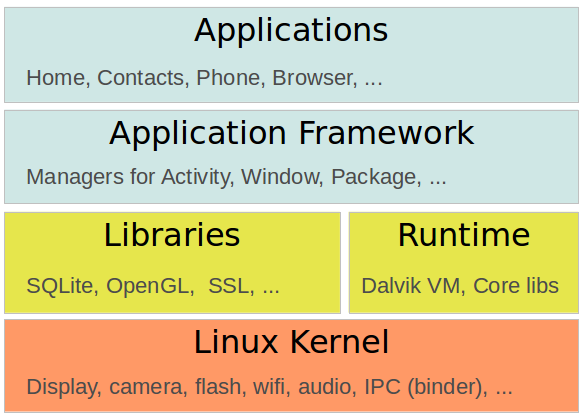

# Android Development #
## Tutorial Link ##
1. [http://www.vogella.com/tutorials/android.html](http://www.vogella.com/tutorials/android.html)

## Android development starter tutorials ##
### Introduction to Android development with Android Studio ###
#### High-level overview of Android development ####
##### The Android operating system #####
1. Android is OS based on Linux kernel
	1. Developed in Android Open Source Project (AOSP) lead by Google
	2. Divided into four areas
	
		

	1. Applications - Contains apps, like browser, camera, gallery, music and phone
	2. Application framework - API which allows high-level interactions with Android system
	3. Libraries and runtime - libraries for common framework functions (graphic rendering, data storage, web browsing)
		1. Android runtime + core Java libraries for running Android apps
	4. Linux kernel - communication layer for underlying hardware

##### Android versions #####
1. Available versions:
	1. Oreo - 8.0 - API level 26
	2. Nougat - 7.0 - 7.1.1 - 24-25
	3. Marshmallow - 6.0 - 23
	4. Lollipop - 5.1 - 22
	5. Lollipop - 5.0 - 21
	6. KitKat - 4.4 - 4.4.4 - 16-18
	7. Ice Cream Sandwitch - 4.0.1 - 4.0.4 - 14-15
	8. Honeycomb - 3.2.x - 13
	9. Honeycomb - 3.0 - 3.1 - 11-12
	10. Gingerbread - 2.3 - 2.3.7 - 9-10
	11. Froyo - 2.2.x - 8
	12. Eclair - 2.1 - 7
	13. Donut - 1.6 - 4
	14. Cupcake - 1.5 - 3
	15. (no code name) - 1.1 - 2
	16. (no code name) - 1.0 - 1

##### Android application #####
1. Android application - single installable unit (used independently)
	1. It has
		1. Configuration files
		2. Java source
		3. Java resource files
	2. Components of configuration files
		1. 

##### Configuration via the manifest file #####

#### Using Android devices for testing ####
##### Using a real Android device for testing #####
##### Using the Android emulator and Android Virtual Device #####

#### Android Studio overview and installation ####
##### Android Developer Tools and Android Studio #####
##### System requirements #####
##### Download and intallation of Android Studio #####
###### Installation of the Intel emulator on Windows ######
###### Installation of the Intel emulator on Linux ######
##### Installation of Android SDKs #####

#### Exercise: Getting started with Android Studio ####
##### Creation of a new Android project #####
##### Review the generated project #####
##### Creation of virtual device (AVD) #####
##### Start the application on your virtual device #####

#### Using views and view groups to design the user interface ####
##### Views - The widgets in Android #####
##### Overview of Android layout managers #####
###### ConstraintLayout ######
###### FrameLayout ######
###### LinearLayout ######
###### RelativeLayout ######
###### GridLayout ######
##### ScrollView #####

#### Resources ####
##### Resource files #####
##### Resource files and R.java #####
##### Layout files #####
##### Performance considerations with layouts #####
##### Good practices for resources IDs #####
##### System resources #####
##### References to resources in code #####
##### Accessing views from the layout in an activity #####
##### Reference to resources in XML files #####
##### Using assets? #####

#### Exercise: Your first view interaction ####
##### Review generated layout #####
##### Adjust views #####
##### Display text from your user field as a popup #####

#### Exercise: Adding radio buttons ####
##### Add radio group and radio buttons to you layout #####
##### Add the selected button on your Toast #####
##### Validating #####

#### Exercise: Using resources in XML files and in code ####
##### Add images to your application #####
##### Add widgets to display images to your layout #####
##### Replace images via radio button selection #####
##### Validating #####

#### Exercise: Creation of temperature converter ####
##### Creation of Project #####
##### Creation of attributes #####
##### Creation of layout #####
##### Edit view properties #####
##### Creation of utility class #####
##### Change the activity code #####
##### Start the application #####

#### Deployment ####
##### How to deploy #####
##### Defining software and hardware requirements for the application #####
##### Signing your application for the release #####
##### Export your application via Android Studio #####
##### Export your application via the Eclipse IDE #####
##### Via external sources #####
##### Google Play #####

#### Appendix Important entries in the Android manifest file ####
##### Declaration of version, package and Android components #####
##### Minimum and target SDK #####
##### Permissions #####
##### Required device configuration #####
##### Installation location #####
##### More info #####

#### About this website ####
#### Android online resources ####
##### Android core resources #####
##### Android learning resources #####
##### Android tools #####
##### vogella GmbH training and consulting support #####

#### Appendix A: Copyright and License ####

### Android Development with Android Studio ###
#### Introduction to Android Studio ####
#### Using Android Studio efficiently ####
#### Using Android Studio ####
#### Java programming tasks ####
#### Working with Git ####
#### Memory monitor ####
#### Using Gradle with the IntelliJ IDE ####
#### Migrating from Eclipse ####
#### About this website ####
#### Using Android Studio Tipps ####
#### Appendix A: Copyright and License ####

### Android Development with Kotlin ###
#### Android and Kotlin ####
#### Exercise: Getting started with Android Studio and Kotlin ####
#### About this website ####
#### Android online resources ####
#### Appendix A: Copyright and License ####

## Android fundamental tutorials ##
### Android Intents ###
#### Starting other Android components via intents ####
#### Data transfer between activities ####
#### Registering for intents via intent filters ####
#### Exercise: Activity communication with intents ####
#### Exercise: Picking an image via an intent ####
#### Exercise: Register an activity as browser ####
#### Exercise: Using different implicit intents ####
#### About this website ####
#### Android Intent resources ####
#### Appendix A: Copyright and License ####

### Android application and activity life cycle ###
#### Managing the application life cycle ####
#### Activity life cycle ####
#### Exercise: Tracing the life cycle with notifications ####
#### Exercise: Using ViewModel ####
#### About this website ####
#### Android ActionBar Resources ####
#### Appendix A: Copyright and License ####

### The Android permissions model ###
#### Security and permissions ####
#### About this website ####
#### Android permissions resources ####
#### Appendix A: Copyright and License ####

### Using lists and grids in Android with RecyclerView ###
#### Android and list or grids ####
#### Exercise: Using RecyclerView in a new Android application ####
#### About this website ####
#### Recycler view resources ####
#### Appendix A: Copyright and License ####

### Using Databinding in Android applications ###
#### Using data binding in Android applications ####
#### Exercise: Using data binding in Android applications ####
#### Exercise: Using data binding for RecyclerView ####
#### About this website ####
#### Android databinding resources ####
#### Appendix A: Copyright and License ####

### Using lists in Android (ListView) ###
#### Using lists in Android ####
#### Android and the ListView widget ####
#### Default adapter ####
#### Custom adapter implementations ####
#### ListActivity and ListFragment ####
#### Exercise: Using ListView and ListActivity ####
#### Exercise: ListActivity and custom layout ####
#### Tutorial: Implementing your customer adapter ####
#### ListViews and performance ####
#### Storing the selection of a view ####
#### Contextual action mode for ListViews ####
#### Implementing undo for an action ####
#### Performance Optimization ####
#### Tutorial: How to display two items in a ListView ####
#### Seleting multiple items in the ListView ####
#### Implementing an expandable ListView ####
#### Tutorial: Miscellaneous ####
#### SimpleCursorAdapter ####
#### Addtitional Open Source libraries ####
#### About this website ####
#### resources_listview ####
#### Appendix A: Copyright and License ####

### Android Logging ###
#### Logging in Android ####
#### About this website ####
#### Links and Literature ####
#### Appendix A: Copyright and License ####

## Using Fragments and the Toolbar ##
### Multi-pane development in Android with Fragments ###
#### Fragments ####
#### Defining and using fragments ####
#### Fragment life-cycle ####
#### Defining fragments for your activity ####
#### Fragments for background processing ####
#### Displaying dialogs with DialogFragments ####
#### Exercise: Using fragments ####
#### Exercise: Fragments depending on the configuration ####
#### Exercise: Use a headless retained fragment to store the state ####
#### Exercise: Using the DialogFragment class ####
#### About this website ####
#### Appendix A: Copyright and License ####

### Using the Android Toolbar (ActionBar) ###
#### Introduction to the toolbar ####
#### Using the toolbar ####
#### Exercise: Using the contextual action mode ####
#### Making the action bar dynamic ####
#### Action provider ####
#### Navigation via the application icon ####
#### Exercise: Using the toolbar ####
#### Exercise: Add a toolbar to your application ####
#### Trigger a method in your fragments via the toolbar ####
#### About this website ####
#### Android ActionBar Resources ####
#### Appendix A: Copyright and License ####

### Using Swipe-to-refresh in Android applications ###
#### Supporting swipe to refresh ####
#### About this website ####
#### Swipe to refresh links ####
#### Apendix A: Copyright and License ####

## Android file and network access and asynchronous processing ##
### Android SQLite database and content provider ###
#### SQLite and Android ####
#### Using Room as SQL object mapping library ####
#### Exercise using Room ####
#### Content provider and sharing data ####
#### Inspecting the database ####
#### About this website ####
#### Android SQLite resources ####
#### Appendix A: Copyright and License ####

### Android XML Processing with the XmlPullParser ###
#### XML processing in Android ####
#### Example for using XmlPullParser ####
#### Prerequisites for the following exercise ####
#### Exercise: Parsing an RSS feed with the XML pull parser ####
#### About this website ####
#### Links and Literature ####
#### Appendix A: Copyright and License ####

### Android Persistence with preferences and files ###
#### File based persistence ####
#### Preferences ####
#### Exercise: Prerequisites ####
#### Exercise: Preference setting for the RSS feed ####
#### Android File API ####
#### About this website ####
#### Links and Literature ####
#### Appendix A: Copyright and License ####

### Android Networking ###
#### Overview of network access on Android ####
#### Web Sockets ####
#### About this website ####
#### Links and Literature ####
#### Appendix A: Copyright and License ####

### Using Retrofit for REST based backends ###
#### Retrofit ####
#### Retrofit converters and adapters ####
#### Retrofit authentication ####
#### Exercise: Using Retrofit to query Gerrit in Java ####
#### Exercise: Using Retrofit to convert XML response from an RSS feed ####
#### Exercise: Build an application for querying StackOverflow ####
#### Exercise: Using Retrofit to access Github API in Android ####
#### Exercise: Using Retrofit with OAuth to request user details from Twitter in Android ####
#### About this website ####
#### Retrofit resources ####
#### Appendix A: Copyright and License ####

### Using RxJava in Android ###
#### Using reactive programming with RxJava 2.0 ####
#### Build blocks for RxJava ####
#### RxJava example ####
#### Creation of Observables, subscribing to them and disposing them ####
#### Caching values of completed observables ####
#### Conversion between types ####
#### RxAndroid ####
#### Exercise: First steps with RxJava and RxAndroid ####
#### Testing RxJava Observables and Subscriptions ####
#### Exercise: Writing unit tests for RxJava ####
#### About this website ####
#### RxJava resources ####
#### Appendix A: Copyright and License ####

### Android background processing with Handlers, AsyncTask and Loaders ###
#### Background processing in Android ####
#### Handler ####
#### AsyncTask ####
#### Background processing and lifecycle handling ####
#### Headless Fragments and background processing ####
#### About this website ####
#### Links and Literature ####
#### Appendix A: Copyright and License ####

### JSON in Android ###
#### Android and JSON ####
#### About this website ####
#### Android JSON links ####
#### Appendix A: Copyright and License ####

## Android Advanced user interface development ##
### Android Architecture with MVP or MVVM ###
#### Android Architecture ####
#### Architectures for Android ####
#### The Model View Presenter architecture for Android ####
#### The Model View View Model architecture for Android ####
#### Using build flavors as architectural style to improve testability ####
#### Using dependency injection as architectural style to improve testability ####
#### Writing tests for the presenter ####
#### Exercise Model View Presenter ####
#### About this website ####
#### Android Architecture resources ####
#### Appendix A: Copyright and License ####

### Downloading and handling images in Android applications with Glide ###
#### Google Glide for image processing ####
#### Exercise - Using Glide to download images into your RecyclerView ####
#### About this website ####
#### Links and Literature ####
#### Appendix A: Copyright and License ####

### Android - Using drag and drop in your application ###
#### Android drag and drop ####
#### Exercise: Drag and drop ####
#### About this website ####
#### Links and Literature ####
#### Appendix A: Copyright and License ####

### Android Drawables ###
#### What are Drawables? ####
#### Using drawables for views ####
#### Loading Bitmaps and Drawables ####
#### XML Drawables ####
#### Vector drawables ####
#### Animation Drawables ####
#### 9 Patch Drawables ####
#### Custom Drawables ####
#### Exercise: Creation of Custom rounded corner drawable ####
#### About this website ####
#### Android Drawables resources ####
#### Appendix A: Copyright and License ####

### Understanding Androids Parcelable ###
#### Understanding Parcelable in Android ####
#### Using Auto-Value to generate Parcelable implementations ####

### Android styles and themes ###
#### Android interface design principles ####
#### Using styles and themes in your application ####
#### Using Android platform themes ####
#### Exercise: Using and defining themes ####
#### About this website ####
#### Android Styling resources ####
#### Appendix A: Copyright and License ####

### Android Live Wallpaper ###
#### Pre-requisitions ####
#### Overview ####
#### Android Wallpaper Example ####
#### About this website ####
#### Links and Literature ####
#### Appendix A: Copyright and License ####

### Android (Home screen) Widgets ###
#### Prerequisites ####
#### Android Widgets ####
#### Creation of Broadcast receiver for the widget ####
#### Widget updates ####
#### Exercise: widget with fixed update interval ####
#### Collection View Widgets ####
#### Enabling an app widget for the lock Screen ####
#### Exercise: Update widget via a service ####
#### About this website ####
#### Appendix A: Copyright and License ####

### Creation of custom and compound Views in Android ###
#### Custom Views ####
#### Compound Views ####
#### Creation of custom views ####
#### Life cycle of an Android view ####
#### Define additional attributes for your custom Views ####
#### Exercise: Creation of a compound view ####
#### Canvas API ####
#### Example for custom view ####
#### About this website ####
#### Custom view resources ####
#### Appendix A: Copyright and License ####

### Android resource selectors ###
#### Resources and Android device configurations ####
#### Defining the size of UI components in layout files ####
#### Fragments ####
#### About this website ####
#### Resources Supporting different screen sizes ####
#### Appendix A: Copyright and License ####

### Using animations in Android application ###
#### Android Animations ####
#### Android Basics ####
#### Exercise: Using the properties animations API ####
#### Activity animations in Android with shared views ####
#### About this website ####
#### Android Animation Resources ####
#### Appendix A: Copyright and License ####

## Android services, Broadcast receiver and notification manager ##
### Android Services ###
#### Android Services ####
#### Defining custom services ####
#### IntentServices for one time tasks ####
#### Communication with services ####
#### Scheduling service ####
#### Exercise: Using services and service communication ####
#### Exercise: Define and consume local service ####
#### About this website ####
#### Links and Literature ####
#### Appendix A: Copyright and License ####

### Scheduling of tasks with the Android JobScheduler ###
#### Scheduling taks ####
#### Exercise: Preparation ####
#### Exercise: Use JobScheduler from a receiver ####
#### About this website ####
#### Links and Literature ####
#### Appendix A: Copyright and License ####

### Android BroadcastReceiver ###
#### Broadcast receiver ####
#### System broadcasts ####
#### Automatically starting Services from Receivers ####
#### Exercise: Register a receiver for incoming phone calls ####
#### Exercise: System services and receiver ####
#### Dynamic broadcast receiver registration ####
#### About this website ####
#### Links and Literature ####
#### Appendix A: Copyright and License ####

### Android Notifications ###
#### Notification Manager ####
#### Example: NotificationManager ####
#### About this website ####
#### Links and Literature ####
#### Appendix A: Copyright and License ####

### Android memory and performance optimization ###
#### Programming tips for providing highly responsive and fast Android applications ####
#### Handling bitmaps ####
#### Using caches ####
#### About this website ####
#### Links and Literature ####
#### Appendix A: Copyright and License ####

## Android dependency injection, testing and tools ##
### Unit Testing with JUnit ###
#### The purpose of software tests ####
#### Testing terminology ####
#### Using JUnit ####
#### Using JUnit 4 ####
#### Eclipse support for JUnit 4 ####
#### Installation of JUnit ####
#### Setting Eclipse up for using JUnits static imports ####
#### Exercise: Using JUnit ####
#### Mocking ####
#### Overview of JUnit 5 ####
#### Comparison of annotations between JUnit 4 and 5 ####
#### About this website ####
#### JUnit Resources ####
#### Appendix A: Copyright and License ####

### Developing Android unit and instrumentation tests ###
#### Introduction into Android testing ####
#### Android unit testing ####
#### Exercise: Creation of unit test ####
#### Writing tests to run on the Android device ####
#### Exercise: Write Android instrumentation test and use mocking ####
#### More on Android testing ####
#### Testing Android components ####
#### Application testing ####
#### Exercise: Testing and Android application ####
#### Creation of code coverage report ####
#### Using the Monkey tool for creation of random event stream ####
#### User interface testing with activities and fragments ####
#### Test folder creation in Android Studio ####
#### About this website ####
#### Android testing resources ####
#### Appendix A: Copyright and License ####

### Unit tests with Mockito ###
#### Prerequisites ####
#### Testing with mock objects ####
#### Adding Mockito as dependencies to a project ####
#### Using the Mockito API ####
#### Exercise: Write an instrumented unit test using Mockito ####
#### Exercise: Creation of mock objects using Mockito ####
#### Using PowerMock with Mockito ####
#### Using a wrapper instead of Powermock ####
#### About this website ####
#### Mockito resources ####
#### Appendix A: Copyright and License ####

### Using Hamcrest for testing ###
#### Purpose of the Hamcrest matcher framework ####
#### Making the Hamcrest library available ####
#### Using Hamcrest ####
#### Exercise - Using Hamcrests built-in matchers ####
#### Exercise - Writing a custom Hamcrest matcher using FeatureMatcher ####
#### Exercise - Writing your custom Hamcrest matcher using TypeSafeMatcher ####
#### Exercise - Combining matchers ####
#### Grouping your matchers for import ####
#### About this website ####
#### Appendix A: Copyright and License ####

### Testing with AssertJ assertions ###
#### Introduction to AssertJ ####
#### Benefits of using AssertJ ####
#### Using AssertJ ####
#### Usage of AssertJ ####
#### Converting JUnit assertions to AssertJ with a script ####
#### Exercise: Creation of custom assertion for a class ####
#### Using AssertJ Android ####
#### About this website ####
#### AssertJ resources ####
#### Appendix A: Copyright and License ####

### Android user interface testing with Espresso ###
#### The Espresso test framework ####
#### Making Espresso available ####
#### Exercise: A first Espresso test ####
#### More on writing Espresso unit tests ####
#### Mocking intents with Espresso Intents ####
#### Exercise: Creation of custom Expresso matcher ####
#### Exercise: Write a test for an intent with Espresso ####
#### Exercise: functional test for activites ####
#### Exercise: Testing asynchronous code with Espresso ####
#### About this website ####
#### Appendix A: Copyright and License ####

### AndroidTestingUIAutomator ###
#### Cross-component blackbox user interface testing ####
#### Making UI Automator available ####
#### Exercise UI Automator ####
#### About this website ####
#### Android testing resources ####
#### Appendix A: Copyright and License ####

### Android user interface testing with Robotium ###
#### Robotium ####
#### Installation of Robotium ####
#### Example Robotium tests ####
#### Robotium API ####
#### Executing tests ####
#### Exercise: Write Robotium tests ####
#### About this website ####
#### Links and Literature ####
#### Appendix A: Copyright and License ####

### Using Dagger 2 for dependency injection in Android ###
#### Introduction to the concept of dependency injection ####
#### Dependency injection with Dagger 2 ####
#### Exercise: Dependency injection with Dagger 2 ####
#### Dagger 2 and Android ####
#### Exercise: Dependency injection in Android activities with Dagger 2 ####
#### Replacing @Module classes in tests ####
#### About this website ####
#### Dagger resources ####
#### Appendix A: Copyright and License ####

### Using Dagger 2 for dependency injection in Android ###
#### Introduction to the concept of dependency injection ####
#### Dependency injection with Dagger 2 ####
#### Exercise: Dependency injection with Dagger 2 ####
#### Dagger 2 and Android ####
#### Exercise: Dependency injection in Android activities with Dagger 2 ####
#### Replacing @Module classes in tests ####
#### About this website ####
#### Dagger resources ####
#### Appendix A: Copyright and License ####

### Android application (performance and more) analysis tools ###
#### Overview ####
#### Android Basics ####
#### StrictMode ####
#### Developer Settings ####
#### Traceview ####
#### Exercise: Traceview ####
#### Hierarchy Viewer ####
#### Exercise: Hierarchy Viewer ####
#### Layout optimization ####
#### Memory Dumps ####
#### Systrace ####
#### Simulating pixel density ####
#### Android templates ####
#### Profile GPU rendering ####
#### Analyzing Overdraw ####
#### Useful open source tools for application analysis ####
#### About this website ####
#### Android Animation Resources ####
#### Appendix A: Copyright and License ####

### Using the Android Debug Bridge (adb) ###
#### Android Debugging Bridge - adb ####
#### Using adb ####
#### Uninstall an application via adb ####
#### Telnet to your Android device ####
#### Getting system information with command line tool dumpsys ####
#### About this website ####
#### Android adb resources ####
#### Appendix A: Copyright and License ####

## Buidling Android applications ##
### Building Android applications with Gradle ###
#### Gradle for building Android applications ####
#### Building different flavors of your Android applications ####
#### Optional exercise: Using different product flavors for apps ####
#### Customize Gradle build ####
#### Migrating an Android project created using Eclipse to Gradle ####
#### About this website ####
#### Android Gradle build links ####
#### Appendix A: Copyright and License ####

### Using the Jenkins build server to build Android apps ###
#### How to build your Android application with Jenkins ####
#### About this website ####
#### Jenkins Android resources ####
#### Appendix A: Copyright and License ####

## Location API and Google services ##
### Android Location API ###
#### Android Location API ####
#### Using GPS and setting the current location ####
#### Tutorial: Using the Android Location API ####
#### About this website ####
#### Links and Literature ####
#### Appendix A: Copyright and License ####

### Google Maps Android API v2 ###
#### Android Basics ####
#### Google Maps ####
#### Install Google Play services ####
#### Getting the Google Map key ####
#### Tutorial: Google Maps ####
#### About this website ####
#### Links and Literature ####
#### Appendix A: Copyright and License ####

### Android Data Backup ###
#### Android Data Backup ####
#### Exercise: Implementing a data backup of application settings ####
#### About this website ####
#### Android Animation Resources ####
#### Appendix A: Copyright and License ####

### Using the Firebase database backend ###
#### Firebase database ####
#### Configure firebase ####
#### Integrating into your application ####
#### Access ####
#### Creation of new project ####
#### Configure firebase ####
#### Integrating into your application ####
#### About this website ####
#### Firebase links ####
#### Appendix A: Copyright and License ####

### Android Cloud to Device Messaging (C2DM) ###
#### Cloud to device messaging ####
#### Implementation Steps ####
#### Device and Registration ####
#### Tutorial: Creation of your C2DM enabled application ####
#### Tutorial: Using command line tool curl to simulate the server ####
#### Tutorial: Creation of your server application ####
#### About this website ####
#### Links and Literature ####
#### Appendix A: Copyright and License ####

## Android Sensors and Touch ##
### Android Camera API ###
#### Android Camera ####
#### Android Basics ####
#### Tutorial: Using an Intent to make a photo ####
#### Tutorial: Using the camera API ####
#### About this website ####
#### Links and Literature ####

### Android Sensor ###
#### Android Sensors ####
#### Tutorial: Accelerometer ####
#### Tutorial: Building a compass ####
#### About this website ####
#### Links and Literature ####
#### Appendix A: Copyright and License ####

### Handling single and multi touch on Android ###
#### Android Touch ####
#### Prerequisites ####
#### Exercise: Custom view and touch events ####
#### Exercise: Multitouch ####
#### Exercise: Using ScaleGestureDetector ####
#### About this website ####
#### Links and Literature ####
#### Appendix A: Copyright and License ####

### Android Gestures ###
#### Android Gestures ####
#### Example ####
#### About this website ####
#### Links and Literature ####
#### Appendix A: Copyright and License ####

## Android Library Projects ##
### Android Support Library ###
#### Using the support libraries from Google ####
#### Remove usage of the support library from a new project ####
#### About this website ####
#### Android ActionBar Resources ####
#### Appendix A: Copyright and License ####

#### Using the support libraries from Google ####
#### Remove usage of the support library from a new project ####
#### About this website ####
#### Android ActionBar Resources ####
#### Appendix A: Copyright and License ####

### Creation of libraries for Android applications ###
#### Android library projects and Java libraries ####
#### Custom Android library modules ####
#### Prerequisite ####
#### Exercise: Creation of an Android library module ####
#### Exercise: Deploy a library project ####
#### About this website ####
#### Android library resources ####
#### Appendix A: Copyright and License ####

### Using Retrofit as REST client ###
#### Retrofit ####
#### Retrofit converters and adapters ####
#### Retrofit authentication ####
#### Exercise: Using Retrofit to query Gerrit in Java ####
#### Exercise: Using Retrofit to convert XML response from an RSS feed ####
#### Exercise: Build an application for querying StackOverflow ####
#### Exercise: Using Retrofit to access Github API in Android ####
#### Exercise: Using Retrofit with OAuth to request user details from Twitter in Android ####
#### About this website ####
#### Retrofit resources ####
#### Appendix A: Copyright and License ####

### Using RxJava 2 for reactive programming ###
#### Using reactive programming with RxJava 2.0 ####
#### Build blocks for RxJava ####
#### RxJava example ####
#### Creation of Observables, subscribing to them and disposing them ####
#### Caching values of completed observables ####
#### Conversion between types ####
#### RxAndroid ####
#### Exercise: First steps with RxJava and RxAndroid ####
#### About this website ####
#### RxJava resources ####
#### Appendix A: Copyright and License ####

### Using AutoValue to generated immutable value classes ###
#### Using AutoValue and its extensions ####
#### Exercise: Use auto-value-parcel to build a Parcelable for Android ####
#### AutoValue resources ####
#### Appendix A: Copyright and License ####

### Useful Android libraries ###
#### Useful Android library projects ####
#### Libraries ####
#### Code example repositories ####
#### About this website ####
#### Links and Literature ####
#### Appendix A: Copyright and License ####

### Using the Otto Event Bus library on Android ###
#### Otto as event bus system ####
#### Exercise: Using Otto the event bus system ####
#### About this website ####
#### OkHttp resources ####
#### Appendix A: Copyright and License ####

## Special Android Programming Topics ##
### Handling Media with Android ###
#### Android Sound and Media ####
#### Prerequisites ####
#### Tutorial: Play sounds via SoundPool ####
#### Tutorial: Record media via MediaRecorder ####
#### About this website ####
#### Links and Literature ####
#### Appendix A: Copyright and License ####

### Android Source Code - Notes ###
#### Getting the Android source code ####
#### Installation of the required tools ####
#### Cloning Android source code ####
#### The Android Development Tools (ADT) ####
#### About this website ####
#### Android Resources ####
#### Appendix A: Copyright and License ####

### Android Internals ###
#### Android Development ####
#### Internals ####
#### About this website ####
#### Links and Literature ####
#### Appendix A: Copyright and License ####

### Android Calendar API ###
#### Calendar API ####
#### About this website ####
#### Links and Literature ####
#### Appendix A: Copyright and License ####