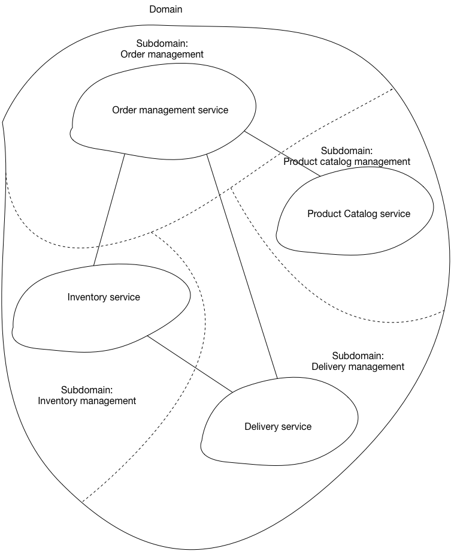

# Pattern: Decompose by Subdomain Context #
1. [Microservice architecture](https://microservices.io/patterns/microservices.html)
	1. It structures application into loosely coupled services
	2. Goal of microservices architecture
		1. Accelerate software development by enabling continuous delivery/ deployment
2. Successful Software Development

	
	
3. Microservices architecture does it in two ways
	1. Simplifies testing
	2. Enables components to be deployed independently
	3. Structures engineering organization as a collection of small (6 - 10 members)
		1. Autonomous teams
			1. Each of the teams is responsible for one or more services
4. Note: Benefits are not automatically guaranteed
	1. Benefits can be achieved by careful functioanl decomposition of application into services
		1. Service must be small enough to be developed by small team
		2. Service must be easily testable
	2. How to achieve that?
		1. Single Responsibility Principle (SRP)
			1. There must be only one reason for a class to change
			2. SRP can be applied to service design
				1. A service can be cohesive and can implement small set of strongly related functions
5. Application can be decomposed in a way that most new and changed requirements only affect single service
	1. Changes that affect multiple services requires coordination across multiple teams
		1. This slows down development
6. Common Closure Principle (CCP)
	1. Classes that change for the same reason should be in the same package
		1. Two classes might implement different aspects of the same business rule
			1. If business rule changes, developers need to change code in small numbers
				1. Ideally only one of the packages

## Problem ##
1. How to decompose application into services?

## Forces ##
1. Architecture must be stable
2. Services must be cohesive
	1. Service should implement small set of strongly related functions
3. Services must confirm to Ccmmon Closure Principle
	1. Things that change together must be packaged together
		1. To ensure that each change affects only one service
4. Services must be loosely coupled
	1. Each service (as an API) encapsulates its implementation
		1. Implementation can be changed without affecting clients
5. Service should be testable
6. Each services should be small enough to be developed by a "two pizza" team
	1. 6 - 10 people
7. Each team that owns one or more services must be autonomous
	1. Team must be able to develop and deploy services with minimal collaboration with other teams

## Solution ##
1. Define services corresponding to Domain-Driven Design (DDD) subdomains
	1. DDD - refers to application problem space
		1. Business as the domain
		2. Sub-domains - domain consists of sub-domains
			1. Each sub-domain corresponds to a different part of business
2. Sub-domains can be classified as
	1. Core - key differentiator for business and most valuable part of application
	2. Supporting - related to what business does
		1. It is not a differentiator
			1. It can be developed in-house or outsourced
	3. Generic - not specific to business
		1. Ideally implemented using off the shelf software

## Examples ##
1. Subdomains of online store
	1. Product catalog
	2. Inventory management
	3. Order management
	4. Delivery management
2. Architecture

	

## Resulting Context ##
1. Pattern has following benefits
	1. Stable architecture since subdomains are relatively stable
	2. Dev teams are cross-functional, autonomous, organized around delivering business value rather than technical features
	3. Services are cohesive and loosely coupled

## Issues ##
1. Following issues to address
	1. **How to identify subdomains?**
		1. This requires an understanding of the business
			1. Business capabilities
			2. Analyzing business and organizational structure
			3. Identifying different areas of expertise
		2. Process of identification:
			1. Iterative process
		3. Good starting points
			1. Organization structure - different groups within organization might correspond to subdomains
			2. High-level domain model - subdomains mostly have a key domain object

## Related Patterns ##
1. [Decompose by business capability](https://microservices.io/patterns/decomposition/decompose-by-business-capability.html) - alternative