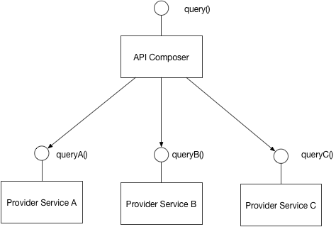

# Pattern: API Composition #
## Context ##
1. After applying [Microservices Architecture Pattern](https://microservices.io/patterns/microservices.html) and [Database per service pattern](https://microservices.io/patterns/data/database-per-service.html)

## Problem ##
1. How to implement queries in microservice architecture?

## Solution ##
1. Define API composer - it invokes services that own data and performs an in-memroy join of results

	

## Example ##
1. An [API Gateway](https://microservices.io/patterns/apigateway.html) often does API composition

## Resulting Context ##
1. Advantages
	1. A simple way to query data in microservices architecture
2. Disadvantages
	1. Some queries result in inefficient, in-memory joins of large datasets

## Related Patterns ##
1. [Database per Service Pattern](https://microservices.io/patterns/data/database-per-service.html) - initiated the need for this pattern
2. [CQRS Pattern](https://microservices.io/patterns/data/cqrs.html) - an alternative solution