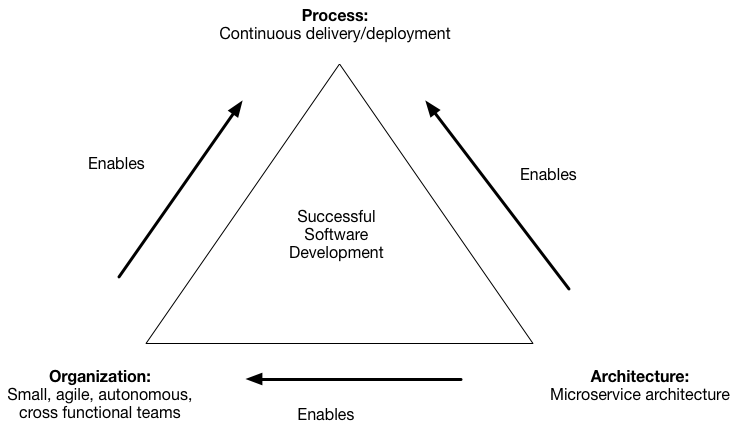

# Pattern: Decompose By Business Capability #
## Context ##
1. Suppose we are developing a large complex app and we want to use [microservice architecture](https://microservices.io/patterns/microservices.html)
	1. microservices architecture - structures application as a set of loosely coupled services
	2. Goal of microservices architecture
		1. Accelerate software development by enabling continuous delivery/ deployment
2. Architecture:

	

3. Microservices architecture benefits
	1. Simplifies testing
	2. Enables components to be deployed independently
	3. Structures engineering team as a collection of small (6-10 members)
	4. Enables each team to be autonomous and responsible for one or more services
4. Caveat - the benefits are not automatically guaranteed
	1. This needs careful functional decomposition of the application into services
		1. Each services must be small enough to be
			1. Developed by a small team
			2. Easily tested
	2. A guideline
		1. Single Responsibility Principle ([SRP](http://www.objectmentor.com/resources/articles/srp.pdf))
			1. If class is the component under consideration
				1. There should be only one reason for the class to change
			2. The princple can be used for service as well
				1. Design service to be cohesive and implement small set of strongly related functions
		2. Decompose in such a way that most new and changed requirements only affect single service
			1. Reason: Changes that affect multiple services requires coordination across multiple teams
				1. This slows down development
		3. Common Closure Principle (CCP)
			1. OOD - classes that change for the same reason should be in the same package
				1. Two classes might be implementing different aspects of same business rule
					1. Reason: If a business rule changes, developers need to change only in small number of packages (ideally only one)
			2. The princple can be extended to services
				1. Each change should impact only one service

## Problem ##
1. How to decompose an application into services?

## Forces ##
1. Architecture must be stable
2. Services must be cohesive
	1. Service should implement small set of strongly related functions
3. Services must confirm to Common Closure Principle (CCP)
	1. Things that change together should be packaged together
		1. This ensures that each change affects only one service
4. Services must be loosely coupled
	1. Each service API encapsulates its implementation
		1. Implementation can be changed without affecting clients

## Solution ##
## Examples ##
## Resulting Context ##
## Issues ##
## Related Patterns ##