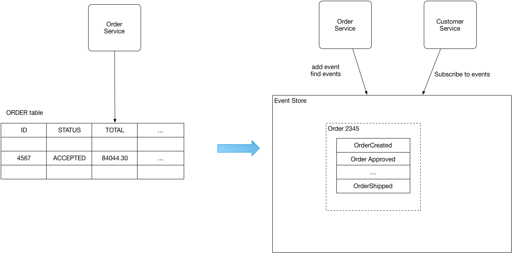

# Pattern: Event Sourcing #
## Context ##
1. Service command might need to update database
2. To do so service sends messages/ events
3. Example:
	1. Service wants to automatically update database and sends messages/ events
	2. Service that publishes domain event must automatically update an aggregate and publish an event
4. Database update and sending messages must be automatic
	1. To avoid data inconsistencies and bugs
		1. It is not viable to use distributed transaction that spans the database **and** message broker to automatically update database and publish messages/events

## Problem ##
1. How to reliably/ automatically update database and publish messages/events?

## Forces ##
1. 2PC is not an option (?)

## Solution ##
1. Event sourcing
	1. Persists state of business entity (such as Order or Customer) as a sequence of state-changing events
		1. Whenever state of business entity changes, new event is appended to list of events
			1. Saving of event is a single operation (it is inherently atomic)
		2. Application re-constructs an entity's current state by replaying the events
	2. Application persists event in event store (which is database of events)
		1. store has API to add and retrieve entity's events
		2. store also behaves like a message broker
			1. An API is provided that enables services to subscribe to events
			2. When service saves event in event store, it is delivered to all interested subscribers
	3. Some entities (Customer say) can have large number of events
		1. To optimize loading:
			1. Application can periodically save a snapshot of an entity's current state
				1. To re-construct current state, application finds most recent snapshot and events that have occurred since the snapshot (only fewer events to replay) 

## Example ##
1. [Customers and Orders](https://github.com/eventuate-examples/eventuate-examples-java-customers-and-orders) - application built using Event Sourcing and [CQRS](https://microservices.io/patterns/data/cqrs.html)
	1. [Eventuate](http://eventuate.io/)
2. Example:

	
	
3. Instead of storing current state of each order as a row in **ORDERS** table
	1. Application persists each Order as sequence of events
	2. CustomerService can subscribe to order events and update it's own state
4. Order aggregate

		public class Order extends ReflectiveMutableCommandProcessingAggregate<Order, OrderCommand> {
			private OrderState state;
			private String customerId;
			
			public OrderState getState() {
				return state;
			}
			
			public List<Event> process(CreateOrderCommand cmd) {
				return EventUtil.events(new OrderCreatedEvent(cmd.getCustomerId(), cmd.getOrderTotal()));
			}
			
			public List<Event> process(ApproveOrderCommand cmd) {
				return EventUtil.events(new OrderApprovedEvent(customerId));
			}
			
			public List<Event> process(RejectOrderCommand cmd) {
				return EventUtil.events(new OrderRejectedEvent(customerId));
			}
			
			public void apply(OrderCreatedEvent event) {
				this.state = OrderState.CREATED;
				this.customerId = event.getCustomerId();
			}
			
			public void apply(OrderApprovedEvent event) {
				this.state = OrderState.APPROVED;
			}
			
			public void apply(OrderRejectedEvent event) {
				this.state = OrderState.REJECTED;
			}
		}
		
5. Event handler (In CustomerService) that subscribes to Order events

		@EventSubscriber(id = "customerWorkflow")
		public class CustomerWorkflow {
			@EventHandlerMethod
			public CompletableFuture<EntityWithIdAndVersion<Customer>> reserveCredit(EventHandlerContext<OrderCreatedEvent> ctx) {
				OrderCreatedEvent event = ctx.getEvent();
				Money orderTotal = event.getOrderTotal();
				String cutomerId = event.getCustomerId();
				String orderId = ctx.getEntityId();
				return ctx.update(Customer.class, customerId, new ReserveCreditCommand(orderTotal, orderId));
			}
		}

## Resulting Context ##
## Related Patterns ##
## See Also ##