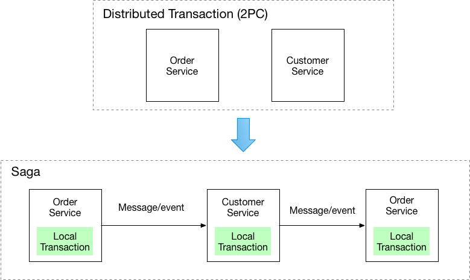
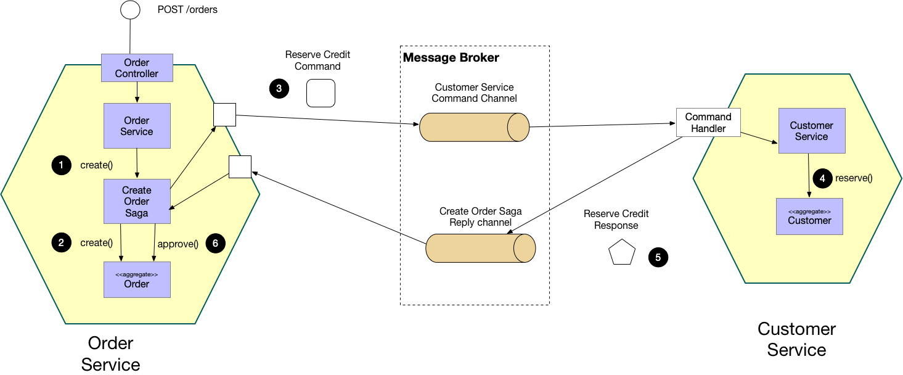

# Pattern: Saga #
## Context ##
1. After applying [Database per Service]() pattern, each service has its own database
2. Some business transactions span multiple services
	1. We need a mechanism to implement transactions that span services
	2. Example: e-commerce store with customers having credit limit
		1. New order must not ensure customer' credit limit
			1. Orders and Customers are in different databases (owned by different services)
				1. Simple ACID transactions cannot be used

## Problem ##
1. How to implement transactions that span services?

## Forces ##
1. 2PC is not an option

## Solution ##
1. Implement business transactions that span multiple services in a saga
	1. Saga: It is a sequence of local transactions
2. Each local transaction updates database and publishes a message or event to trigger next local transaction in the saga
	1. If a local transaction fails because it violates a business rule then
		1. saga executes a series of compensating transactions that undo changes that were made by preceding local transactions

	
	
3. Two ways of coordinating sagas:
	1. Choreaography: each local transaction publishes domain events that trigger local transactions in other services
	2. Orchestration: an orchestrator (object) tells the participants what local transactions to execute

## Example: Choreography-based saga ##

	
	
1. e-commerce application that uses the approach for creation of order could have the following steps:
	1. The **Order Service** receives the **POST /orders** requests and and **Order** is created in a **PENDING** state
	2. It then emits an **Order Created** event
	3. The **Customer Service**'s event handler attempts to reserve credit
	4. It then emits an event indicating the outcome
	5. The **Order Service**'s event handler either approves or rejects the **Order**

## Example: Orchestration-based saga ##

	
	
1. e-commerce application that using the orchestration based saga for creation of order could have the following steps:
	1. The **Order Service** receives the **POST /orders** request and **Create Order** saga orchestrator is created
	2. The saga orchestrator instantiates and **Order** in the **PENDING** state
	3. It then sends a **Reserve Credit** command to the **Customer Service**
	4. The **Customer Service** attempts to reserve credit
	5. It then sends back a reply message indicating the outcome
	6. The saga orchestrator either approves or rejects the **Order**

## Resulting Context ##
1. Advantages
	1. Enables application to maintain data consistency across multiple services without using distributed transactions
2. Disadvantages
	1. Programming model is more complex
		1. Example: Developer must design compensating trnasactions that explicitly undo changes made earlier in a saga
3. Other issues to address
	1. To be reliable, service must automatically update it's database and publish a message / event.
		1. Traditional mechanism of distributed transaction that spans database and message broker cannot be used
			1. **One of the patterns listed below must be used instead**

## Related Patterns ##
1. Database per service pattern - initiates the need for this pattern
2. Patterns used to atomically update stte and publish messages/ events:
	1. Event sourcing
	2. Transactional Outbox
3. Choreography-based saga can publish events using Aggregates and Domain events

## Learn More ##
1. Blog posts:
	1. [Overview of Sagas](https://chrisrichardson.net/post/antipatterns/2019/07/09/developing-sagas-part-1.html)
	2. [Saga coordination mechanisms: choreography and orchestration](https://chrisrichardson.net/post/sagas/2019/08/04/developing-sagas-part-2.html)
	3. [Implementing choreography-based sagas](https://chrisrichardson.net/post/sagas/2019/08/15/developing-sagas-part-3.html)
	4. [Implementing orchestration-based sagas](https://chrisrichardson.net/post/sagas/2019/12/12/developing-sagas-part-4.html)
2. [Example application](https://github.com/microservice-patterns/ftgo-application)
	1. [Eventuate Tram Sagas framework](https://github.com/eventuate-tram/eventuate-tram-sagas) - is used
3. [Presentations on sagas and asynchronous microservices](https://microservices.io/presentations)

## Example Code ##
1. [Choreography-based saga](https://github.com/eventuate-tram/eventuate-tram-examples-customers-and-orders) - services publish domain events using [Eventuate Tram framework](https://github.com/eventuate-tram/eventuate-tram-core)
2. [Orchestration-based saga](https://github.com/eventuate-tram/eventuate-tram-sagas-examples-customers-and-orders) - where the **Order Service** uses a saga orchestrator
3. [Choreography and event sourcing-based saga](https://github.com/eventuate-examples/eventuate-examples-java-customers-and-orders) - where services publish domain events using [Eventuate event sourcing framework](http://eventuate.io/)