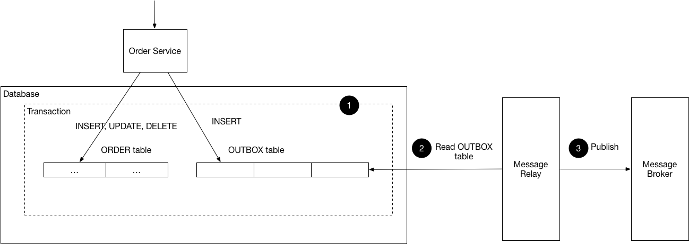

## Pattern: Transactional Outbox ##
### Also Known As ###
1. Application events

### Context ###
1. Service command typically needs to update database and send messages/events
	1. Example: service that participates in Saga needs to atomically update database and send messages/events
2. Service that publishes domain event must atomically update [aggregate](https://microservices.io/patterns/data/aggregate.html) and publish an event
3. Service must atomically update database and send messages to avoid data inconsistencies and bugs
	1. But it is not viable to use traditional distributed transaction (2PC) that spans database and message broker to atomically update database and publish messages/events
		1. Message broker may not support 2PC
		2. If message broker supports 2PC, it is undesirable to couple the service to both database and message
4. Without 2PC, sending message in the middle of tradition is not reliable
	1. No guarantee that transaction will commit
5. If service sends message after committing transaction there's no guarantee that it won't crash before sending message
6. Messages need to be sent to message broker in the order sent by the service
	1. The messages must be delivered to each consumer in the same order (though outside the scope of the pattern)
		1. Example: If aggregate is updated by series of transactions T1 and T2
			1. Transactions might be performed by same service instance or by different service instances
				1. Each transaction publishes an event
					1. T1 -> E1
					2. T2 -> E2
				2. Since T1 precedes T2, E1 must be published before E2

### Problem ###
1. How to reliably and atomically update database and send messages/events?

### Forces ###
1. 2PC is not an option
2. If database trnasaction commits, messages must be sent.
	1. If database rolls back, messages must not be sent
3. Messages must be sent to message broker in order they were sent by service
	1. The ordering must be preserved across multiple service instances that update the same aggregate

### Solution ###
1. Service that uses relational database inserts messages/events into an outbox table (MESSAGE say) as part of local transaction
2. Service that uses NoSQL database appends messages/events to attribute of the record (document or item)
3. Separate *Message Relay* process publishes events inserted into database to message broker

	

### Result Context ###
1. The pattern has the following benefits:
	1. 2PC is not used
	2. Messages are guaranteed to be sent if and only if database transaction commits
	3. Messages are sent to message broker in the order they were sent by the application
2. The pattern has following drawbacks:
	1. Potentially error prone since developer might forget to publish message/event after updating database
3. The pattern has following issues:
	1. Message Relay might publish message more than once
		1. Might crash after publishing message but before recording fact that it has done so
		2. When it restarts, it then publishes message again
	2. Solution:
		1. Message consumer must be idempotent
			1. May be by tracking IDs of messages that it has already processed
				1. But message consumers are usually needed to be idempotent (because message broker can deliver messages more than once) - hence not a problem

### Related Patterns ###
1. The Saga and Domain Event patterns instantiate the need for this pattern
2. Event sourcing - alternative solution
3. Two patterns for implementing message relay:
	1. [Transaction log trailing](https://microservices.io/patterns/data/transaction-log-tailing.html)
	2. [Polling publisher](https://microservices.io/patterns/data/polling-publisher.html)

### Learn More ###
1. [Microservices patterns](https://microservices.io/book) - more details
2. [Eventuate Tram Framework](https://github.com/eventuate-tram/eventuate-tram-core) - implements this pattern