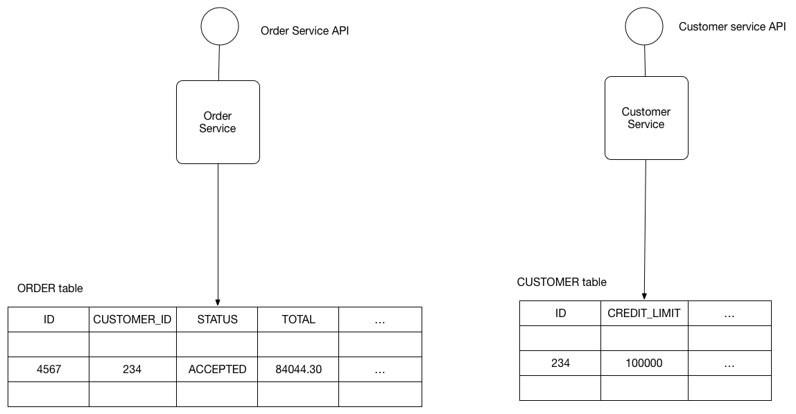

# Pattern: Shared Database #
## Context ##
1. Example: Developing online store application using [Microservices architecture pattern](https://microservices.io/patterns/microservices.html)
	1. **Order Service** stores info about orders
	2. **Customer Service** stores info about customers
2. Example:

	

## Problem ##
1. What's the db architecture of a microservices application?

## Forces ##
1. Services must be loosely coupled
	1. They can be developed, deployed and scaled independently
2. Certain business transactions enforce invariants that span multiple services
	1. Example:
		1. **Place Order** - use case that must verify that new Order will not exceed customer's credit limit
3. Certain business transactions need to query data owned by multiple services
	1. Example:
		1. **View Available Credit Use** must query **Customer** to find **creditLimit** and **Orders** to calculate total amount of open orders
4. Certain queries must join data owned by multiple services
	1. Example:
		1. Finding customers in a region and their recent orders
			1. Join must be performed between **Customers** and **Orders**
5. Dbs must be replicated and sharded at times to scale
	1. [Scale Cube](https://microservices.io/articles/scalecube.html)
6. Services may have different data storage requirements
	1. Certain services might need relational databases
	2. Certain services might need NoSQL databases
		1. MongoDB - good for complex, unstructured data
		2. Neo4J - to store and query graph data

## Solution ##
1. Use single database that is shared by multiple services
2. Each service accesses data owned by other services using local ACID transactions

## Example ##
1. **OrderService** and **CustomerService** access each other's tables
2. Example: **OrderService** can use the following ACID transaction

		BEGIN TRANSACTION
		...
		SELECT ORDER_TOTAL
		FROM ORDERS
		WHERE CUSTOMER_ID = ?
		...
		SELECT CREDIT_LIMIT
		FROM CUSTOMERS WHERE CUSTOMER_ID = ?
		...
		INSERT INTO ORDERS ...
		...
		COMMIT TRANSACTION
		
	1. DB will ensure that credit limit will not be exceeded even when simultaneous transactions attempt create orders for same customer

## Resulting Context ##
1. Advantages
	1. Familiar and straightforward ACID transactions can be used to enforce data consistency
	2. Single db is simpler to operate
2. Disadvantages
	1. Coupling of development time
		1. Developer working on **OrderService** will need to coordinate schema changes with developers of other services that access same tables
			1. Slows down development
	2. Runtime coupling
		1. Services accessing same database can interfere with one another
			1. Suppose long running **CustomerService** transaction holds a lock on **ORDER**  table
				1. **OrderService** will be blocked
	3. Single db might not satisfy data storage and access requirements of all services

## Related Patterns ##
1. [Database per Service](https://microservices.io/patterns/data/database-per-service.html) - alternative approach
