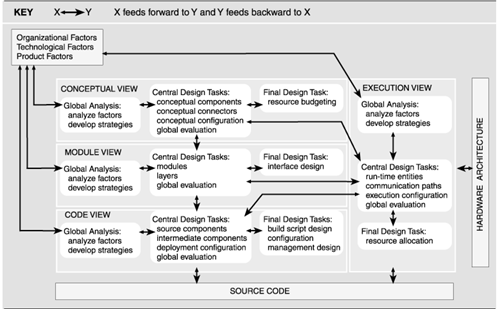
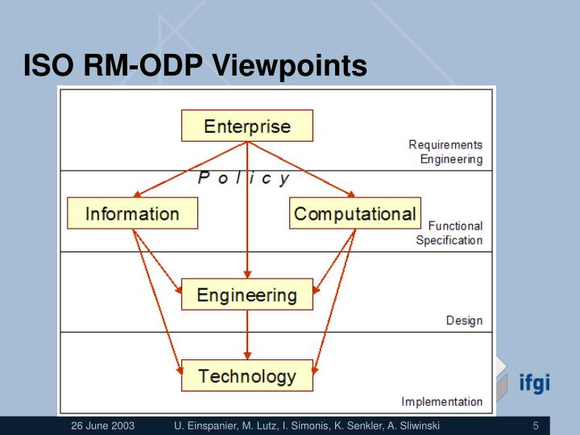
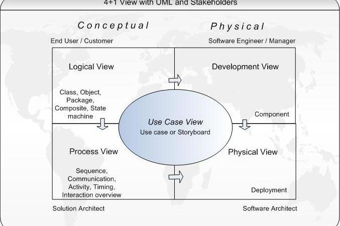

# Software Architecture Lectures #

## What is Architecture ##
1. Example: Web application
	
		Web browser ---- HTTP Server ---- App Server ---- Database
		(1 machine)		(1 machine				                  )
						(1 machine)	      (1 machine)     (1 machine) - better response time, scalability (with users) - cost (more maintenance)

	1. Different architectures
2. Example: Verifying software license number

		license number ---> software ---> server (f(ln))

	1. `f(n)` - simple: table lookup, more users: hash
		1. Can be computed on server
			1. Needs internet connection
		2. Can be computed on software
			1. No need of internet connection (usability is higher)
			2. No tracking (security) where and when it is installed
3. Given a functionality we can implement in different ways
4. Architecture: How to take a software and implement it without changing the functionality
5. Formal Definition: From `Software Architecture in Practice - 2nd Edition` - (Reference book)

	> The software architecture of a program of a computing system is the structure or structures of the system, which comprise software elements, the externally visible properties of those elements, and the relationships among them
	
	1. What is visible externally, (not internals)
	2. The implementation details of a component are not part of architecture
	3. Simple words: components and topology of the connections between them

	> The software architecture of a system is the set of structures needed to reason about the system, which comprise software elements, relations among them, properties of both

	1. We must be able to reason about a system given its components and connections and their properties (both)
		1. Response time
		2. Scalability
		3. Security
6. Non-functional aspects of how the function is computed is part of software architecture (not the functional aspects)
7. ISO/IEC 42010 definition:

	> Fundamental concepts or properties of a system in its environment embodied in its elements, relationships, and in the principles of its design and evolution

	1. Why a component is chosen? (principle of design)
	2. Why a topology is chosen? (principle of design)
	3. Why a connector is chosen? (principle of design)
8. Community definitions: [http://www.sei.cmu.edu/architecture/start/glossary/community.cfm](http://www.sei.cmu.edu/architecture/start/glossary/community.cfm)
9. Home Work
	1. Try to come up with examples to illustrate what is architecture
	2. That is, architect a system in two different ways and figure out in what properties the systems would differ

## Architecture & Design ##
1. Oxford:
	1. Architecture vs. Design
		1. Architecture: The complex or carefully designed structure of something
			- The conceptual structure and logical organization of a computer or computer based system
		2. Design: A plan or drawing produced to show the look and functioning of a building, garment or other object before it is made
			1. Artifacts used in construction
2. Architecture and Design
	1. Verb and noun
	2. All architecture is design but not all design is architecture
		1. Architecture: Deconstructing a system so that certain quality attributes are met
	3. Quality attributes must drive deconstruction of the system (concern is architectural)
	4. Architectural design versus detailed design (smaller components)
3. Architectural styles and Design patterns (interchangeable)
	1. Scope of architecture is Components
	2. Scope of Design in Objects and Classes
4. HW:
	1. Think about what is the granularity of participating artifacts

## Quality Attributes ##
1. To build a system given some requirements
2. Classified into three kinds
	1. Functional requirements
		1. Calculate income tax
	2. Quality attributes
		1. How well the computation is done
			1. Calculate in 5 s max
			2. 10000 people should be able to calculate
	3. Constraints
		1. Has to work with ie
		2. Use Oracle DB engine
		3. Build with Java
3. Non-functional requirements: Quality attributes, constraints
	1. Some definitions of NFR

			Requirements which are not specifically concerned with the functionality of a system. They place restrictions on the product being developed and the devlopment process, and they specify external constraints that the product must meet - Kotanya and Sommerville (1998)

			...global requirements on its development or operational cost, performance, reliability, maintainability, portability, robustness, and the like. ... - Mylopoulos et al. (1992)

4. Among all possible architectures for a given set of requirements,
	1. Features which do not change in all architectures: Functional requirement
	2. Features which do change in any two architectures: Non-functional requirement
5. Example:
	1. Computation performed on client machine (better throughput, executes faster but reduced portability)
	2. More servers (better response)
6. Quality Attributes - Bass, Clements, Kazman
	1. Availability
	2. Interoperability
	3. Modifiability
	4. Performance
	5. Security
	6. Testability
	7. Usability
	8. Others:
		1. Variability
		2. Portability
		3. Development Distributability
		4. Scalability
		5. Elasticity
		6. Deployability
		7. Mobility
		8. Moniterability
7. ISO 25010
	1. A standard for quality dimensions of a system or software product (first edition - 2011-03-01)
	2. Two kinds of quality:
		1. Quality in use model
			1. Relate to the outcome of interaction when a product is used in a particular context of use
			2. Composed of five characteristics (and sub-characteristics)
			3. Quality in use is the degree to which a product or system can be used by specific users to meet their needs to achieve specific goals with effectiveness, efficiency, freedom from risk and satisfaction in specific contexts of use
		2. Product quality model
			1. Relate to static properties of software and dynamic properties of the computer system
			2. Composed of eight characteristics (which are further subdivided into sub-characteristics) that relate to static properties of software and dynamic properties of the computer system
	3. Missing requirements (what the standard does not talk about)
		1. Functional requirements
		2. Compliance (e.g. with laws, standards)
		3. Documentation, Support and Training
		4. Project Timing
		5. Project Budget
	4. 5 Characteristics of In-use quality
		1. Effectiveness
		2. Efficiency
		3. Freedom from risk
			1. Economic risk mitigation
			2. Health and safety risk mitigation
			3. Environmental risk mitigation
		4. Context Coverage
			1. Context Completeness
			2. Flexibility
		5. Satisfaction
			1. Usefulness
			2. Trust
			3. Pleasure
			4. Comfort
	5. Product quality
		1. Usability
			1. Appropriateness Recognisability
			2. Learnability
			3. Operability
			4. User error Protection
			5. User Interface Aesthetics
			6. Accessibility
		2. Performance Efficiency
			1. Time behaviour (how fast or slow is computation performed)
			2. Resource Utilization (how busy does computer system get)
			3. Capacity (how many simultanious tasks (enough capacity to accomodate))
		3. Security
			1. Confidentiality
			2. Integrity
			3. Non-repudiation
			4. Accountability
			5. Authenticity
		4. Functional Suitability
			1. Functional Completeness
			2. Functional Correctness
			3. Functional Appropriateness
		5. Compatibility
			1. Coexistence
			2. Interoperability
		6. Portability
			1. Adaptability
			2. Installability
			3. Replacability
		7. Reliability
			1. Maturity
			2. Availability
			3. Fault Tolerance
			4. Recoverability
		8. Maintainability
			1. Modularity
			2. Reusability
			3. Analysability
			4. Modifiability
			5. Testability
8. HW: Look at an application and classify the requirements into functional and non-functional
	1. Google
		1. Functional: 
			1. Search for links based on keyword
			2. Give closest results to typos
		2. Non-functional:
			1. How fast can I get results
			2. It is free to use
			3. Results are not confusing
			4. I am happy searching

## Tactics: Modifiability ##
1. Modifiability
	1. A large percentage of software cost occurs after release
	2. Ability to make changes
		1. To fix defects
		2. Add new features
		3. Retire old features
		4. New technologies, platforms
	3. Cost and risk in making these changes
2. Tactics
	1. Reduce size of a module
		1. By split module
	2. Increase Cohesion
		1. By increase semantic coherence
	3. Reduce coupling
		1. By
			1. Encapsulate
			2. Use an intermediary
			3. Restrict Dependencies
			4. Refactor
			5. Abstract Common Services
	4. Defer Binding
3. Tactics explained:
	1. Split module
		1. If module becomes very big, break it into smaller modules
	2. Increase Semantic Coherence
		1. Move some responsibilities from one module to another
		2. What responsibilities should stay together can be based on the semantics - similar functions stay together
			1. Activities related to database should sit in one module
			2. Activities related to network should sit in one module
	3. Encapsulate
		1. If module A uses services of module B, make it available through an interface I
			1. This will allow A to be unchanged when module B is - but I needs to be maintained
	4. Intermediary
		1. If the responsibility of module A requires B to be executed, an intermediary can break this dependency
		2. Publish-subscribe: publisher need not know who is subscribing the intermediary handles this
			1. Publishers are decoupled from subscribers
	5. Restrict Dependencies
		1. Reduce data production/consumption between modules - sharing data causes ripple effects
		2. Seen in layered architectures
			1. data must be shared with immediate layers only
	6. Refactor
		1. If the same service is being provided by two modules in two different situations, refactor the code and make them one module
	7. Abstract common services
		1. If services are not quite the same but similar, implement a more generalized service
			1. Example: One service is dealing with strings, the other with integers and third with real number, then abstract all three into one service
	8. Defer Binding Time
		1. Reduce time to deploy changes
		2. Non developers to make changes (end users say or system administrators)
			1. System administrator:
				1. Make settings or provide input that affects behavior
				2. Examples:
					1. Compile time: parameters
						1. CPU
						2. Space alocated to file
					2. Boot time: configuration files
						1. Size of database server
					3. Runtime: dynamic lookup
						1. screen saver
4. HW: Mull over Modifiability tactics - look for examples and some new tactics?

## Tactics: Building Quality Attributes Into Software ##
1. Reference: Software Architecture in Practice - Bass, Clements, Kazman 3rd Edition
2. What are tactics:
	1. Design is a collection of decisions
		1. Some achieve functionality
		2. Other control quality
	2. Tactics are design options for architect to achieve quality
	
			stimulus -> Use tactics to control the response -> response

		1. stimulus: Query say
		2. response: 

3. Functional aspect: To put computation is system, table in particular fashion
4. Non-functional aspect: How fast it can respond, how many resources are in the process (partitioning table vertically or horizontally)
5. What is a tactic?
	1. An action carefully planned to achieve a specific end
	2. An architectural tactic is a means of satisfying a quality attribute response measure ..through architectural design decisions
	3. Patterns package tactics!
		1. Strategy: long term
		2. Tactic: short term
6. Design patterns (packaging of certain tactics)
	1. Allows us to achieve multiple qualities
7. Architectural Tactics:
	1. An architectural tactic moves from one architecture to another where a parameter of the quality attribute model moves in a known direction

			A -----> A'
			QAP	---> QAP'

8. Informal characterization of tactics
	1. An architectural pattern is a collection of components and interactions to resolve multiple conflicting forces - Buschmann [1996]
		1. Look for tradeoff between the forces
	2. An architectural tactic is a transformation that will move in the direction of resolving a single quality attribute force
9. Points
	1. Quality requirements drive design
	2. Quality attribute parameters differenctiate one design from another
	3. How does one achieve quality?
		1. Tactics
10. Quality attributes tactics
	1. Availability
		1. Should be there when needed
		2. It is about reliability and recovery
		3. "Availability refers to the ability of a system to mask or repair faults such that the cumulative service outage period does not exceed required values over a specified period of time" - Bass, Clements, Kazman
		4. Linked to
			1. Security: DOS attacks
			2. Performance: if the response is very slow..
		5. Concepts
			1. Detect faults
				1. Ping/Echo
					1. One component issues a ping and expects to recieve back an echo, within a predefined time from the computer under scrutiny (periodically)
				2. Monitor
				3. Heartbeat
					1. One component emits a heartbeat message periodically and another component listens for it (monitor detects)
				4. Timestamp
				5. Sanity Checking
				6. Condition Monitoring
				7. Voting (if we do not have confidence in the responses)
					1. Execute the same functionality in more than one component and take majority voting
						1. Popular in hardware
				8. Exception Detection
				9. Self-test
			2. Recover from Faults
				1. Preparation and repair
					1. Active Redundancy
						1. Run same functionality on several components (pickup value from any of them)
						2. All components respond to events in parallel
							1. A can pick up from B' if B has failed
					2. Passive Redundancy
						1. One component (the primary) responds to events and informs the other component (the secondary) of state updates it must make periodically
							1. A is talking only to B
							2. B' is not taking the computation
							3. B' is periodically updated with the state of B
							4. If B fails, B' is updated with the state and made active
								1. States of B and B' may not be the same
					3. Spare
						1. Standby component configured to replace the failed component
						2. On a fault, a persistence component ensures that the spare is sufficiently fresh before resuming services
							1. Needs construction of the state of B' from persistence component which keeps the state from B
					4. Exception Handling
					5. Rollback
						1. First build a checkpoint (copy of a consistent state created periodically or in a response to some event)
						2. When system fails, state gets inconsistent
						3. Restore the system using a previous check point of a consistent state and from a log of the transactions since then
							1. Preparation: Construction of log
							2. Recovery: Playing the log
					6. Software Upgrade
					7. Retry
					8. Ignore Faulty Behavior
					9. Degradation
					10. Reconfiguration
				2. Reintroduction
					1. Shadow (if we are not sure if the component has come to full speed (with datbase))
						1. Run previously failed component in shadow mode for a while to make sure it is working properly before resuming its services
					2. State Resynchronization
						1. Part of Passive redundancy when the components need to be synchronized. How often should they be synchronized and in what size are the issues dealt with in this tactic
					3. Escalating Restart
					4. Non-stop Forwarding
			3. Prevent faults
				1. Removal from Service:
					1. A component is temporarily removed from service and undergoes some activities to prevent anticipated failures
						1. Ex: rebooting a component to prevent memory leaks
				2. Transactions: (prevents system from going into inconsistent state)
					1. Bunder several sequential steps such that the bundle can be undone together
					2. Prevents any data to be affected if a component fails
					3. All or none
				3. Pedictive Model
				4. Exception Prevention
				5. Increase Competence Set
	2. Modifiability
	3. Performance
	4. Security
	5. Testability
	6. Usability
11. HW: Look for examples for tactic of Availability

## Patterns ##
1. Patterns: ordered relationship between artifacts
2. Orginitated in Architecture - Christopher Alexander
	1. A pattern launguage: Towns, Buildings, Construction, 1977
	2. The Timeless Way of Building, 1979
3. Beck and Cunningham, 1987, Object-Oriented Design
4. Design Patterns, Elements of Reusable Software, 1994, Eric Gamma, Richard Helm, Ralph Johnson, John Vlissides
5. Design Pattern (Wikipedia):
	1. A general **reusable** solution to a **commonly occurring problem** within a given context in software design
		1. Not a finished design that can be transformed directly into code
		2. Description/template to solve a problem that can be used in many different situations (formalization of best practices)
		3. Formalized best practices
6. Code reuse:
	1. It is a function of specification size and code size - If a component takes x time to explain and y time to build it - y/x indicates whether it is going to be reused
		1. Example: Database engine: x is very low, y is very high so very likely to be re-used
7. Architecture pattern (Bass, Clements, Kazman)
	1. A package of design decisions repeatedly found in practice
	2. Has known properties that permit re-use
	3. Describes a class of architectures
8. Tactics and Patterns
	1. Patterns are more complex than tactics
	2. Tactics address a single architectural force and use a single structure or mechanism
	3. Tactics can be used to build patterns
	4. Pattern typically packages several tactics
9. Definition:
	1. A context: Recurring situation that gives rise to a problem
	2. A problem: What is being attempted to solve and its variants - includes quality attributes
	3. Solution: The architecture that solves the problem
10. Solution may use multiple patterns
11. Incomplete list of petterns
	1. Broker
		1. Client sends a request to broker (client does not know about server)
		2. Broker requests where request should go (proxy)
			1. It can also control the access
		3. Broker forwards request to appropriate server
	2. MVC
		1. View: presentation of results of a computation
			1. Different views can exist for same result (model)
		2. Controller: User manipulates the controlls
		3. Model: Model (has business logic and updates itself)
	3. Pipe and Filter
		1. Filter: computational component, takes input and outputs
		
				-> filter -pipe-> filter -pipe-> filter ->
		
			1. Example: Compiler
		
					Code -> Parsing -> Semantic -> Code generation -> Optimization -> machine code

					SQL -> Parser -> Permission checker -> Optimizer -> Access Path Selector -> SQL server code
		
	4. Client-Server
		1. Server: serves clients
		2. Client: requests for service
	5. Peer-to-Peer
	6. Service-Oriented
	7. Publish-Subscribe
		1. Example: Scheduled time tables of railways, airlines, ... (may change dynamically)
			1. Websites use schedules (MakemyTrip, ...) (subscriber)
			2. Subscribers can join an leave
			3. Asynchronization
	8. Shared-data
	9. Layered pattern
	10. Map-reduce
	11. Multi-tier
12. Which tactics used in which design pattern?
	1. Broker: Many of Modifiability tactics - more modifiability
13. HW: Look for patterns in a solution, check if you can use existing pattern in the solution

## Viewsets and Documentation ##
1. Viewsets:
	1. It is a set of "views"
	2. What is a "view"?
	3. What the system looks like from a stakeholder's perspective?
	4. Addressing some concerns of the stakeholder
	5. May be in the form of diagram, a model or even just textual description
2. Typical stakeholders
	1. Client
	2. Acquirer
	3. Owner
	4. User
	5. Operator
	6. Architect
	7. System Engineer
	8. Developer
	9. Designer
	10. Builder
	11. Maintainer
	12. Service Provider
	13. Vendor (who provides a software)
	14. Subcontractor
	15. Planner
3. Concerns
	1. Purpose or missions of the system
	2. Appropriateness of the system for use in fulfilling its missions
	3. Feasibility of constructing the system
	4. Risks of system development and operation to users, acquirers, and developers of the system
	5. Maintainability, dependability, evolvability, ... of the system
4. Each stakeholder looks at each concern and addresses them for the system (view)
	1. Set of views is a viewset
5. Example: 4 + 1 view of architecture (Model of software architecture - Philippe Kruchten Rational Software Corp. IEEE Software November 1995)
	1. Logical view - End-user functionality
		1. Object model of the design (when an object-oriented design method is used)
	2. Process view - Integrator, Performance, Scalability
		1. Captures the concurrency and synchronization aspects of the design
	3. Physical view - System engineers, Topology, Communication
		1. Describes the mapping(s) of the software onto the hardware and reflects its distributed aspect
	4. Development view - Programmers, Software management
		1. Describes the static organization of the software in its developmental environment
	5. Scenarios
		1. The above are illustrated by use cases, or scenarios
6. 4+1 view Summary
	1. Logical: Contents
		1. Components: Class
		2. Connectors: Associations, inheritance, containment
		3. Containers: Class category
		4. Stakeholder: End-user
		5. Concerns: Functionality
	2. Process
		1. Components: Task
		2. Connectors: Rendezvous, Message, Broadcast, RPC, etc.
		3. Containers: Process
		4. Stakeholder: System, designer, integrator
		5. Concerns: Performance, Availability, S/W fault-tolerence, integrity
	3. Development
		1. Components: Module, Subsystem
		2. Connectors: Compilation, Dependency, "with" clause, "include"
		3. Containers: Subsystem (library)
		4. Stakeholder: Developer, manager
		5. Concerns: Organization, reuse, portability, line-of-product
	4. Physical
		1. Components: Node
		2. Connectors: Communication medium, LAN, WAN, bus, ...
		3. Containers: Physical subsystem
		4. Stakeholder: System designer
		5. Concerns: Scalability, performance, availability
	5. Scenarios
		1. Components: Step, Scripts
		2. Connectors: -
		3. Containers: -
		4. Stakeholder: End-user, developer
		5. Concerns: Understandability
7. Describing the views:
	1. 4+1 View model
		1. Logical View - Class Diagram, Object Diagram
		2. Process View - Use Case Diagram, State-chart diagram, Sequence diagram, Collaboration Diagram, Activity Diagram
		3. Deployment View - Deployment diagram
		4. Development View - Class diagram, Component diagram
		5. Scenario View - Use Case diagram, State-chart diagram, Sequence diagram, Collaboration diagram, Activity diagram
8. Example: ATM
9. Another View Set: Siemens
	1. Applied Software Architecture - Christine Hofmeister, Robert Nord, Dilip Soni (Addison Wesley 2000)
		1. Practices culled out by interviewing a large number of developer/projects (of siemens)
	2. Siemens Viewset
		1. Conceptual View: Describes system in terms of its major design elements and relationships among them. Closest to the domain (area for which app is built)
		2. Module View: Elements from above are mapped to subsystems and modules of the hw/sw platforms
		3. Execution view: Deals with runtime elements
		4. Code View: Describes how the source code, binaries, and libraries are organized in the development environment
	3. 
		1. Module view is derived from conceptual view
			1. How connectors from conceptual view are actually realized (API)
		2. Execution view: Runtime entities and possible parallel execution configuration
			1. One what hardware component which process or task is getting executed
		3. Code view: How to build the system and generation of scripts
10. In detail:
	1. Conceptual View:
		1. How does the system fulfill the requirements?
		2. How are the many COTS going to be used? Commercially of the shelf or previous products
		3. How is the domain specific hw/sw integrated?
		4. How is the functionality partitioned into product releases?
			1. Versions
		5. How does it incorporate portions of past releases and will support future releases?
		6. How are product lines supported?
		7. How are changes in requirements or the domain handled?
	2. Module View
		1. How is the product mapped to the software platform?
		2. What system support/services does it use and exactly where?
		3. How can testing be supported?
		4. How can dependencies between modules be minimized?
		5. How can re-use of modules and sub-systems be maximized?
		6. What techniques can be used to insulate the product from changes in COTS, CW platforms, standards...?
	3. Execution View
		1. How does the system meet its performance, recovery and reconfiguration requirements?
		2. How can one balance resource usage (for example load balancing)?
		3. How can one achieve the necessary concurrency, replication, and distribution without adding too much complexity to the control algorithm?
		4. How can the impact of changes in the runtime platform be minimized?
	4. Code View
		1. How can time and effort for product upgrades be reduced?
		2. How should product versions be released and managed?
		3. How can build time be reduced?
		4. What tools are needed to support the development environments?
		5. How are integration and testing supported?
11. Another ViewSet: RM-ODP (Reference Model for Open Distributed Processing)
	1. ISO International Standard (1996)
	2. Five Viewpoints
		1. Enterprise viewpoint: Focuses on the purpose, scope and policies of a system
			1. Purpose, scope, and policies
		2. Information viewpoint: Focuses on the semantics of information and information processing
			1. Semantics of information and information processing
		3. Computation viewpoint
			1. Functional decomposition
		4. Engineering viewpoint
			1. Infrastructure required to support distribution
		5. Technology viewpoint
			1. Choices of technology for implementation
	3. How the five viewpoints are related
	
		

		1. Enterprise: Requirements
		2. Requirements are broken into information (data) and computation
		3. Engineering: How the above are met (design)
		4. Technology: Implementation is captured
12. HW: Think of views and view sets that might be of use in your job/activity
	1. Who are the stakeholders?
	2. What are their concerns?
	3. In what diagram can we capture those concerns of each stakeholder (or description)

## Documenting Architectures ##
1. What constitutes an Architecture description?
	1. AD identification, version, and overview information
	2. Identification of the system stakeholders and their concerns judged to be relevant to the architecture
	3. Specifications of each viewpoint that has been selected to organize the representation of the architecture and the rationale for those selections (Why have the selections done?)
	4. One or more architectural views
	5. A record of all known inconsistencies among the architectural descriptions required constituents (flag inconsistencies)
	6. A rationale for selection of the architecture (why architecture is chosen?)
2. Documentation
	1. Date of issue and status
	2. Issuing organization
	3. Change history
	4. Summary
	5. Scope
	6. Context
	7. Glossary
	8. References
3. Contents of AD:
	1. Define the stakeholders for the system (whose architecture is being described)
	2. A minimal set should be considered (focused - only important stakeholders who impact the architectural description)
	3. Define those stakeholders concerns
	4. Select a set of viewpoints for the description
	5. Describe the system in a series of views
	6. Each view must confirm to exactly one selected viewpoint
4. Reference books:
	1. Documenting Software Architecture: Views and Beyond (2nd Edition) - Paul Clements, Felix Bachmann, Len Bass, David Garlan, James Ivers, Reed Little, Paulo Merson, Robert Nord, Judith Stafford
5. HW: Prepare an architecture documentation template - standard template for every project of similar nature
	1. Sections properly identified
	2. Tools (UML)
	3. Select ViewSet

## 4 + 1 View of Architecture ##
1. What does Linux have?
	1. Process Scheduler (PS) - responsible for supporting multitasking by deciding which user process executes
	2. Memory Manager (MM) - provides a separate memory space for each user process
	3. File system (FS) - provides access to hardware devices
		1. System call interface
		2. Executable formats
		3. Virtual file system
			1. Device drivers
			2. Logical file system
		4. File quota
		5. Buffer cache
	4. Network interface (NI) - encapsulates access to network devices
	5. Inter Process Communication (IPC) - allows user processes to communicate with other processes on the same computer
	6. Initialization (Init) - responsible for initializing the rest of the linux kernel with appropriate user configured settings
	7. Library (Lib) - the kernel core which stores the routines that are used by other subsystems for their running
2. 4 + 1 view
	1. Philippe Kruchten, Rational Software, Architectural Blueprints - The 4 + 1 View Model of Software Architecture, IEEE Software, 1995
		1. Use case view
		2. Logical view (what are the subsystems)
			1. Decomposition of the system into its constituent modules
		3. Process view (how the subsystems are going to interact)
			1. Execution time components and how they interact
		4. Deployment view/ Physical view
			1. Relationship between the software components (runtime) and the hardware
		5. Implementation view/ Development view
			1. Development time issues like files, people
				1. Which component in is which file
				2. Which team is developing where and what

	

3. Example: 
	1. Library (Logical view)
		1. Catalog
		2. Circulation
		3. Acquisition
		4. Journal Subscription
		5. User Registration
	2. Process view
		1. Catalog - Circulation - User Registration
		2. Acquisition - Catalog
		3. Journal - Catalog
	3. Physical view
		1. Machine 1 - Catalog (public)
		2. Machine 2 - Circulation
		3. Machine 3 - User registration, Journal Subscription, Acquisition (more secure)
	4. Development View
		1. Catalog - Kanpur
		2. Acquistion, Journal Subscription - Mysore
		3. Circulation, User Registration - Delhi
4. HW: What kind of information are the diagrams giving?
	1. Process view + deployment view (usually together)

## Quality Standard ISO 25010:2011 ##
1. Systems and software engineering system and software quality models
2. A standard for the quality dimensions of a system of software product
3. First edition - 2011-03-01
4. Two Models:
	1. Quality in use model
		1. relates to the outcome of interaction when a product is used in a particular context of use
		2. composed of five characteristics (and sub-characteristics)
	2. Product quality model
		1. relates to static properties of software and dynamic properties of the computer system
		2. composed of eight characteristics (and sub-characteristics)
5. Missing requirements
	1. Functional requirements
	2. Compliance (e.g. with laws, standards)
	3. Documentation, Support and Training
	4. Project Timing
	5. Project Budget
6. Where is it useful?
	1. Identifying
		1. Software and system requirements
		2. Design objectives
		3. Testing objectives
		4. Quality control criteria as part of quality assurance
		5. Acceptance criteria validating the comprehensiveness of a requirements definition
	2. Establishing measures of quality characteristics in support of these activities
7. In-use Quality
	1. Characteristics
		1. Satisfaction
			1. Usefulness
			2. Trust
			3. Pleasure
			4. Comfort
		2. Context Coverage
			1. Context completeness
			2. Flexibility
		3. Freedom from risk
			1. Economic risk mitigation
			2. Health and safety risk mitigation
			3. Environmental risk mitigation
		4. Effectiveness
		5. Efficiency
8. Product Quality
	1. Usability
		1. Appropriateness Recognizability
		2. Learnability
		3. Operability
		4. User error Protection
		5. User interface Aesthetics
		6. Accessibility
	2. Functional Suitability
		1. Functional Completeness
		2. Functional Correctness
		3. Functional appropriateness
	3. Performance Efficiency
		1. Time behavior
		2. Resource utilization
		3. Capacity
	4. Security
		1. Confidentiality
		2. Integrity
		3. Non-repudiation
		4. Accountability
		5. Authenticity
	5. Maintainability
		1. Modularity
		2. Reusability
		3. Analyzability
		4. Modifiability
		5. Testability
	6. Compatibility
		1. Coexistance
		2. Interoperability
	7. Portability
		1. Adaptability
		2. Installability
		3. Replacability
	8. Reliability
		1. Maturity
		2. Availability
		3. Fault Tolerance
		4. Recoverability
9. In-use Quality: In depth
	1. effectiveness: accuracy and completeness with which users achieve specified goals (degree to which the goal can be achieved)
	2. efficiency: resources in relation to the accuracy and completeness with which users achieve goals
		1. Relevant resources can include time to complete the task (human resources), materials, or the financial cost of usage.
	3. Satisfaction: 
		1. Are the user needs satisfied when a product or system is used in a specified context of use
			1. for user who does not directly interact with the product or system, only purpose, accomplishment and trust are relevant
			2. Satisfaction is the user's response to interaction with the product or system, and includes attitudes towards use of the product
		2. Sub-characteristics
			1. **Usefulness**: achievement of actual goals, including the results of use and the consequences of use
			2. **Trust**: confidence that a product or system will behave as intended
			3. **Pleasure**: amount of pleasure from fulfilling their personal needs
				1. Personal needs can include needs to acquire new knowledge and skills, to communicate personal identity and to provoke pleasant memories
			4. **Comfort**: relates to physical comfort
	4. Freedom from risk
		1. Is there any risk to economic status, human life, health, or the environment
			1. Risk is a function of the probability of occurrence of a given threat and the potential adverse consequences of that threat's occurrence
		2. **economic risk mitigation**: the potential risk to financial status, efficient operation, commercial property, reputation or other resources
		3. **health and safety risk mitigation**: the potential risk to people
		4. **environmental risk mitigation**: risk to property or the environment
	5. Context Coverage
		1. How effective, safe, efficient and satisfying to use in the specified context
		2. **context completeness**: can it be used in all the specified contexts of use
			1. Ex: The extent to which software is usable using a small screen, with low network bandwidth, by a non-expert use; and in a fault-tolerant mode (e.g. no network connectivity)
		3. **Flexibility**: deal with contexts beyond those initially specified in the requirements
			1. for additional user groups, tasks and cultures
			2. flexibility enables products to take account of circumstances, opportunities and individual preferences that might not have been anticipated in advance
			3. If a product is not designed for flexibility, it might not be safe to use the product in unintended contexts
10. Product quality
	1. Sub-characteristics
		1. Functional Suitability
			1. Does it meet the stated and implied needs
			2. **functional completeness**: do the set of functions covers all the specified tasks and user objectives
			3. **functional correctness**: do they produce the correct result
			4. **functional appropriateness**: to what extent do the functions help achieve the required tasks
				1. A user is only presented with the necessary steps to complete a task, excluding any unnecessary steps
		2. Performance efficiency
			1. performance relative to the amount of resources used under stated conditions
				1. Resources can include other software products, the software and hardware configuration of the system, and materials (storage media)
			2. **time behavior**: do the response time, processing time, and throughput rates meet requirements
			3. **resource utilization**: amounts and types of resources
			4. **capacity**: degree to which the maximum limits of a product or system parameter meet requirements
				1. Parameters can include the number of items that can be stored, the number of concurrent users, the communication bandwidth, throughput of transactions, and size of database
		3. Compatibility
			1. exchange information with others
			2. Should work while sharing the same hardware or software environment
			3. **co-existence**: can it share without detriment
			4. **Interoperability**: exchange information and use the information that has been exchanged
		4. Usability
			1. achieve specified goals with effectiveness, efficiency and satisfaction in a specified context of use
			2. Sub-characteristics
				1. **appropriateness recognizability**: is the product appropriate for their needs (am I able to recognize?)
					1. will depend on the ability to form initial impressions (demos, tutorials, ...) and/or any associated documentation
						1. Word processing
						2. Web page
				2. **learnability**: deals with learning to use the product or system
				3. **operability**: does it have attributes to make it easy to operate
					1. Shortcuts
				4. **user error protection**: how easy/difficult is it to make mistakes
				5. **user interface aesthetics**: is the interface pleasing and satisfying - good use of color and graphical design
				6. **accessibility**: can the system be used by people with a wide range of capabilities
					1. Colors: letters written on green background (10% of males cannot see it)
			5. **Reliability**: Does the system work for a specified period of time?
					1. Low reliability is due to faults in requirements, design and implementation, or due to context changes
					2. Sub-characteristics
						1. **Maturity**: a mature system is reliable under normal operation
							1. The concept of maturity can also be applied to other quality characteristics to indicate the degree to which they meet required needs under normal operation
						2. **Availability**: how much is it operational and accessible when required for use
							1. proportion of total time during which the system is up
							2. Availability is therefore a combination of maturity (which governs the frequency of failure), fault tolerance and recoverability (which governs the length of down time following each failure)
						3. **fault tolerance**: operates as intended despite the presence of hardware or software faults
							1. If printer is down, software should still work
							2. If network is down, my process should not cieze
						4. **Recoverability**: in the event of an interruption or a failure, can recover the data directly affected and re-establish the desired state of the system
							1. Following a failure, a system will sometimes be down for a period of time, the length of which is determined by its recoverability
			6. **Security**: Should protect information and data so that others have the degree of data access appropriate to their types and levels of authorization
				1. Applicable to data in transmission
				2. Sub-characteristics
					1. **Confidentiality**: ensure that data are accessible only to those authorized to have access
					2. **Integrity**: prevent unauthorized access to, or modification of, computer programs or data
					3. **non-repudiation**: actions or events can be proven to have taken place, so that they cannot be repudiated later
					4. **Accountability**: can the actions of an entity be traced uniquely to that entity
					5. **Authenticity**: can a subject or resource be proved to be the one claimed
			7. Maintainability
				1. How difficult is it to maintain
					1. Modifications can include corrections, improvements or adaptation of the software to changes in environment, and in requirements and functional specifications
					2. Includes installation of updates and upgrades
					3. Can be interpreted as either an inherent capability to facilitate maintenance activities, or the quality in use experienced by the maintainers
				2. Sub-characteristics
					1. **Modularity**: Is the system made of modular components which can be changed
					2. **Reusability**: Can an asset be used as more than one asset
						1. Can a component in this system be used in another sub-system?
						2. Well researched - not easy to build
					3. **Analysability**: can one assess the impact of changing a part
						1. provide mechanisms to analyze its own faults, and provide reports prior to a failure
						2. If I change one part can I figure out what other parts get affected (confidence in the change that I have made)
					4. **Modifiability**: Ease with which it can be modified without introducing defects or degrading existing product quality
						1. Implementation includes coding, designing, documenting and verifying changes
						2. **Modularity** and **analyzability** can influence modifiability
						3. Modifiability is a combination of changeability and stability
					5. **Testability**: How easy it is to establish test criteria and perform test to check if criteria are met
			8. Portability
				1. Ease of transfer from one hardware, software or other operational or usage environment to another
				2. Sub-characteristics
					1. **Adaptability**: Ease of adaption of different or evolving hardware, software or other operational or usage environments
						1. Includes the scalability of internal capacity (e.g. screen fields, tables, transaction volumes, report formats, etc...)
							1. Screen size in browser
					2. **Installability**: Ease of installation and un-installation
						1. If the product or system is to be installed by an end user, installability can affect the resulting functional appropriateness and operability
					3. **Replaceability**: Can it be replaced by another product for the same purpose in the same environment
						1. new version
						2. reduce lock-in risk - for example by the use of standardized file formats
							1. Can a component be replaced with another component when the system be ported if the change is required?
								1. Ex: Hardware drivers
11. HW: Try to assign your interactions you have with any computer software/system into one (or several) quality dimensions
	1. To sharpen observation skills

## Solution Architecture ##
1. Architectures
	1. Software architecture
	2. Solution architecture
	3. Data architecture
	4. Logical architecture
	5. Technology architecture
	6. Information architecture
	7. Platform architecture
	8. Technical architecture
	9. System architecture
	10. Code architecture
	11. Deployment architecture
	12. Enterprise architecture
	13. Application architecture
	14. Conceptual architecture
2. Solution architecture
	1. Consider enterprise level software
		1. Software is used by people to accomplish something, in some ordered, regulated way - as part of a process
		2. The right use in the process is very critical for the software to succeed - its adoption, continues use, sustenance and growth
	2. Example: Banking
		1. In a bank, how does one verify the signature?
			1. The computer system can be used to store the signature and when a verification is needed, retrieved from the database and presented to the user. Alternatively, some image matching software can be used to verify the software (first solution)
			2. Teller manually compares the signatures (another solution)
		2. Trade-off
			1. Computer system: spend more money, faster response times, repeatable
			2. Teller: less money, slower response times, prone to human errors
	3. Example: Library
		1. How does we make sure that the book being taken out of the library is issued to the user?
			1. Make a person check at the gate
			2. Put a magnetic strip in the book binding and use a sensor
			3. Don't check - live with some pilferage
	4. Example: A banking automation will have to decide whether it will support 'pass-book' printing or will not provide such functionality to its customers
		1. Huge cost implications
		2. Bank may decide no passbook - depends on users as well
	5. Example: Failover - may be based on needs (if large number of people in different timezones, if it is critical functionality)
		1. A standby computer takes over upon a failure
		2. A 'hot standby' may double the costs or more
		3. Does the application need it?
	6. Solution architecture: Requirements are examined and decision is made whether to build a software or to manage them (by process - reboot system say)
		1. Dealt with by process or
		2. Dealt with by engineering a software
	7. Procedure
		1. Divides the [business] requirements into what is to be 'engineered' and what is to be 'managed' - done by solution architect
		2. Managed - to be done through processes, practices
			1. People of the enterprise
				1. Process is build
				2. Checklist
		3. Engineered - through hardware, software - the reason we exist?
		4. Business goals to functional requirements
3. HW: Generate some examples where the solution architecture is different and illustrates some trade-off
		