# Web Application & Software Architecture 101 #
## Course Overview ##
1. Components & concepts involved while designing architecture of web apps
2. Architectural styles
	1. client-server
	2. peer to peer decentralized
	3. microservices
	4. data flow in web app
	5. layers
	6. scalability concepts
	7. high availability
	8. ...
3. Picking right architecture and technology stack to implement the use case
4. Different use cases to gain insight into what technology & architecture fits best for certain use case when writing web app
5. Technology trade-offs

### About This Course ###
1. Topics:
	1. Who is the course for?
	2. Why take this course? What to expect from it?
	3. Course author
2. Who is this course for?
	1. It is for building good concept in web application & software architecture & for strenthening fundamentals
	2. Building software is like fitting lego blocks
	3. Helps with software engineering interviews
		1. Especially for full stack
3. Why take this course? What to expect from it?
	1. Components & concepts when designing architecture of web apps
	2. Architectural styles
		1. Client server
		2. Peer to peer decentralized architecture
		3. Microservices
		4. Fundamentals of data flow in web apps
		5. Layers
		6. Scalability
		7. High availability
		8. ...
	3. Techniques of picking the right architecture and technology stack to implement use cases
	4. Uses cases
		1. What technology and architecture fits best
		2. Technology trade-offs
	5. Course is for entrepreneurial journey
4. Course Author
	1. HP Enterprise - Full-stack developer in Technical Solutions - R & D team
	2. [LinkedIn Profile](https://www.linkedin.com/in/shivang-sarawagi-b7b5881b/)

### Significance of Software Architecture ###
1. Topics:
	1. Significance of web apps
	2. Significance of software architecture
	3. Reason behind learning architecture
2. Headings:
	1. Importance of getting app architecture right
	2. Overview of software development process
		1. POC
	3. Course design

#### Importance of Getting App Architecture Right ####
1. Get the base right
2. Architecture is base and must be carefully thought
	1. To avoid major design changes
	2. To avoid code refactoring at a later point
3. Re-design eats up time
	1. May push shipping dates (may be by months)
	2. May waste engineering and financial resources to do this
4. Before we touch code and get hands dirty, get the architecture right
5. Software development is iterative and evolutionary process
	1. We always don't get things perfect in the first go
		1. It is not an excuse for not doing homework

#### An Overview of the Software Development Process ####
1. Requirement gathering and analysis
	1. Architects, developers and product owners spend time discussing requirements
2. When business requirements are done, we study use cases which we have to implement
	1. This involves figuring out corner cases as early as possible
	2. This involves fitting lego blocks together
	3. This may invole writing high level design documents
3. Once requirements, use cases, corner cases are done, research on picking right technology stack to implement the use cases

#### Proof of Concept ####
1. Once tech stack is picked, we write POC
2. What is POC?
	1. Helps get closer, hands-on-view of technology
	2. Helps us implement basic use case
	3. We can understand pros and cons of tech, performance, other tech limitations if any
	4. Helps with learning curve if working with completely new tech
		1. Product owners, stakeholders have something concrete to play with to base their further decisions on
	5. For solo indie developer or small group
		1. Pic the POC and start with the main code
	6. Showcase POC to stakeholders
		1. If everyone is satisfied, main repo is created and first dev branch on GitHub
3. It is important to
	1. Get architecture right the first time
	2. Get knowledge of web architecture across to developers

#### Course Design ####
1. Two parts:
	1. Concepts & Architectural components involved in designing web applications
		1. Insights into tiers of software applications
			1. Monolithic repos
			2. Microservices
			3. Peer to peer architecture
			4. ...
	2. Second part:
		1. Use cases for designing architecture for apps (we use in day to day life)
2. Understanding how apps are designed from bare bones
	1. Thought process of picking right tech stack for use case ...

## Different Tiers in Software Architecture ##
### Introduction ###
1. Tier:
	1. What is it?
	2. What are it's components?
2. Different tiers involved in software landscape (bird's eye view)
3. What we learn?
	1. What is tier?
	2. Why do software apps have different tiers? What is need for them?
	3. How to decide the number of tiers in app?

#### What is a Tier? ####
1. Tier: logical separation of components in application or service
	1. Separation is at physical at component level (not code level)
2. Components?
	1. Database
	2. Backend application server
	3. User interface
	4. Messaging
	5. Caching
3. Web service components:

	
		
4. Next: types of tiers and real examples

### Single Tier Applications ###
1. A single-tier application is an application where the user interface, backend business logic & the database all reside in the same machine
2. Example: User interface, backend server, database all reside in same machine

	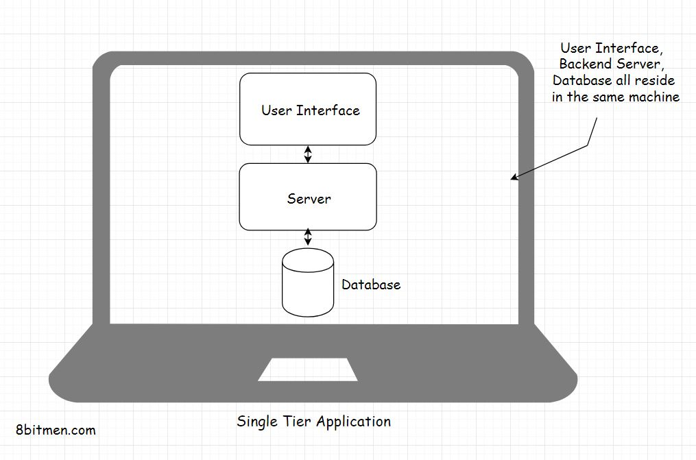
	
3. Examples:
	1. Desktop apps
		1. MS Office
		2. PC Games
		3. Image editing software
			1. Gimp
	
#### Advantages of Single Tier Applications ####
1. Main upside:
	1. No network latency
		1. Every main component is on same machine
		2. Hence adds to performance of software
		3. No requests to backend server
			1. Does not make user experience slow
	2. Caveat: Performance depends on how powerful the machine is
		1. Depends on hardware requirements & software
	3. Data of user stays in machine and doesn't need transmission over network
		1. Ensures data safety at highest level

#### Disadvantages of Single Tier Applications ####
1. Business will not have control over application
	1. Once software is shipped, no code or feature changes can be done until customer manually updates by connecting to remote server or downloading & installing patch
	2. Example: Buggy game in 90s once shipped, nothing could be done
	3. Solution: Product testing must be thorough - no room for mistakes
2. Code in single-tier apps is vulnerable to being tweeked & reverse engineered
3. Security is minimal
4. Performance & look and feel can get inconsistent 
	1. As it depends on config of user's machine

### Two Tier Applications ###
1. Topics:
	1. Two tier applications
	2. Need for two tier applications

#### Two Tier Application ####
1. A two-tier application involves a client and a server.
	1. The client would contain user interface & business logic in one machine
	2. Backend could be database running on different machine
		1. It is hosted by business
2. Example:

	
	
3. Why two-tier apps?
4. Why not host business logic on different machine & control it?
5. Is app code not vulnerable to being accessed by third person?

#### Need for two tier app ####
1. Examples: To-do list app, planner app, productivity app
	1. No business significant harm (if code is accessed by third person)
	2. Advantages:
		1. UI and code reside on same machine and hence fewer network calls to backend server
			1. Application latency is kept low
2. To-do list save:
	1. When user is done constructing to-do list he then persists changes to database
3. Online browser
4. App-based games
	1. games files are downloaded the only once when user uses app for the first time
	2. Network calls are again made to keep game state persistent
5. Fewer service calls => less money spent on servers
6. How is choice made?
	1. Business requirements dependent
	2. Use case dependent
7. One can keep UI and business logic on client or move business logic to dedicated backend (three-tier app)

### Three Tier Applications ###
1. Popular
	1. Largely used in industry
		1. Simple websites
			1. Blogs
			2. News websites
			3. ...
2. Three-tier application:
	1. In three-tier application, user interface, application logic & database lie on different machines & have different tiers. They are physically separated
3. Example:

	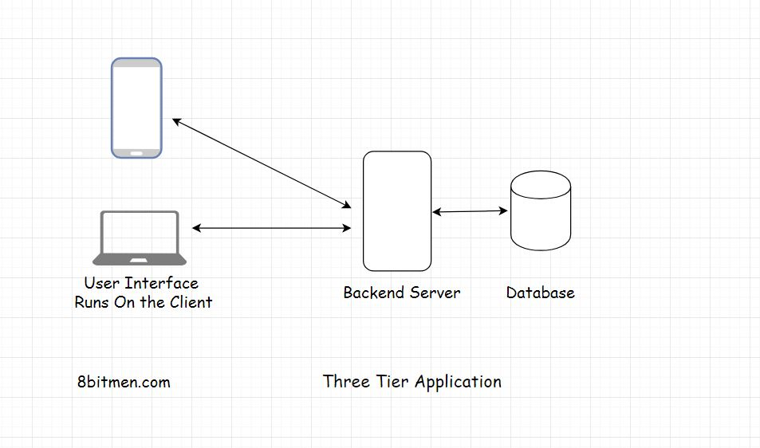
	
4. Example: Simple blog
	1. UI - HTML, JS, CSS
	2. Backend - Apache (say)
	3. Database - MySQL (say)
5. This architecture is best for simple use cases

### N Tier Applications ###
1. N-Tier applications and components
2. Topics covered:
	1. N-Tier app
	2. Why need for so many tiers?
	3. Single responsibility principle
	4. Separation of concerns
	5. Difference between layers and tiers

#### N-Tier Application ####
1. An N-tier app is app which has more than three components involved
2. What components?
	1. Cache
	2. Message queues for asynchronous behavior
	3. Load balancers
	4. Search servers for searching through massive amounts of data
	5. Components involved in processing massive amounts of data
	6. Components running heterogeneous tech commonly known as web services etc...
3. Examples: Social applications
	1. Instagram
	2. Facebook
4. Examples: Large scale industry services
	1. Uber
	2. Airbnb
5. Note:
	1. N-tier apps are called **distributed apps**
		1. Not safe to use this term yet
			1. It brings in complex stuff with it
				1. Confusing

#### Why the Need for So Many Tiers? ####
1. Two design principles can be used to explain this:
	1. Single Responsibility Principle
	2. Separation of Concerns

#### Single Responsibility Principle ####
1. Giving only one responsiblity to a component
	1. Let it execute it with perfection
		1. Examples:
			1. Saving data
			2. Running app logic
			3. Ensure delivery of message throughout system
2. Advantages:
	1. Flexibility
	2. Easier management
		1. Example: Upgrading DB server (like OS or patch) does not impact other components or service running
			1. Even if OS is installed, database would go down
			2. Rest of the application will still be up and only database dependent features are affected
	3. We can have dedicated teams
	4. We can have dedicated code repos for each component
3. Stored procedures violates SRP
	1. Business logic is in DB
		1. If database needs to be changed, how do we migrate the business logic?
			1. Migrate to new database?
			2. Refactor app code and squeeze in stored proc logic?
	2. DB should not have business logic
		1. It must be used to only persist data
4. Hence separate tier for each component

#### Separation of Concerns ####
1. Means be concerned about my work only and stop worrying about rest of the stuff
	1. Principle acts at all levels of service
		1. Tier level
		2. Code level
2. Keeping components separate makes them re-usable
	1. Different services can use same:
		1. DB
		2. Messaging server
		3. Other component
	2. Caveat: They must not be tightly coupled
3. Loosely coupled components makes scaling service easy in future when things grow

#### Difference Between Layers & Tiers ####
1. Layers in industry mean
	1. User interface layer
	2. business layer
	3. service layer
	4. data access layer
2. Example:

	
	
3. Layers are at code level
	1. Layers represent organization of code (breaking it into components)
	2. Tiers involve physicall separation of components
4. The layers can be used in any tiered application
	1. Single
	2. Two
	3. Three
	4. N

### Different Tiers in Software Architecture Quiz ###

## Web Architecture ##
### What is Web Architecture? ###
1. Involves multiple components
	1. Database
	2. Message queue
	3. Cache
	4. UI
2. All components run in conjunction with each other to form online service
3. Web architecture knowledge is important to software engineers
4. Example:

	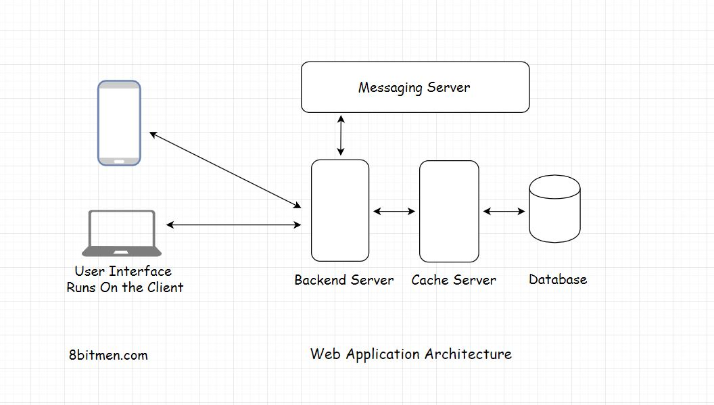
	
5. The example is typical architecture of web application used in majority of applications running online
6. We need to know the components well to build upon the architecture for more complex requirements
7. Next: Every component in detail

### Client Server Architecture ###
1. Architecture example:

	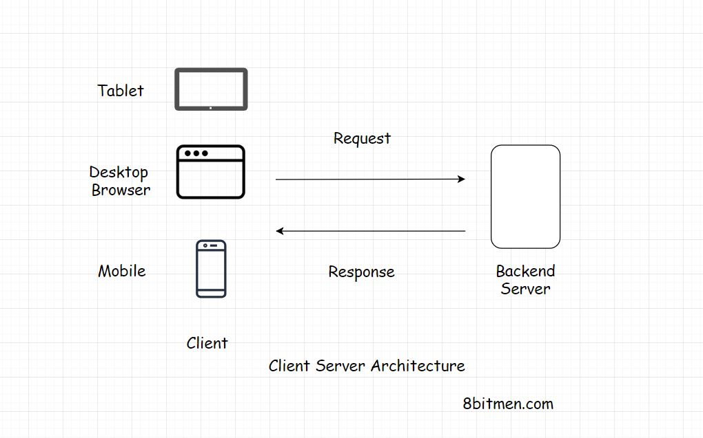
	
2. Client-server architecture is fundamental building block of the web
	1. Works on request-response model
		1. Client sends request to server for info
		2. Server responds with info
	2. Examples:
		1. Wordpress blog
		2. Facebook
		3. Twitter
		4. Bank app
3. Small percent of business websites use **peer to peer architecture**

### Client ###
1. Topics
	1. Client
	2. Technologies used to implement clients in web applications

#### Client ####
1. Client holds UI
2. UI: Presentation part of the application
	1. Written in
		1. HTML
		2. JS
		3. CSS
3. It is responsible for look & feel of app
4. Client can be:
	1. Mobile app
	2. Desktop
	3. Tablet (iPad)
	4. Web based console
		1. Commands
5. Architecture example:

	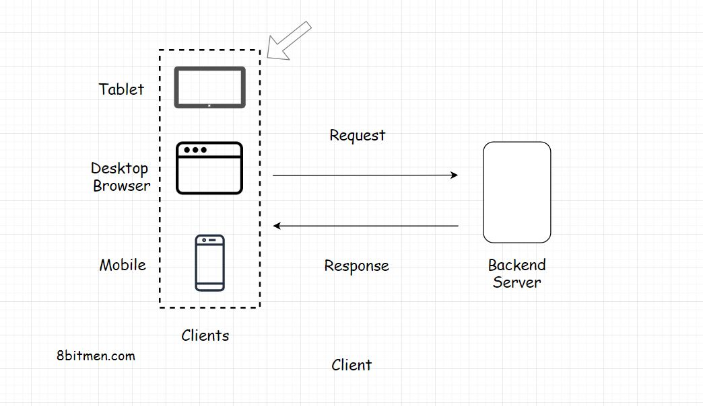
	
#### Technologies Used to Implement Clients in Web Apps ####
1. Client is window to application
2. Open Source technos popular for web-based UIs
	1. ReactJS
	2. AngularJS
	3. VueJS
	4. JQuery
	5. ...
3. Different platforms need different frameworks and libraries for front-end
	1. Mobile phones
		1. Android tools
		2. iOS tools
		3. Windows Tools
4. [Developer Survey of StackOverflow](https://insights.stackoverflow.com/survey/2019#technology)

### Types of Client ###
1. Two Types:
	1. Thin client
	2. Thick client

#### Thin Client ####
1. Holds just UI of app
2. It has no business logic
3. For each action, client sends request to backend server
4. Client types example:

	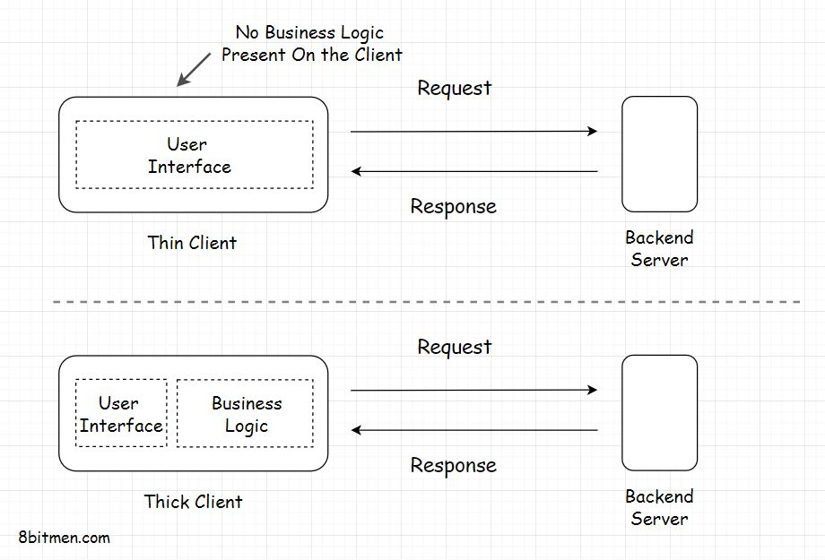
	
#### Thick Client ####
1. Thick client holds all or some part of business logic (Two tier apps)
2. Examples:
	1. Utility app
	2. Online games
	3. ...

### Server ###
1. Topics
	1. What is a Web Server?
	2. Server-Side Rendering

#### What is a Web Server? ####
1. Task of web server: receive requests from client & provide response after executing business logic (based on request params received from client)
2. Every service needs server to run (which run online)
	1. Application servers: Servers running web applications
3. Other types of servers:
	1. Proxy server
	2. Mail server
	3. File server
	4. Virtual server
4. Server config and type can differ depending on use case
	1. Example: Backend app code written in Java
		1. Apache Tomcat
		2. Jetty
	2. Example: Simple use cases - hosting websites
		1. Apache HTTP Server
5. All components of web app need server
	1. Database
	2. Message queue
	3. Cache
	4. ...
	5. UI - also hosted on dedicated server in modern apps

#### Server-Side Rendering ####
1. Server-side rendering: Server can be used to render UI on backend and send rendered data to client
2. There are pros and cons of this technique

### Communication Between the Client & the Server ###
1. Topics:
	1. Request-Response Model
	2. HTTP Protocol
	3. REST API & API Endpoints
	4. Real World Example of Using a REST API

#### Request-Response Model ####
1. Client-server have request-response model
2. Client sends request and server responds with data
3. If no request, then no response

#### HTTP Protocol ####
1. Protocol used for communication
	1. Over World Wide Web
2. HTTP protocol:
	1. It is request-response protocol that defines how info is transmitted across web
	2. It is stateless protocol
		1. Every process over HTTP is executed independently & has no knowledge of previous process
	3. [good resource](https://developer.mozilla.org/en-US/docs/Web/HTTP/Overview)

#### REST API & API Endpoints ####
1. N-tier: Every client must hit REST end-point to fetch data from backend
2. Backend app code has REST-API implemented which acts as interface to outside world requests
	1. Every request must hit REST-endpoints to fetch data
		1. Client written by business
		2. Third party clients which consume data
3. REST API Architecture:

	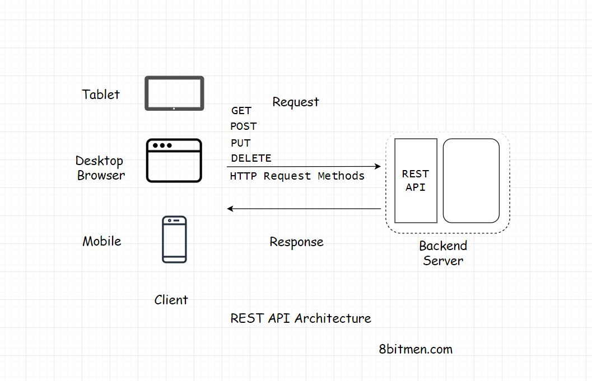

#### Real World Example of Using a REST API ####
1. To write an application that keeps track of birthdays of friends and send a reminder couple of days before event date
2. Client can hit Facebook Social Graph API (REST-API) to get data & then run business logic on data
3. There are advantages of REST based API

### Web Architecture Quiz - Part 1 ###
### What is a REST API? ###
1. Topics:
	1. What is REST?
	2. REST API
	3. REST Endpoint
	4. Decoupling Clients & Backend Service
	5. Application Development Before the REST API
	6. API Gateway

#### What is REST? ####
1. REST: Representational State Transfer
	1. Software architectural style for implementing web services
	2. RESTful web services:
		1. Web services implemented using REST architectural style

#### REST API ####
1. It is an API implementation that adheres to REST architectural constraints
	1. Acts as interface
	2. Communication between client & server is over HTTP
	3. Takes advantage of HTTP methodologies to establish communication between client and server
	4. Caching: Servers can cache response that improves performance
2. Stateless communication:
	1. Every communication between client and server is a new one
		1. No info or memory carries over from previous communications
			1. Client has to send authentication info whenever it interacts with backend (backend then figures out if client is authorized to access data)
3. Decoupling of front end and back end:
	1. REST API decouples backend & client

#### REST Endpoint ####
1. API/REST/Backend endpoint means url of service:

		https://myservice.com/users/{username}
		
	1. It is a backend endpoint to fetch user details of particular user from service
	2. REST-based service will expose url to all clients to fetch user details using url

#### Decoupling Clients & the Backend Service ####
1. Backend service doesn't worry about client implementation
	1. It calls out to multiple clients and says
		1. "Hey everyone, this is url address of resource/info you need. Hit it whenever you need the resource. Any client with required authorization can access it"
2. Different clients can have different code bases:
	1. Mobile browser
	2. Desktop browser
	3. Tablet
	4. API Testing tool
3. New types of clients and modification of client code has no effect on functionality of backend service
	1. Clients and backend services are decoupled

#### Application Development Before the REST API ####
1. Before REST-API, backend code was tightly coupled with client
	1. JSP (Java Server Page) is an example
		1. Business logic is put in JSP tags
			1. Makes code refactoring and adding new features difficult (logic got spread across different layers)
			2. Separate code/ classes were required for handling requests from different types of clients
				1. One servlet for mobile client
				2. One servlet for web-based client
				3. ...
		2. REST API:
			1. No worry about clients
			2. Provide endpoints
				1. Response is in JSON or other standard data transport format
					1. Client handles data in whatever way they want
			3. Multiple types of clients can be introduced without considering backend implementation
			4. To access public data of social network
				1. Use their REST API

#### API Gateway ####
1. API Gateway architecture:

	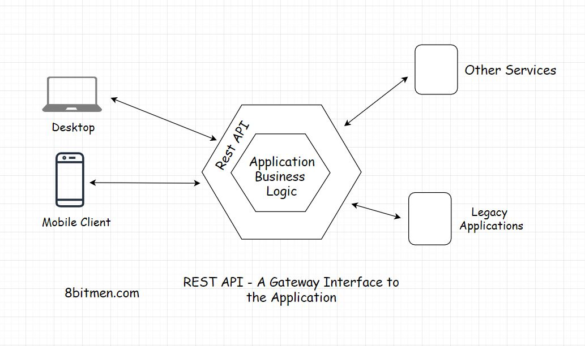
	
2. REST-API - single entry point into system (gateway)
	1. It encapsulates business logic
	2. It handles all client requests
	3. It takes care of authorization
	4. It takes care of authentication
	5. It can sanitize input data & other necessary tasks
		1. Before providing access to app resources
3. REST API is interface for communication between client and server over HTTP
4. Next: HTTP Pull & Push-based communication mechanisms

### HTTP Push & Pull - Introduction ###
1. Topics
	1. HTTP PULL
	2. HTTP PUSH
2. Two modes of data transfer between client and server
	1. HTTP PUSH
	2. HTTP PULL

#### HTTP PULL ####
1. For every response, there has to be a request
	1. Client sends request
	2. Server responds with data
2. Client pull data from server when it requires
	1. Does it over and over to fetch updated data
3. Bandwidth is consumed for every request and response to and from server
4. Every hit on server costs business money & adds load on server
5. If there is no updated info on server when client sends request:
	1. Client doesn't know that - so sends request over and over
		1. Not ideal
		2. Wastage of resources
		3. May bring down server - if excessive pulls

#### HTTP PUSH ####
1. Client sends request for info to server
	1. For first time
2. Then server keeps pushing new updates to client whenever available
	1. Advantage: Client doesn't have to send requests multiple times for data
		1. Saves network bandwidth
		2. Cuts down load on server (significantly)
3. Example: Callback
	1. Client phones server for info
	2. Server responds:
		1. "Hey!! I don't have info right now but I'll call back whenever it is available"
	3. Example: User notifications
		1. If an event happens in backend, we get notified
			1. Implementation: Ajax on client side (Asynchronous JavaScript & XML) to server in HTTP pull based mechanism
4. HTTP Push based mechanisms:
	1. Ajax Long Polling
	2. Web Sockets
	3. HTML5 Event Source
	4. Message Queues
	5. Streaming over HTTP
5. Next: Details

### HTTP Pull - Polling with Ajax ###
1. HTTP pull using polling over AJAX
2. Topics:
	1. AJAX - Asynchronous JavaScript & XML
3. Two ways of pulling/ fetching data from server
	1. HTTP GET request to server manually by triggering an event
		1. Clicking button
		2. Invoking other element
	2. Fetching data dynamically at regular intervals using AJAX without human intervention

#### AJAX - Asynchronous JavaScript & XML ####
1. AJAX: Asynchronous JavaScript & XML
	1. Used for adding asynchronous behaviour to web page
2. AJAX Example:

	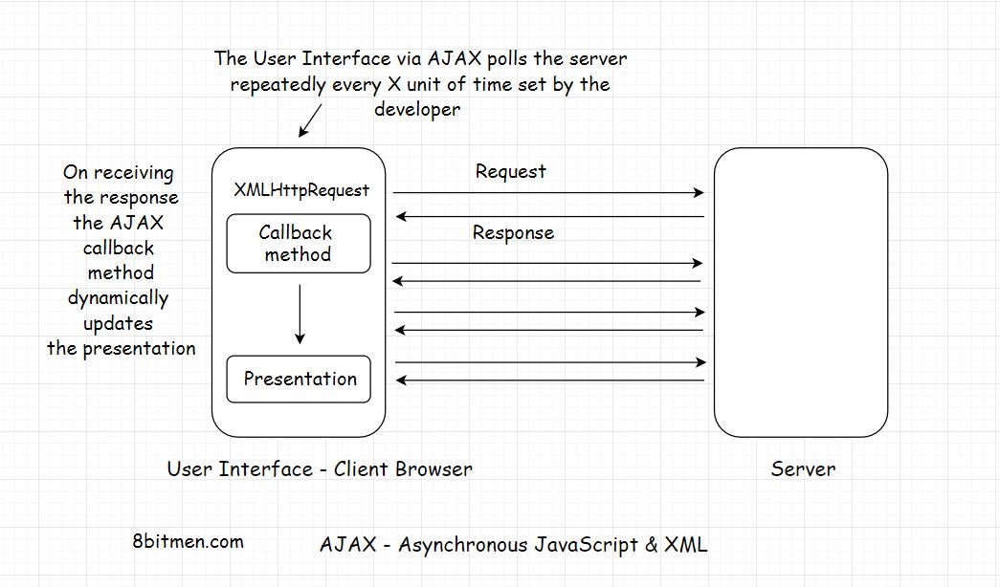
	
3. AJAX enables fetching updated data from server automatically sending requests over and over at stipulated intervals
	1. When updates are received
		1. A section of web page is updated dynamically by callback method
			1. Example: News websites, Sports websites (without reload)
4. `XMLHttpRequest`
	1. AJAX uses the object to send requests to server
	2. It is built in browser
	3. It uses JavaScript to update HTML DOM
5. JQuery - AJAX is used with this framework to implement asynchronous behaviour on UI
6. Polling - Requesting information server at regular intervals

### HTTP Push ###
1. Topics
	1. Time to Live (TTL)
	2. Persistent Connection
	3. Heartbeat Interceptors
	4. Resource Intensive

#### Time to Live (TTL)####
1. In HTTP Pull - There is Time to Live (TTL) for every request.
	1. 30 seconds, 60 seconds (varies with browser)
		1. If client does not receive response from server withing TTL, browser kills connection & client must send request hoping it would receive data from server before TTL ends again.
2. Open connections consume resources
	1. There is limit on number of open connections a server can handle at one point in time
	2. If connections are not closed and new ones introduced, server will run out of memory
3. Solution: TTL is used to avoid this issue
4. Problem: Suppose we are certain that response will take more time than TTL set by browser?

#### Persistent Connection ####
1. Persistent connection between client and server
	1. It is a network connection between client & server that remains open for further requests & responses, as opposed to being closed after single communication
2. HTTP Push-based communication between client and server
3. Example push based communication:

	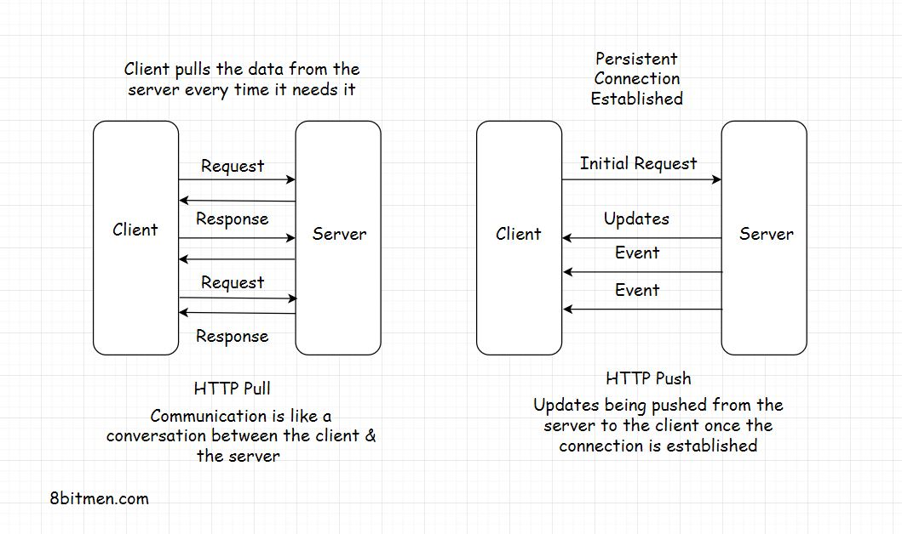

#### Heartbeat Interceptors ####
1. How is persistent connection possible?
	1. Solution: Heartbean interceptors
		1. These are blank request responses between client and server to prevent browser from killing connection
2. Isn't it resource intensive?

#### Resource Intensive ####
1. It is
	1. Persistent connections consume lot of resources in comparison to HTTP pull behaviour
	2. When is establishing persistent connection useful?
		1. Browser-based multi-player game has large amount of request-response activity within certain time
			1. It is better from user experience standpoint
2. Implementation strategies:
	1. Ajax long polling
	2. Web sockets
	3. Server-sent events
	4. ...

### HTTP Push - Based Technologies ###
1. Topics:
	1. Web Sockets
	2. AJAX - Long Polling
	3. HTML5 Event Source API & Server Sent Events
	4. Streaming Over HTTP
	5. Summary

#### Web Sockets ####
1. Preferred if bi-directional low latency data flow from client to server & back is required
2. Use cases:
	1. Messaging
	2. Chat applications
	3. Real time social streams
	4. Browser based massive multiplayer games (quite a number of read writes in comparison to regular web app)
3. With web-sockets, we can keep the client-server connection as long as we want
4. Use case: Bi-direction data
	1. It does not work over HTTP
	2. It runs over TCP
		1. Both server and client must support web-sockets (or else it wont work)
5. [The WebSocket API](https://developer.mozilla.org/en-US/docs/Web/API/WebSockets_API)
6. [Introducing WebSockets - Bringing Sockets to the Web](https://www.html5rocks.com/en/tutorials/websockets/basics/)

#### AJAX - Long Polling ####
1. It lies between Ajax & Web Sockets
	1. Instead of immediately returning response, server holds response until it finds an update to be sent to client
	2. Connection stays a bit longer (than polling)
		1. Server doesn't return empty response
		2. If connection breaks, client has to re-establish connection to server
2. Advantages:
	1. Smaller number of requests sent from client to server (in comparison to regular polling)
		1. Reduces network bandwidth consumption
3. Use cases:
	1. Simple asynchronous data fetch (if we do not want to poll server too frequently)

#### HTML5 Event Source API & Server Sent Events ####
1. Different approach:
	1. Client does not poll for data
		1. Server automatically pushes data to client whenever updates are available
			1. Incoming messages from server are treated as events
2. With this approach:
	1. Servers can initiate data transmission towards client once client has established connection with initial request
	2. Helps get rid of huge number of blank request-response cycles
		1. Cuts down bandwidth consumption by notches
3. **Implementation:**
	1. Backend language must support the technology
	2. On UI: HTML5 Event source API is used to receive data in-coming from backend
4. Note: Once client establishes connection with server, data flow is in one direction only (from server to client)
5. Use cases:
	1. Real-time feed
		1. Twitter
		2. Stock quotes on UI
		3. Real-time notifications
6. [Good resource for further reading on SSE](https://developer.mozilla.org/en-US/docs/Web/API/Server-sent_events)

#### Streaming Over HTTP ####
1. Use cases:
	1. Large data needs to be streamed over HTTP by breaking into smaller chunks
2. **Implementation: HTML5 & JavaScript Stream API**
3. Streaming API Example:

	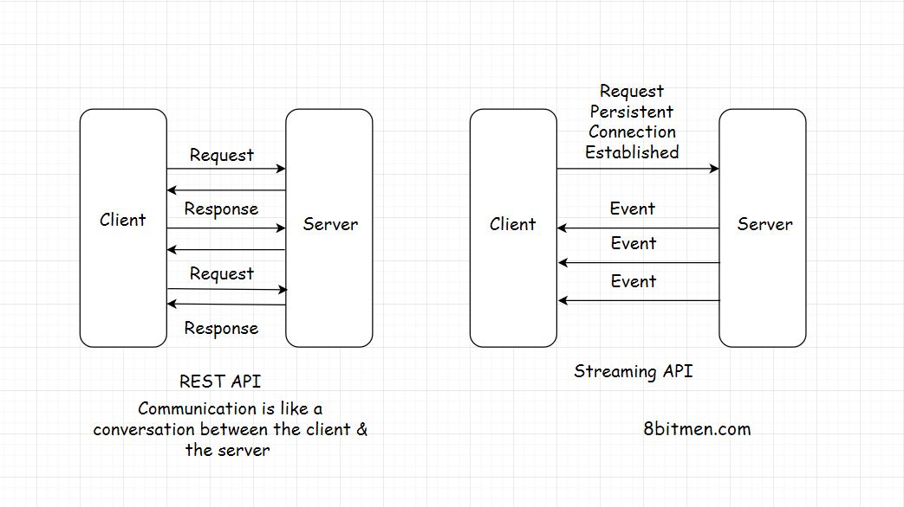
	
4. Used for multimedia content over HTTP
	1. Large images
	2. Video
	3. ...
5. Video:
	1. We can view partially downloaded video as it continues to download
		1. Playing downloaded chunks on the client
6. Setup:
	1. Client & Server agree to confirm to some streaming settings
		1. Helps them figure out when stream begins and ends over HTTP request-response model
7. [Further reading on Stream API](https://developer.mozilla.org/en-US/docs/Web/API/Streams_API/Concepts)

#### Summary ####
1. Persistent connection between client and server - technologies used
2. Ajax use case: Dynamically update web page by polling server at regular intervals
3. Long polling use case: Connection open time is slightly longer than polling mechanism
4. Web sockets use case: Bi-directional data flow
5. Server sent events: data flow from server to client
6. Technology that best fits depends on use cases

### Client-Side Vs Server-Side Rendering ###
1. Topics:
	1. Client-side rendering - How does a browser render a web page?
	2. Server-side rendering
	3. Use cases for server-side & client-side rendering

#### Client-Side Rendering - How Does A Browser Render A Web Page? ####
1. When user request web page from server & browser receives response
	1. Browser has to render response on window in the form of HTML page
2. Browser components for this:
	1. Browser engine
	2. Rendering engine
	3. JavaScript interpreter
	4. Networking & the UI backend
	5. Data storage etc...
2. Browser has significant work to convert response from server into HTML page
3. Rendering engine constructs DOM tree, renders & paints construction
	1. This needs time

#### Server-Side Renderig ####
1. To avoid rendering time on client UI is rendered on server
	1. HTML is generated in serve and directly sent to UI
2. It ensures faster rendering of UI
	1. Averts UI loading time in browser window
		1. Page is already constructed
			1. No much assembling & rendering work for browser

#### Use Cases for Server-Side & Client-Side Rendering ####
1. Server-side rendering is good for static content (WordPress Blogs)
	1. Good for SEO (crawlers can read the generated content)
2. Modern websites are dependent on Ajax
	1. Content for a module or section of a page must be fetched and rendered on the fly
3. Server side rendering generates entire page on server instead of sending just required content to client
	1. Consumes unnecessary bandwidth
	2. Fails to provide smooth user experience
		1. If number of concurrent users on website rises, it puts unnecessary load on server
4. Client side rendering:
	1. Good for Ajax based websites
5. Hybrid approach can be used
	1. To get most out of both techniques
		1. Home page can use server side rendering
		2. Other static content can use server side rendering
		3. Dynamic pages can use client side rendering
6. Important concepts:
	1. Monolithic architecture
	2. Micro-services
	3. Scalability
	4. High availability
	5. Distributed systems
	6. What are nodes in distributed systems? Why are they important to software design?
7. The components help to understand rest of the web components better

### Web Architecture Quiz - Part 2 ###

## Scalability ##
### What is Scalability? ###
1. Topics
	1. What is scalability?
	2. What is latency?
	3. Measuring latency
		1. Network latency
		2. Application latency
	4. Why is low latency so important for online services?
2. Scalability:
	1. What is it?
	2. Why is it important?
	3. Why is everyone talking about it?
	4. Is it important to scale systems?
	5. What are the plans or contingencies to scale when app or platform experiences significant traffic growth?
3. Chapter - deep dive into scalability
	1. Covers:
		1. What does scalability mean (in context of web applications)
		2. What does scalability mean in context of distributed systems or cloud computing?
		3. ...

#### What is Scalability? ####
1. It means ability of application to handle & withstand increased workload without sacrificing latency
	1. Example: 
		1. If app takes x seconds to respond to user request, it should take same x seconds to respond to each of million concurrent user requests on the app
	2. Backend infrastructure should not cumble under load of million concurrent requests
		1. It should scale well when subjected to heavy traffic load
		2. It should maintain latency of the system
2. Scalable application example:

	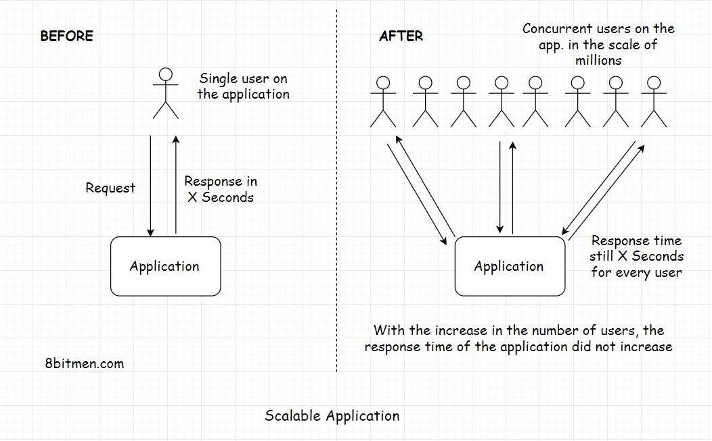
	
#### What is Latency? ####
1. Latency: Amount of time system takes to respond to a user request
	1. If system takes 2 seconds to respond to a request, the latency is 2 seconds
2. Efficient software systems strive for minimum latency
	1. If traffic builds up, latency should not go up
		1. If latency remains the same, we can say, the application scaled well with increased load and is highly scalable
3. Big-O notation: Ideal case - O(1) for any algorithm (constant time: for key-value database say)
	1. O(n^2): where n is size of dta set
		1. This is not scalable
			1. If size of data set increases, the system needs more computational power to proces tasks
4. How do we measure latency?

#### Measuring Latency ####
1. It is time difference between action that user takes on  website (can be event like click of a button) & system response in reaction to event
2. Latency has two parts:
	1. Network latency
	2. Application latency
3. Example: Latency model:

	
	
#### Network Latency ####
1. It is the time the network takes for sending data packet from point A to point B
	1. Network should be efficient enough to handle increased traffic load on website
		1. Workaround strategy:
			1. To cut down network latency:
				1. Businesses use CDN & try to deploy servers across globe as close to end-user as possible

#### Application Latency ####
1. The amount of time, the application takes to process a user request
2. Ways to cut-down application latency:
	1. First step:
		1. Run stress test on application
		2. Run load test on application
		3. Scan for bottlenecks that slow down system as a whole

#### Why is Low Latency So Important for Online Services? ####
1. Impact of latency: It plays majore role in determining if online business wins or loses customer
	1. No one likes to wait for a response on a website
		1. If user gets response within stipulated time, then okay or else he bounces off to another site
			1. Market researches show this effect
		2. Use case: If money is involved, zero latency is what businesses want
			1. If that was possible
2. Example: Massive multiplayer games
	1. Slight lag in in-game event ruins whole experience
		1. Gamer with high latency internet connection will have slow response time despite having best reaction time of all players in arena
3. Example: Algorithmic trading
	1. Must process events within milliseconds
		1. Fintech companies have dedicated networks to run low latency trading
			1. Regular network wont cut it
4. [Huawei, Hibernia Atlantic laying fiber-optic link cables across Atlantic Ocean between London and New York](https://www.telegraph.co.uk/technology/news/8753784/The-300m-cable-that-will-save-traders-milliseconds.html)
	1. $300M was spent to save traders 6 milliseconds of latency

### Types of Scalability ###
1. Topics: Two types - Vertical and Horizontal
	1. What is Vertical Scaling?
	2. What is Horizontal Scaling?
	3. Cloud Elasticity
2. For application to scale:
	1. It needs solid computing power
		1. Solution: Servers should be powerful to handle increased loads
	2. Two ways to scale an application
		1. Vertical scaling
		2. Horizontal scaling

#### What is Vertical Scaling? ####
1. Adding more power to a server
	1. Ex: Increasing RAM from 16 Gigs to 32 Gigs
2. Scaling example:

	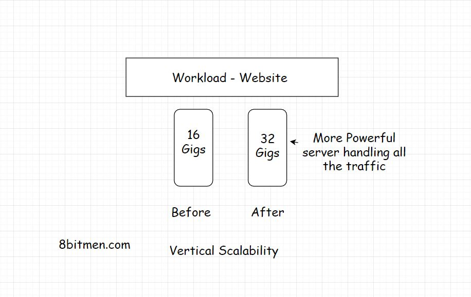
	
3. Vertical scaling: It is called scaling up
	1. Power of hardware is increased
	2. Advantage: Simplest way to scale
		1. No code refactoring
		2. No complex configurations (horizontal scaling might need code refactoring)
	3. Disadvantage: Capacility limit on single server
		1. Example: Adding floors to a multi-floor building (we can add only to a certain point)
			1. One cannot scale building to the moon
			2. Solution: Building more buildings
				1. Horizontal scaling

#### What is Horizontal Scaling? ####
1. Aka Scaling out
	1. Adding more hardware to existing hardware resource pool
		1. Increases computational power of system as a whole
2. Horizontal scaling example:

	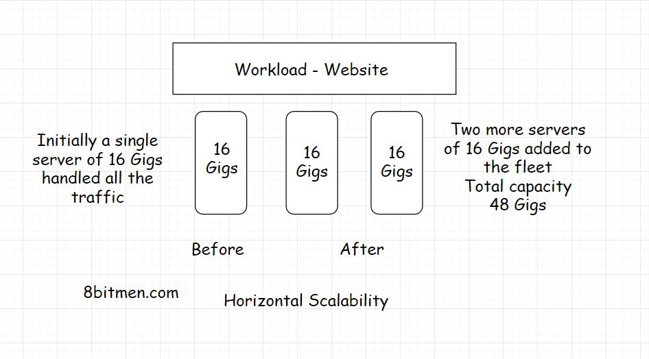
	
3. Increased traffic influx can be dealt with increased computational capacity
	1. There is not limit on how much we can scale horizontally (assuming infinite resources)
		1. Servers and data-centers can be added indefinitely
	2. We can also dynamically scale in real-time as traffic on website increases & decreases over a period of time
		1. Vertical scaling requires pre-planning & stipulated time

#### Cloud Elasticity ####
1. Why cloud computing?
	1. It has the ability to scale up and down dynamically
	2. One has ability to pay only for resources required by app (economic reason)
2. If site has heavy traffic influx, more server nodes get added & when it doesn't, dynamically added nodes are removed
	1. Cloud elasticity - stretching and returning to original infrastructural computaional capacity
3. Multiple server nodes on backend helps with website staying alive online all the time (even if few server nodes crash)
	1. High availability

### Which Scalability Approach is Right For Your App? ###
1. Topics:
	1. Pros & Cons of Vertical & Horizontal Scaling
	2. What about the code? Why does the code need to change when it has to run on multiple machines?
	3. Why scalability Approach Is Right for Your App?

#### Pros & Cons of Vertical & Horizontal Scaling ####
1. Vertical scaling:
	1. Simpler than horizontal scaling
		1. No code changes
		2. No complex distributed system config
		3. Less administrative efforts
		4. Less monitoring
		5. Less management efferts
	2. Downside
		1. Availability risk
			1. Fewer powerful servers
				1. They may go down and may take down the entire website (doesn't happen for horizontal scaling - highly available)

#### What about the Code? Why does the code need to change when it has to run on multiple machines? ####
1. Code needs to be stateless in a distributed environment
	1. What is the meaning of this?
		1. Not static instances in class
			1. They hold application data
				1. If a server goes down, all static data is lost
					1. App will be in an inconsistent state
	2. Solution: Using persistent memory
		1. Key-value store (migrate state/static variable from class)
	3. Solution: Another solution is functional programming
		1. Functions don't retain any state
2. Estimating traffic: Have a ballpark figure in mind of how much traffic will it have to deal with?
3. Adoption of microservices architecture:
	1. Adopted early by certain teams
	2. Deployed on cloud
	3. Result: Workloads are distributed horizontally on the fly
4. Microservices architecture:

	
	
5. Advantages of horizontal scaling:
	1. No limit to augmenting hardware capacity
	2. Data is replicated across geographical regions
		1. How?
			1. Nodes & data centres are set up across the globe
6. Next: Cloud, serverless, microservices

#### Which Scalability Approach is Right for Your App? ####
1. If app is expected to receive minimal consistent traffic:
	1. Example: Utility, tool (internal say)
		1. Single server will suffice (for the traffic)
	2. Virtical scaling is okay if traffic is not expected to increase significantly
2. If app is public-facing social app (say)
	1. Fitness app
	2. Traffic is expected to spike exponentially in the near future
		1. High availability is important
		2. Horizontal scalability is important
3. Solution:
	1. Build application to deploy to cloud
	2. Keep horizontal scalability in mind from start

### Primary Bottlenecks that Hurt the Scalability of Our Application ###
1. Topics
	1. Database
	2. Application architecture
	3. Not Using Caching in the Application Wisely
	4. Inefficient Configuration & Setup of Load Balancers
	5. Adding Business Logic to the Database
	6. Not Picking the Right Database
	7. At the Code Level
2. Points in application that can become bottlenecks

#### Database ####
1. Consider a well architected application
	1. Workload runs on multiple nodes
	2. It has ability to horizontally scale
	3. But database is single monolith
		1. One server is given the onus of handling data requests from all server nodes of workload
			1. Bottleneck
	4. Server nodes handle millions of requests but response time of the requests & latency of application is very high due to single database (only so much it can handle)
2. Solution:
	1. Database needs to be scaled as well
		1. Wise use of data partitioning
		2. Sharding (?)
		3. Use multiple database servers

#### Application Architecture ####
1. Poor design can become a bottleneck
	1. Common mistake: all processes are scheduled sequentially
		1. Not using asynchronous processes
		2. Not using asynchronous modules
	2. **Solution: asynchronous processing**
		1. Example: If user uploads a dodument on portal
			1. Sending confirmation email
			2. Sending notification to all subscribers/listeners to the upload event should be done asynchronously
		2. **Forward the tasks to messaging server**
			1. Instead of doing sequentially & making user wait

#### Not Using Caching In the Application Wisely ####
1. Caching can be deployed in several layers of application
	1. It speeds up response time by notches
	2. It intercepts all requests going to database (reducing overall load on it)
2. Solution: Use caching exhaustively throughout application to speed up things significantly

#### Inefficient Configuration & Setup of Load Balancers ####
1. Using too many or too few load balancers impacts latency of the application

#### Adding Business Logic to the Database ####
1. Database is not a place to put business logic
	1. It makes application tightly coupled to database
	2. It puts unnecessary load on the database
2. Cons:
	1. Needs significant amount of refactoring when migrating to different database

#### Not Picking the Right Database ####
1. For transactions & strong consistency
	1. Relational database
2. For not so strong consistency (but need horizontal scalability on the fly)
	1. NoSQL database
3. Need suitable tech or else it has profound impact on latency of entire application negatively
	1. [Martin Fowler's talk on NoSQL](https://www.youtube.com/watch?v=qI_g07C_Q5I&t=1953s)

#### At the Code Level ####
1. Inefficient and badly written code has potential to take down entire service in production
	1. Using unnecessary loops or nested loops
	2. Writing tightly coupled code
	3. Not paying attention to the Big-O complexity while writing the code.
		1. May need firefighting in production
2. More details next

### How to Improve & Test the Scalability of Our Application? ###
1. Topics
	1. Tuning The Performance of the Application - Enabling It To Scale Better
		1. Profiling
		2. Caching
		3. CDN (Content Delivery Network)
		4. Data Compression
		5. Avoid Unnecessary Client Server Requests
	2. Testing the Scalability Of Our Application
2. Common & best strategies to fine tune performance of web application
	1. If application is performance optimized, it can withstand more traffic load with less resource consumption (as compared to application not optimized for performance)
3. Application's performance is directly proportional to it's scalability
	1. If application is not performant, it will not scale well
	2. Advantage of performance optimization:
		1. The best practices can be implemented even before real pre-production testing is done on application

#### Tuning The Performance Of The Application - Enabling It To Scale Better ####

##### Profiling #####
1. Profile the application in and out thoroughly
	1. Run application profiler
	2. Run code profiler
	3. Check which processes are taking too long
	4. Check which processes are eating up too much resources
	5. Find out the bottlenecks
	6. Eliminate them
2. Profiling:
	1. Dynamic analysis of code
	2. It enables to
		1. Measure space complexity of code
		2. Measure time complexity of code
		3. Figure out concurrency errors
		4. Figure out memory errors
		5. Figure out robustness
		6. Figure out safety of program
3. [https://en.wikipedia.org/wiki/List_of_performance_analysis_tools](https://en.wikipedia.org/wiki/List_of_performance_analysis_tools)

##### Caching #####
1. Cache wisely
2. Cache everywhere
3. Cache all static content  
4. Hit DB only when it is required
	1. Try to serve all read requests from cache
	2. Use **write through** cache

##### CDN (Content Delivery Network) #####
1. CDN further reduces latency of application
	1. How?
		1. Proximity of data to requesting user

##### Data Compression #####
1. Use apt compression algorithms to compress data
2. Store data in compressed form
3. Advantages:
	1. Compressed data consumes less bandwidth
		1. Download speed on client will be faster

##### Avoid Unnecessary Client Server Requests #####
1. Avoid unnecessary round trips between client & server
	1. Try to club multiple requests into one

#### Testing the Scalability Or Our Application ####
1. After basic performance testing of application
	1. Do capacity planning
		1. Provisioning of right amount of hardware & computing power
2. Testing application for scalability:
	1. Testing approach for scalability depends on system
		1. Testing can be performed at
			1. Hardware level
			2. Software level
3. Services & components need to be tested individually and collectively
4. What to consier while testing for scalability?
	1. CPU usage
	2. Network bandwidth consumption
	3. Throughput
	4. Number of requests processed within stipulated time
	5. Latency
	6. Memory usage of program
	7. End-user experience when system is under heavy load
	8. ...
5. In the testing phase, simulated traffic is routed to system to study
	1. How system behaves under heavy load
	2. How application scales under heavy load
	3. Contingencies are planned for unforeseen situations
		1. As per anticipated traffic, appropriate hardware & computational power is provisioned to handle traffic smoothly **with some buffer**
6. Load and Stress tests are run on the application
	1. JMeter can be used for
		1. Concurrent user test (If working on Java ecosystem)
	2. Cloud based testing tools are available to simulate tests scenarios (with few mouse clicks)
7. Businesses test systems for scalability to handle traffic surge
	1. Example: Sports website
		1. Prepares for sports event day
	2. Example: e-commerce website
		1. Gets ready for festival season
8. [How production engineers support global events on Facebook](https://engineering.fb.com/production-engineering/how-production-engineers-support-global-events-on-facebook/)
9. [How hotstrar a video streaming service scaled with 10 million concurrent users](https://www.8bitmen.com/how-hotstar-scaled-with-10-3-million-concurrent-users-an-architectural-insight/)
10. Tools popular in industry:
	1. Cadvisor (Container Advisor?)
	2. Prometheus
	3. Grafana (Web based dashboard)
11. Example: Dashboard monitoring architecture flow

	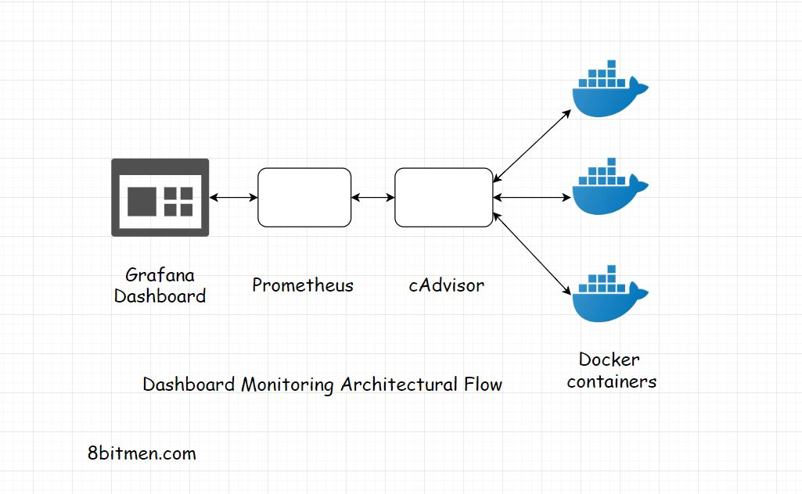
	
12. [Pre-Production Monitoring](https://www.8bitmen.com/what-is-grafana-why-use-it-everything-you-should-know-about-it/)

### Scalability Quiz ###

## High Availability ##
### What is High Availability? ###
1. Topics
	1. What is High Availability?
	2. How Important Is High Availability To Online Services?
2. It is the norm today to have highly available computing infrastructure
	1. More with cloud
3. Cover frequently asked questions such as:
	1. What is it?
	2. Why is it so important to business?
	3. What is a highly available cluster?
	4. How do cloud platforms ensure high availability of the services running on them?
	5. What is fault tolerance & redundancy? How are they related to high availability?

#### What Is High Availability? ####
1. HA is the ability of the system to stay online despite having fialures at the infrastructural level in real-time
2. Sole mission of highly available systems:
	1. Stay online & stay connected
	2. Analogy: Backup generators to ensure continous power supply in case of power outages
3. Expressed as %:
	1. 99.99999% - the service will be up for the % of time
		1. Often used in SLA (Service Level Agreement) of cloud platforms

#### How Important Is High Availability To Online Services? ####
1. If social applications go down for a bit and bounce back, it might not impact business that much
2. If there is a mission critical system like the following, such systems cannot afford to go down at any time
	1. Aircraft systems
	2. Spacecrafts
	3. Mining machines
	4. Hospital servers
	5. Findance stock market systems
3. Smooth functioning of mission-critical systems relies on continual connectivity with their network/servers
	1. We might need super highly available infrastructures
4. Usually services do not want to go down (critical or not)
	1. Solution:
		1. Fault tolerance
		2. Redundancy
5. Elaboration next

### Reasons for Systems Failures ###
1. Topics
	1. Software Crashes
	2. Hardware Failures
	3. Human Errors
	4. Planned Downtime
2. Reasons for systems failure

#### Software Crashes ####
1. Applications crash (on mobile phones, desktops)
	1. Corrupt software files
	2. OS crashing
	3. Memory-hogging unresponsive processes
	4. Software running on cloud nodes crash unpredictably
		1. They may take down the entire node

#### Hardware Failures ####
1. Overloaded CPU
2. Overloaded RAM
3. Overloaded hard disk
4. Node goes down
5. Network outages

#### Human Errors ####
1. Biggest reason
	1. Flawed configurations
	2. ...
2. [This is an interesting read about Google's mistake in network config](https://thenextweb.com/google/2017/08/28/google-japan-internet-blackout/)

#### Planned Downtime ####
1. Routine maintenance operations
2. Patching of software
3. Hardware upgrades
4. ...

#### HA Systems Designed to Overcome the Failures ####
1. More details next

### Achieving High Availability - Fault Tolerence ###
1. Topics:
	1. What is Fault Tolerance?
	2. Designing a Highly Available Fault-Tolerant Service-Architecture
2. Fault Tolerance: An approach to achieve HA

#### What is Fault Tolerance? ####
1. Fault tolerance is the ability of the system to stay up despite taking hits
2. It is equiped to handle faults
3. It is an essential element in designing life-critical systems
4. A few of the instances/nodes of many go offline & bounce back all the time
	1. In case of internal failures, system could work at a reduced level but will not go down entirely
5. Social networking application:
	1. If a baclend node fails, few services of the app (image upload, post likes ...) may stop working but application as a whole will still be up
		1. This is technically **fail soft** 

#### Designing a Highly Available Fault-Tolerant Service - Architecture ####
1. HA at application level is achieved by breaking down the entire service architecturally into smaller loosely coupled services called **micro-services**
2. Example: Microservice architecture:

	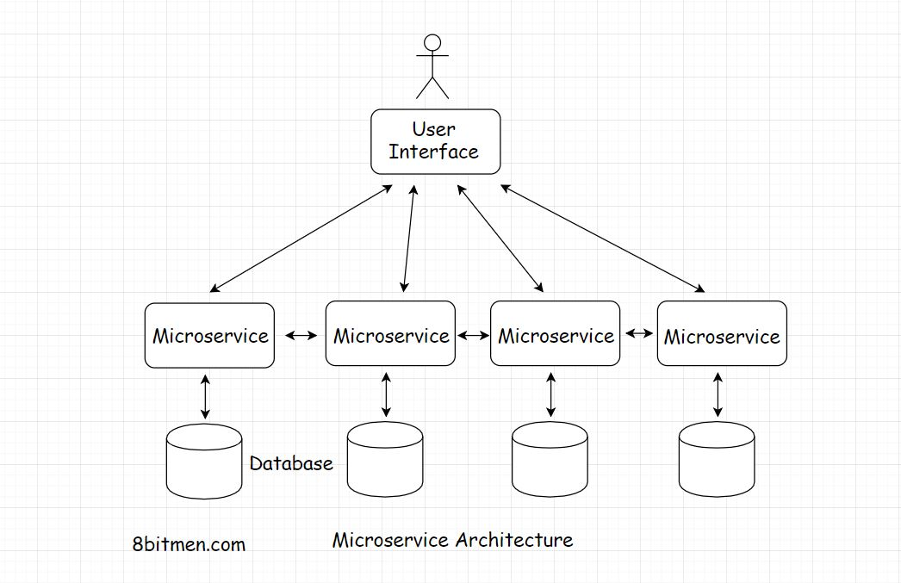
	
3. Advantages of breaking monolith into microservices:
	1. Easier management
	2. Easier development
	3. Ease of adding new features
	4. Ease of maintenance
	5. High availability
4. Each microservice takes the burden of running different features of application
	1. Image upload
	2. Comment
	3. Instant messaging
	4. ...
5. If few of the services go down, the application is still up

### Redundancy ###
1. Topics:
	1. Redundancy - Active-Passive HA Mode
	2. Getting Rid of Single Points of Failure
	3. Monitoring & Automation

#### Redundancy - Active-Passive HA Mode ####
1. Redundancy - Redundancy is duplicating the components or instances & keeping them on standby to take over in case the active instances go down. It's the fail-safe, backup mechanism
2. Example: High Availability - Redundancy

	
	
3. Active-passive HA mode:
	1. There are a few instances of nodes active and a few in standby
	2. The standby instances of nodes (redundant passive nodes) take over if any of the active instances go down (faiure)
4. Applications: Zero downtime is ensured by making the components redundant
	1. GPS
	2. Aircrafts
	3. Communication satellites

#### Getting Rid of Single Points of Failure ####
1. Distributed systems are popular because they get rid of single points of failure present in monolithic architecture
	1. Large number of distributed nodes work in conjunction with each other to achieve single synchronous application state
	2. Redundant nodes make sure there are no single points of failure in the system
		1. If a node goes down, redundant nodes take its place
			1. System as a whole remains un-impacted
2. Bottlenecks: Single points of failure at application level
	1. Detect bottlenecks in performance testing and get rid of them asap

#### Monitoring & Automation ####
1. Systems should be well monitored in real-time to detect bottlenecks or single points of failures
2. Self-healing:
	1. Automation gives instances the power to self-recover without human intervention
3. Systems can add or remove instances on the fly as per requirements
4. Automation cuts down failures which are mostly caused due to human errors

### Replication ###
1. Topics:
	1. Replication - Active-Active HA Mode
	2. Geographical Distribution of Workload

#### Replication - Active-Active HA Mode ####
1. Replication: Having a number of similar nodes running workload together
	1. No standby or passive instances
2. When a single or few nodes go down, remaining nodes bear the load of the service
	1. Load balancing is used
3. Example: High availability - replication

	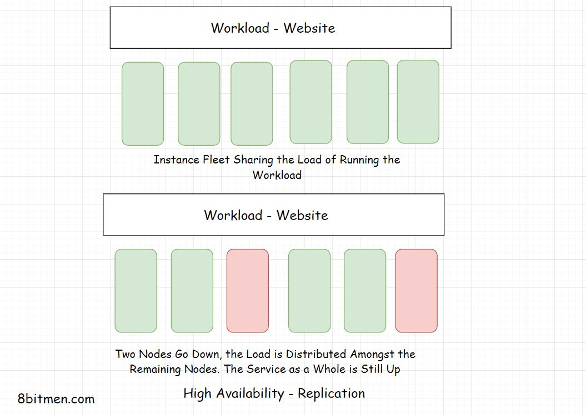
	
4. This is active-active high availability mode
	1. All components of system are active at any time

#### Geographical Distribution of Workload ####
1. Contingency for natural disasters
	1. Data centre regional power outages
	2. ...
2. Workloads are distributed across different data centres across the world in different geographical zones
	1. Advantages:
		1. Avoids single point of failure in context of data centre
		2. Reduces latency to a large extant because of proximity of data to user
3. Criticality of the system:
	1. High availability and fault-tolerant decisions are subject to
		1. How critical the system is?
		2. What are the odds that the components will fail?
		3. ...
4. Further availability:
	1. Multi-cloud platforms are used by businesses to deploy their workloads for further availability
		1. If one cloud provider goes south, another is a backkup

### High Availability Clustering ###
1. High availability cluster: Aka fail-over cluster
	1. It contains a set of nodes running in conjunction with each other that ensures high availability of service
2. Heartbeat network: Nodes in cluster are connected by private network called heartbeat network
	1. The network monitors each node and status of each node in cluster
	2. State management: Single state across all nodes in cluster is achieved with
		1. Shared distributed memory
		2. Distributed co-ordination service (*Zookeeper* say)
3. Example: Highly available cluster

	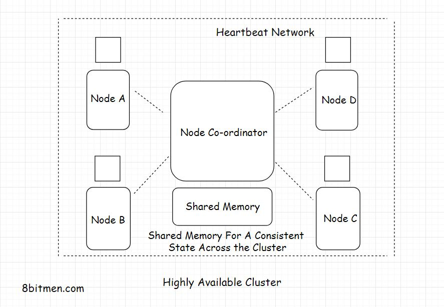
	
4. Techniques for HA used by clusters
	1. Disk mirroring or RAID Redundant Array of Independent Disks
	2. Redundant network connections
		1. If primary network goes down, backup network takes over
	3. Redundant electrical power
	4. ...
5. Multiple HA clusters:
	1. Run in one geographical zone ensuring
		1. Minimum downtime 
		2. Continual service
6. Next chapter: Load balancing

### High Availability Quiz ###

## Load Balancing - ( - New - ) ##
### Introduction to Load Balancing ###
1. Topics
	1. What is Load Balancing?
	2. Performing Health Checks of The Servers With Load Balancers

#### What is Load Balancing? ####
1. Useful if
	1. Traffic load increases
	2. To stay highly available
2. Load balancers distribute heavy traffic load across servers running in cluster
	1. They use different algorithms
	2. Advantage:
		1. Averts risk of convergence of all traffic on service to single or few machines in cluster
		2. If traffic is converged only on few machines, it will overload them and cause
			1. Increase of latency of application
			2. Performance hit
			3. Failure of entire system
		3. Load balancing avoids the mess
3. Scenario 1: If node goes down when a request is processed
	1. Load balancer automatically routes future requests to other up and running servers in cluster
		1. Enabling service as a whole to stay available
4. Load balancer is single point of contact for all client requests
5. Example: Load balancer

	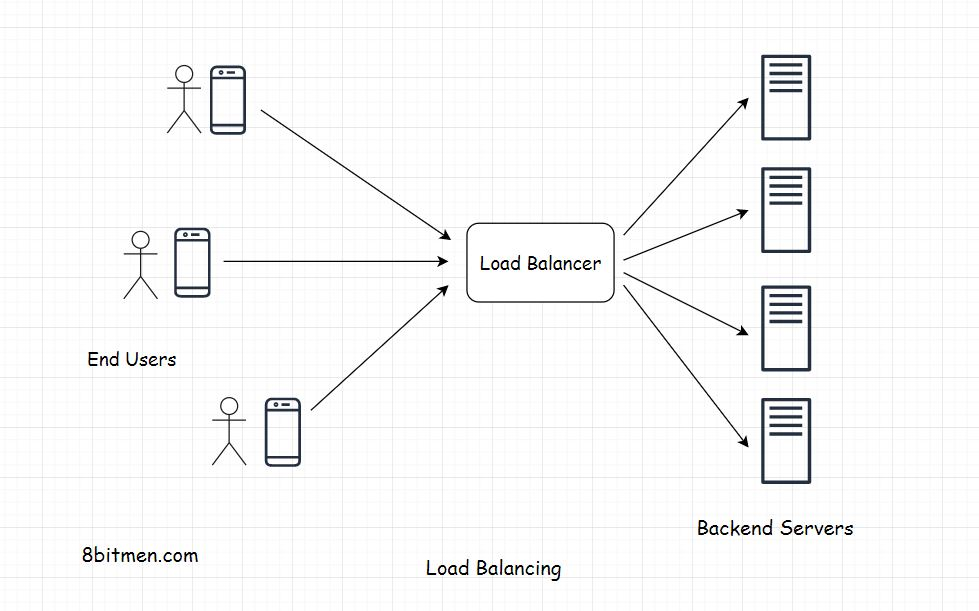
	
6. Load balancers can be setup to efficiently manage traffic directed towards any component of the application
	1. Backend application server
	2. Database component
	3. Message queue
7. Purpose:
	1. To uniformly spread request load across machines in clusters powering the components
8. Example: Load balancing

	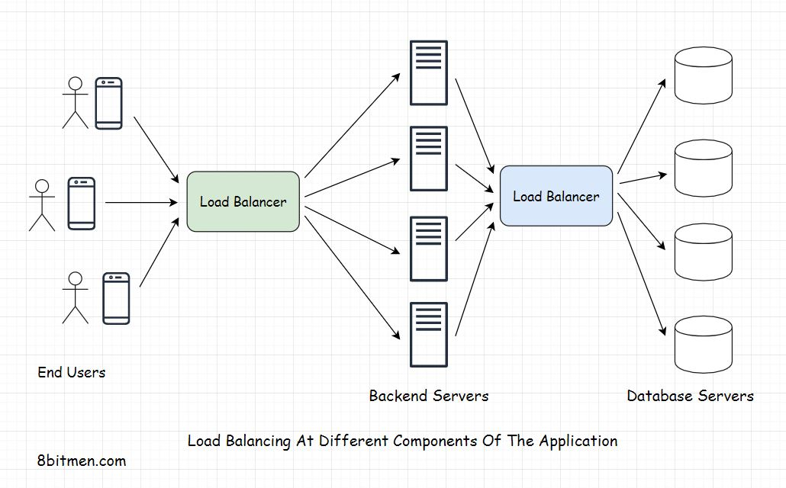

#### Performing Health Checks of The Servers With Load Balancers ####
1. Load balancer should be aware of the running status of servers to route all user requests to running servers in cluster
	1. Load balancers perform halth checks of machines in cluster
		1. Load balancer usually maintains a list of machines that are up and running in cluster in real-time
			1. If a machine goes down, it is removed from the list
				1. Machines that are down are known as out of service instances
		2. User requests are forwarded to only the machines that are in service
2. Synomyms:
	1. Node
	2. Server
	3. Server Node
	4. Instance
	5. Machine
3. If **out-of-service** instance comes back online and becomes in-service
	1. Load balancer updates the list
	2. Starts routing future requests to that particular instance (all over again)
4. Next: DNS Domain Name System

### Understanding DNS - Part 1 ###
1. Topics:
	1. Domain Name System
	2. How Does Domain name System Work?
2. Every machine online is part of world wide web (www)
	1. It has unique IP address
		1. Enables it to be contacted by other machines on web using IP address
			1. IP: Internet protocol
				1. Protocol that facilitates delivery of data packets from one machine to other using IP addresses
				2. Example: 2001:db8:0:1234:0:567:8:1
					1. To fetch content from the server, user has to type in unique IP address of server in browser url tab
						1. This is not a viable option (in terms of our memory)
3. Solution: Domain names
	1. It is easier to work with

#### Domain Name System ####
1. DNS averts the need to remember long IP addresses to visit a website by mapping easy to remember domain names to IP addresses
2. Example: amazon.com
3. [Wikipedia resource for IP addresses](https://en.wikipedia.org/wiki/IP_address)

#### How Does Domain Name System Work? ####
1. **DNS querying:**
	1. When url is typed in browser and enter is hit, it is called **DNS querying**
2. Four key components (group of servers) that make up DNS infrastructure
	1. DNS Recursive Nameserver aka DNS Resolver
	2. Root Nameserver
	3. Top-Level Domain Nameserver
	4. Authoritative Nameserver
3. Domain name system:
	
	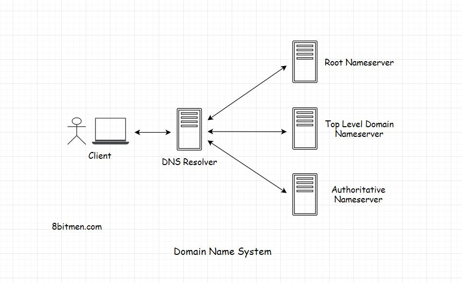
	
3. Next:
	1. How does DNS query lookup process work
	2. Role of the servers in lookup process

### Understanding DNS - Part 2 ###
1. Topics:
	1. DNS query lookup process:
	2. Role of servers in DNS infrastructure
2. Steps:
	1. User types domain name in to browser and hits enter
	2. Browser sends request to DNS recursive nameserver (DNS resolver)
		1. DNS resolver: Receives client request and forwards it to Root nameserver to get address of Top-Level domain nameserver
	3. DNS Recursive nameserver (managed by ISP Internet Service Provider)
		1. DNS is a distributed system setup in large data centers managed by ISPs
			1. Data centers: contain clusters of servers optimized to process DNS queries in minimal time (milliseconds)
			2. Top level domain for `amazon.com` is `.com`
	4. DNS Resolver receives address of top-level domain nameserver
	5. DNS Resolver sends request to top-level domain nameserver (to fetch details of domain name)
		1. `.com` top-level domain nameserver will contain information on domains using `.com`
		2. `.edu` top-level domain nameserver will hold info on domains using `.edu`
		3. Example: 
			1. `amazon.com` - DNS resolver will route request to `.com` top-level domain name server
	6. Top-level domain name server returns IP address of `amazon.com` domain name server
	7. `amazon.com` domain name server is last server in DNS query lookup process
		1. It is called **Authoritative nameserver**
		2. This is owned by owner of domain name
	8. DNS Resolver fires query to authoritative nameserver & then rerutns IP address of `amazon.com`
	9. DNS Resolver caches data
	10. DNS Resolver forwards it to client
	11. Browser sends request to the IP address of `amazon.com`
3. Usually DNS info is cached and DNS servers don't have to do so much re-routing each time client requests IP of website
4. DNS info is also cached in local machines
	1. Browsing devices with TTL Time to Live
		1. Modern browsers do this automatically to cut down DNS query lookup time when revisting website
5. Example: DNS lookup process

	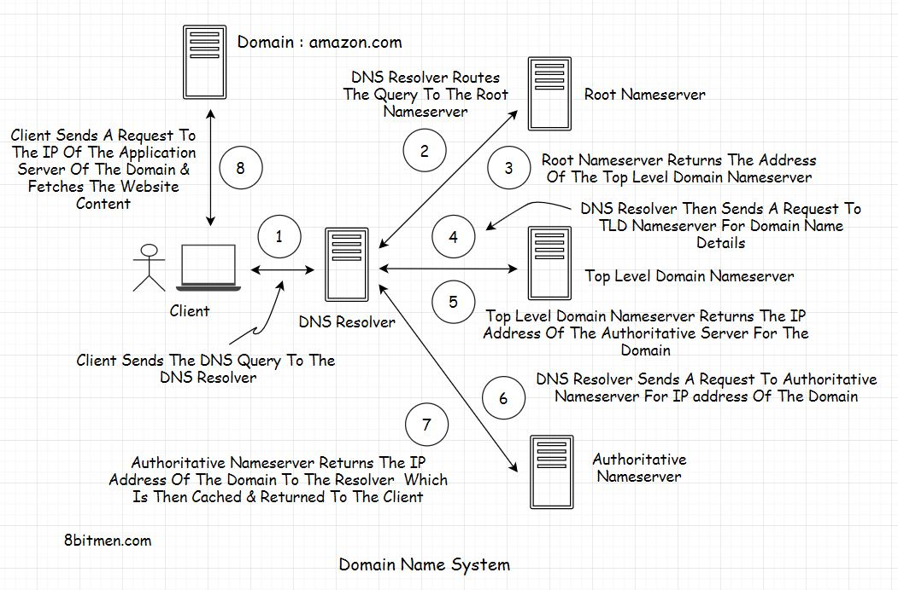

### DNS Load Balancing ###
1. Topics:
	1. DNS Load Balancing
	2. Limitations of DNS Load Balancing

#### DNS Load Balancing ####
1. Authoritative server returns the IP address of domain
2. Problem: `amazon.com` needs more than single machine to run it's services
	1. The services are deployed across multiple data centers in different geographical locations across the globe
3. To spread user traffic across different clusters in different data centers
	1. Load balancing is used
		1. **It is setup at DNS level on authoritative server**
4. Example: Authoritative server DNS

	
	
5. It enables authoritative server to return different IP addresses of certain domain to clients
	1. Each time it receives a query for IP, it returns a list of IP addresses of a domain to client
	2. For each request, the authoritative serve changes order of IP addresses in the list in round-robin fashion
	3. As client receives list, it sends request to first IP address on the list to fetch the data from website
		1. Why list?
			1. To enable it to use other IPs in case first doesn't return response within stipulated time
	4. If another client sends request for IP to authoritative server,
		1. IP addresses are re-ordered and another IP is put on the top of the list following round-robin algorithm
6. When client hits IP, it may hit another load balancer (at data center that manages clusters)

#### Limitations of DNS Load Balancing ####
1. Doesn't take existing load on servers into account
2. Doesn't account for content
3. Doesn't account for request processing time
4. Doesn't account for in-service status
5. If machine is out of service and IP addresses are cached by client's machine and DNS resolver, request can be sent to the server
6. Advantages of DNS load balancing:
	1. Easy and less expensive way of setting up load balancing on service
7. [Round Robin DNS](https://en.wikipedia.org/wiki/Round-robin_DNS)

### Load Balancing Methods ###
1. Topics
	1. Hardware Load Balancers
	2. Software Load Balancers
	3. Algorithms/ Traffic Routing Approaches Leveraged By Load Balancers
		1. Round Robin & Weighted Round Robin
		2. Least Connections
		3. Random
		4. Hash
2. Three modes of load balancing
	1. DNS Load Balancing
	2. Hardware-based Load Balancing
	3. Software-based Load Balancing
3. Both hardware based and software based load balancing is common ways to balance traffic load on large scale services

#### Hardware Load Balancers ####
1. HLBs are highly performant physical hardware
	1. Located in front of application servers
	2. Load is distributed based on 
		1. Number of existing open connections to a server
		2. Compute utilization
		3. ...
2. Cons:
	1. Physical hardware is involved so we need maintenance and updates (just like any other server hardware)
	2. They are expensive to setup as compared to software load balancers
	3. Upkeep may require certain skillset
		1. IT team & network specialists
			1. Hard for developers to wrap their head around but needs vendor assistance
				1. Hence developers prefer software load balancers
	4. May need overprovisioning them to deal with peak traffic (not required for software load balancers)

#### Software Load Balancers ####
1. Pros:
	1. It can be installed on commodity hardware and VMs
	2. Cost-effective and offer more flexibility to developers
	3. Easy to upgrade and provision (as compared to hardware load balancers)
	4. LBaaS - Load Balancer as a Service (online)
		1. Can be directly plugged into application without setup
	5. More advanced as compared to DNS load balancing
		1. They consider many parameters to route traffic across servers
			1. Content that servers host
			2. Cookies
			3. HTTP headers
			4. CPU utilization
			5. Memory utilization
			6. Load on the network
		2. Continual health checks are performed on servers to keep updated list of in-service machines
2. Software load balancers are peferred over hardware load balancers because the latter need specialists to manage
3. [HAProxy](https://www.haproxy.com/): Software load balancer widely used by big guns in industry
	1. GitHub
	2. Reddit
	3. Instagram
	4. AWS
	5. Tumblr
	6. StackOverflow
	7. ...
4. Software load balancers use several algorithms to route traffic across machines
5. Next: Algorithms

#### Algorithms/ Traffic Routing Approaches Leveraged By Load Balancers ####
##### Round Robin & Weighted Round Robin #####
1. Round Robin Algorithm: Sends IP address of machines sequentially to clients
	1. The following are not taken into consideration:
		1. Load on servers
		2. CPU consumption
		3. ...
2. Weighted Round Robin:
	1. Weights are assigned based on server's compute & traffic handling capacity
	2. Traffic is then routed to them using Round Robin Algorithm
	3. Pros:
		1. Traffic is converged to machines that can handle higher traffic load
			1. Efficient use of resources
	4. Applications:
		1. Useful when service is deployed in different data centers having different compute capacities
			1. More traffic can be directed to larger data centers with more machines

##### Least Connections #####
1. Traffic is routed to machine that has least open connections of all machines in cluster
2. Two approaches:
	1. First approach: Assumes all requests will consume equal amount of server resources & traffic is routed to the machine having least open connections
		2. Cons:
			1. There is a possibility that machine with least open connections might be already processing requests demanding most of the CPU power (more traffic must not be routed to this machine)
	2. Second approach: 
		1. Takes the following into consideration
			1. CPU utilization
			2. Request processing time
		2. Criteria for routing is:
			1. Machines with
				1. Less request processing time
				2. Less CPU utilization
				3. Least open connections
3. Applications:
	1. For long opened connections
		1. Persistent connections
			1. Example: Gaming applications

##### Random #####
1. Traffic is randomly routed to servers
2. Load balancer may find similar servers in terms of the following and randomly route the traffic
	1. Existing load
	2. Request processing time
	3. ...

##### Hash #####
1. Source IP where request is coming from and request URL are hadhed to route traffic to the backend server
	1. Source IP ensures that request of client with certain IP will always be routed to same server
		1. Better user experience
			1. Server has already processed initial client requests and holds client's data in local memory
				1. No need to fetch client session data from session memory of cluster & process
					1. Reduces latency
		2. Enables client to re-establish connection with same server if connection drops
	2. URL hashing ensures that requests with the url always hits certain cache that already has data on it
		1. Ensures no cache miss
			1. Avoids duplicating data in every cache and thus efficient implementation of caching
2. Next: Monoliths and Microservices

### Load Balancing Quiz ###

## Monolith & Microservices ##
### What is a Monolithic Architecture? ###
1. Topics:
	1. What is a Monolithic Architecture?

#### What is a Monolithic Architecture? ####
1. Definition: Application has monolithic architecture if it contains the entire application code in a single codebase
2. Monolithic application:
	1. Self-contained
	2. Single tiered
3. Example: Monolithic architecture

	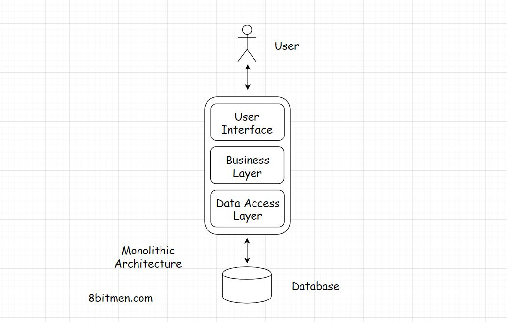
	
4. All layers of app are in same code base (UI, business, data access)
5. Layers of web app:
	1. Controller
	2. Service Layer Interface
	3. Class Implementations of Interface
	4. Business Logic goes into Object Domain Model (a portion of it)
	5. Business Logic goes into Service (a portion of it)
	6. Business Logic goes into Business Layer (a portion of it)
	6. Business Logic goes into Repository/DAO Layer (a portion of it)
6. Example: Layers of Web Application

	
	
7. Advantages with monoliths:
	1. Simple to build
	2. Simple to test
	3. Simple to deploy
8. A strategy used by business
	1. Move forward with monolithic architecture
	2. Branch out to distributed microservices architecture later on
9. There are tradeoffs with the above approach and there is no standard solution
	1. Wise decision:
		1. Pick loosely coupled stateless microservices architecture right from start if it is expected to grow at quite a pace in the future
			1. Re-writing stuff is costly
				1. Stripping down things from tightly coupled architecture and re-writing stuff demands lot of resources and time
		2. But if requirements are simple, why bother writing microservices architecture?
			1. Running different modules in conjuction with each other isn't a cakewalk
10. Next: Pros and cons of monolithic architecture

### When Should You Pick a Monolithic Architecture? ###
1. Topics:
	1. Pros of Monolithic Architecture
		1. Simplicity
	2. Cons of Monolithic Architecture
		1. Continuous Deployment
		2. Regression Testing
		3. Single Points of Failure
		4. Scalability Issues
		5. Cannot Leverage Heterogeneous Technologies
		6. Not Cloud-Ready, Hold State
	3. When Should You Pick a Monolithic Architecture?

#### Pros of Monolithic Architecture ####
##### Simplicity #####
1. Monolithic applications are simple to develop, test, deploy, monitor and manage since everything resides in one repo
2. No complexity of 
	1. Handling different components
	2. Making them work in conjunction with each other
	3. Monitoring different components
	4. ...

#### Cons of Monolithic Architecture ####
##### Continuous Deployment #####
1. It is a pain
	1. Even minor code change in a layer needs re-deployment of entire application

##### Regression Testing #####
1. Once deployment is done, we need thorough regression testing of entire application (layers are tightly coupled with each other)
	1. Change in one layer may impact other layers significantly

##### Single Points of Failure #####
1. Monoliths have single point of failure
	1. If any layer has a bug, it can take down the entire application

##### Scalability Issues #####
1. Flexibility & scalability is an issue
	1. Change in one layer needs change and testing in all layers
		1. More tricky if code size changes

##### Cannot Leverage Heterogeneous Technologies #####
1. We cannot use heterogeneous technologies in single code base
	1. Compatibility issues
		1. Tricky to use Java and NodeJS in a single code base (may not even be possible)

##### Not Cloud-Ready, Hold State #####
1. Monolithic applications hold state in state variables hence not cloud ready
	1. Applications to be cloud native to work smoothly & be consistent on cloud must be:
		1. distributed
		2. stateless

##### When Should You Pick a Monolithic Architecture? #####
1. When requirements are pretty simple
2. App is expected to handle limited amount of traffic
	1. Example: Internal tax calculation app
	2. Use cases where business is certain that ther won't be exponential growth in user base and traffic over time
3. Dev teams could start with monolith and then scale out to distributed microservices architecture
	1. Helps team deal with complexity of application step by step as and when required:
		1. [This is exactly what LinkedIn did](https://engineering.linkedin.com/architecture/brief-history-scaling-linkedin)

### What is a Microservice Architecture? ###
1. Topics:
	1. What is a Microservices Architecture?

#### What is a Microservices Architecture? ####
1. Definition: In microservices architecture, different features/ tasks are split into separate respective modules/ codebases which work in conjunction with each other forming a large service as a whole
2. Advantages
	1. Principles:
		1. Single responsiblity principle
		2. Separation of concerns
	2. Easier and cleaner in the following aspects
		1. App maintenance
		2. Feature development
		3. Testing
		4. Deployment
	3. If project is large, it is expected to be managed by several different teams
		1. If modules are deparate, they can be assigned to respective teams with minimum fuss
			1. Smoothens the development process
3. Accommodating every feature in a single repo is complex
	1. Maintenance nightmare
4. Scalability:
	1. We need to scale out if we cannot scale up further
		1. Microservices architecture is inherently designed to scale
5. Example: Microservice architecture scalable

	
	
6. Every service has separate database
	1. No single point of failure
	2. No system bottlenecks
7. Next: Pros and cons of microservices architecture

### When Should You Pick A Microservices Architecture? ###
1. Topics:
	1. Pros of Microservice Architecture
		1. No Single Point of Failure
		2. Leverage the Heterogeneous Technologies
		3. Independent & Continuous Deployments
	2. Cons of Microservices Architecture
		1. Complexities in Management
		2. No Strong Consistency
	3. When Should You Pick a Microservices Architecture?

#### Pros of Microservice Architecture ####
##### No Single Points of Failure #####
1. Even if few of the services go down, the application as a whole is still up

##### Leverage the Heterogeneous Technologies #####
1. Each component interacts with the other via REST API Gateway interface
2. Each component can leverage polyglot persistence architecture
	1. Polyglot persistence:
		1. Using multiple database types like SQL, NoSQL etc...
3. Each component can use technologies such as Java, Python, Ruby, NodeJS ... together

##### Independent & Continuous Deployments #####
1. Deployment can be independent & continuous
2. A team can be dedicated for every microservice
3. Each microservice can be scaled without impacting other services

#### Cons of Microservices Architecture ####
##### Complexities in Management #####
1. Many nodes run together (distributed)
2. Managing and monitoring gets complex
	1. Additional components such as Apache Zookeeper, distributed tracing service are required for monitoring
3. More skilled resources are required
	1. May be a dedicated team

##### No Strong Consistency #####
1. Strong consistency is hard to guarantee in distributed environment
	1. Things are eventually conistent across nodes (distributed design causes this)

#### When Should You Pick a Microservices Architecture? ####
1. It is for complex use cases
2. It is for apps that expect traffic to increase exponentially in future
	1. Example: fancy social network application
		1. Components typically used:
			1. Messaging
			2. Real-time chat
			3. LIVE video streaming
			4. Image uploads
			5. Like
			6. Share
			7. ...
		2. Each component can be developed separately keeping
			1. Single Responsibility Priciple
			2. Separation of Concerns Principle
3. Three approaches:
	1. Picking a monolithic architecture
	2. Picking a microservice architecture
	3. Starting with monolithic architecture and later scale out into microservice architecture
4. Instructor's suggestion:
	1. Keeping things simple
	2. Understand requirements thoroughly
	3. Build something when you need it
	4. Keep evolving code iteratively

### Monolith & Microservices - Understanding the Trade-Offs - Part 1 ###
1. Topics:
	1. Fault Isolation
	2. Development Team Autonomy
	3. Segment - From Monolith to Microservices and Back Again to Monolith
2. This lesson:
	1. Trade-offs involved when choosing between monolith and microservices architecture

#### Fault Isolation ####
1. Microservices architecture makes it easy for us to isolate faults and debug them
	1. If glitch occurs in a service, we can fix the issue in that service without need to scan entire codebase in order to locate and fix that issue
		1. This is known as fault isolation
	2. If service goes down due to the fault, other services are up and running
		1. This is minimal impact on the system

#### Development Team Autonomy ####
1. If monolith:
	1. If number of developers and teams working on single codebase grows beyond certain number
		1. It may impede productivity and velocity of teams
	2. As size of codebase increases, compile-time & time required to run the tests increases
		1. Entire codebase has to be compiled as opposed to compiling module we work on (really?)
	3. If code changes are made by another team
		1. It may have direct impact on features we develop
		2. It may break the functionality of our feature
	4. Thorough regression testing is required every time anyone pushes new code or update to production
	5. As code is pushed to production, we need all teams to stop working on codebase until change is pushed to production (really?)
	6. Code pushed by certain team may require approval from other teams in organization working on same codebase (bottleneck)
2. If microservices:
	1. Separate teams have 
		1. Complete ownership of codebases
		2. Development and deployment autonomy over their modules with separate deployment pipelines
	2. Code management is easier (really?)
	3. It is easier to scale individual services based on traffic load patterns (agree)
3. If we need to move fast
	1. Lauch a lot of featurs quick to market and scale
		1. Microservices is a good bet
4. Cons:
	1. Increase in complexity of architecture
	2. Needs the following:
		1. Distributed logging
		2. Monitoring
		3. Inter-Service Communication
		4. Service Discovery
		5. Alerts
		6. Tracing
		7. Build & release pipelines
		8. Health checks
		9. ...
		10. May also need custom tooling from scratch
5. There are tradeoffs involved (no perfect or best solution)
	1. We need to be crystal on our use case and decide what architecture suits our needs the best

#### Segment - From Monolith to Microservices and Back Again to Monolith ####
1. [Segment](https://segment.com/)
	1. First started with monolith and then split it into microservices
	2. Later reverted to monolith architecture
2. Why?
	1. Microservices:
		1. For fault isolation - minimized damage cause by system
			1. Since fault is usually confined to (not necessarily) one service (as opposed to entire system and bringing it down)
		2. Easy debugging of issues
		3. A glitch in monolith has the potential to impact the entire system
		4. A separate microservice was constructed for every data provider
			1. Increase in number of microservices led to increase in complexity of architecture significantly (taking a toll on productivity)
			2. Defects with regards to microservices increased significantly
				1. Resources were dedicated to handle microservices related issues
					1. Operational overhead - slowed down the organization
	2. Monolith:
		1. To overcome above issues, team moved to monolith
			1. They gave up fault isolation etc...
		2. The monolith is called Centrifuge

### Monolith & Microservices - Understanding the Trade-Offs - Part 2 ###
1. Topics:
	1. Segment High-Level Architecture
	2. Istio - The Move From Microservices to a Monolith

#### Segment High-Level Architecture ####
1. Data infrastructure ingests hundreds of thousands of events every second
	1. Events are directed to APIs & Webhooks via message queue
		1. APIs are server side destinations (there are over a 100 of them)
	2. Initial stage:
		1. API injested events from different sources to distributed message queue
		2. Queue moved event payload to different destination APIs
2. Example: Event distribution monolith architecture:

	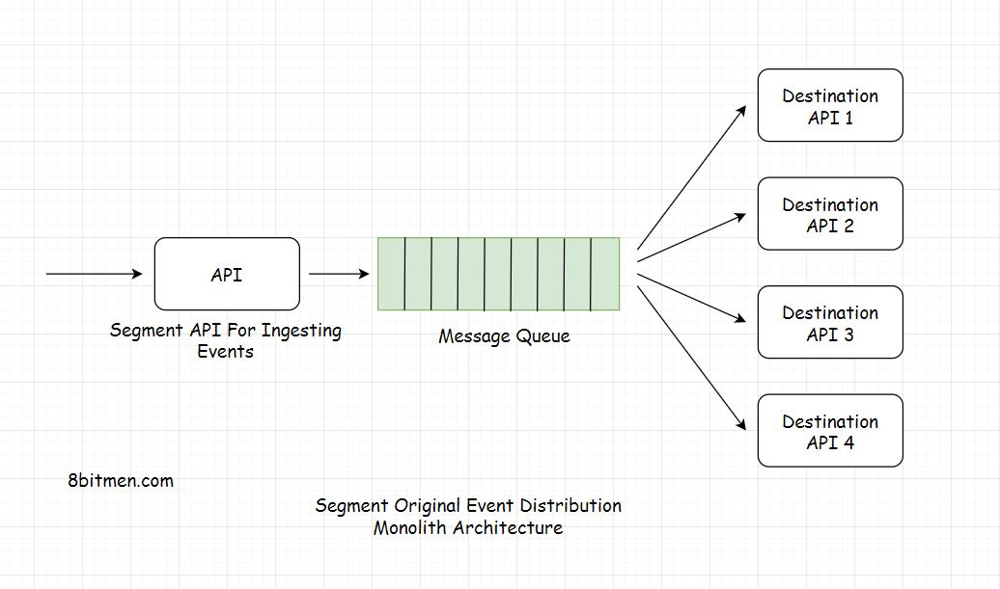
	
3. Note: Message queue, webhook, data injestion are discussed later
4. If events are moved to a single queue, some events failed to deliver to destinations and were retried by queue after stipulated time intervals
	1. Enables queue to contain both new and failed events - waiting to be retried
		1. This flooded the queue which caused delays of delivery of events to destinations
			1. Solution: Engineering team at Segment split monolith into microservices and constructed a separate microservice for every destination
				1. Each service contained its own queue
				2. Enabled scaling of system
5. Example: Segment microservices architecture

	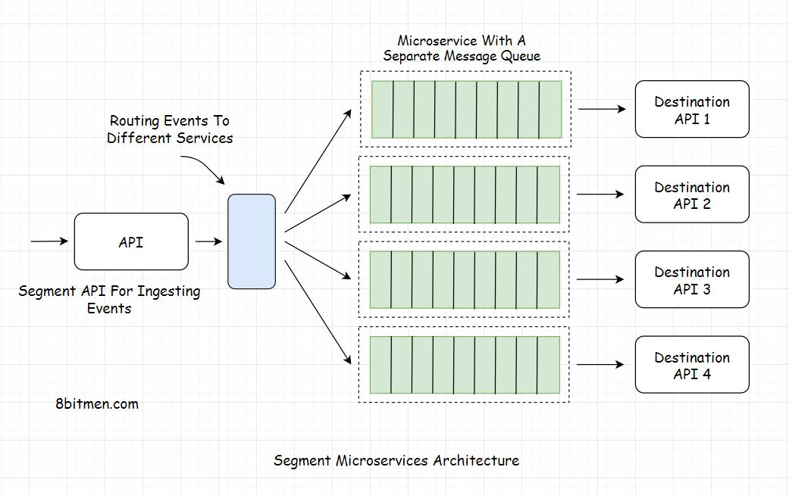
	
6. If certain queues got flooded, it did not impact the event delivery of other services
7. When business gained traction, additional destinations were added
	1. Each destination had separate microservice and queue
		1. Increased the complexity of the architecture
8. Separate services had seperate event throughput & traffic load patterns
	1. Single scale policy couldn't be applied on all queues
	2. Every service and queue needed to be scaled differently based on traffic load pattern
		1. Had to be done manually
9. Auto-scaling:
	1. Was implemented in infrastructure
	2. Every service had distinct CPU & memory requirements
		1. This needed manual tuning of the insfrastructure
			1. Means more queues needed more resources for maintenance
	3. Solution:
		1. Segment reverted to monolith calling infrastructure as centrifuge
			1. Combined all individual queues for different destinations into single monolith service
10. Centrifuge architecture: [Goodbye Microservices: From 100s of Problem Children to 1 Superstar](https://segment.com/blog/goodbye-microservices/)	
	1. [Centrifuge: A Reliable System For Delivering Billions of Events Per Day](https://segment.com/blog/introducing-centrifuge/)

#### Istio - The Move From Microservices to a Monolith ####
1. [Istio](https://istio.io/)
	1. Open source service mesh:
	2. It enables to connect secure, control and observe microservices
	3. It enables us to control over how microservices share data with each other
2. It transitioned form microservices to monolith architecture
3. [Istio is An Example of When Not to Do Microservices](https://blog.christianposta.com/microservices/istio-as-an-example-of-when-not-to-do-microservices/)
4. [Microservices - Are They Still Worth It?](https://www.youtube.com/watch?v=sZd4xTQlrIE&t=44s)

### Monolith & Microservices Quiz ###

## Micro Frontends (- New -) ##
### Introduction to Micro Frontends ###
1. Topics:
	1. What are Micro Frontends?
	2. Micro Frontends E-Commerce Application Example

#### What are Micro Frontends? ####
1. Micro frontends: Separate loosely coupled components of UI
	1. Deployed using principles of microservices on front end
	2. It is more of architectural design decision & development appraoch (it is not a technology)
		1. What does it mean?
			1. Microservices provide complete autonomy to teams deploying them
			2. They are loosely coupled
			3. They provide fault isolation
			4. It offers freedom to pick the technology stack to individual teams to develop certain service
	5. Micro frontends has same upsides to front-end development
		1. Generally despite having a microservice architecture on the backend, front end is monolith (developed by dedicated front-end team)
2. Example: Monolithic Frontend

	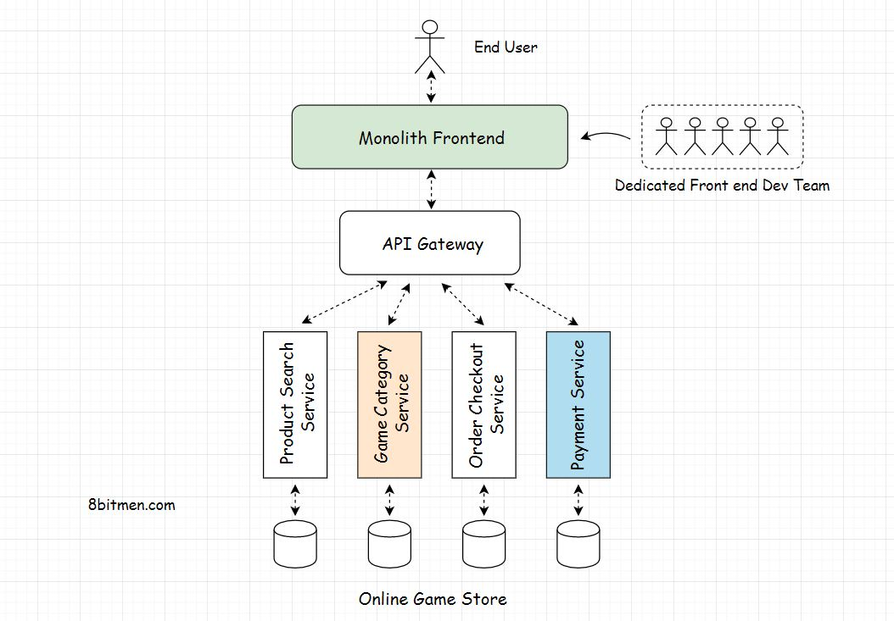
	
3. Micro frontends:
	1. The application (UI) is split into vertical slices
		1. Single slice goes from UI to database
			1. Each slice is owned by a dedicated team
				1. front-end devs of each slice develop UI component only of that service
				2. Team chooses their desired technology
	2. All the components then are integrated together to form complete UI of application
4. Example: Team with microfrontends

	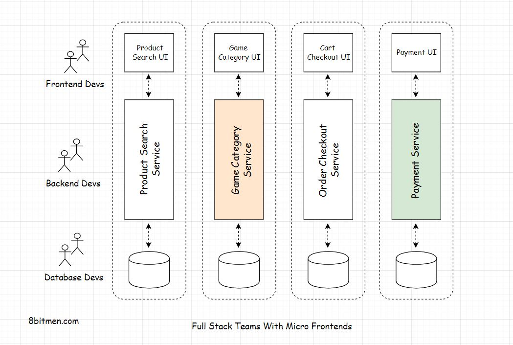

#### Micro Frontends E-Commerce Application Example ####
1. E-Commerce: Micro frontends is popular with E-Commerce websites
	1. Online game store:
		1. Delivers DVDs of all kinds of video games for desktops and consoles
			1. Xbox, Nintendo Switch, Play Station, ...
	2. Gamestore may have many different UI components
		1. **Search component**: search bar on top centre of website that enables users to search games based on keywords
			1. If user runs a search, component enables user to filter search results based on several options
				1. price range
				2. type of console
				3. game genre
				4. ...
		2. **Game Category Component**: Component displays popular and widely searched games of different categories on home page of website
		3. **Add to Cart & Checkout Component**: The UI component enables users to add games of their liking to cart and proceed with checkout filling in address & other required info to make final payment
			1. During checkout, website may recommend related games to user as upsells
			2. Use can also apply coupons & gift cards if he has any
		4. **Payment Component**: Payment UI component offers different payment options to user & facilitates order payment once user enters his card details on page
2. Every UI component has dedicated microservice running on backend powering particular UI component
	1. Each component is managed by dedicated full-stack teams
3. Complete UI of app is rendered combining different individual UI components called Mirco Frontends

### The Need for Micro Frontends ###
1. Topics:
	1. Easier Co-ordination with the Front End Devs
	2. Leveraging the Right Technology
2. How to divide:
	1. Each team may own a dedicated page in applcation (checkout page say)
	2. Each team may own components that fit in certain page (game category component on home page)
	3. Each team can own a combination of dedicated page and/or smaller UI component(s) of another page
	4. Fragments: Smaller components that integrate into a page
3. Example: UI fragment integration

	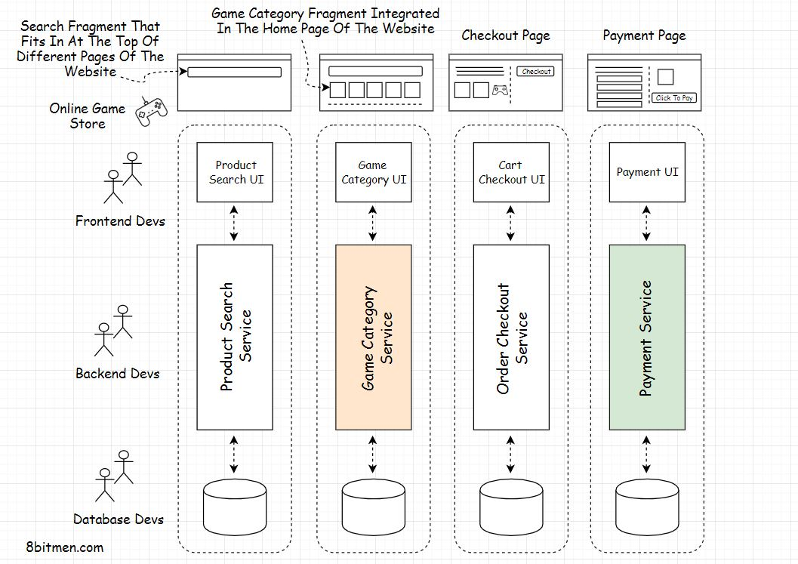
	
4. Why split monolith UI?

#### Easier Co-ordination With the Front End Devs ####
1. Averts need for dedicated front-end team
2. Front-end devs work along with backend devs in same team
	1. Saves time spent in cross-team coordination between backend microservices and front-end teams
3. Communication is quick and not so formal (how?)
4. Improves team's productivity
5. Enables them to deliver better UX (more effective coordination between backend and frontend devs)

#### Leveraging the Right Technology ####
1. Micro frontends are loosely coupled
	1. They can be developed leveraging different technologies
		1. Single UI technology does not have to be used to build entire front-end
			1. Multiple technologies exist for front-ends + JavaScript frameworks
				1. There are use cases where:
					1. Plain JavaScript, HTML, CSS suffice
					2. Advanced frameworks like React, Angular & Vue are required for certain features
			2. If multiple teams are using the same technology, they can work on different versions of the technology
				1. Libraries can be upgraded independently without impacting other UI components
2. Example: Website UI built as Micro Frontends

	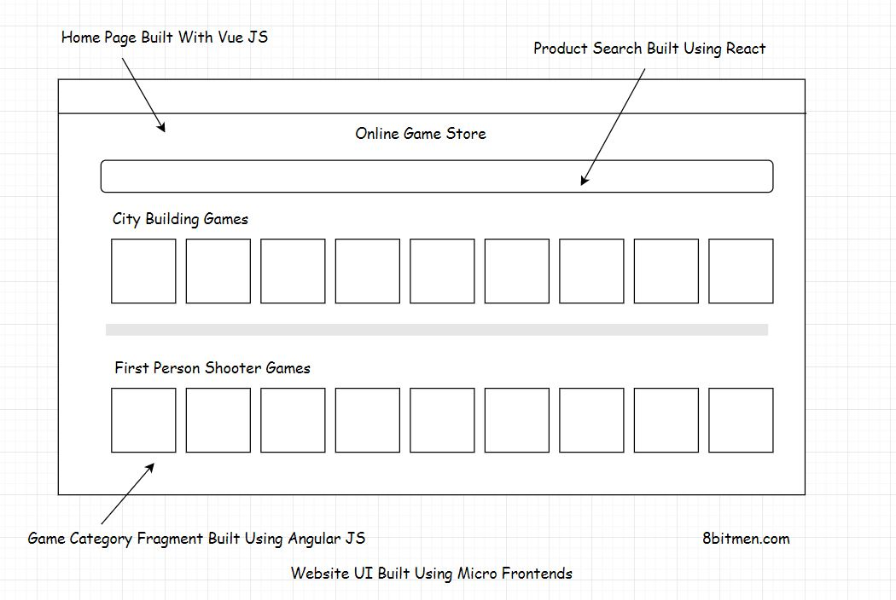
	
3. Use cases:
	1. Micro frontends are good for medium to large websites (not so useful for simple use cases)
		1. Multiple technologies bring architectural & maintenance complexities with them
			1. Additional logic may be required to bring the components together
		2. There could be compatibility issues
		3. There could be performance issues
4. [Engineering Culture at Spotify](https://labs.spotify.com/2014/03/27/spotify-engineering-culture-part-1/)
5. Next: How micro frontends are integrated with each other

### Micro Frontends Integration ###
1. Topics:
	1. Client-Side Integration of Micro Frontends
	2. Server-Side Integration
	3. Technology & Frameworks Facilitating Server Side Integration
2. Once we have micro-frontends for online game store, we need to integrate them together to have functional website
	1. Two ways we can do this:
		1. By integrating micro frontends on the client
		2. By integrating micro frontends on the server
3. Similar to client side and server side rendering
	1. Additional logic is required for integration of UI components
4. Next: client side integration process

#### Client-Side Integration of Micro Frontends ####
1. One naive way to integrate (according to trainer): Micro-frontends with unique links
	1. Links are placed on website to navigate to certain micro-frontend
2. Example: Link Integration

	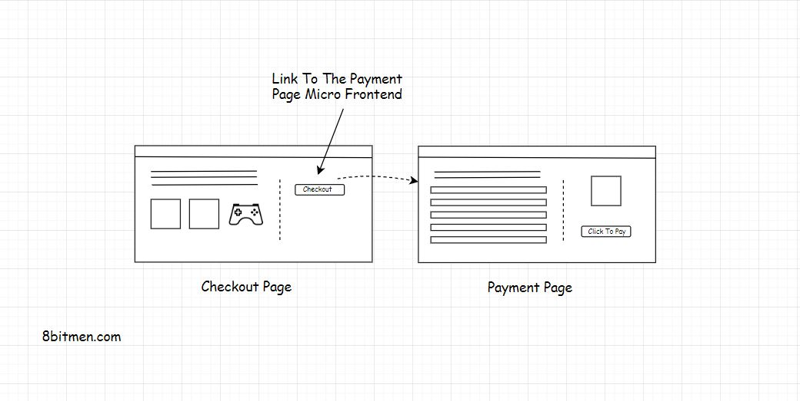
	
3. Checkout microservice: hosted on AWS (say) with link https://www.aws.amazon.com/onlinegamestore/checkout
4. Payment service: hosted on Google Cloud with link https://www.cloud.google.com/onlinegamestore/payment
5. If navigation takes place from checkout page to payment page, address in browser changes from AWS URL to Google Cloud URL visible to end-user
	1. Iframes can be used to integrate within a specific page
6. Cons: 90s way of building websites (connecting web-pages using links and iframes)
	1. [Google reasons why not to use iframes in page content](https://stackoverflow.com/questions/23178505/good-reasons-why-not-to-use-iframes-in-page-content)
7. Micro-services frontends integration using iframes:

	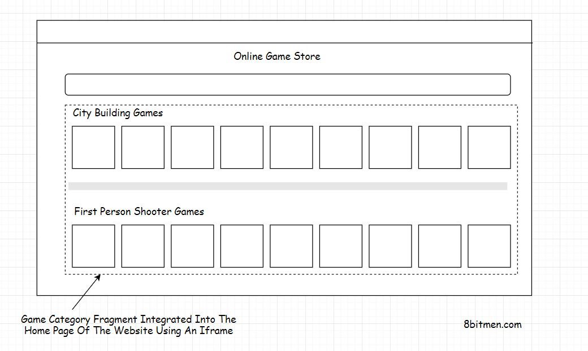
	
8. Other modern ways: (recommended by trainer)
	1. Client-side: Web components, [Single SPA](https://single-spa.js.org/)
		1. Mozilla docs:
			1. Web components is a suite of different technologies allowing you to construct re-usable custom elements - with their functionality encapsulated away from the rest of your code - and utilize them in your web apps
				1. [Web Components: The Secret Ingredient Helping Power The Web](https://www.youtube.com/watch?v=YBwgkr_Sbx0)
	2. Single SPA: JavaScript framework for frontend microservices that enables developers to build their frontend leveraging different JavaScript frameworks
		1. [Introduction to Single SPA](https://www.youtube.com/watch?v=L4jqow7NTVg)
		2. [Canopy Tax](https://www.getcanopy.com/) - cloud-based accounting software for working professionals
			1. It leverages Single SPA framework to build micro frontends
		3. [A Step by Step Guide to Single Spa by Canopy](https://medium.com/canopy-tax/a-step-by-step-guide-to-single-spa-abbbcb1bedc6)
9. Next: Server Side Integration

#### Server-Side Integration ####
1. Complete pre-built page of website is delivered to client from server (instead of sending individual micro-frontends to client and then having them clubbed there)
	1. Cuts down loading time of website on client significantly
		1. Browser does not have to do any heavy lifting
	2. Needs separate logic on server to integrate micro-frontends

#### Technology & Frameworks Facilitating Server Side Integration ####
1. [Zalando](https://www.zalando.com/) - fashion e-commerce company in Europse that uses [Project Mosaic](https://www.mosaic9.org/)
	1. [Zalando Recipe for Scalable Frontends](https://www.youtube.com/watch?v=m32EdvitXy4&feature=youtu.be)
2. [Open Components](https://opencomponents.github.io/)
	1. Open source micro frontends framework used for integrating micro frontends on server
3. [Open Table](https://www.opentable.com/) - San Francisco based online restaurant reservation company
	1. It uses Open Components Framework to manage micro frontends
	2. [Here is a talk on YouTube](https://www.youtube.com/watch?v=M4OXXRdCpyQ) - on their approach
4. [Server Side Includes SSI](https://en.wikipedia.org/wiki/Server_Side_Includes) - server-side scripting language used for clubbing content of multiple web pages on webserver
5. [AutoScout24](https://www.autoscout24.com/)
	1. Internet car portal from Europe
	2. SSI Server Side Includes technology is used to build micro-frontends
		1. [They gave a talk about micro frontends approach](https://www.thoughtworks.com/talks/a-high-performmance-solution-to-microservice-ui-composition)
6. [Page building using Micro-Frontends and Server-Side Includes](https://itnext.io/page-building-using-micro-frontends-c13c157958c8)
	1. [Podium](https://podium-lib.io/) - framework that facilitates easy server-side composition of micro frontends
	2. [Finn.no](https://www.finn.no/) - Norwegian classified ad website
		1. Website uses Podium framework

## Database ##
### Introduction & Types of Data ###
1. Topics:
	1. What is a Database?
	2. Structured Data
	3. Unstructured Data
	4. Semi-structured Data
	5. User state

#### What is a Database? ####
1. Database: component required to persist data
	1. data can be in many forms:
		1. Structured
		2. Unstructured
		3. Semi-structured
		4. User state data
2. [web_application_architecture](web_application_architecture.jpeg)
	1. Classification of data before delving into databases

#### Structured Data ####
1. It is a type of data that conforms to certain structure
	1. Stored in database typically in normalized fashion
	2. No data preparation logic is required for structured data before processing it
	3. Direct interaction can be done with this kind of data
2. Example of structured data:
	1. Personal details of customer stored in database row
		1. Customer id - integer type
		2. Name - string type (with character limit)
3. The types are well defined:
	1. For example with string type, without worry for errors or exceptions, we can run String operations on it
2. SQL (Structured query language) is generally used to manage structured data

#### Unstructured Data ####
1. Unstructured data has no definite structure
	1. It is heterogeneous type of data comprising
		1. Text
		2. Image files
		3. Video
		4. Multimedia files
		5. pdfs
		6. Blob objects
		7. word documents
		8. machine-generated data
		9. ...
2. Kind of data encountered in data analytics
	1. Data streams in from multiple sources such as IoT devices, social networks, web portals, industry sensors ... into analytics systems
3. **Unstructured data cannot be directly processed**
	1. Raw data (initial data) needs to flow through a data preparation state which segregates it based on business logic
	2. Then it runs analytics algorithms on it

#### Semi-structured Data ####
1. It is a mix of structured & unstructured data
2. Usually stored in data transport formats:
	1. XML
	2. JSON
3. It is handled as per business requirements

#### User state ####
1. Data containing user state is info of activity which user performs on website
	1. Example:
		1. If e-commerce website is browsed
			1. User might browse through product categories
			2. User can change preferences
			3. User can add few products to reminder list for price drops
		2. The activity is user state
			1. When user logs in next time, he can continue from where he left off
				1. User would not feel that he is starting fresh and all previous activity is lost
		3. Storing user state improves browsing experience & conversion rate for business
2. There are different types of databases with specific use cases

### Relational Database ###
1. Topics:
	1. What is a Relational Database?
	2. What are Relationships?
	3. Data Consistency
	4. ACID Transactions

#### What is a Relational Database? ####
1. Common & widely used DB type in industry
2. It saves data containing relationships (not really from the definition - it is more mathematical term)
	1. One to One
	2. One to Many
	3. Many to Many
	4. Many to One
3. It has relational model
4. SQL is primary data query language used to interact with relational databases
5. MySQL - popular example of database

#### What are Relationships? ####
1. Example: Customer buying 5 different books from bookstore
	1. Let C1 be id of account on bookstore
	2. C1 is linked to 5 different books B1, B2, B3, B4, B5
2. One-to-Many relationship
	1. Simple implementation
		1. one table contains details of all customers
		2. another table contains all products in inventory
	2. One row in customers table correspond to multiple rows in product inventory table
	3. If we pull object with id C1, we can find out what books C1 purchased via relationship model

#### Data Consistency ####
1. Relational databases ensure saving data in normalized fashion
	1. Normalized data:
		1. Unique entity occurs in only one place/ table
			1. In simplest and atomic form and is not spread throughout database
		2. Helps in maintaining consistency of data
			1. In future, we can update only in that one place
				1. Every fetch operation gets the updated data
2. If data was spread in different places:
	1. One may have to update new value of entity everywhere
		1. May cause inconsistency (how?)
			
#### ACID Transactions ####
1. Relational databases ensure ACID transactions
	1. ACID: Atomicity, Consistency, Isolation, Durability
2. ACID transaction:
	1. If transaction in system occurs (financial transaction say) it will be executed with perfection without affecting any other processes or transactions (system will have new state after transaction which is durable & consistent) or if anything else happens (during transaction), the entire operation is rolled back
	2. When transaction happens, systems moves from State A to State B
		1. Both states are consistent and durable
			1. Relational database ensures that either system is in State A or State B at all times but not in an in-between state
				1. If a transition is initiated from State A to State B but something fails, then system goes back to State A
				2. If a transition is initiated from State A to State B and everything goes well, then system transitions from State A to State B

### When Should You Pick A Relational Database? ###
1. Topics:
	1. Transactions & Data Consistency
	2. Large Community
	3. Storing Relationships
	4. Popular Relational Databases
2. Use cases:
	1. Stock trading app
	2. Banking app
	3. Finance-based app
	4. ... (where lot of relationships have to be stored)
		1. Social network like Facebook

#### Transactional & Data Consistency ####
1. If software has to do with money or numbers then following are important
	1. Transactions
	2. ACID
	3. Data consistency
2. Relational DBs are good for transactions & data consistency
	1. ACID rule compliant
	2. Battle tested over ages

#### Large Community ####
1. Seasoned engineers are easily available

#### Storing Relationships ####
1. Good for storing a lot of relationships
	1. Which friends live in particular city?
	2. Which friend already ate at restaurant you plan to visit today?
2. Relational databases are built to store relationships
	1. Used by big guns in the industry like [Facebook as the main user-facing database](https://www.8bitmen.com/what-database-does-facebook-use-a-1000-feet-deep-dive/)

#### Popular Relational Databases ####
1. MySQL - it is open source relationship database written in C, C++
2. Microsoft SQL Server - proprietary RDBMS written by Microsoft in C, C++
3. PostgreSQL - open-source RDBMS written in C
4. MariaDB
5. Amazon Aurora
6. Google Cloud SQL
7. ...
8. Next: non-relational databases

### NoSQL Databases - Introduction ###
1. Topics:
	1. What is a NoSQL Database?
	2. How is a NoSQL Database Different From a Relational Database?
	3. Scalability
	4. Clustering

#### What is a NoSQL Database? ####
1. NoSQL databases have no SQL
	1. They are typically JSON-based databases built for Web 2.0
2. They are built for high frequency read & writes
	1. Typically for social applications
		1. Twitter
		2. LIVE real-time sports apps
		3. Online massive multi-player games
		4. ...

#### How is a NoSQL Database Different From a Relational Database? ####
1. Why NoSQL databases when relational databases were doing fine, were battle-tested, well adopted by industry & had no major persistence issues?

#### Scalability ####
1. Big limitation with SQL based relational databases: Scalability
	1. Scaling relational databases is not trivial
		1. They need to be sharded or replicated to run them smoothly on cluster
			1. Needs careful thought and human intervention (what is sharding and replication?)

#### Clustering ####
1. NoSQL dbs are designed to run intelligently on clusters
	1. With minimal human intervention
	2. With self-healing capabilities
		1. Infrastructure is intelligent enough to self-recover from faults
	3. (Q - why cant relational databases have these capabilities?)
	4. NoSQL dbs had to sacrifice Strong consistency (ACID Transactions etc... to scale horizontally over cluster & across data centres)
		1. Data with NoSQL dbs are eventually consistent as opposed to strongly consistent
			1. Distributed nature is perferred over consistency
2. NoSQL database design results in the sacrifice of:
	1. Strong consistency
	2. Transactions
3. Next: Features of NoSQL databases

### Features of NoSQL Databases ###
1. Topics:
	1. Pros of NoSQL Databases
	2. Gentle Learning Curve
	3. Schemaless
	4. Cons of NoSQL Databases
	5. Inconsistency
	6. No Support for ACID Transactions
	7. Conclusion
	8. Popular NoSQL Databases
2. NoSQL dbs are built to run on clusters in distributed environment (powering Web 2.0 websites)
3. Next: Features of NoSQL dbs

#### Pros of NoSQL Databases ####
1. They are more developer friendly
	1. How?

#### Gentle Learning Curve ####
1. How?
	1. Learning curve is less than relational databases
		1. One needs to learn well normalized tables when dealing with relational databases (is it?)
			1. One needs to setup relationships trying to minimize joins ...

#### Schemaless ####
1. Schemas have to be defined carefully to avoid issues in the future
	1. Things are designed to be consistent
	2. Things are designed to be need and tidy
2. NoSQL doesn't enforce strict schemas
	1. One can work on data as they want
		1. Entities have no relationships
3. Pros and Cons:
	1. Flexibility is good or bad at times
		1. For developer the following might seem to be good
			1. Flexibility
			2. Developer-friendly
			3. No joins and relationships
			4. ...

#### Cons of NoSQL Databases ####
##### Inconsistency #####
1. Entities might become inconsistent at the same time (since entity is spread throughout the database one has to update new values in all the places)
	1. If we do not update, it makes the entity inconsistent
		1. In relational databases, since entities are normalized, there is no inconsistency issues (entities reside in one place only)

#### No Support for ACID Transactions ####
1. NoSQL distributed databases do not provide ACID transactions (at least not globally - only to a certain entity hierarchy or small region where they can lock down nodes to update them)
	1. Transactions in distributed systems come with terms and conditions applied

#### Conclusion ####
1. Google Cloud Datastore
	1. One does not have to be a pro in database design to write application
		1. Don't have to manage joins, relations, n+1 query issues (?) ...
			1. Fetch with key - O(1) operation - this makes NoSQL Dbs fast
2. Extra calls to backend can be made more efficient by caching frequently accessed data

#### Popular NoSQL Databases ####
1. MongoDB
2. Redis
3. Neo4J
4. Cassandra
5. Next: uses cases that fit for NoSQL

### When to Pick a NoSQL Database? ###
1. Topics:
	1. Handling a Large Number of Read Write Operations
	2. Flexibility With Data Modeling
	3. Eventual Consistency Over Strong Consistency
	4. Running Data Analytics

#### Handling a Large Number of Read Write Operations ####
1. We can look towards NoSQL databases when we need to scale fast
	1. When?
		1. When there are a lot of read-write operations on website
		2. When dealing with large amount of data
	2. How?
		1. These databases have ability to add nodes on the fly
		2. These databases can handle more concurrent traffic & big amount of data with minimal latency

#### Flexibility With Data Modeling ####
1. During initial phases of development (when not sure about data model, database design)
	1. Things may change at a rapid pace
		1. Solution: NoSQL database (offers more flexibility) (is it?)

#### Eventual Consistency Over Strong Consistency ####
1. NoSQL is good if we give up on Strong consistency and when we do not need transactions
	1. Example: Social networking website (Twitter)
		1. If tweet of a celebrity blows up and everyone is liking and re-tweeting from around the world
			1. It does not matter if count of likes goes up or down a bit for a short while
				1. 5 million 500 actual likes against 5 million 250 likes for some time is okay (eventually consensus might be reached)
2. When large app is deployed on hundreds of servers spread across globe, geographically distributed nodes take some time to reach global consensus
	1. Until consensus is reached, the value of the entity is inconsistent
		1. The value of entity eventually gets consistent after a short while (how?)
			1. This is called **eventual consistency**

#### Running Data Analytics ####
1. NoSQL databases are a good fit for data analytics use cases
	1. To deal with massive influx of data
		1. Solution: There are dedicated databases for these use cases
			1. Time-Series databases
			2. Wide-Column
			3. Document Oriented
			4. ...
2. Next: Performance comparison of SQL and NoSQL technologies

### Is NoSQL More Performant than SQL? ###
1. Topics:
	1. Why do Popular Tech Stacks Always Pick NoSQL Databases?
	2. Real World Case Studies
	3. Using Both SQL & NoSQL Database In An Application
2. Is NoSQL more performant than SQL?
	1. Answer: no
		1. Both relational and non-relational databases are equally performant (from technology point of view)
	2. Difference?
		1. How we use the technology in design that affects the performance
3. One can pick the database based on use case

#### Why Do Popular Tech Stacks Always Pick NoSQL Databases? ####
1. Example: MEAN (MongoDB, ExpressJS, AngularJS/ReactJS, NodeJS)
	1. Most apps online have common use cases and the tech stacks cover them
	2. There are commercial reasons as well
		1. Tutorials online
		2. Mass promotion of popular tech stacks
			1. These resources make it easy for beginners to pick them up and write applications as opposed to running solo research on other techs
2. We don't have to stick with popular stacks
	1. We can pick the one that best fits with the use case
		1. One can pick what works for them
3. Next: How to pick right tech stack for app
4. Performance:
	1. Depends on application & database design
		1. If more joins are used with SQL - response takes time
		2. If all relationships and joins are removed, SQL becomes just like NoSQL

#### Real World Case Studies ####
1. [Facebook uses MySQL for storing its social graph of millions of users](https://www.8bitmen.com/what-database-does-facebook-use-a-1000-feet-deep-dive/)
	1. DB engine had to be changed and certain tweeks made but MySQL fits well
2. [Quora - interesting read](https://www.quora.com/Why-does-Quora-use-MySQL-as-the-data-store-instead-of-NoSQLs-such-as-Cassandra-MongoDB-or-CouchDB-Are-they-doing-any-JOINs-over-MySQL-Are-there-plans-to-switch-to-another-DB) - uses MySQL efficiently
3. Note: Well designed SQL data store will probably be more performant than a not so well-designed NoSQL store

#### Using Both SQL & NoSQL Database In An Application ####
1. We can use both
	1. Large scale online serivices use a mix of both to implement their systems and achiecve desited behaviour
2. Polyglot persistence - leveraging multiple databases

### Database Quiz - Part 1 ###

### Polyglot Peristance ###
1. Topics:
	1. What is Polyglot Persistence?
	2. Real World Use Case
	3. Relational Database
	4. Key Value Store
	5. Wide Column Database
	6. ACID Transactions & Strong Consistency
	7. Graph Database
	8. Document Oriented Store
	9. Downside of This Approach

#### What is Polyglot Persistence? ####
1. Polyglot persistence - using several different persistence technologies to fulfill different persistence requirements in an application

#### Real World Use Case ####
1. Social network like Facebook

#### Relational Database ####
1. Example: Storing relationships like - MySQL
	1. Friends of user
	2. Friends of friends
	3. What they like
	4. What food preferences they have in common

#### Key Value Store ####
1. For low latency access of all frequently accessed data
	1. Cache: Can be implemented using a Key-value like (Redis or Memcache)
	2. User sessions: key-value store can be used

#### Wide Column Database ####
1. To run analytics on data generated by user (to understand user behaviour)
	1. Can be done using wide-column database (?)
		1. Cassandra
		2. HBase

#### ACID Transactions & Strong Consistency ####
1. Business want's to run ads on portal
	1. For this we need payments system
		1. Relational database is appropriate for strong consistency

#### Graph Database ####
1. To enhance user experience of application, we need to start recommending content to users to keep them engaged
	1. Graph database is good fit for recommendation system
2. To run search for other users, business pages ... on portal & could connect with them

#### Document Oriented Store ####
1. We can use document datastore like ElasticSearch (for search)
	1. Product is good for scalable search feature
		1. All search related data can be persisted in elastic store
2. Example: Polyglot persistence

	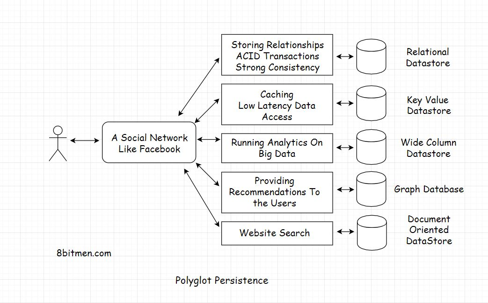

#### Downside of This Approach ####
1. Increased complexity to make different technologies work together
	1. A lot of effort is required to build, manage and monitor polyglot persistence systems
	2. Solution: Multi-model databases

### Multi-Model Databases ###
1. Topics:
	1. What are Multi-Model Databases?
	2. Popular Multi-Model Databases

#### What are Multi-Model Databases? ####
1. Certain databases support one data model
	1. Relational database
	2. Graph database
	3. ...
2. Multi-model databases
	1. Different data models can be used in a single database system
		1. Graph
		2. Document-Oriented
		3. Relational
		4. ...
	2. The need to manage multiple persistence technologies in single service is averted
		1. Operational complexity is reduced as a consequence
	3. Different data models can be used with a single API
3. Multi-model databases:

	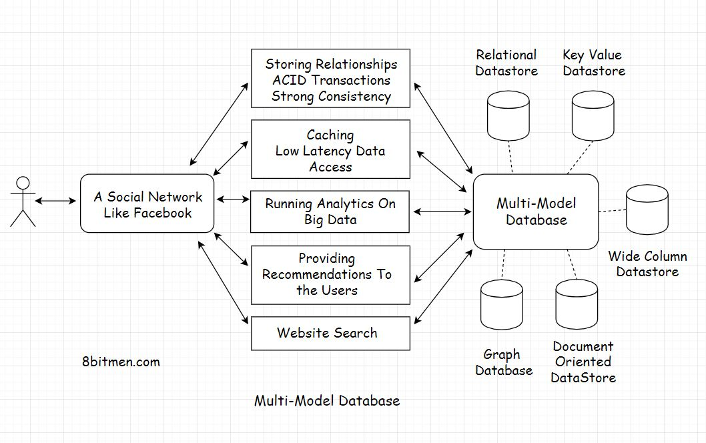

#### Popular Multi-Model Databases ####
1. Examples:
	1. Arongo DB
	2. Cosmos DB
	3. Orient DB
	4. Couchbase
2. Next: Eventual Consistency, Strong Consistency, ...

### Eventual Consistency ###
#### What is Eventual Consistency? ####
1. It is a consistency model which enables datastore to be highly available (as a side effect)
	1. It is known as optimistic replication (good for distributed systems)

#### Real World Use Case ####
1. Example: Microblogging website deployed in multiple regions
	1. Each geographical region has multiple data center zones: North, east, west, south
	2. Each of the zones has multiple clusters
	3. Each cluster has multiple server nodes running
2. Datastore nodes are spread across the world which micro-blogging site uses for persisting data
	1. There is no single point of failure (advantage)
	2. The data store service is highly available
		1. If few nodes go down, persistence service as a whole is up
3. Suppose a celebrity makes a post on website which everyone starts liking around the world
	1. A user in Japan likes a post which increases like count of post from 100 to 101
	2. A user in America clicks on post and sees like count as 100 (not 101)
	3. Why?
		1. Updated value of post like counter needs time to move from Japan to America and update server nodes running in America
			1. The user in America sees the old value during this time (inconsistency)
			2. After a while if page is refreshed, 101 is seen
	4. **Eventual consistency**: The data was initially inconsistent but eventually got consistent across server nodes deployed around the world
4. Example: Eventual consistency

	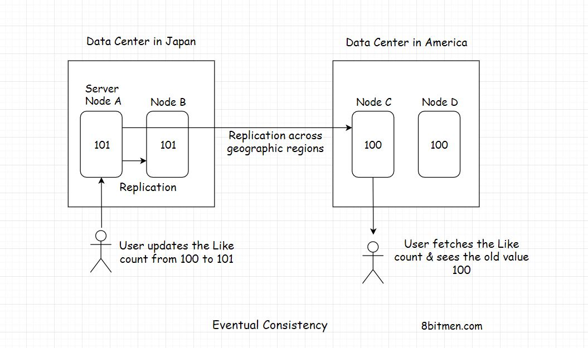
	
5. What if both users in Japan and America like the post and another user in Europe accesses it?
	1. All nodes may have different values and may take time to reach consensus
	2. Pros: System can add new nodes on the fly without need to block any of the nodes
		1. Nodes are available to end users to make updates at all times
		2. Highly available: Many users can make updates simultaneously
6. Use cases: 
	1. Eventual consistency is good of use cases where accuracy of values doesn't matter
	1. Keeping count of users watching Live video stream online (say)
		1. couple of counts up and down won't matter much
7. Use cases where eventual consistency is not acceptable:
	1. Banking
	2. Stock market
8. Next: Strong consistency

### Strong Consistency ###
1. Topics:
	1. What is Strong Consistency?
	2. Real World Use Case
	3. ACID Transaction Support

#### What is Strong Consistency? ####
1. Strong consistency means: data must be consistent all the time
	1. All server nodes across the world must contain same value of an entity at any point in time
		1. How to implement?
			1. Locking down nodes during updates

#### Real World Use Case ####
1. When user in Japan likes the post, all nodes across different geographical zones have to be locked down to prevent any concurrent updates
2. Example: Strong consistency

	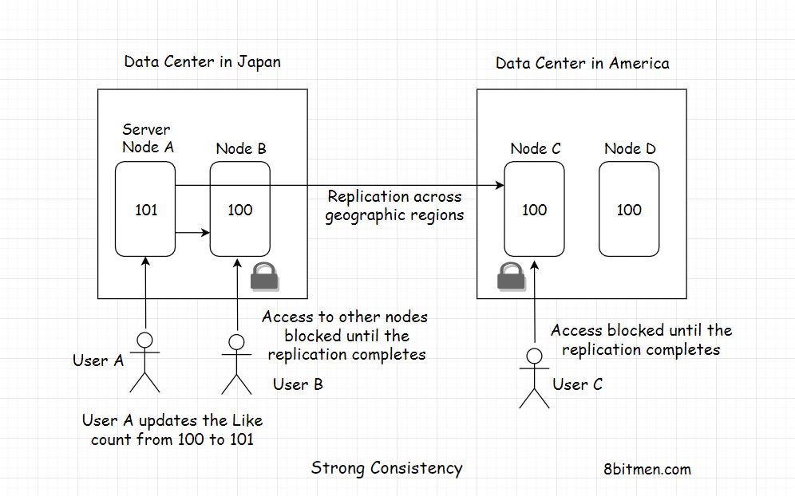

3. Only one user can like at a time
	1. When user in Japan updates likes, the value is replicated globally across all the nodes
		1. When all nodes reach consensus, the locks get lifted
		2. Once locks are lifted, other users can like the post (they had to wait until the first user finished liking and all nodes reached consensus)
	2. Cons: Such waiting is not desirable for social media applications
4. Suppose users are seeing different prices for same stock at a single point in time and updating concurrently (chaos)
	1. Solution: Strong consistency (lock all nodes for updates)
		1. Implementation: Queuing all requests
			1. CAP theorem - key for implementing consistency models
				1. Strong consistency is a hit for High Availability
					1. ACID transactions are implemented in this manner

#### ACID Transaction Support ####
1. Distributed systems like NoSQL databases do not support ACID transactions globally (by design)
	1. NoSQL tech is designed to be highly available and scalable
		1. Locking down nodes makes is similar to SQL
	2. NoSQL databases (typically) do not support ACID transactions
		1. Even if they do, they have other terms and conditions applied
			1. Transaction support is limited to a geographic zone or and entity hierarchy
				1. Developers ensure that all strongly consistent entity nodes reside in same geographic zone to make ACID transactions possible
2. Next: CAP theorem

### CAP Theorem ###
#### What is CAP Theorem? ####
1. **CAP** - **Consistency**, **Available**, **Partition Tolerence**
2. **Partition Tolerance**: Means fault tolerance
	1. System is tolerant of failures or partitions
		1. **Works if even a few nodes go down**
3. **We have to pick any two of Consistency, Availability & Partition Tolerance**
	1. Explanation:

			CAP Theorem simply states that in case of a network failure, when a few of the nodes of the system are down, we have to make a choice between Availability & Consistency
			
		1. If we pick Availability: This means if few of the nodes go down, other nodes are available to users for making updates
			1. In such a situation, system is inconsistent as nodes which are down don't get updated with new data
				1. When the nodes come up, and if user fetchs data from them, they'll return old values they had when they went down
		2. If we pick Consistency: We need to lock down all the nodes for further writes until nodes which ahve gone down (apparently) come back online
			1. Ensures strong consistency of the system as all nodes will have same entity values
	2. Picking between **consistency** and **availability** depends on our use case and business requirements
		1. Picking one out of the two is due to design of distributed systems (trade-off)
			1. We can't have both availability and consistency at the same time (network latency, time complexity of the distributed algorithms involved, quickness of node going up are certain reasons)
		2. Nodes around the globe will take time to reach consensus
			1. zero-latency is nearly impossible unsless data gets transferred instantly (network latency)

### Database Quiz - Part 2 ###
### Types of Databases ###
1. Different types of databases are available catering to specific use cases
2. Topics:
	1. Document-Oriented database
	2. Key-value datastore
	3. Wide-column database
	4. Relational database
	5. Graph database
	6. Time-Series database
	7. Databases dedicated to mobile apps
3. Next: Other types of databases (Other than SQL)

### Documented Oriented Database ###
1. Topics:
	1. What is a Document Oriented Database?
	2. Popular Document Oriented Databases
	3. When do I Pick a Document Oriented Data Store for My Project?
	4. Real Life Implementations

#### What is a Document Oriented Database? ####
1. Definition:

		Document Oriented databases are the main types of NoSQL databases. They store data in a document-oriented model in independent documents. The data is generally semi-structured & stored in a JSON-like format
		
	1. Data model is similar to the application code (only JS based applications)
		1. Easier to store and query data for developers (JS)
	2. Document oriented stores are suitable for Agile software development methodology (it is easier to change things with evolving demands when working with them)

##### Popular Document Oriented Databases #####
1. MongoDB
2. CouchDB
3. OrientDB
4. Google Cloud Datastore
5. Amazon Document DB

#### When Do I Pick a Document Oriented Data Store for My Project? ####
1. If working with **semi-structured data** and need **flexible schema** that would change often
	1. Something flexible might be needed that could be changed over time with minimum fuss - Pick document-oriented data store
2. Use cases of document oriented databases
	1. Real-time feeds
	2. Live sports apps
	3. Writing product catalogues
	4. Inventory management
	5. Storing user comments
	6. Web-based multiplayer games
3. The above provide horizontal scalability, performant read-writes
 (CRUDs where much relational logic is not involved - quick persistence and retrieval of data is supported)

##### Real Life Implementations #####
1. [SEGA uses Mongo-DB to improve the experience for millions of mobile gamers](https://www.mongodb.com/blog/post/sega-hardlight-migrates-to-mongodb-atlas-simplify-ops-improve-experience-mobile-gamers)
2. [Coinbase scaled from 15k requests per min to 1.2 million requests per minute with MongoDB](https://www.mongodb.com/customers/coinbase)

### Graph Databases ###
1. Topics:
	1. What is a Graph Database?
	2. Featurs of a Graph Database
	3. When Do I Pick a Graph Database?
	4. Real Life Implementations

#### What is a Graph Database? ####
1. Graph databases are part of NoSQL database family
	1. Data is stored as nodes/vertices and edges in the form of relationships
2. Example: Graph database

	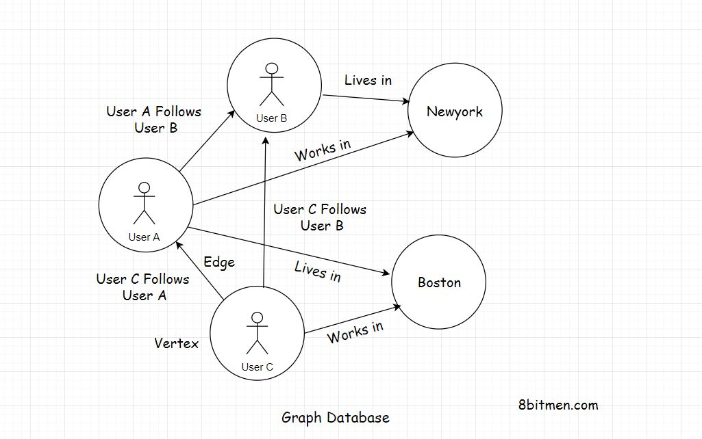
	
3. Each *Node* is a graph databse that represents an entity
	1. Entity:
		1. Person
		2. Place
		3. Business
		4. ...
	2. Edge: Represents relationship between entities
4. Why use graph databases if we already have SQL based relational databases?

#### Features of a Graph Database ####
1. Two reasons:
	1. Visualization:
		1. Helps visualize how entities are related & how things fit together
	2. Low latency:
		1. The relationships are stored a bit differently form how relational databases store relationships
			1. Relationships in Graph databases are not calculated at the query time (as it happens with joins in relational databases)
				1. Relationships are persisted as edges and we just need to fetch them (no computation at query time)
2. Example: Google maps:
	1. Nodes represent cities
	2. Edges represent connections between them
	3. To figure out roads between cities, we don't need joins to figure out relationship between cities when we run the query
		1. Just fetch the edges which are already stored in database

#### When Do I Pick Graph Database? ####
1. To build:
	1. Social network graph
	2. Knowledge network graph
	3. AI-based apps
	4. Recommendation engines
	5. Fraud analysis app
	6. Storing genetic data
	7. ...
2. Pros:
	1. Visualization of data with minimum latency
	2. Example: Neo4J

#### Real Life Implementations ####
1. Real-life implementations:
	1. [Walmart shows product recommendations to its customers in real-time using Neo4J graph database](https://neo4j.com/case-studies/walmart/)
	2. [NASA users Neo4J to store "lessons learned" data from their previous missions to educate the scientists & engineers](https://neo4j.com/blog/david-meza-chief-knowledge-architect-nasa/)

### Key Value Database ###
1. Topics:
	1. What is a Key Value Database?
	2. Features of a Key Value Database
	3. Popular Key Value Databases
	4. When Do I Pick a Key Value Databases?
	5. Real Life Implementations

#### What is a Key Value Database? ####
1. Key-value databases are part of NoSQL family
	1. Key-value method is used to store and quickly fetch data with minimum latency

#### Features of a Key Value Database ####
1. Use case: To implement caching (due to minimum latency ensured)
	1. Key: unique identifier
	2. value: associated with key
		1. Can be block of text
		2. ...
		3. Can be a complex object graph
2. Data can be fetched in constant time: O(1)
3. No query language is required to fetch data
4. Both the above factor can ensure minimum latency (as possible)

#### Popular Key Value Databases ####
1. Redis
2. Hazelcast
3. Riak
4. Voldemort
5. Memcache

#### When Do I Pick a Key Value Database? ####
1. Use case: If we need to fetch data fast and easily and without much backend processing
	1. They are efficient in pulling off scenarios where super-fast data fetch is order of the day
2. Use cases of key value databases:
	1. Caching
	2. Persisting user state
	3. Persisting user sessions
	4. Managing real-time data
	5. Implementing queues
	6. Constructing leaderboards in online games & web apps
	7. Implementing a pub-sub system

#### Real Life Implementations ####
1. Example:
	1. [Inovonics uses Redis to drive real-time analytics on millions of sensor data](https://redislabs.com/customers/inovonics/)
	2. [Microsoft uses Redis to handle the traffic spike on its platforms](https://redislabs.com/docs/microsoft-relies-redis-labs/)
	3. [Google Cloud uses Memcache to Implement Caching on Their Cloud Platform](https://cloud.google.com/appengine/docs/standard/python/memcache/)

### Time Series Database ###
1. Topics:
	1. What is a Time Series Database?
	2. What is Time Series Data?
	3. Why Store Time Series Data?
	4. Popular Time Series Databases
	5. When to Pick a Time Series Database?
	6. Real Life Implementations

#### What is a Time Series Database? ####
1. Time-Series databases are optimized for tracking & persisting time series data

#### What is Time Series Data? ####
1. It is data containing data points associated with occurrence of event wrt time
	1. Data points are tracked
	2. Data points are monitored
	3. Data points are finally aggregated based on certain business logic
2. Time-Series data is ingested from
	1. IoT devices
	2. self-driving vehicles
	3. industry sensors
	4. social networks
	5. stock market financial data
	6. ...
3. Why store so much time series data?

#### Why Store Time Series Data? ####
1. If we study data streaming-in from apps helps track behaviour of system
	1. Helps us study
		1. User patterns
		2. Anomalies
		3. How are things changing over time
2. Use case: Analytics (primarily)
	1. Deducing conclusions
	2. Making future business decisions (looking at results of analytics)
	3. Helps product evolve continually
3. General databases are not good for handling time series data
	1. IoT has popularized these databases

#### Popular Time Series Databases ####
1. Influx DB
2. Timescale DB
3. Prometheus
4. ...

#### When to Pick a Time Series Database? ####
1. If we need to manage data in real-time & continually over long period of time
	1. Time-series databases are built to deal with data, streaming in real-time
		1. Use case: 
			1. Fetching data from IoT devices
			2. Running analytics
			3. Monitoring
			4. Autonomous trading platform
				1. Deals with changing stock prices in real-time

#### Real Life Implementations ####
1. [IBM uses Influx DB to run analytics for real-time cognitive fraud detection](https://www.influxdata.com/customer/ibm/)
2. [Spiio uses Influx DB to remotely monitor vertical lining green walls & plant installations](https://www.influxdata.com/customer/customer_case_study_spiio/)

### Wide-Column Database ###
1. Topics:
	1. What is a Wide Column Database?
	2. Popular Wide Column Databases
	3. When to Pick a Wide Column Database?
	4. Real-Life Implementations

#### What is a Wide Column Database? ####
1. They belong to NoSQL family of databases
	1. Use cases: For handling massive amounts of data (Big data)
		1. Perfect for analytical use cases
			1. They have:
				1. High performance & scalable architecture
2. Aka **column-oriented** databases
	1. Each record has dynamic number of columns
		1. A record can have billions of columns

#### Popular Wide Column Databases ####
1. Cassandra
2. HBase
3. Google BigTable
4. Scylla DB
5. ...

#### When to Pick a Wide Column Database? ####
1. For big data
	1. To injest it
	2. To run analytics on it
2. Wide column databases are built to ensure
	1. Scalability
	2. Performance
	3. High availability
	4. ...

#### Real-Life Implementations ####
1. [Netflix uses Cassandra as the backend database for the streaming service](https://medium.com/netflix-techblog/tagged/cassandra)
2. [Adobe uses HBase for processing large amounts of data](https://hbase.apache.org/poweredbyhbase.html)

### Database Quiz - Part 3 ###

## Caching ##
### Introduction ###
1. Topics:
	1. What is Caching?
	2. Caching Dynamic Data
	3. Caching Static Data
2. We need our answers quick for a request (we are impatient usually for response from the web)
	1. Solution: Caching

#### What is Caching? ####
1. Definition:

		Caching is key to the performance of any kind of application. It ensures low latency and high throughput. An application with caching will certainly do better than an application without caching, simply because it returns the response in less time as opposed to the application without a cache implemented.
		
2. Caching in web application means copying frequently accessed data from database (which is disk-based hardware) and storing it in RAM Random Access Memory hardware
3. Example: Caching in a web application

	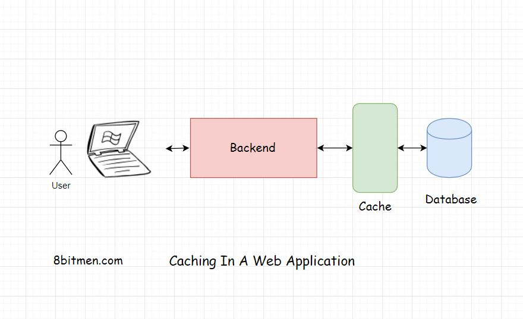
	
4. RAM-based hardware provides faster access than disk-based hardware
	1. How is high throughput achieved?
		1. Throughput: Number of network calls (request-response) between client and server within stipulated time
		2. RAM-based hardware can handle more requests than disk-based hardware (on which databases run)

#### Caching Dynamic Data ####
1. Dynamic data: Data which changes more often
	1. It has expiry time or TTL - Time To Live
		1. Cache Invalidation: After TTL ends, data is purged from the cache and newly updated data is stored

#### Caching Static Data ####
1. Static data - images, font files, CSS, ...
	1. This data does not change often & can be easily cached on client-side in browser or other local memory
	2. CDN - Content Delivery Network
		1. CDN can also be used to cache static data

### How Do I Figure If I Need A Cache in My Application? ###
1. Topics:
	1. Different Components In the Application Architecture Where the Cache Can Be Used
2. Cache can be used instead of not using it
	1. Any layer can use cache
3. Database caching: Most common
	1. Alleviates stress on database by intercepting requests routed to database for data
	2. Cache returns all frequently accessed data

#### Different Components In the Application Architecture Where the Cache Can Be Used ####
1. Example: Caching in web application

	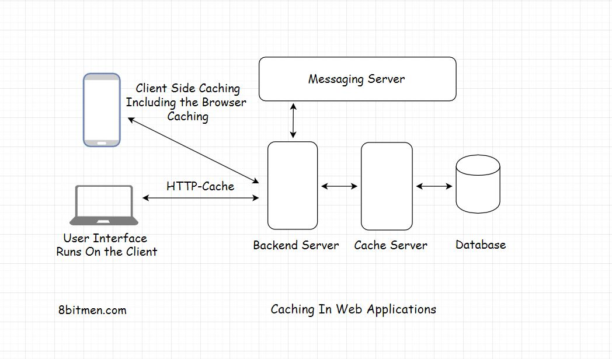
	
2. Caching can be used in multiple places
	1. In client browser to cache static data
	2. With database to intercept all data requests (in REST API implementation etc...)
	3. We can look for patterns:
		1. All frequently accessed data from any component in the application can be cached
		2. Example: Joins in databases
			1. They are notorious for making response slow (more joins => more latency)
				1. Cache can avert need for running joins each time just by storing data in demand
3. Even if database goes down, cache would continue to serve data requests
4. Caching is core of HTTP protocol
	1. [This is a good resource to read more about it](https://developers.google.com/web/fundamentals/performance/optimizing-content-efficiency/http-caching)
5. User sessions can be stored in a cache
	1. It can be implemented at any layer of application
		1. OS level
		2. Network level
		3. CDN
		4. Database
	2. Implementations:
		1. Key-value stores (for web-applications)
6. Caches can also be used for cross-module communication in microservices architecture by saving shared data commonly accessed by all services
	1. Good option for microservices communication
7. Key-value data stores are also widely used in in-memory data stream processing and running analytics

### Reducing the Application Deployment Costs via Caching ###
1. Topics:
	1. Real Life Use Case
	2. Conclusion
2. Deployment cost of application can be reduced using cache (how?)

#### Real Life Use Case ####
1. Stock market based gaming app
2. Algorithm would trigger price movement of stocks every second
	1. Too many database writes costs a fortune (every hour could be too much)
		1. Solution used: Memcache
			1. Batch operation at regular intervals updates database
			2. Memcache is much faster than disk based database

#### Conclusion ####
1. Turned out cheaper
	1. Don't want to persist each and every info in database
		1. One can use cache to store not so mission-critical info
2. Next: Caching strategies

### Caching Strategies ###
1. Topics:
	1. Cache Aside
	2. Read-Through
	3. Write-Through
	4. Write-Back
2. Why different strategies?

#### Cache Aside ####
1. Most common
2. Used to reduce hits on database as much as possible
3. Data is *lazy-loaded* in the cache
	1. If user sends request for data
	2. System first looks for it in cache
		1. If present, it is simply returned
		2. If not present, data is fetched from database and cache updated and then returned to user
4. Use case: Read heavy workloads
	1. Data is not much frequently updated
		1. Example: 
			1. User profile data
				1. User name
				2. User account number
				3. ...
	2. Write:
		1. **Data is directly written to database**
			1. Cons: Could make data in cache inconsistent
				1. Solution: TTL
					1. After the stipulated time period, data is invalidated in cache

#### Read-Through ####
1. Similar to Cache Aside but Cache is always consistent with database
	1. Cache library or cache framework takes the burden of maintaining consistency with backend
	2. Info is lazy loaded in cache
		1. When user requests it
2. First time request results in cache miss
	1. Backend updates the cache
	2. Result is returned to the user
3. Developers can pre-load cache with info which is expected to be requested most by users

#### Write-Through ####
1. Each info written to DB goes through cache (before data is written to DB, cache is updated)
	1. High consistency between cache and database (adds latency during write operations)
2. Works for write heavy workloads? (how?)
3. Use cases: used with other caching strategies for optimized performance

#### Write-Back ####
1. Significant cost optimization
2. Data is written to cache (instead of database)
	1. Cache writes to database after some delay
		1. If there are a lot of writes, we can reduce the freqency of database writes to cut down load & associated costs
3. Cons: If cache fails before DB is updated, data might get lost
4. Usage: May be used with other caching strategies

### Caching Quiz ###

## Message Queue ##
### Introduction to Message Queues ###
1. Topics:
	1. What is a Message Queue?
	2. Features of a Message Queue
	3. Real World Example of a Message Queue
	4. Message Queue in Running Batch Jobs

#### What is a Message Queue? ####
1. Definition:

		Message queue as the name says is a queue which routes messages from the source to the destination or we can say from the sender to the receiver
		
2. It follows FIFO (First In First Out) policy
	1. Message sent first is delivered first
		1. Messages may have priority attached to them (priority queue)
3. FIFO Queue:

	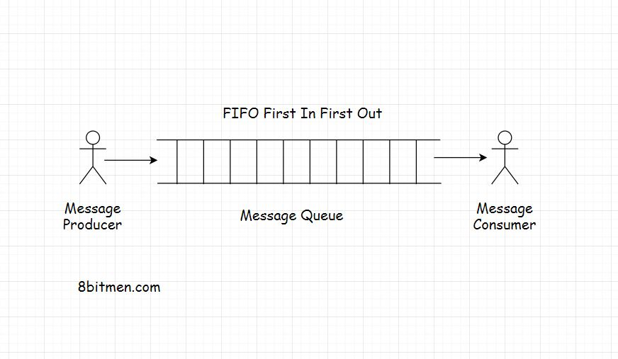

#### Features of a Message Queue ####
1. Message queues facilitate async behaviour
	1. Allows modules to communicate with each other in background without hindering their primary tasks
2. Message queues facilitate cross-module communication
	1. This is key in
		1. Service-oriented architecture
		2. Microservices architecture
	2. It allows communication in heterogeneous environment
	3. It also provides storage for storing messages until they are processed & consumed by consumer

#### Real World Example of a Message Queue ####
1. Example Email
	1. Sender and receiver don't have to be online at the same time to communicate with each other
		1. Sender sends email to email server
		2. Receiver reads it when he/she comes online
2. Use cases:
	1. To run background processes, tasks, jobs
	2. Example:
		1. Consider user signing up on a portal
		2. Once user signs up, user is navigated to home page immediately
		3. System has to send email to registered email id of user
		4. User must click on confirmation email for sign-up event confirmation
			1. Website does not wait until it sends email to user
				1. The task is assigned as asynchronous background process to a message queue
					1. User continues to browse website while email confirmation is sent to user
	3. Message queues can also be used for notification systems
		1. Such as Facebook notifications

#### Message Queue In Running Batch Jobs ####
1. Example: Batch job which updated stock prices at regular intervals in database was run by message queue
2. Participants of message queue:
	1. Producer - sends messages
	2. Consumer - receives messages
	3. Queue
3. Producer and consumer don't have to reside on same machine to communicate
4. Rules for routing:
	1. Priority to messages
	2. Message acknowledgements
	3. Re-trial of failed messages
	4. Size: Can be indefinite (based on infrastructure of the business)
5. Next: Publish subscribe message routing model

### Publish Subscribe Model ###
1. Topics:
	1. What is a Publish Subscribe Model?
	2. Exchanges

#### What is a Publish Subscribe model? ####
1. Definition:

		A Publish-Subscribe model is the model where multiple consumers receive the same message sent from a single or multiple producers.
		
2. Example: Publish subscribe pattern

	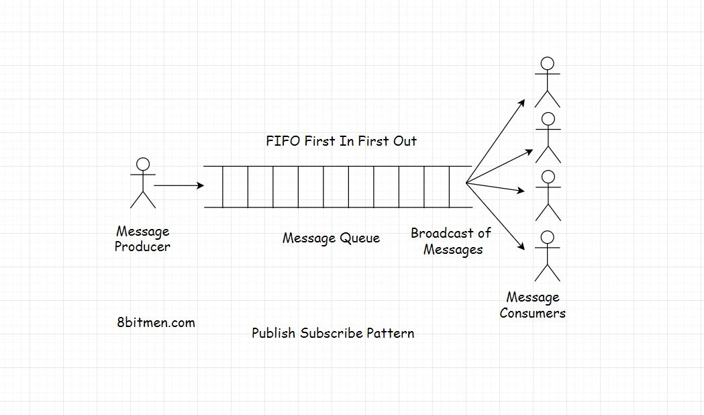
	
3. Example: Newspaper service
	1. Consumers subscribe to newspaper service
	2. Service delivers news to multiple consumers of the service each day
4. Example: Online world
	1. We sometimes subscribe to topics in applications
	2. Applications continually notify of new updates on particular segment
		1. Sports
		2. Politics
		3. Economics
		4. ...

#### Exchanges ####
1. Pub-sub pattern implementation
	1. Message queues have exchanges
		1. Exchange: It further pushes messages to queues based on exchange type and rules set
			1. They are like telephone exchanges
				1. They route messages from sender to receiver through infrastructure (based on certain logic - routing algorithm)
2. Example: Publish-Subscribe pattern with exchange

	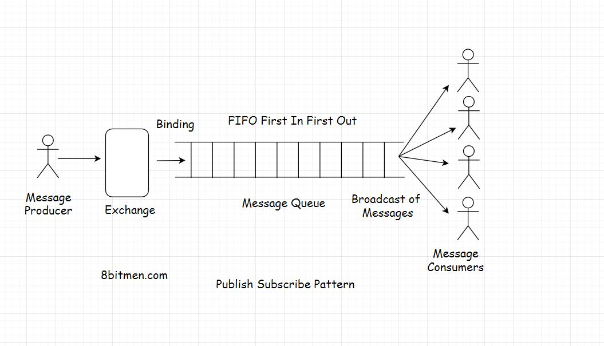
	
3. Exchange types:
	1. Direct
	2. Topic
	3. Headers
	4. Fanout
4. [RabbitMQ article for insight into how the exchanges work](https://www.rabbitmq.com/tutorials/amqp-concepts.html)
5. Fanout Exchange Type:
	1. Used to broadcast messages from queue
		1. Exchange pushes message to queue
		2. Consumers will receive the message
	2. Binding: Relationship between exchange and queue
	3. Example: Updates of new content generated in real-time on social apps by business or individuals (who are followed by a lot of people)
6. Next: Details of how real-time feeds and notification systems work in social networks (powered by message queues)

### Point to Point Model ###
1. Topics:
	1. What is Point to Point Model?
	2. Messaging Protocols
	3. Technology Used to Implement the Messaging Protocols

#### What is Point to Point Model? ####
1. Definition:

		Point to point communication is a pretty simple use case where the message from the producer is consumed by only one consumer
		
2. Example: Point to point message queue model

	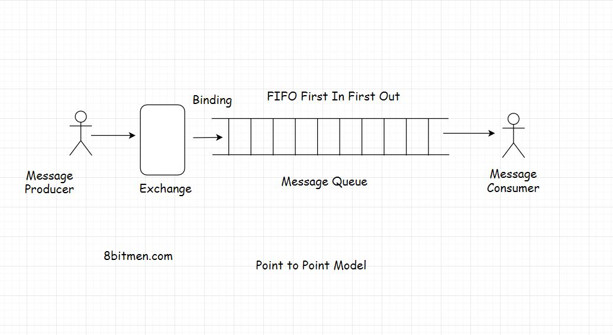
	
3. It is one-to-one relationship
	1. Multiple combinations are possible with this messaging model
		1. Adding multiple producers to queue
		2. Adding multiple consumers to queue
			1. Only one of the consumers can consume a message
				1. Entity to entity communication

#### Messaging Protocols ####
1. Two popular protocols:
	1. [AMQP - Advanced Message Queue Protocol](https://en.wikipedia.org/wiki/Advanced_Message_Queuing_Protocol)
	2. [STOMP - Simple or Stream Text Oriented Message Protocol](https://en.wikipedia.org/wiki/Streaming_Text_Oriented_Messaging_Protocol)

#### Technology Used to Implement the Messaging Protocols ####
1. Examples:
	1. RabbitMQ
	2. ActiveMQ
	3. Apache Kafka
	4. ...
2. Next: How notification systems work with message queues

### Notification Systems & Real-Time Feeds with Message Queues ###
1. Topics:
	1. Real-World Use Case
	2. Pull-Based Approach
	3. Push-Based Approach
2. An insight into how notification systems and real-time feeds are designed with message queues
	1. Web 2.0 applications are really complex
		1. Involve
			1. Machine learning
			2. Understanding user behaviour
			3. Recommending new relevant info
			4. Integration of other modules with them
3. How to implement notification system from bare bones?

#### Real-World Use Case ####
1. Consier social network such as Facebook
	1. Using relational database
	2. Using message queue to add asynchronous behaviour to application
2. Users may have
	1. Many friends
	2. Many followers
3. It is many-to-many relationship
	1. One user has many friends
	2. He is friend of many users
4. Example: Graph Database use case

	
	
5. If user adds new post on website
	1. The post is persistend in database
		1. User table
		2. Post table
	2. It is one-to-many relationship (between user and posts)
	3. As the post is persisted, it needs to be sent to friends and followers on home pages (send notification if desired)

#### Pull-Based Approach ####
1. Not using message queues approach:
	1. Poll the database at regular short intervals if any of the connections have new update or not
		1. First we find all connections of user
		2. Next we run check for every connection one by one (to check if there are any posts)
			1. If there are new posts, query will pull all new posts of connections of user and display on home page
				1. A notification is also sent to user (tracking count using notification counter column in User table)
					1. Also adding extra AJAX poll query from client for new notifications
2. Example: Notification system & real-time feed via polling

	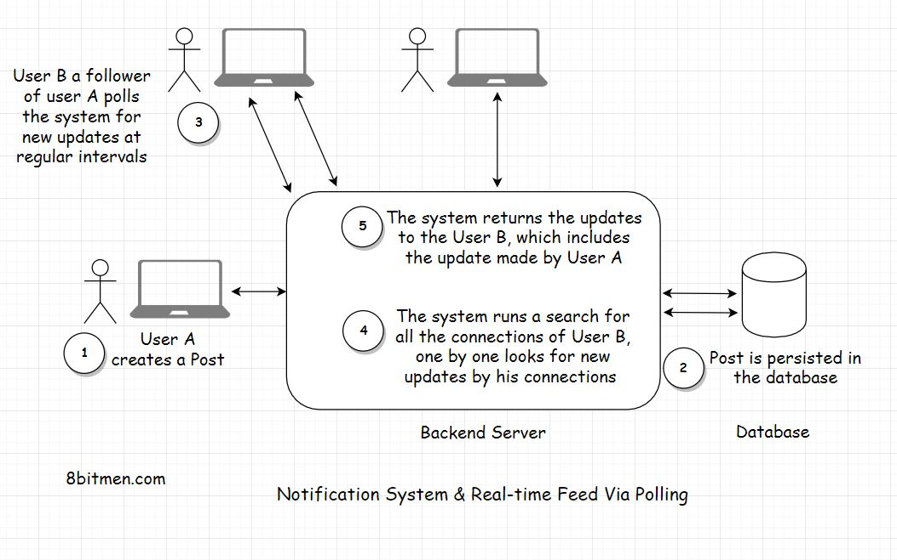
	
3. Cons:
	1. Polling database often is expensive
		1. Consumes a lot of bandwidth
		2. Puts a lot of unnecessary load on database
	2. Display of post will not be in real-time
		1. Until database is polled, post will not be displayed

#### Push-Based Approach ####
1. Using message queue:
2. User post will have distributed transaction (say)
	1. One transaction updates database
	2. One transaction posts payload (message content) to message queue
	3. Notification system and real-time feed establishes persistent connection with database (for real-time streaming of data)
3. Example: REST API vs Realtime API

	
	
4. Message queue on receipt of message will asynchronously push immediately to connections of user which are online (no need for polling)
5. TTL: TTL can be used by message queue (temp storage) for connectiosn of user to come online & then push updates to them
6. Key-value store: it can be used to store details of user required to push notifications to his connections (ids of connections etc...)
	1. Averts polling database (querying) for connections
7. Pros:

	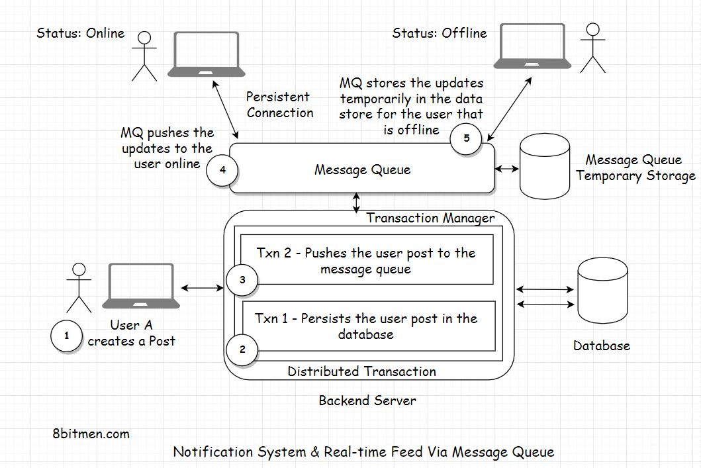
	
8. Distribution transactions complications:
	1. They can work as a single unit
		1. If database persistence fails, entire transaction is rolled back
			1. There wont be any message push to message queue
		2. If message queue push fails: Two options
			1. Proceed
				1. Continue with persistence into database
					1. Refresh of home page causes pole to database (as a backup)
			2. Roll-back
9. Implementation:
	1. Custom distributed transaction code
	2. Distributed transaction managers (frameworks offer)
10. Certain process or flow repeats itslef when
	1. Users trigger events (visiting public place, eating at a restaurant, ...)
11. Solution must serve us well and fulfill business requirements
	1. Optimize in iterations
		1. First get skeleton in place
		2. Optimize notch by notch
12. [How Does LinkedIn Identify Its users Online?](https://www.8bitmen.com/linkedin-real-time-architecture-how-does-linkedin-identify-its-users-online/)

### Handling Concurrent Requests with Message Queues ###
1. Topics:
	1. Using a Message Queue to Handle the Traffic Surge
	2. How Facebook Handles Concurrent Requests on its Live Video Streaming Service With a Message Queue?

#### Using a Message Queue to Handle the Traffic Surge ####
1. [Eventual Consistency](https://www.educative.io/collection/page/6064040858091520/6411938009448448/6373547041619968)
2. [Strong Consistency](https://www.educative.io/collection/page/6064040858091520/6411938009448448/5677430486335488)
3. Use Case: Message queue to manage high number of concurrent requests to update entity
	1. When users want to update entity concurrently, we can queue all update requests in high throughput message queue
		1. The messages are processed in FIFO order sequentially
			1. Pros:
				1. Highly available (how?)
				2. Open to updation (how?)
				3. Consistent (how?)

#### How Facebook Handles Concurrent Requests On Its Live Video Streaming Service with a Message Queue? ####
1. Handling concurrent user requests on LIVE video streaming service (Queus are used)
2. When popular person goes LIVE, there is a surge of user requests on LIVE streaming server
	1. Cache is used to intercept the traffic
		1. Cons: Cache is not populated with real-time data before requests arrive
			1. Results in cache miss
				1. Requests hit streaming server
					1. Solution: All user requests for same data are queued
						1. Cache is populated with same data
						2. Each of the queue requests are served from cache
3. [Facebook's Live Streaming Architecture](https://engineering.fb.com/ios/under-the-hood-broadcasting-live-video-to-millions/)
4. Next chapter: Stream processing

### Message Queue Quiz ###

## Stream Processing ##
### Introduction ###
1. Topics:
	1. Rise of Data-Driven Systems
	2. Use Cases for Data Stream Processing

#### Rise of Data-Driven Systems ####
1. Data-driven is trend
	1. Example: IoT
		1. Entities are generating and transmitting data online at unprecedented rate
		2. They are communicating with each other and taking decisions without (mostly) human intervention

#### Use Cases for Data Stream Processing ####
1. IoT devices
	1. Industry sensors
	2. Smart cities
	3. Electronic devices
	4. Wearable healthcare body sensors
2. Sophisticated backend system is required to gather meaningful info
	1. Archive/purge not so meaningful data
3. More data one has, better the systems evolve (Businesses rely on data)
	1. Businesses need customer data to make future plans & projections
	2. Businesses need to understand user's needs and behaviour
		1. For better products
		2. For making smarter decisions
		3. For running effective ad campaigns
		4. For recommending new products to customers
		5. For gaining better insights into market
		6. ...
			1. Customer-centric products
			2. Increases customer loyalty
4. Use case for streaming data:
	1. Tracking service efficiency
		1. Everything is okay signal (IoT devices (used by millions) say)
	2. Implementations:
		1. Time-series databases
			1. Used to persist and run queries on real-time data (ingested from IoT devices)
5. Next: Components in data stream processing
	1. Key architectures in data processing

### Data Ingestion ###
1. Topics
	1. What is Data Ingestion?
	2. Layers of Data Processing Setup
	3. Data Standardization
	4. Data Processing
	5. Data Analysis
	6. Data Visualiazation
	7. Data Storage & Security

#### What is Data Ingestion? ####
1. Definition:

		Data Ingestion is a collective term for the process of collecting data streaming-in from several different sources and making it ready to be processed by the system.
		
	1. Data processing system: Data is injested from IoT devices & other sources into system to be analysed
		1. The data is routed to different components/layers through data pipeline
			1. Algorithms are run on the data and archived (eventually)

#### Layers of Data Processing Setup ####
1. Stages/layers of data processing setup:
	1. Data collection layer
	2. Data query layer
	3. Data processing layer
	4. Data visualization layer
	5. Data storage layer
	6. Data security layer
2. Data ingestion

	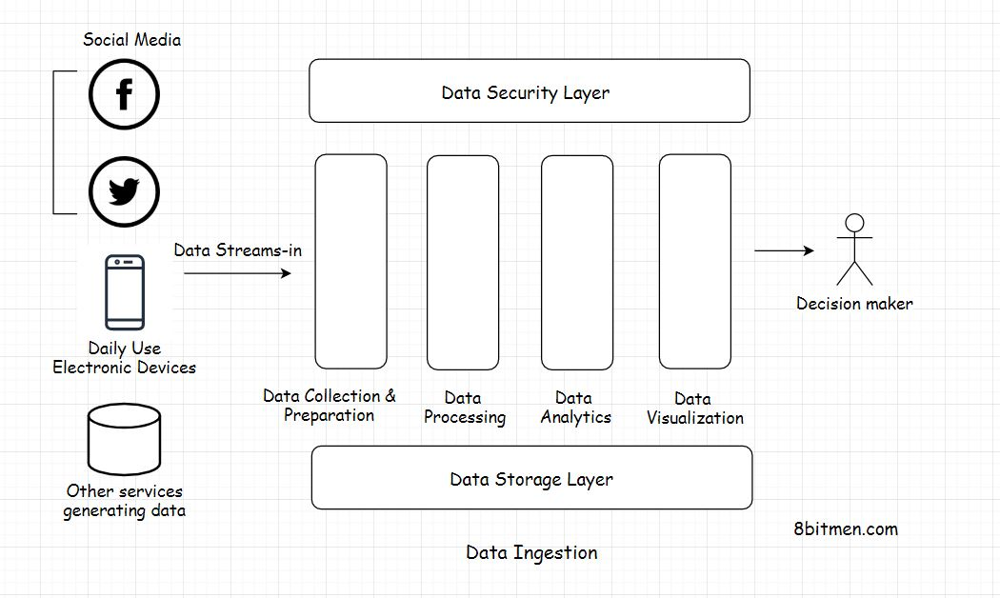

#### Data Standardization ####
1. Data that sreams from different sources is not in homogeneous structured format
2. Data streams into system at different speeds & sizes
	1. From:
		1. Web-based services
		2. Social networks
		3. IoT devices
		4. Industrial machines
		5. ...
	2. Every stream of data has different semantics
3. To make data uniform and fit for processing:
	1. Data must be collected and converted into standardized format to avoid future processing issues
		1. Occurrs in *Data collection and preparation layer*

#### Data Processing ####
1. Next the standardized data is routed to *Data processing layer*
	1. Data is processed based on business requirements
	2. **It is classified into different flows and routed to different destinations**

#### Data Analysis ####
1. Once routed, analytics in run on data
	1. Includes
		1. Execution of analytics models
			1. Predictive modelling
			2. Statistical analytics
			3. Text analytics
			4. ...
		2. Analytics occur in *data analytics layer*

#### Data Visualization ####
1. After analytics is run
	1. Info is routed to *Data visutalization layer*
		1. This layer presents data to the stakeholders (usually in web-based dashboard)
			1. Example: Kibana (data visualization tool)

#### Data Storage & Security ####
1. Moving data is vulnerable to security breaches
	1. Ensures secure movement of data
2. Data storage layer
	1. For persisting data
3. Data analytics:
	1. It is deep
		1. In depth microscopic view of each layer needs **dedicated analytics course**
4. Next: ways in which data can be injested

### Different Ways of Ingesting Data & the Challenges Involved ###
1. Topics:
	1. Different Ways to Injest Data
	2. Challenges with Data Ingestion
		1. Slow Process
		2. Complex & Expensive
		3. Moving Data Around is Risky

#### Different Ways to Ingest Data ####
1. Two primary ways
	1. Real-time
	2. Batches (runs at regular intervals)
2. Picking the type: Depends on business requirements
3. Use cases:
	1. Real-time
		1. Reading medical data (time is of critical importance - time, life and money are linked)
			1. Heartbeat (wearable IoT device)
			2. Blood pressure (wearable IoT device)
	2. Reading trends over time
		1. Data can be ingested in batches
			1. Example: popularity of sport in region over period of time
4. Challenges when ingesting massive amounts of data:
	1. Next - general use-cases

#### Challenges with Data Ingestion ####
##### Slow Process #####
1. Data ingestion is slow process
	1. Why?
		1. Sources send data in different formats & syntax, metadata (heterogeneous data)
			1. Needs transformation into common format - JSON, ... (understood usually by analytics systems)
				1. Conversion is tedious (needs computing resources & time)
		2. Flowing data needs to be staged at several stages in the pipeline
			1. It is picked and processed and moved ahead
		3. Security
			1. Each stage may have to authenticate & verify (to meet organizations security standards)
2. Traditional data ingestion systems may need weeks if not months to get useful info
	1. ETL is not effective anymore
3. **How to achieve realtime data ingestion?**
	1. Data processing technology and frameworks are evolving (which can beat traditional data processing systems)
	2. Analytics info obtained from real-time processing is not accurate & holistic
		1. Analytics continually runs on limited set of data (as it streams)
			1. More time we spend on studying data, the more the accuracy of results is
				1. Architectures for data processing:
					1. Lambda architecture
					2. Kappa architecture

##### Complex & Expensive #####
1. Data flow process is resource intensive
	1. Lot of heavy lifting is required to prepare data before ingestion into system
		1. Dedicated team might be required
2. Available tools & frameworks may not serve their needs
	1. We may need to write custom solution
3. Gobblin:
	1. Data ingestion tool by LinkedIn
		1. LinkedIn had 15 data ingestion pipelines which caused challenges
			1. [To tackle this problem, LinkedIn wrote Gobblin in-hause](https://engineering.linkedin.com/data-ingestion/gobblin-big-data-ease)
				1. It is now part of Apache Software Foundation: [Gobblin](https://engineering.linkedin.com/blog/2018/01/gobblin-enters-apache-incubation)
4. Semantics of external data can change sometimes (not under our control)
	1. Needs changes in backend data processing code
		1. IoT machines are evolving at a rapid pace

##### Moving Data Around is Risky #####
1. Moving data around may open a possibility of a breach
	1. It is vulnerable
		1. Several staging areas are used (this needs meeting security standards at all times)

### Data Ingestion Use Cases ###
1. Topics
	1. Moving Big Data Into Hadoop
	2. Streaming Data from Databases to Elasticsearch Server
	3. Log Processing
	4. Stream Processing Engines for Real-Time Events
2. Next: Data streaming use cases commonly required in industry

#### Moving Big Data into Hadoop ####
1. Most popular use case
2. Big data sources
	1. IoT devices
	2. Social apps
	3. ...
3. Data streams through data pipelines
	1. Moves into most popular distributed data processing framework Hadoop (for analytics ...)

#### Streaming Data from Databases to Elasticsearch Server ####
1. Elasticsearch - opensource framework to implement search in web apps
	1. Defacto search framework used in industry (due to advanced features)
	2. Open source: enables businesses to write own custom solutions
2. Use case: Streaming & indexing large amount of data from legacy storage to ElasticSearch (for search capability)
3. **As new data is persisted in main storage, it is asynchronously rivered to Elasticsearch server in real-time for indexing**

#### Log Processing ####
1. Usually enterprise projects (non-hobby projects) would be running on cluster
	1. Microservices generates massive amount of logs generated over a period of time
		1. Logs: a way to move back in time, track errors, study behaviour of system
			1. Need to stream logs to a central place for holistical study of behaviour
				1. Solutions: ELK Elastic LogStach Kibana stack

#### Stream Processing Engines for Real-Time Events ####
1. Real-time streaming, data processing (core component in systems with LIVE info (sports say))
	1. Architecture should support
		1. Efficient ingestions of data
		2. Efficient analysis of data
		3. Figuring out behaviour in real-time
		4. Quick push updated info to fans
2. Solutions: For large scale data processing in online applications
	1. Kafka
	2. Apache Spark
	3. Samza
	4. Kinesis
3. Example: [Netflix's real-time streaming platform](https://medium.com/netflix-techblog/keystone-real-time-stream-processing-platform-a3ee651812a)

### Data Pipelines ###
1. Topics:
	1. What are Data Pipelines?
	2. Features of Data Pipelines
	3. What is ETL?

#### What are Data Pipelines? ####
1. Definition:

		Data pipelies are the core component of a data processing infrastructure. They facilitate the efficient flow of data from one point to another & also enable the developers to apply filters on the data streaming-in in real-time
		
2. Today's enterprises are (usually) data driven
	1. Hence data pipelines become important to them for scalable analytics systems

#### Features of Data Pipelines ####
1. Features of pipelines:
	1. Ensure smooth flow of data
	2. Enables business to apply filters and business logic on streaming data
	3. Avert any bottlenecks & redundancy in data flow
	4. Facilitate parallel processing of data
	5. Avoid data being corrupted
2. Pipelines work on set of rules predefined by engineering teams
	1. Data is routed without manual intervention (automated)
		1. Data extraction
		2. Data transformation
		3. Data combination
		4. Data validation
		5. Data converging (from multiple streams into one)
3. Parallel processing of data
	1. Done by managing multiple streams (distributed data processing - next)
4. ETL - limitation: cannot handle real-time streaming
	1. Solution: Data pipelines

#### What is ETL? ####
1. ETL: Extract Transform Load
2. Extract: Fetching data from single or multiple data sources
3. Transform: Transform extracted heterogeneous data into standard format based on rules of business
4. Load: Moving transformed data to data warehouse or a data storage location (for further processing)
5. ETL vs Data pipeline:
	1. Similar but ETL is done in batches (not streaming in real time)
	2. This is not obsolete but needed if batch processing is needed for the project
		1. Lambda & Kappa architectures of distributed data processing (next)
6. Popular data processing tools:
	1. **Apache Flink**
	2. Storm
	3. Spark
	4. **Kafka**
	5. ...
7. **The tools facilitate processing data in a cluster, distributed environment via data pipelines**
8. [Netflix case study of how they migrated from batch ETL to Stream processing using Kafka & Flink](https://www.infoq.com/articles/netflix-migrating-stream-processing/)
9. Next:
	1. What is distributed data processing?
	2. How does it work?

### Distributed Data Processing ###
1. Topics:
	1. What is Distributed Data Processing?
	2. Distributed Data Processing Technologies
		1. MapReduce - Apache Hadoop
		2. Apache Spark
		3. Apache Storm
		4. Apache Kafka
2. Concepts:
	1. How is distributed data processing different from centralized data processing system?
	2. What architectures are involved in it?
	3. ...

#### What is Distributed Data Processing? ####
1. Definition:

		Distributed data processing means diverging large amounts of data to several different nodes, running in a cluster, for parallel processing
		
	1. All nodes execute allotted tasks parallelly
	2. The nodes are coordinated by node-co-ordinator
		1. Apache Zookeeper - popular node co-ordinator used in industry
2. Advantages:
	1. Nodes are distributed
		1. Tasks are executed parallelly
			1. Scalable
			2. Highly available
	2. Workload can be scaled
		1. Horizontally
		2. Vertically
	3. Data made redundant & replicated across cluster to avoid data loss
3. Distributed data processing:

	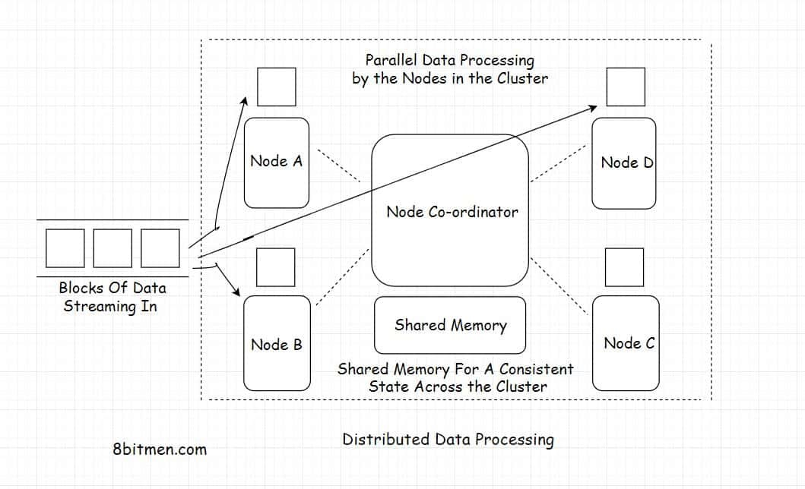
	
4. Distributed environment advantages:
	1. Helps accomplish task in significantly less amount of time
		1. Tasks are shared by several nodes
			1. Centralized system may need queue to process one by one

#### Distributed Data Processing technologies ####
1. Popular technologies for large scale data processing

##### MapReduce - Apache Hadoop #####
1. MapReduce - programming model for distributed data processing across several different machines in cluster
	1. Tasks are distributed to several machines
	2. Machines run work in parallel
	3. Machines manage communication and data transfer within different parts of system
2. Map: sorting data based on parameter
3. Reduce: Summarizing sorted data
4. Implementation: Apache Hadoop (MapReduce programming model)
	1. Used by:
		1. Twitter (for analytics)
		2. Facebook (for storing big data)

##### Apache Spark #####
1. Open source cluster computing framework
2. Provides high performance for 
	1. batch processing
	2. real-time in-stream processing
3. Works with many types of data sources
4. Facilitates parallel execution of work in cluster
5. It has cluster manager
	1. Facilitates communication between different nodes running together in cluster
6. It has distributed data storage
	1. For storage of big data
	2. Spark integration with distributed data stores:
		1. Cassandra
		2. HDFS
		3. MapReduce File System
		4. Amazon S3
		5. ...

##### Apache Storm #####
1. It is distributed stream processing framework
2. It is used for processing massive amounts of streaming data
3. Use cases:
	1. Real-time analytics
	2. Machine learning
	3. Distributed remote procedure calls
	4. ...

##### Apache Kafka #####
1. Open source distributed stream processing & messaging platform
2. Written in
	1. Java
	2. Scala
3. Developed by LinkedIn
4. Model:
	1. Storage:
		1. Has distributed scalable pub/sub message queue
			1. Helps read & write strams of data as messaging system
5. Kafka is used for real time features
	1. Notification platforms
	2. Managing streams of massive amounts of data
	3. Monitoring website activity & metrics
	4. Messaging
	5. Log aggregation
6. Choice:
	1. Batch processing: Hadoop
	2. Real-time streaming data: Spark, Kafka, Storm
7. Next: Architectures involved

### Lambda Architecture ###
1. Topics:
	1. What is Lambda Architecture?
	2. Layers of the Lambda Architecture

#### What is Lambda Architecture? ####
1. Definition:

		Lambda is a distributed data processing architecture that leverages both the batch & the real-time streaming data processing approaches to tackle the latency issues arising out of the batch processing approach. It joins the results from both the approaches before presenting it to the end user.
		
2. Lambda data processing architecture:

	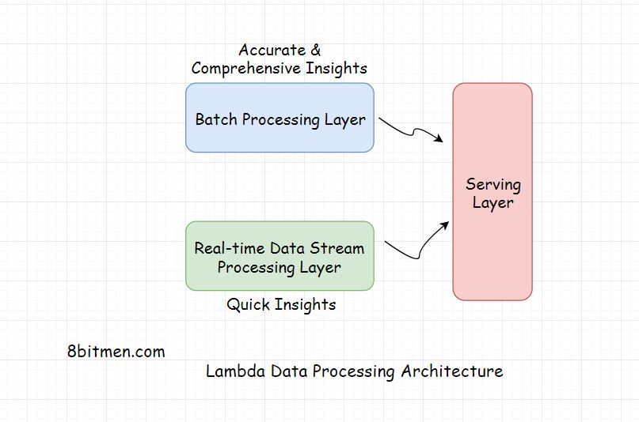
	
3. Batch processing:
	1. Cons: Takes time (massive data business has produced over time)
	2. Pros: High accuracy, comprehensive results
4. Real-time streaming data processing:
	1. Pros: Quick access to insights
	2. Cons: Small portion of data hence less accurate and less comprehensive (as compared to batch processing)
5. Lambda architecture: Makes most of two approaches

#### Layers of the Lambda Architecture ####
1. Three layers
	1. Batch layer
		1. Deals with results acquired via batch processing data
	2. Speed layer
		1. Deals with data from real-time straming data processing
	3. Serving layer
		1. Combines results from both (batch and speed layers)

### Kappa Architecture ###
1. Topics:
	1. What is Kappa Architecture?
	2. Layers of Kappa Architecture

#### What is Kappa Architecture? ####
1. Definition

		In Kappa architecture, all the data flows through a single data streaming pipeline as opposed to the Lambda architecture which has different data streaming layers that converge into one
		
2. Kappa data processing architecture:

	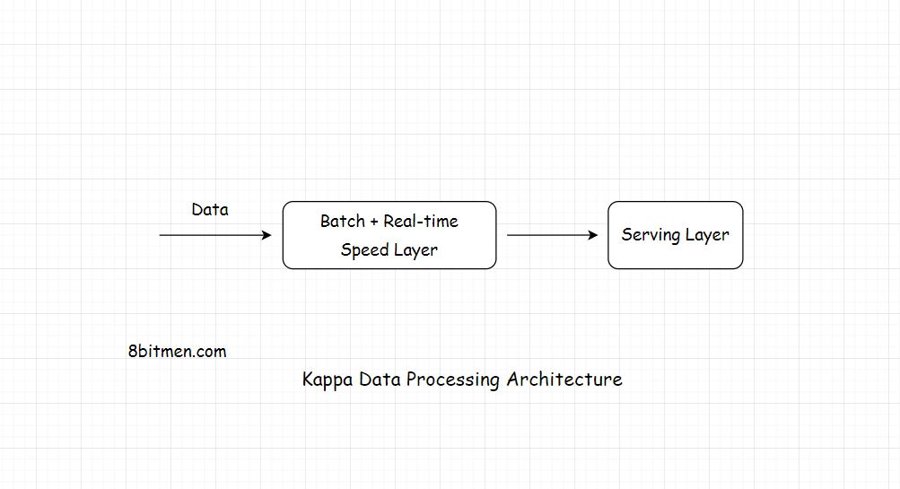
	
3. Real-time and batch processing data flows through single streaming pipeline 
	1. Pros: reduces complexity of managing separate layers for processing data

#### Layers of Kappa Architecture ####
1. Kappa has 2 layers
	1. Speed
		1. Stream processing layer
	2. Serving
		1. Final layer
2. Kappa is not alternative for Lambda
	1. Both have their uses
3. Use case:
	1. Kappa is used if batch and streaming analytics are fairly identical in system
	2. Lambda is used if batch and straming analytics are not identical
4. Challenges:
	1. Setting up and managing distributed data processing system is not trivial
		1. Requires years of work in perfecting system
		2. Strong consistency of data is not promised by distributed system

### Stream Processing Quiz ###

## More On Architecture ##
### Event Driven Architecture - Part 1 ###
1. Topics:
	1. What is Blocking?
	2. What is Non-Blocking?
2. Web 2.0 applications
	1. Reactive programming
	2. Event-driven architecture
	3. Blocking & Non-blocking
3. What are reactive programming, event-driven architecture, blocking & non-blocking?
	1. Examples of techs gaining popularity:
		1. NodeJS, Play, Tornado, [Akka.io](http://akka.io/)
	2. Why?
		1. Demands of modern software application development
			1. Real-time apps need:
				1. Persistent connections
				2. Asynchronous behaviour

#### What is Blocking? ####
1. Blocking: flow of execution is blocked waiting for a process to complete
	1. Until process completes, it cannot move on
		1. Example: every line of code invokes another function
			1. Flow is blocked until external function returns response
				1. A solution: Asynchronous behaviour - annotate and move the task to separate thread (not usual)

#### What is Non-Blocking? ####
1. Flow doesn't wait for first function called to return response. It moves on to execute next lines of code
	1. Cons: Not consistent - function might throw an error without returning a result but code in the sequence is still executed
	2. Pros: Good for IO (Input-Output) intensive operations
		1. IO intensive: disk, hardware based operations, communication network operations...
2. Next:
	1. What are events?
	2. What is event-driven architecture?
	3. What technologies are used to implement it?

### Event Driven Architecture - Part 2 ###
1. Topics:
	1. What are Events?
	2. Event-Driven Architecture
	3. Technologies for Implementing the Event Driven Architecture

#### What are Events? ####
1. Two kinds of processes in general exist
	1. CPU intensive
	2. IO intensive
		1. Events in web-app context
			1. If lot of IO operations are occurring, it means lot of events are occurring over a period of time
				1. Event:
					1. Tweet
					2. Click of a button
					3. HTTP request
					4. Ingested message
					5. Change in value of a variable
					6. ...
2. Web 2.0 real-time apps have lot of events
	1. Example:
		1. Request-response between client and server
			1. Online game
			2. Messaging app
			3. ...
	2. **Stream of events**: Events happening too often (stream-processing may be required)

#### Event-Driven Architecture ####
1. Reactive or Event-driven architecture - It is a non-blocking architecture
	1. Popular in web application development
2. Examples:
	1. NodeJS
	2. Java
		1. Play
		2. Akka.io
3. The frameworks and technologies are built for modern high IO scalable applications
	1. They can handle big number of concurrent connections with minimal resource consumption
	2. Modern applications may need fully asynchronous model to scale (web frameworks provide reliable behaviour in distributed environment)
		1. Capabilities:
			1. Can run on cluster
			2. Can handle large scale concurrent scenarios
			3. Can tackle problems that occur in clustered environment
	3. The technologies and frameworks enable us write code without worrying about how to handle
		1. Multi-threads
		2. Thread-lock
		3. Out of memory issues (due ot IO ...)
4. Event-driven reactive architecture
	1. Reacting to events occurring regularly - code is written to react to events instead of sequentially moving through lines of codes
		1. Stream of events
			1. System must be continously monitoring the stream to react to events
	2. It is all about processing **asynchronous data streams**
		1. App is inherently asynchronous
5. Event-driven architecture:

	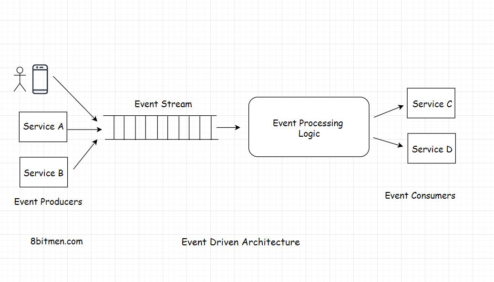

#### Technologies for Implementing the Event Driven Architecture ####
1. Example: Spring framework added Spring Reactor module, NodeJS, Akka.io, Play, ...
2. Thread-based frameworks: Reactive event-driven applications are difficult to implement (right away)
	1. Dealing with threads, shared mutable state, locks ... is complex
3. Everything is treated as a stream in event-driven system (abstraction)
	1. Developers don't have to worry about managing low level memory stuff
4. Examples of data streams:
	1. Transaction events
	2. Changing stock market prices
	3. User events on online shopping application
	4. ...
5. NodeJS - single threaded non-blocking framework
	1. It can handle IO intensive tasks
		1. Uses event loop architecture: [Event loop architecture](https://nodejs.org/fa/docs/guides/event-loop-timers-and-nexttick/)
6. [LinkedIn uses Play framework for identifying online status of users](https://www.8bitmen.com/linkedin-real-time-architecture-how-does-linkedin-identify-its-users-online/)
7. Traditional tech is not obsolete but has it's own use cases
	1. NodeJS is not a good fit for CPU intensive tasks
		1. Examples: Graphics rendering, ML algorithms, data in enterprise systems... (need transactions and blocking ...)
8. Next: Guidelines to picking up the right backend tehcnology

### Web Hooks ###
1. Topics:
	1. What are Web Hooks?
	2. How do Web Hooks Work?

#### What are Web Hooks? ####
1. Example: API which provides exclusive events on Baseball
	1. Suppose API is consumed by lot of third-party services that fetch info from the API (add some flavour to it) and present it to users
		1. Problems: Too many API requests too freqently if an event occurs may crush the server (spike)
			1. Server may not be able to keep up with the requests (even if event has not occurred yet if polling is used)
		2. Solution: WebHooks
			1. They are like callbacks
				1. Calls you back when new info is available
2. Webhooks: Enables communication between services without middleware
	1. It uses event-based mechanism

#### How Do Web Hooks Work? ####
1. Consumers register an HTTP endpoint with service with a unique API key (like a phone number - to call on that number when an event occurs)
2. Whenever new info is available on backend:
	1. Server fires HTTP event to all registered endpoints of consumers (notifies them of new update)
3. Web Hook:

	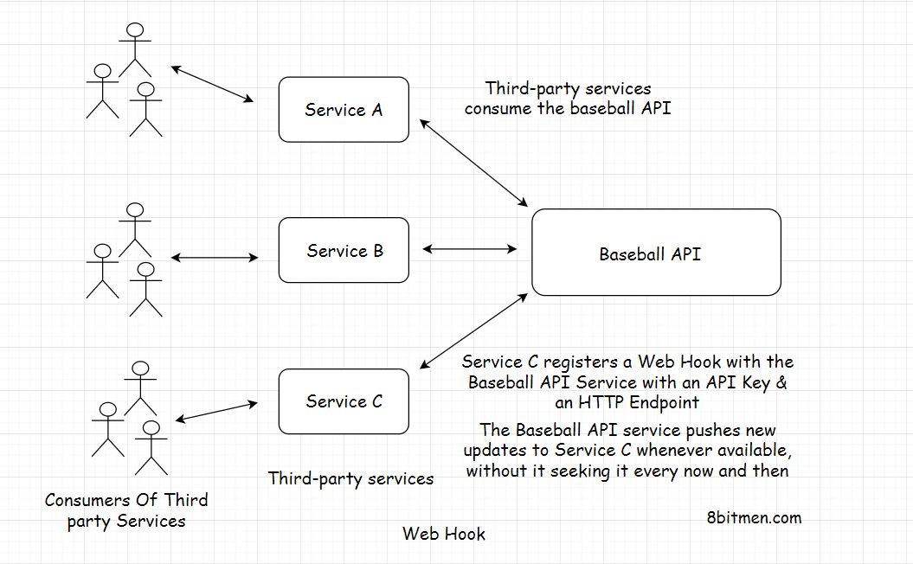
	
4. Examples: Browser notifications
	1. Websites notify us when they publish new content

### Shared Nothing Architecture ###
1. Shared nothing architecture:
	1. If modules work in conjunction with each other, they often share RAM, disk, database etc...
		1. If architecture of system where modules or services share nothing
2. Definition:

		Shared Nothing Architecture means eliminating all single points of failure. Every module has its own memory, own disk. So even if several modules in the system go down, the other modules online stay unaffected. It also helps with the scalability and performance.
		
3. Next: Hexagonal architecture

### Hexagonal Architecture ###
1. Topics:
	1. What is a Hexagonal Architecture?
	2. Real World Code Implementation

#### What is a Hexagonal Architecture? ####
1. The architecture has 3 components:
	1. Ports
	2. Adapters
	3. Domain
2. Hexagonal architecture:

	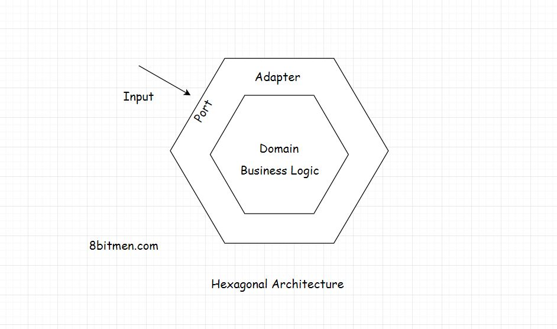
	
3. Focus: Making components
	1. Independent
	2. Loosely coupled
	3. Easy to test
4. Application must be testable (without any changes) by:
	1. Humans
	2. Automated tests
	3. Mock databases
	4. Mock middleware
	5. With UI
	6. Without UI
5. Pattern:
	1. **Domain** (business logic) is at the core
		1. External entities cannot directly access this component
	2. **Ports** (outer layer) are like API, interface
		1. All input to app goes through interface
	3. **Adapters** (outer layer) - implementations of the interface
		1. These convert data obtained from Ports to be processed by business logic
6. Business logic is at the center
7. Input/Output is at the edge of the structure
8. Hexagonal shape: Just a visual representation of the architecture
	1. Prevous name: **Ports and Adapters pattern**
		1. Analogy:
			1. Computer ports - input interface to external devices
			2. Adapters - converts signals obtained from ports to be processed by chips inside

#### Real World Code Implementation ####
1. Layered architecture?
	1. Controller
	2. Service layer interface
	3. Class implementations of interface
	4. Business logic goes in Domain model
	5. Repository classes
2. Layers of a web application

	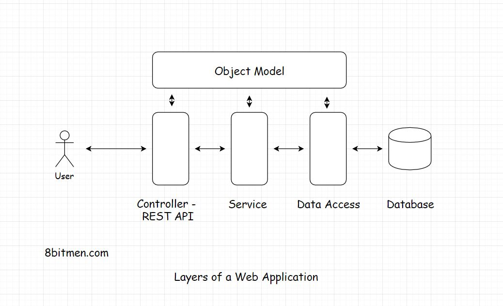
	
3. Hexagoal approach is an evolution of layered architecture (not entirely different)
	1. If Business logic stays in one place
		1. Problem: large repos may have too many layers beside regular service, repo & business ones
			1. Business logic gets scattered across layers
				1. Makes testing, refactoring, pluggability difficult
					1. Business logic in stored procecures
					2. Business logic coupled with UI in JSP (Java Server Pages)
	2. Business logic must not be coupled with UI and persistence layers
		1. Only an inside component must hold the business logic
			1. Then outside layer, ports and adapters can have (databases, message queues, APIs ...)

### More on Architecture Quiz - Part 1 ###
### Peer to Peer Architecture - Part 1 ###
1. Topics:
	1. What is a Peer to Peer (P2P) Network?
	2. What Does a Central Server Mean?
	3. Downsides of Centralized Systems
	4. What is a Decentralized Architecture?
	5. Advantages of a Peer to Peer Network
2. P2P architecture use cases: (seeding, leeching...)
	1. Blockchain technology
	2. Torrent
3. P2P Network
	1. It is a network in which computers (nodes) can communicate with each other without need of central server
		1. Rules out possibility of single point of failure
		2. All computers in network have equal rights
4. Seeder & leecher
	1. node acts as both seeder and leecher at the same time
		1. If some of the computers go down, rest of the network is up
	2. Seeder: node which hosts data on its system and provides bandwidth to upload data to network
	3. Leecher: node which downloads data from network
5. Peer to peer architecture:

	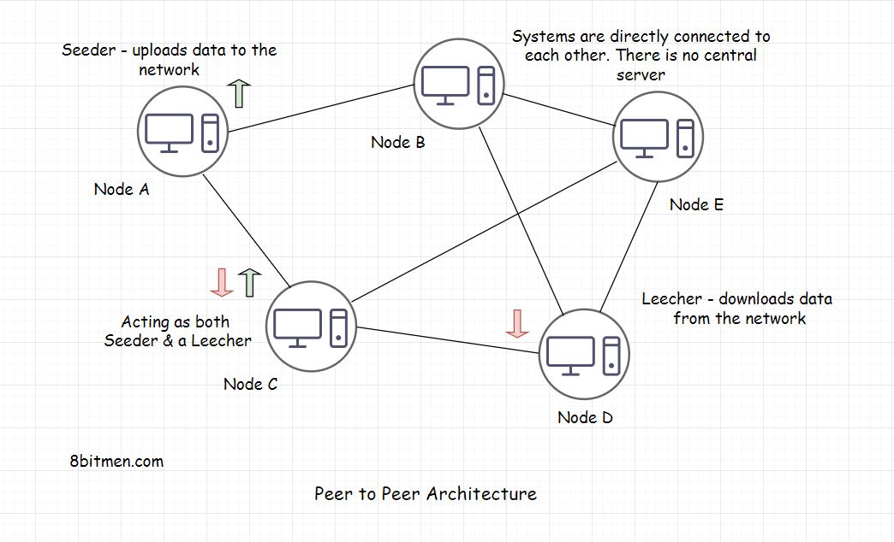
	
#### What Does a Central Server Mean? ####
1. Use case: Messaging app (centralized systes)
	1. First user sends message from his device
	2. Message moves on server of ogranization hosting messaging service
		1. Central server
	3. From messaging server, message is routed to destination (device of user receiving message)
2. What is the issue? 

#### Downsides of Centralized Systems ####
1. First: Central server has access to all messages
	1. It can read
	2. It can share with associates
	3. ... (not secure)
2. Cons: data breaches happen, government gets access to data
	1. Data is sometimes sold to third parties for profits
3. Example: National security, enterprise officials cannot use central server messaging apps (not secure)
4. Second: If natural disaster occurs say (earthquake, infrastructure failure, org going out of business)
	1. Communication is broken
5. Third: Suppose there is lot of content on social media and one day organization might just delete all of that (this is a big loss)
6. P2P networks are resilient to all the scenarios. They have decentralized architecture

	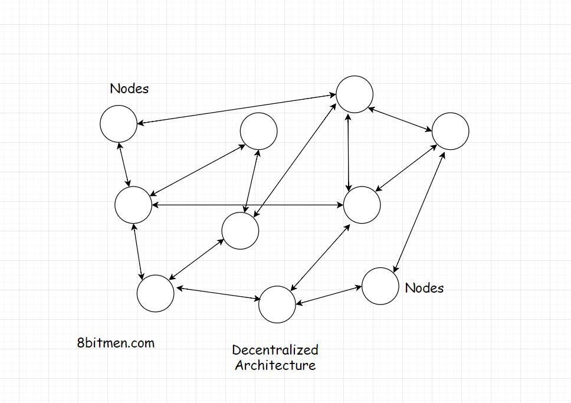

#### What is a Decentralized Architecture? ####
1. No one has control over own data
2. No one has power to delete the data (all participants have equal rights)
3. If servers are dead, one can still communicate with each other via peer to peer connection

#### Advantages of a Peer to Peer Network ####
1. Sharing huge data (gigabytes) with friends
	1. Messengers have memory limit
	2. Uploading to cloud needs a lot of storage space
	3. Writing to physical memory is also expensive and resource intensive and also additional courier expenses are incurred
2. Solution: Peer to peer file sharing
	1. Almost no costs
		1. Implementations: BitTorrent (common P2P protocol to distribute data and large electronic files over internet)
			1. A torrent file is created
			2. Share the torrent file with all folks
				1. Folks have to put the torrent in bittorrent client & start the download
				2. The folks can host (seed) files for others to simultaneously download
3. Next: deep dive into P2P architecture

### Peer to Peer Architecture - Part 2 ###
1. Topics:
	1. What is a Peer to Peer Architecture? How Does it Work?
	2. Types of P2P Networks
		1. Unstructured Network
		2. Structured Network
		3. Hybrid Network

#### What is a Peer to Peer Architecture? How Does it Work? ####
1. P2P architecture is designed around several nodes in network taking part equally acting as client and server
2. Architecture:

	
	
3. Data is exchanged over TCP IP (like HTTP protocol in client-server model)
	1. P2P has overlay network over TCP IP
		1. The network enables users to connect directly
		2. Takes care of complexities and heavy lifting
		3. Nodes/Peers are indexed & discoverable in the overlay network
		4. Large file is transfered between nodes by dividing it into chunks of equal size in non-sequential order
			1. 75 GB file say
		5. Other nodes in network which need the file locate the system containing the file
		6. The nodes download the file in chunks
		7. The donwloaded chunk is hosted simultaneously (makes it available to other users)
			1. Segmented P2P file transfer
4. Network is classified into structured, unstructured and hybrid models based on how peers are linked with each other in network

#### Types of P2P Networks ####
##### Unstructured Network #####
1. Notes/peers keep conneting with each other randomly (no structure, no rule)
	1. Just connect and grow the network
2. There is no indexing of nodes
3. If data is required, we need to scan all the nodes
	1. O(n) in complexity (n is number of nodes in the network)
	2. Resource intensive
	3. Suppose billion systems are connected and if file is stored in one system
		1. Worst case is that we need to search n - 1 nodes to get the location of the file (O(n))
	4. Implementations:
		1. Gossip
		2. Kazaa
		3. Gnutella

##### Structured Network #####
1. Structured P2P network holds proper indexing of nodes or topology
	1. Makes it easier to search for specific data
2. This kind of network implements **distributed hash table** to index nodes
	1. Index: It is like index of a book to find a piece of information in the book (instead of search the whole book)
3. Implementation:
	1. BitTorrent

##### Hybrid Model #####
1. Implementations: Majority of blockchain startups
2. What is hybrid model?
	1. Cherry-picking good stuff from all models
		1. P2P
		2. client-server
		3. ...
3. In p2p network, no single entity has full control
	1. For control, we need a server (client-server model)
4. Pros of P2P network:
	1. More availability - to take it down, we need to take down all nodes (may be across the globe)
	2. Highly scalable - load is not put on single node (and is usually shared)
		1. Bandwidth and storage space is also shared
			1. No third party server bandwidth costs and storage costs required
		2. Auto-scaling - when new users use the app, system scales automatically
	3. Secure - no third party intervention
		1. Share stuff only with friends we intend to share
5. Decentralized web:
	1. Disruptive tech
		1. Use case examples:
			1. Blockchain
			2. Cryptocurrency
		2. Implementations:
			1. Tradepal
			2. Peer to Peer digital cryptocurrencies like Bitcoin, Peercoin
			3. GitTorrent (a decentralized GitHub which uses BitTorrent and Bitcoin)
			4. Twister (decentralized microblogging service - uses WebTorrent for media attachments)
6. Next: Federated architecture - extension of decentralized architecture (used in decentralized social networks)

### Decentralized Social Networks ###
1. Topics:
	1. What is a Decentralized Social Network?
	2. What are the Features of Decentralized Social Networks?
		1. Bring Your Own Data
		2. Ensuring the Safety of Our Data
		3. Economic COmpensation to the Parties Involved in the Network
		4. Infrastructure Ease
2. What are decentralized social networks? 
3. Why should we care about them?
4. How is decentralized social network different from centrlaized social network?

#### What is a Decentralized Social Network? ####
1. Decentralized social networks have servers spread across the globe
2. The servers are hosted by individuals
3. No one has autonomous control over network (everyone has equal say)
4. Pros:
	1. No scalability issues
		1. Scalability is directly proportional to number of users joining & active on network
	2. No evesdrops on conversations or has rights to modify our data at whim
		1. We can host data from our systems (sending to third-party server is not required)
5. BYOD - Bring Your Own Data
6. What does it mean?
	1. User data layer is separate
	2. The data runs on standardized protocols
		1. The protocols are designed for decentralized web
		2. Data formats & protocols are consistent across networks & apps
	3. Getting out of social network doesn't kill the data (it is kept with us)
		1. If we sign up into another app, it is carried to that app
7. Implementations:
	1. Minds
	2. Mastodon
	3. Diaspora
	4. Friendica
	5. Sola
	6. ...	

#### What are the Features of Decentralized Social Networks? ####
##### Bring Your Own Data #####
1. Our own data can be carried to myriad of applications
	1. Blockchain economy leverages in video games
		1. in-game currency bought by players (swords, powers, ...) can be carried forward and used in other games (based on decentralized protocol)
		2. If game goes offline, the in-game items bought still hold value

##### Ensuring the Safety of Our Data #####
1. No evesdropping of private orgs on our data
2. We can decide with whom we want to share our data
3. Data is encrypted for everyone including tech team of network
4. No selling of data for personal profits

##### Economic Compensation to the Parties Involved in the Network #####
1. Examples: Diaspora, Sola, Friendica have features that would financially compensate all parties involved in network
	1. Users get compensated for awsome stuff shared online
	2. Users get compensated (in tokens or equity ... as per economic policy of network) if they share computing power to host network
	3. Teams (involved in moderating network, developers writing features) get compensated by enabling content-relevant ads on network (or by token-based economy of platform)
2. Win-win for everyone

##### Infrastructure Ease #####
1. Single entity does not bear entire cost of infrastructure (it is decentralized)
	1. Possibility of network going down is negligible probabilistically (unless such a disaster strikes)
	2. Individual developer can build cool stuff without worrying about server costs
		1. Data (like blockchain ledger) is replicated across nodes
		2. If few nodes go down, data is not lost
2. Social networks are written on protocols and software which are open source
	1. Community can improve the code
	2. Community can build awesome features
3. **ActivityPub**
	1. It is open decentralized social networking protocol
	2. It provides API for modifying & accessing content on network
	3. It provides API for communicating with other pods in federation
4. Decentralized web applications are expected to grab big chunk of market share
5. Next: Federated architecture

### Federated Architecture ###
1. Topics:
	1. What is a Federated Architecture?
	2. How is Federated Architecture Implemented in Decentralized Social Networks?
	3. What is the Need for Pods?

#### What is a Federated Architecture? ####
1. It is extension to decentralized architecture
	1. Examples:
		1. Powers social networks
			1. Mastadon
			2. Minds
			3. Diaspora
2. Federated: Group of semi-autonomous entities exchanging info with each other
	1. Example analogy: States of a country managed by state governments
		1. Partially self governing
		2. Power is exercised to run things smoothly
		3. State govts share info with each other & with central government (complete autonomy)
	2. Technically:
		1. It is under research, development & evolution
		2. No standard rules
			1. Developers and architects can have their own rules (not under control of single entity)

#### How is Federated Architecture Implemented in Decentralized Social Networks? ####
1. Parts:
	1. Servers or pods: There are many
		1. Linked to each other
		2. Share info with each other
		3. Can be hosted by individuals (as in decentralized network)
		4. New pods hosted grows the network
			1. If links between pods breaks temporarily, network is still up
				1. Nodes subscribed to the single pod can communicate with each other (atleast)
	2. Large number of nodes subscribe to pods
2. Federated architecture:

	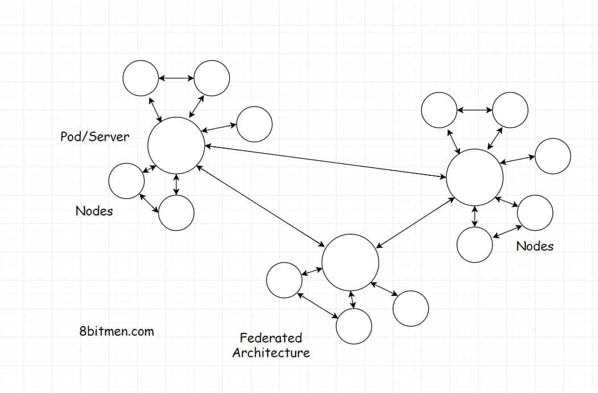

#### What is the Need for Pods? ####
1. Can the nodes not be linked to each other (like in regular peer to peer network)?
	1. Cons of having pods:
		1. Node discovery: Pods faciliate this
			1. In P2P there is not an easy way to discover other nodes (there is a need for centralized node registry)
				1. Alternative - run scan through the network to discover other nodes (time consuming and tedious)
				2. Solution: Pod
2. Next: Picking right server-side tehcnology

### More on Architecture Quiz - Part 2 ###

## Picking the Right Technology ##
### How to Pick the Right Server-Side Technology? ###
1. Topics:
	1. Real-Time Data Interaction
	2. Peer-to-Peer Web Application
	3. CRUD-based Regular Application
	4. Simple, Small Scale Applications
	5. CPU & Memory Intensive Applications
2. There is no direct mapping between use case X and technology Y
	1. Business requirements are a factor
		1. Give uniqueness to the use case
			1. There is room for creativity
3. Following are general scenarios or common use cases & fitting backend technology

#### Real-Time Data Interaction ####
1. If application needs real-time interaction with backend server
	1. Streaming data to and fro
		1. Example: Messaging application
		2. Real-time browser-based massive multiplayer game
		3. Real-time collaborative text editor
		4. Audio-video streaming app (Spotify, Netflix etc...)
	2. Solution:
		1. Persistent connection between client and server
		2. Non-blocking technology on back-end
	3. Implementations:
		1. NodeJS
		2. Python with Tornado
		3. Java:
			1. Spring Reactor
			2. Play
			3. [Akka.io](http://akka.io/)
		4. Go through architecture, concepts in dev docs (for further insight into how things work, what other techs and concepts can be leveraged to implement the use case ...)
			1. [Uber used NodeJS to write their core trip execution engine](https://eng.uber.com/uber-tech-stack-part-two/)
				1. It can manage large number of concurrent connections

#### Peer to Peer Web Application ####
1. P2P distributed search engine (say)
2. P2P Live TV radio service (say)
3. Example: LiveStation by Microsoft
4. Solution:
	1. JavaScript
		1. Protocols: DAT, IPFS
			1. FreedomJS: Framework for P2P web apps that work with modern web browsers
5. [Netflix researching on Peer to peer technology for streaming data](https://arstechnica.com/information-technology/2014/04/netflix-researching-large-scale-peer-to-peer-technology-for-streaming/)

#### CRUD-Based Regular Application ####
1. Example: Online movie booking portal
2. Example: Tax filing app
3. CRUD (Create Read Update Delete)
	1. Most common form of web-apps built for businesses
		1. Online booking portal
		2. App collecting user data or social site
		3. ...
	2. They are based on MVC (Model View Controller) architecture (on backend)
4. UI: React, Angular, Vue
5. Popular technologies for the use cases
	1. Spring MVC
	2. Python Django
	3. Ruby on Rails
	4. PHP Laravel
	5. ASP .NET MVC

#### Simple, Small Scale Applications ####
1. Examples:
	1. Simple online form
	2. Simple app to integrate with social media (that run within iFrame of portal)
	3. Browser-based games
		1. Airline
		2. Football manager
		3. Strategy
2. Can use PHP
	1. Other frameworks:
		1. Spring boot (verbosity and configuration is minimized)
		2. Ruby on Rails
	2. Pros of PHP: Hosting is cheaper (good for simple use cases)

#### CPU & Memory Intensive Applications ####
1. CPU intensive, memory intensive and computational tasks on backend
	1. Big Data processing
	2. Parallel processing
	3. Running monitoring & analytics (on large amount of data)
2. Requirements: Performance is critical for CPU and memory intensive apps
	1. High latency & memory consumption can blow up the economy of a tech company
		1. Regular scripting languages are not good for number crunching
	2. Solution: Tech commonly used in industry to write - performant, scalable, distributed systems
		1. C++
			1. Low-level memory manipulation features
			2. More control over memory to developers when writing distributed systems
				1. [Majority of the cryptocurrencies are written using this language](https://en.wikipedia.org/wiki/List_of_cryptocurrencies)
		2. Rust
			1. Similar to C++
				1. High performance
				2. Safe concurrency
			2. Gaining popularity among dev circles
		3. Java, Scala, Erlang - good picks
			1. Most large scale enterprise systems are written in Java
				1. [Elastisearch](https://en.wikipedia.org/wiki/Elasticsearch) - open-source real-time search and analytics engine is written in Java
			2. Erlang
				1. Functional language
				2. Built in support for concurrency
				3. Built in support for Fault-tolerance
				4. Built in support for distribution
				5. Facilitates development of massively scalable systems
				6. [Good read on Erlang](https://stackoverflow.com/questions/1636455/where-is-erlang-used-and-why)
			3. Go
				1. To write apps for multi-core machines
				2. For handling large amount of data
			4. Julia
				1. Dynamic programming language
				2. Built for high performance
				3. For running computations
				4. For numerical analytics
3. Next: Things to keep in mind when researching on picking fitting tech stack for project

### Key Things to Remember When Picking the Tech Stack ###
1. Topics:
	1. Be Thorough with the Requirements
	2. See if What We Already Know Fits the Requirements
	3. Does the Tech We Have Picked Has an Active Community? How is the Documentation & the Support?
	4. Is the Tech Being Used by Big Guns in Production?
	5. Check the License. Is it Open Source?
	6. Availability of Skilled Resources on the Tech
2. Picking appropriate tech stack is crucial for success of business
	1. Once choice is made it is difficult to change it

#### Be Thorough with the Requirements ####
1. Need to be crystal clear as to what we are going to build (no room for hazyness)
	1. Need to be clear on what we are looking for
		1. Example: database
			1. Is it relational or document oriented database?
			2. Is it semi structured or no structure?
			3. Large data and expected to grow exponentially?
			4. Small data and expected to grow at manageable pace unto certain limit?
		2. Will monolithic architecture server the requirements well?
		3. Does it need splitting up into several modules?
			1. If different technologies are required if things don't work with one technology or not

#### See if What We Already Know Fits the Requirements ####
1. It is easier to build new apps with tech we already know
	1. Steep learning curve can be avoided with new tech
2. Things are clearer if we use tech we are familiar with
	1. Nitty-gritty
	2. Familiarity with errors & exceptions
	3. Knowledge to fix the errors 
		1. Helps release features at quick pace
3. Avoid running for shiny new toys unless we need them
	1. If new tech throws an exception that we have never seen before, and we cannot find solution online - no help

#### Does the Tech We Have Picked Has An Active Community? How is the Documentation & the Support? ####
1. Tech that we pick has to have an active community
	1. Check GitHub
	2. Check StackOverflow
	3. ...
2. Docs should be smooth and easy to comprehend
3. Larger the community, the better it is
	1. Active community means
		1. Updated tools
		2. Updated libraries
		3. Updated frameworks
		4. ...
	2. Check if official support exists for the tech
		1. If we are stuck we might need help

#### Is the Tech Being Used by Big Guns in Production? ####
1. If big guns use it, it might mean it is battle-tested
	1. Might be usable in production
		1. We might not face issues with scalability, security, ... and design related issues
		2. The code base is mostly continually patched with new updates, bugs & design fixes
	2. Engineering blogs can be scanned to get more info on how they have implemented the tech

#### Check the License. Is it Open Source? ####
1. Open-source technology helps us write custom features (if original solution does not have it)
	1. One need not rely on original author for new features
2. Open-source products are usually free to use
3. Open-source tech (popular ones at-least) usually has larger community (since code is open)
	1. Anyone can fork it
	2. Anyone can start writing new features or fix known bugs

#### Availability of Skilled Resources on the Tech ####
1. If business gains traction:
	1. One needs to move at quick pace & roll out new features within stipulated time
		1. This needs enough skilled resources in industry on tech we pick
			1. It is easier to find MySQL admin or Java developer than the ones on newer technologies

### Conclusion ###
1. Overview:
	1. UI to backend layers
	2. Caching
	3. Database
	4. Messaging
	5. Data processing
	6. Pipelines
	7. ...
	8. Tiers in software arch
	9. Communication over web
	10. Scalability
	11. High availability
	12. Monolith
	13. Microservices
	14. Notification systems working principle
	15. Webhooks working principle
	16. Best database?
	17. Best backend?
	18. Front-end languages?
	19. Web architecture
	20. Monolith vs microservice and use cases
	21. Technology to pick based on use case
	22. Research on tech
2. Next: Case studies

## Case Studies ##
### A Web-Based Mapping Service ###
1. Topics:
	1. A Little Background on Google Maps
	2. Read-Heavy Application
	3. Data Type: Spatial
	4. Database
	5. Architecture
	6. Backend Technology
	7. Monolith vs Microservice
		1. APIs
	8. Server-Side Rendering of Map Tiles
	9. User Interface
	10. Real-Time Features
2. This is not system design lesson
	1. No database design
	2. No traffic estimations
	3. No code
	4. ...
3. Covers only architectural aspects of service
4. Covers how do concepts learn't apply

#### A Little Background on Google Maps ####
1. [Google Maps](https://cloud.google.com/maps-platform/)
	1. It is web-based mapping service by Google
	2. Offers satellite imagery
	3. Offers route planning features
	4. Offers real-time traffic conditions
	5. Offers API for writing map-based games like Pokemon Go
	6. ...
2. The massive sucessful services are result of years of evolution and iterative development
	1. Built feature by feature for years and perfected
		1. Google-maps started as desktop-based software written in C++ & evolved over years

#### Read-Heavy Application ####
1. This application is read-heavy & not write-heavy
	1. End-users are not generating content in application over time
		1. Some write is performed but negligible in comparison to write-heavy apps like Twitter or Instagram
2. Solution: Caching (reducing load on database)

#### Data Type: Spatial ####
1. Mapping app has spatial data
	1. Data with objects representing geometric info like
		1. Points
		2. Lines
		3. Polygons
	2. Data also has alphanumeric stuff
		1. [Geohash](https://en.wikipedia.org/wiki/Geohash)
			1. Latitudes
			2. Longitutes
			3. GIS - Geographical Information System data
			4. ...
	3. Solution: Dedicated spatial databases are available to persist this kind of data
		1. MySQL
		2. [MongoDB](https://docs.mongodb.com/manual/core/geospatial-indexes/)
		3. [CouchDB](https://github.com/couchbase/geocouch/)
		4. Neo4J
		5. [Redis](https://github.com/EverythingMe/geodis)
		6. [Google Big Query GIS](https://cloud.google.com/bigquery/docs/gis-intro)
			1. They also suppoert persistence of spatial data
				1. Plugin installation may be required
		7. [Spacial databases](https://en.wikipedia.org/wiki/Spatial_database)

#### Database ####
1. Coordinates are stored in database
2. If user runs search for specific location
	1. Coordinates are fetched from db
	2. Coordinates (numbers) are converted into map image
3. Traffic surge can occur during
	1. Peek office hours
	2. Festivals
	3. Major events in city
4. Dynamic horizontal scalability is required to manage traffic spikes
	1. App must be elastic to scale up and down on the fly
		1. We can pick up from multiple databases
			1. Relational
			2. Non-relational
				1. Choice: Map does not contain many relationships (doesn't need normalization for non-redundancy)
					1. Co-ordinates are fetched and processed on request
				2. NoSQL is inherently horizontally scalable
		2. Since it is read heavy, relational database can also be used with cacing
			1. Real-time use cases with lot of updates is a challenge (how?)
5. Features of Google Maps:
	1. Real-time live traffic patterns
	2. Real-time info on congested routes
	3. Real-time suggestion of alternative routes as we drive
	4. ...

#### Architecture ####
1. Client-server architecture
	1. We need control over the service
	2. P2P may not be a good option 

#### Backend Technology ####
1. Server side languages:
	1. Java
	2. Scala
	3. Python
	4. Go
2. Mature backend stack is okay
	1. Java
		1. It is performant
		2. Heavily used for writing scalable distributed systems
		3. Heavily used for enterprise development

#### Monolith vs Microservice ####
1. Which one?
	1. Need to go through the features of the service
		1. Core feature
			1. Map search
			2. Plan routes based on different modes of travel (car, walking, cycling, ...)
			3. When trip starts, map offers alternative route locations in real-time
			4. Service needs to adjust map based on user's real-time location & destination

##### APIs #####
1. Google offers different APIs (for third party developers)
	1. Direction API
	2. Distance Matrix API
		1. How much time it might take to reach a destination depending on mode of travel
			1. Walking
			2. Flying
			3. Driving
		2. Realtime alternative routes are displayed with predictive modelling (based on machine learning algorithms)
	3. Geocoding API
		1. For coverting numbers into actual places & back
	4. Places API
	5. Roads API
	6. Elevation API
	7. Time Zone API
	8. Custom search API
	9. Gaming API (for map based games)
	
		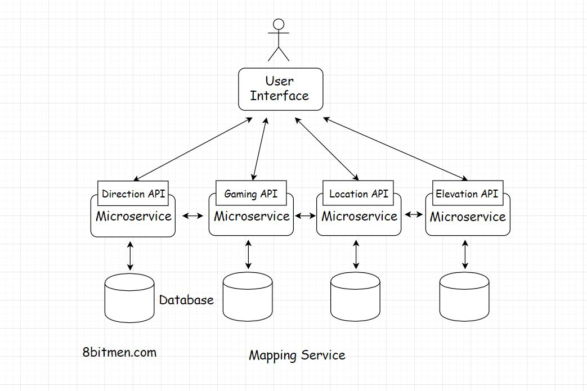
		
2. One may not implement everything in first relaest but monolith is not perferrable (according to author)
	1. Microservices approach:
		1. Separate service for each feature
			1. Cleaner
				1. Helps service scale and stay highly available
			2. If few services (real-time traffic, elevation API ...) go down, core search could remain unaffected

#### Server-Side Rendering of Map Tiles ####
1. Search service:
	1. If user searches for specific location, service has to match search text with name of location in database and pull up coordinates of place
	2. How to convert coordinates into an image?
	3. Should the image be rendered on the client or on the server?
		1. Server side rendering can be used because it can be cached for future requests
			1. Image is static content and can be same for all the users
		2. Single image need not be generated of the full map
			1. The map can be broken down into tiles that enable system to generate only part of the map user engages with
			2. Smaller times also help with zoom in and out options
				1. Only sections of map are refreshed in tiles
				2. Rendering entire map each time is resource intensive
			3. The map can be generated in server and tiles can be cached
				1. A dedicated map server might be required to render teh tiles on the backend
2. Web based map service:

	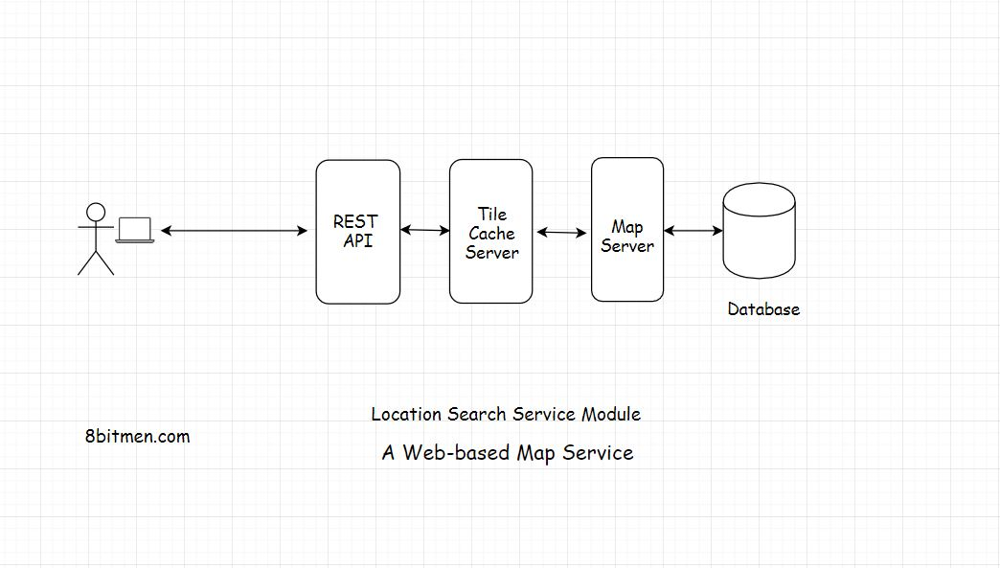

#### User Interface ####
1. UI can be written in JS and HTML5
	1. JQuery is fine for simple requirements (as per author)
	2. React, Angular can also be used
	3. UI can have JS events enabled to 
		1. Interact with the map
		2. Pin locations
		3. Search for places
		4. Draw markers
		5. Draw vectors on map
		6. ...
2. Implementation:
	1. [OpenLayers](https://openlayers.org/) - open source UI library for making maps work with web browsers
		1. Helps not write everything from ground up
3. Flow:
	1. User runs search for location on backend
	2. Request is routed to tile cache
	3. Cache which has pre-generated tiles sits between UI and map server
		1. If requested tile is present in cache, it is sent to UI
		2. If not, map server hits database and fetches coordinates and related data & generates the tile

#### Real-Time Features ####
1. To implement real-time features
	1. Need to establish persistent connection with server
	2. Cons: 
		1. Resource intensive
		2. Limits on number of concurrent connections servers can handle
	3. Real-time features can be implemented only if it is really required
2. [How Hotstar a Video Streaming Service Scaled with Over 10 Million Concurrent Users](https://www.8bitmen.com/how-hotstar-scaled-with-10-3-million-concurrent-users-an-architectural-insight/)
3. Summary:
	1. Covered
		1. Backend
		2. Database
		3. Caching
		4. UI
		5. Google Maps service

### A Baseball Game Ticket Booking Web Portal ###
1. Topics:
	1. Database
	2. Handling Concurrency
		1. Message Queue
		2. Database Locks
	3. Caching
	4. Backend Tech
	5. User Interface
2. What is covered:
	1. Understanding of architecture
	2. Key points to consider when desiging application like baseball game online ticket booking portal

#### Database ####
1. Key thing: 
	1. Sale of tickets online
		1. Needs foolproof payment system (fans need to be taken care of properly)
	2. This needs strong consistency & trnasactional support
		1. Needs ACID compliance
			1. Relational database: MySQL (say)

#### Handling Concurrency ####
1. Application should be able to handle high number of concurrent connections
	1. There could be a surge of fans at the portal (may be at the time it is made available)
	2. Number of requests may be much more than tickets available
		1. n requests might come for one ticket
2. How to implement the scenario?

##### Message Queue #####
1. One approach: Queu all ticket buying requests in message queue
	1. Apply FIFO principle
		1. Handling concurrent reqeusts with message 	queue

##### Database Locks #####
1. Use right transaction isolation level
	1. Ensures consistency in database
		1. [Good read on it](https://en.wikipedia.org/wiki/Isolation_(database_systems))
		2. [Snapshot Isolation](https://en.wikipedia.org/wiki/Snapshot_isolation)
	2. Can only be implemented with ACID compliant databases (like MySQL)
		1. In e-commerce sites or booking travel tickets: tickets shown on website are not accurate (they are cached values)
			1. When user moves on to buy particular ticket, checks out cart:
				1. System polls database for accurate value
				2. System locks resource for transaction

#### Caching ####
1. Can pick any of popular caches
	1. Redis
	2. Memcache
	3. Hazelcast
2. Users can just browse website to look at current price of tickets and not buy them
	1. Caching everts such load on database

#### Backend Tech ####
1. Examples: Java, Scala, Python, Go, ...
2. To send notifications to users
	1. RabbitMQ
	2. Kafka

#### User Interface ####
1. App is a CRUD app
	1. Persistent conection is not necessary
	2. Simple Ajax queries should work
2. UI can be made responsive
	1. Fans can access it via devices with different screen sizes
		1. UI should be smart enough to adjust itslef based on screen size
	2. Implementation:
		1. CSS3 from ground up
		2. Bootstrap JS - open source and supports responsive design out of the box
	3. Frameworks:
		1. React JS
		2. Angular JS
		3. Vue JS
	4. Why frameworks?
		1. Popular in industry
		2. Businesses prefer to use them to standardize behaviour & implementation of apps

## Mobile Apps ( - New - ) ##
### Introduction ###
1. Topics:
	1. The Arrival of Handheld Devices
	2. The Transition from Desktop to Mobile

#### The Arrival of Handheld Devices ####
1. Mobile devices seem to have max market penetration globally
	1. Approx 60 to 70% of users are accessing online services through mobile devices (as compared to desktops or laptops)
	2. Possible reasons:
		1. Accessibility
		2. Ease of use
		3. Portability (can carry mobiles almost anywhere)
		4. Doesn't need much expertise to operate mobile phone
	3. Mobile devices are well designed even for new users
	4. There is a trend where businesses are opting for mobile first approach

#### The Transition from Desktop to Mobile ####
1. Smartphone hardware significantly improved
	1. Cool cameras
	2. Better memory
	3. ...
2. Many games transitioned to mobile devices
	1. Better user retention was observed
	2. Better engagement rate was observed via mobile versions
		1. Montly Active Users (MOU) increased
		2. Daily Active Users (DAU) increased
3. Mobile devices are bringing in large (may be majority) of traffic for business
4. Next:
	1. Mobile-only
	2. Mobile-first
	3. Mobile-friendly

### Before You Design Your Mobile App ###
1. Topics:
	1. Mobile Only
	2. Mobile First
	3. Mobile Friendly - Responsive
	4. What Approach Should You Choose For Your Business?
	5. Real Life Examples
2. If we are in initial planning & design phase of service or have web-based service up and running
	1. Do thorough market research in niche before writing mobile app for service
		1. It may be a good to have but not necessary
			1. Mobile app may involve significant cost and a dedicated mobile team
			2. Mobile app development has steep learning curve
				1. Hand-held devices are battery powered
					1. CPU, Storage, RAM, Data are limited
				2. It needs different approach
					1. Facbook, Instagram etc.. do a lot of R & D & strategizing when developing apps

#### Mobile Only ####
1. Business operates only via mobile
2. Mobile website or mobile app on play store or both
	1. But apps are moved forward with when going mobile-only (which drives majority of traffic)
	2. Mobile websites run on mobile browsers (built primarily for engaging traffic coming from google search)
		1. Users are then routed to respective apps
			1. Example: Pokemon Go

#### Mobile First ####
1. UI of service is designed in such a way that users of business will use idea that majority of users of business will use its services (via mobile client)
2. Desktop based website interface is secondary
3. Mobile interface is shown to customers first
	1. It is built to usually contain everything that user would need to fully experience a service and interact with all of the features (than desktop app)
4. Designers would first design mobile interface and then desktop and tablet interfaces are designed (based on mobile interface)
5. Business first goes to market with app or browser-based mobile website
6. Example: [Mytra.com](http://myntra.com/)
	1. Online fashion retail business
		1. Majority of revenue seems to have got generated from mobile app (70%...)
		2. Desktop website has been gotten rid off
			1. [Myntra re-opened its desktop website but is still a mobile-first business](https://yourstory.com/2016/05/myntra-desktop-website)

#### Mobile Friendly - Responsive ####
1. Websites that are friendly for mobile but originally built to render on desktop browsers
	1. Responsive websites
		1. Grid based design
		2. They adapt themselves based on screen size of device
		3. These are web-first or desktop-first
		4. Websites are divided into rows and columns containing grids
			1. As screen size gets smaller, grids re-arrange themselves based on screen size
		2. Responsive website:

			
			
2. Desktop-based responsive website will automatically render for all screen sizes
	1. Challenge: We may not have 100% control over how responsive website renders on different devices
		1. Some elements of page may be hidden
		2. Some elemetns of page may not render in a way we would like
		3. CSS-media queries will also not be as good as mobile-first built website
			1. **Mobile-first strategy can be used if majority of traffic comes-in from mobile**

#### What Approach Should You Choose For Your Business? ####
1. Important things:
	1. How are users of existing business (in same niche) are accessing the website?
	2. Do the businesses have app on popular app stores or they operate just via websites?
		1. If app exists, how many downloads are done?
		2. What is their primary traffic & social discovery sources? (how users find service)
		3. What is platform wise revenue generation?
			1. Difficult to get that info if it is not public info
				1. One can estimate looking at the traffic
	3. Implementations: Business analytics tools (with browser extensions and services)
2. Type of service offered to users plays decisive role in building a strategy for approaching market
	1. One can figure out if we need to go ahead with or without mobile app
		1. Example: for service in health niche
			1. To enable users to track eating habits
			2. To suggest healthy alternatives available
			3. Offer social features for user engagement & retention
				1. What is the best strategy?
				2. Do we need mobile app?
				3. Does web-based website suffice?
					1. It is inconvenient for user to open laptop or rus hto desktop every time he wants to input or check calories of food he just ate
						1. A mobile app that can be installed to track all meals throughout the data anywhere he enjoys meals (home, cafeteria, ...)
							1. Mobile-first approach might work here
					2. Web-based interface is a good to have (in the initial stages of startup)
			4. **Firebase: Enables writing app without investing too much time in setting up backend infrastructure**

#### Real Life Examples ####
1. [Myntra.com](http://myntra.com/)
	1. 30% of revenue was from desktop
		1. Dedicated platforms have costs too - so the desktop version was ditched
2. If most of the sales are happening via mobile client regardless of the fact that maximum traffic was coming from desktop
	1. We can write a mobile app (for money)
3. Pixel Federation:
	1. Browser & app based gaming company
		1. [In 2017 they launched an app that got over 8.1 million downloads](https://portal.pixelfederation.com/en/blog/article/seaport-2018-highlights)
4. Conclusion: research in the niche is important before writing any code

### Responsive Interfaces ###
1. Topics:
	1. Designing Responsive Websites
2. How can we develop responsive websites for our service
	1. Two appraoches:
		1. Mobile first
			1. Design website for small screen & then let it adapt for bigger desktop screen
		2. Web first
			1. Design website for bigger screen and then let it adapt for smaller screens
3. There are plethora of smart devices availabe in market with different unique screen sizes
	1. Smart TVs
	2. Kindle
	3. Android-powered devices
	4. IoT devices
	5. Blackberry
	6. Windows handheld phones
	7. Apple products (iPhone, iPad, ...)
	8. Super tiny smart watch screens
4. It is challenging for developers to write applications for every screen size
	1. Solution: Responsive interface
		1. Popular saying:
			1. Content should be like water, it should take the shape of the vessel it is poured in
5. Next: Popular technologies used by developers for responsive interfaces

#### Designing Responsive Websites ####
1. If I am not a designer, I cannot hire a designer and I am a backend developer, pick [BootstrapJS](https://getbootstrap.com/)
	1. BootstrapJS - it is production grade open-source CSS framework for designing responsive user interfaces
		1. Contains
			1. CSS
			2. JS features
			3. Animations
			4. Typography
			5. Form elements
			6. Buttons
			7. ...
		2. We don't have to write anything from ground up
			1. Plug elements together and build the website
			2. There are lot of templates & plugins (free & premium)
				1. Offer more than core framework
				2. If feature does not exist online, we can write one since it is open source
		3. Learning curve is not that steep
			1. grid-based approach is recommended by trainer
			2. Responsive design:

				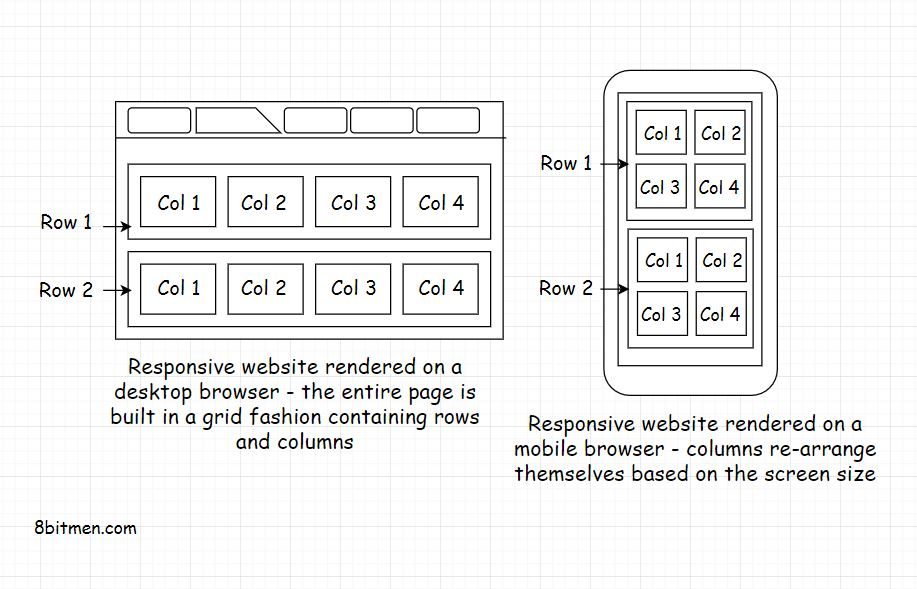
				
		4. Twitter wrote it to have consistency across all user interfaces of internal tools
		5. [Projects Built using Bootstrap Framework](https://expo.getbootstrap.com/)
2. [jQuery Mobile](https://jquerymobile.com/) - another popular framework for responsive websites
	1. Written and maintained by jQuery project team
3. Other frameworks:
	1. Skeleton
	2. HTML5 Boilerplate
	3. Less Framework
	4. ...
4. Next: Types of mobile apps

### Types of Mobile Apps - Part 1 ###
1. Topics:
	1. Native App
	2. Technologies for Writing Native Apps
	3. Hybrid App
	4. Technologies for Writing Hybrid Apps
		1. React Native
		2. Apache Cordova - PhoneGap
		3. Ionic Framework
		4. Flutter
2. Mobile apps are apps that we download from Google Play Store or iPhone App Store & install
3. Two types of mobile apps
	1. Native
	2. Hybrid
4. Next: Popular technologies for the types
5. Next: Why is it important for developers to pick the right type of app to implement their use case?
6. Next: Why do we need diferent types of mobile apps? What are the pain points these app types are trying to solve?
7. Next: Whick app type, hybrid or native, will suite best for my use case? We'll discuss this with some real-life examples

#### Native App ####
1. Apps built for particular OS (Android, iOS, Windoes-based)
	1. They function only on OS there are built for
		1. Andrid OS app will not work on Apple OS
2. Native apps interact directly with the OS and device hardware
	1. No wrapper
	2. No middleware
	3. No adapter
3. They have full access to device hardware like
	1. Camera
	2. Sensors
	3. ...
4. Pros:
	1. High performance
	2. Consistent user interface
	3. Look and feel of native OS
5. Native App:

	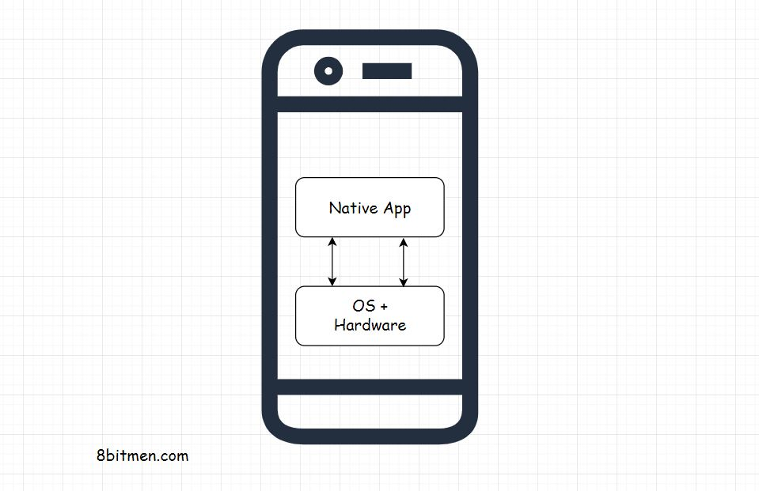
	
6. Pros:
	1. No lag issues when rendering UI animations (like slider movement, hiding and displaying UI elements ...)
	2. UI is pretty responsive
		1. When user clicks on UI, it changes almost immediately if it is to (no lag)
7. Development:
	1. Native apps are developed using APIs and SDKs provided by native OS
	2. Examples: Android apps of LinkedIn, Tinder, Hike

#### Technologies for Writing Native Apps ####
1. Mobile OS supports certain set of technologies for writing an app that would run on it
	1. Android OS:
		1. Java
		2. Kotlin
		3. C++
		4. [Official Android Developer Documentation is Good Starting Place](https://developer.android.com/guide?hl=en)
	2. iOS:
		1. Swift
		2. Objective C
		3. Cocoa Touch Framework
		4. [Apple developer docs](https://developer.apple.com/library/archive/referencelibrary/GettingStarted/DevelopiOSAppsSwift/)
	3. Every respective mobile OS supports different set of technologies to enable developers to build apps for its platform

#### Hybrid App ####
1. They are hybrid between native and web-based technologies
2. They can be installed from app stores (just like native apps)
3. They can access hardware and communicate with OS
4. Primarily built using open based technologies
	1. HTML5
	2. CSS
	3. JS
5. They run in native container and communicate with native OS via a wrapper or middle layer
	1. Middle layer enables open web technologies to talk to native OS
		1. Makes hybrid apps a bit slower than native apps (performance wise and rendering of UI)
6. Hybrid apps:

	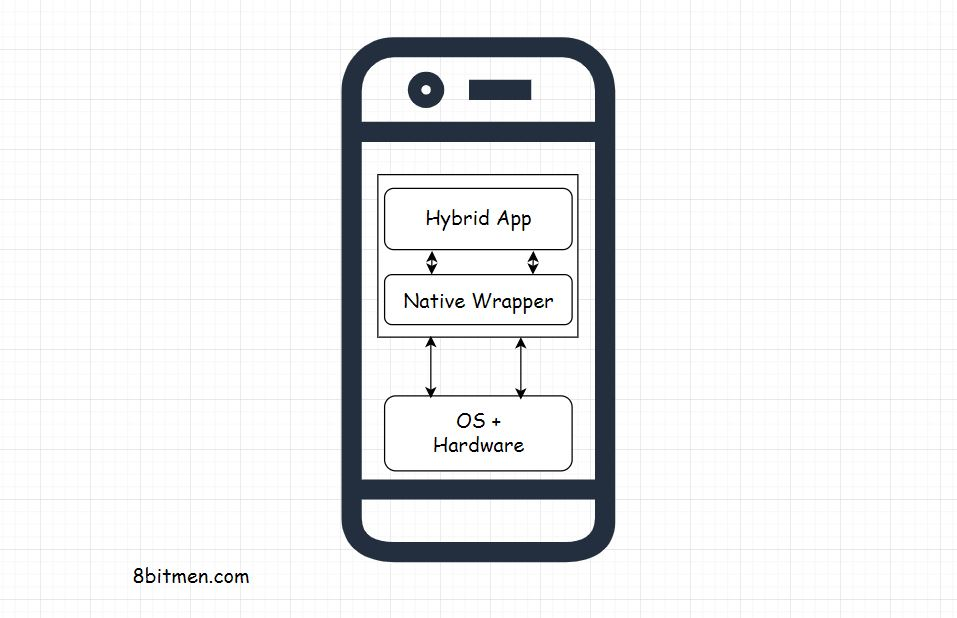
	
7. Popular frameworks for hybrid apps:
	1. React-Native
	2. Ionic
	3. Cordova
	4. ...

#### Technologies for Writing Hybrid Apps ####
1. Popular technologies as follows:

##### React Native #####
1. [React Native](https://facebook.github.io/react-native/)
2. Written in JS and developed by Facebook
3. It can be used to develop for Android, iOS, Windows, ...
4. It was used by facebook for 
	1. Ad manager
	2. Analytics
	3. Group app
5. It had highest number of contributors for any repo in GitHub in 2018
6. Companies using React Native for their mobile apps:
	1. [Boomberg](https://www.techatbloomberg.com/blog/bloomberg-used-react-native-develop-new-consumer-app/)
	2. [Walmart](https://medium.com/walmartlabs/react-native-at-walmartlabs-cdd140589560#.ueonqqloc)
	3. [Uber Eats](https://eng.uber.com/ubereats-react-native/)
	4. [Discord](https://blog.discordapp.com/why-discord-is-sticking-with-react-native-ccc34be0d427)

##### Apache Cordova - PhoneGap #####
1. [Apache Cordova](https://cordova.apache.org/) - Open source and hybrid released by Adobe
2. Can be used to build mobile apps for Android, iOS using HTML, JavaScript, CSS
3. Ionic Framework & PhoneGap etc... are built on top of Cordova
	1. PhoneGap - Adobe's commercial version of Cordova
4. Adobe provides following for mobile development using PhoneGap
	1. Tools
	2. Entire ecosystem
5. [List of apps developed using PhoneGap](https://phonegap.com/app/)

##### Ionic Framework #####
1. [Ionic](https://ionicframework.com/) - open-source SDK for writing hybrid mobile apps built on top of Apache Cordova and Angular JS
2. [Companies developing apps using Ionic framework](https://ionicframework.com/customers)

##### Flutter #####
1. [Flutter](https://flutter.dev/) - open-source hybrid mobile app SDK by Google
2. It can be used to develop apps for Android, iOS, Windoes, Mac, Linux, Google Fuchsia & Web.
3. Apps developed using Flutter are:
	1. [Square](https://squareup.com/us/en/flutter)
	2. [Google Assistant](https://developers.googleblog.com/2019/05/Flutter-io19.html)
4. Full list of apps developed using Flutter: [List of apps](https://flutter.dev/showcase)
5. [Wikipedia Resource](https://en.wikipedia.org/wiki/Mobile_app_development)
	1. List of mobile app dev tools, SDKs & platforms for writing mobile apps

### Types of Mobile Apps - Part 2 ###
1. Topics:
	1. Cross-Platform App Development Pain Points - The Need for Hybrid Apps
	2. Issues with Hybrid Apps
	3. Real Life Examples
		1. Airbnb Ditacked React-Native For Native Tech
		2. Udacity Abandoned React Native
		3. Facebook Admitted Counting Big On Html5 For Their Mobile App was a Mistake
2. What is the need for hybrid apps?
	1. When we have native apps
	2. When native apps are performant
	3. When native apps have consistent UI
	4. Why does Business want to compromise on UX by using Hybrid app?
3. There are pain points with Native app development
	1. Solutio: Turn to hybrid apps to overcome the pain points

#### Cross-Platform App Development Pain Points - The Need for Hybrid Apps ####
1. We need to develop dedicated apps for every platform if native:
	1. Android
	2. iOS
	3. Windows
	4. Blackberry
	5. ...
2. Developing & maintaining dedicated mobile app for every OS is biggest pain point of cross-platform app development
3. Each OS supports specific set of technologies for apps (no common ground, no common technology supported by all platforms)
4. Dedicated teams amy be required for each platform
	1. Android: Java, Kotlin or C++
	2. iOS: Swift (Object C)
5. If a different OS comes in market supporting different set of technologies for it's own platform
6. During startup, there are no enough resources (developers + money) to set up dedicated teams and codebases for each platform
	1. One may need common codebase that is portable
		1. It can be built once and run anywhere
			1. Solution: Hybrid apps
				1. Developed used open web technologies (HTML5, JS)
					1. Development teams working on web are familiar with the technology and doesnt have to go through steep learning curve to build apps
				2. Businesses do not need dedicated teams for different platforms
					1. Same codebase can be deployed on multiple platforms (with minor modifications) - saves time and money
7. Hybrid tech comes with it's pros and cons

#### Issues With Hybrid Apps ####
1. Not as performant and as smooth as native apps
	1. they run inside native container
	2. They talk to underlying OS via middle layer
		1. Slows down performance a bit and introduce lag
2. Certain frameworks claim to be as performant or better (but running in production should be as performant as claimed)
3. Certain businesses switched to hybrid and bad to native app to achieve desired user experience

#### Real Life Examples ####
##### Airbnb Ditched React-Native for Native Tech #####
1. [blog posts](https://medium.com/airbnb-engineering/react-native-at-airbnb-f95aa460be1c) - Experience of developing mobile app with react native
	1. Since website used React JS
2. After couple of years, React-Native was abandoned for native tech (due to performance issues - especially during app initialization, initial render time, with app launch screen, when navigating between different screens, experienced dropped frames)
	1. Several patches were written to get desired native functionality
		1. Some trivial stuff that could be donw with native tech was difficult to pull off with React-Native
	2. Lack of type safety with JS made it difficult to scale & development turned out to be difficult for engineers (who were used to default type-safety checks)
		1. Lack of type safety made code refactoring difficult
3. [React Native at Airbnb](https://medium.com/airbnb-engineering/react-native-at-airbnb-f95aa460be1c)

##### Udacity Abandoned React Native #####
1. Due to increased number of Android-specific features requested by users
	1. Android team was relunctant to go with hybrid approach
	2. Long term maintenance costs of React-Native were high
3. UX consistency issues were encountered across platforms
4. [Full account](https://engineering.udacity.com/react-native-a-retrospective-from-the-mobile-engineering-team-at-udacity-89975d6a8102)

##### Facebook Admitted Counting Big on HTML5 for Their Mobile App was a Mistake #####
1. In 2012
2. Big mistake investing too much time and resources writing mobile app with HTML5 instead of using native tech
	1. Mobile strategy relied too much on open web technologies
3. [Here is full account on VentureBeat](https://venturebeat.com/2012/09/11/facebooks-zuckerberg-the-biggest-mistake-weve-made-as-a-company-is-betting-on-html5-over-native/)
4. Interesting reads:
	1. [Who Will Steal Android From Google?](https://medium.com/@steve.yegge/who-will-steal-android-from-google-af3622b6252e)
	2. [The Story of Firefox OS](https://medium.com/@bfrancis/the-story-of-firefox-os-cb5bf796e8fb)
5. Next: Right mobile app type for our usecase (Hybrid or native)

### Choosing Between A Native & A Hybrid App ###
1. Topics:
	1. When Should We Pick a Native App for Our Use Case?
	2. When Should We Pick a Hybrid App for Our Use Case?

#### When Should We Pick a Native App for Our Use Case? ####
1. Points to consider:
	1. Heavy graphic and hardware requirements
		1. Mobile game
		2. Game streaming app
			1. We need performance (any lag is unacceptable)
	2. Heavy UI animations
		1. Fancy social app with lot of animations
		2. Finance app containing lot of real-time charts and graphs & stuff
			1. Any lag is unacceptable
				1. We need responsiveness & reliability
	3. Pretty complex app that relies on hardware access
		1. Hardware:
			1. Camera
			2. Sensors
			3. GPS
			4. ...
		2. We may have to write a lot of platform specific code
		3. Examples: GPS, sensor-based health and setp-tracking app
	4. When look & feel of app and user experience should be just like native OS
		1. UI needs to be flawless
	5. When other businesses have same niche competition with native apps
		1. User's may not use the app when competetors have better apps
	6. When app always needs to support new OS features
		1. As soon as they are released
	7. If business can afford dedicated teams for iOS & Android
		1. Hybrid app approach is not recommended in this case (by instructor)

#### When Should We Pick a Hybrid App for Our Use Case? ####
1. Reasons:
	1. App requirements are simple (no complexity)
		1. No addition of complex features expected
		2. Example: News app
			1. Also give same look and feel across all platforms
	2. Dedicated code bases cannot be afforded but need to hit the market
		1. Two approaches (based on choice or other criteria)
			1. Launch native app on one platform
			2. Write hybrid app
	3. Need to test waters with pre-alpha release or MVP (Minimum Viable Product)
		1. Hybrid technology enables us to quickly launch MVP (written with open web technologies)
	4. We have team that is not fluent with native tech (may take a lot of time to learn the tech)
		1. It is a tradeoff between costs and performance
		2. Developer sentiment is another aspect
2. We can find businesses in the same niche, research on what techs they have used to write their apps

### Progressive Web Apps ###
1. Topics:
	1. What are Progressive Web Apps?
	2. The Need for PWAs
	3. Will PWAs Replace Native Apps?
	4. Examples of Progressive Web Apps
		1. BookMyShow PWA
		2. Flipkart PWA
		3. Twitter PWA

#### What are Progressive Web Apps? ####
1. PWAs are apps with look and feel of native apps that can run in browser of both mobile and desktop devices & can also be installed (from browser on device of user)
	1. If installed on device, PWAs run in their own window without address bar or browser tab (just like native apps)
		1. When PWA is opened in browser, + sign is shown in address bar
			1. On clicking, it will isntall app on device with shortcut on home screen

#### The Need for PWAs ####
1. PWAs are preferred over responsive websites
	1. Reasons: They have same look and feel of native apps
		1. Instead of directing users to native apps, native app user experience can be offered in browser
			1. User can also choose to install the app on device
	2. PWAs have access to underlying OS and hardware
2. PWAs are developed using open web technologies (HTML, CSS, JS) and frameworks like Angular, React, Ionic, Google Polymer, ...
	1. No native tech learning curve
		1. Write once run anywhere
3. PWAs can run in mobile and desktop browsers and can be installed on desktops as well
4. PWAs can work offline
5. PWAs have push notifications like native apps
6. PWAs can be indexed by search engines
7. PWAs links can be shared
8. PWAs do not need updates like native apps
	1. If PWA is opened, it will allways have latest version

#### Will PWAs Replace Native Apps? ####
1. No
	1. Native apps are for performance, user experience and other reasons discussed
2. PWA is not good for CPU intensive game
3. PWAs compete with responsive mobile websites
	1. App like experience instead of mobile webiste
		1. E-Commerce website is not perferred over app-like experience

#### Examples of Progressive Web Apps ####
##### BookMyShow PWA #####
1. [Bookmyshow.com](http://bookmyshow.com/) - online ticket booking platform
	1. [After launch of PWA](https://developers.google.com/web/showcase/2017/bookmyshow) - exponential increase upto 80% on conversion rates
		1. Lighter than android app, smaller than ios app

##### Flipkart PWA #####
1. [Flipkart.com](http://flipkart.com/) - e-commerce website
	1. Engagement rate increased 3x, conversion rate went up by 70%, reduction in data usage by 3x
		1. [Full account](https://developers.google.com/web/showcase/2016/flipkart)

##### Twitte PWA #####
1. [Progressive web app in 2017](https://developers.google.com/web/showcase/2017/twitter)
	1. Increased pages per session by 65%, 20% decrease in bounce rate, 75% increase in Tweets
2. [List of businesses that launched PWAs](https://pwa.rocks/)
3. [Google Developer's Resource for Writing PWA](https://codelabs.developers.google.com/codelabs/your-first-pwapp/#0)
4. [Mozilla docs for gaining more knowledge on PWAs](https://developer.mozilla.org/en-US/docs/Web/Progressive_web_apps)

### Mobile Backend as a Service ###
1. Topics:
	1. What is Mobile Backend as a Service?
	2. When Should You Use a Mobile Backend as a Service?

#### What is Mobile Backend as a Service? ####
1. MBaaS - cloud-based service model
	1. Takes care of backend infrastructure of mobile app
		1. Leaves us to only take care of business logic and user interface
2. What are the things a MBaaS takes care of? What features does it bring along?
	1. There are other key features (besides business logic and ui) - makes it service worthy
		1. User authentication
		2. Integration with social networks
		3. Push notifications
		4. Real-time database
		5. Caching
		6. Data storage
		7. Messaging
		8. Chat integration
		9. Integration of third-party tools
		10. Analytics
		11. Crash reporting
		12. ...
3. Mobile backend as a service:

	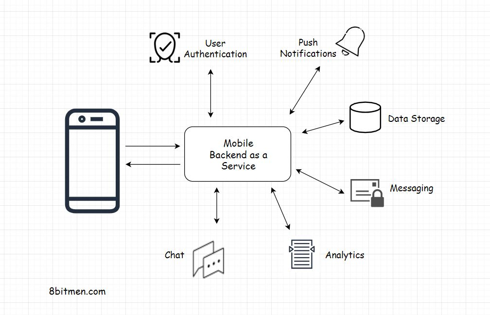
	
4. The above features are taken care by MBaaS (during bootstrapping phase)
	1. Writing and maintaining all those features on our own from bare bones is nearly impossible unless we have a team
5. There are cloud-based freemium services - free tier
	1. These are good for single developers
	2. Deploy the app to cloud
		1. Show it to community
		2. Have initial customers
		3. Get feedback
		4. Pitch it to potential investors (without paying anything to hosting & infrastructure)
6. Cloud service provided indie solo developers to bootstrap business
	1. Also get a foothold in market by just focussing on idea implementation part (letting cloud service to take care of the rest)
7. [Why use the cloud? How a cloud is different than traditional computing?](https://www.8bitmen.com/why-use-cloud-how-is-cloud-computing-different-from-traditional-computing/) - insight
8. MBaaS typically offers API for every feature
	1. API for authentication
	2. API for real-time database
	3. API for messaging
	4. ...
9. App can interact with API and exchange info
10. We also do not have to manage the infrastructure (cuts down time it takes to develop app by notches)
11. Examples:
	1. [Google Firebase](https://firebase.google.com/)
	2. [AWS Amplify](https://aws.amazon.com/amplify/)
	3. [Parse](https://parseplatform.org/) - Facebook (early leader but shut down)

#### When Should You Use a Mobile Backend as a Service? ####
1. MBaaS is great for mobile-only services
	1. Where we do not need or don't already have custom backend up and running for our service
2. **All business logic resides on client** (mobile app)
	1. Fat client
3. Use cases:
	1. Mobile games
	2. Messaging apps
	3. to-do list kind of apps
4. Caveat: If we need new feature and would require business logic on server, we need to design custom backend from bare bones
5. Other approach:
	1. If we start with custom backend and write mobile client (convential way), one can 
		1. Easily customize design of service
		2. Introduce new clients
	2. We need to introduce dedicated API for respective clients
6. Custom backend for mobile app
	
	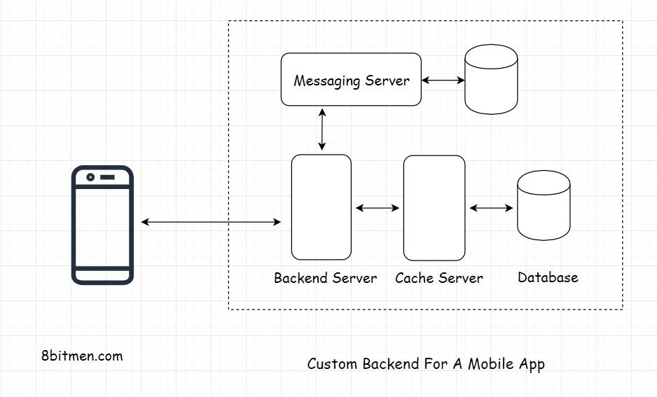
	
7. Hybrid approach:
	1. MBaaS and Custom backend can be setup in same app
		1. If legacy enterprise system needs to be integrated with mobile app
			1. Example: Backing app - needsd legacy enterprise backend to cross verify data entered by user each time say
		2. If we need additional features that custom backend server hosts
	2. MBaaS with Custom Backend

		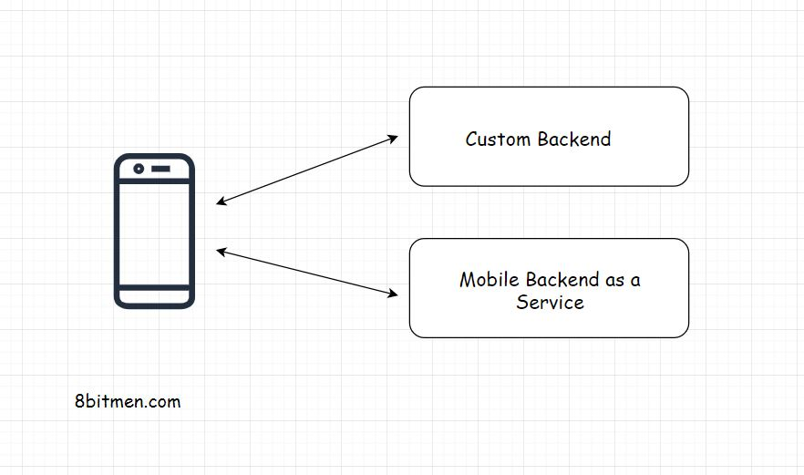
		
8. Cons:
	1. No much control over backend may result in vendor lock-in
		1. Like [parse.com](http://parse.com/) if service provider closes the service
		2. If vendor doesn't upgrade the service (may result in severe security flaws)
		3. If vendor stops adding new features
		4. If vendor's future billing rules are not acceptable

### Epilogue ###
1. contact@8bitmen.com - feedback, suggestions, ...
2. [LinkedIn profile](https://www.linkedin.com/in/shivang-sarawagi-b7b5881b/)
3. [8bitmen.com](http://8bitmen.com/) - Blog
	1. Decentralized web
	2. Software architecture
	3. Architectures of large scale internet services