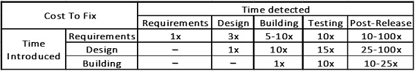
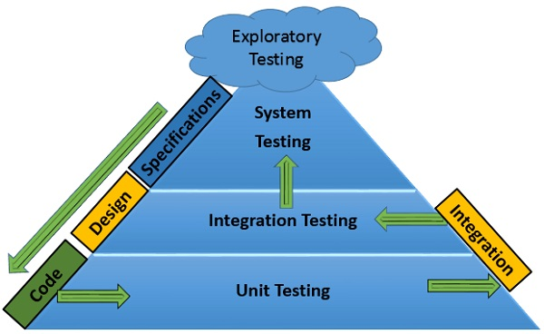
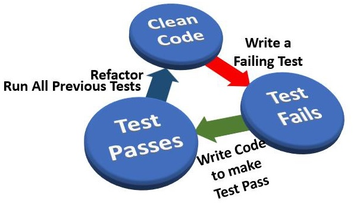
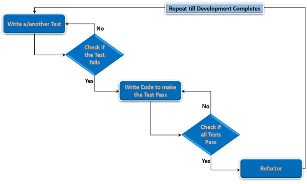
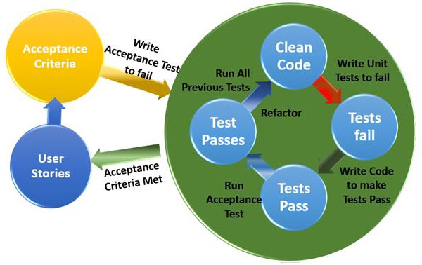
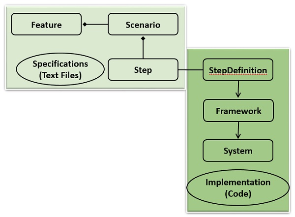

# Behavior Driven Development Tutorial #
## Introduction ##
1. BDD: 
	1. It is a software development process
	2. It is inspired by TDD
	3. It uses examples to illustrate the behavior of the system written in a) readable and b) understandable language for everyone in the development team

## Audience ##
1. Focus: To provide shared processes and shared tools for better communication among software developers and business analysts to collaborate on software development
2. The tutorial is for software developers and business analysts

## Prerequisites ##
1. Basics of testing
2. Hands-on experience of testing tools

## BDD - Introduction ##
1. BDD emerged from TDD
2. "BDD is using examples at multiple levels to generate a shared understanding and surface uncertainty to deliver software that matter"
3. BDD uses examples to illustrate the behavior of the system written in readable and understandable language for everyone.
4. Examples are used as:
	1. Converted into executable specifications
	2. Used as the acceptance tests

### BDD - Key features ##
1. Focus:
	1. Provide shared process and shared tools which promote communication to software developers, business analysts and stakeholders to collaborate on software development.
		1. Aim: deliver product with business value
	2. What as system should and should not do
	3. How the system should be implemented
	4. Provide better readability and visibility
	5. Verifying working of software and if it meets customer's expectations

### Origin of BDD ##
1. If defect is not fixed at right time, the cost increases
2. Example:

	

3. If requirements are understood late into development, the more expensive defect fixing becomes.
4. If requirements are understood late into development, the product may not meet the customer's expectations
5. The approach: Development should
	1. Be Based on requirements.
	2. Be Focussed on requirements throughout the development
	3. Ensure that requirements are met
6. BDD takes care of the above requirements
	1. Derives examples of different expected behaviors of the system
	2. Enables writing examples in a language using business domain terms to ensure easy understanding by everyone involved in the development including customers
	3. Gets examples ratified with customer from time to time by means of converstations
	4. Focuses on customer requirements (examples) throughout the development
	5. Uses examples as acceptance tests.

### BDD Practices ##
1. Main practices of BDD:
	1. Specification by Example (SbE)
	2. Test Driven Development (TDD)

#### Specification by Example ###
1. Uses examples in conversations to illustrate business rules and behavior of software.
2. Enables product owners, business analysts, testers, developers to eliminate common misunderstandings about business requirements.

#### Test Driven Development ###
1. In the context of BDD, turns examples into human readable, executable specs.
2. Developers use the specs as guide to implement increments of new functionality.
3. Result:
	1. Lean code base
	2. Suite of automated regression tests (reduces maintenance cost)

### Agile BDD ##
1. Role of BDD in Agile Software development:
	1. Used to come to common understanding on pending specs
2. Steps:
	1. Developers and product owners collaborate and write pending specs in plain text editor
	2. Product owner specifies behaviors they expect from the system
	3. Developers:
		1. Fill specs with behavior details	
		2. Ask questions based on uderstanding of system
	4. Current system's behavior is considered to check if new features will break existing features

### Agile Manifesto and BDD ##
1. Agile manifesto:
	1. Valueing (left more than on right)
		1. **Individuals and interactions**: over processes and tools
		2. **Working software**: over comprehensive documentation
		3. **Customer collaboration**: over contract negotiation
		4. **Responding to change**: over following a plan
2. Alignment of BDD with Agile manifesto:
	1. *Individuals and interactions over processes and tools*: BDD is about having conversations
	2. *Working software over comprehensive documentation*: BDD's focus is to ease software development that is of business value
	3. *Customer collaboration over contract negotiation*: BDD's focus is on scenarios based on ideas with continuous cummunication with the customer as the development progresses. It is not based on promises.
	4. *Responding to change over following a plan*: BDD's focus is on continuous communication and collaboration that facilitates absorption of changes.

## BDD - Test Driven Development ##
1. Understand TDD to know why BDD was derived from TDD

### Why Testing? ###
1. Purpose of testing: To ensure that the system built is working as expected.
2. Uncovering defect as and when it is introduced and fixing it immediately would be cost effective.
	1. Implementation: Write test cases at every stage of development and testing

		
		
		1. Test last approach: Testing is done after completion of a stage

### Challenges with Test-Last Approach ###
1. Testing has to wait until the stage is completed.
2. Problems: Testing is overlooked because of
	1. Delays in completion of the stage
	2. Tight time schedule
	3. Focus on delivery on time, skipping testing
	4. Unit testing is often skipped because:
		1. They are developers and not testers
		2. Testing is the responsibility of testers
		3. They are efficient in coding and code would not have defects
	5. Result:
		1. Compromising on quality of product
		2. Putting accountability for quality on testers only
		3. High costs in fixing defects, post delivery
		4. Inability to obtain customer satisfaction (loss of business, effecting cedibility)
3. As a result, Test-First approach with focus on testing

### Test-First Approach ###
1. Write test and then code
2. Software development methodologies using test first approach
	1. eXtreme Programming (XP)
	2. Test Driven Development (TDD)
3. Procedure:
	1. Developer designs and writes unit tests for a code module before writing single line of code module.
	2. Developer writes code with the goal of passing the Unit test

### Red-Green-Refactor Cycle ###
1. Steps:
	1. **Step 1**: Consider a code module that is to be written
	2. **Step 2**: Write a test
	3. **Step 3**: Run the test
		1. Test fails (writing test to fail)
	4. **Step 4**: Write minimum code possible to pass the test
	5. **Step 5**: Run all the tests to ensure they still pass (automation of unit test helps)
	6. **Step 6**: Refactor
	7. **Step 7**: Repeat Steps 1 to Step 6 for next code module (each hour should contain many cycles)

	

2. **Red-Green-Refactor** cycle:
	1. **Red**: Write test that fails
	2. **Green**: Write code to pass the test
	3. **Refactor**: Remove duplicate and improve the code to the acceptable standards.

### TDD Process Steps ###

	

### Advantages of TDD ###
1. Developer must understand first the desired result and how to test it before coding
2. Code is finished only when test passes and code is refactored. (Clean code before moving onto the next test)
3. Since the entire suite is run after each refactoring, feedback that each component is still working is constant.
4. Unit test is living documentation which is up to data
5. If defect is found, developer writes a test to reveal defect and then modify code to pass the test and defect gets fixed immediately.
	1. Reduces debugging time
	2. Ensures existing functionality is not broken (because the entire suite is run in each cycle)
6. If developer makes design changes and refactor at any given cycle, the tests previously written ensure that the system is still working. (Maintainable software)
7. Builds confidence in developer to make changes because if change impacts existing functionality, it gets revealed when test suite is run which can be fixed in the same cycle (early).
8. Each successive test run verifies that previous defect fixes are also verified and repitition of the same defect is reduced.
9. Testing before delivery is shortened (because most of the testing is done during development phase)

### Disadvantages of TDD ###
1. Questions faced by developers:
	1. When to test?
	2. What to test?
	3. How to know if a specification is met?
	4. Does the code deliver business value?

### Misconception about TDD ###
1. *TDD is all about testing and test automation*: TDD is a development methodology using test-first approach
2. *TDD does not involve any design*: TDD includes critical analysis and design based on requirements. Design is handled during development.
3. *TDD is only at Unit level*: TDD can be used at integration and system level testing
4. *TDD cannot be used by traditional testing projects*: TDD because popular with XP and used in other Agile methodologies. But can be used in traditional projects as well.
5. *TDD is a tool*: TDD is a development methodology. Every unit test that passes is added to Automation test suite (all tests are run whenever new code is added or existing code is modified and after every refactoring)
	1. Test automation tools supporting TDD facilitate the process
6. *TDD means handling Acceptance tests to the developers*: No

### Acceptance TDD ###
1. Accaptance Test Driven Development (ATDD): It defines acceptance criteria and acceptance tests during the construction of user stories (early in development)
2. Focus: Communication and common understanding among customers, developers and testers
3. Key practices:
	1. Discuss real world scenarios (builds shared understanding of the domain)
	2. Use scenarios to arrive at acceptance criteria
	3. Automate acceptance tests
	4. Focus development on the acceptance tests
	5. Use tests as live spec to facilitate change
4. Benefits:
	1. Unambiguous requirements, no functional gaps
	2. Others understand special cases that developers usually foresee
	3. Acceptance tests guide development

	

### TDD Vs BDD ###
1. Problems faced during TDD
	1. Where to start?
	2. What to test and what not to test?
	3. How much to test in one go?
	4. What to call their tests?
	5. How to understand why a test fails?
2. BDD solves the above problems:
3. Differences between TDD and BDD:
	1. TDD describes how software works
	2. BDD:
		1. Describes how end user uses the software
		2. Fosters collaboration and communication
		3. Emphasis on examples of behavior of system
		4. Aims at executable specs derived from examples 

## BDD - TDD in a BDD Way ##
1. Acceptance Tests:
	1. Represent expected behavior of system
2. Behavior: makes us think in terms of the behavior of the system rather than a test case hence BDD.
	1. BDD is TDD wich vocabulary that focuses on behavior and not tests
3. TDD focuses on how something works, BDD focuses on why we build something at all
4. BDD answers:
	1. Where to start? (outside-in)
	2. What to test? (User stories)
	3. What not to test? (anything else)
5. Story framework for BDD:

		As a [Role]
		I want [Feature]
		so that [Benefit]

	1. When [Feature] is executed, the resulting [Benefit] is to the person playing the [Role]
6. Other questions answered by BDD:
	1. How much to test in one go? (very little-focussed)
	2. What to call their tests? (sentence template)
	3. How to understand why a test fails (documentation)
7. Example framework for BDD

		Given some initial context,
		When an event occurs,
		Then ensure some outcomes.

	1. Starting wil initial context, when a particular event happens, we know what the outcomes should be
8. Examples shows expected behavior of the system. Examples illustrate different scenarios

### Story and Scenarios ###
1. Example: ATM system
	1. Story:

			As a customer,
			I want to withdraw cash from an ATM,
			so that I do not have to wait in line at the bank.
	
	2. Scenarios:
		1. Scenario 1: Account is in credit

				Given the account is in credit
				And the card is valid
				And the dispenser contains cash
				When the customer requests cash
				Then ensure the account is debited
				And ensure cash is dispensed
				And ensure the card is returned

		2. Scenario 2: Account is overdrawn past the overdraft limit

				Given the account is overdrawn
				And the card is valid
				When the customer requests cash
				Then ensure a rejection message is displayed
				And ensure cash is not dispensed
				And ensure the card is returned

2. Though events are same, context is different and hence the outcomes are different

### Development Cycle ###
1. Outside-in approach
	1. **Step 1:** Write a high-level (outside) business value example (using Cucumber of RSpec/Capybara) that goes red. (RSpec produces a BDD framework in the Ruby language)
	2. **Step 2:** Write a lower-level (inside) RSpec example for the first step of implementation that goes red.
	3. **Step 3:** Implement the minimum code to pass that lower-level example, see it go green
	4. **Step 4:** Write the next lower-level RSpec example pushing towards passing Step 1 that goes red.
	5. **Step 5:** Repeat steps 3 and 4 until high-level example in Step 1 goes green
2. Note:
	1. **Red/green** state is a permission status.
	2. If low-level tests are green, there is permission to write new examples or refactor existing implementation.
		1. When refactoring, do not add new functionality/flexibility
	3. If low-level tests are red, there is permission to write code / change code only to make the existing tests go green. Do not write code to pass the next test which does not exist yet. Do not implement features that may be good (if customer has not asked for it).

## BDD - Specifications by Example ##
1. Specification by Example: Set of process patterns that facilitate change in software products to ensure that the right product is delivered efficiently.
2. An approach to define requirements and business-oriented functional tests for software products based on capturing and illustrating requirements using realistic examples.

### Specification by Example - Overview ###
1. Focus: Development and delivery of prioritized, verifiable, business requirements.
2. It supports ubiquitous language that
	1. enables execution of requirements
	2. Is used by everyone in team
	3. Is built by cross functional team
	4. It captures everyone's understanding
3. Used to build automated tests that reflect business domain.
	1. Building the right product and building the product right

#### Purpose of Specification by Example ####
1. Shared understanding is used as single source of truth.
2. Acceptance criteria can be automated which focueses on defect prevention rather than defect detection.
3. Promotes test early to find defects early

### Use of SbE ###
1. It is used to illustrate expected system behavior that describes business value.
	1. Illustration: using concrete and real life examples
2. Examples are used to construct executable requirements that are
	1. Testable without translation
	2. Captured in live documentation
3. Why do we use examples?
	1. Easier to understand
	2. Harder to misinterpret

### Advantages of SbE ###
1. Increased quality
2. Reduced waste
3. Reduced risk of prod defects
4. Focused effort
5. Changes can be made safely
6. Improved business involvement

### Application of SbE ###
1. Complex business or complex organization
2. Does not work well for purely technical problems
3. Does not work well for UI focused software products
4. Can be applied to legacy systems as well

### SbE and Acceptance Testing ###
1. Advantages in terms of Acceptance testing:
	1. Single illustration is used for requirements and testing
	2. Progress of project is based on acceptance tests
		1. Each test tests behavior
		2. Test is passing for a behavior or not
		3. Passing test represents that particular behavior is completed
		4. if p% of x behaviors are finished then the project is p% completed
	3. Testers switch from defect detection to defect prevention and contribute to design of solution.
	4. Automation provides instant understanding of the impact of requirement change on solution. 

#### Specification by Example - What it means for different Roles ####
1. Role of SbE for everyone on team:
	1. Business Analyst:
		1. Requirements are unambiguous and without functional gaps
		2. Developers read specs
	2. Developers:
		1. Understand what is developed
		2. Progress is tracked by counting specs that have been developed correctly
	3. Tester:
		1. Testers understand better what is being developed
		2. Testers can get involved from the begenning and have a role in design
		3. Testers can work towards defect prevention rather than defect detection
	4. Everyone:
		1. Time is saved by identifying errors from the begenning
		2. Quality product is produced from the beginning 

### SbE - A Set of Process Patterns ###
1. Process patterns: (SbE is a set of process patterns)
	1. Collaborative specification
	2. Illustrating specifications using examples
	3. Refining the specification
	4. Automating examples
	5. Validating fequently
	6. Living documentation

### Collaborative Specification ###
1. Objectives:
	1. Various roles in a team should have common understanding and shared vocabulary
	2. Get everyone involved in a project so that they can contribute their different perspectives about a feature
	3. Ensure shared communication and ownership of features
2. Implementation:
	1. Three amigos meeting: BA, QA and developer (others play minor role)

#### During the meeting ####
1. BA presents requirements and tests for a new feature
2. three amigos discuss the new feature and review specs
3. QA and developer identify missing requirements
4. Three amigos
	1. Use ubiquitous language to utilize a shared model
	2. Use domain vocabulary (glossary may be maintained)
	3. Look for differences and conflicts
5. Not jump to implementation details at this point
6. Reach consensus on whether a feature was specified sufficiently
7. Shared requirements and test ownership facilitates quality specs
8. Requirements are specified as scenarios (explicit, unambiguous requirements)
	1. Scenario: example of system behavior from user's perspective

### Illustrating Specification using Examples ###
1. Scenario structure:

		Given <some precondition>
		And <additional preconditions> Optional
		When <an action/trigger occurs>
		Then <some post condition>
		And <additional post conditions> Optional

	1. It is an example of behavior of the system
	2. It is also an acceptance criterion of the system
2. Team can discuss the examples and feedback is incoroporated until there is agreement that examples cover the feature's expected behavior.
3. Ensures good test coverage. 

### Refining the Specification ###
1. Make examples precise. If examples are complex, split them into simpler ones
2. Focus on business perspective and avoid technical details
3. Consider positive as well as nagative conditions
4. Adhere to domain specific vocabulary
5. Discuss examples with customer:
	1. Choose conversations to accomplish this
	2. Consider the examples the customer is interested in. (Only required code can be produced and every possible combination which may not be required can be avoided)
6. For a scenario to pass, all test cases for the scenario must pass
	1. Make specs testable
	2. Tests can include various ranges and data values (boundaries and corner cases)
	3. Tests can include different business rules which result in data changes
7. Specify business rules such as complex calculations, data manipulation/transformation...
8. Include non-functional scenarios in SbE
	1. performance
	2. load
	3. usability
	4. ...

### Automating Examples ###
1. Keep automation layer simple
	1. Just wire spec to system under test (use a tool)
2. Perform testing automation using DSL (Domain Specific Language) and show connection between inputs and outputs.
3. Focus on spec rather than script
4. Make tests precise, easy to understand and testable

### Validating Frequently ###
1. Include example validation in development pipeline with every change (addition/ modification)
2. Use tools to ensure quality
	1. Tools revolve around
		1. Test Early
		2. Test Well
		3. Test Often
3. Execute tests frequently to identify weak links
4. Examples track progress and behavior is complete only if the corresponding test passes

### Living Documentation ###
1. Keep specs as simple and short as possible
2. Organize and evolve specs as work progresses
3. Make docs accessible for all in the team

#### Specification by Example Process Steps ####

	

### Anti-patterns ###
1. Anti-pattern: a pattern in software development that is considered bad programming practice.
	1. They are opposite of design patterns and are undesirable
2. Problems with anti-patterns
	1. No collaboration:
		1. Many assumptions
		2. Building wrong thing
		3. Testing wrong thing
		4. Unaware when code is finished
	2. Unaware when code is finished
		1. Hard to maintain tests
		2. Hard to understand spec
		3. Loss of interest from business representatives
	3. Too detailed or too UI centric examples
		1. Hard to maintain tests
		2. Hard to understand specs
		3. Loss of interest from business representatives
	4. Underestimating effort required
		1. Teams think they have failed and get disappointed early

### Solution to the Problems - Quality ###
1. Keep a watch on anti-patterns
2. Do the following:
	1. Get together to specify using examples
	2. Clean up and improve examples
	3. Write code which specifies examples
	4. Automate examples and deploy
	5. Repeat the approach for every user story
3. Adhere to:
	1. Collaboration
	2. Focusing on what
	3. Focusing on Business
	4. Be prepared

#### Collaboration ####
1. Business people, developers and testers give input from their own perspectives
2. Automated examples ensure that the team has built the correct thing
3. Process is more valuable than tests

#### Focusing on what ####
1. Ask 'what' and focus on:
	1. Do not try to cover all the possible cases
	2. Do not target using different kind of tests
	3. Keep examples simple
	4. Examples must be easily understandable
	5. Tools do not play important role

#### Focusing on Business ####
1. Focus:
	1. keep specs at business intent
	2. Include business during creation and review of specs
	3. Hide details in automation layer

#### Be prepared ####
1. For the following:
	1. Benefits may not be immediately apparent, even when team practices are changed
	2. Introducing SbE is challenging
	3. Requires time and investment
	4. Automated testing does not come free

### Tools ###
1. Not mandatory
2. Tools:
	1. Cucumber
	2. SpecFlow
	3. Fitnesse
	4. Jbehave
	5. Concordion
	6. Behat
	7. Jasmine
	8. Relish
	9. Speclog

## Behavior Driven Development - Tools ##
1. BDD is a development approach and not tool framework
2. BDD tools
	1. Cucumber (Ruby framework)
	2. SpecFlow (.NET framework)
	3. Behave (Python framework)
	4. JBehave (Java framework)
	5. JBehave Web (Java framework with Selenium integration)
	6. Lettuce (Python framework)
	7. Concordion (Java framework)
	8. Behat (PHP framework)
	9. Kahlan (PHP framework)
	10. DaSpec (JavaScript framework)
	11. Jasmine (JavaScript framework)
	12. Squich GUI Tester (BDD GUI Testing tool for JavaScript, Python, Perl, Ruby and Tcl)
	13. Spock (Goovy framework)
	14. Yadda (Gherkin language support for frameworks such as Jasmine (JavaScript framework))

## Cucumber ##
1. For executable specs.
2. Lets team to describe software behaviour in plain text
3. text is in business-readable, domain spec language and serves as doc, automated tests and dev aid.
4. We can speak 40 different languages with Cucumber (English, Chinese, etc...)

### Cucumber - key features ###
1. Key features:
	1. Used for
		1. Executable specs
		2. Test automation
		3. Living documentation
	2. Works with Ruby, Java, NET, Flex or web apps written in any language
	3. Supports succinct tests in tables
	4. Melds requirements, automated testing and documentation into cohesive one (plain text executable spec that validate software)

### SpecFlow ###
1. For .NET.
2. It is open source
3. Uses Gherkin syntax for features
4. Gherkin was introduced by Cucumber
5. Gherkin is maintained [here](https://github.com/cucumber/gherkin)

### Behave ###
1. For Python
2. Works with three types of files in directory `features`
	1. feature files with behavior scenarios
	2. 'steps' directory with Python step impementations for scenarios
	3. Optionally, environmental controls
		1. Code to run before and after steps, scenarios, fetures
3. Features are written using Gherkin named `name.feature`
4. tags attached to feature and scenario are available in environment functions via `feature` or `scenario` object passed to them. An attribute by `tags` which is list of tag names in the order they are in features file
5. Modifications to Gherkin:
	1. Behave can parse standard Gherkin
	2. Behave extends Gherkin to allow lowercase step keywords (more readable)

### Lettuce ###
1. Simple based on Cucumber.
2. Can execute plain text functional descriptions as automated tests for Python
3. For most common tasks in BDD

### Concordion ###
1. Open source tool
2. It is for automating SbE for Java
3. Core features are simple
4. [Extension framework API](https://www.tutorialspoint.com/concordion/index.htm) can be used to add functionality (using Excel spreadsheets as specs, screenshots to output, displaying logging info)
5. Lets us write specs in normal language using paras, tables and proper punctuation and structured langauge using Given/When/Then is not necessary
6. Ported to other languages:
	1. C# (Concordion.NET)
	2. Python (PyConcordion)
	3. Ruby (Ruby-Concordion)

## Behavior Driven Development - Cucumber ##
1. Supports Executable specs, test automation and living documentation
2. BDD expands on SbE.
3. BDD formalizes TDD best practices (Outside-in)
4. Key features of executable specs:
	1. Executable specs:
		1. derived from examples that represent system behavior
		2. Written with collaboration of all (developers, business and stakeholders)
	2. Acceptable tests based on executable specs are automated
	3. Shared and ubiquitous language is used to write executable specs and automated tests so that
		1. Domain specific language is used throughout development
		2. Everyone can speak about the system, its requirements and implementation in the same way
		3. Same terms may be used to discuss the present system in requirements, design docs, code, tests,... (Consistency)
		4. Anyone can read and understand requirements and how to generate more requirements
		5. Changes can be accomodated easily
		6. Live documentation can be maintained
5. Cucumber helps in the above (it ties executable specs with actual code of the system and automated tests)
	1. Customers and developers can work together
6. If acceptance test passes, spec of behavior that it represents is implemented correctly

## Typical Cucumber Acceptance Test ##
1. Example:
	1. Feature - Sign up
		1. Sign up should be quick and friendly
		2. Scenario - Successful sign up
		
				New users should get a confirmation e-mail and be greeted personally.
				Given I have chosen to sign up
				When I sign up with valid details
				Then I should receive a confirmation email
				And I should see a personalized greeting message

2. Observation:
	1. Acceptance tests refer to features
	2. Features are explained by Scenarios
	3. Scenarios consist of steps

## Working of Cucumber ##
1. Command line tool
2. Processes text files containing features and look for scenarios which can be executed against the system.
3. Working:
	1. Uses conventions about how files are named and where they are located (directory structure)
	2. Specs, automated tests and docs are in the same place
	3. Scenario: list of steps that describe the pre-conditions, actions, post-conditions of scenario
		1. If all steps execute without errors, then the scenario is marked as passed
	4. At the end of a run, cucumber will report how many scenarios passed
	5. If something fails, it provides info about what failed
4. Gherkin: language used to write features, scenarios, steps
	1. It is a plain text language with a structure
5. How is Gherkin used?
	1. Cucumber executes files that contain executable specs written in Gherkin
	2. Cucumber needs step definitions to translate plain-text Gherkin steps into actions which will interact with system
	3. When cucumber executes a step, it looks for matching step definition to execute
	4. Step definition: small piece of code with pattern attached to it
	5. Pattern: it is used to link Step definition to all matching steps
		1. Code gets executed when cucumber sees a Gherkin step
	6. Each step is accompanied by a step definition
	7. Steps gather input and delegate to framework that is specific to app domain in order to make calls on framework
6. Cucumber supports many software platforms

## Mapping Steps and Step Definitions ##

	

### Cucumber Implementations ###
1. [Ruby/JRuby](https://cucumber.io/docs/reference/ruby)
2. [JRuby (using Cucumber-JVM)](https://cucumber.io/docs/reference/jvm#jruby)
3. [Java](https://cucumber.io/docs/reference/jvm#java)
4. [Groovy](https://cucumber.io/docs/reference/jvm#groovy)
5. [.NET (using SpecFlow)](https://cucumber.io/docs/reference/specflow)
6. [JavaScript](https://cucumber.io/docs/reference/javascript)
7. [JavaScript (using Cucumber-JVM and Rhino)](https://cucumber.io/docs/reference/jvm#rhino-javascript)
8. [Clojure](https://cucumber.io/docs/reference/jvm#clojure)
9. [Gosu](https://cucumber.io/docs/reference/jvm#gosu)
10. [Lua](https://cucumber.io/docs/reference/lua)
11. [PHP (using Behat)](https://cucumber.io/docs/reference/behat)
12. [Jython](https://cucumber.io/docs/reference/jvm#jython)
13. [c++](https://cucumber.io/docs/reference/cpp)
14. [Tcl](https://cucumber.io/docs/reference/tcl)

### Framework Integration ###
1. [Ruby on Rails](https://cucumber.io/docs/reference/rails)
2. [Selenium](https://cucumber.io/docs/reference/browser-automation#selenium)
3. [PicoContainer](https://cucumber.io/docs/reference/java-di#picocontainer)
4. [Spring Framework](https://cucumber.io/docs/reference/java-di#spring)
5. [Watir](https://cucumber.io/docs/reference/browser-automation#watir)

## Behavior Driven Development - Gherkin ##
1. Gherkin: language used to write **Features**, **Scenarios** and **Steps**.
	1. We can write concrete requirements
2. Concrete requirements:
	1. Examples
		1. Customers should be prevented from entering invalid credit card details
		2. If a customer enters a credit card number that is not exactly 16 digits long, when they try to submit the form, it should be redisplayed with an error message advising them of the correct number of digits.
	2. Second example has no ambiguity, avoids errors, is more testable
3. Example 2 in Gherkin:
	
		Feature: Feedback when entering invalid credit card details
		Background: (true for all scenarios below)
			Given: I have chosen an item to buy
			And I am about to enter my credit card number
		Scenario: Credit card number too short
			When I enter a card number too short
			And all the other details are correct
			And I submit the form
			Then the form should be redisplayed
			And I should see a message advising me of the correct number of digits

## Gherkin Format and Syntax ##
1. Gherkin file: plain text file with .feature as extension
	1. Each line that is not empty must start with a Gherkin keyword and can follow by any text
2. Gherkin keywords:
	1. Feature
	2. Scenario
	3. Given, When, Then, And, But (Steps)
	4. Background
	5. Scenario Outline
	6. Examples
	7. """ (Doc Strings)
	8. | (Data Tables)
	9. @ (Tags)
	10. \# (Comments)
	11. *

### Feature ###
1. Keyword used to describe a software feature and group related scenarios
2. Basic elements:
	1. Feature (keyword)
	2. Name of feature (provided on same line)
	3. Optional description (highly recommended) in multiple lines (between Feature and line that starts with Scenario, Background, Scenario Outline)
3. Feature contain
	1. List of Scenarios
	2. List of Scenario outlines
	3. Optional background
4. Naming a feature file: Take the name of feature, convert it to lowercase and replace spaces with underlines. (convention only)
	1. `feedback_when_entering_invalid_credit_card_details.feature`
5. Feature injection template:
	1. To identify features in system, use the following template
		1. In order to <meet some goal> as a <type of user> I want <a feature>

### Descriptions ###
1. These lines do not start with a keyword
2. These lines follow Feature, scenario, scenario outline (do not start with any keyword)

### Scenario ###
1. Each feature has one or more scenarios which describe the behavior of the system (5 to 20 typical)
2. Pattern:
	1. Describe an initial context
	2. Describe an event
	3. Describe an expected outcome
3. The above is done with steps

		Given - Establish context
		When - Perform action
		Then - Check outcome

4. Example:
	
		Scenario - Withdraw money from account.
			Given I have $100 in my account.
			When I request $20.
			Then $20 should be dispensed.

5. For multiple Given or When steps, used And or But
	1. Example:

			Scenario - Attempt withdrawal using stolen card.
				Given I have $100 in my account.
				But my card is invalid.
				When I request $50.
				Then my card should not be returned.
				And I should be told to contact the bank.

6. Each scenario must make sense and must be able to execute independently of other scenarios
	1. Do not make one scenario depend on success condition of another scenario which must be executed before
	2. Each scenario must have specific context, must execute one thing and text the result
7. Benefits of scenarios:
	1. Simpler and easier to understand tests
	2. Can run only a subset of scenarios and no worry of breaking test set
	3. May be able to run tests in parallel to reduce time taken for tests

### Scenario Outline ###
1. If there needs to be several scenarios which only differ in inputs and outputs, write Scenario outline
	1. Mark variables in outline steps with < and >
	2. Values for variables are given as examples in a table
2. Example: Adding two numbers in a calculator.

		Scenario Outline: Add two numbers.
		Given the input "<input>"
		When the calculator is run
		Then the output should be "<output>"
		Examples
		| input		| output |
		| 2+2		| 4		 |
		| 98+1		| 99	 |
		| 255+390	| 645	 |

3. Scenario outline should be followed by one or more sections of examples (container for a table)
4. Table: has a header row corresponding to variables in Scenario outline steps
	1. Each row will generate a new scenario, filling in the variable values

## Behavior Driven Development - SpecFlow ##
1. SpecFlow:
	1. Open Source project
	2. Features files used store acceptance criterion for features (use cases, user stories) using Gherkin syntax (Gherkin was introduced by Cucumber)

### Feature Elements and SpecFlow ###
1. Key features:
	1. Feature element provides header for feature file.
		1. Feature element: has name and high-level description of feature in app
			1. SpecFlow generates a unit test class for feature element (class name is derived from feature name)
			2. SpecFlow generates executable unit tests from scenarios that represent acceptance criteria
	2. Feature file may contain multiple scenarios used to describe feature's acceptance tests
		1. Scenario has name and can contain multiple steps
		2. SpecFlow generates unit test method for each scenario (method name derived from scenario)

### Multiple Scenaio Steps ###
1. Scenario can have multiple steps.
2. Three types of steps that define the following that make up acceptance test:
	1. preconditions	
	2. actions
	3. verifications
3. Descripton
	1. Steps beging with
		1. Given
		2. When
		3. Then
	2. Subsequent steps of a given type begin with
		1. And
		2. But
	3. Gherkin allows any combination but a scenario has distinct blocks of Given, When and Then statements
	4. Scenario steps can have:
		1. Text
		2. Addtional table - DataTable
		3. Multi-line text - DocString arguments
	5. Scenario steps are primary way to execute custom code to automate app
	6. SpecFlow generates call inside unit test method for each scenario step
		1. SpecFlow runtime performs the call that will execute step definition matching scenario step
	7. Matching occurs at runtime so that generated tests can be compiled and executed even if binding is not yet implemented
	8. Can include tables and multi-line arguments in scenario steps
		1. Used in step definitions
		2. Passed as additional table or string arguments

### Tags ###
1. Markers which can be assigned to features and/ or scenarios.
	1. If a tag is assigned to a feature, it means it is assigned to all scenarios in the feature
2. Syntax: `@<tag-name>`
3. Uses:
	1. Supported by unit test framework
	2. SpecFlow generates categories from tags
	3. Category name is same as tagname without @
	4. Filter and group tests to be executed using unit test categories
		1. Example: tag import tests with `@important` and execute them more frequently

#### Background Elements ####
1. Background language element: allows to specify common pre-conditions for all scenarios in the feature file
	1. Can contain one or more scenario steps executed before any other steps in scenario.
	2. SpecFlow generates a method from background elements (invoked from all unit tests generated for scenarios).

## Scenario Outlines ##
1. Used to define data-driven acceptance tests.
2. Consists of scenario-template specification (scenario with data place holders using <placeholder> syntax) and set of examples that provide values for placeholders
	1. SpecFlow generates row based tests for scenario outlines (if unit test framework supports it)
	2. Otherwise, generates parameterized unit-test logic method for scenario oultine and inidividual unit test method for each example set.
	3. Unit-test method names are derived from scenario outline title and first value of examples (first column)
		1. Choose unique and descriptive parameter as first column
	4. Can introduce arbitrary column in example sets to name tests with more readability
	5. SpecFlow performs placeholder substitution as a seperate phase before matching step bindings
	6. Implementation and parameters in step bindings are independent of whether they are executed as scenario or as scenario outline
		1. Allows specifying further examples in acceptance tests without modifying step bindings

### Comments ###
1. Start with #.
	1. Problem: can be a sign that acceptance criteria is specified wrongly

## BDD - Useful Resources ##
## Useful Links on Behavior Driven Development ##
1. [Behavior Driven Development Wiki](https://en.wikipedia.org/wiki/Behavior-driven_development)

## Useful Books on Behavior Driven Development ##
1. [BDD in Action](https://www.amazon.com/BDD-Action-Behavior-driven-development-lifecycle/dp/161729165X/httpwwwtuto0a-20)
2. [The Cucumber Book](https://www.amazon.com/Cucumber-Book-Behaviour-Driven-Development-Programmers/dp/1934356808/httpwwwtuto0a-20)
3. Learning Behavior-driven Development with JavaScript
4. [Test-Driven Development](https://www.amazon.com/Test-Driven-Development-Kent-Beck/dp/0321146530/httpwwwtuto0a-20)
5. [Clean Code](https://www.amazon.com/Clean-Code-Handbook-Software-Craftsmanship/dp/0132350882/httpwwwtuto0a-20)
6. [The Cucumber For Java Book](https://www.amazon.com/Cucumber-Java-Book-Behaviour-Driven-Development/dp/1941222293/httpwwwtuto0a-20)

## Discuss Behavior Driven Development ##
1. BDD is a software development process that originally emerged from TDD.
2. BDD uses examples to illustrate the behavior of the system.
3. Written in readable and understandable language for everyone involved in development
