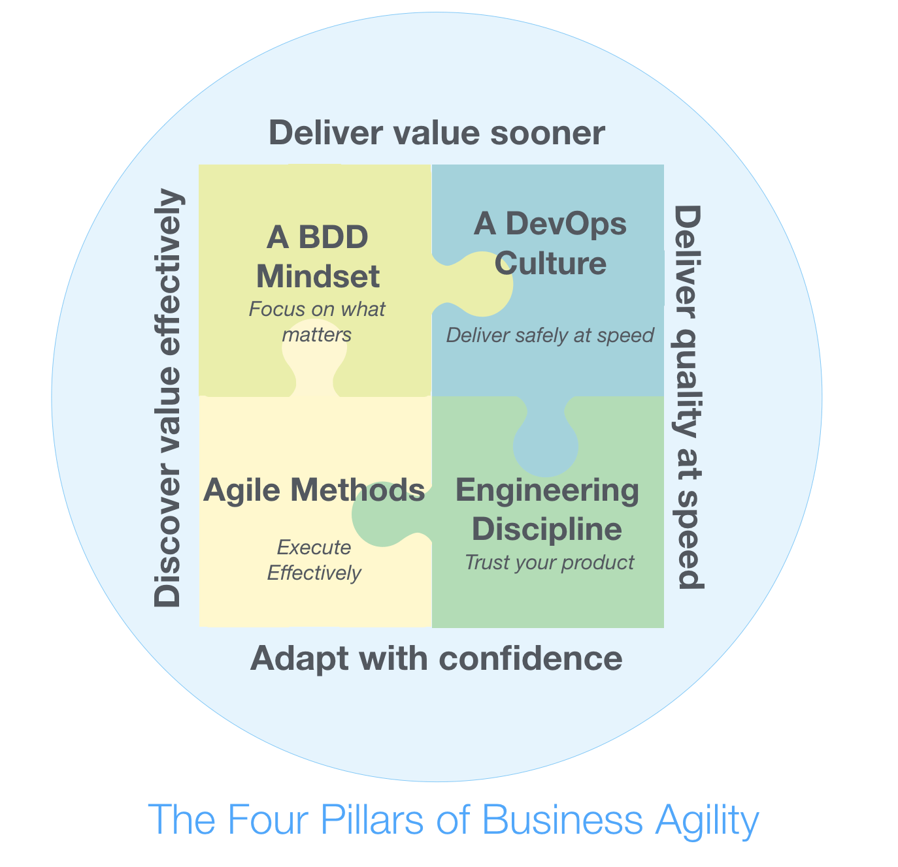

# BDD and the Four Pillars of Business Agility #
1. How to align agile transformation strategy with BDD adoption?
2. Does BDD work with Agile?
3. Behavior Driven Development (BDD)
	1. A collaborative approach that helps teams focus on delivering high-value features sooner
	2. It builds on and extends Agile practices
		1. Sprint planning
		2. Backlog grooming
		3. User stories
		4. Acceptance criteria

	

## The Four Pillars of Business Agility ##
1. Four key enablers:
	1. Agile methods
	2. A BDD mindset
	3. Engineering discipline
	4. A DevOps culture
2. **Agile methods**:
	1. Scrum and kanban - focusses on
		1. Team organization
		2. Team coordination
		3. Change management
	2. Agile framework does not make us deliver faster but it makes it more obvious why we are not
	3. The other three pillars are required to deliver faster
3. **A BDD Mindset**:
	1. Accelerates flow of value and reduces waste and rework by enabling teams to discover and focus on features that really matter ("Building the right thing")
4. **Engineering Discipline**:
	1. Range of practices and techniques that help us build more
		1. Reliable code
		2. Maintainable code
	2. Practices:
		1. TDD
		2. Continuous Integration
		3. Automated Acceptance Testing
		4. Clean coding
5. **DevOps**: Gives teams the ability to deliver features safely to production at speed
	1. "Delivering the thing safely in time"
6. All the areas overlap and interact
	1. BDD Practices: Impact mapping, feature mapping, example mapping
		1. The above play a key role in release and sprint planning and backlog grooming
	2. BDD executable specs: relies on solid engineering practices to keep maintenance costs down and feedback quick and reliable
7. **Improvements in an area in isolation is not enough**
	1. All four pillars must be addressed