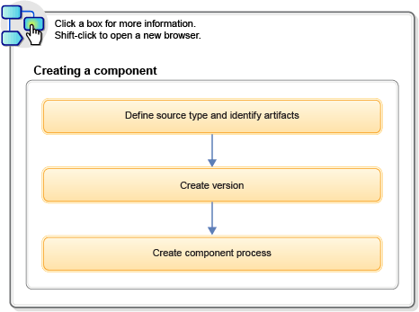

# Urban Code Deploy #
## Installation ##
### Installing the server ###
1. Server:
	1. user interface (to configure app deployments)
	2. workflow engine
	3. security service
	4. artifact repository

#### Installing server in evaluation mode ####
1. Upto 60 days
2. Prerequisite:
	1. JDK
	2. Set `JAVA_HOME`
3. Procedure:
	1. Download installation file [IBM UrbanCode Deploy download document](http://www-01.ibm.com/support/docview.wss?uid=swg2C4000051)
		1. Register
		2. Goto Download using Download Director or if it does not work, goto Download using http
		3. Download **IBM Unbancode Deploy V6.2.4 Trial Multiplatform Multilingual**
	2. Run server installer (may need admin privileges)
		1. `./install-server.bat` on Windows
		2. `./install-server.sh` on Linux and MacOSX
	3. Accept the license
		1. Press F
		2. Press Enter
		3. Press Y and press Enter to accept the license
	4. Specify following information (accept defaults shown in brackets)
		1. **Enter the directory where the IBM UrbanCode Deploy server should be installed**
			1. Default: `C:\Program Files\ibm-ucd\server` on Windows
				1. `/opt/ibm-ucd/server` on Linux
		2. **The specified directory does not exist. Do you want to create it?**
		3. **Please enter the home directory of the JRE/JDK used to run the server**
			1. Specify location of JRE or JDK
		4. **Will this server be used as a node in a high availability cluster?**
			1. Press N (not for evaluation mode)
		5. **Where should the server store application data such as logs, plugins, and keystores?**
			1. Type name of app data directory (must be accessible to server with appropriate permissions)
				1. Default: `/<server-installation-directory>/appdata`
			2. If folder does not exist,
				1. **The sepcified directory for application data doesn't exist. Do you want to create it?**
					1. Press Y
			3. If a non-empty folder exists,
				1. **The specified directory for shared resources already exists and is non-empty. DO you want to use the existing data?**
					1. Press Y
			4. If an empty folder exists,
				1. No prompt
		6. **What host name will users access the web UI at?**
			1. Server listens on all IP addresses available to it (not just this hostname or IP address)
		7. **Do you want the Web UI to always use secure connections using SSL?**
			1. Press N (not for evaluation mode)
		8. **Enter the port on which the Web UI should redirect unsecured HTTP requests**
			1. Default: 8080
				1. Use different port for each product or each instance
		9. **Enter the initial password for the admin user**
			1. username is `admin`
				1. type password again for verification
		10. **Do you want the Server and Agent communication to require mutual authentication? This requires a manual key exchange between the server and each agent. See the documentation for more details**
			1. No. (Not for evaluation mode)
		11. **Enter the RCL server path(s)**
			1. Do not specify connection information for license server (evaluation upto 60 days without license)
		12. **Create database schema**
			1. Press Y
		13. **Enter the database type to use**
			1. Selct derby (for evaluation)
		14. **Enter the database username**
			1. Specify
		15. **Enter the database password**
			1. Specify
		16. On Windows:
			1. **Do you want to install the Server as Windows service?**
				1. Press Y
			2. **Enter a unique service name. No spaces allowed.**
				1. Specify
			3. **Enter the user account name including domain path to run the service**
				1. Specify
					1. Prefix local account with period (`.\localsystem`)
			4. **Do you want to start the service automatically?**
				1. Press Y
			5. **User account password**
				1. Specify
	5. Starting and stopping the server
		1. Go to `<server-installation>\bin` directory
			1. `C:\Program Files\ibm-ucd\server` on Windows
			2. `/opt/ibm-ucd/server` on Linux
		2. Run `run_server.cmd` as admin (Windows)
			1. `./server start` (UNIX or Linux)
		3. Go to `<server-installation>\bin` directory
			1. `C:\Program Files\ibm-ucd\server` on Windows
				1. Run `stop-server.cmd`
			2. `/opt/ibm-ucd/server` on Linux
				1. Run `./server stop`
	6. To import component versions, install a default agent
		1. **System** > **System Settings**
			1. Clear **Use Agent Tag For Integration** under **General Settings**
			2. Select an agent in **Agent for Version Imports** list
			3. Click **Save**
		2. Specify default agent tag:
			1. **Settings** > **System Settings**
				1. Clear **User Agent Tag For Integration** under **General Settings**
				2. Select an agent tag in **Agent Tag for version imports** list
				3. Click **Save**
	7. To increase memory:
		1. Stop server
		2. Open `bin/set_env.cmd` and increase memory in `JAVA_OPTS` parameter
		3. Restart server

## Tutorials ##
### Creation of a simple helloWorld deployment ###
#### Introduction ####
1. Simple app with IBM UrbanCode Deploy
2. Plugins for creation of component and defining app that deploys component to an environment

#### Learning Objectives ####
1. Creation of a component and adding a user-defined property to it
2. Import artifacts to creation of a component version

### Deploying a simple web application ###
#### Introduction ####
1. Deployment of a web app
2. Creation of components, an app that contains the components
3. Deploy the component to an environment
4. Creation of an app and app process
5. Configure environment with resources and apply a user-defined tag to it
6. Run the app process to deploy the component

#### Introduction ####
1. Deployment is done by moving some files on local file system to another location on file system.

#### Prerequisites ####
1. Installation of IBM UrbanCode Deploy server
2. Installation of agent (For Linux Agent)
	1. [Installing IBM UrbanCode Deploy](https://www.ibm.com/support/knowledgecenter/SS4GSP_6.2.4/com.ibm.udeploy.install.doc/topics/install_ch.html?view=kc)
		1. From server, click **Resources** > **Agents**
		2. Click **Install New Agent**
			1. Click **Install Agent** for discoverable agent (has **Installable** status)
		3. Select **SSH** (Not for disovered agent)
		4. Enter IP address of system where you want to install agent in **Target Hosts** field
			1. Type multiple entires in separate lines
		5. Specify:
			1. SSH port address of target system in **SSH Port** field
			2. Select **Use Public Key Authentication** check box to use public key authentication instead of password
			3. Enter agent name in **Agent Name** field
3. Installing Agent (For Windows Agent)
	1. Install an agent on Windows system via command line
		1. Download and extract agent installer to computer
			1. Log in to server
			2. Click **Help** icon
			3. Click **IBM UrbanCode Deploy Agent**
			4. Download and extract the agent file
			5. Open installer directory
			6. Run `install-agent.bat`
			7. Answer the prompts as follows:
				1. **Enter the directory where agent should be installed**
					1. Accept default
				2. **Please enter the home directory of the JRE/JDK used to run this agent**
					1. Accept default
				3. **Will the agent connect to an agent relay instead of directly to the server?**
					1. Default: N
				4. **Enter the hostname to address of the server the agent will connect to**
					1. `localhost`
				5. **Enter the agent communication port for server**
					1. default 7918
				6. **Do you want to configure another failover server connection?**
					1. default: N
				7. **Enable mutual (two-way) authentication with SSL for server/agent JMS communication?**
					1. default: N
				8. **Disable end-to-end encryption for server/agent JMS communication?**
					1. Press Y
				9. **Enable the agent to verify the server HTTPS certificate?**
					1. default: N
				10. **Enter the full web URL for the central IBM UrbanCode Deploy server**
					1. `https://server.example.com:8443`
				11. **Enter the name of this agent**
					1. Accept default
				12. **Enter teams (and types) to add this agent to, separated by commas**
					1. default: None
				13. **Do you want to install the agent as Windows service?**
					1. Press Y 
 
### Creation of and deploying snapshots ###
#### Introduction ####
1. Deployment of web app to new environment
2. Generate snapshot of components and deploy

## Lessons ##
### Configure the helloWorld tutorial system ###
### Lesson 1: Creation of helloWorld component ###
### Lesson 2: Creation of component process ###
### Lesson 3: Creation of an application ###
### Lesson 4: Configure an application environment ###
### Lesson 5: Creation of an application process ###
### Lesson 6: Deploy the component ###

## Modeling software deployment ##
1. Includes configuring components and component processes and adding components to applications.
2. Processes are used to deploy components to environments

### About the task ###
1. Steps:
	1. Import parts of app as components [Creation of Components](https://www.ibm.com/support/knowledgecenter/SS4GSP_6.2.4/com.ibm.udeploy.doc/topics/comp_create.html?view=kc)
	2. Creation of processes that deploy components. [Component processes](https://www.ibm.com/support/knowledgecenter/SS4GSP_6.2.4/com.ibm.udeploy.doc/topics/comp_process.html?view=kc)
	3. Creation of an application to group the components together. [Applications](https://www.ibm.com/support/knowledgecenter/SS4GSP_6.2.4/com.ibm.udeploy.doc/topics/applications_ch.html?view=kc)
	4. Creation of an application process that runs each component process. [Creation of application processes](https://www.ibm.com/support/knowledgecenter/SS4GSP_6.2.4/com.ibm.udeploy.doc/topics/app_process_create.html?view=kc)
	5. Creation of one or more environments to deploy the components. [Deploying applications](https://www.ibm.com/support/knowledgecenter/SS4GSP_6.2.4/com.ibm.udeploy.doc/topics/deployment_ch.html?view=kc)
	6. Take snapshots of working deployments for saving the arrangements and deploy them to other environments. [Creation of snapshots](https://www.ibm.com/support/knowledgecenter/SS4GSP_6.2.4/com.ibm.udeploy.doc/topics/app_snapshot_create.html?view=kc)
2. Workflow:

	

### Components ###
1. Deployable items along with processes that operate on them (deploying say)
	1. Deployable items:
		1. files
		2. images
		3. databases
		4. configuration materials
	2. Artifact sources:
		1. file systems
		2. Build servers (IBM Anthil Pro)
		3. Source control systems
		4. Maven repositories
		5. ...
2. When component is created, source is identified and how aritifacts are brought into UCDeploy.
3. Each component is artifacts from single source
4. Component processes: series of user-defined steps that operate on component or its artifacts.
	1. A component has atleast one process (can have many)
		1. Process:
			1. Can have single step or multiple steps with relationships, branches, process switches
5. UCDeploy has steps for several utility processes (inventory management, workflow control)
	1. Plugins can provide more process steps
6. Import artifacts into CodeStation (artifact repo)
	1. By default complete copy of component is imported into CodeStation
	2. Component is versioned on import
	3. Component version helps deploy appropriate instances only
7. Component Templates: contains processes and config properties

#### Creation of components ####
##### About this task #####
1. Define source type
	1. Name component
	2. Specify agent to import artifacts
	3. Identify type of artifacts and the location
2. Assemble processes
	1. Defines what would be done to artifacts
	2. Steps:
		1. Starting target server
		2. Stopping target server
		3. Move files
		4. Import artifacts
		5. Run utility task
3. Component can get created from component template
4. Component can be imported directly

##### Procedure #####
1. Click **Create Component**
2. Select **Source Configuration Type**
3. Define standard parameters
4. Fields for all source types:
	1. Name: component id throughout product UI
	2. Description: Used in applications A and B helps identify how component is used
	3. Teams: Team that manages component
		1. Previously defined teams and roles are available [Managing security](https://www.ibm.com/support/knowledgecenter/SS4GSP_6.2.4/com.ibm.udeploy.admin.doc/topics/security_ch.html?view=kc)
	4. Template: used for reusing component definition
		1. Source configuration is inherited
		2. Properties are inherited
		3. Process is inherited
		4. Default: None
		5. Template version: displayed when template is selected
			1. Default value: Latest Version
	5. Component Type: is component based on IBM z/OS artifacts?
		1. z/OS: source config controls are disabled [Deploying to the z/OS platform](https://www.ibm.com/support/knowledgecenter/SS4GSP_6.2.4/com.ibm.udeploy.doc/topics/deploying_zos.html?view=kc)
	6. Source Configuration Type: Source type for artifacts (same for all artifacts in a component)
		1. If plugin is selected, fields associated with it are shown
		2. If template has source type, field is locked (value is inherited from template)
		3. [Creation of components from the file system](https://www.ibm.com/support/knowledgecenter/SS4GSP_6.2.4/com.ibm.udeploy.doc/topics/comp_create_filesystem.html?view=kc)
		4. [Creation of components from build integration tools](https://www.ibm.com/support/knowledgecenter/SS4GSP_6.2.4/com.ibm.udeploy.doc/topics/comp_create_buildTools.html?view=kc)
		5. [Creation of components from source-code management systems](https://www.ibm.com/support/knowledgecenter/SS4GSP_6.2.4/com.ibm.udeploy.doc/topics/comp_create_scm.html?view=kc)
	7. Import Versions Automatically: Source location is periodically polled for new versions (new versions are automatically imported).
		1. Polling period by default: 300 seconds (System Settings pane to change it)
		2. If cleared, set versions manually with Versions pane.
	8. Copy to CodeStation: Tamper-proof copy of artifacts are created and stored in embedded artifact repo (CodeStation)
		1. If cleared, only metadata is imported
		2. Check by default
	9. Default Version Type: Full (default) - comprehensive, contains all artifacts
		1. Incremental - contains only artifacts that were modified from pervious version.
	10. Use the system's default version import agent/tag: agent or tag on System Settings page is used to import component artifacts.
		1. Agent must have access to artifact location.
		2. [Server settings](https://www.ibm.com/support/knowledgecenter/SS4GSP_6.2.4/com.ibm.udeploy.admin.doc/topics/settings_system.html?view=kc)
	11. Import new component versions using any agent with the specified tag: use Agent Tag for Version Imports field to designate tag that is used to identify agents that can import artifacts into component.
	12. Inherit Cleanup Settings: Component uses artifact cleanup settings in system settings.
		1. Clear for providing retention values for the component.
			1. Days to Retain Versions: days to retain after they are created. Older components are archived
				1. -1: retain indefinitely
			2. Number of Versions to Retain: Server will retain the specified most recently created component versions.
				1. -1: retain all component versions
				2. 0: default value
	13. Run process after a Version is Created: process is automatically run after versions are imported (automatically and not manually or using REST API or using udclient).
		1. Specify application process and environment
		2. If version import finds multiple versions, process runs only once 

##### Getting started with creation of components #####
1. Components associate deployable items (artifacts) with processes that deploy them.
2. Steps for creation of components:

	

3. Source type: identifies artifacts that component uses.
	1. Defined with source plug-ins
4. Component version: gets created when artifacts are imported into artifact repository CodeStation.
	1. Component can be rolled back to earlier version
5. Component process: contains user-configured steps that operate on components by deploying them.
	1. Provided by automation plug-ins
	2. Can be built using process desing editor or using command-line interface

##### Creation of components from the file system #####
1. Artifacts can be imported from file system
2. Single version or multiple versions can be imported

###### About this task ######
1. Methods
	1. File System: imports all files in specified directory. Versioning is by updating files manually but server does not version
	2. File System (Versioned): Each sub-directory in target directory is a different version of the artifacts.
		1. Server can be set to check for new subdirectories periodically and automatically generate component versions when new subdirectories are detected.
2. Artifacts must be on the same filesystem as UCDeploy

###### Creation of components from a nonversioned file system ######
1. Store artifacts in a folder and select **File System** source
2. **About this task**
	1. Versions must be built manually
3. **Procedure**
	1. **Components** > **Create Component**
	2. Specify a name and description
	3. In **Teams**, specify access information for new component
	4. Select template from **Template** list
		1. Source configuration, properties and processes are inherited from template
	5. In **Source Configuration Type** list, select **File System**
	6. Specify the following:
		1. **Base Path**: Specify path to directory that contains the artifacts
		2. **Always Use Name Pattern**: new versions are automatically named according to pattern in the **Version Name Pattern** field.
			1. If cleared, name has to be specified each time
		3. **Version Name Pattern**: Specify pattern for each version name.
			1. `mycomp_${version}`
			2. Check **Always Use Name Pattern**
	7. Next Version Number:
		1. Version number for next version
		2. Check **Always Use Name Pattern**
	8. Extensions of files to Convert
		1. List of file extensions to be converted.
			1. Files are converted to default or system character set (of system that has agent installed)
			2. Syntax: `txt,log,ini,sh`
	9. Import Versions Automatically
		1. No effect on this source configuration type
		2. Import new versions manually
	10. Copy to CodeStation
		1. Builds tamper protected copies of artifacts and stores them in embedded artifact management system (CodeStation).
			1. If cleared, only meta-data about artifacts is imported.
		2. Default setting: Components copy to CodeStation by default
	11. Default Version Type:
		1. Full: Each version is comprehensive and contains all artifacts
		2. Incremental: Each version contains subset of artifacts
	12. Use the system's default version import agent/tag
		1. Agent/tag specified on System settings page is used to import component artifacts.
		2. Agents must have access to artifacts
	13. Import new component versions using a single agent
		1. Use Agent for Version Imports field (identifies agent used to import artifacts)
		2. To import artifacts from server, install agent in same location and specify the agent
	14. Import new component versions using any agent with the specified tag
		1. Select Agent Tag for Version Imports
	15. Use Default Artifact Cleanup Settings
		1. Use component version cleanup settings specified in System settings page.
		2. If cleared, specify how long component must be kept
	16. Run Process after a version is created
		1. When versions are imported, process is run automatically
			1. Not for manual imports
			2. Not for import using REST API
			3. Not for import using udclient
		2. If multiple versions are found on automatic import, process is run only once
	17. Click **Save**
	18. Import first version of component
		1. Go to **Versions** tab
		2. Click **Import New Versions**
		3. Specify name, click **Save** (new version is included in list of versions)
			1. Click version and look at the artifacts
	19. Click **Import New Versions** again to import future versions and specify name
4. **Results**
	1. New component is listed
5. **What to do next** 
	1. Creation of component processes

###### Creation of components from a versioned file system ######
1. Add directories with subdirectories that represent versions of artifacts.
2. Select **File System(Versioned)**
3. **Before you begin**
	1. Example arrangement of artifacts
		1. myComponent/
			1. 1.0/
				1. fileA.txt
				2. fileB.txt
			2. 2.0/
				1. fileA.txt
				2. fileC.txt
			3. experimental/
				1. fileA.txt
				2. fileD.txt
4. **Procedure**
	1. Click **Components** > **Create Component**
	2. Specify name and description
	3. In **Teams**, specify access info for new component
	4. Select **Template** from list
		1. Component inherits source config, properties, processes
	5. In **Source Configuration Type** list, select **File System (Versioned)**
	6. Specify following:
		1. **Base Path**
			1. Path to directory that contains artifacts
			2. Subdirectory is considered a distinct version
			3. Subdirectory with recent timestamp is latest version
		2. **Preserve Execute Permissions**
			1. For Linux and UNIX, retains execute permissions for each file
		3. **Text File Extensions**
			1. List of file extensions to be converted into default or system character set where agent is located.
				1. `txt,log,ini,sh`
		4. **Import Versions Automatically**
			1. Checks for new versions periodically and imports new versions automatically.
			2. Manual import:
				1. **Components** > **selected component** > **Versions**
				2. Click **Import New Versions**
		5. **Copy to CodeStation**
			1. Tamper protected copies of artifacts are stored in embedded artifact management system (CodeStation).
			2. If cleared, only metadata about artifacts is imported.
			3. Default setting: **Components copy to CodeStation by default**
		6. **Default Version Type**
			1. **Full**: each version contains all artifacts
			2. **Incremental**: each version contains a subset of artifacts
		7. **Use the system's default version import agent/tag**
		8. **Import new component versions using a single agent**
		9. **Import new component versions using any agent with the specified tag**
			1. Use **Agent Tag for Version Imports** to identify tag used to select agents to import artifacts into component
		10. **Use Default Artifact Cleanup Settings**
			1. **Use Default Artifact Cleanup Settings**: for settings in System Settings page
			2. If cleared, specify how long to keep component versions
		11. **Run Process after a Version is Created**
	7. Click **Save**
5. **Results**
	1. Versions tab shows available versions
	2. If **Import Versions Automatically** is selected, versions are displayed automatically
	3. Click **Import New Versions** to show available versions.
	4. Click a component version to see artifacts
6. **What to do next**
	1. Creation of component process

##### Creation of components from source-code management systems #####
###### Creation of components from Git ######
1. **Before you begin**:
	1. Install git on UCDeploy server.
	2. Component requires specifying path to Git executable file
2. **Procedure**
	1. Specify **Source Configuration Type** as **Git**
	2. Specify following parameters:
		1. **Repository URL**: `https://git.example.com/myproject.git`
		2. **Branch**: name of branch
		3. **User Name**: If using HTTPS protocol
		4. **Password**: If using HTTPS protocol
		5. **Watch for tags**: when selected, tags are used as basis for new component versions
		6. **Includes**: List of file patterns to include in the component.
		7. **Excludes**: List of file patterns to excelude from the component.
			1. Seperator is carriage return
		8. **GIT Path**: Path to Git executable file on UCDeploy server.
			1. If specified in PATH, just mention the name git (else `/usr/bin/git`)
		9. **Preserve Execute Permissions**:
			1. Preserves execute permissions for each file (Linux/UNIX)
		10. **Extensions of files to convert**:
			1. files specified would be converted into another character set (to default or system character set of system where agent is located)
				1. Example: `txt,log,ini,sh`
		11. **Import Versions Automatically**
			1. New versions are checked for periodically and imports them automatically.
			2. For manual import: **Components** > **selected component** > **Versions** and click **Import New Versions**
		12. **Copy to CodeStation**: Tamper-protected copies of artifacts are created and stored in embedded artifact management system (CodeStation).
			1. If cleared, only meta-data about artifacts is imported.
			2. Default setting: **Components copy to CodeStation by default** setting
		13. **Default Version Type**: **Full** - Each version is comprehensive and contains all artifacts
			1. **Incremental**: Each version contains a subset of artifacts
		14. ...
3. **Results**:
	1. New component is listed on Components page.
		1. If **Import Versions Automatically** was selected, versions are displayed automatically
		2. Click **Import New Versions** to show available versions.

###### Creation of components from Rational Asset Manager ######
###### Creation of components from Subversion ######
1. **Before you begin**
	1. Install SVN client
		1. `sudo apt-get install subversion`
2. **Procedure**
	1. Click **Components**
	2. Click **Create Component**
	3. Specify a name and description
	4. In **Teams** specify access information for new component
	5. Select a **Template**
	6. In **Source Configuration Type** list, select **Subversion**
	7. Specify following parameters:
		1. **Respository URL**: `http://svn.example.com/svn/myrepository`
		2. ...
		3. **SVN Path**: Path to svn executable file in UCDeploy server.
			1. If specified in PATH, just give svn else specify full path as `/usr/bin/svn`
		4. ...
		5. **Proxy Hostname**: Hostname or IP address of proxy server, if connecting to SVN repo through proxy server
		6. **Proxy Port Number**: Port number used by proxy server for client connections
		7. **Proxy Username**: If proxy server needs authentication
		8. **Proxy Password**: If proxy server needs authentication
		9. ...
3. **Results**:
	1. New component is listed on Components page
4. **What to do next**:
	1. Creation of component processes

###### Creation of components from Rational ClearCase UCM ######
###### Creation of components from Microsoft Team Foundation Server SCM ######

##### Creation of components from build integration tools #####
###### Creation of components from AntHillPro ######
###### Creation of components from UrbanCode uBuild ######
1. **Before you begin**
	1. Install agent that has access to UrbanCode uBuild server
2. **Procedure**
	1. Click **Components** and click **Create Component**
	2. Specify name and description
	3. ...
	4. Specify following parameters:
		1. **ubuild Url**: `https://Buildrepo.example.com`
		2. **User**: username of uBuild-credentialed user
		3. **Password**: Password of uBuild-credentialed user
		4. **Project**: name of uBuild project (similar to UCDeploy component)
		5. **Build Process**: Name of build process that contains builds to import
		6. **Status**: Status that build life must have before it can be imported. (server imports build lives that contain this status)
		7. **Artifact Sets**:
			1. If **Copy to CodeStation** is checked, list of artifact sets to resolve in CodeStation (each item in newline)
		8. ...

###### Creation of components from Apache Maven ######
1. **Before you begin**
	1. Install agent that has Apache Maven repository
2. **Procedure**
	1. ...
	2. Select **Maven** in **Source Configuration Type** list
	3. Specify following parameters:
		1. **Repository URL**: URL of Maven repository
			1. `https://MyMavenRepo.MyCompany.com/repository/`
		2. **HTTP Proxy Host**: Proxy host for Maven repository
		3. **HTTP Proxy Port**: Proxy port for Maven repository (required if we supply Proxy Host)
		4. **HTTP Proxy Username**: Username for account that can access HTTP proxy
		5. **HTTP Proxy Password**: Password for account that can access HTTP proxy
		6. **User**: username for Maven-credentialed user
		7. **Password**: Password for Maven-credentialed user
		8. **Group ID**: name of groupID as defined in pom.xml
		9. **Artifact ID**: Name of artifactID defined in pom.xml (name of unversioned JAR file)
		10. **Maven Qualifier**: Appended to filename after version number
		11. **File Extension**: File extension of file type to import
		12. **Latest Build Count**: Number of builds to import. Default is 1
		13. **Version Name Pattern**: Range of build versions to import.
			1. Examples: `1.1.*`, `1.2.*`, `(1.[0-9]+).*`
			2. Number of versions imported is equal to the value in **Latest Build Count** for each matching version
		14. ...
	4. Click **Save**

###### Creation of components from Microsoft Team Foundation Server ######
###### Creation of components from TeamCity ######

##### Creation of component versions with the command-line client #####
1. `udclient` is used when no source configuration type exists for the external tool

###### Before you begin ######
1. Install the client:
	1. Set `JAVA_HOME`
	2. If >= v6.1, command-line client is installed on agents automatically
		1. `agent_install/opt/udclient`
2. Commands for:
	1. addAgentPoolToTeam
		1. Example: 
			
				udclient -username jsmith -password passwd -weburl https://myserver.example.com:8443 addAgentPoolToTeam -agentPool MyAgentPool -team MyTeam

		2. Example: REST API

				PUT https://{hostname}:{port} /cli/agentPool/teams?{parameters}

			1. `agentPool`: name or ID of agent pool
			2. `team`: Name or ID of the team
			3. `type`: Name of type to use. (blank if standard agent pool)

					curl -k -u jsmith:passwd "https://myserver.example.com:8443/cli/agentPool/teams?agentPool=myAgentPool&team=MyTeam" -X PUT

	2. addAgentToPool
	3. addAgentToTeam
	4. addApplicationToTeam
	5. addComponentTemplateToTeam
	6. addComponentToApplication
	7. addComponentToTeam
	8. addEnvironmentBaseResource
	9. addEnvironmentProperty
	10. addEnvironmentToTeam
	11. addGroupToTeam
	12. addProcessToTeam
	13. addResourceToTeam
	14. addStatusToSnapshot
	15. addTagToAgent
	16. addTagToApplication
	17. addTagToComponent
	18. addTagToResource
	19. addUserToGroup
	20. addUserToTeam
	21. addVersionFiles
	22. addVersionLink
	23. addVersionStatus
	24. addVersionToSnapshot
	25. archiveVersion
	26. cancelWorkflow
	27. closeTask
	28. copyResource
	29. copyVersion
	30. createAgentPool
	31. createApplication
	32. createApplicationFromTemplate
	33. createApplicationProcess
	34. createAuthToken
	35. createBlueprintDesignerIntegration
	36. createComponent
	37. createComponentProcess
	38. createComponentTemplate
	39. createEnvironment
	40. createEnvironmentFromTemplate
	41. createGenericProcess
	42. createGroup
	43. createManyVersions
	44. createResource
	45. createResourceTemplate
	46. createSnapshot
	47. createSnapshotOfEnvironment
	48. createStatus
	49. createTeam
	50. createUser
	51. createVersion
	52. deleteAgent
	53. deleteAgentPool
	54. deleteAgentProperty
	55. deleteAllDesiredInventoryVersions
	56. deleteBlueprintDesignerIntegration
	57. deleteComponentVersionPropDef
	58. deleteEnvironment
	59. deleteGroup
	60. deleteRedundantDesiredInventoryVersions
	61. deleteResource
	62. deleteResourceProperty
	63. deleteSnapshot
	64. deleteStatus
	65. deleteTeam
	66. deleteUser
	67. deleteVersion
	68. downloadVersionArtifacts
	69. exportDetailedGroup
	70. exportGroup
	71. forceRenameAgent
	72. getAgent
	73. getAgentPool
	74. getAgentPools
	75. getAgentProperty
	76. getAgentPrototypes
	77. getAgents
	78. getAllApplicationProcessesForApplication
	79. getAllTeams
	80. getAllUsersInRoleForTeam
	81. getAllUsersWithEmail
	82. getApplication
	83. getApplicationProcess
	84. getApplicationProcessExecution
	85. getApplicationProcessRequest
	86. getApplicationProcessRequestStatus
	87. getApplicationProcessUnfilledProperties
	88. getApplicationProperties
	89. getApplicationProperty
	90. getApplications
	91. getApplicationsProcessRequests
	92. getApplicationsProcessRequestsCount
	93. getApprovalTasks
	94. getBlueprintNodePropertiesTemplate
	95. getBlueprintsInApplication
	96. getComponent
	97. getComponentEnvironmentProperties
	98. getComponentProcess
	99. getComponentProcessRequest
	100. getComponentProcessRequestCount
	101. getComponentProcessRequests
	102. getComponentProperties
	103. getComponentProperty
	104. getComponentTemplates
	105. getComponentVersionPropDefs
	106. getComponentVersions
	107. getComponentsInApplication
	108. getEnvironment
	109. getEnvironmentBaseResources
	110. getEnvironmentProperties
	111. getEnvironmentProperty
	112. getEnvironemntsInApplication
	113. getFirstUserWithEmail
	114. getLatestSnapshotForEnvironment
	115. getOverlappingArtifacts
	116. getResource
	117. getResourceProperties
	118. getResourceProperty
	119. getResourceTemplate
	120. getResourceTemplateChildren
	121. getResources
	122. getResourcesWithComponentVersion
	123. getSnapshot
	124. getSnapshotConfiguration
	125. getSnapshotVersions
	126. getSnapshotsInApplication
	127. getStatus
	128. getStatusList
	129. getStatuses
	130. getSystemConfiguration
	131. getSystemProperties
	132. getSystemProperty
	133. getTagsOnAgent
	134. getTagsOnApplication
	135. getTagsOnResource
	136. getTeam
	137. getUser
	138. getUserByEmail
	139. getVersionId
	140. getVersionLink
	141. getVersionLinks
	142. getVersionProperties
	143. importGroup
	144. importLdapUser
	145. importVersions
	146. installAgent
	147. listAritfacts
	148. lockSnapshotConfiguration
	149. lockSnapshotVersions
	150. login
	151. logout
	152. moveResource
	153. provisionEnvironment
	154. removeAgentFromPool
	155. removeAgentFromTeam
	156. removeAgentPoolFromTeam
	157. removeApplicationFromTeam
	158. removeComponentFromTeam
	159. removeComponentTemplateFromTeam
	160. removeEnvironmentBaseResource
	161. removeEnvironmentFromTeam
	162. removeEnvironmentProperty
	163. removeProcessFromTeam
	164. removeResourceFromTeam
	165. removeTagFromAgent
	166. removeTagFromApplication
	167. removeTagFromComponent
	168. removeUserFromGroup
	169. removeVersionFromSnapshot
	170. removeVersionLink
	171. removeVersionStatus
	172. removeApplicationProcessRequest
	173. requestApplicationProcess
	174. restartAgent
	175. setAgentProperty
	176. setApplicationProperty
	177. setComponentEnvironmentProperty
	178. setComponentProperty
	179. setComponentVersionPropDef
	180. setEnvironmentProperty
	181. setResourceProperty
	182. setSystemConfiguration
	183. setSystemProperty
	184. setVersionProperty
	185. shutdownAgent
	186. testAgent
	187. updateResource
	188. updateResourceTemplate
	189. updateTeam
	190. updateUser
	191. upgradeAgent

###### About this task ######
###### Procedure ######
1. ...
2. Select **None** in **Source Configuration Type** field
3. Clear **Import Versions Automatically**
	1. Components can be created using `udclient` as well
4. In scripts of component, add code that calls `udclient` commands for creation of component version and upload artifacts to UCDeploy server
	1. Call `createVersion` for creation of new version of component
		1. Version name is set to timestamp of build.
		2. `${udclient.weburl}`, `${udclient.username}` and `${udclient.password}` represent URL of server and user name and password for server
		3. Script:

				<exec executable="/bin/bash" outputproperty="mycomponent.component.output">

					<arg value="/opt/udclient/udclient" />
		
					<arg value="-weburl"/>
					<arg value="${udclient.weburl}"/>

					<arg value="-username"/>
					<arg value="${udclient.username}"/>

					<arg value="-password"/>
					<arg value="${udclient.password}"/>

					<arg value="createVersion"/>

					<arg value="-component"/>
					<arg value="mycomponent"/>

					<arg value="-name"/>
					<arg value="${buildTimestamp}"/>

				</exec>

		4. Use `createVersion` for new version

				<exec executable="/bin/bash" outputproperty="mycomponent.component.output">
					
					<arg value="/opt/udclient/udclient"/>
				
					<arg value="-weburl"/>
					<arg value="${udclient.weburl}"/>

					<arg value="-username"/>
					<arg value="${udclient.username}"/>

					<arg value="-password"/>
					<arg value="${udclient.password}"/>

					<arg value="createVersion"/>

					<arg value="-component"/>
					<arg value="mycomponent"/>

					<arg value="-name"/>
					<arg value="${buildTimestamp}"/>

				</exec>

		5. Use `addVersionFiles` to upload artifacts to component version.

				<exec executable="/bin/bash">
					<arg value="/opt/udclient/udclient"/>

					<arg value="-weburl"/>
					<arg value="${udclient.weburl}"/>

					<arg value="-username"/>
					<arg value="${udclient.username}"/>

					<arg value="-password"/>
					<arg value="${udclient.password}"/>

					<arg value="addVersionFiles"/>

					<arg value="-component"/>
					<arg value="mycomponent"/>

					<arg value="-version"/>
					<arg value="${buildTimestamp}"/>

					<arg value="-base"/>
					<arg value="${destdir}"/>
				</exec>

		6. Use `addVersionLink` to add links from version to external build resources

				<exec executable="/bin/bash">
					<arg value="/opt/udclient/udclient"/>

					<arg value="-weburl"/>
					<arg value="${udclient.weburl}"/>

					<arg value="-username"/>
					<arg value="${udclient.username}"/>

					<arg value="-password"/>
					<arg value="${udclient.password}"/>

					<arg value="addVersionLink"/>

					<arg value="-component"/>
					<arg value="mycomponent"/>

					<arg value="-version"/>
					<arg value="${buildTimestamp}"/>

					<arg value="-linkName"/>
					<arg value="Exteucrnal build result"/>

					<arg value="-link"/>
					<arg value="http://build.example.com/projects/mycomponent/${buildResultUUID}"/>
				</exec>

###### Results ######

##### Importing components #####
1. Useful if we have multiple UCDeploy servers (quickly move or update components)

###### About this task ######
1. Importing can build new or update existing components
2. When components, applications, processes or templates are exported and imported on a different computer, same versions of same plug-ins must be installed on both computers

###### Procedure ######
1. Open **Components** > **Import Components**
2. Choose JSON file that contains component definition (must have been created from a machine with same version of IBM Urban Code Deploy)
3. To upgrade existing components, select **Upgrade Component** check box. (otherwise, new component gets created)
	1. If component name in JSON matches existing component name, parameters are updated.
	2. New versions of Processes and properties get created if they exist
4. If imported component was created from a template, use **Component Template Upgrade Type** list
	1. Template must be on importing server
	2. To use imported components' template, select **Use Existing Template**
		1. New components are exact copies of imported components
		2. It contains pointer to imported components' template
	3. For creation of templates, select **Create Template**. New components are exact copies of imported components. They contain pointer to newly created template (based on imported components' template)
		1. For upgrade, a template is created
	4. To ensure server uses newly imported template, select **Fail if Template Exists**.
		1. If server contains template, import action fails
	5. To ensure template is not on importing server, select **Fail if Template Exists**.
	6. When a component gets created, a new template also gets created (unless the template already exists)
	7. To ensure that template is on importing server, select **Fail if Template Does Not Exist**
		1. If template already exists, components are not imported
	8. **Upgrade if Exists**: component is created and template on the importing server is upgraded. New template gets created if template does not exist
5. If processes of imported component call generic processes, use **Generic Process Upgrade Type** list to specify how generic processes are upgraded or created.
	1. Result of import process has different result based on existence of generic processes
	2. To import component without updating generic processes:
		1. Select **Use Existing Generic Process**
			1. If a generic process does not exist, a generic process gets created.
			2. If a generic process with that name exists, another version is not created
		2. If new generic process has to be created, select **Create Generic Process**
			1. A copy of generic process is always created. (if generic process with the name exists, a unique string is added to new generic process's name)
		3. For fresh installation and to ensure that generic processes are not on importing server, select **Fail if Generic Process Exists**.
			1. When a component gets created, both component and generic processes are created unless generic process already exists (import action fails).
			2. Upgrade fails if imported components' generic process exists.
		4. To ensure that generic processes are on importing server, select **Fail if Generic Process Does Not Exist**.
			1. New components and new generic processes are created unless generic processes do not exist (import action fails)
		5. Select **Upgrade if Generic Process Exists** to upgrade generic processes
			1. Components are created with new versions of generic processes on importing server.
			2. If generic processes do not exist, processes are created.
6. Click **Submit**

##### Exporting components #####
1. Exporting is useful if we have multiple IBM UrbanCode Deploy Servers and must quickly move or update components

###### About this task ######
1. Export operation generates a JSON file with source config info, properties, processes
2. When importing to a different computer, same plugins of same versions must be installed on both computers.

###### Procedure ######
1. On **Components** pane, select check boxes next to one or more components.
2. At the top of table, click **Actions** and click **Export**

###### What to do next ######
1. Load the file into text editor or save it.
2. Import the components to another server that uses the same version of IBM UrbanCode Deploy.

#### Component processes ####
1. It is a series of user defined steps that operate on a component's artifacts
2. Each component can have one or more processes
3. Process steps get created from a menu of standard steps
4. Utility processes:
	1. Inventory management
	2. Workflow control
5. More process steps can be provided by plug-ins
	1. UCDeploy provides plug-ins for common processes (downloading and uploading artifacts, retrieving environment info)
	2. See doc of individual plugin to know the steps provided by each plugin [IBM UrbanCode Deploy Plug-ins](https://developer.ibm.com/urbancode/plugins/ibm-urbancode-deploy)
6. Frequently used processes can be saved as templates

#### Component versions ####
1. Whenever component's artifacts are imported into repository (CodeStation), separate version is stored.
2. Versions can be assigned automatically by IBM UrbanCode Deploy
3. Versions can be applied manually
4. Versions can come from build server
5. Each time artifacts are modified and imported, a new version gets created.
	1. There may be many versions in CodeStation and each version is unique
	2. Artifacts can be imported automatically or manually 
6. Version can be full or incremental
	1. full: contains all component artifacts
	2. incremental: contains only artifacts that are different from previous version
		1. Import only the changed artifacts (do not upload unchanged artifacts)
7. Why store artifacts in CodeStation?
	1. tamper-proof storag
	2. Ability to review and validate artifacts with IBM UCDeploy UI
		1. We can limit CodeStation to only have references to artifacts
8. Do not name the artifact as `latest`, `latestVersion` or `newest`. They are reserved for most recently created version for certain CLI commands (requestApplicationProcess, createSnapshot)

##### Tracking environment inventory for components #####
1. Click component and go to **Usage** tab (for tracking environment inventory for the component)

###### About this task ######
1. Calendar shows deployment request history, state of selected component
2. Bars represent different versions of the component
	1. When different versions of component were installed to that environment (or when there was an attempt)

##### Importing versions manually #####
1. Used when auto import of versions does not work

###### About this task ######
###### Procedure ######
1. Display version pane:
	1. **Components** > **selected component** > **Versions**
	2. Click **Import New Versions**

###### Results ######

##### Cleaning up component versions #####

##### Restoring archived component versions #####
##### Deleting versions #####

#### Component properties ####
#### Creation of component manual tasks ####
#### Component templates ####
#### Component change logs ####
#### Deleting components ####

### Resources ###
#### The resource tree ####
#### Resource groups ####
#### Getting started with creation of resources ####

#### Modifying the resource tree ####

##### Creation of groups #####
###### About this task ######
###### Procedure ######
###### What to do next ######

##### Creation of agent-type and agent pool-type resources #####
###### About this task ######
###### Procedure ######
###### What to do next ######

##### Creation of component-type resources #####
###### About this task ######
###### Procedure ######
###### What to do next ######

##### Adding agents to resource groups #####
###### Procedure ######

##### Moving and copying resources #####
###### About this task ######
###### Procedure ######

##### Deleting resources #####
###### Procedure ######

##### Comparing and synchronizing resources #####
###### About this task ######
###### Procedure ######

##### Synchronizing resources from a template #####
###### About this task ######
###### Procedure ######

##### Adding resources from a template #####
###### About this task ######
###### Procedure ######

#### Importing resources from WebSphere Application Server ####
##### Before you begin #####
##### About this task #####
##### Procedure #####
##### Results #####
##### What to do next #####

#### Importing resources from WebSphere Portal ####
##### Before you begin #####
##### About this task #####
##### Procedure #####

#### Defining default user impersonation credentials ####
##### About this task #####
##### Procedure #####

#### Resource templates ####
##### Creation of resource templates #####
###### Procedure ######
###### Example ######

##### Defining a new template from the resource tree #####
###### Procedure ######

#### Agents ####
##### Agent prototypes #####

#### Agent relays ####
##### Example #####

### Applications ###
#### Environments ####
#### Processes ####
#### Snapshots ####

#### Getting started with creation of applications ####

#### Creation of applications ####
##### Before you begin #####
##### About this task #####
##### Procedure #####
##### What to do next #####

##### Importing applications #####
###### About this task ######
###### Procedure ######

##### Exporting applications #####
###### About this task ######
###### Procedure ######
###### What to do next ######

#### Building and deploying mobile applications ####
##### Before you begin #####
##### About this task #####
##### Procedure #####
##### Results #####
##### What to do next #####

##### Building mobile applications #####
###### Build computer resources ######
###### Build scripts ######
###### Rational Team Concert Build ######

##### Adding mobile artifacts to IBM UrbanCode Deploy #####
###### Procedure ######

##### Configuring the MobileFirst Platform Foundation Server #####
###### About this task ######
###### Procedure ######

##### Deploying mobile applications #####
###### Before you begin ######
###### About this task ######
###### Example ######

##### Rolling back mobile applications #####
###### About this task ######

#### Application environments ####
##### Creation of environments #####
###### Before you begin ######
###### Procedure ######
###### Results ######

##### Creation of environments from WebSphere Application Server cells #####
###### Before you begin ######
###### Procedure ######
###### What to do next ######

##### Creation of environment gates #####
###### Before you begin ######
###### Procedure ######
###### Results ######

###### Environment gates ######

##### Mapping resources and components to environments #####
###### About this task ######
###### Procedure ######
###### Results ######
###### What to do next ######

##### Comparing environments #####
###### Procedure ######

#### Application templates ####
##### Application and environment properties #####
##### Environment gates #####
##### Components #####
##### Environments #####
##### Application process #####

##### Creation of application templates #####
###### Procedure ######
###### What to do next ######

##### Creation of applications from application templates #####
###### Before you begin ######
###### Procedure ######

##### Creating environment templates #####
###### Before you begin ######
###### Procedure ######
###### Results ######

##### Exporting application templates #####
###### About this task ######
###### Procedure ######
###### What to do next ######

##### Importing application templates #####
###### About this task ######
###### Procedure ######

#### Application processes ####
##### Creation of application processes #####
###### Procedure ######
###### What to do next ######

##### Deploying components in an application process #####
###### Before you begin ######
###### Procedure ######
###### Example ######

##### Running application processes #####
###### Before you begin ######
###### Procedure ######
###### Results ######

##### Running the same process again #####
###### About this task ######

##### Uninstalling components with an application process #####
###### Before you begin ######
###### About this task ######
###### Procedure ######

##### Rolling back to a snapshot #####
###### Before you begin ######
###### About this task ######
###### Procedure ######
###### Results ######

##### Rolling back components that fail to deploy #####
###### About this task ######
###### Procedure ######
###### Example ######

##### Modeling blue-green, rolling, and canary deployments #####
###### Blue-green deployments ######
###### Rolling deployments ######
###### Canary deployments ######

#### Application blueprints ####
##### Creation of application blueprints #####
###### Before you begin ######
###### Procedure ######
###### Results ######
###### What to do next ######

#### Snapshots ####
##### Creation of snapshots #####
###### Procedure ######

##### Deploying snapshots #####
###### About this task ######
###### Procedure ######

##### Comparing snapshots #####
###### Procedure ######

##### Previewing snapshots #####
###### Procedure ######

##### Importing and exporting snapshots #####
###### Before you begin ######
###### About this task ######

#### Creation of manual application tasks ####
##### Procedure #####
##### Results #####

#### Approval process ####
##### Work items #####

### Inventories ###
#### Environment inventory and compliance ####
##### Managing environment inventory and compliance #####
###### About this task ######
###### Procedure ######

#### Viewing resource configuration inventories ####
##### About this task #####
##### Procedure #####
##### What to do next #####

### Processes ###
#### Process step types and logic ####
##### Conditional processes #####

##### Switch steps #####

##### Branching and joining steps #####
###### Default branching and joining ######
###### Branching and joining with the Switch and Join step ######

##### Process step properties #####

##### Process step preconditions #####

##### Post-processing scripts #####
###### Storing reusable post-processing scripts ######
###### Examples of post-processing steps ######

#### Component processes ####
##### Component process types #####
###### Deployment ######
###### Configuration Deployment ######
###### Uninstall ######
###### Operational (With Version) ######
###### Operational (No Version Needed) ######

##### Creation of component processes #####
###### About this task ######
###### Procedure ######
###### Results ######

##### Running component processes #####
###### About this task ######

##### Creation of configuration files in component processes #####
###### About this task ######
###### Procedure ######
###### Results ######

#### Application processes ####
##### Creation of application processes #####
###### Procedure ######
###### What to do next ######

##### Deploying components in an application process #####
###### Before you begin ######
###### Procedure ######
###### Example ######

##### Running application processes #####
###### Before you begin ######
###### Procedure ######
###### Results ######

##### Running the same process again #####
###### About this task ######

##### Uninstalling components with an application process #####
###### Before you begin ######
###### About this task ######
###### Procedure ######

##### Rolling back to a snapshot #####
###### Before you begin ######
###### About this task ######
###### Procedure ######
###### Results ######

##### Rolling back components that fail to deploy #####
###### About this task ######
###### Procedure ######
###### Example ######

##### Modeling blue-green, rolling, and canary deployments #####
###### Blue-green deployments ######
###### Rolling deployments ######
###### Canary deployments ######

#### Generic processes ####
##### Importing and exporting generic processes #####
###### About this task ######
###### Procedure ######

#### Editing processes ####
##### Procedure #####

#### Running processes ####
##### About this task #####
###### Component processes ######
###### Application processes ######
###### Generic processes ######

#### Adding process properties ####
##### Procedure #####
##### What to do next #####

#### Copying process steps ####
##### About this task #####
##### Procedure #####

#### User impersonation for process steps ####
##### Impersonation on Linux and UNIX systems #####
##### Impersonation on Windows systems #####
##### Impersonation on z/OS systems #####

#### Process steps: Reference ####
##### Acquire lock #####
##### Add Inventory Status #####
##### Apply Configuration #####
##### Apply to Live Configuration #####
##### Compare with Live Configuration #####
##### Finish #####

##### For Each Agent #####
###### Iteration properties ######

##### For Each Tag #####
###### Iteration properties ######

##### Install Component #####
##### Install Multiple Components #####
##### Inventory Update #####
##### Join #####
##### Manual Application Task (Utility) #####
##### Note #####
##### Operational component processes #####
##### Release lock #####
##### Remove Inventory Status #####
##### Rollback Component #####
##### Rollback Multiple Components #####
##### Run Component Process #####
##### Run Generic Process #####
##### Run Generic Process for Each Affected Resource #####
##### Run Operational Process for Multiple Components #####
##### Run Process for Each Version #####
##### Set Status #####
##### Switch #####
##### Uninstall Component #####
##### Uninstall Multiple Components #####
##### Update from Live Configuration #####

### Statuses ###
#### Creation of statuses ####
##### Procedure #####

#### Adding version statuses ####
##### About this task #####
##### Procedure #####
##### What to do next #####

### Properties ###
#### Component environment properties ####
#### Component resource properties ####
#### Component version properties ####
#### Providing information that varies in different contexts ####
#### Storing secure information ####
#### Providing property values to other processes, resources, and steps ####
#### Setting system variables ####

#### Creation, setting, and editing properties ####
##### About this task #####

##### Retrieving property values from external files #####
###### Before you begin ######
###### About this task ######
###### Procedure ######
###### Results ######

##### Passing properties from blueprints to the resource tree #####
###### Before you begin ######
###### About this task ######
###### Procedure ######
###### What to do next ######

#### Property contexts ####
##### Example: Overriding server locations #####

#### Referring to properties ####
##### Referring to properties #####
##### Properties in application processes and component processes #####
##### Secure properties #####
##### property order of precedence #####
##### Example: Overriding server locations #####
##### Setting multiple component properties by environment #####
##### Component version properties #####
##### Using the ? wildcard in property references #####
##### Escaped characters #####

#### Default properties ####
#### Output properties ####
#### System properties ####
#### Property availability ####

### Tags ###
#### Adding tags to objects ####
##### Procedure #####
##### What to do next #####

#### Grouping servers by using tags ####
##### About this task #####
##### Procedure #####

#### Component tags and component resource tags ####

## Modeling cloud environments with the blueprint designer ##
### Overview of blueprints ###
#### Blueprints for clouds that use virtual system patterns ####
#### Blueprints for clouds that you connect to through OpenStack Heat ####

### Modeling environments for clouds that use virtual system patterns ###
#### Before you begin ####
#### About this task ####
#### Procedure ####
#### What to do next ####

#### Creation of virtual system patterns for resource templates ####
##### Before you begin #####
##### About this task #####
##### Procedure #####
##### What to do next #####

#### Importing resource templates from clouds ####
##### Before you begin #####
##### Procedure #####
##### Results #####
##### What to do next #####

#### Creation of blueprints for cloud environments that use virtual system patterns ####
##### Before you begin #####
##### Procedure #####
##### Results #####
##### What to do next #####

### Modeling environments for clouds through OpenStack Heat ###
#### About this task ####

#### Modeling environments for OpenStack and OpenStack-based clouds ####
##### Before you begin #####
##### Procedure #####
##### What to do next #####

#### Modeling environments for Amazon Web Services ####
##### Before you begin #####
##### Procedure #####
##### What to do next #####

#### Modeling environments for SoftLayer ####
##### Before you begin #####
##### About this task #####
##### Procedure #####
##### What to do next #####

#### Modeling environments for VMware vCenter ####
##### Before you begin #####
##### Procedure #####
##### What to do next #####

#### Modeling environments for VMware vRealize Automation ####
##### Before you begin #####
##### About this task #####
##### Procedure #####
##### What to do next #####

#### Modeling environments for Microsoft Azure ####
##### Before you begin #####
##### About this task #####
##### Procedure #####
##### What to do next #####

#### Modeling environments for Google Cloud Platform ####
##### Before you begin #####
##### Procedure #####
##### What to do next #####

#### Deploying components with blueprints ####
##### Before you begin #####
##### About this task #####
##### Procedure #####
##### Results #####

#### Deploying applications with blueprints ####
##### Before you begin #####
##### About this task #####
##### Procedure #####
##### Results #####

#### Applying Chef roles to environments ####
##### Before you begin #####
##### About this task #####
##### Procedure #####
##### Results #####

#### Blueprint properties, attributes, and parameters ####
##### Properties #####
##### Parameters #####
##### Attributes #####

##### Referring to blueprint properties, attributes, and parameters #####
###### About this task ######
###### What to do next ######

##### Passing properties from blueprints to the resource tree #####
###### Before you begin ######
###### About this task ######
###### Procedure ######
###### What to do next ######

##### Externalizing properties in blueprints #####
###### About this task ######
###### Procedure ######
###### Results ######

##### Adding constraints to blueprint properties and parameters #####
###### About this task ######

##### Modeling environments with referenced resources #####
###### Before you begin ######
###### Procedure ######
###### Results ######

##### Options for deploying agents #####

#### Editing blueprints with the blueprint designer ####
##### Creation of files with the blueprint designer #####
###### Before you begin ######
###### About this task ######
###### Procedure ######
###### what to do next ######

##### Editing blueprint diagrams #####
###### Before you begin ######
###### About this task ######

##### Editing blueprint source code #####
###### Before you begin ######
###### About this task ######

##### Editing configuration files #####
###### Before you begin ######
###### About this task ######
###### Procedure ######
###### Results ######
###### Example ######

##### Converting TOSCA files to blueprints for the blueprint designer #####
###### Before you begin ######
###### Procedure ######
###### What to do next ######

##### Creation of composite blueprints #####
###### Before you begin ######
###### About this task ######
###### Procedure ######
###### What to do next ######

##### Modifying blueprints to access the Chef validator key in version 6.2.1 and later #####
###### About this task ######
###### Procedure ######
###### What to do next ######

#### Blueprint storage on the blueprint design server ####
##### Sharing blueprints by using a Git repository #####
###### Before you begin ######
###### About this task ######
###### Procedure ######

##### Modifying file indexing #####
###### About this task ######
###### Procedure ######

#### Modeling networks ####
##### About this task #####
##### Attaching resources to existing networks #####
###### Before you begin ######
###### About this task ######
###### Results ######

##### Modeling new network resources #####
###### Before you begin ######
###### About this task ######
###### Creation of network resources in VMware ######

#### Modeling software services ####
##### Modeling object storage with Amazon S3 and OpenStack Swift #####
##### Modeling Amazon Elasticache cache clusters #####
##### Modeling databases with Amazon RDS #####
##### Modeling DNS records with Amazon Route 53 #####

#### Providing cloud credentials in a blueprint ####
##### Before you begin #####
##### About this task #####
##### Procedure #####
##### What to do next #####

#### Modeling autoscaling environments ####
##### Before you begin #####
##### About this task #####
##### Procedure #####
##### Results #####

## Provisioning cloud environments ##
### Provisioning environments from the blueprint designer (through OpenStack Heat) ###
#### Before you begin ####
#### Procedure ####
#### Results ####
#### What to do next ####

### Provisioning environments from the IBM UrbanCode Deploy server (through OpenStack Heat) ###
#### Before you begin ####
#### About this task ####
#### Procedure ####
#### Results ####

### Provisioning environments through the server (through virtual system patterns) ###
#### Before you begin ####
#### Procedure ####
#### Results ####

### Applying changes to a provisioned environment ###
#### Before you begin ####
#### Procedure ####
#### What to do next ####

### Updating environments ###
#### Before you begin ####
#### About this task ####
#### Procedure ####
#### Results ####

### Deleting cloud environments ###
#### About this task ####

## Deploying a simple web application ##
### Learning objectives ###
### Introduction ###
#### Lesson 1: Adding components ####
#### Lesson 2: Creation of component processes ####
#### Lesson 3: Creation of an application and an environment ####
#### Lesson 4: Creation of an application process ####
#### Lesson 5: Deploying the application components ####
#### Lesson 6: Updating the application ####