### General Design Patterns
##### Abstract Factory Pattern

1. Introduction
	1. Super factory is used to create other factories
	2. It is a creational pattern
	3. Interface is used for creating factory of related objects without specifying classes
2. Implementation
	1. Shape: *Interface*
	2. Color: *Interface*
	3. AbstractFactory: *Abstract Factory Class*
	4. ShapeFactory: Extends AbstractFactory
	5. FactoryProducer: Return AbstractFactory object
	5. AbstractFactoryPatternDemo: Uses FactoryProducer to get AbstractFactory object
3. `Shape.java`

		public interface Shape {
			void draw();
		}
		
4. `Rectangle.java`

		public class Rectangle implements Shape {
			@Override
			public void draw() {
				System.out.println("Inside Rectangle::draw() method.");
			}
		}
		
5. `Square.java`

		public class Square implements Shape {
			@Override
			public void draw() {
				System.out.println("Inside Square::draw() method.");
			}
		}
		
6. `Circle.java`

		public class Circle implements Shape {
			@Override
			public void draw() {
				System.out.println("Inside Circle::draw() method.");
			}
		}
		
7. `Color.java`

		public interface Color {
			void fill();
		}
		
8. `Green.java`

		public class Green implements Color {
			@Override
			public void fill() {
				System.out.println("Inside Green::fill() method.");
			}
		}
		
9. `Blue.java`

		public class Blue implements Color {
			@Override
			public void fill() {
				System.out.println("Inside Blue::fill() method.");
			}
		}
		
10. Abstract class to get factories for `Color` and `Shape`

		public abstract class AbstractFactory {
			abstract Color getColor(String color);
			abstract Shape getShape(String shape);
		}
		
11. Factory classes which extend AbstractFactory for Shape type objects and Color type objects

		public class ShapeFactory extends AbstractFactory {
			@Override
			public Shape getShape(String shapeType) {
				if(shapeType == null) {
					return null;
				}		
				
				if(shapeType.equalsIgnoreCase("CIRCLE")) {
					return new Circle();
				} else if(shapeType.equalsIgnoreCase("RECTANGLE")) {
					return new Rectangle();
				} else if(shapeType.equalsIgnoreCase("SQUARE")) {
					return new Square();
				}
				
				return null;
			}
			
			@Override
			Color getColor(String color) {
				return null;
			}
		}
		
		public class ColorFactory extends AbstractFactory {
			@Override
			public shape getShape(String shapeType) {
				return null;
			}
			
			@Override
			Color getColor(String color) {
				if(color == null) {
					return null;
				}
				
				if(color.equalsIgnoreCase("RED")) {
					return new Red();
				} else if(color.equalsIgnoreCase("GREEN")) {
					return new Green();
				} else if(color.equalsIgnoreCase("BLUE")) {
					return new Blue();
				}
				
				return null;
			}
		}
		
12. FactoryProducer that produces Factory based on Shape or Color

		public class FactoryProducer {
			public static AbstractFactory getFactory(String choice) {
				if(choice.equalsIgnoreCase("SHAPE")) {
					return new ShapeFactory();
				} else if(choice.equalsIgnoreCase("COLOR")) {
					return new ColorFactory();
				}
				
				return null;
			}
		}

13. AbstractFactoryPatternDemo.java

		public class AbstractFactoryPatternDemo {
			public static void main(String[] args) {
				//get shape factory
				AbstractFactory shapeFactory = FactoryProducer.getFactory("SHAPE");
				
				//get an object of Shape Circle
				Shape shape1 = shapeFactory.getShape("CIRCLE");
				
				//call draw method of Shape Circle
				shape1.draw();
				
				//get an object of Shape Rectangle
				Shape shape2 = shapeFactory.getShape("RECTANGLE");
				
				//call draw method of Shape Rectangle
				shape2.draw();
				
				//get an object of Shape Square
				Shape shape3 = shapeFactory.getShape("SQUARE");
				
				//call draw method of Shape Square
				shape3.draw();
				
				//get color factory
				AbstractFactory colorFactory.getFactory("COLOR");
				
				//get an object of Color Red
				Color color1 = colorFactory.getColor("RED");
				
				//call fill method of Red
				color1.fill();
				
				//get an object of Color Green
				Color color2 = colorFactory.getColor("GREEN");
				
				//call fill method of Green
				color2.fill();
				
				//get an object of Color Blue
				Color color3 = colorFactory.getColor("BLUE");
				
				//call fill method of Color Blue
				color3.fill();
			}
		}
		
##### Singleton Pattern

1. Introduction
	1. It is a creational pattern
	2. A single class used to create object and makes sure only one object is created.
	3. We can access the class's only object without explicit instantiation
2. Implementation
	1. `SingleObject`: has a static method that provides its own static instance.
3. Steps:
	1. `SingleObject.java`
	
			public class SingleObject {
				//creation of an object of SingleObjet
				private static SingleObject instance = new SingleObject();
				
				//make the constructor private so that this class cannot be
				//instantiated
				private SingleObject() {}
				
				//Get the only object available
				public static SingleObject getInstance() {
					return instance;
				}
				
				public void showMessage() {
					System.out.println("Hello World!");
				} 
			
			}
			
	2. `SingletonPatternDemo.java`
	
			public class SingletonPatternDemo {
				public static void main(String[] args) {
					//illegal construct
					//Compile Time Error: The constructor SingleObject() is not visible
					//SingleObject object = new SingleObject();
					
					//Get the only object available
					SingleObject object = SingleObject.getInstance();
					
					//show the message
					object.showMessage();
				}
			}
			
##### Builder Pattern

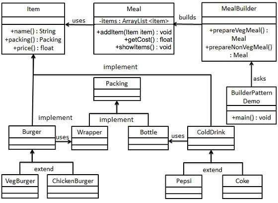

1. Introduction
	1. Used to build complex objects from simple objects step by step
	2. It is a creational pattern
	3. Builder class is used to build object step by step
	4. Builder class is independent of other objects
2. Implementation
	1. Example: 
		1. Consider a meal in fast food restaurant which is burger and cold drink.
		2. Burger can be veg or Chicken and is packed by a wrapper
		3. Cold drink is coke or pepsi and will be packed in bottle
		4. Implementation:
			1. Item: Interface which represents food item (burger or cold drink)
			2. Packing: Interface which represents packing for food item
			3. Meal: Class having ArrayList of Item
			4. MealBuilder: Class to build different types of Meal objects by combining Item
			5. BuilderPatternDemo: Demo class that used MealBuilder to build Meal
		5. Actual Classes:
			1. Item.java
			
					public interface Item {
						public String name();
						public Packing packing();
						public float price();
					}
					
			2. Packing.java
				
					public interface Packing {
						public String pack();
					}
			
			3. Wrapper.java
			
					public class Wrapper implements Packing {
						@Override
						public String pack() {
							return "Wrapper";
						}
					}
					
			4. Bottle.java
			
					public class Bottle implements Packing {
						@Override
						public String pack() {
							return "Bottle";
						}
					}
			
			5. Burger.java
			
					public abstract class Burger implements Item {
						@Override
						public Packing packing() {
							return new Wrapper();
						}
						
						//forces subclasses to provide an implementation for price()
						@Override
						public abstract float price();
					}
					
			6. ColdDrink.java
			
					public abstract class ColdDrink implements Item {
						@Override
						public Packing packing() {
							return new Bottle();
						}
						
						@Override
						public abstract float price();
					}
					
			7. VegBurger.java
			
					public class VegBurger extends Burger {
						@Override
						public float price() {
							return 25.0f;
						}
						
						@Override
						public String name() {
							return "Veg Burger";
						}
					}
					
			8. ChickenBurger.java
			
					public class ChickenBurger extends Burger {
						@Override
						public float price() {
							return 50.0f;
						}
						
						@Override
						public String name() {
							return "Chicken Burger";
						}
					}
					
			9. Coke.java
			
					public class Coke extends ColdDrink {
						@Override
						public float price() {
							return 30.0f;
						}
						
						@Override
						public String name() {
							return "Coke";
						}
					}
					
			10. Pepsi.java
			
					public class Pepsi extends ColdDrink {
						@Override
						public float price() {
							return 35.0f;
						}
						
						@Override
						public String name() {
							return "Pepsi";
						}
					}
					
			11. Meal.java
			
					import java.util.ArrayList;
					import java.util.List;
					
					public class Meal {
						private List<Item> items = new ArrayList<Item>();
						
						public void addItem(Item item) {
							items.add(item);
						}
						
						public float getCost() {
							float cost = 0.0f;
							for(Item item: items) {
								cost += item.price();
							}
							
							return cost;
						}
						
						public void showItems() {
							for(Item item: items) {
								System.out.println("Item: " + item.name());
								System.out.println(", Packing: " + item.packing().pack());
								System.out.println(", Price: " + item.price());
							}
						}
					}
					
			12. MealBuilder.java
			
					public class MealBuilder {
						public Meal prepareVegMeal() {
							Meal meal = new Meal();
							meal.addItem(new VegBurger());
							meal.addItem(new Coke());
							return meal
						}
						
						public Meal prepareNonVegMeal() {
							Meal meal = new Meal();
							meal.addItem(new ChickenBurger());
							meal.addItem(new Pepsi());
							return meal;
						}
					} 
					
			13. BuilderPatternDemo.java
			
					public class BuilderPatternDemo {
						public static void main(String[] args) {
							MealBuilder mealBuilder = new MealBuilder();
							
							Meal vegMeal = mealBuilder.prepareVegMeal();
							System.out.println("Veg Meal");
							vegMeal.showItems();
							System.out.println("Total Cost: " + vegMeal.getCost());
							
							Meal nonVegMeal = mealBuilder.prepareNonVegMeal();
							System.out.println("\n\nNon-Veg Meal");
							nonVegMeal.showItems();
							System.out.println("Total Cost: " + nonVegMeal.getCost());
						}
					}
					
##### Prototype Pattern

1. Introduction
	1. Creation of duplicate objects taking care of performance.
	2. It is a creational pattern
	3. Prototype interface: used for creating a clone of existing object.
	4. Purpose: Creation of objects is costly (time consuming)
	5. Example:
		1. Consider a costly database operation.
		2. The object can be cached and a clone of the object can be returned on next request.
		3. Database is updated when needed (reduces database calls)
2. Implementation 
	1. `Shape.java`: abstract class implementing `Cloneable` interface
	
			public abstract class Shape implements Cloneable {
				private String id;
				protected String type;
				
				abstract void draw();
				
				public String getType() {
					return type;
				}
				
				public String getId() {
					return id;
				}
				
				public void setId(int id) {
					this.id = id;
				}
				
				public Object clone() {
					Object clone = null;
					
					try {
						clone = super.clone();
					} catch(CloneNotSupportedException e) {
						e.printStackTrace();
					}
					
					return clone;
				}
			} 
			
	2. `Rectangle.java`
	
			public class Rectangle extends Shape {
				public Rectangle() {
					type = "Rectangle";
				}
				
				@Override
				public void draw() {
					System.out.println("Inside Rectangle::draw() method.");
				}
			}
			
	3. `Square.java`
	
			public class Square extends Shape {
				public Square() {
					tepe = "Square";
				}
				
				@Override
				public void draw() {
					System.out.println("Inside Square::draw() method.");
				}
			}
			
	4. `Circle.java`
	
			public class Circle extends Shape {
				public Circle() {
					type = "Circle";
				}
				
				@Override
				public void draw() {
					System.out.println("Inside Circle::draw() method.");
				}
			}
			
	5. `ShapeCache.java`: Class to get concrete classes from database and story them in Hashtable
	
			import java.util.Hashtable;
			
			public class ShapeCache {
				private static Hashtable<String, String> shapeMap = new Hashtable<String, Shape>();
				
				public static Shape getShape(String shapeId) {
					Shape cachedShape = shapeMap.get(shapeId);
					return (Shape) cachedShape.clone();
				}
				
				// for each shape run database query and create shape
				// shapeMap.put(shapeKey, shape);
				// for example, we are adding three shapes
				
				public static void loadCache() {
					Circle circle = new Circle();
					circle.setId("1");
					shapeMap.put(circle.getId(), circle);
					
					Square square = new Square();
					square.setId("2");
					shapeMap.put(square.getId(), square);
					
					Rectangle rectangle = new Rectangle();
					rectangle.setId("3");
					shapeMap.put(rectangle.getId(), rectangle);
				}
			}
			
	6. PrototypePatternDemo.java
	
			public class PrototypePatternDemo {
				public static void main(String[] args) {
					ShapeCache.loadCache();
					
					Shape clonedShape = (Shape) ShapeCache.getShape("1");
					System.out.println("Shape: " + clonedShape.getType());
				}
				
					Shape clonedShape2 = (Shape) ShapeCache.getShape("2");
					System.out.println("Shape: " + clonedShape2.getType());
					
					Shape clonedShape3 = (Shape) ShapeCache.getShape("3");
					System.out.println("Shape: " + clonedShape3.getType());
			}
			
##### Adapter Pattern

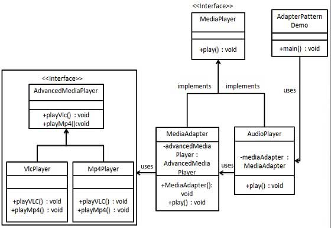

1. Introduction
	1. It is a bridge between two incompatible interfaces.
	2. It is a structural pattern
	3. A single class combines functionalities of independent/incompatible interfaces.
	4. Example: Card reader is adapter between memory card and laptop
2. Implementation
	1. MediaPlayer: Interface
	2. AudioPlayer: Implements MediaPlayer.
		1. It can play mp3 format audio files by default
	3. AdvancedMediaPlayer: Interface.
	4. Concrete class of AdvancedMediaPlayer: Can play mp4, vlc format
	5. Requirement: Make AudioPlayer to play other formats.
	6. MediaAdaper: implements MediaPlayer interface and uses AdvancedMediaPlayer objects to play the required format.
	7. AudioPlayer passes desired audio type to MediaAdapter (does not know the type of class that can play it)
3. Example implementation
	1. `MediaPlayer.java`
	
			public interface MediaPlayer {
				public void play(String audioType, String fileName);
			}
			
	2. `AdvancedMediaPlayer.java`
	
			public interface AdvancedMediaPlayer {
				public void playVlc(String fileName);
				public void playMp4(String fileName);
			}
			
	3. `VlcPlayer.java`
	
			public class VlcPlayer implements AdvancedMediaPlayer {
				@Override
				public void playVlc(String fileName) {
					System.out.println("Playing vlc file. Name: " + fileName);
				}
				
				@Override
				public void playMp4(String fileName) {
					//do nothing
				}
			}
			
	4. `Mp4Player.java`
	
			public class Mp4Player implements AdvancedMediaPlayer {
				@Override
				public void playVlc(String fileName) {
					//do nothing
				}
				
				@Override
				public void playMp4(String fileName) {
					System.out.println("Playing mp4 file. Name: " + fileName);
				}
			}
			
	5. `MediaPlayer.java`
	
			public class MediaAdapter implements MediaPlayer {
				AdvancedMediaPlayer advancedMusicPlayer;
				
				public MediaAdapter(String audioType) {
					if(audioType.equalsIgnoreCase("vlc")) {
						advancedMusicPlayer = new VlcPlayer();
					} else if(audioType.equalsIgnoreCase("mp4")) {
						advancedMusicPlayer = new Mp4Player();
					}
				}
				
				@Override
				public void play(String audioType, String fileName) {
					if(audoType.equalsIgnoreCase("vlc")) {
						advancedMusicPlayer.playVlc(fileName);
					}
					else if(audioType.equalsIgnoreCase("mp4")) {
						advancedMusicPlayer.playMp4(fileName);
					}
				}
			}
			
	6. `AudioPlayer.java`
	
			public class AudioPlayer implements MediaPlayer {
				MediaAdapter mediaAdapter;
				
				@Override
				public void play(String audioType, String fileName) {
					
					//inbuilt support to play mp3 music files
					if(audioType.equalsIgnoreCase("mp3")) {
						System.out.println("Playing mp3 file. Name: " + fileName);
					}
					
					//mediaAdapter is providing support to play other file formats
					else if(audioType.equalsIgnoreCase("vlc") || audioType.equalsIgnoreCase("mp4")) {
						mediaAdapter = new MediaAdapter(audioType);
						mediaAdapter.play(audioType, fileName);
					}
					
					else {
						System.out.println("Invalid media. " + audioType + " format not supported.");
					}
				}
			}
			
	7. `AdpaterPatternDemo.java`
	
			public class void main(String[] args) {
				AudioPlayer audioPlayer = new AudioPlayer();
				
				audioPlayer.play("mp3", "beyong the horizon.mp3");
				audioPlayer.play("mp4", "alone.mp4");
				audioPlayer.play("vlc", "far far away.vlc");
				audioPlayer.play("avi", "mind me.avi");
			}
			
##### Bridge Pattern
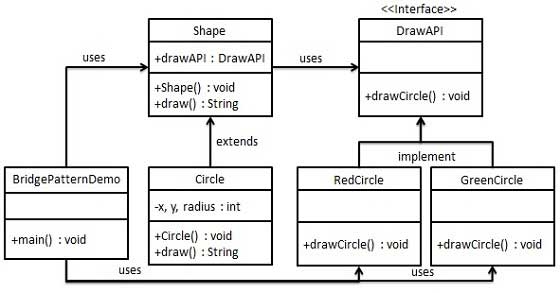

1. Introduction
	1. Used to decouple abstraction from its implementation (two can vary independently).
	2. It is a structural pattern.
	3. A bridge structure is provided between abstract class and implementation class.
		1. Interface is the bridge.
		2. Interface implemnter classes are independent of concrete classes
	4. It is used when class and what it can do vary often.
		1. Class: abstraction
		2. What class can do: implementation
	5. It is two layers of abstraction
2. Implementation
	1. DrawAPI: bridge
		1. RedCircle: Concrete class
		2. GreenCircle: Concrete class
	2. Shape: Abstract class. Uses DrawAPI object.
	3. BridgePatternDemo
	4. Implementation Steps:
		1. `DrawAPI.java`
		
				public interface DrawAPI {
					public void drawCircle(int radius, int x, int y);
				}
				
		2. `RedCircle.java`
			
				public class RedCircle implements DrawAPI {
					@Override
					public void drawCircle(int radius, int x, int y) {
						System.out.println("Draw Circle[ color: red, radius: " + radius + ", x: " + x + ", " + y + "]");
					}
				}
				
		3. `GreenCircle.java`
			
				public class GreenCircle implements DrawAPI {
					@Override
					public void drawCircle(int radius, int x, int y) {
						System.out.println("Drawing Circle[ color: green, radius: " + radius + ", x: " + x + ", " + y + "]");
					}
				}
				
		4. `Shape.java`
		
				public abstract class Shape {
					protected DrawAPI drawAPI;
					
					protected Shape(DrawAPI drawAPI) {
						this.drawAPI = drawAPI;
					}
					
					public abstract void draw();
				}
			
		5. `Circle.java`
		
				public class Circle extends Shape {
					private int x, y, radius;
					
					public Circle(int x, int y, int radius, DrawAPI drawAPI) {
						super(drawAPI);
						this.x = x;
						this.y = y;
						this.radius = radius;
					}
					
					public void draw() {
						drawAPI.drawCircle(radius, x, y);
					}
				}
				
		6. `BridgePatternDemo.java`
		
				public class BridgePatternDemo {
					public static void main(String[] args) {
						Shape redCircle = new Circle(100, 100, 10, new RedCircle());
						Shape greenCircle = new Circle(100, 100, 10, new GreenCircle());
						
						redCircle.draw();
						greenCircle.draw();
					}
				}
				
##### Filter Pattern

1. Introduction
	1. Also called criteria pattern
	2. Used to filter objects using certain criteria.
	3. Filters are chained using logical operations.
	4. It is a structural pattern. (combines multiple patterns to obtain a single pattern)
2. Implementation
	1. Person: Object on which Criteria is applied
	2. Criteria: Interface to list of persons
	3. Implementation classes: Implement Criteria
	4. Steps:
		1. `Person.java`
		
				public class Person {
					private String name;
					private String gender;
					private String maritalStatus;
					
					public Person(String name, String gender, String maritalStatus) {
						this.name = name;
						this.gender = gender;
						this.maritalStatus = maritalStatus;
					}
					
					public String getName() {
						return name;
					}
					
					public String getGender() {
						return gender;
					}
					
					public String getMaritalStatus() {
						return maritalStatus;
					}
				}
	
		2. `Criteria.java`
		
				import java.util.List;
				
				public interface Criteria {
					public List<Person> meetCriteria(List<Person> persons);
				}
				
		3. `CriteraMale.java`
		
				import java.util.ArrayList;
				import java.util.List;
		
				public class CriteriaMale implements Criteria {
					@Override
					public List<Person> meetCriteria(List<Person> persons) {
						List<Person> malePersons = new ArrayList<Person>();
						
						for(Person person: persons) {
							if(person.getGender().equalsIgnoreCase("MALE")) {
								malePersons.add(person);
							}
						}
						
						return malePersons;
					}
				}
				
		4. `CriteriaFemale.java`
		
				import java.util.ArrayList;
				import java.util.List;
		
				public class CriteriaFemale implements Criteria {
					@Override
					public List<Person> meetCriteria(List<Person> persons) {
						List<Person> femalePersons = new ArrayList<Person>();
						
						for(Person person: persons) {
							if(person.getGender().equalsIgnoreCase("FEMALE")) {
								femalePersons.add(person);
							}
						}
						
						return femalePersons;
					}
				}
				
		5. `CriteriaSingle.java`
		
				import java.util.ArrayList;
				import java.util.List;
				
				public class CriteriaSingle implements Criteria {
					@Override
					public List<Person> meetCriteria(List<Person> persons) {
						List<Person> singlePersons = new ArrayList<Person>();
						
						for(Person person: persons) {
							if(person.getMaritalStatus().equalsIgnoreCase("SINGLE")) {
								singlePersons.add(person);
							}
						}
						
						return singlePersons;
					}
				}
				
		6. `AndCriteria.java`
		
				import java.util.List;
				
				public class AndCriteria implements Criteria {
					private Criteria criteria;
					private Criteria otherCriteria;
					
					public AndCriteria(Criteria criteria, Criteria otherCriteria) {
						this.criteria = criteria;
						this.otherCriteria = otherCriteria; 
					}
					
					@Override
					public List<Person> meetCriteria(List<Person> persons) {
						List<Person> firstCriteriaPersons = critiria.meetCriteria(persons);
						return otherCriteria.meetCriteria(firstCriteriaPersons);
					}
				}
				
		7. `OrCriteria.java`
		
				import java.util.List;
				
				public class OrCriteria implements Criteria {
					private Criteria criteria;
					private Criteria otherCriteria;
					
					public OrCriteria(Criteria criteria, Criteria otherCriteria) {
						this.criteria = criteria;
						this.otherCriteria = otherCriteria;
					}
					
					@Override
					public List<Person> meetCriteria(List<Person> persons) {
						List<Person> firstCriteriaItems = criteria.meetCriteria(persons);
						List<Person> otherCriteriaItems = otherCriteria.meetCriteria(persons);
						
						for(Person person: otherCriteriaItems) {
							if(!firstCriteriaItems.contains(person)) {
								firstCriteriaItems.add(person);
							}
						}
						
						return firstCriteriaItems;
					}
				}
				
		8. `CriteriaPatternDemo.java`
		
				public class CriteriaPatternDemo {
					public static void main(String[] args) {
						List<Person> persons = new ArrayList<Person>();
						
						persons.add(new Person("Robert", "Male", "Single"));
						persons.add(new Person("John", "Male", "Married"));
						persons.add(new Person("Laura", "Female", "Married"));
						persons.add("Diana", "Female", "Single");
						persons.add(new Person("Mike", "Male", "Single"));
						persons.add(new Person("Bobby", "Male", "Single"));
						
						Criteria male = new Criteria();
						Criteria female = new CriteriaFemale();
						Criteria single = new CriteriaSingle();
						Criteria singleMale = new AndCriteria(single, male);
						Criteria singleOrFemale = new OrCriteria(single, female);
						
						System.out.println("Males: ");
						printPersons(male.meetCriteria(persons));
						System.out.println("\nFemales: ");
						printPersons(female.meetCriteria(persons));
						
						System.out.println("\nSingle Males: ");
						printPersons(singleMale.meetCriteria(persons));
						
						System.out.println("\nSingle Or Females: ");
						printPersons(singleOrFemale.meetCriteria(persons));
					}
					
					public static void printPersons(List<Person> persons) {
						for(Person person: persons) {
							System.out.println("Person : [ Name: " + person.getName() + ", Gender : " + person.getGender() + ", Marital Status : " + person.getMaritalStatus() + " ]");
						}
					}
				}
				
##### Composite Pattern

1. Introduction
	1. Group of objects are treated as single object.
	2. Composite pattern composes of objects as tree structure.
	3. It is a structural pattern (tree structure)
	4. Class contains group of its own objects. Class has methods to modify its group of objects
2. Implementation
	1. Employee: composite pettern actor class
	2. CompositePatternDemo: uses Employee to add department level hierarchy
	3. Steps:
		
			import java.util.ArrayList;
			import java.util.List;
			
			public class Employee {
				private String name;
				private String dept;
				private int salary;
				private List<Employee> subordinates;
				
				// constructor
				public Employee(String name, String dept, int salary) {
					this.name = name;
					this.dept = dept;
					this.salary = salary;
					subordinates = new ArrayList<Employee>();
				}
				
				public void add(Employee employee) {
					subordinates.add(employee);
				}
				
				public void remove(Employee employee) {
					subordinates.remove(employee);
				}
				
				public List<Employee> getSubordinates() {
					return subordinates;
				}
				
				public String toString() {
					return ("Employee :[ Name: " + name + ", dept : " + dept + ", salary : " + salary + " ]");
				}
			}
			
	4. CompositePatternDemo:
	
			public class CompositePatternDemo {
				public static void main(String[] args) {
					Employee CEO = new Employee("John", "CEO", 30000);
					
					Employee headSales = new Employee("Robert", "Head Sales", 20000);
					Employee headMarketing = new Employee("Michel", "Head Marketing", 20000);
					
					Employee clerk1 = new Employee("Laura", "Marketing", 10000);
					Employee clerk2 = new Employee("Bob", "Marketing", 10000);
					
					Emploee salesExecutive1 = new Employee("Richard", "Sales", 10000);
					Employee salesExecutive2 = new Employee("Rob", "Sales", 10000);
					
					CEO.add(headSales);
					CEO.add(headMarketing);
					
					headSales.add(salesExecutive1);
					headSales.add(salesExecutive2);
					
					headMarketing.add(clerk1);
					headMarketing.add(clark2);
					
					//print all employee of the organization
					System.out.println(CEO);
					
					for(Employee headEmployee : CEO.getSubordinates()) {
						System.out.println(headEmployee);
						
						for(Employee employee : headEmployee.getSubordinates()) {
							System.out.println(employee);
						}
					}
				}
			}
			
##### Decorator Pattern
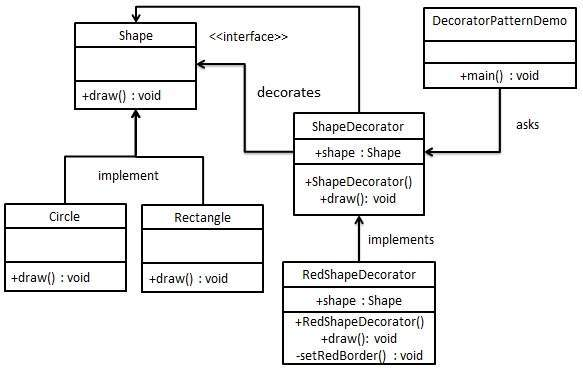

1. Introduction
	1. Adds new functionality to existing object without altering its structure.
	2. It is a structural pattern
	3. It is a wrapper to existing class.
	4. Keeps class methods signature intact
2. Implementation
	1. `Shape`: Interface
	2. `ShapeDecorator`: abstract decorator class. Implements `Shape` interface.
		1. `Shape`: instance variable
	3. `RedShapeDecorator`: Implements `ShapeDecorator`
	4. `DecoratorPatternDemo`: demo class
	5. Steps:
		1. `Shape.java`
		
				public interface Shape {
					void draw();
				}
				
		2. `Rectangle.java`
		
				public class Rectangle implements Shape {
					@Override
					public void draw() {
						System.out.println("Shape: Rectangle");
					}
				}
				
		3. `Circle.java`
		
				public class Circle implements Shape {
					@Override
					public void draw() {
						System.out.println("Shape: Circle");
					}
				}
				
		4. `ShapeDecorator.java`
		
				public abstract class ShapeDecorator implements Shape {
					protected Shape decoratedShape;
				
					public ShapeDecorator(Shape decoratedShape) {
						this.decoratedShape = decoratedShape;
					}
					
					public void draw() {
						decoratedShape.draw();
					}
				}
				
		5. `RedShapeDecorator.java`
		
				public class RedShapeDecorator extends ShapeDecorator {
					public RedShapeDecorator(Shape decoratedShape) {
						super(decoratedShape);
					}
					
					@Override
					public void draw() {
						decoratedShape.draw();
						setRedBorder(decoratedShape);
					}
					
					private void setRedBorder(Shape decoratedShape) {
						System.out.println("Border Color: Red");
					}
				}
				
		6. `DecoratorPatternDemo.java`
			
				public class DecoratorPatternDemo {
					public static void main(String[] args) {
						Shape circle = new Circle();
						
						Shape redCircle = new RedShapeDecorator(new Circle());
						System.out.println("Circle with normal border");
						circle.draw();
						
						System.out.println("\nCircle of red border");
						redCircle.draw();
						
						System.out.println("\nRectangle of red border");
						redRectangle.draw();
						
					}
				}
				
##### Facade Pattern

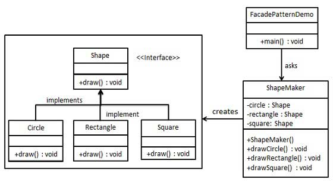

1. Introduction
	1. Facade pattern provides simple interface to a system by hiding the complexities.
	2. It is a structural pattern (adds interface to existing system)
	3. Single class provides simplified methods. The methods dedicate calls to existing system classes.
2. Implementation
	1. Steps:
		1. `Shape`:
		
				public interface Shape {
					public void draw();
				}
				
		2. `Circle`:
				
				public class Circle extends Shape {
					@Override
					public void draw() {
						System.out.println("Circle::draw()");
					}
				}
				
		3. `Rectangle`:
		
				public class Rectangle extends Shape {
					@Override
					public void draw() {
						System.out.println("Rectangle::draw()");
					}
				}
				
		4. `Square`:
		
				public class Square extends Shape {
					@Override
					public void draw() {
						System.out.println("Square::draw()");
					}
				}
				
		5. `ShapeMaker`:
		
				public class ShapeMaker {
					private Circle circle;
					private Rectangle rectangle;
					private Square square;
					
					public ShapeMaker() {
						circle = new Circle();
						rectangle = new Rectangle();
						square = new Square();
					}
					
					public void drawCircle() {
						circle.draw();
					}
					
					public void drawRectangle {
						rectangle.draw();
					}
					
					public void drawSquare {
						square.draw();
					}
				}
				
		6. `FacadePatternDemo`:
		
				public class FacadePatternDemo {
					public static void main(String[] args) {
						ShapeMaker shapeMaker = new ShapeMaker();
						
						shapeMaker.drawCircle();
						shapeMaker.drawRectangle();
						shapeMaker.drawSquare();
					}
				}
				
##### Flyweight Pattern

1. Introduction
	1. Purpose: reduce number of objects thus decrease memory footprint and increase performance (?).
	2. It is a structural patern (improves object structure of app).
	3. Strategy:
		1. If similar object is exists then reuse it else object is initalized and used.
		2. Example: Draw 20 circles with only five objects. Each object represents a particular color out of five colors.
2. Implementation
	1. `Shape`: Interface
	2. `Circle`: Concrete class
	3. `ShapeFactory`: Factory class:
		1. If a request comes for creation of Circle, it checks HashMap. If object of Circle is found, returns it or else new object gets created, stored in HashMap and returned.
	4. `FlyweightPatternDemo`:
		1. Uses `ShapeFactory` to get `Shape` object.
		2. Passes color as input out of: red/green/blue/black/white to `ShapeFactory`
	5. Steps:
		1. `Shape.java`
		
				public interface Shape {
					void draw();
				}
				
		2. `Circle.java`
		
				public class Circle implements Shape {
					private String color;
					private int x;
					private int y;
					private int radius;
					
					public Circle(String color) {
						this.color = color;
					}
					
					public void setX(int x) {
						this.x = x;
					}
					
					public void setY(int y) {
						this.y = y;
					}
					
					public void setRadius(int radius) {
						this.radius = radius;
					}
					
					@Override
					public void draw() {
						System.out.println("Circle: Draw() [Color : " + color + ", x : " + x + ", y : " + y + ", radius :" + radius);
					}
				}
				
		3. `ShapeFactory.java`
			
				import java.util.HashMap;
				
				public class ShapeFactory {
					private static final HashMap<String, Shape> circleMap = new HashMap();
					public static Shape getCircle(String color) {
						Circle circle = (Circle)circleMap.get(color);
						
						if(circle == null) {
							circle = new Circle(color);
							circleMap.put(color, circle);
							System.out.println("Creation of Circle of color: " + color);
						}
						return circle;
					}
				}
				
		4. `FlyweightPatternDemo.java`:
		
				public class FlyweightPatternDemo {
					private static final String colors[] = {"Red", "Green", "Blue", "White", "Black"};
					public static void main(String[] args) {
						for(int i = 0; i < 20; i++) {
							Circle circle = (Circle)ShapeFactory.getCircle(getRandomColor());
							circle.setX(getRandomX());
							circle.setY(getRandomY());
							circle.setRadius(100);
							circle.draw();
						}
					}
					
					private static String getRandomColor() {
						return colors[(int)(Math.random()*colors.length)];
					}
					
					private static int getRandomX() {
						return (int)(Math.random()*100);
					}
					
					private static int getRandomY() {
						return (int)(Math.random()*100);
					}
				}
				
##### Proxy Pattern
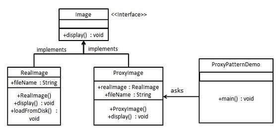

1. Introduction
	1. A class represents functionality of another class
	2. It is a structural pattern
2. Implementation
	1. `Image`: interface
	2. `ProxyImage`: proxy class. Reduces memory footprint.
	3. `RealImage`: Real class
	4. `ProxyPatternDemo`: demo class which used `ProxyImage` to get `Image` object
	5. Steps:
		1. `Image.java`:
		
				public interface Image {
					public void display();
				}
				
		2. `RealImage.java`:
			
				public class RealImage implements Image {
					private String fileName;
					
					public RealImage(String fileName) {
						this.fileName = fileName;
						loadFromDisk(fileName);
					}
					
					@Override
					public void display() {
						System.out.println("Displaying " + fileName);
					}
					
					private void loadFromDisk(String fileName) {
						System.out.println("Loading " + fileName);
					}
				}
				
		3. `ProxyImage.java`:
		
				public class ProxyImage implements Image {
					private RealImage realImage;
					private String fileName;
					
					public ProxyImage(String fileName) {
						this.fileName = fileName;
					}
					
					@Override
					public void display() {
						if(realImage == null) {
							realImage = new RealImage(fileName);
						}
						realImage.display();
					}
				}
				
		4. `ProxyPatternDemo.java`:
		
				public class ProxyPatternDemo {
					public static void main(String[] args) {
						Image image = new ProxyImage("test_10mb.jpg");
						
						//image will be loaded from disk
						image.display();
						System.out.println("");
						
						//image will not be loaded from disk
						image.display();
					}
				}
				
##### Command Pattern
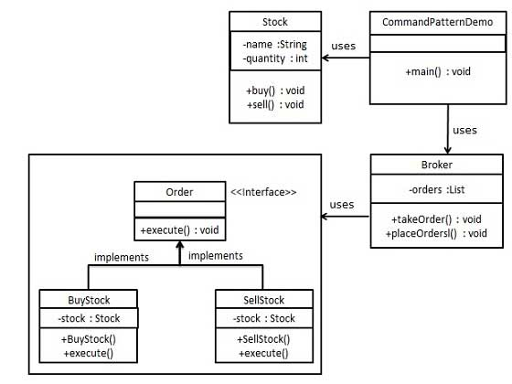

1. Introduction
	1. Data driven design pattern
	2. It is behavioral pattern
	3. Request is wrapped as command in an object and passed to invoker object. Invoker object looks for an object that can handle the command and passes the command to corresponding object.
2. Implementation
	1. `Order`: Interface that acts as command.
	2. `Stock`: request object
	3. `BuyStock`, `SellStock`: command classes that implement `Order`. These classes do actual command processing.
	4. `Broker`: Invoker object. It takes orders and places orders.
	5. Steps:
		1. `Order.java`:
		
				public interface Order {
					public void execute();
				}
				
		2. `Stock.java`: Request class
		
				public class Stock {
					private String name = "ABC";
					private int quantity = 10;
					
					public void buy() {
						System.out.println("Stock [ Name: " + name + ", Quatity: " + quantity + "] bought");
					}
					
					public void sell() {
						System.out.println("Stock [ Name: " + name + ", Quantity: " + quantity + "] sold");
					}
				}
				
		3. `BuyStock.java`:
		
				public class BuyStock implements Order {
					private Stock abcStock;
					
					public BuyStock(Stock abcStock) {
						this.abcStock = abcStock;
					}
					
					public void execute() {
						abcStock.buy();
					}
				}
				
		4. `SellStock.java`:
		
				public class SellStock implements Order {
					private Stock abcStock;
					public SellStock(Stock abcStock) {
						this.abcStock = abcStock;
					}
					
					public void execute() {
						abcStock.sell();
					}
				}
				
		
##### Interpreter Pattern
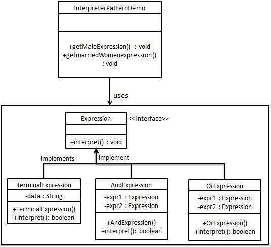

1. Introduction
	1. It is used to evaluate language grammar/ expression.
	2. It is behavioral pattern
	3. Uses:
		1. SQL Parsing, symbol processing engine
2. Implementation
	1. `Expression`: Interface
	2. `TerminalExpression`: main interpreter of context
	3. `OrExpression`, `AndExpression`: used for creation of combinational expressions
	4. `InterpreterPatternDemo`: Uses `Expression` class for creation of rules, parsing expressions.
	5. Steps:
		1. `Expression.java`
		
				public interface Expression {
					public boolean interpret(String context);
				}
				
		2. `TerminalExpression.java`
		
				public class TerminalExpression implements Expression {
					private String data;
					
					public TerminalExpression(String data) {
						this.data = data;
					}
					
					@Override
					public boolean interpret(String context) {
						if(context.contains(data)) {
							return true;
						}
						return false;
					}
				}
				
		3. `OrExpression.java`
		
				public class OrExpression implements Expression {
					private Expression expr1 = null;
					private Expression expr2 = null;
					
					public OrExpression(Expression expr1, Expression expr2) {
						this.expr1 = expr1;
						this.expr2 = expr2;
					}
					
					@Override
					public boolean interpret(String context) {
						return expr1.interpret(context) || expr2.interpret(context);
					}
				}
				
		4. `AndExpression.java`
		
				public class AndExpression implements Expression {
					private Expression expr1 = null;
					private Expression expr2 = null;
					
					public AndExpression(Expression expr1, Expression expr2) {
						this.expr1 = expr1;
						this.expr2 = expr2;
					}
					
					@Override
					public boolean interpret(String context) {
						return expr1.interpret(context) && expr2.interpret(context);
					}
				}
				
		5. `InterpreterPatternDemo.java`
			
				public class InterpreterPatternDemo {
					//Rule: Robert and John are male
					public static Expression getMaleExpression() {
						Expression robert = new TerminalExpression("Robert");
						Expression john = new TerminalExpression("John");
						return new OrExpression(robert, john);
					}
					
					//Rule: Julie is a married women
					public static Expression getMarriedWomanExpression() {
						Expression julie = new TerminalExpression("Julie");
						Expression married = new TerminalExpression("Married");
						return new AndExpression(jilie, married);
					}
					
					public static void main(String[] args) {
						Expression isMale = getMaleExpression();
						Expression isMarriedWoman = getMarriedWomanExpression();
						
						System.out.println("John is a male? " + isMale.interpret("John"));
						System.out.println("Julie is a married woman? " + isMarriedWoman.interpret("Married Julie"));
					}
				}
				
##### Iterator Pattern
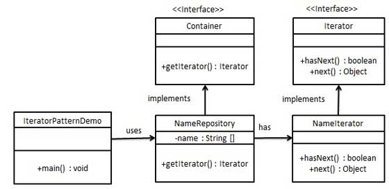

1. Introduction
	1. Used to access elements of a collection in sequential manner without knowing the underlying representation.
	2. It is a behavioral pattern
2. Implementation
	1. `Iterator`: Interface. Gives a navigation method.
	2. `Container`: Interface. Returns an `Iterator`
	3. Concrete classes of `Container`: Implement `Iterator` and use it.
	4. `IteratorPatternDemo`: Uses `NamesRepository` to print names stored as a collection.
	5. Steps:
		1. `Iterator.java`
		
				public interface Iterator {
					public boolean hasNext();
					public Object next();
				}
				
		2. `Container.java`
		
				public interface Container {
					public Iterator getIterator();
				}
				
		3. `NameRepository.java`: 
		
				public class NameRepository implements Container {
					public String names[] = {"Robert", "John", "Julie", "Lora"};
				
					@Override
					public Iterator getIterator() {
						return new NameIterator();
					}
					
					private class NameIterator implements Iterator() {
						int index;
						
						@Override
						public boolean hasNext() {
							if(index < names.length) {
								return true;
							}
							return false;
						}
						
						@Override
						public Object next() {
							if(this.hasNext()) {
								return names[index++];
							}
							return null;
						}
					}
				}
		
		4. `IteratorPatternDemo.java`
		
				public class IteratorPatternDemo {
					public static void main(String[] args) {
						NameRepository namesRepository = new NameRepository();
						
						for(Iterator iter = namesRepository.getIterator(); iter.hasNext();) {
							String name = (String)iter.next();
							System.out.println("Name: " + name);
						}
					}
				}
				
##### Mediator Pattern
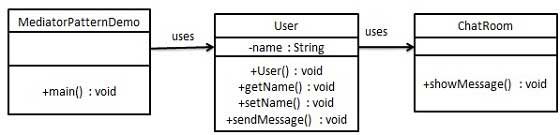

1. Introduction
	1. Used to reduce communication complexity between multiple objects or classes.
	2. Mediator class handles communications between different classes. (Lose coupling)
	3. It is behavioral pattern category.
2. Implementation
	1. `ChatRoom`: used to share messages.
	2. `User`: Multiple users can send messages to `ChatRoom`.
	3. `MediatorPatternDemo`: Shows communication between different `User`s
	
##### Memento Pattern
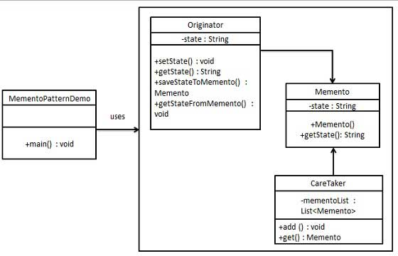

1. Introduction
	1. Used to restore an object's state to previous state.
	2. It is a behavioral pattern.
2. Implementation
	1. Three actor classes are used.
		1. `Memento`: contains state of an object stored.
		2. `Originator`: Responsible for creation and storage of state into `Memento`
		3. `Caretaker`: Responsible for restoring object state from `Memento`
	2. `MementoPatternDemo`: Uses `CareTaker` and `Originator` to show restoration of objects.
	3. Steps:
		1. `Mememto.java`
		
				public class Memento {
					private String state;
					
					public Memento(String state) {
						this.state
					}
					
					public String getState() {
						return state;
					}
				}
				
		2. `Originator.class`
		
				public class Originator {
					private String state;
					
					public void setState(String state) {
						this.state = state;
					}
					
					public String getState() {
						return state;
					}
					
					public Memento saveStateToMemento() {
						return new Memento(state);
					}
					
					public void getStateFromMemento(Memento memento) {
						state = memento.getState();
					}
				}
				
		3. `CareTaker.java`
		
				import java.util.ArrayList;
				import java.util.List;
				
				public class CareTaker {
					private List<Memento> mementoList = new ArrayList<Memento>();
					
					public void add(Memento state) {
						mementoList.add(state);
					}
					
					public Memento get(int index) {
						return mementoList.get(index);
					}
				}
				
		4. `MementoPatternDemo.java`
		
				public class MementoPatternDemo {
					public static void main(String[] args) {
						Originator originator = new Originator();
						CareTaker careTaker = new CareTaker();
						
						originator.setState("State #1");
						originator.setState("State #2");
						careTaker.add(originator.saveStateToMemento());
						
						originator.setState("State #3");
						careTaker.add(originator.saveStateToMemento());
						
						originator.setState("Sate #4");
						System.out.println("Current State: " + originator.getState());
						
						originator.getStateFromMemento(careTaker.get(0));
						System.out.println("First saved State: " + originator.getState());
						originator.getStateFromMemento(careTaker.get(1));
						System.out.println("Second saved State: " + originator.getState());
					}
				}
				
##### Observer Pattern
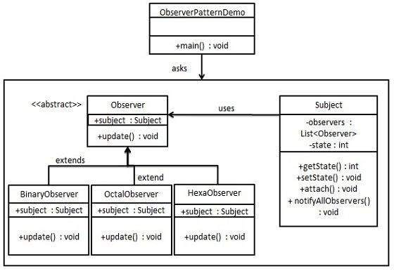

1. Introduction
	1. Used if there is one-to-many relationship between objects
	2. If one object is modified, other  dependent objects must be notified
 automatically.
 	3. It is a behavioral pattern
2. Implementation
	1. Three actor classes:
		1. `Subject`: has methods to attach and detach observers to `Client`
		2. `Observer`: Abstract class
		3. `Client`: 
	2. `ObserverPatternDemo`: Uses `Subject` and concrete class object.
	3. `Subject.java`
	
			import java.util.ArrayList;
			import java.util.List;
			
			public class Subject {
				private List<Observer> observers = new ArrayList<Observer>();
				private int state;
				
				public int getState() {
					return state;
				}
				
				public void setState(int state) {
					this.state = state;
					notifyAllOberservers();
				}
				
				public void attach(Observer observer) {
					observers.add(observer);
				}
				
				public void notifyAllObservers() {
					for(Observer observer: observers) {
						observer.update();
					}
				}
			}
			
	4. `Observer.java`
	
			public abstract class Observer {
				protected Subject subject;
				public abstract void update();
			}
			
	5. `BinaryObserver.java`
	
			public class BinaryObserver extends Observer {
				public BinaryObserver(Subject subject) {
					this.subject = subject;
					this.subject.attach(this);
				}
				
				@Override
				public void update() {
					System.out.println("Binary String: " + Integer.toBinaryString(subject.getState()));
				}
			}
			
	6. `OctalObserver.java`
	
			public class OctalObserver extends Observer {
				public OctalObserver(Subject subject) {
					this.subject = subject;
					this.subject.attach(this);
				}
				
				@Override
				public void update() {
					System.out.println("Octal String: " + Integer.toOctalString(subject.getState()));
				}
			}
			
	7. `HexaObserver.java`
	
			public class HexaObserver extends Observer {
				public HexaObserver(Subject subject) {
					this.subject = subject;
					this.subject.attach(this);
				}
				
				@Override
				public void update() {
					System.out.println("Hex String: " + Integer.toHexString(subject.getState()).toUpperCase());
				}
			}
			
	8. `ObserverPatternDemo.java`
	
			public class ObserverPatternDemo {
				public static void main(String[] args) {
					Subject subject = new Subject();
					
					new HexaObserver(subject);
					new OctalObserver(subject);
					new BinaryObserver(subjet);
					
					System.out.println("First state change: 15");
					subject.setState(15);
					System.out.println("Second state change: 10");
					subject.setState(10);
				}
			}

##### State Pattern
1. Class behavior changes based on its state.
2. It is a behavior pattern
3. Objects represent various states
4. Context object's behavior changes as its state object changes

###### Implementation
1. `State`: Interface which has an action
2. Concrete state classes: implement `State` interface
3. `Context`: Carries a state
4. `StatePatternDemo`: Demo class

	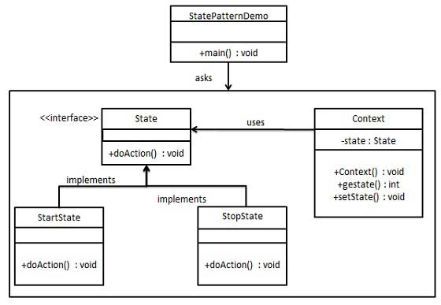

###### Steps
1. `State.java`

		public interface State {
			public void doAction(Context context);
		}

2. `StartState.java`

		public class StartState implements State {
			public void doAction(Context context) {
				System.out.println("Player is in start state");
				context.setState(this);
			}

			public String toString() {
				return "Start State";
			}
		}

3. `StopState.java`

		public class StopState implements State {
			public void doAction(Context context) {
				System.out.println("Player is in stop state");
				context.setState(this);
			}

			public String toString() {
				return "Stop State";
			}
		}

4. `Context.java`

		public class Context {
			private State state;

			public Context() {
				state = null;
			}

			public void setState(State state) {
				this.state = state;
			}

			public State getState() {
				return state;
			}
		}

5. `StatePatternDemo.java`

		public class StatePatternDemo {
			public static void main(String[] args) {
				Context context = new Context();

				StartState startState = new StartState();
				startState.doAction(context);

				System.out.println(context.getState().toString());

				StopState stopState = new StopState();
				stopState.doAction(context);
	
				System.out.println(context.getState().toString());
			}
		}

##### Null Object Pattern
1. Null object replaces check of NULL object instance.
2. Instead of checking for null value, Null object reflects do nothing relationship.
3. Null object can provide default behavior if data is not available.
4. Abstract class specifies various operations
	1. Concrete classes extend the class
	2. Null object class is a do nothing implementation of the class (used where we need to check null value)

###### Implementation
1. `AbstractCustomer`: abstract class with operations
2. `CustomerFactory`: Factory class returns on of the following based on customer name:
	1. Returns RealCustomer
	2. Returns NullCustomer
3. `NullPatternDemo`: Demo class

	

###### Steps
1. `AbstractCustomer.java`

		public abstract class AbstractCustomer {
			protected String name;
			public abstract boolean isNil();
			public abstract String getName();
		}

2. `RealCustomer.java`

		public class RealCustomer extends AbstractCustomer {
			public RealCustomer(String name) {
				this.name = name;
			}

			@Override
			public String getName() {
				return name;
			}

			@Override
			public boolean isNil() {
				return false;
			}
		}

3. `NullCustomer.java`

		public class NullCustomer extends AbstractCustomer {
			@Override
			public String getName() {
				return "Not Available in Customer Database";
			}

			@Override
			public boolean isNil() {
				return true;
			}
		}

4. `CustomerFactor.java`
		
		public class CustomerFactory {
			public static final String[] names = {"Rob", "Joe", "Julie"};

			public static AbstractCustomer getCustomer(String name) {
				for (int i = 0; i < names.length; i++) {
					if (names[i].equalsIgnoreCase(name)) {
						return new RealCustomer(name);
					}
				}
				return new NullCustomer();
			}
		}

5. `NullPatternDemo.java`

		public class NullPatternDemo {
			public static void main(String[] args) {
				AbstractCustomer customer1 = CustomerFactory.getCustomer("Rob");
				AbstractCustomer customer2 = CustomerFactory.getCustomer("Bob");
				AbstractCustomer customer3 = CustomerFactory.getCustomer("Julie");
				AbstractCustomer customer4 = CustomerFactory.getCustomer("Laura");

				System.out.println("Customers");
				System.out.println(customer1.getName());
				System.out.println(customer2.getName());
				System.out.println(customer3.getName());
				System.out.println(customer4.getName());
			}
		}

##### Strategy Pattern
1. A class behavior or its algorithm can be changed at runtime
2. It is a behavior pattern
3. An object represents strategies and a context object whose behavior varies as per its strategy object

###### Implementation
1. `Strategy`: interface with one action
2. Concrete strategy classes: implement `Strategy`
3. `Context`: class that uses `Strategy`
4. `StrategyPatternDemo`: Demo class that shows change in `Context` behavior with different strategies

###### Steps
1. `Strategy.java`

		public interface Strategy {
			public int doOperation(int num1, int num2);
		}

2. `OperationAdd.java`

		public class OperationAdd implements Strategy {
			@Override
			public int doOperation(int num1, int num2) {
				return num1 + num2;
			}
		}

3. `OperationSubtract.java`

		public class OperationSubtract implements Strategy {
			@Override
			public int doOperation(int num1, int num2) {
				return num1 - num2;
			}
		}

4. `OperationMultiply.java`

		public class OperationMultiply implements Strategy {
			@Override
			public int doOperation(int num1, int num2) {
				return num1 * num2;
			}
		}

5. `Context.java`

		public class Context {
			private Strategy strategy;

			public Context(Strategy strategy) {
				this.strategy = strategy;
			}

			public int executeStrategy(int num1, int num2) {		
				return strategy.doOperation(num1, num2);
			}
		}

6. `StrategyPatternDemo.java`

		public class StrategyPatternDemo {
			public static void main(String[] args) {
				Context context = new Context(new OperationAdd());
				System.out.println("10 + 5 = " + context.executeStrategy(10, 5));

				context = new Context(new OperationSubtract());
				System.out.println("10 - 5 = " + context.executeStrategy(10, 5));

				context = new Context(new OperationMultiply());
				System.out.println("10 * 5 = " + context.executeStrategy(10, 5));
			}
		}

##### Template Pattern
1. Abstract class exposes defined template(s) to execute its methods.
2. Subclasses can override method implementations
3. Invocation of the methods by subclasses must be in the same way as defined by abstract class.
4. It is a behavior pattern

###### Implementation
1. `Game`: Abstract class which defines operations with a template method that is set to be final which cannot be overridden.
2. `Cricket`, `Football`: Concrete classes that extend `Game` and override its methods.
3. `TemplatePatternDemo`: Demo class

	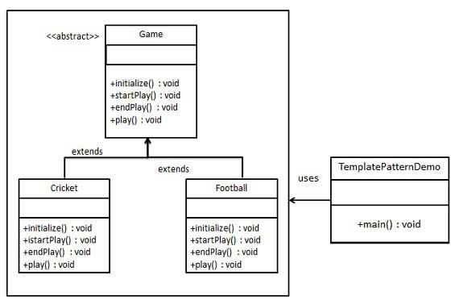

###### Steps
1. `Game.java`

		public abstract class Game {
			abstract void initialize();
			abstract void startPlay();
			abstract void endPlay();

			//template method
			public final void play() {
				// initialize the game
				initialize();

				// start game
				startPlay();
			
				// end game
				endPlay();
			}
		}

2. `Cricket.java`

		public class Cricket extends Game {
			@Override
			void endPlay() {
				System.out.println("Cricket Game Finished!");
			}

			@Override
			void initialize() {
				System.out.println("Cricket Game Initialized! Start playing.");
			}

			@Override
			void startPlay() {
				System.out.println("Cricket Game Started. Enjoy the game!");
			}
		}

3. `Football.java`

		public class Football extends Game {
			@Override
			void endPlay() {
				System.out.println("Football Game Finished!");
			}

			@Override
			void initialize() {
				System.out.println("Football Game Initialized! Start playing.");
			}

			@Override
			void startPlay() {
				System.out.println("Football Game Started. Enjoy the game!");
			}
		}

4. `TemplatePatternDemo.java`: Uses template `play()` which is a defined way to play the game

		public class TemplatePatternDemo {
			public static void main(String[] args) {
				Game game = new Cricket();
				game.play();
				System.out.println();
				game = new Football();
				game.play();
			}
		}

##### Visitor Pattern
1. Visitor class changes the execution algorithm of an element class.
2. As and when visitor varies, the execution algorithm of element class varies.
3. It is a behavior pattern
4. Element object must accept a visitor object which in turn handles the operation for the element object.

###### Implementation
1. `ComputerPart`: Interface with `accept` operation
2. `Keyboard`, `Mouse`, `Monitor`, `Computer`: concrete classes implementing `ComputerPart` interface
3. `ComputerPartVisitor`: Interface that defines visitor class operations
4. `ComputerPartDisplayVisitor`: concrete class implementing `ComputerPartVisitor`
5. `VisitorPatternDemo`: Demo class

	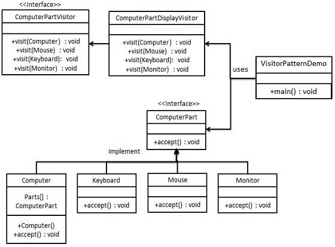

###### Steps
1. `ComputerPart.java`

		public interface ComputerPart {
			public void accept(ComputerPartVisitor computerPartVisitor);
		}

2. `Keyboard.java`

		public class Keyboard implements ComputerPart {
			@Override
			public void accept(ComputerPartVisitor computerPartVisitor) {
				computerPartVisitor.visit(this);
			}
		}

3. `Monitor.java`

		public class Monitor implements ComputerPart {
			@Override
			public void accept(ComputerPartVisitor computerPartVisitor) {
				computerPartVisitor.visit(this);
			}
		}

4. `Mouse.java`

		public class Mouse implements ComputerPart {
			@Override
			public void accept(ComputerPartVisitor computerPartVisitor) {
				computerPartVisitor.visit(this);
			}
		}

5. `Computer.java`

		public class Computer implements ComputerPart {
			ComputerPart[] parts;

			public Computer() {
				parts = new ComputerPart[] {new Mouse(), new Keyboard(), new Monitor()}
			}

			@Override
			public void accept(ComputerPartVisitor computerPartVisitor) {
				for (int i = 0; i < parts.length; i++)
					parts[i].accept(computerPartVisitor);
				computerPartVisitor.visit(this);
			}
		}

6. `ComputerPartVisitor.java`

		public interface ComputerPartVisitor {
			public void visit(Computer computer);
			public void visit(Mouse mouse);
			public void visit(Keyboard keyboard);
			public void visit(Monitor monitor);
		}

7. `ComputerPartDisplayVisitor.java`

		public class ComputerPartDisplayVisitor implements ComputerPartVisitor {
			@Override
			public void visit(Computer computer) {
				System.out.println("Displaying computer.");
			}

			@Override
			public void visit(Mouse mouse) {
				System.out.println("Displaying Mouse.");
			}

			@Override
			public void visit(Keyboard keyboard) {
				System.out.println("Displaying Keyboard.");
			}
	
			@Override
			public void visit(Monitor monitor) {
				System.out.println("Displaying Monitor.");
			}
		}

8. `VisitorPatternDemo.java`

		public class VisitorPatternDemo {
			public static void main(String[] args) {
				ComputerPart computer = new Computer();
				computer.accept(new ComputerPartDisplayVisitor());
			}
		}

##### MVC Pattern
1. MVC: Model View Controller
2. Separates app concerns into
	1. **Model**: Object or POJO carrying data
		1. Can also have logic to update controller if data changes
	2. **View**: Visualization of data that model contains
	3. **Controller**:
		1. Acts on **Model** and **View**
		2. Controls data flow into model
		3. Updates view when data changes

###### Implementation
1. `Student` object: Model
2. `StudentView`: view class that prints student details on console
3. `StudentController`:
	1. Stores data in `Student` object
	2. Updates view `StudentView` when data changes

	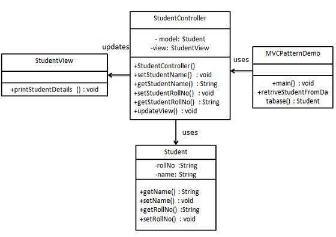

4. Steps
	1. `Student.java`

			public class Student {
				private String rollNo;
				private String name;

				public String getRollNo() {
					return rollNo;
				}

				public void setRollNo(String rollNo) {
					this.rollNo = rollNo;
				}

				public String getName() {
					return name;
				}

				public String setName(String name) {
					this.name = name;
				}
			}

	2. `StudentView.java`

			public class StudentView {
				public void printStudentDetails(String studentName, String studentRollNo) {
					System.out.println("Student: ");
					System.out.println("Name: " + studentName);
					System.out.println("Roll No: " + studentRollNo);
				}
			}

	3. `StudentController.java`

			public class StudentController {
				private Student model;
				private StudentView view;

				public StudentController(Student model, StudentView view) {
					this.model = model;
					this.view = view;
				}

				public void setStudentName(String name) {
					model.setName(name);
				}

				public String getStudentName() {
					return model.getName();
				}

				public void setStudentRollNo(String rollNo) {
					model.setRollNo(rollNo);
				}

				public String getStudentRollNo() {
					return model.getRollNo();
				}

				public void updateView() {
					view.printStudentDetails(model.getName(), model.getRollNo());
				}
			}

	4. `MVCPatternDemo.java`

			public class MVCPatternDemo {
				public static void main(String[] args) {
					// fetch student record based on his roll no from the database
					Student model = retrieveStudentFromDatabase();
					
					// Creation of view: to write student details to console
					Student view = new StudentView();

					StudentController controller = new StudentController(model, view);

					controller.updateView();

					// update model data
					controller.setStudentName("John");

					controller.updateView();
				}

				private static Student retrieveStudentFromDatabase() {
					Student student = new Student();
					student.setName("Robert");
					student.setRollNo("10");
					return student;
				}
			}

##### Business Delegate Pattern
1. Used to decouple business layer and presentation layer
2. Reduces communication/ lookup of functionality in presentation tier code to business tier code
3. Entities in Business Delegate Pattern:
	1. **Client**: Presentation tier code (JSP, Servlet or Java UI)
	2. **Business Delegate**: Single entry point class for client entities (provide access to Business Service methods)
	3. **LookUp Service**: Responsible to get business implementation and provide business object access to business delegate object (?)
	4. **Business Service**: Interface. Concrete classes implement it to provide actual business implementation logic.

###### Implementation
1. `Client`
2. `BusinessDelegate`
3. `BusinessService`
4. `LookUpService`
5. `JMSService`
6. `EJBService`
7. `BusinessDelegatePatternDemo`: Demo class

	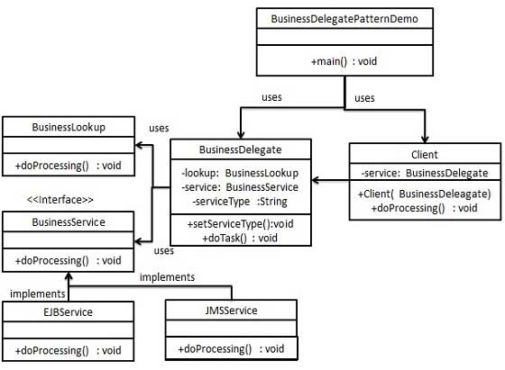

###### Steps
1. `BusinessService.java`

		public interface BusinessService {
			public void doProcessing();
		}

2. `EJBService.java`

		public class EJBService implements BusinessService {
			@Override
			public void doProcessing() {
				System.out.println("Processing task by invoking EJB Service");
			}
		}

3. `JMSService.java`

		public class JMSService implements BusinessService {
			@Override
			public void doProcessing() {
				System.out.println("Processing task by invoking JMS Service");
			}
		}

4. `BusinessLookUp.java`

		public class BusinessLookup {
			public BusinessService getBusinessService(String serviceType) {
				if (serviceType.equalsIgnoreCase("EJB")) {
					return new EJBService();
				} else {
					return new JMSService();
				}
			}
		}

5. `BusinessDelegate.java`

		public class BusinessDelegate {
			private BusinessLookup lookupService = new BusinessLookup();
			private BusinessService businessService;
			private String serviceType;

			public void setServiceType(String serviceType) {
				this.serviceType = serviceType;
			}

			public void doTask() {
				businessService = lookupService.getBusinessService(serviceType);
				businessService.doProcessing();
			}
		}

6. `Client.java`

		public class Client {
			BusinessDelegate businessService;

			public Client(BusinessDelegate businessService) {
				this.businessService = businessService;
			}

			public void doTask() {
				businessService.doTask();
			}
		}

7. `BusinessDelegatePatternDemo.java`

		public class BusinessDelegatePatternDemo {
			public static void main(String[] args) {
				BusinessDelegate businessDelegate = new BusinessDelegate();
				businessDelegate.setServiceType("EJB");

				Client client = new Client(businessDelegate);
				client.doTask();

				businessDelegate.setServiceType("JMS");
				client.doTask();
			}
		}

##### Composite Entity Pattern
1. Used in EJB persistence mechanism
2. Composite entity: EJB entity bean which reperesents graph of objects.
	1. If a composite entity is updated, internal descendent objects beans get updated automatically.
3. Participants:
	1. **Composite Entity** Primary entity bean. Can be coarse grained or contain coarse grained object used for persistence
	2. **Coarse-Grained Object** Contains dependent objects
		1. It has its lifecycle
		2. It manages lifecycle of dependent objects
	3. **Dependent Object** Depends on coarse grained object for its persistence lifecycle.
	4. **Strategies** represents how to implement composite entity (?)

###### Implementation
1. `CompositeEntity`
2. `CoarseGrainedObject`: contains dependent objects
3. `CompositeEntityPatternDemo`: Demo class
4. `Client`

	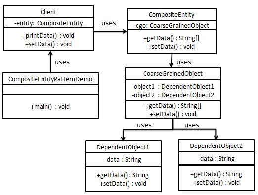

###### Steps
1. `DependentObject1.java`

		public class DependentObject1 {
			private String data;

			public void setData(String data) {
				this.data = data;
			}
	
			public String getData() {
				return data;
			}
		}

2. `DependentObject2.java`

		public class DependentObject2 {
			private String data;

			public void setData(String data) {
				this.data = data;
			}

			public String getData() {
				return data;
			}
		}

3. `CoarseGrainedObject.java`

		public class CoarseGrainedObject {
			DependentObject1 do1 = new DependentObject1();
			DependentObject2 do2 = new DependentObject2();

			public void setData(String data1, String data2) {
				do1.setData(data1);
				do2.setData(data2);
			}

			public String[] getData() {
				return new String[] {do1.getData(), do2.getData()};
			}
		}

4. `CompositeEntity.java`

		public class CompositeEntity {
			private CoarseGrainedObject cgo = new CoarseGrainedObject();

			public void setData(String data1, String data2) {
				cgo.setData(data1, data2);
			}

			public String[] getData() {
				return cgo.getData();
			}
		}

5. `Client.java`

		public class Client {
			private CompositeEntity compositeEntity = new CompositeEntity();

			public void printData() {
				for (int i = 0; i < compositeEntity.getData().length; i++) {
					System.out.println("Data: " + compositeEntity.getData()[i]);
				}
			}

			public void setData(String data1, String data2) {
				compositeEntity.setData(data1, data2);
			}
		}

6. `CompositeEntityDesignPattern.java`

		public class CompositeEntityPatternDemo {
			public static void main(String[] args) {
				Client client = new Client();
				client.setData("Test", "Data");
				client.printData();
				client.setData("Second Test", "Data1");
				client.printData();
			}
		}

##### Data Access Object Pattern
1. Separates low level data accessing API/ operations from high level business services.
2. Participants
	1. **Data Access Object Interface**: Defines standard operations performed on model object(s)
	2. **Data Access Object concrete class**: Class implements DAO interface.
		1. Responsible for getting data from data source (database/ xml/ other storage mechanism)
	3. **Model Object** or **Value Object**: Simple POJO containing get/set methods to store data retrieved using DAO class.

###### Implementation
1. `Student`: Model object or Value object
2. `StudentDao`: Data access object interface
3. `StudentDaoImpl`: Concrete class implementing DAO interface
4. `DaoPatternDemo`: demo class

	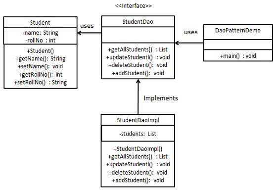

###### Steps
1. `Student.java`

		public class Student {
			private String name;
			private int rollNo;

			Student(String name, int rollNo) {
				this.name = name;
				this.rollNo = rollNo;
			}

			public String getName() {
				return name;
			}

			public void setName(String name) {
				this.name = name;
			}

			public int getRollNo() {
				return rollNo;
			}

			public void setRollNo(int rollNo) {
				this.rollNo = rollNo;
			}
		}

2. `StudentDao.java`

		import java.util.List;

		public interface StudentDao {
			public List<Student> getAllStudents();
			public Student getStudent(int rollNo);
			public void updateStudent(Student student);
			public void deleteStudent(Student student);
		}

3. `StudentDaoImpl.java`

		import java.util.ArrayList;
		import java.util.List;

		public class StudentDaoImpl implements StudentDao {
			// List is working as a database
			List<Student> students;

			public StudentDaoImpl() {
				students = new ArrayList<Student>();
				Student student1 = new Student("Robert", 0);
				Student student2 = new Student("John", 1);
				students.add(student1);
				students.add(student2);
			}

			@Override
			public void deleteStudent(Student student) {
				students.remove(student.getRollNo());
				System.out.println("Student: Roll No " + student.getRollNo() + ", delete from database");
			}

			// retrieve list of students from the database
			@Override
			public List<Student> getAllStudents() {
				return students;
			}

			@Override
			public Student getStudent(int rollNo) {
				return students.get(rollNo);
			}

			@Override
			public void updateStudent(Student student) {
				students.get(student.getRollNo()).setName(student.getName());
				System.out.println("Student: Roll No " + student.getRollNo() + ", update in the database")
			}
		}

4. `DaoPatternDemo.java`

		public class DaoPatternDemo {
			public static void main(String[] args) {
				StudentDao studentDao = new StudentDaoImpl();

				// print all students
				for (Student student: studentDao.getAllStudents()) {
					System.out.println("Student: [RollNo : " + student.getRollNo() + ", Name : " + student.getName() + " ]");
				}

				// Update student
				Student student = studentDao.getAllStudents().get(0);
				student.setName("Michael");
				studentDao.updateStudent(student);

				// get the student
				studentDao.getStudent(0);
				System.out.println("Student: [RollNo : " + student.getRollNo() + ", Name : " + student.getName() + " ]");
			}
		}

##### Front Controller Pattern
1. Provides centralized request handling mechanism
	1. All requests will be handled by the single handler
2. It can do
	1. Authentication
	2. Authorization
	3. Logging
	4. Request tracking
3. It passes request to corresponding handler
4. Entities:
	1. **Front Controller**: Single handler for all requests coming from app
	2. **Dispatcher**: Dispatcher can be used to dispatch request to specific handler
	3. **View**: Object for which request is made

###### Implementation
1. `FrontController`
2. `Dispatcher`
3. `HomeView`, `StudentView`: views
4. `FrontControllerPatternDemo`: demo class

	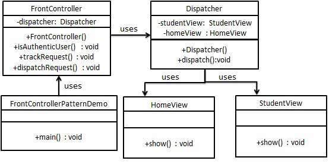

###### Steps
1. `HomeView.java`

		public class HomeView {
			public void show() {
				System.out.println("Displaying Home Page");
			}
		}

2. `StudentView.java`

		public class StudentView {
			public void show() {
				System.out.println("Displaying Student Page");
			}
		}

3. `Dispatcher.java`

		public class Dispatcher {
			private StudentView studentView;
			private HomeView homeView;

			public Dispatcher() {
				studentView = new StudentView();
				homeView = new HomeView();
			}

			public void dispatch(String request) {
				if (request.equalsIgnoreCase("STUDENT")) {
					studentView.show();
				} else {
					homeView.show();
				}
			}
		}

4. `FrontController.java`

		public class FrontController {
			private Dispatcher dispatcher;

			public FrontController() {
				dispatcher = new Dispatcher();
			}

			private boolean isAuthenticUser() {
				System.out.println("User is authenticated successfully.");
			}

			private void trackRequest(String request) {
				System.out.println("Page requested: " + request);
			}

			public void dispatchRequest(String request) {
				//log each request
				trackRequest(request);

				//authenticte the user
				if(isAuthenticUser()) {
					dispatcher.dispatch(request);
				}
			}
		}

5. `FrontControllerPatternDemo.java`

		public class FrontControllerPatternDemo {
			public static void main(String[] args) {
				FrontController frontController = new FrontController();
				frontController.dispatchRequest("HOME");
				frontController.dispatchRequest("STUDENT");
			}
		}

##### Intercepting Filter Pattern
1. Used for doing pre-processing/ post-processing with request or response of an app.
2. Filter is applied to request before passing it to the actual target app.
3. Applications:
	1. Authentication
	2. Authorization
	3. Logging
	4. Request tracking
4. Entities
	1. **Filter**: Performs a task prior to or after execution of a request by request handler
	2. **Filter Chain**: Carries multiple filters and helps to execute the filters in a defined order
	3. **Target**: Request handler
	4. **Filter Manager**: Manages filters and filter chain
	5. **Client**: Sends request to Target object

###### Implementation
1. `FilterChain`
2. `FilterManager`
3. `Target`
4. `Client`
5. `AuthenticationFilter`, `DebugFilter`: Concrete filter implementations
6. `InterceptingFilterDemo`: Demo class

	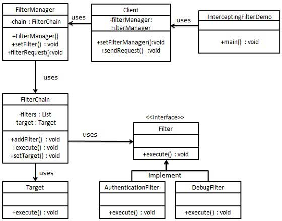

###### Steps
1. `Filter.java`

		public interface Filter {
			public void execute(String request);
		}

2. `AuthenticationFilter.java`

		public class AuthenticationFilter implements Filter {
			@Override
			public void execute(String request) {
				System.out.println("Authenticating request: " + request);
			}
		}

3. `DebugFilter.java`

		public class DebugFilter implements Filter {
			@Override
			public void execute(String request) {
				System.out.println("request log: " + request);
			}
		}

4. `Target.java`

		public class Target {
			public void execute(String request) {
				System.out.println("Executing request: " + request);
			}
		}

5. `FilterChain.java`

		import java.util.ArrayList;
		import java.util.List;

		public class FilterChain {
			private List<Filter> filters = new ArrayList<Filter>();
			private Target target;

			public void addFilter(Filter filter) {
				filters.add(filter);
			}

			public void execute(String request) {
				for (Filter filter: filters) {
					filter.execute(request);
				}
				target.execute();
			}

			public void setTarget(Target target) {
				this.target = target;
			}
		}

6. `FilterManager.java`

		public class FilterManager {
			FilterChain filterChain;
			
			public FilterManager(Target target) {
				filterChain = new FilterChain();
				filterChain.setTarget(target);
			}

			public void setFilter(Filter filter) {
				filterChain.addFilter(filter);
			}

			public void filterRequest(String request) {
				filterChain.execute(request);
			}
		}

7. `Client.java`

		public class Client {
			FilterManager filterManager;
			
			public void setFilterManager(FilterManager filterManager) {
				this.filterManager = filterManager;
			}

			public void sendRequest(String request) {
				filterManager.filterRequest(request);
			}
		}

8. `InterceptingFilterDemo.java`

		public class InterceptingFilterDemo {
			public static void main(String[] args) {
				FilterManager filterManager = new FilterManager(new Target());
				filterManager.setFilter(new AuthenticationFilter());
				filterManager.setFilter(new DebugFilter());

				Client client = new Client();
				client.setFilterManager(filterManager);
				client.sendRequest("HOME");
			}
		}

##### Service Locator Pattern
1. Used to locate services using JNDI lookup.
2. It makes of caching technique due to the cost associated with JNDI lookup.
	1. First Service Locator looks up JNDI and caches the service object
	2. Subsequently Service Locator finds the service object in the cache
3. Entities
	1. **Service**: Service that processes request. Reference is lookup up in JNDI server
	2. **Context/ Initial Context**: JNDI context that carries reference to service for lookup
	3. **Service Locator**: Single point of contact to get services by JNDI lookup and caching
	4. **Cache**: Used to store references of services for reuse
	5. **Client**: Object that invokes service via Service Locator.

###### Implementation
1. `ServiceLocator`
2. `InitialContext`
3. `Cache`
4. `Service`: Interface
5. `Service1` , `Service2`: concrete services
6. `ServiceLocatorPatternDemo`: Demo class

	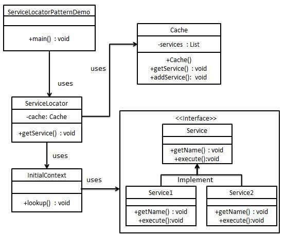

###### Steps
1. `Service.java`

		public interface Service {
			public String getName();
			public void execute();
		}

2. `Service1.java`: concrete service

		public class Service1 implements Service {
			@Override
			public void execute() {
				System.out.println("Executing Service1");
			}

			@Override
			public String getName() {
				return "Service1";
			}
		}

3. `Service2.java`: concrete service

		public class Service2 implements Service {
			@Override
			public void execute() {
				System.out.println("Executing Service2");
			}

			@Override
			public String getName() {
				return "Service2";
			}
		}

4. `InitialContext.java`

		public class InitialContext {
			public Object lookup(String jndiName) {
				if (jndiName.equalsIgnoreCase("SERVICE1")) {
					System.out.println("Looking up and creation of a new Service1 object");
					return new Service1();
				} else if (jndiName.equalsIgnoreCase("SERVICE2")) {
					System.out.println("Looking up and creation of a new Service2 object");
					return new Service2();
				}
			}
		}

5. `Cache.java`

		import java.util.ArrayList;
		import java.util.List;

		public class Cache {
			private List<Service> services;

			public Cache() {
				services = new ArrayList<Service>();
			}

			public Service getService(String serviceName) {
				for (Service service: services) {
					if(service.getName().equalsIgnoreCase(serviceName)) {
						System.out.println("Returning cached " + serviceName + "object");
						return  service;
					}
				}
				return null;
			}

			public void addService(Service newService) {
				boolean exists = false;

				for (Service service : services) {
					if (service.getName().equalsIgnoreCase(newService.getName())) {
						exists = true;
					}
				}
				if (!exists) {
					services.add(newService);
				}
			}
		}

6. `ServiceLocator.java`

		public class ServiceLocator {
			private static Cache cache;

			static {
				cache = new Cache();
			}

			public static Service getService(String jndiName) {
				Service service = cache.getService(jndiName);

				if(service != null) {
					return service;
				}

				InitialContext context = new InitialContext();
				Service service1 = (Service) context.lookup(jndiName);
				cache.addService(service1);
				return service1;
			}
		}

7. `ServiceLocatorPatternDemo.java`

		public class ServiceLocatorPatternDemo {
			public static void main(String[] args) {
				Service service = ServiceLocator.getService("Service1");
				service.execute();
				service = ServiceLocator.getService("Service2");
				service.execute();
				service = ServiceLocator.getService("Service1");
				service.execute();
				service = ServiceLocator.getService("Service2");
				service.execute();
			}
		}

##### Transfer Object Pattern
1. Used to pass data with multiple attributes from client to server
2. Also known as value object
3. Transfer Object: simple POJO with getter/setter methods and is serializable to be transfered over the network.
	1. It has no behavior
4. Server side business class fetches data from db and fills POJO and sends it to client or pass it by value.
5. Transfer object is read only for client.
6. Client can build a transfer object and pass it to server to update values in db in one shot.
7. Entities:
	1. **Business Object**: Business service fills transfer object with data
	2. **Transfer Object**: POJO that has set/get attributes only
	3. **Client**: Requests or sends transfer object to business object

	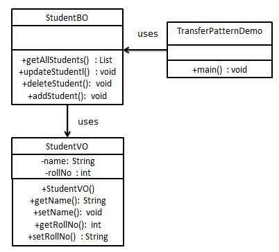

###### Implementation
1. `StudentBO`: Business object
2. `Student`: transfer object

###### Steps
1. `StudentVO.java`

		public class StudentVO {
			private String name;
			private int rollNo;

			StudentVO(String name, int rollNo) {
				this.name = name;
				this.rollNo = rollNo;
			}

			public String getName() {
				return name;
			}

			public void setName(String name) {
				this.name = name;
			}

			public int getRollNo() {
				return rollNo;
			}

			public void setRollNo(int rollNo) {
				this.rollNo = rollNo;
			}
		}

2. `StudentBO.java`

		import java.util.ArrayList;
		import java.util.List;

		public class StudentBO {
			//list is working as a database
			List<StudentVO> students;

			public StudentBO() {
				students = new ArrayList<StudentVO>();
				StudentVO student1 = new StudentVO("Robert", 0);
				StudentVO student2 = new StudentVO("John", 1);
				students.add(student1);
				students.add(student2);
			}

			public void deleteStudent(StudentVO student) {
				students.remove(student.getRollNo());
				System.out.println("Student: Roll No " + student.getRollNo() + ", deleted from datastore");
			}

			//retrive list of students from the database
			public List<StudentVO> getAllStudents() {
				return students;
			}

			public StudentVO getStudent(int rollNo) {
				return students.get(rollNo);
			}

			public void updateStudent(StudentVO student) {
				students.get(student.getRollNo()).setName(student.getName());
				System.out.println("Student: Roll No " + student.getRollNo() + ", updated in datastore");
			}
		}

3. `TransferObjectPatternDemo.java`

		public class TransferObjectPatternDemo {
			public static void main(String[] args) {
				StudentBO studentBusinessObject = new StudentBO();

				//print all students
				for (StudentVO student : studentBusinessObject.getAllStudents()) {
					System.out.println("Student: [RollNo : " + student.getRollNo() + ", Name : " + student.getName() + " ]");
				}

				//update student
				StudentVO student = studentBusinessObject.getAllStudents().get(0);
				student.setName("Michael");
				studentBusinessObject.updateStudent(student);

				//get the student
				student = studentBusinessObject.getStudent(0);
				System.out.println("Student: [RollNo : " + student.getRollNo() + ", Name : " + student.getName() + " ]");
			}
		}