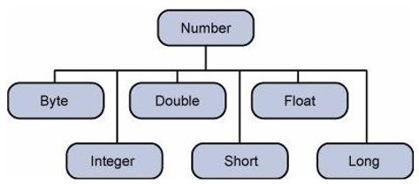
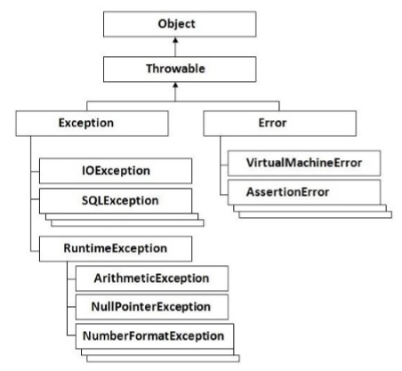

# Groovy Tutorial #

## Groovy - Home ##
1. It is an object oriented language based on Java platform
2. Latest version: 2.4
3. Fundamentals of Groovy and how to put it into practice

### Audience ###
1. Who wants to learn the basics of Groovy programming

### Prerequisites ###
1. Java (or similar OO language)

## Groovy - Overview ##
### Features of Groovy ###
1. Support for static and dynamic typing
2. Support for operator overloading
3. Native syntax for lists and associative arrays
4. Native support for regular expressions
5. Native support for various markup languages such as XML and HTML
6. Syntax is similar to Java
7. We can use Java libraries in Groovy
8. Extends `java.lang.Object`

### Official website ###
1. [http://www.groovy-lang.org/](http://www.groovy-lang.org/)

## Groovy - Environment ##
### Binary download and installation ###
1. Visit [www.groovy-lang.org/download.html](www.groovy-lang.org/download.html)
2. Goto Windows Installer section
3. Click on option to download
4. Open the installer
5. Follow the wizard
6. Run command `groovysh` from command prompt

### Installation for Mac OSX ###
1. Install sdkman:
	1. `curl -s "https://get.sdkman.io" | bash`
	2. `source "$HOME/.sdkman/bin/sdkman-init.sh"`
	3. `sdk version`
2. Install groovy:
	1. `sdk install groovy`
	2. `groovy -version`

### Gradle ###
1. `'org.codehaus.groovy:groovy:2.4.5`: include it as part of gradle build

### Maven ###

		<groupId>org.codehaus.groovy</groupId>
		<artifactId>groovy</artifactId>
		<version>2.4.5</version>

## Groovy - Basic Syntax ##
### Creation of First Hello World Program ###
1. Example:

		class Example {
			static void main(String[] args) {
				// Using a simple println statement to print output to the console
				println('Hello World!');
			}
		}

### Import Statement in Groovy ###
1. `import` imports functionality of other libraries
2. Example: `MarkupBuilder` class for generating HTML or XML markup
	
		import groovy.xml.MarkupBuilder
		dev xml = new MarkupBuilder()

3. Following libraries are automatically imported by Groovy:

		import java.lang.*
		import java.util.*
		import java.io.*
		import java.net.*

		import groovy.lang.*
		import groovy.util.*

		import java.math.BigInteger
		import java.math.BigDecimal

### Tokens in Groovy ###
1. token: keywork, identifier, string literal, symbol
	1. Example: `println("Hello World")`
		1. Token 1: `println`
		2. Token 2: `"Hello World"`

### Comments in Groovy ###
1. `// Single line comment`
2. `/* Multiline comment */`

### Semicolons ###
1. Used to distinguish between multiple statements

		class Example {
			static void main(String[] args) {
				// One can see the use of a semi-colon after each statement
				def x = 5;
				println('Hello World');
			}
		}

### Identifiers ###
1. Used to define variables, functions
	1. Start with letter, $ or _ (no number)
2. Examples:
	1. `def employeename`
	2. `def student1`
	3. `def student_name`
3. `def` defines an identifier
4. Example:

		class Example {
			static void main(String[] args) {
				// One can see the use of a semi-colon after each statement
				def x = 5;
				println('Hello World');
			}
		}

### Keywords ###
1. Special reserved words:
	1. **`as`**
	2. **`assert`**
	3. `break`
	4. `case`
	5. `catch`
	6. `class`
	7. `const`
	8. `continue`
	9. **`def`**
	10. `default`
	11. `do`
	12. `else`
	13. `enum`
	14. **`extends`**
	15. `false`
	16. `finally`
	17. `for`
	18. **`goto`**
	19. `if`
	20. `implements`
	21. `import`
	22. **`in`**
	23. `instanceof`
	24. `interface`
	25. `new`
	26. **`pull`**
	27. `package`
	28. `return`
	29. `super`
	30. `switch`
	31. `this`
	32. `throw`
	33. `throws`
	34. **`trait`**
	35. `true`
	36. `try`
	37. `while`

### Whitespaces ###
1. blanks, tabs, newline characters and comments
2. Separates one part of statement from another
3. Example:

		def x = 5;

### Literals ###
1. notation that represents fixed value in groovy
2. For
	1. integer: `12`
	2. floating-point number: `1.45`
	3. character: `'a'`
	4. string: `"string"`

## Groovy - Data Types ##
1. Variables: reserved memory locations to store values
2. Based on datatype OS allocates memory and decides waht can be stored in the reserved memory

### Built-in Data Types ###
1. Datatypes:
	1. `byte`
	2. `short`
	3. `int`
	4. `long`
	5. `float`
	6. `double`
	7. `char`
	8. `boolean`
	9. `String`

### Bound values ###
1. Ranges:
	1. `byte`: -128 to 127
	2. `short`: -32,768 to 32,767
	3. `int`: -2,147,483,648 to 2,147,483,647
	4. `long`: ...
	5. `float`: ...
	6. `double`: ... 

### Class Numeric ###
1. Wrapper types:
	1. `java.lang.Byte`
	2. `java.lang.Short`
	3. `java.lang.Integer`
	4. `java.lang.Long`
	5. `java.lang.Float`
	6. `java.lang.Double`
2. For arbitrary precision arithmetic:
	1. `java.math.BigInteger`: `30g`
		1. Immutable signed integer
	2. `java.math.BigDecimal`: `3.5g`
		1. Immutable signed decimal
3. Example:

		class Example {
			static void main(String[] args) {
				// Example of an int datatype
				int x = 5;

				// Example of a long datatype
				long y = 100L;

				// Example of a double datatype
				double b = 10.5e40;

				// Example of a BigInteger datatype
				BigInteger bi = 30g;

				// Example of a BigDecimal datatype
				BigDecimal bd = 3.5g;

				println(x);
				println(y);
				println(a);
				println(b);
				println(bi);
				println(bd);
			}
		}

## Groovy - Variables ##
1. Two ways to define:
	1. native syntax (`int x = 5`)
	2. using `def` (`def x = 5`)
2. Mandatory to declare using either syntax before using them

### Variable Declarations ###
1. Declaration tells compiler where and how much of storage to allocate
2. Example:

		class Example {
			static void main(String[] args) {
				// x is defined as a variable
				String x = "Hello";

				// The value of the variable is printed to the console
				println(x);
			}
		}

### Naming Variables ###
1. Must begin with letter or _.
2. They are case sensitive
3. Example:

		class Example {
			static void main(String[] args) {
				// Defining a variable in lowercase
				int x = 5

				// Defining a variable in uppercase
				int X = 6
				
				// Defining a variable with the underscore in it's name
				def _Name = 'Joe'

				println(x)
				println(X)
				println(_Name)
			}
		}

### Printing Variables ###
1. Example:

		class Example {
			static void main(String[] args) {
				// Initializing 2 variables
				int x = 5
				int X = 6

				// Printing the value of the variables to the console
				println('The value of x is ' + x + ' The value of X is ' + X)
			}
		}

## Groovy - Operators ##
1. Operator is a symbol that tells compiler to perform specific mathematical or logical manipulations
2. Types of operators:
	1. Arithmetic operators
	2. Relational operators
	3. Logical operators
	4. Bitwise operators
	5. Assignment operators

### Arithmetic Operators ###
1. `+`, `-`, `*`, `/`, `%`, `++`, `--`

### Relational operators ###
1. `==`, `!=`, `<`, `<=`, `>`, `>=`

### Logical Operators ###
1. `&&`, `||`, `!`

### Bitwise Operators ###
1. `&`, `|`, `^`, `~`

### Assignment operators ###
1. `+=`
2. `-=`
3. `*=`
4. `/=`
5. `%=`

### Range Operators ###
1. `min..max` **(M)**
2. Example: `def range = 0..5`

		class Example {
			static void main(String[] args) {
				def range = 5..10
				println(range)
				println(range.get(2))
			}
		}

	1. `get`: takes index

## Groovy - Loops ##
1. **While statement**
	1. Syntax:

			while(condition) {
				statement #1
				statemtnt #2
				...
			}

	2. Example:

			class Example {
				static void main(String[] args) {
					int count = 0

					while(count < 5) {
						println(count)
						count++
					}
				}
			}

2. **For Statement**
	1. Syntax:

			for(variable declaration; expression; increment) {
				statement #1
				statement #2
				...
			}

	2. Classic for statement parts:
		1. variable declaration: executed only once for entire loop
		2. expression: evaluated for each iteration of loop
		3. increment: logic for incrementing variable(s)
	3. Example:

			class Example {
				static void main(String[] args) {
					for(int i = 0; i < 5; i++) {
						println(i)
					}
				}
			}

3. **For-in Statement**
	1. Syntax:

			for(variable in range) {
				...
			}

	2. Example:

			class Example {
				static void main(String[] args) {
					int[] array = [0, 1, 2, 3];

					for(int i in array) {
						println(i);
					}
				}
			}

	3. Example:

			class Example {
				static void main(String[] args) {
					for(int i in 1..5) {
						println(i)
					}
				}
			}

	4. Example:

			class Example {
				static void main(String[] args) {
					def employee = ["Ken": 21, "John": 25, "Sally": 22]

					for(emp in Employee) {
						println(emp)
					}
				}
			}

### Loop Control Statements ###
1. **Break Statement**
	1. Used to alter flow of control inside loops and switch statments
	2. It causes termination of the innermost enclosing loop
	3. Example:

			class Example {
				static void main(String[] args) {
					int[] array = [0, 1, 2, 3];

					for(int i in array) {
						println(i);
						if(i == 2)
							break;
					}
				}
			}

2. **Continue Statement**
	1. Use is restricted to while and for loops
	2. When executed, control is immediately be passed to test condition of nearest enclosing loop to determine whether loop will continue
	3. Example:

			class Example {
				static void main(String[] args) {
					int[] array = [0, 1, 2, 3]

					for (i in array) {
						if (i == 2)
							continue
						println(i)
					}
				}
			}

## Groovy - Decision Making ##
1. **If Statement**
	1. Syntax:

			if(condition) {
				statement #1
				statement #2
				...
			}

	2. Example:

			class Example {
				static void main(String[] args) {
					// Initializing a local variable
					int a = 2

					// Check for the boolean condition
					if (a < 100) {
						// If the condition is true print the following statement
						println("The value is less than 100")
					}
				}
			}

2. **If/else Statement**
	1. Syntax:

			if(condition) {
				statement #1
				statement #2
				...
			} else {
				statement #3
				statement #4
			}

	2. Example:

			class Example {
				static void main(String[] args) {
					// Initializing a local variable
					int a = 2

					// Check for the boolean condition
					if (a < 100) {
						// If the condition is true print the following statement
						println("The value is less than 100")
					} else {
						// If the condition is false print the following statement
						println("The value is greater than 100")
					}
				}
			}

3. **Nested If Statement**
	1. Syntax:

			if(condition) {
				statement #1
				statement #2
				...
			} else if(condition) {
				statement #3
				statement #4
			} else {
				statement #5
				statement #6
			}

	2. Example:

			class Example {
				static void main(String[] args) {
					// Initializing a local variable
					int a = 12

					// Check for the boolean condition
					if (a > 100) {
						// If the condition is true print the following statement
						println("The value is less than 100")
					} else if (a > 5) {
						// If the condition is true print the following statement
						println("The value is greater than 5 and greater than 100")
					} else {
						// If the condition is false print the following statement
						println("The value of a is less than 5")
					}
				}
			}

4. **Switch Statement**
	1. Syntax:

			switch(expression) {
				case expression #1:
				statement #1
				...
				case expression #2:
				statement #2
				...
				case expression #N:
				statement #N
				...
				default:
				statement #Default
				...
			}

	2. Example:

			class Example {
				static void main(String[] args) {
					// Initializing a local variable
					int a = 2

					// Evaluating the expression value
					switch(a) {
						// There is case statement defined for 4 cases
						// Each case statement section has a break condition to exit the loop

						case 1:
							println("The value of a is One")
							break
						case 2:
							println("The value of a is Two")
							break
						case 3:
							println("The value of a is Three")
							break
						case 4:
							println("The value of a is Four")
							break
						default:
							println("The value of a is unknown")
							break
					}
				}
			}

5. **Nested Switch Statement**
	1. Example:

			class Example {
				static void main(String[] args) {
					// Initializing 2 variables i and j
					int i = 0
					int j = 1

					// First evaluating the value of variable i
					switch(i) {
						case 0:
							// Next evaluating the value of variable j
							switch(j) {
								case 0:
									println("i is 0, j is 0")
									break
								case 1:
									println("i is 0, j is 1")
									break
								
								// The default condition for the inner switch statement
								default:
								println("nested default case!!")
							}
						break
						
						// The default condition for the outer switch statement
						default:
							println("No matching case found!!")
					}
				}
			}

## Groovy - Methods ##
1. Method is defined with return type or `def` keyword
2. Methods can receive any number of arguments
	1. Types need not be explicitly defined for arguments
3. Default visibility modifier is `public`
4. Example: No parameter method

		def methodName() {
			// Method code
		}

5. Example: Simple method

		class Example {
			static def DisplayName() {
				println("This is how method work in groovy");
				println("This is an example of a simple method");
			}

			static void main(String[] args) {
				DisplayName();
			}
		}

### Method Parameters ###
1. Syntax:

		def methodName(parameter1, parameter2, parameter3) {
			// Method code goes here
		}

2. Example:

		class Example {
			static void sum(int a, int b) {
				int c = a + b;
				println(c);
			}

			static void main(String[] args) {
				sum(10, 5);
			}
		}

### Default Parameters ###
1. Default parameters should be defined at the end of the list
2. Syntax:

		def someMethod(parameter1, parameter2 = 0, parameter3 = 0) {
			// Method code goes here
		}

3. Example:

		class Example {
			static void sum(int a, int b = 5) {
				int c = a + b;
				println(c);
			}

			static void main(String[] args) {
				sum(6);
			}
		}

### Method Return Values ###
1. Example:

		class Example {
			static int sum(int a, int b = 5) {
				int c = a + b;
				return c;
			}

			static void main(String[] args) {
				println(sum(6));
			}
		}

### Instance methods ###
1. Class: Blue print or template for creation of different objects which defines its properties and behaviors.
2. Instance methods: methods accessed by creation of objects of class.
3. Example:

		class Example {
			int x;
	
			public int getX() {
				return x;
			}

			public void setX(int pX) {
				x = pX;
			}

			static void main(String[] args) {
				Example ex = new Example();
				ex.setX(100);
				println(ex.getX());
			} 
		}

### Local and External Parameter Names ###
1. Example:

		class Example {
			static int x = 100;

			public static int getX() {
				int lx = 200;
				println(lx);
				return x;
			}

			static void main(String[] args) {
				println(getX());
			}
		}

### this method for Properties ###
1. `this` used to access instance members

		class Example {
			int x = 100;

			public int getX() {
				this.x = 200;
				return x;
			}

			static void main(String[] args) {
				Example ex = new Example();
				println(ex.getX());
			}
		}

## Groovy - File I/O ##
1. There are helper methods when working with I/O
	1. For
		1. Reading files
		2. Writing to files
		3. Traversing file trees
		4. Reading and writing data objects to files
	2. Java classes additionally
		1. `java.io.File`
		2. `java.io.InputStream`
		3. `java.io.OutputStream`
		4. `java.io.Reader`
		5. `java.io.Writer`

### Reading files ###
1. Example: Output all lines of text file
	1. `eachLine` is in-built in `File` class in Groovy which is used to read each line of text

			import java.io.File
			class Example {
				static void main(String[] args) {
					new File("E:/Example.txt").eachLine {
						line -> println "line: $line";
					}
				}
			}

### Reading the Contents of a File as an Entire String ###
1. Example: Getting entire content as a string using `text` property of `File` class

		class Example {
			static void main(String[] args) {
				File file = new File("E:/Example.txt")
				println file.text
			}
		}

### Writing to Files ###
1. Example:

		import java.io.File
		class Example {
			static void main(String[] args) {
				new File("E:/Example.txt").withWriter('utf-8') {
					writer -> writer.writeLine 'Hello World'
				}
			}
		}

### Getting the Size of a File ###
1. `length()`
2. Example:

		class Example {
			static void main(String[] args) {
				File file = new File('E:/Example.txt')
				println "The file ${file.absolutePath} has ${file.length()} bytes"
			}
		}

### Testing if a File is a Directory ###
1. `isFile()`, `isDirectory()`

		class Example {
			static void main(String[] args) {
				def file = new File('E:/')
				println "File? ${file.isFile()}"
				println "Directory? ${file.isDirectory()}"
			}
		}

### Creation of a Directory ###
1. `file.mkdir()` **(M)**

		class Example {
			static void main(String[] args) {
				def file = new File('E:/Directory')
				file.mkdir()
			}
		}

### Deleting a File ###
1. `file.delete()` **(M)**

		class Example {
			static void main(String[] args) {
				def file = new File('E:/Example.txt')
				file.delete()
			}
		}

### Copying files ###
1. Example: `<<` copies contents of files

		class Example {
			static void main(String[] args) {
				def src = new File('Example.txt')
				def dst = new File('Example1.txt')
				dst << src.text
			}
		}

### Getting Directory Contents ###
1. Groovy can list drives and files in a drive
2. `listRoots()` **(M)** - can list drives on a machine

		class Example {
			static void main(String[] args) {
				def rootFiles = new File('test').listRoots()
				rootFiles.each {
					file -> println file.absolutePath
				}
			}
		}

3. `eachFile` **(M)**

		class Example {
			static void main(String[] args) {
				new File('E:/Temp').eachFile() {
					file -> println file.getAbsolutePath()
				}
			}
		}

4. `eachFileRecurse` **(M)** - all files in directory and sub-directories

		class Example {
			static void main(String[] args) {
				new File('E:/Temp').eachFileRedurse() {
					file -> println file.getAbsolutePath()
				}
			}
		}

## Groovy - Optionals ##
1. Groovy is optionally typed language
	1. Developers can give type or not
		1. Done with `def` keyword
2. Example:

		class Example {
			static void main(String[] args) {
				// Example of an Integer using def
				def a = 100;
				println(a);

				// Example of a float using def
				def b = 100.10;
				println(b);

				// Example of a double using def
				def c = 100.101;
				println(c);

				// Example of a String using def
				def d = "HelloWorld";
				println(d);
			}
		}

3. Problems with optional typing:
	1. Problems in maintainability if code becomes too vast and complex
	2. Solution: Duck typing: variable names contain the type information

			class Example {
				static void main(String[] args) {
					// Example of an Integer using def
					def aint = 100;
					println(aint);

					// Example of a float using def
					def bfloat = 100.10;
					println(bfloat);

					// Example of a double using def
					def cdouble = 100.101;
					println(cdouble);

					// Example of a string using def
					def dString = "HelloWorld";
					println(dString);
				}
			}			

## Groovy - Numbers ##
1. In groovy numbers are objects of class `Integer`
2. Example:

		Integer x = 5;
		Float y = 1.25;

	1. Represented as objects in order for performing operations
3. Wrapper classes: class over primitive types

	

	1. Boxing: Converting primitive data types into objects (taken care by compiler)
	2. Unboxing: Converting objects to primitive types (taken care by compiler)

### Example ###

		class Example {
			static void main(String[] args) {
				Integer x = 5, y = 10, z = 0;

				// The values of 5, 10, and 0 are boxed into Integer types
				// the values of x and y are unboxed and the addition is performed
				z = x + y;
				println(z);
			}
		}

### Number Methods ###
1. `xxxValue()` - takes on `Number` and returns primitive type

		class Example {
			static void main(String[] args) {
				Integer x = 5;

				// Converting the number to double primitive type
				println(x.doubleValue());

				// Converting the number to byte primitive type
				println(x.byteValue());

				// Converting the number to float primitive type
				println(x.floatValue());

				// Converting the number to long primitive type
				println(x.longValue());

				// Converting the number to short primitive type
				println(x.shortValue());

				// Converting the number to int primitive type
				println(x.intValue());
			}
		}

2. `compareTo()` - to compare one number against another. For comparing values of numbers

		class Example {
			static void main(String[] args) {
				Integer x = 5;

				// Comparison against an Integer of lower value
				System.out.println(x.compareTo(3));

				// Comparison against an Integer of equal value
				System.out.println(x.compareTo(5));

				// Comparison against an Integer of higher value
				System.out.println(x.compareTo(8));
			}
		}

3. `equals()` - determines whether Number object that invokes is equal to the object that is passed as argument

		class Example {
			static void main(String[] args) {
				Integer x = 5;
				Integer y = 10;
				Integer z = 5;

				// Comparison against an Integer of different value
				System.out.println(x.equals(y));

				// Comparison against an Integer of same value
				System.out.println(x.equals(z));
			}
		}

5. `valueOf()` - Returns relevant `Number` object holding value of argument
	1. Argument can be primitive data, string, ...

			class Example {
				static void main(String[] args) {
					int x = 5;
					Double z = 15.56;

					Integer xNew = Integer.valueOf(x);
					println(xNew);

					Double zNew = Double.valueOf(z);
					println(zNew);
				}
			}

5. `toString()` - returns `String` object representing value of `Number`

		class Example {
			static void main(String[] args) {
				Integer x = 5;

				System.out.println(x.toString());
				System.out.println(Integer.toString(x));
			}
		}
		
6. `parseInt()` - returns primitive data of a certain String
	1. `parseInt(String s)`
	2. `parseInt(String s, int radix)`

			class Example {
				static void main(String[] args) {
					int x = Integer.parseInt("9");
					double y = Double.parseDouble("5");
					int z = Integer.parseInt("444", 16);

					System.out.println(x);
					System.out.println(y);
					System.out.println(z);
				}
			}

7. `abs()` - absolute value of argument (int, float, long, double, short, byte)
8. `ceil()` - smallest integer that is greater than or equal to argument
9. `floor()` - largest integer that is less than or equal to argument
10. `rint()` - integer that is closest in value to argument
11. `round()` - returns closest long or int given by method return type
12. `min()` - gives smallest of two arguments
13. `max()` - gives largest of two arguments
14. `exp()` - e to the power of argument

		class Example {
			static void main(String[] args) {
				double x = 11.635;
				double y = 2.76;

				System.out.printf("The value of e is %.4f%n", Math.E);
				System.out.printf("exp(%.3f) is %.3f%\n", x, Math.exp(x));
			}
		}

15. `log()` - natural logarithm of argument
16. `pow()` - returns value of first argument raised to power of second argument
17. `sqrt()` - returns square root of argument
18. `sin()` - returns sine of specified double value
19. `cos()` - returns cosine of specified double value
20. `tan()` - returns tangent of specified double value
21. `asin()` - returns arcsine of specified double value
22. `acos()` - returns arccosine of specified double value
23. `atan()` - returns arctangent of specified double value
24. `atan2()` - converts rectangular coordinates (x, y) to polar coordinates (r, theta) and returns theta

		class Example {
			static void main(String[] args) {
				double x = 45.0;
				double y = 30.0;

				System.out.println(Math.atan2(x, y));
			}
		}

25. `toDegrees()` - converts argument value to degrees
26. `radian()` - converts argument value to radians
27. `random()` - to generate random number between 0.0 and 1.0 (excluded)

## Groovy - Strings ##
1. String is enclosed in quotations (single or double or tripple)
	1. String in triple quotes may span multiple lines
2. Example:

		class Example {
			static void main(String[] args) {
				String a = 'Hello Single';
				String b = "Hello Double";
				String c = "'Hello Triple" + "Multiple lines'";

				println(a);
				println(b);
				println(c);
			}
		}

		class Example {
			static void main(String[] args) {
				def a = """
				Hello
				this
				is a
				multiline
				string
				"""

				println a
			}
		}

### String Indexing ###
1. Individual character in a string can be accessed by it's index position
	1. Negative indexes are allowed

			class Example {
				static void main(String[] args) {
					String sample = "Hello world";
					println(sample[4]);	// Print the 5 character in the string
	
					// Print the 1st character in the string starting from the back
					println sample[-1]
					println sample[1..2]	// prints a string starting from Index 1 to 2
					println sample[4..2]	// prints a tring starting from Index 4 back to 2
				}
			}

### Basic String Operations ###
1. Concatenation of two strings (done with +)
2. String repitition: done with *

		class Example {
			static void main(String[] args) {
				String a = "Hello"

				println "Hello" * 3
				println a * 3
			}
		}

3. String length: `length()`

### String Methods ###
1. `center()` - returns new string of lenght `numberOfChars` consisting of recipient padded on left and right with space characters
2. `compareToIngoreCase()` - compares strings lexicographically ignoring case differences
3. `concat()` - concatenates specified string to end of this string
4. `eachMatch()` - processes each regex group matched substring of given string
	1. Syntax: `void eachMatch(String regex, Closure clos)`

			class Example {
				static void main(String[] args) {
					String s = "HelloWorld";

					s.eachMatch(".") {
						ch -> println ch
					}
				}
			}

5. `endsWith()` - Tests if string ends with specified suffix

		class Example {
			static void main(String[] args) {
				def s = 'HelloWorld'

				println s.endsWith('ld')
				println s.endsWith('lo')
				println 'Hello'.endsWith('lo')
			}
		}

6. `equalsIgnoreCase()` - compares strings ignoring case
7. `getAt()` - returns String value at index position

		class Example {
			static void main(String[] args) {
				String a = 'Hello World'

				println(a.getAt(2))
				println(a.getAt(6))
				println(a.getAt(7))
			}
		}		

8. `indexOf()` - returns index of first occurrence
	1. Syntax: `indexOf(int ch, int fromIndex)`

			class Example {
				static void main(String[] args) {
					String a = 'Hello World'

					// Using public int indexOf(int ch)
					println(a.indexOf('e'))
					println(a.indexOf('o'))

					// Using public int indexOf(int ch, int fromIndex)
					println(a.indexOf('l', 1))
					println(a.indexOf('e', 4))

					// Using public int indexOf(string str)
					println(a.indexOf('el'))
					println(a.indexOf('or'))

					// Using public int indexOf(string str, int fromIndex)
					println(a.indexOf('el', 1))
					println(a.indexOf('or', 8))
				}
			}

9. `matches()` - outputs whether string matches given regular expression
10. `minus()` - removes value part of String

		class Example {
			static void main(String[] args) {
				String a = 'Hello World'

				println(a.minus('World'))
				println(a.minux('Hello'))
			}
		}

11. `next()` - called by ++ operator of `String`. Increments last character in given String

		class Example {
			static void main(String[] args) {
				String a = 'Hello World'
				println(a.next())
			}
		}

12. `padLeft()` - pads string with characters appended to left
	1. Syntax:
		1. `String padLeft(Number numberOfCharacters)`
		2. `String padLeft(Number numberOfCharacters, String padding)`
	2. Example:

			class Example {
				static void main(String[] args) {
					String a = 'Hello World'

					println a.padLeft(14)
					println a.padLeft(16)
					println a.padLeft(16, '*')
					println a.padLeft(14, 'bla')
				}
			}

13. `padRight()` - pads string with spaces or characters to the right
14. `plus()` - appends a string

		class Example {
			static void main(String[] args) {
				String a = 'Hello'

				println(a.plus('World'))
				println(a.plus('World Again'))
			}
		}

15. `previous()` - called by `--` operator for `CharSequence`

		class Example {
			static void main(String[] args) {
				String a = 'Hello'
				println(a.previous())
			}
		}

16. `replaceAll()` - replaces all occurrences of captured group by result of closure on that text

		class Example {
			static void main(String[] args) {
				String a = 'Hello World Hello'
				println a.replaceAll('Hello', 'Bye')
				println a.replaceAll('World', 'Hello')
			}
		}

17. `reverse()` - new string gets created that is reverse of the string
18. `split()` - splits string around matches of given regular expression
19. `subString()` - returns new substring of the string
	1. `String substring(int beginIndex)`
	2. `String substring(int beginIndex, int endIndex)
20. `toUpperCase()`
21. `toLowerCase()`		

## Groovy - Ranges ##
1. Range: Shorthand for specifying sequence of values
	1. Can be inclusive
		1. includes all values from first to last
	2. Can be exclusive
		1. excludes last
2. Example:
	1. 1..10
	2. 1..<10 - exclusive range
	3. 'a'..'x'
	4. 10..1 - descending order
	5. 'x'..'a' - descending order
3. Methods available for ranges:
	1. `contains()` - checks if range contains specific value
		
			class Example {
				static void main(String[] args) {
					// Example of an Integer using def
					def rint = 1..10;

					println(rint.contains(2));
					println(rint.contains(11));
				}
			}

	2. `get()` - returns element at specified position in this range
	3. `getFrom()` - get lower value of this range
	
			class Example {
				static void main(String[] args) {
					// Example of an Integer using def
					def rint = 1..10;
					println(rint.getFrom());
				}
			}

	4. `getTo()` - get upper value of this range
	5. `isReverse()` - Is this a reverse range (iterating backwards)
	6. `size()` - returns number of elements in range
	7. `subList()` - returns view of portion of range between specified `fromIndex`, inclusive, and `toIndex`, exclusive

			class Example {
				static void main(String[] args) {
					def rint = 1..10;

					println(rint.subList(1, 4));
					println(rint.subList(4, 8));
				}
			}

## Groovy - Lists ##
1. List - structure used to store a collection of data items
	1. List holds a sequence of object references
	2. Distinguished by integer index
	3. Syntax of List literal: `[<element>, <element>, ...]`
		1. `[]` index operator
2. Example:
	1. `[11, 12, 13, 14]` - list of integer values
	2. `['Angular', 'Groovy', 'Java']` - list of Strings
	3. `[1, 2, [3, 4], 5]` - nested list
	4. `['Groovy', 21, 2.11]` - heterogeneous list of object references
	5. `[]` - Empty list
3. Methods
	1. `add()` - append a new value to end of list
	2. `contains()` - returns `true` if list contains specified value
	3. `get()` - returns element at specified position in the list
	4. `isEmpty()` - returns `true` if list contains no elements
	5. `minus()` - new list is returned composed of elements of original without specified in collection
		1. Syntax: `List minus(Collection collection)`

				class Example {
					static void main(String[] args) {
						def lst = [11, 12, 13, 14]
						def newlst = []

						newlst = lst.minus([12, 13])
						println(newlst)
					}
				}

	6. `plus()` - New list composed of elements of original together with those specified in collection (appends)
		1. Syntax: `List plus(Collection collection)`
	7. `pop()` - Removes last item from this list
	8. `remove()` - removes element at specified position in this list
	9. `reverse()` - New list that is reverse of original list
	10. `size()` - Obtains number of elements in list
	11. `sort()` - sorted copy of original list

			class Example {
				static void main(String[] args) {
					def  lst = [13, 12, 15, 14]
					def newlst = lst.sort()
					println(newlst)
				}
			}

## Groovy - Maps ##
1. Map: Unordered collection of object references
	1. Elements are accessed using key (can be of any class)
	2. Example:
		1. `['TopicName': 'Lists', 'TopicName': 'Maps']` - Collections of key value pairs
		2. `[:]` - empty map
2. Methods:
	1. `containsKey()` - Does Map contain key
	2. `get()` - lookup key and return corresponding value or else return null
	3. `keySet()` - Obtain set of keys in the Map
	4. `put()` - associates specified value with specified key in the map.
	5. `size()` - returns number of key-value mappings
	6. `values()` - returns Collection view of values contained in the Map

## Groovy - Dates & Times ##
1. `Date()` - represents specific instant in time (milliseconds)

### `Date()` ###
1. Syntax: `public Date()`
	1. It represents time at which it was allocated measured to nearest millisecond

			class Example {
				static void main(String[] args) {
					Date date = new Date();

					// display time and date using toString()
					System.out.println(date.toString());
				}
			}

### `Date(long millisec)` ###
1. Syntax: `public Date(long millisec)`
	1. Number of milliseconds to specify since standard base time

			class Example {
				static void main(String[] args) {
					Date date = new Date(100)

					// display time and date using toString()
					System.out.println(date.toString())
				}
			}

		1. year - y - 1900
		2. month - 0 to 11
		3. Day of month - 1 to 31
		4. Hour - 0 - 23
		5. Minutes - 0 - 59
		6. Seconds - 0 - 61
2. Methods:
	1. `after()` - tests if this date is after specified date
	2. `equals()` - Compares two dates for equality.
		1. Result is true if argument is not null and is Date object that represents same point in time
	3. `compareTo()` - Compares two Dates for ordering
	4. `toString()` - Converts this Date object to String
	5. `before()` - Tests if date is before specified date
	6. `getTime()` - Returns number of milliseconds since January 1, 1970, 00:00:00 GMT represented by Date object
	7. `setTime()` - Sets this Date object to represent a point in time that is time milliseconds after January 1, 1970 00:00:00 GMT

## Groovy - Regular Expressions ##
1. Regular expression is used to find substrings in text
	1. `~"regex"`
2. Regular expression object:

		def regex = ~'Groovy'

3. `=~` returns boolean after matching lhs with rhs
4. Special characters:
	1. `^` - beginning of a line
	2. `$` - end of a line
	3. `+` - one or more times applied to preceding element
	4. `*` - zero or more times
	5. `?` - zero or once
	6. `{...}` - matches specific number of instances of preceding character
	7. `.` - any character
	8. Character classes:
		1. `[aeiou]`
		2. `[a-z]`
		3. `[a-mA-M]`
		4. `[^a-z]` - not a to z
5. Examples:
	
		'Groovy' =~ 'Groovy'
		'Groovy' =~ 'oo'
		'Groovy' ==~ 'Groovy'
		'Groovy' ==~ 'oo'
		'Groovy' =~ '^G'
		'Groovy' =~ 'G$'
		'Groovy' =~ 'Gro*vy'
		'Groovy' =~ 'Gro{2}vy'

## Groovy - Exception Handling ##
1. Exception handling is for runtime errors to maintain normal flow of the application
2. Exceptions are classified into
	1. Checked Exception - Classes that extend Throwable class except RuntimeException and Error are known as checked exceptions
		1. Examples:
			1. IOException
			2. SQLException
		3. Checked at compile time
		4. Example: FileNotFoundException

				class Example {
					static void main(String[] args) {
						File file = new File("E://file.txt");
						FileReader fr = new FileReader(file);
					}
				}

	2. Unchecked Exception: Classes that extend RuntimeException
		1. Examples:
			1. ArithmeticException
			2. NullPointerException
			3. ArrayIndexOutOfBoundsException
		2. Not checked at compile time
		3. Example:

				class Example {
					static void main(String[] args) {
						def arr = new int[3]
						arr[5] = 5
					}
				}

	3. Error - Error is irrecoverable
		1. OutOfMemoryError
		2. VirtualMachineError
		3. AssertionError
2. Hierarchy of exceptions:

	

### Catching Exceptions ###
1. Using `try/catch` block
	1. Example:

			try {
				// Protected code
			} catch (ExceptionName e1) {
				// Catch block
			}

		1. catch block handles exception
	2. Example:

			class Example {
				static void main(String[] args) {
					try {
						def arr = new int[3]
						arr[5] = 5
					} catch(Exception ex) {
						println("Catching the exception")
					}

					println("Let's move on after the exception")
				}
			}

### Multiple Catch Blocks ###
1. Multiple catch blocks are used to handle multiple types of exceptions
2. Example:

		class Example {
			static void main(String[] args) {
				try {
					def arr = new int[3]
					arr[5] = 5
				} catch (ArrayIndexOutOfBoundsException ex) {
					println("Catching the Array out of Bounds exception")
				} catch (Exception ex) {
					println("Catching the exception")
				}

				println("Let's move on after the exception")
			}
		}

### Finally Block ###
1. `finally` block always gets executed irrespective of exception
2. Syntax:

		try {
			// Protected code
		} catch(ExceptionType1 e1) {
			// Catch block
		} catch(ExceptionType2 e2) {
			// Catch block
		} catch(ExceptionType3 e3) {
			// Catch block
		} finally {
			// The finally block always executes.
		}

3. Example:

		class Example {
			static void main(String[] args) {
				try {

				} catch(ArrayIndexOutOfBoundsException ex) {
					println("Catching the Array out of Bounds exception");
				} catch(Exception ex) {
					println("Catching the exception")
				} finally {
					println("The final block")
				}

				println("Let's move on after the exception")
			}
		}

4. Exception methods:
	1. `public String getMessage()` - returns detailed message about exception that occurred. Initialized in Throwable constructor'
	2. `public Throwable getClause()` - returns cause of exception as represented by Throwable object
	3. `public String toString()` - Returns name of class concatenated with result of `getMessage()`
	4. `public void printStackTrace()` - Prints result of `toString()` along with stack trace to `System.err` (error output stream)
	5. `public StackTraceElement [] getStackTrace()` - Returns array containing each element on stack trace.
		1. element 0 - top of call stack
		2. element last - method at bottom of call stack
	6. `public Throwable fillInStackTrace()` - Fills stack trace of the Throwable object with current stack trace (adds to previous information in stack trace)
5. Example:

		class Example {
			static void main(String[] args) {
				try {
					def arr = new int[3];
					arr[5] = 5;
				} catch(ArrayIndexOutOfBoundsException ex) {
					println(ex.toString());
					println(ex.getMessage());
					println(ex.getStackTrace());		
				} catch(Exception ex) {
					println("Catching the exception");
				} finally {
					println("The final block");
				}

				println("Let's move on after the exception");
			}
		}

## Groovy - Object Oriented ##
1. Example:

		class Student {
			int studentID;
			String studentName;

			static void main(String[] args) {
				Student st = new Student();
				st.studentID = 1;
				st.studentName = "Joe"
			}
		}

### getter and setter Methods ###
1. Hide instance members with private keyword and use getters and setters to get and set values respectively
2. Example:

		class Student {
			private int studentID
			private String studentName

			void setStudentID(int pID) {
				studentID = pID
			}

			void setStudentName(String pName) {
				studentName = pName
			}

			void getStudentID() {
				return this.studentID
			}

			void getStudentName() {
				return this.studentName
			}

			static void main(String[] args) {
				Student st = new Student()
				st.setStudentID(1)
				st.setStudentName("Joe")

				println st.getStudentID()
				println st.getStudentName()
			}
		}

### Instance Methods ###
1. Other methods in class
2. Example:

		class Student {
			int studentID
			String studentName

			int marks1
			int marks2
			int marks3

			int total() {
				return marks1 + marks2 + marks3
			}

			static void main(String[] args) {
				Student st = new Student()
				st.studentID = 1
				st.studentName = "Joe"

				st.marks1 = 10
				st.marks2 = 20
				st.marks3 = 30

				println(st.total())
			}
		}

### Creation of Multiple Objects ###
### Inheritance ###
1. One class acquires the properties (methods and fields) of another.
	1. Information is manageable in hierarchical order
2. Class which inherits properties of other is called subclass or derived class or child class
3. Class whose properties are inherited is known as superclass or base class or parent class

### Extends ###
1. `extends` - used to inherit properties of a class
2. Example:

		class Example {
			static void main(String[] args) {
				Student st = new Student()
				st.studentID = 1
			
				st.marks1 = 10
				st.name = "Joe"

				println st.name
			}
		}

		class Person {
			public String name
			public Person() {}
		}

		class Student extends Person {
			int studentID
			int marks1

			public Student() {
				super()
			}
		}

### Inner Classes ###
1. Enclosing class can use inner class
	1. Inner class can access members of it's enclosing class even if they are private
2. Other classes which are not enclosing classes are not allowed to access inner classes
3. Example:

		class Example {
			static void main(String[] args) {
				Outer outobj = new Outer()
				outobj.name= "Joe"
				outobj.callInnerMethod()
			}
		}

		class Outer {
			String name

			def callInnerMethod() {
				new Inner().mentodA()
			}

			class Inner {
				def methodA() {
					println(name)
				}
			}
		}

### Abstract Classes ###
1. Members can be abstract or concrete methods
	1. Abstract methods must be implemented by Concrete sub classes
2. Declared with abstract keyword
3. Abstract methods must be declared with abstract keyword
4. Example:

		class Example {
			static void main(String[] args) {
				Student st = new Student()
				st.studentID = 1

				st.marks1 = 10
				st.name = "Joe"

				println st.name
				println st.displayMarks()
			}
		}

		abstract class Person {
			String name

			public Person() {}
			abstract void displayMarks();
		}

		class Student extends Person {
			int studentID
			int marks1

			public Student() {
				super()
			}

			void displayMarks() {
				println marks1
			}
		}

### Interfaces ###
1. Interface is a construct that a class needs to confirm to
	1. It defines a list of methods that need to be implemented (not the methods themselves)
	2. Declared using `interface` keyword
	3. Methods of an interface are always public
2. Example:

		class Example {
			static void main(String[] args) {
				Student st = new Student()
				st.studentID = 1
				st.marks1 = 10
				println st.displayMarks()
			}
		}

		interface Marks {
			void displayMarks()
		}

		class Student implements Marks {
			int studentID
			int marks1

			void displayMarks() {
				println marks1
			}
		}

## Groovy - Generics ##
1. Enables types (Classes, interfaces) to be parameters when defining classes, interfaces and methods
	1. Enables re-use of same code with different inputs

### Generic for Collections ###
1. Example: ArrayList that accepts only items of type String

		List<String> list = new ArrayList<String>()

2. Example:

		class Example {
			static void main(String[] args) {
				// Creation of a generic List collection
				List<String> list = new ArrayList<String>()
				list.add('First String')
				list.add('Second String')
				list.add('Third String')

				for (String str: list) {
					println str
				}
			}
		}

### Generalized Classes ###
1. A Class that can accept any type
2. Example:

		class Example {
			static void main(String[] args) {
				// Creation of a generic List collection
				ListType<string> lststr = new ListType<>()
				lststr.set("First String")
				println lststr.get()

				ListType<Integer> lstint = new ListType<>()
				lstint.set(1)
				println lstint.get()
			}
		}

		public class ListType<T> {
			private T item

			void set(T item) {
				this.item = item
			}

			T get() {
				return this.item
			}
		}

## Groovy - Traits ##
1. Traits: Structural constructs of language which allow
	1. Composition of behaviors
	2. Runtime implementation of interfaces
	3. Compatibility with static type checking/compilation
2. Traits are like interfaces but carry default implementations and state
3. Example:

		trait Marks {
			void displayMarks() {
				println "Display Marks";
			}
		}

	1. Implementation:
	
		class Example {
			static void main(String[] args) {
				Student st = new Student()
				st.studentID = 1
				st.marks1 = 10
				println st.displayMarks()
			}		
		}

		trait Marks {
			void displayMarks() {
				println "Display Marks"
			}
		}

		class Student implements Marks {
			int studentID
			int marks1
		}

### Implementing Interfaces ###
1. traits can implement interfaces
2. Example:

		class Example {
			static void main(String[] args) {
				Student st = new Student()
				st.studentID = 1
				st.marks1 = 10

				println st.displayMarks()
				println st.displayTotal()
			}
		}

		interface Total {
			void displayTotal()
		}

		trait Marks implements Total {
			void displayMarks() {
				println "Display Marks"
			}

			void displayTotal() {
				println "Display Total"
			}
		}

		class Student implements Marks {
			int studentID
			int marks1
		}

### Properties ###
1. Trait may define properties
2. Example:

		class Example {
			static void main(String[] args) {
				Student st = new Student()
				st.studentID = 1

				println(st.displayMarks())
				println(st.displayTotal())
			}

			interface Total {
				void displayTotal()
			}

			trait Marks implements Total {
				int Marks1

				void displayMarks() {
					this.marks1 = 10
					println this.marks1
				}

				void displayTotal() {
					println "Display Total"
				}
			}

			class Student implements Marks {
				int studentID
			}
		}

### Composition of Behaviors ###
1. Multiple inheritance can be implemented without diamond issue.
2. Example:

		class Example {
			static void main(String[] args) {
				Student st = new Student()
				st.studentID = 1

				println st.displayMarks()
				println st.displayTotal()
			}
		}

		trait Marks {
			void displayMarks() {
				println "Marks1"
			}
		}

		trait Total {
			void displayTotal() {
				println "Total"
			}
		}

		class Student implements Marks, Total {
			int studentID
		}

### Extending Traits ###
1. Traits can extend other trait
2. Example:

		class Example {
			static void main(String[] args) {
				Student st = new Student()
				st.studentID = 1
				println st.displayMarks()
			}
		}

		trait Marks {
			void displayMarks() {
				println "Marks"
			}
		}

		trait Total extends Marks {
			void displayMarks() {
				println "Total"
			}
		}

		class Student implements Total {
			int StudentID
		}

## Groovy - Closures ##
1. A short anonymous block of code.
2. A method can take the block of code as a parameter
3. Example:

		class Example {
			static void main(String[] args) {
				def clos = { println "Hello World" }
				clos.call()
			}
		}

### Formal parameters in closures ###
1. Closures can have formal parameters
2. Example:

		class Example {
			static void main(String[] args) {
				def clos = { param -> println "Hello ${param}" }
				clos.call("World")
			}
		}

3. `it` is implicit single parameter
4. Example:

		class Example {
			static void main(String[] args) {
				def clos = { println "Hello ${it}" }
				clos.call("World")
			}
		}

### Closures and Variables ###
1. Closure can refer to variables at the time at which closure is defined
2. Example:

		class Example {
			static void main(String[] args) {
				def str1 = "Hello"
				def clos = { param -> println "${str1} ${param}" }
				clos.call("World")

				// We are now changing the value of the String str1 which is referenced
				str1 = "Welcome"
				clos.call("World") // new value of str is taken
			}
		}

### Using Closures in Methods ###
1. Closures can be used as parameters to methods
2. Many inbuilt methods for data types have closures as parameter type
3. Example:

		class Example {
			def static Display(clo) {
				// This time the $param parameter gets replaced by the string "Inner"
				clo.call("Inner")
			}

			static void main(String[] args) {
				def str1 = "Hello";
				def clos = { param -> println "${str1} ${param}" }
				clos.call("World")

				// We are now changing the value of the String str1 which is referenced
				str1 = "Welcome"
				clos.call("World")

				// Passing our closure to a method
				Example.display(clos)
			}
		} 

### Closures in Collections and String ###
#### Using Closures with Lists ####
1. `each`
	1. Example:

			class Example {
				static void main(String[] args) {
					def lst = [11, 12, 13, 14]
					lst.each { println it }
				}
			}

#### Using Closures with Maps ####
1. `.each`
	1. Example:

			class Example {
				static void main(String[] args) {
					def mp = ["TopicName": "Maps", "TopicDescription": "Methods in Maps"]
					mp.each { println it }
					mp.each { println "${it.key} maps to: ${it.value}" }
				}
			}

	2. Example: Conditional statement in closure (optionally applying logic)

			class Example {
				static void main(String[] args) {
					def lst = [1, 2, 3, 4]
					lst.each {println it}
					println "The list will only display those numbers which are divisible by 2"
					lst.each { num -> if(num % 2 == 0) println num }
				}
			}

### Methods used with Closures ###
1. Closures used in following methods:
	1. `find()` - finds first value in a collection that matches some criterion

			class Example {
				static void main(String[] args) {
					def lst = [1, 2, 3, 4]
					def value

					value = lst.find { element -> element > 2 }
					println value
				}
			}

	2. `findAll` - Finds all values in receiving object matching closure condition

			class Example {
				static void main(String[] args) {
					def lst = [1, 2, 3, 4]
					def value

					value = lst.findAll {element -> element > 2 }
					value.each { println it }
				}
			}

	3. `any()` - checks if condition is valid for atleast one element

			class Example {
				static void main(String[] args) {
					def lst = [1, 2, 3, 4]
					def value

					// Is there any value above 2
					value = lst.any { element -> element > 2 }
					println value 
				}
			}

	4. `every()` - checks if condition is valid for all elements

			class Example {
				static void main(String[] args) {
					def lst = [1, 2, 3, 4]
					def value

					// Are all values above 2
					value = lst.every { element -> element > 2 }
					println value
				}
			}

	5. `collect()` - iterates through collection converting each element into a new value using closure as transformer

			class Example {
				static void main(String[] args) {
					def lst = [1, 2, 3, 4]
					def newlst = []
					newlst = lst.collect { element -> element * element }
					println newlst
				}
			}

## Groovy - Annotations ##
1. Annotations: Metadata. They provide data about a program that is not part of program itself
	1. They have no direct effect on operation of code they annotate
2. Purpose:
	1. Information for compiler - Used by compiler to detect errors or suppress warning
	2. Compile-tile and deployment-time processing - Software tools can process annotation information to generate code, XML file, ...
	3. Runtime processing - Some annotations are examined at runtime
3. Syntax: `@interface`
4. Definition: Methods without bodies and optional default values

### String Type ###

		@interface Simple {
			String str1() default "HelloWorld";
		}

### Enum type ###

		enum DayOfWeek { mon, tue, wed, thu, fri, sat }
		@interface Scheduled {
			DayOfWeek dayOfWeek()
		}

### Class type ###

		@interface Simple {}
		@Simple
		class User {
			String username
			int age
		}

		def user = new User(username: "Joe", age: 1);
		println(user.age)
		println(user.username)

### Annotation Member Values ###
1. Need to set atleast all members that do not have a default value
2. Example:

		@interface Example {
			int status()
		}

		@Example(status = 1)

### Closure Annotation Parameters ###
1. We can pass closure as a value to annotation
2. Example:

		@interface OnlyIf {
			Class value()
		}

		@OnlyIf({ number >= 6 })
		void Version6() {
			result << 'Number greater than 6'
		}

		@OnlyIf({ number >= 6 })
		void Version7() {
			result << 'Number greater than 6'
		}

### Meta Annotations ###
1. If we have multiple annotations for a method

		@Procedure
		@Master class
		MyMasterProcedure {}

2. A meta annotation can be defined which clubs multiple annotations together
	1. First define collection of annotations using `@AnnotationCollector` **(M)** method

			import groovy.transform.AnnotationCollector

			@Procedure
			@Master
			@AnnotationCollector

	2. Apply the meta-annotator to the method

			import groovy.transform.AnnotationCollector

			@Procedure
			@Master
			@AnnotationCollector

			@MasterProcedure
			class MyMasterProcedure {}

## Groovy - XML ##
1. XML - portable open source language that allows programmers to develop apps that can be read by other apps regardless of OS and/or developmental language.

### What is XML? ###
1. eXtensible Markup Language
2. It is for tracking small to medium amounts of data without requiring SQL based backbone

### XML Support in Groovy ###
1. XML Markup Builder - Tree based markup generator which can be subclassed to make a variety of tree-structured object representations
	1. Builders used to represent XML Markup and HTML markup
	2. Groovy's markup generator catches calls to pseudomethods and converts them into elements or nodes of tree structure
		1. Parameters of the pseudomethods are treated as attributes of nodes
		2. Closures as part of method call are nested subcontent for resulting tree node
2. XML Parser - An XML document is parsed into a tree of Node instances
	1. Each node has name of XML element, attributes of element, references to child Nodes
3. Example: `movies.xml`

		<collection shelf="New Arrivals">
			<movie title="Enemy Behind">
				<type>War, Thriller</type>
				<format>DVD</format>
				<year>2003</year>
				<rating>PG</rating>
				<stars>10</stars>
				<description>Talk about a US-Japan war</description>
			</movie>
			<movie title="Transformers">
				<type>Anime, Science Fiction</type>
				<format>DVD</format>
				<year>1989</year>
				<rating>R</rating>
				<stars>8</stars>
				<description>A Scientific fiction</description>
			</movie>
			<movie title = "Trigun"> 
      			<type>Anime, Action</type> 
				<format>DVD</format> 
				<year>1986</year> 
				<rating>PG</rating> 
				<stars>10</stars> 
				<description>Vash the Stam pede!</description> 
			</movie> 
			<movie title = "Ishtar"> 
				<type>Comedy</type> 
				<format>VHS</format> 
				<year>1987</year> 
				<rating>PG</rating> 
				<stars>2</stars> 
				<description>Viewable boredom </description> 
			</movie>
		</collection>

### XML Markup Builder ###
1. Syntax: `public MarkupBuilder()` **(M)**
2. It is used to construct the entire xml document
	1. First an object of XML document class is created
	2. Pesudomethod is called to build various elements of XML document
3. Example:

		import groovy.xml.MarkupBuilder

		class Example {
			static void main(String[] args) {
				def mB = new MarkupBuilder()

				// Compose the builder
				mB.collection(shelf: 'New Arrivals') {
					movie(title: 'Enemy Behind') {
						type('War, Thriller')
						format('DVD')
						year('2003')
						rating('PG')
						stars(10)
						description('Talk about a US-Japan war')
					}
				}
			}
		}

	1. `mB.collection()` - markup generator that builds `<collection></collection>`
	2. `movie(title: 'Enemy Behind')` - `title` is attribute
	3. closure - used for child elements
	4. Default constructor for MarkupBuilder is used to output generated XML to standard output stream
4. Full XML

		import groovy.xml.MarkupBuilder

		class Example {
			static void main(String[] args) {
				def mp = [
					1: [
							'Enemy Behind', 
							'War, Thriller', 
							'DVD', 
							'2003', 
							'PG',
							'10',
							'Talk about a US-Japan war'
						],
					2: [
							'Transformers',
							'Anime, Science Fiction',
							'DVD',
							'1989',
							'R',
							'8',
							'A scientific fiction'
						],
					3: [
							'Trigun',
							'Anime, Action',
							'DVD',
							'1986',
							'PG',
							'10',
							'Vash the stam pede'
						],
					4: [
							'Ishtar',
							'Comedy',
							'VHS',
							'1987',
							'PG',
							'2',
							'Viewable boredom'
						]
				]

				def mB = new MarkupBuilder()

				// Compose the builder
				def MOVIEDB = mB.collection('shelf': 'New Arrivals') {
					mp.each {
						sd ->
						mB.movie('title': sd.value[0]) {
							type(sd.value[1])
							format(sd.value[2])
							year(sd.value[3])
							rating(sd.value[4])
							stars(sd.value[5])
							description(sd.value[6])
						}
					}
				}
			}
		} 

### XML Parsing ###
1. Groovy XmlParser parses XML document into tree of Node instances
	1. Each node has name of XML element, attributes of element, references to any child nodes.
2. Syntax:

		public XmlParser() throws ParserConfigurationException, SAXException

3. Example: 

		import groovy.xml.MarkupBuilder
		import groovy.util.*

		class Example {
			static void main(String[] args) {
				def parser = new XmlParser()
				def doc = parser.parser('D:\\Movies.xml')

				doc.movie.each {
					bk ->
					print('Movie Name:')
					println "${bk['@title']}"

					print('Movie Type:')
					println "${bk.type[0].text()}"

					print('Movie Format:')
					println "${bk.format[0].text()}"

					print('Movie year:')
					println "${bk.year[0].text()}"

					print('Movie rating:')
					println "${bk.rating[0].text()}"

					print('Movie stars:')
					println "${bk.stars[0].text()}"

					print('Movie description:')
					println "${bk.description[0].text()}"
					println("**************************")
				}
			}
		}

	1. `@` - attribute

## Groovy - JMX ##
1. JMX is standard used for monitoring all applications which have something to do with Java Virtual Machine

### Monitoring the JVM ###
1. `java.lang.management` classes can be used to monitor JVM
2. Example:

		import java.lang.management.*

		def os = ManagementFactory.operatingSystemMXBean
		println """OPERATING SYSTEM:
		\tOS architecture = $os.arch
		\tOS name = $os.name
		\tOS version = $os.version
		\tOS processors = $os.availableProcessors
		"""

		def rt = ManagementFactory.runtimeMXBean
		println """RUNTIME:
			\tRuntime name = $rt.name
			\tRuntime spec name = $rt.specName
			\tRuntime vendor = $rt.specVendor
			\tRuntime spec version = $rt.specVersion
			\tRuntime management spec version = $rt.managementSpecVersion
			"""

		def mem = ManagementFactory.memoryMXBean
		def heapUsage = mem.heapMemoryUsage
		def nonHeapUsage = mem.nonHeapMemoryUsage

		println """Memory:
			HEAP STORAGE:
				\tMemory committed = $heapUsage.committed
				\tMemory init = $heapUsage.init
				\tMemory max = $heapUsage.max
				\tMemory used = $heapUsage.used NON-HEAP STORAGE:
				\tNon-heap memory committed = $nonHeapUsage.committed
				\tNon-heap memory init = $nonHeapUsage.init
				\tNon-heap memory max = $nonHeapUsage.max
				\tNon-heap memory used = $nonHeapUsage.used
			"""
	
		println "GARBAGE COLLECTION:"
		ManagementFactory.garbageCollecorMXBeans.each { gc ->
			println "\tname = $gc.name"
			println "\t\tcollection count = $gc.collectionCount"
			println "\t\tcollection time = $gc.collectionTime"
			String[] mpoolNames = gc.memoryPoolNames

			mpoolNames.each {
				mpoolName -> println "\t\tmpool name = $mpoolName"
			}
		}
			

### Monitoring Tomcat ###
1. Set the following parameter when tomcat is started

		set JAVA_OPTS = -Dcom.sun.management.jmxremote
		Dcom.sun.management.jmxremote.port = 9004\

		-Dcom.sun.management.jmxremote.authenticate=false
		Dcom.sun.management.jmxremote.ssl = false

2. JMX to discover MBeans in running Tomcat

		import groovy.swing.SwingBuilder

		import javax.management.ObjectName
		import javax.management.remote.JMXConnectorFactory as JmxFactory
		import javax.management.remote.JMXServiceURL as JmxUrl
		import javax.swing.WindowConstants as WC

		import org.jfree.chart.ChartFactory
		import org.jfree.data.category.DefaultCategoryDataset as Dataset
		import org.jfree.chart.plot.PlotOrientation as Orientation

		def serverUrl = 'service:jmx:rmi:///jndi/rmi://localhost:9004/jmxrmi'
		def server = JmxFactory.connect(new JmxUrl(serverUrl)).MBeanServerConnection
		def serverInfo = new GroovyMBean(server, 'Catalina:type = Server').serverInfo
		println "Connected to: $serverInfo"

		def query = new ObjectName('Catalina:*')
		String[] allNames = server.queryNames(query, null)

		def modules = allNames.findAll { name ->
			name.contains('j2eeType=WebModule')
		}.collect{ new GroovyMBean(server, it) }

		println "Found ${modules.size()} web modules. Processing ..."
		def dataset = new Dataset()

		modules.each { m ->
			println m.name()
			dataset.addValue m.processingTime, 0, m.path
		}

## Groovy - JSON ##
1. How to parse and produce JSON objects

### JSON Functions ###
1. JsonSlurper - class that parses JSON text or read content into Groovy data
2. JsonOutput - Responsible for serializing Groovy objects into JSON strings

### Parsing Data using JsonSluper ###
1. Syntax: `def slurper = new JsonSlurper()`
	1. Parses text or reads content into data structure of lists and maps
2. Two variations:
	1. Scenario: Read JSON returned from response from web server
		1. `JsonParserLax` - allows comments in JSON text and no quote strings ...
		2. Specify type as `JsonParserType.LAX` when defining an object of `JsonSlurper`
3. Example:

		http.request(GET, TEXT) {
			headers.Accept = 'application/json'
			headers.'User-Agent' = USER_AGENT

			response.success = {
				res, rd ->
				def jsonText = rd.text

				// Setting the parser type to JsonParserLax
				def parser = new JsonParser().setType(JsonParserType.LAX)
				def jsonResp = parser.parseText(jsonText)
			}
		}

4. Additional parser types:
	1. `JsonParserCharArray` - takes JSON string and operates on underlying character array.
		1. During value conversion, it copies character sub-arrays (chopping) and operates on them individually
	2. `JsonFastParser` - special variant of `JsonParserCharArray` and is fastest parser.
		1. Known as index-overlay parser
		2. Tries hard to avoid creation of new char arrays or String instances.
			1. Keeps pointers to underlying original character array only.
			2. Defers object creation as late as possible
	3. `JsonParserUsingCharacterSource` - special parser for very large files.
		1. Uses 'Character windowing' technique (for >= 2 MB)
		2. Constant performance characteristics

#### Parsing Text ####
1. Example:

		import groovy.json.JsonSlurper

		class Example {
			static void main(String[] args) {
				def jsonSlurper = new JsonSlurper()
				def object = jsonSlurper.parseText('{ "name": "John", "ID": "1" }')

				println(object.name)
				println(object.ID)
			}
		}

#### Parsing List of Integers ####
1. Example:

		import groovy.json.JsonSlurper
	
		class Example {
			static void main(String[] args) {
				def jsonSlurper = new JsonSlurper()
				Object lst = jsonSlurper.parseText('{ "List": [2, 3, 4, 5] }')
				lst.each { println it }
			}
		}

#### Parsing List of Primitive Data types ####
1. JsonSlurper converts JSON types into corresponding Groovy types
2. Example:

		import groovy.json.JsonSlurper
		class Example {
			static void main(String[] args) {
				def jsonSlurper = new JsonSlurper()
				def obj = jsonSlurper.parseText ''' {"Integer": 12, "fraction": 12.55, "double": 12e13}'''

				println(obj.Integer)
				println(obj.fraction)
				println(obj.double)
			}
		}

### JsonOutput ###
1. Responsible for serializing Groovy objects into JSON strings
2. Example:

		import groovy.json.JsonOutput
		
		class Example {
			static void main(String[] args) {
				def output = JsonOutput.toJson([name: 'John', ID: 1])
				println(output);
			}
		}

3. `JsonOutput` for plain old groovy objects

		import groovy.json.JsonOutput
		
		class Example {
			static void main(String[] args) {
				def output = JsonOutput.toJson([ new Student(name: 'John', ID: 1), new Student(name: 'Mark', ID: 2)])
				println(output)
			}
		}

		class Student {
			String name
			int ID
		}

## Groovy - DSLS ##
1. Parantheses around arguments of a method call can be omitted (top-level statements)
	1. Command-chain feature
	2. We can chain such parantheses-free method calls

## Groovy - Database ##
1. groovy-sql - module for higher level abstraction over current Java's JDBC technology
	1. Databases supported
		1. HSQLDB
		2. Oracle
		3. SQL Server
		4. MySQL
		5. MongoDB
2. MySQL Example:
	1. Download MySQL jdbc jar from mysql site `mysql-connector-java-5.1.38-bin`
	2. Add jar file to classpath in workstation

### Database Connection ###
1. Pre-requisites
	1. database TESTDB
	2. Table EMPLOYEE in TESTDB
	3. Fields: FIRST_NAME, LAST_NAME, AGE, SEX, and INCOME
	4. User ID: 'testuser' and password 'test123' are set to access TESTDB
	5. Add mysql jar file to classpath
2. Example:

		import java.sql.*;
		import groovy.sql.Sql

		class Example {
			static void main(String[] args) {
				// Creation of a connection to the database
				def sql = Sql.newInstance('jdbc:mysql://localhost:3306/TESTDB', 'testuser', 'test123', 'com.mysql.jdbc.Driver')

				// Executing the query SELECT VERSION which gets the version of the database
				// Also using the eachROW method to fetch the result from the database

				sql.eachRow('SELECT VERSION()') { row ->
					println row[0]
				}

				sql.close()
			}
		}

### Creation of Database Table ###
1. `execute()` - used to execute statements against database

		import java.sql.*;
		import groovy.sql.Sql

		class Example {
			static void main(String[] args) {
				// Creation of connection to the database
				def sql = Sql.newInstance('jdbc:mysql://localhost:3306/TESTDB', 'testuser', 'test123', 'com.mysql.jdbc.Driver')

				def sqlstr = """CREATE TABLE EMPLOYEE (
					FIRST_NAME CHAR(20) NOT NULL,
					LAST_NAME CHAR(20),
					AGE INT,
					SEX CHAR(1),
					INCOME FLOAT )"""

				sql.execute(sqlstr)
				sql.close()
			}
		}

### Insert Operation ###
1. Example: Transaction

		import java.sql.*;
		import groovy.sql.Sql

		class Example {
			static void main(String[] args) {
				// Creation of connection to the database
				def sql = Sql.newInstance('jdbc:mysql://localhost:3306/TESTDB', 'testuser', 'test123', 'com.mysql.jdbc.Driver')

				sql.connection.autoCommit = false

				def sqlstr = """INSERT INTO EMPLOYEE(FIRST_NAME, LAST_NAME, AGE, SEX, INCOME) VALUES ('Mac', 'Mohan', 20, 'M', 2000)"""

				try {
					sql.execute(sqlstr);
					sql.commit()
					println("Successfully committed")
				} catch (Exception ex) {
					sql.rollback()
					println("Transaction rollback")
				}

				sql.close()
			}
		}

### READ Operation ###
### Update Operation ###
### DELETE Operation ###
### Performing Transactions ###
### Commit Operation ###
### Rollback Operation ###
### Disconnecting Databases ###

## Groovy - Builders ##
1. Creation of
	1. Data structures
	2. Domain classes
	3. XML
	4. GUI Layouts
	5. Output streams
2. Code snippets get repeated traditionally
3. Groovy builders
	1. Used for standard objects and structures

### Swing Builder ###
1. GUI interfaces using swing builders in groovy
	1. SwingBuilder - class to build swing components
		1. Methods:
			1. JFrame - for creation of frame element
			2. JTextField - for creation of textfield component
2. Example:
	1. Steps:
		1. Import `groovy.swing.SwingBuilder` and `javax.swing.*`
		2. All components displayed in Swing application are part of SwingBuilder class
		3. For frame, specify initial location and size of frame
		4. Set `Visibility` property to be true to show the frame
	2. Implementation
		
			import groovy.swing.SwingBuilder
			import javax.swing.*

			// Creation of a builder
			def myapp = new SwingBuilder()

			// Compose the builder
			def myframe = myapp.frame(title: 'Tutorials Point', location: [200, 200], size: [400, 300], defaultCloseOperation: WindowConstants.EXIT_ON_CLOSE) {
				label(text: 'Hello world')
			}

			// The following statement is used for displaying the form
			myframe.setVisible(true)

3. Example: Text boxes for student name, subject and school name:
	1. Using Grid layout
	2. Using alignment property for labels
	3. Using textField method for displaying textboxes on screen
4. Implementation:

		import groovy.swing.SwingBuilder
		import javax.swing.*
		import java.awt.*

		// Creation of a builder
		def myapp = new SwingBuilder()

		// Compose the builder

### Event Handlers ###
### DOM Builder ###
### JsonBuilder ###
### NodeBuilder ###
### FileTreeBuilder ###

## Groovy - Command Line ##
1. groovysh - groovy shell
	1. to run simple programs
	2. Installed when groovy is installed
2. Parameters
	1. -C: --color[=FLAG]: enabled or disable use of ANSI colors
	2. -D: --define=NAME=VALUE: define system property
	3. -T: --terminal=TYPE: terminal TYPE to use
	4. -V: --version: display version
	5. -classpath: specify where to find class files (first argument)
	6. -cp: --classpath: aliases for -classpath
	7. -d: --debug: --debug Enable debug output
	8. -e: --evaluate=arg: evaluate option first when starting interactive session
	9. -h: --help: Display this help message
	10. -q: --quiet: Suppress superfluous output
	11. -v: --verbose: Enable verbose output

### Classes and Functions ###
### Commands ###
1. Shell has different commands
	1. :help, :h - help message
	2. ?, :? - alias to :help
	3. :exit, :x - exit shell
	4. :quit, :q - alias to :exit
	5. import, :i - import a class into namespace
	6. :display, :d - display the current buffer
	7. :clear, :c - clear the buffer and reset the prompt counter
	8. :show, :S - show variables, classes or imports
	9. :inspect, :n - Inspect a variable or last result with GUI object browser
	10. :purge, :p - Purge variables, classes, imports or preferences
	11. :edit, :e - Edit the current buffer
	12. :load, :l - Load a file or URL into the buffer
	13. ., :. - Alias to :load
	14. .save, :s - save the current buffer to a file
	15. .record, :r - record the current session to a file
	16. :alias, :a - alias
	17. :set, := - set or list preferences
	18. :register, :rc - registers a new command with the shell
	19. :doc, :D - opens a browser window displaying doc for the argument
	20. :history, :H - display, manage and recall edit-line history

## Groovy - Unit Testing ##
1. Unit testing - fundamental unit is class hence testing the class
2. Approach:
	1. Object is created which is under test
	2. Check selected methods to see if they execute as expected
	3. Do it for key and critical methods
3. JUnit - testing framework for automated unit testing of Java code
	1. It can be used for Groovy classes as well
		1. Extend `GroovyTestCase` class (part of standard Groovy environment)
			1. It is based on JUnit test case

### Writing a Simple Junit Test Case ###
1. Example:

		class Example {
			static void main(String[] args) {
				Student mst = new Student()
				mst.name = "Joe"
				mst.ID = 1;
				println mst.Display()
			}
		}

		public class Student {
			String name
			int ID

			String Display() {
				return name + ID
			}
		}

2. Writing test case for Student class
	1. assert statement ensures Display method returns right string

			class StudentTest extends GroovyTestCase {
				void testDisplay() {
					def stud = new Student(name: 'Joe', ID: '1')
					def expected = 'Joe1'
					assertToString(stud.Display(), expected)
				}
			}

### The Groovy Test Suite ###
1. Test suite - encapsulates all test cases as a logical unit
	1. `GroovyTestSuite` is used to encapsulate all test cases into one
	2. Two test case files:
		1. StudentTest
		2. EmployeeTest
	3. Example:

			import groovy.util.GroovyTestSuite
			import junit.framework.Test
			import junit.textui.TestRunner

			class AllTests {
				static Test suite() {
					def allTests = new GroovyTestSuite()
					allTests.addTestSuite(StudentTest.class)
					allTests.addTestSuite(EmployeeTest.class)
					return allTests;
				}
			}

			TestRunner.run(AllTests.suite())

## Groovy - Template Engines ##

### Simple Templating in Strings ###
### Simple Template Engine ###
### StreamingTemplateEngine ###
### XMLTemplateEngine ###

## Groovy - Meta Object Programming ##
1. Invoke methods dynamically
2. Creation of classes on the fly
3. Creation of methods on the fly
4. Example: Student is an empty class

		Def myStudent = new Student()
		myStudent.Name = "Joe"
		myStudent.Display()

	1. Code works
		1. How?
			1. `GroovyInterceptable` interface has to be implemented to hook into the execution process of Groovy

					public interface GroovyInterceptable {
						public Object invokeMethod(String methodName, Object args)
						public Object getProperty(String propertyName)
						public void setProperty(String propertyName, Object newValue)
						public MetaClass getMetaClass()
						public void setMetaClass(MetaClass metaClass)
					}

				1. If `invokeMethod` is implemented, it is called for every method which exists or does not exist

### Missing Properties ###
1. Keys
	1. Student has no Name or ID
	2. Student implements GroovyInterceptable
	3. parameter `dynamicProps` holds value of member variables which are created on the fly
	4. `getProperty` and `setProperty` are used to get and set values of properties of class at runtime
2. Example:

		class Example {
			static void main(String[] args) {
				Student mst = new Student()
				mst.Name = 'Joe'
				mst.ID = 1

				println(mst.Name)
				println(mst.ID)
			}
		}

		class Student implements GroovyInterceptable {
			protected dynamicProps = [:]

			void setProperty(String pName, val) {
				dynamicProps[pName] = val
			}

			def getProperty(String pName) {
				dynamicProps[pName]
			}
		}

### Missing methods ###
1. Example:
	1. Student called irrespective of whether method exists

			class Example {
				static void main(String[] args) {
					Student mst = new Student()
					mst.name = "Joe"
					mst.id = 1

					println(mst.name)
					println(mst.id)
					mst.addMarks()
				}
			}

			class Student implements GroovyInterceptable {
				protected dynamicProps = [:]

				void setProperty(String pName, val) {
					dynamicProps[pName] = val
				}

				def getProperty(String pName) {
					dynamicProps[pName]
				}

				def invokeMethod(String name, Object args) {
					return "called invokeMethod $name $args"
				}
			}

### Metaclass ###
1. `MetaClass` can be used to change value of private variable in a class
2. Example:

		class Example {
			static void main(String[] args) {
				Student mst = new Studnet()
				println mst.getName()
				mst.metaClass.setAttribute(mst, 'name', 'Mark')
				printnln mst.getName()
			}
		}

		class Student {
			private String name = "Joe"

			public String getName() {
				return this.name
			}
		}

### Method Missing ###
1. `methodMissing` - invoked on failed method dispatch (no method can be found for given name and/or arguments)

		class Example {
			static void main(String[] args) {
				Student mst = new Student()
				mst.name = "Joe"
				mst.id = 1

				println(mst.name)
				println(mst.id)
				mst.addMarks()
			}
		}

		class Student implements GroovyInterceptable {
			protected dynamicProps = [:]

			void setProperty(String pName, val) {
				dynamicProps[pName] = val
			}

			def getProperty(String pName) {
				dynamicProps[pName]
			}

			def methodMissing(String name, def args) {
				println "Missing method"
			}
		}