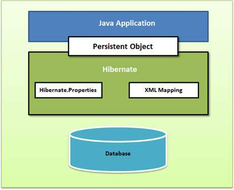

# Hibernate Tutorial #
## Introduction ##
1. Hibernate is a high performance Object/Relational persistence and query service
2. It is open source GNU Lesser General Public License (LGPL) licensed
3. Hibernate maps Java classes to db tables and from Java data types to SQL data types
4. Hibernate provides data query and retrieval facilities
5. Tutorial:
	1. Teaches how to develop db based web apps using Hibernate

### Audience ###
1. Java programmers who want to reach moderate level of expertise in Hibernate

### Prerequisites ###
1. Java
2. Relational db
3. JDBC
4. SQL

## ORM - Overview ##

### What is ORM? ###
1. Object Relational Mapping (ORM) - programming technique for converting dat a between relational db and object oriented programming languages
2. Advantages:
	1. Allows business code to access objects instead of DB tables
	2. Hides SQL queries from OO logic
	3. It is based on JDBC (under the hood)
	4. We don't have to deal with db implementation
	5. Entities are based on business concepts rather than db structure
	6. Transaction management, automatic key generation
	7. Fast development of app
3. 4 entities in ORM solution
	1. API to perform CRUD operations on objects of persistent classes
	2. API to specify queries referring to classes and properties of classes
	3. Configurable facility to specify mapping metadata
	4. Technique to interact with transactional objects for
		1. Dirty checking
		2. Lazy association fetching
		3. Optimization functions

### ORM Frameworks ###
1. Persistent Framework: It is an ORM service that stores and retrieves objects into RDB
2. Persistent frameworks:
	1. Enterprise JavaBeans Entity Beans
	2. Java Data Objects
	3. Castor
	4. TopLink
	5. Spring DAO
	6. Hibernate
	7. ...

## Hibernate - Overview ##

### Description ###
1. Hibernate is ORM solution for Java
2. Programmed by Gavin King in 2001
3. It is powerful, high performance OR Persistence and Query service for Java
4. Maps Java classes to db tables
5. Maps Java data types to SQL data types
6. Reduces 95% of data persistence related tasks for programmers

### Advantages ###
1. Uses XML to map Java classes to db tables without any code (?)
2. Provides API to store and retrieve objects into and from DB
3. If there are db changes, then update only the XML file properties
4. Additional app server is not required to operate Hibernate
5. Manipulates complex associations of objects of DB
6. Minimizes db access with smart fetching strategies
7. Simple querying for data

### Databases Supported ###
1. List of a few
	1. HSQL Database Engine
	2. DB2/NT
	3. MySQL
	4. PostgreSQL
	5. FrontBase
	6. Oracle
	7. Microsoft SQL Server Database
	8. Sybase SQL Server
	9. Informix Dynamic Server

### Supported Technologies ###
1. XDoclet Spring
2. J2EE
3. Eclipse plug-ins
4. Maven

## Hibernate - Architecture ##
### Description ###
1. Layered to isolate programmer from underlying APIs
2. Uses DB and configuration data to provide persistence services

3. High level view of Hibernate Architecture

4. Detailed overview of Hibernate Application Architecture with important core classes

	
	1. Hibernate uses the following existing API
		1. JDBC
			1. Rudimentary level of abstraction.
			2. Any db with JDBC driver is supported by Hibernate
		2. Java Transaction API (JTA)
			1. Lets Hibernate integrate with J2EE app servers
		3. Java Naming and Directory Interface (JNDI)
			1. Lets Hibernate integrate with J2EE app servers

### Configuration Object ###
1. Firt Hibernate object created in an app
2. Usually created only once during app initialization.
3. It represents properties file of hibernate
4. Key components provided
	1. **Database Connection**
		1. Handled using configuration files such as **hibernate.properties** and **hibernate.cfg.xml**
	3. **Class Mapping Setup**
		1. For connecting Java classes to db tables

### SessionFactory Object ###
1. `Configuration` object is used for creation of `SessionFactory` object
2. `SessionFactory` object 
	1. Configures Hibernate using app configuration file 
	2. Used for instantiating `Session` object
3. It is a thread safe object and can be used by multiple threads of an action
4. It is a heavy weight object
	1. It is better created during app startup and kept for later use
5. One `SessionFactory` object must be created per db (using its own configuration file)

### Session Object ###
1. It is used to get physical connection with db
2. It is lightweight
	1. Instantiated each time interaction with db is required
3. Persistent objects are saved and retrieved using `Session` object
4. These objects are not thread safe so do not keep them for a long time
5. They are created only when needed and  then destroyed

### Transaction Object ###
1. It is a single unit of work on db (most RDBMS support transaction)
2. Transactions in Hibernate are handled by underlying transaction manager and transaction (JDBC or JTA)
3. This object is optional (apps may manage transactions on their own instead)

### Query Object ###
1. `Query` objects use SQL or Hibernate Query Language (HQL) strings to retrieve data from db and for creation of objects
2. It can be used to 
	1. Bind query parameters
	2. Limit number of results returned
	3. Execute query

### Criteria Object ###
1. Used for creation and execution of object oriented criteria queries (?) for retrieving objects

## Hibernate - Environment ##
1. How to install Hibernate + associated packages for preparing dev environment
2. MySQL db is used
	1. Install from *.dpg

### Download Hibernate ###
1. Pre-requisites: Java
2. Steps:
	1. Download *.tz file for Unix or *.zip file for Windows from [http://www.hibernate.org/downloads](http://www.hibernate.org/downloads)
	2. Extract the archive

### Installing Hibernate ###
1. Copy all library files from `/lib` into `CLASSPATH`
2. Change `CLASSPATH` variable to include all JARs
3. Copy `hibernate3.jar` file into `CLASSPATH` from root directory of the installation (this is a primary jar)

### Hibernate Prerequisites ###
1. Packages needed before starting to use Hibernate.
2. Copy the following library files from `/lib` to `CLASSPATH`
	1. **dom4j**: XML parsing [www.dom4j.org](www.dom4j.org)
	2. **Xalan**: XSLT Processor [http://xml.apache.org/xalan-j/](http://xml.apache.org/xalan-j/)
	3. **Xerces**: The Xerces Java Parser [http://xml.apache.org/xerces-j/](http://xml.apache.org/xerces-j/)
	4. **cglib**: Appropriate changes to Java classes at runtime [http://cglib.sourceforge.net](http://cglib.sourceforge.net)
	5. **log4j**: Logging Framework [http://logging.apache.org/log4j](http://logging.apache.org/log4j)
	6. **Commons**: Logging, Email etc. [http://jakarta.apache.org/commons](http://jakarta.apache.org/commons)
	7. **SLF4J**: Logging Facade for Java [http://www.slf4j.org](http://www.slf4j.org)

## Hibernate - Configuration ##
1. We need to define mapping information of Java classes to database tables in advance for Hibernate
2. Configuration settings related to db
	1. `hibernate.properties`: standard Java properties file OR
	2. `hibernate.cfg.xml`: XML file
3. Most properties take default values
4. Keep the properties file in the root directory

### Hibernate Properties ###
1. Important properties
	1. `hibernate.dialect`: lets hibernate generate appropriate SQL for the chosen db
	2. `hibernate.connection.driver_class`: JDBC driver class
	3. `hibernate.connection.url`: JDBC URL to db instance
	4. `hibernate.connection.username`: db username
	5. `hibernate.connection.password`: db password
	6. `hibernate.connection.pool_size`: Limits number of connections waiting in Hibernate db connection pool
	7. `hibernate.connection.autocommit`: allows autocommit mode to be used for JDBC connection
2. If DB is used with an app server and JNDI, configure the following:
	1. `hibernate.connection.datasource`: JNDI name defined in app server context used for the app
	2. `hibernate.jndi.class`: InitialContext class for JNDI
	3. `hibernate.jndi.<JNDIpropertyname>`: Any JNDI property for JNDI IntialContext (?)
	4. `hibernate.jndi.url`: URL for JNDI
	5. `hibernate.connection.username`: db username
	6. `hibernate.connection.password`: db password

### Hibernate with MySQL Database ###
1. Creation of **hibernate.cfg.xml**
	1. **testdb**: database in MySQL
	2. **test**: user who can access **testdb**
2. **hibernate.cfg.xml**

		<?xml version="1.0" encoding="UTF-8"?>
		<!DOCTYPE hibernate-configuration SYSTEM "http://www.hibernate.org/dtd/hibernate-configuration-3.0.dtd">
		<hibernate-configuration>
			<session-factory>
				<property name="hibernate.dialect">
					org.hibernate.dialect.MySQLDialect
				</property>
				<property name="hibernate.connection.driver_class">
					com.mysql.jdbc.Driver
				</property>

				<!-- Assume test is the database name -->
				<property name="hibernate.connection.url">
					jdbc:mysql://localhost/test
				</property>
				<property name="hibernate.connection.username">
					root
				</property>
				<property name="hibernate.connection.password">
					password
				</property>

				<!-- List of XML mapping files -->
				<mapping resource="Employee.hbm.xml"/>
			</session-factory>
		</hibernate-configuration>

	1. `<mapping>`: hibernate mapping file
3. Database dielects:
	1. DB2: `org.hibernate.dialecct.DB2Dialect`
	2. HSQLDB: `org.hibernate.dialect.HSQLDialect`
	3. HypersonicSQL: `org.hibernate.dialect.HSQLDialect`
	4. Informix: `org.hibernate.dialect.InformixDialect`
	5. Interbase: `org.hibernate.dialect.InterbaseDialect`
	6. Microsoft SQL Server 2000: `org.hibernate.dialect.SQLServerDialect`
	7. Microsoft SQL Server 2005: `org.hibernate.dialect.SQLServer2005Dialect`
	8. Microsoft SQL Server 2008: `org.hibernate.dialect.SQLServer2008Dialect`
	9. MySQL: `org.hibernate.dialect.MySQLDialect`
	10. Oracle (any version): `org.hibernate.dialect.OracleDialect`
	11. Oracle 11g: `org.hibernate.dialect.Oracle10gDialect`
	12. Oracle 10g: `org.hibernate.dialect.Oracle10gDialect`
	13. Oracle 9i: `org.hibernate.dialect.Oracle9iDialect`
	14. PostgreSQL: `org.hibernate.dialect.PostgreSQLDialect`
	15. Progress: `org.hibernate.dialect.ProgressDialect`
	16. SAP DB: `org.hibernate.dialect.SAPDBDialect`
	17. Sybase: `org.hibernate.dialect.SybaseDialect`
	18. Sybase Anywhere: `org.hibernate.dialect.SybaseAnywhereDialect`

## Hibernate - Sessions ##
1. Session is used to get physical connection with db.
2. Session object is light weight
3. It can be instantiated each time an interaction is needed with the db.
4. Persistent objects are saved and retrieved using Session object
5. Session objects are not thread safe
6. Function:
	1. Create, read, delete operations for instances of mapped entity class
7. States of instances
	1. **transient**: new instance of a persistent class which is not yet associated with a Session and which has no representation in the db, it has no id value
	2. **persistent**: A transient instance can be made persistent by associating it with a session. Persistent instance has a representation in db, it has an id value which is associated with session
	3. **detached**: When a Hibernate session is closed, persistent instance will become detached instance
8. If persistent classes are serializable, the Session instance is serializable.
9. Transaction example:

		Session session = factory.openSession();
		Transaction tx = null;
		try {
			tx = session.beginTransaction();
			// do work
			// ...
			tx.commit();
		} catch (Exception e) {
			if (tx != null) tx.rollback();
			e.printStackTrace();
		} finally {
			session.close();
		}

10. If Session throws, exception, roll back the transaction and discard the session

### Session Interface Methods ###
1. Important methods:
	1. `Transaction beginTransaction()`: beging a unit of work associated with Transaction object
	2. `void cancelQuery()`: cancel execution of current query
	3. `void clear()`: clear the session
	4. `Connection close()`: End the session by releasing JDBC connection and cleaning up.
	5. `Criteria createCriteria(Class persistentClass)`: Creates new Criteria instance, for a given entity class, a superclass of entity class (?)
	6. `Criteria createCriteria(String entityName)`: New Criteria instance, for given entity name
	7. `Serializable getIdentifier(Object object)`: Returns id value of a given entity associated with this session.
	8. `Query createFilter(Object collection, String queryString)`: New instance of Query for given collection and filter string (?)
	9. `Query createQuery(String queryString)`: New instance of Query for given HQL query string
	10. `SQLQuery createSQLQuery(String queryString)`: New instance of SQLQuery for given SQL query string.
	11. `void delete(Object object)`: Removes persistent instance from database
	12. `void delete(String entityName, Object object)`: Removes persistent instance from db
	13. `Session get(String entityName, Serializable id)`: Return persistent instance of given named entity with given id, or null if there is no such pesistent instance
	14. `SessionFactory getSessionFactory()`: returns a session factory which is used to create session
	15. `void refresh(Object object)`: Re-read state of given instance from underlying db
	16. `Transaction getTransaction()`: Returs Transaction instance associated with a session
	17. `boolean isConnected()`: Is session currently connected?
	18. `boolean isDirty()`: Does the session contain any changes which needs to be synchronized with the db?
	19. `boolean isOpen()`: Is session still open?
	20. `Serializable save(Object object)`: Persist given transient instance (first assigns a generated id)
	21. `void saveOrUpdate(Object object)`: Either save or update the given instance
	22. `void update(Object object)`: Updates persistent instance with id of detached instance (?)
	23. `void update(String entityName, Object object)`: Updates persistent instance with id of given detached instance (?)

## Hibernate - Persistent Class ##
1. Hibernate takes values from a java class attributes and persists them to db tables.
2. Mapping document helps Hibernate determine how to pull values from classes and map.
3. Persistent classes: Java classes whose objects/instances will be stored in db tables.
	1. Rules Persistent classes must follow (not hard requirement):
		1. It should be a POJO
		2. All persistent classes must have a default constructor.
		3. All persistent classes should have an ID (to allow easy identification of objects)
			1. The ID property maps to primary key column of db table
		4. All attributes which need to be persisted must be delared `private` and should have `getXXX` and `setXXX` methods in JavaBean style (?)
		5. Hibernate depends upon persistent class that is either non-final or implements an interface that declares all public methods
		6. Classes should not implement specialized classes and interfaces of EJB framework
4. Example:

		public class Employee {
			private int id;
			private String firstName;
			private String lastName;
			private int salary;
	
			public Employee() {}
			public Employee(String fname, String lname, int salary) {
				this.firstName = fname;
				this.lastName = lname;
				this.salary = salary;
			}
			public int getId() {
				return id;
			}
			public void setId(int id) {
				this.id = id;
			}
			public String getFirstName() {
				return firstName;
			}
			public setFirstName(String first_name) {
				this.firstName = first_name;
			}
			public String getLastName() {
				return lastName;
			}
			public void setLastName(String last_name) {
				this.lastName = last_name;
			}
			public int getSalary() {
				return salary;
			}
			public void setSalary(int salary) {
				this.salary = salary;
			}
		}

## Hibernate - Mapping Files ##
1. Object/relational mappings are defined in XML document.
2. The mapping file lets Hibernate know how to map defined class or classes to db tables
3. We can write the mapping file by hand but there are tools to generate the mapping file for advanced hibernate users
	1. **XDoclet**
	2. **Middlegen**
	3. **AndoMDA**
4. There should be one table corresponding to each object to be persisted
5. Consider the following table in which the object needs to be persisted
	
		create table EMPLOYEE (
			id INT NOT NULL auto_increment,
			first_name VARCHAR(20) default NULL,
			last_name VARCHAR(20) default NULL,
			salary INT default NULL,
			PRIMARY KEY (id)
		);

6. The following mapping file can be used to instruct Hibernate how to map class to db table

		<?xml version="1.0" encoding="utf-8"?>
		<!DOCTYPE hibernate-mapping PUBLIC "-//Hibernate/Hibernate Mapping DTD//EN" "http://www.hibernate.org/dtd/hibernate-mapping-3.0.dtd">
		
		<hibernate-mapping>
			<class name="Employee" table"EMPLOYEE">
				<meta attribute="class-description">
					This class contains the employee details.
				</meta>
				<id name="id" type="int" column="id">
					<generator class="native"/>
				</id>
				<property name="firstName" column="first_name" type="string"/>
				<property name="lastName" column="last_name" type="string"/>
				<property name="salary" column="salary" type="int"/>
			</class>
		</hibernate-mapping>
	1. Save the mapping file with the name `<classname>.hbm.xml` (`Employee.hbm.xml`)
	2. Explanation:
		1. `<hibernate-mapping>`: root element. It contains all `<class>` elements
		2. `<class>`: maps Java class to db tables. Class name is specified using `name` attribute and db table name is specified using `table` attribute
		3. `<meta>`: optional. For creation of class description
		4. `<id>`: maps unique ID attribute in class to primary key of db table.
			1. `name` attribute refers to property in class and
			2. `column` attribute refers to column in db table
			3. `type` attribute holds hibernate mapping type (mapping types will convert from Java to SQL data type)
		5. `<generator>`: used inside `<id>` element. This is used to automatically generate primary key values
			1. `class` attribute: `native`: lets hibernate select either `identity`, `sequence` or `hilo` algorithm for creating primary key (depends on underlying db)
		6. `<property>`: Maps Java class property to column in db.
			1. `name` attribute: refers to property in class
			2. `column` attribute: refers to column in db table.
			3. `type` attribute: converts from Java to SQL data type
7. There are other attributes and elements

## Hibernate - Mapping Types ##
1. `type` attribute declared is not Java data type, and not SQL data type but they are Hibernate mapping types which are used to translate from Java to SQL data types and vice versa

### Primitive types: ###
1. `integer`: maps `int` or `java.lang.Integer` to SQL `INTEGER` type
2. `long`: maps `long` or `java.lang.Long` to SQL `BIGINT` type
3. `short`: maps `short` or `java.lang.Short` to SQL `SMALLINT` type
4. `float`: maps `float` or `java.lang.Float` to SQL `FLOAT`
5. `double`: maps `double` or `java.lang.Double` to SQL `DOUBLE`
6. `big_decimal`: maps `java.math.BigDecimal` to SQL `NUMERIC`
7. `character`: maps `java.lang.String` to SQL `CHAR(1)`
8. `string`: maps `java.lang.String` to SQL `VARCHAR`
9. `byte`: maps `byte` or `java.lang.Byte` to `TINYINT`
10. `boolean`: maps `boolean` or `java.lang.Boolean` to SQL `BIT`
11. `yes/no`: maps `boolean` or `java.lang.Boolean` to SQL `CHAR(1)` ('Y' or 'N')
12. `true/false`: maps `boolean` or `java.lang.Boolean` to SQL `CHAR(1)` ('T' or 'F')

### Date and time types ###
1. `date`: maps `java.util.Date` or `java.sql.Date` to SQL `DATE`
2. `time`: maps `java.util.Date` or `java.sql.Time` to SQL `TIME`
3. `timestamp`: maps `java.util.Date` or `java.sql.Timestamp` to SQL `TIMESTAMP`
4. `calendar`: maps `java.util.Calendar` to SQL `TIMESTAMP`
5. `calendar_date`: maps `java.util.Calendar` to SQL `DATE`

### Binary and large object types: ###
1. `binary`: maps `byte[]` to SQL `VARBINARY` or `BLOB`
2. `text`: maps `java.lang.String` to SQL `CLOB`
3. `serializable`: maps any Java class that implements `java.io.Serializable` to SQL `VARBINARY` or `BLOB`
4. `clob`: maps `java.sql.Clob` to SQL `CLOB`
5. `blob`: maps `java.sql.Blob` to SQL `BLOB`

### JDK-related types: ###
1. `class`: maps `java.lang.Class` to SQL `VARCHAR`
2. `locale`: maps `java.util.Locale` to SQL `VARCHAR`
3. `timezone`: maps `java.util.TimeZone` to SQL `VARCHAR`
4. `currency`: maps `java.util.Currency` to SQL `VARCHAR`

## Hibernate - Examples ##
1. Consider a standalone application

### Creation of POJO Classes ###
1. Class should be JavaBeans compliant and include `id` attibute as index

### Creation of Database Tables ###
1. One table per persistent class

### Creation of Mapping Configuration File: ###
1. File that maps class to db table

### Creation of Application Class: ###
1. App class with main method
2. Let us save a few `Employee`'s records and then apply CRUD operations on records

		import java.util.List;
		import java.util.Date;
		import java.util.Iterator;

		import org.hibernate.HibernateException;
		import org.hibernate.Session;
		import org.hibernate.Transaction;
		import org.hibernate.SessionFactory;
		import org.hibernate.cfg.Configuration;

		public class ManageEmployee {
			private static SessionFactory factory;
			public static void main(String[] args) {
				try {
					factory = new Configuration().configure().buildSessionFactory();
				} catch (Throwable ex) {
					System.err.println("Failed to create sessionFactory object." + ex);
					throw new ExceptionInInitializerError(ex);
				}
				ManageEmployee ME = new ManageEmployee();
			
				/* Add few employee records in database */
				Integer empID1 = ME.addEmployee("Zara", "Ali", 1000);
				Integer empID2 = ME.addEmployee("Daisy", "Das", 5000);
				Integer empID3 = ME.addEmployee("John", "Paul", 10000);
				
				/* List down all the employees */
				ME.listEmployees();
		
### Testing ###
1. Run the app and test if EMPLOYEE table is populated with records
		
## Hibernate - O/R Mappings ##
1. There are three important mapping topics
	1. Mapping of collections
	2. Mapping of associations between entity classes
	3. Component Mappings

### Collections Mappings: ###
1. If a class has collection of values for a variable, then map the values using collection interfaces in java
2. Mappings
	1. [`java.util.Set`](https://www.tutorialspoint.com/hibernate/hibernate_set_mapping.htm) maps with `<set>` element and initialized with `java.util.HashSet`
	2. [`java.util.SortedSet`](https://www.tutorialspoint.com/hibernate/hibernate_sortedset_mapping.htm) maps with `<set>` element and initialized with `java.util.TreeSet`
	3. [`java.util.List`](https://www.tutorialspoint.com/hibernate/hibernate_list_mapping.htm) maps with `<List>` element and initialized with `java.util.ArrayList`
	4. [`java.util.Collection`](https://www.tutorialspoint.com/hibernate/hibernate_bag_mapping.htm) mapped with `<bag>` or `<ibag>` element and initialized with `java.util.ArrayList`
	5. [`java.util.Map`](https://www.tutorialspoint.com/hibernate/hibernate_map_mapping.htm) mapped with `<map>` element and initalized with `java.util.HashMap`
	6. [`java.util.SortedMap`](https://www.tutorialspoint.com/hibernate/hibernate_sortedmap_mapping.htm) mapped with `<map>` element and initialized with `java.util.TreeMap`. `sort` attribute can be set to either comparator or natural ordering.
3. Arrays are supported by 
	1. `<primitive-array>` for primitive value types
	2. `<array>` for everything else.
4. For user defined collection interfaces not supported by Hibernate:
	1. Tell Hibernate about the semantics of custom collections (not recommended)

### Association Mappings ###
1. Mapping of associations between entity classes and relationships between tables is soul of ORM.
2. Four ways of expressing cardinality
3. Association can be unidirectional or bidirectional
4. Mappings
	1. [**Many-to-One**](https://www.tutorialspoint.com/hibernate/hibernate_many_to_one_mapping.htm): Mapping many-to-one relationship
	2. [**One-to-One**](https://www.tutorialspoint.com/hibernate/hibernate_one_to_one_mapping.htm): Mapping one-to-one relationship
	3. [**One-to-Many**](https://www.tutorialspoint.com/hibernate/hibernate_one_to_many_mapping.htm): Mapping one-to-many relationship
	4. [**Many-to-Many**](https://www.tutorialspoint.com/hibernate/hibernate_many_to_many_mapping.htm): Mapping many-to-many relationship

### Component Mappings ###
1. If an entity class has a reference to another class as a member variable.
2. If the referred class does not have it's own lifecycle and completely depends on the life cycle of owning entity class, the referred class is called as a component class.
3. Mapping of a collection of Components
	1. [**Component Mappings**](https://www.tutorialspoint.com/hibernate/hibernate_component_mappings.htm) is a mapping for a class having a reference to another class as a member variable

## Hibernate - Annotations ##
1. Newer way to define mappings without using XML file.
	1. It can be comibined with XML file
	2. It can replace XML file
2. Metadata is clubbed into POJO java file.
3. Annotations are used to make application portable to EJB 3 compiant ORM apps

### Environmnet Setup for Hibernate Annotation ###
1. >= JDK 5.0
2. >= Hibernate 3.x annotations distribution package
	1. `hibernate-annotations.jar`
	2. `libe/hibernate-commons-annotations.jar`
	3. `lib/ejb3-persistence.jar`

### Annotated Class Example ###
1. Example

		import javax.persistence.*;

		@Entity
		@Table(name = "EMPLOYEE")
		public class Employee {
			@Id @GeneratedValue
			@Column(name = "id")
			private int id;

			@Column(name = "first_name")
			private String firstName;

			@Column(name = "last_name")
			private String lastName;

			@Column(name = "salary")
			private int salary;

			public Employee() {}
			public int getId() {
				return id;
			}

			public void setId(int id) {
				this.id = id;
			}

			public String getFirstName() {
				return firstName;
			}

			public void setFirstName(String first_name) {
				this.firstName = first_name;
			}

			public String getLastName() {
				return lastName;
			}

			public void setLastName(String last_name) {
				this.lastName = last_name;
			}

			public int getSalary() {
				return salary;
			}

			public void setSalary(int salary) {
				this.salary = salary;
			}
		}

	1. `@Id` annotation: It is on a field and it must access properties on an object directly through fields at runtime.
		1. If `@Id` is placed on `getId()` then enable access to properties through getter and setter methods.

### @Entity Annotation ###
1. Annotations contained in EJB 3 are contained in `javax.persistence` package.
2. `@Entity`: marks the class as entity bean
	1. The class must have a no-argument constructor visible atleast with protected scope

### @Table Annotation ###
1. `@Table` Annotation:
	1. Allows to specify details of the table
	2. Provides 4 attributes:
		1. Allows to override name of table
		2. Override catalogue
		3. Override its schema
		4. Enforce unique constraints on columns

### @Id and @GeneratedValue Annotations ###
1. An entity bean will have primary key which is annotated by `@Id`
	1. It can be single field or a combination of fields (depends on table)
2. `@GeneratedValue`: Key generation strategy (overrides default key generation strategy)
	1. Parameters: `strategy`, `generator`
3. Default key generation strategy makes the code portable between databases.

### @Column Annotation ###
1. `@Column`: column to which the field or property will be mapped.
2. Attributes:
	1. `name`: column name explicitly specified
	2. `length`: size of column (ex for a String)
	3. `nullable`: Permits column to be marked `NOT NULL` when schema is generated.
	4. `unique`: permits column to be marked as containing only unique values

### Create Application Class ###
1. Similar to previous example

### Database Configuration ###
1. Similar to previous example

## Hibernate - Query Language ##
1. HQL: 
	1. It is an object oriented query language similar to SQL
	2. HQL works with persistent objects and properties instead of tables and columns
	3. HQL queries are translated into conventional SQL queries which in turn perform operations on dbs
	4. SQL can be used directly but HQL is recommended to make the code more portable, utilize Hibernate's SQL generation and caching strategies
	5. `SELECT`, `FROM`, `WHERE` are case insensitive but properties, table and column names are case sensitive.

### FROM Clause ###
1. `FROM` clause is used to load complete peristent objects into memory.
2. Syntax:

		String hql = "FROM Employee";
		Query query = session.createQuery(hql);
		List results = query.list();

3. To fully qualify a classname, specify the package and class name

		String hql = "FROM com.hibernatebook.criteria.Employee";
		Query query = session.createQuery(hql);
		List list = query.list();

### AS Clouse ###
1. `AS` is used to assign aliases to classes in HQL queries (for long queries).
2. Example:

		String hql = "FROM Employee AS E";
		Query query = session.createQuery(hql);
		List list = query.list();

3. Example: `AS` is optional

		String hql = "FROM Employee E";
		Query query = session.createQuery(hql);
		List list = query.list();

### SELECT Clause ###
1. `SELECT`: 
	1. for more control over result set
	2. If a few properties only have to be obtained instead of complete object.
2. Syntax:

		String hql = "SELECT E.firstName FROM Employee E";
		Query query = session.createQuery(hql);
		List list = query.list();

	1. `E.firstName`: property of `Employee` object and not filed of `EMPLOYEE` table

### WHERE Clause ###
1. Used to narrow down to specific objects in storage
2. Syntax:
	
		String hql = "FROM EMPLOYEE E WHERE E.id = 10";
		Query query = session.createQuery(hql);
		List results = query.list();

### ORDER BY Clause ###
1. Used to sort HQL query's results.
2. We can order results by any property on objects in either ascending (`ASC`) or descending (`DESC`) order.
3. Syntax:

		String hql = "FROM Employee E WHERE E.id > 10 ORDER BY E.salary DESC";
		Query query = session.createQuery(hql);
		List list = query.list();

4. To sort by multiple properties, just add the additional properties to the list separated by commas

		String hql = "FROM Employee E WHERE E.id > 10" +
					"ORDER BY E.firstName DESC, E.salary DESC";
		Query query = session.createQuery(hql);
		List list = query.list();

### GROUP BY Clause ###
1. Enables Hibernate to pull informtion from db and group it based on value of an attribute.
2. Used to apply aggregate function on each group.
3. Syntax:

		String hql = "SELECT SUM(E.salary), E.firstName FROM Employee E " + 
					"GROUP BY E.firstName";
		Query query = session.createQuery(hql);
		List list = query.list(); 

### Using Named Parameters ###
1. Used to accept inputs from users and assign them to properties.
2. Tackles the problem of SQL injection attacks.
3. Syntax:

		String hql = "FROM Employee E WHERE E.id = :employee_id";
		Query query = session.createQuery(hql);
		query.setParameter("employee_id", 10);
		List results = query.list();

### UPDATE Clause ###
1. Hibernate 3:
	1. Bulk updates are introduced
	2. Delete works differently than Hibernate 2
2. `executeUpdate()`: method for UPDATE and DELETE statements
3. **UPDATE**: It is used to update one or more properties of one or more objects.
4. Syntax:
	
		String hql = "UPDATE Employee set salary = :salary " +
					"WHERE id = :employee_id";
		Query query = session.createQuery(hql);
		query.setParameter("salary", 1000);
		query.setParameter("employee_id", 10);
		int result = query.executeUpdate();
		System.out.println("Rows affected: " + result);

### DELETE Clause ###
1. `DELETE`: used to delete one or more objects.
2. Syntax:
	
		String hql = "DELETE FROM Employee " +
					"WHERE id = :employee_id";
		Query query = session.createQuery(hql);
		query.setParameter("employee_id", 10);

### INSERT Clause ###
1. `INSERT INTO`: clause used to insert records from one object to another.
2. Syntax:

		String hql = "INSERT INTO Employee(firstName, lastName, salary) " +
					"SELECT firstName, lastName, salary FROM old_employee";
		Query query = session.createQuery(hql);
		int result = query.executeUpdate();
		System.out.println("Rows affected: " + result);

### Aggregate Methods ###
1. The aggregate methods work the same way as in SQL.
2. The following is a list of available functions
	1. `avg(property name)`: average of property value
	2. `count(property name or *)`: number of times, the property occurs in the results
	3. `max(property name)`: maximum value of the property values
	4. `min(property name)`: minimum value of the property values
	5. `sum(property name)`: sum total of property values
3. `distinct`: counts unique values in row set
	
		String hql = "SELECT count(distinct E.firstName) FROM Employee E";
		Query query = session.createQuery(hql);
		List results = query.list();

### Pagination using Query ###
1. `Query setFirstResult(int startPosition)` **(M)**: takes an integer that represents first row in the result set starting with row 0.
2. `Query setMaxResults(int maxResult)` **(M)**: Tells Hibernate to retrieve fixed number `maxResults` of objects
3. Example: Constructing paging component

		String hql = "FROM Employee";
		Query query = session.createQuery(hql);
		query.setFirstResult(1);
		query.setMaxResults(10);
		List list = query.list();

## Hibernate - Criteria Queries ##
1. It is an alternative method for manipulting persistent objects.
2. We can build a crietria query object and apply filteration rules and logical conditions.
3. `Session.createCriteria()` **(M)**: Used to create `Criteria` object.
4. When a criteria query is executed, instances of persistence objects are returned.
5. Example: Return every object of `Employee` class

		Criteria cr = session.createCriteria(Employee.class);
		List results = cr.list();

### Restriction with Criteria: ###
1. Use `add()` method to add restrictions to `Criteria` query.
2. Example: Return records with salary equal to 2000.

		Criteria cr = session.createCriteria(Employee.class);
		cr.add(Restrictions.eq("salary", 2000));
		List results = cr.list();

2. Examples:

		Criteria cr = session.createCriteria(Employee.class);
		
		// To get records having salary more than 2000
		cr.add(Restrictions.gt("salary", 2000));

		// To get records having salary less than 2000
		cr.add(Restrictions.lt("salary", 2000));

		// To get records having firstName starting with zara
		cr.add(Restrictions.like("firstName", "zara%"));

		// Case sensitive form of the above restriction
		cr.add(Restrictions.ilike("firstName", "zara%")); // **(M)**

		// To get records having salary in between 1000 and 2000
		cr.add(Restrictions.between("salary", 1000, 2000));

		// To check if the given property is null
		cr.add(Restrictions.isNull("salary"));

		// To check if the given property is not null
		cr.add(Restrictions.isNotNull("salary"));

		// To check if the given property is empty
		cr.add(Restrictions.isEmpty("salary"));

		// To check if the given propert is not empty
		cr.add(Restrictions.isNotEmpty("salary"));

3. AND and OR conditions

		Criteria cr = session.createCriteria(Employee.class);
		
		Criterion salary = Restrictions.gt("salary", 2000);
		Criterion name = Restrictions.ilike("firstName", "zara%");
	
		// To get records matching with OR conditions
		LogicalExpression orExp = Restrictions.or(salary, name);
		cr.add(orExp);

		// To get records matching with AND conditions
		LogicalExpression andExp = Restrictions.and(salary, name);
		cr.add(andExp);

		List results = cr.list();

### Pagination using Criteria ###
1. Two methods for pagination:
	1. `public Criteria setFirstResult(int firstResult)`: takes an integer that represents first row in result set (starts from row 0)
	2. `public Criteria setMaxReults(int maxResults)`: Tells Hibernate to retrieve fixed number `maxResults` of objects
2. Example:

		Criteria cr = session.createCriteria(Employee.class);
		cr.setFirstResult(1);
		cr.setMaxResults(10);
		List result = cr.list();

### Sorting the Results ###
1. `org.hibernate.criterion.Order`: used to sort result set in ascending or descending order
2. Example:
	
		Criteria cr = session.createCriteria(Employee.class);
		// To get records having salary more than 2000
		cr.add(Restrictions.gt("salary", 2000));

		// To sort records in descending order
		cr.addOrder(Order.desc("salary"));

		// To sort records in ascending order
		cr.addOrder(Order.asc("salary"));

		List list = cr.list();

### Projections & Aggregations ###
1. `org.hibernate.criterion.Projections`:
	1. get average
	2. get max and min of property values
	3. ...
3. It has many factory methods for obtaining `Projection` instances
4. Example:

		Criteria cr = session.createCriteria(Employee.class);
		
		// To get total row count.
		cr.setProjection(Projections.rowCount());

		// To get average of a property.
		cr.setProjection(Projections.avg("salary"));

		// To get distinct count of a property.
		cr.setProjection(Projections.countDistinct("firstName"));

		// To get maximum of a property.
		cr.setProjection(Projections.max("salary"));

		// To get minimum of a property
		cr.setProjection(Projections.min("salary"));

		// To get sum of a property.
		cr.setProjection(Projections.sum("salary"));

### Criteria Queries Example: ###
1. `Employee` POJO class
2. `EMPLOYEE` table in MySQL db
3. `Employee.hbm.xml`: hibernate mapping file

		<?xml version="1.0" encoding="utf-8"?>
		<!DOCTYPE hibernate-mapping PUBLIC "-//Hibernate/Hibernate Mapping DTD//EN" "http://www.hibernate.org/dtd/hibernate-mapping-3.0.dtd">
		
		<hibernate-mapping>
			<class name="Employee" table="EMPLOYEE">
				<meta attribute="class-description">
					This class contains the employee detail.
				</meta>
				<id name="id" type="int" column="id">
					<generator class="native"/>
				</id>
				<property name="firstName" column="first_name"
			</class>
		</hibernate-mapping>

### Compilation and 

## Hibernate - Native SQL ##
1. Purpose: To use db specific features
	1. Example: `CONNECT` in Oracle
2. Support of Hibernate:
	1. SQL
	2. Stored procedures
3. `createSQLQuery()` **(M)**: method for creation of native SQL query
	1. `public SQLQuery createSQLQuery(String sqlString) throws HibernateException`
4. `addEntity` **(M)**: associate SQL result with existing Hibernate entity (?)
5. `addJoin()` **(M)**: associate SQL result with existing Hibernate join (?)
6. `addScalar()` **(M)**: associate SQL result with scalar result (?)

### Scalar queries ###
1. Query to get scalars (values) from one or more tables
2. Syntax:

		String sql = "SELECT first_name, salary FROM EMPLOYEE";
		SQLQuery query = session.createSQLQuery(sql);
		query.setResultTransformer(Criteria.ALIAS_TO_ENTITY_MAP);
		List results = query.list();

3. The operation returns raw values from resultset

### Entity queries ###
1. Operation to return whole entity objects (instead of raw values)

		String sql = "SELECT * FROM EMPLOYEE";
		SQLQuery query = session.createSQLQuery(sql);
		query.addEntity(Employee.class);
		List results = query.list();

### Named SQL queries ###
1. Syntax:

		String sql = "SELECT * FROM EMPLOYEE WHERE id = :employee_id";
		SQLQuery query = session.createSQLQuery(sql);
		query.addEntity(Employee.class);
		query.setParameter("employee_id", 10);
		List results = query.list();

### Example ###

## Hibernate - Caching ##
1. Why do caching? 
	1. To optimize application performance
2. Where is the cache?
	1. Between the app and db
3. What is the goal?
	1. To minimize the number of hits to the db (to give better performance for performance critical apps)
4. Hibernate uses multi-level chaching scheme

	

### First-level cache ###
1. It is the session cache (mandatory cache).
2. All requests must pass through the first-level cache
3. Session object keeps an object in its power before committing it to database
4. If multiple update requests are issued on an object, Hibernate tries to delay doing update as long as possible to reduce number of update SQL statements.
5. If session is closed, all objects being cached are lost and either persisted or updated in db.

### Second-level cache ###
1. Optional
2. First-level cache is consulted first before attempting to locate an object in second level cache.
3. Can be configured per class basis or per-collection basis.
4. It can be used to cache objects across sessions.
5. Third party cache can be used with Hibernate.
6. `org.hibernate.cache.CacheProvider`: interface - must be implemented to provide Hibernate with a handle to the cache implementation.

### Query-level cache ###
1. Cache for query resultsets (integrates with second level cache)
2. Optional
3. Requires two more physical cache regions (for cached query results and timestamps when table was last updated)
4. For queries run frequently with same parameters

### The second Level Cache ###
1. Two steps to setup:
	1. Decide the concurrency strategy (?)
	2. Configure cache expiration and physical cache attributes using cache provider (?)

### Concurrency strategies ###
1. It is a mediator responsible for storing items of data in cache and retrieving them from cache.
2. Choose concurrency strategy if second-level cache is selected for each persistent class and collection
3. Types of concurrency strategies:
	1. **Transactional**: Use it for read-mostly data where it is critical to prevent stale data in concurrent transactions in rare cases of update
	2. **Read-write**: Use it for read-mostly data where it is critical to prevent stale data in concurrent transaction, in rare cases of update
	3. **Nonstrict-read-write**: Does not guarentee consistency between cache and db. Use it if data hardly changes and small likelihood of stale data is not critical concern
	4. **Read-only**: For data which never changes. For reference data
4. Example:

		<?xml version="1.0" encoding="utf-8"?>
		<!DOCTYPE hibernate-mapping PUBLIC "-//Hibernate/Hibernate Mapping DTD//EN" "http://www.hibernate.org/dtd/hibernate-mapping-3.0.dtd">
		
		<hibernate-mapping>
			<class name="Employee" table="EMPLOYEE">
				<meta attribute="class-description">
					This class contains the employee detail.
				</meta>
				<cache usage="read-write"/>
				<id name="id" type="int" column="id">
					<generator class="native"/>
				</id>
				<property name="firstName" column="first_name" type="string"/>
				<property name="lastName" column="last_name" type="string"/>
				<property name="salary" column="salary" type="int"/>
			</class>
		</hibernate-mapping>

### Cache provider ###
1. Hibernate forces to chose a single cache provider for the app if we want to choose.
2. Cache providers:
	1. EHCache: can cache in memory or on disk. Clustered caching. Supports optional Hibernate query result cache.
	2. OSCache: caching to memory and disk in single JVM. rich set of expiration policies and query cache support.
	3. warmCache: Cluster cache based on JGroups (?). Uses clustered invalidation. Does not support Hibernate query cache
	4. JBoss Cache: Full transactional replicated clustered cache based on JGroup multicast library (?). Supports replication/ invalidation (?), supports synchronous or asynchronous communication, optimistic and pessimistic locking. Hibernate query cache is supported.
3. Compatibility of cache provider with concurrency strategy
	1. EHCache: Read-only, Nonstrictread-write, Read-write
	2. OSCache: Read-only, Nonstrictread-write, Read-write
	3. SwarmCache: Read-only, Nonstrictread-write
	4. JBoss Cache: Read-only, Transactional
4. `hibernate.cfg.xml`

		<?xml version="1.0" encoding="utf-8"?>
		<!DOCTYPE hibernate-configuration SYSTEM "http://www.hibernate.org/dtd/hibernate-configuration-3.0.dtd">

		<hibernate-configuration>
			<session-factory>
				<property name="hibernate.dialect">
					org.hibernate.dialect.MySQLDialect
				</property>
				<property name="hibernate.connection.driver_class">
					com.mysql.jdgc.Driver
				</property>

				<!-- Assume students is the database name -->
				<property name="hibernate.connection.url">
					jdbc:mysql://localhost/test
				</property>
				<property name="hibernate.connection.username">
					root
				</property>
				<property name="hibernate.connection.password">
					root123
				</property>
				<property name="hibernate.cache.provider_class">
					org.hibernate.cache.EhCacheProvider
				</property>

				<!-- List of XML mapping files -->
				<mapping resource="Employee.hbm.xml"/>
			</session-factory>
		</hibernate-configuration>
5. `ehcache.xml`: EHCache's configuration file
	1. Add the file to CLASSPATH
	2. Example:

			<diskStore path="java.io.tmpdir"/>
			<defaultCache
				maxElementsInMemory="1000"
				eternal="false"
				timeToIdleSeconds="120"
				timeToLiveSeconds="120"
				overflowToDisk="true"
			/>

			<cache name="Employee"
				maxElementsInMemory="500"
				eternal="true"
				timeToIdleSeconds="0"
				timeToLiveSeconds="0"
				overflowToDisk="false"
			/>
	3. Hibernate hits second level cache whenever 
		1. You navigate to Employee
		2. When you load Employee by id.
	4. Sometimes second level caching may downgrade performance of app
		1. Solution: 
			1. Bench mark the app without enabling caching
			2. Enable caching and check performance

### The Query-level Cache ###
1. To use it, activate it first
	1. `hibernate.cache.use_query_cache="true"`
		1. Hibernate will add necessary caches in memory to hold query and id sets.
2. Next, use `setCacheable(Boolean)` of `Query` class.

		Session session = SessionFactory.openSession();
		Query query = session.createQuery("FROM EMPLOYEE");
		query.setCacheable(true);
		List users = query.list();
		SessionFactory.closeSession();

3. Add cache region:

		Session session = SessionFactory.openSession();
		Query query = session.createQuery("FROM EMPLOYEE");

	1. Cache region is given a name, tells Hibernate to store and look for query in employee area of cache

## Hibernate - Batch Processing ##
1. Uploading large number of records in db using Hibernate
2. Example:

		Session session = SessionFactory.openSession();
		Transaction tx = session.beginTransaction();
		for (int i = 0; i < 100000; i++) {
			Employee employee = new Employee(....);
			session.save(employee);
		}
		tx.commit();
		session.close();

3. Hibernate will cache all persisted objects in session-level cache and cause **OutOfMemoryException**.
	1. Solution: Use batch processing
		1. Set **hibernate.jdbc.batch_size** to 20 or 50 (depends on object size)
			1. Every 20 or 50 rows will be inserted as batch

4. Modification to code:

		Session session = SessionFactory.beginSession();
		Transaction tx = session.beginTransaction();
		for (int i = 0; i < 100000; i++) {
			Employee employee = new Employee(.....);
			session.save(employee);
				if (i % 50 == 0) { // Same as the JDBC batch size
				//flush a batch of inserts and release memory:
				session.flush(); 
				session.clear();
		}
		tx.commit();
		session.close();

	1. `session.flush()` **(M)**
	2. `session.clear()` **(M)**
		1. Releases memory

5. For Update operation:

		Session session = sessionFactory.openSession();
		Transaction tx = session.beginTransaction();

		ScrollableResults employeeCursor = session.createQuery("FROM EMPLOYEE").scroll();

		int count = 0;

		while (employeeCursor.next()) {
			Employee employee = (Employee) employeeCursor.get(0);
			employee.updateEmployee();
			session.update(employee);
			if ( ++count % 50 == 0 ) {
				session.flush();
				session.clear();
			}
		}

### Batch Processing Example ###
1. Configuration:

		<?xml version="1.0" encoding="utf-8"?>
		<!DOCTYPE hibernate-configuration SYSTEM
		"http://www.hibernate.org/dtd/hibernate-configuration-3.0.dtd">

		<hibernate-configuration>
			<session-factory>
				<property name="hibernate.dialect">
					org.hibernate.dialect.MySQLDialect
				</property>
				<property name="hibernate.connection.driver_class">
					com.mysql.jdbc.Driver
				</property>

				<!-- Assume company is the database name -->
				<property name="hibernate.connection.url">
					jdbc:mysql://localhost/test
				</property>
				<property name="hibernate.connection.username">
					root
				</property>
				<property name="hiberante.connection.password">
					password
				</property>
				<property name="hibernate.jdbc.batch_size">
					50
				</property>

				<!-- List of XML mapping files -->
				<mapping resource="Employee.hbm.xml"/>
			</session-factory>
		</hibernate-configuration>

2. Employee POJO

		public class Employee {
			private int id;
			private String firstName;
			private String lastName;
			private int salary;

			public Employee() {}
			public Employee(String fname, String lname, int salary) {
				this.firstName = fname;
				this.lastName = lname;
				this.salary = salary;
			}

			public int getId() {
				return id;
			}

			public void setId(int id) {
				this.id = id;
			}

			public String getFirstName() {
				return firstName;
			}

			public void setFirstName(String first_name) {
				this.firstName = first_name;
			}

			public String getLastName() {
				return lastName;
			}

			public void setLastName(String last_name) {
				this.lastName = last_name;
			}

			public int getSalary() {
				return salary;
			}

			public void setSalary(int salary) {
				this.salary = salary;
			}
		}

3. EMPLOYEE table

		create table EMPLOYEE (
			id INT NOT NULL auto_increment,
			first_name VARCHAR(20) default NULL,
			last_name VARCHAR(20) default NULL,
			salary INT default NULL,
			PRIMARY KEY (id)
		);

4. Mapping Employee objects to EMPLOYEE table

		<?xml version="1.0" encoding="utf-8"?>
		<!DOCTYPE hibernate-mapping PUBLIC
			"-//Hibernate/Hibernate Mapping DTD//EN"
			"http://www.hibernate.org/dtd/hiberante-mapping-3.0.dtd">

		<hibernate-mapping>
			<class name="Employee" table="EMPLOYEE">
				<meta attribute="class-description">
					This class contains the employee details
				</meta>
				<id name="id" type="int" column="id">
					<generator class="native"/>
				</id>
				<property name="firstName" column="first_name" type="string"/>
				<property name="lastName" column="last_name" type="string"/>
				<property name="salary" column="salary" type="int"/>
			</class>
		</hibernate-mapping>

5. Application Class

		import java.util.*;

		import org.hibernate.HibernateException;
		import org.hibernate.Session;
		import org.hiberante.Transaction;
		import org.hibernate.SessionFactory;
		import org.hibernate.cfg.Configuration;

		public class ManageEmployee {
			private static SessionFactory factory;
			public static void main(String[] args) {
				try {
					factory = new Configuration().configure().buildSessionFactory();
				} catch (Throwable ex) {
					System.err.println("Failed to create sessionFactory object." + ex);
					throw new ExceptionInInitializerError(ex);
				}
				ManageEmployee ME = new ManageEmployee();

				/* Add employee records in batches */
				ME.addEmployees();
			}
		
			/* Method for creation of employee records in batches */
			public void addEmployees() {
				Session session = factory.openSession();
				Transaction tx = null;
				Integer employeeID = null;
				try {
					tx = session.beginTransaction();
					for (int i = 0; i < 100000; i++) {
						String fname = "First Name " + i;
						String lname = "Last Name " + i;
						Integer salary = i;
						Employee employee = new Employee(fname, lname, salary);
						session.save(employee);
						if (i % 50 == 0) {
							session.flush();
							session.clear();
						}
					}
					tx.commit();
				} catch (HibernateException e) {
					if (tx != null) tx.rollback();
					e.printStrackTrace();
				} finally {
					session.close();
				}
				return;
			}
		}

## Hibernate - Interceptors ##
1. When an object is changed, it is persisted in the database.
2. When an object is needed, it will be loaded from persistent store.
3. **Intercetor** Interface:
	1. It contains methods which can be called at different stages to perform certains tasks.
	2. Methods are callbacks from session to app
	3. The app can inspect and/ or manipulate properties of persistent object before it is saved, updated, deleted or loaded.
4. Methods:
	1. `findDirty()`: called when `flush()` method is called on `Session` object
	2. `instantiate()`: called when persisted class is instantiated.
	3. `isUnsaved()`: called when object is passed to `saveOrUpdate()` method
	4. `onDelete()`: called before an object is deleted
	5. `onFlushDirty()`: called when Hibernate detects that an object is dirty (changed) during a flush operation.
	6. `onLoad()`: called before an object is initialized
	7. `onSave()`: called before an object is saved
	8. `postFlush()`: called after a flush has occurred and object has been updated in memory
	9. `preFlush()`: called before a flush
5. Gives control over how object looks to app and database

### How to use Interceptors? ###
1. Two ways:
	1. Implement `Interceptor` interface
	2. Extend `EmptyInterceptor` class

### Creation of Interceptors: ###
1. Extending `EmptyInterceptor`

		import java.io.Serializable;
		import java.util.Date;
		import java.util.Iterator;

		import org.hibernate.EmptyInterceptor;
		import org.hibernate.Transaction;
		import org.hibernate.type.Type;

		public class MyInterceptor extends EmptyInterceptor {
			private int updates;
			private int instantiates;
			private int loads;

			public void onDelete(Object entity, Serializable id, Object[] state, String[] propertyName, Types[] types) {
				// do nothing
			}

			// This method is called when Employee object gets updated.
			public boolean onFlushDirty(Object entity, Serializable id, Object[] currentState, Object[] previousState, String[] propertyNames, Type[] types) {
				if (entity isinstanceof Employee) {
					System.out.println("Update Operation");
					return true;
				}
				return false;
			}
			public boolean onLoad(Object entity, Serializable id, Object[] state, String[] propertyName, Types[] types) {
				// do nothing
				return true;
			}
			// This method is called when Employee object gets created.
			public boolean onSave(Object entity, Serializable id, Object[] state, String[] propertyNames, Type[] types) {
				System.out.println("Creation Operation");
				return true;
			}
			// called before commit into database
			public void preFlush(Iterator iterator) {
				System.out.println("preFlush");
			}
			// called after committing into database			public void postFlush(Iterator iterator) {
				System.out.println("postFlush");
			}
		}

### Creation of POJO Classes: ###
1. Employee.java

		public class Employee {
			private int id;
			private String firstName;
			private String lastName;
			private int salary;

			public Employee() {}
			public Employee(String firstName, String lastName, int salary) {
				this.firstName = firstName;
				this.lastName = lastName;
				this.salary = salary;
			}

			public int getId() {
				return id;
			}

			public void setId(int id) {
				this.id = id;
			}

			public String getFirstName() {
				return firstName;
			}

			public void setFirstName(String firstName) {
				this.firstName = firstName;
			}

			public String getLastName() {
				return lastName;
			}

			public void setLastName(String lastName) {
				this.lastName = lastName;
			}

			public int getSalary() {
				return salary;
			}

			public void setSalary(int salary) {
				this.salary = salary;
			}
		}

### Creation of Database Tables: ###
1. Table:

		create table EMPLOYEE (
			id INT NOT NULL auto_increment,
			first_name VARCHAR(20) default NULL,
			last_name VARCHAR(20) default NULL,
			salary INT default NULL,
			PRIMARY KEY (id)
		);

### Creation of Mapping Configuration File: ###
1. hibernate.cfg.xml

		<?xml version="1.0" encoding="utf-8"?>
		<!DOCTYPE hibernate-mapping PUBLIC
			"-//Hibernate/Hibernate Mapping DTD//EN"
			"http://www.hibernate.org/dtd/hibernate-mapping-3.0.dtd">

		<hibernate-mapping>
			<class name="hibernate.interceptor.Employee" table="EMPLOYEE">
				<meta attribute="class-description">
					This class contains the employee details.
				</meta>
				<id name="id" column="id" type="int">
					<generator class="native"/>
				</id>
				<property name="firstName" column="first_name" type="string"/>
				<property name="lastName" column="last_name" type="string"/>
				<property name="salary" column="salary" type="int"/>
			</class>
		</hibernate-mapping>

### Creation of Application Class: ###
1. ManageEmployee.java

		import java.util.List;
		import java.util.Date;
		import java.util.Iterator;

		import org.hibernate.HibernateException;
		import org.hibernate.Session;
		import org.hibernate.Transaction;
		import org.hibernate.SessionFactory;
		import org.hibernate.cfg.Configuration;

		public class ManageEmployee {
			private static SessionFactory factory;
			public static void main(String[] args) {
				try {
					factory = new Configuration().configure().buildSessionFactory();
				} catch (Throwable ex) {
					System.err.println("Failed creation of sessionFactory object." + ex);
					throw new ExceptionInInitializerError(ex);
				}
				ManageEmployee ME = new ManageEmployee();

				/* Add few employee records in database */
				Integer empID1 = ME.addEmployee("Zara", "Ali", 1000);
				Integer empID2 = ME.addEmployee("Daisy", "Das", 5000);
				Integer empID3 = ME.addEmployee("John", "Paul", 10000);

				/* List down all the employees */
				ME.listEmployees();

				/* Update employee's records */
				ME.updateEmployee(empID1, 5000);

				/* Delete an employee from the database */
				ME.deleteEmployee(empID2);
				
				/* List down new list of the employees */
				ME.listEmployees();
			}
			/* Method for CREATION of an employee in the database */
			public Integer addEmployee(String firstName, String lastName, int salary) {
				Session session = factory.withOptions().interceptor(new MyInterceptor()).openSession();
				Transaction tx = null;
				Integer employeeID = null;
				try {
					tx = session.beginTransaction();
					Employee employee = new Employee(firstName, lastName, salary);
					employeeID = (Integer) session.save(employee);
					tx.commit();
				} catch (HibernateException e) {
					if (tx != null)
						tx.rollback();
					e.printStackTrace();
				} finally {
					session.close();
				}
			}
			/* Method to READ all the employees */
			public void listEmployees() {
				Session session = factory.withOptions().interceptor(new MyInterceptor()).openSession();
				Transaction tx = null;
				try {
					tx = session.beginTransaction();
					List employees = session.createQuery("FROM Employee").list();
					for (Iterator iterator = employees.iterator(); iterator.hasNext();) {
						Employee employee = (Employee) iterator.next();
						System.out.print("First Name: " + employee.getFirstName());
						System.out.print(" Last Name: " + employee.getLastName());
						System.out.println(" Salary: " + employee.getSalary());
					}
					tx.commit();
				} catch (HibernateException e) {
					if (tx != null)
						tx.rollback();
					e.printStackTrace();
				} finally {
					session.close();
				}
			}
			/* Method to UPDATE salary for an employee */
			public void updateEmployee(Integer EmployeeID, int salary) {
				Session session = factory.withOptions().interceptor(new MyInterceptor()).openSession();
				Transaction tx = null;
				try {
					tx = session.beginTransaction();
					Employee = employee = (Employee) session.get(Employee.class, EmployeeID);
					employee.setSalary(salary);
					session.update(employee);
					tx.commit();
				} catch (HibernateException e) {
					if (tx != null)
						tx.rollback();
					e.printStackTrace();
				} finally {
					session.close();
				}
			}
			/* Method to DELETE an employee from the records */
			public void deleteEmployee(Integer EmployeeID) {
				Session session = factory.withOptions().interceptor(new MyInterceptor()).openSession();
				Transaction tx = null;
				try {
					tx = session.beginTransaction();
					Employee employee = (Employee) session.get(Employee.class, EmployeeID);
					session.delete(employee);
					tx.commit();
				} catch (HibernateException e) {
					if (tx != null)
						tx.rollback();
					e.printStackTrace();
				} finally {
					session.close();
				}
			}
		}

## Hibernate - Useful Resources ##
1. Links:
	1. [Hibernate](http://www.hibernate.org/)
	2. [Hibernate Documentation](http://www.hibernate.org/docs.html)
		1. Reference
		2. Javadocs
	3. [iBATIS](http://ibatis.apache.org/hibernate_dicussion.html)
		1. Apache Software Foundation
	4. [iBATIS for Java](http://ibatis.apache.org/java.cgi)
	5. [Oracle's Site on JDBC](http://www.oracle.com/technetwork/java/javase/tech/index-jsp-136101.html)
	6. [MySQL Connector/J](http://dev.mysql.com/downloads/connector/j/5.1.html)
2. Books:
	1. Beginning Hibernate: Jeff Linwood and Dave Minter
	2. Hibernate Search in Action
	3. Java Persistence with Hibernate
	4. Harnessing Hibernate
	5. Hibernate in Action
	6. Hibernate Recipes (A Problem-Solution Approach)

## Hibernate - Discussion ##
1. Hibernate: High performance Object/Relational persistence and query service (LGPL)
2. Maps Java classes to database tables.
3. Provides data query and retrieval facilities