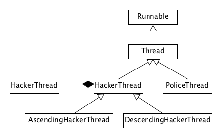

# Java Multithreading, Concurrency & Performance Optimization #
## Introduction ##
### Motivation & Operating Systems Fundamentals - Part 1 ###
1. Motivation - Concurrency and Parellelism
2. What threads are - Introuction to OS
3. Why we need Threads?
	1. Responsiveness
		1. Example: Waiting for customer support
			1. Late response from a person
			2. No feedback from an application
		2. We want to avoid this frustration to users
		3. Example: Online store web application
			1. Suppose a user has made a request to the application and database operation is taking a long time
			2. Second user tries to send request to the application but the application is busy and the request will not be served (might wait or fail)
		4. Solution: Multiple requests can be served simultaneously by serving each request in a separate thread
		5. Responsiveness is particularly critical in applications with a User Interface
			1. Move player - showing images, playing movie, moving mouse gives instant feedback
				1. Can be achieved by using multiple threads, with a separate thread for each task
					1. Otherwise generally very hard to achieve
			2. Achieved by multi-tasking between threads
				1. Done quickly by the OS - to give illusion that all the tasks are executing simultaneously
		6. **Concurrency = Multitasking**
			1. Note: We don't need multiple cores to achieve concurrency
				1. Can also be achieved with single core
	2. Performance - parallelism
		1. With single core: An illusion of multiple tasks executing in parallel can be created using just a single core
		2. With multiple cores we can truly run tasks completely in parallel
		3. Impact: Completing a complex task much faster
		4. Finish more work in the same period of time
		5. For high scale service -
			1. Fewer machines
			2. Less money spent on hardware
			3. More money in your pocket
	3. Caveat
		1. Multithreaded programming is fundamentally different from single threaded programming
			1. Intuition that we have with single thread might break when using multiple threads
				1. Solution: The course will lay the groundwork, and learn all the tools to become a successful multithreaded programming developer
					1. We can write highly performant and responsive applications
4. What threads are - Introduction to OS
	1. OS - loaded from disk into memory
		1. It takes over and provides an abstraction layer for us and helps us interact with hardware and CPU (focus is shifted to developing apps instead of managing hardware resources)
		2. application stays on disk first
			1. OS takes program and an instance of the program is created in memory (the instance is called a process or context)
				1. Each process is completely isolated from other processes in the system
				2. A process consists of metadata
					1. PID
					2. Files opened for reading and writing
					3. Program instructions
					4. Heap
					5. Main thread
						1. Contains
							1. Stack
							2. Instruction pointer
		3. In a multithreaded application, each thread comes with its own stack and ip
			1. All rest of the components in the process are shared by all threads
			2. Stack - it is a region of memory, where local variables are stored, and passed into functions
			3. Instruction pointer - Address of the next instruction to execute
		4. Each thread is executing a different instruction in same or different function in any given moment
			1. Hence separate instruction pointer
			2. Hence separate call stack (for function local variables and return addresses)
5. Summary
	1. Motivation for multithreading
		1. Responsiveness achieved by concurrency
		2. Performnance achieved by parallelism
	2. Threads are and what they contain
		1. Stack
		2. Instruction pointer
	3. What threads share
		1. Files
		2. Heap
		3. Code

### Operating Systems Fundamentals - Part 2 ###
1. What we learn in this lecture
	1. Context switch
		1. Each process may have one or more threads
			1. The threads are competing to get executed on the CPU (there are way more threads than the cores)
				1. OS needs to run a thread, stop it, run another thread, stop it, ...
		2. Context switch: The process of
			1. Stop thread 1
			2. Schedule thread 1 out
			3. Scheudle thread 2 in
			4. Start thread 2
			5. ...
		3. Context switch cost
			1. Context switch is not cheap, and is the price of multitasking (concurrency)
			2. Same as we humans when we multitask - takes time to focus
				1. We are not productive during the time we are interrupted and we need to switch to another task
					1. Each thread consumes resources in the CPU and memory (kernel resources)
						1. Tasks to perform during context switch
							1. Store data for one thread
							2. Restore data for another thread
		4. Key takeaways
			1. Too many threads - Thrashing, spending more time in management than real productive work (running our tasks)
			2. Threads consume less resources than processes
				1. They share a lot of resources among themselves
					1. Context switches between threads from the same process is cheaper than context switches between different processes
	2. Thread scheduling
		1. Example: Doing homework in text editor, listening to music
			1. Music player - has two threads
				1. Music - loading and playing through speakers
				2. User Interface - responds to user input (mouse clicks, keyboard buttons)
			2. Text Editor - has two threads
				1. File Saver - saves file every two seconds
				2. User Interface
		2. Suppose there is one core and 4 threads we need to decide how to schedule on the core
			1. Who runs first?
				1. Say: FCFS (fair)
					1. File Saver, Text Editor UI, Music Player, Music Player UI
						1. Problem - Long thread can cause starvation (if long thread arrived first, it will cause starvation to other threads)
							1. May cause User Interface threads being unresponsive - Bad User experience (if the UI thread is starving)
				2. Observation - UI threads are typically shorter (they just respond to a user input and update screen)
					1. Shortest Job First
						1. Problem - If many user related tasks coming all the time, we will keep scheduling only them and longer tasks may not get executed
				3. OS looks for a tradeoff
					1. OS divides time into moderately sized pieces called epocs
						1. In each epoc - OS allocates different time-slice for each thread
							1. Not all threads complete in a given epoc
					2. How to allocate time slice?
						1. Dynamic priority is calculated
						
								Dynamic Priority = Static Priority + Bonus (bonus can be negative) # for each thread
								
							1. Static Priority is set by the developer programmatically
							2. **Bonus** is adjusted by the Operating System in every epoch, for each thread
								1. If certain threads need more immediate attension, they get higher **Bonus** value
								2. Or OS will give preference to threads that did not complete in the last epochs, or did not get enough time to run - preventing starvation
	3. Threads vs Processes
		1. Multiple threads
			1. Prefer if the tasks share a lot of data
			2. Threads are much faster to instantiate and destroy
			3. Switching between threads of the same process is faster (shorter context switches)
		2. Multi-Process Architecture
			1. Security and stability (?) are of higher importance
				1. They are completely isolated from each other
				2. Unlike multiple threads where a single faulty thread can bring down the entire application (a faulty process does not bring down the entire application with multiple processes)
			2. Tasks are unrelated to each other
2. Summary
	1. Context Switches, and their impact on performance (thrashing)
	2. How thread scheduling works in the Operating System
	3. When to prefer Multithreaded over Multi-Processes architecture

## Threading Fundamentals - Thread Creation ##
### Threads Creation - Part 1, Thread Capabilities & De	bugging ###
1. What we learn in this lecture
	1. Thread creation with `java.lang.Runnable`
	2. `Thread` class capabilities
	3. Thread Debugging
2. Simple java project
	1. All threads related properties and methods are encapsulated in `Thread` class by JDK

			Thread thread = new Thread(); // It is empty by default
			
			Thread thread = new Thread (new Runnable () {
				@Override
				public void run() {
					// Code that we will run in a new thread - it is scheduled by OS
					
				}
			}); // lambda can be used
			
			System.out.println("We are in thread: " + Thread.currentThread().getName() + " before starting a new thread");
			thread.start(); // instructs JVM to construct a new thread and pass it to the OS
			System.out.println("We are in thread: " + Thread.currentThread().getName() + " after starting a new thread");
			
			Thread.sleep(10000); // it does not spin in a loop. It only instructs OS to not schedule the thread until that time passes (doesn't consume any CPU)
			
		1. Main thread is `main`
		2. New thread takes time (for scheduling by OS)
3. `Thread` class capabilities
	1. Give a name to thread

			thread.setName("New Worker Thread");
			
	2. We can set static priority for a thread programmatically

			thread.setPriority(Thread.MAX_PRIORITY); 
			
		1. For large programs that need better response time, this will play a major role
4. Debugging
	1. Put breakpoints
		1. Threads tab
			1. stack traces
	2. **When we hit a breakpoint, all threads freeze** (to check each thread individually)
	3. Catching unchecked exception

				...
				throw new RuntimeException("Intentional Exception");
				...

			thread.setUncaughtExceptionHandler(new Thread.UncaughtExceptionHandler() {
				@Override
				public void uncaughtException(Thread t, Throwable b) {
					System.out.println("A critical error happened in thread " + t.getName() + " the error is " + e.getMessage());
				}
			});
			
		1. If an uncaught exception gets thrown in any of the threads spawned from main thread will be caught by the handler
		2. Purpose: To clean up some of the resources or log additional data to enable us troubleshoot any issues after the fact
	 
### Threads Creation - Part 2, Thread Inheritance ###
1. What we learn in this lecture:
	1. Thread creation with java.lang.Thread
	2. Case study - interactive mutithreaded application
2. Using `Runnable` is easier and faster to code
3. Extending `Thread` class (it implements `Runnable` interface)

		public static void main(String[] args) {
			Thread thread = new NewThread();
			thread.start();
		}

		private static class NewThread extends Thread {
		
			@Override
			public void run() {
				System.out.println("Hello from " + Thread.currentThread().getName());
			}
			
		}	
		
	1. We get access to methods that are directly related to the thread

			System.out.println("Hello from " + this.getName());
			
4. Case study
	1. Example: Consider a vault where money is stored and it is locked
		1. We want to know how long it might take to guess the code and take the money (for hackers)
			1. Hackers - Brute force (threads)
			2. Police (thread) - counts upto 10 seconds and if hackers were not able to break the vault, the police will arrest them
				1. Police shows us progress of it's arrival on screen
	2. Implementation: 

			public class Main {
				public static void main(String[] args) {
					Random random = new Random();
					
					Vault vault = new Vault(random.nextInt(MAX_PASSWORD));
					
					List<Thread> threads = new ArrayList<>();
					
					threads.add(new AscendingHackerThread(vault));
					threads.add(new DescendingHackerThread(vault));
					threads.add(new PoliceThread());
					
					for (Thread thread : threads) {
						thread.start();
					}
				}
				
				private static class Vault {
					private int password;
					public Vault(int password) {
						this.password = password;
					}
					
					public boolean isCorrectPassword(int guess) {
						try {
							Thread.sleep(5);
						} catch (InterruptedException e) {
						
						}
						return this.password == guess;
					}
				}
				
				private static abstract class HackerThread extends Thread {
					protected Vault vault;
					
					public HackerThread(Vault vault) {
						this.vault = vault;
						this.setName(this.getClass().getSimpleName());
						this.setPriority(Thread.MAX_PRIORITY);
					}
					
					@Override
					public void start() {
						System.out.println("Staring thread " + this.getName());
						super.start();
					}
				}
				
				private static class AscendingHackerThread extends HackerThread {
					public AsendingHackerThread(Vault vault) {
						super(vault);
					}
					
					@Override
					public void run() {
						for (int guess = 0; guess < MAX_PASSWORD; guess++) {
							if (vault.isCorrectPassword(guess)) {
								System.out.println(this.getName() + " guessed the password " + guess);
								System.exit(0);
							}
						}
					}	
				}
				
				private static class DescendingHanderThread extends HackerThread {
					public AsendingHackerThread(Vault vault) {
						super(vault);
					}
					
					@Override
					public void run() {
						for (int guess = MAX_PASSWORD; guess >= 0; guess--) {
							if (vault.isCorrectPassword(guess)) {
								System.out.println(this.getName() + " guessed the password " + guess);
								System.exit(0);
							}
						}
					}
				}
				
				private static class DescendingHanderThread extends HackerThread {
					public AsendingHackerThread(Vault vault) {
						super(vault);
					}
					
					@Override
					public void run() {
						for (int i = 10; i >= 0; i--) {
							try {
								Thread.sleep(1000);
							} catch (InterruptedException e) {
							
							}
							System.out.println(i);
						}
						
						System.out.println("Game over for you hackers");
						System.exit(0);
					}
				}
			}
			
		1. Diagram

			
			
1. Summary:
	1. `Thread` class - Encapsulates all thread related functionality
	2. Two ways to run code on a new thread
		1. Implement `Runnable` interface, and pass to a new `Thread` object
		2. Extend `Thread` class, and construct an object of that class
	3. Both ways are equally correct (our preference)

### Coding Exercise 1: Thread Creation - MultiExecutor ###

		public MultiExecutor(List<Runnable> tasks) {
        	// Complete your code here
        	for (Runnable task : tasks)
          	new Thread(task).start();
    	}

### Thread Creation - MultiExecutor Solution ###

		import java.util.ArrayList;
		import java.util.List;
		 
		public class MultiExecutor {
		    
		    private final List<Runnable> tasks;
		 
		    /*
		     * @param tasks to executed concurrently
		     */
		    public MultiExecutor(List<Runnable> tasks) {
		        this.tasks = tasks;
		    }
		 
		    /**
		     * Executes all the tasks concurrently
		     */
		    public void executeAll() {
		        List<Thread> threads = new ArrayList<>(tasks.size());
		        
		        for (Runnable task : tasks) {
		            Thread thread = new Thread(task);
		            threads.add(thread);
		        }
		        
		        for(Thread thread : threads) {
		            thread.start();
		        }
		    }
		}

## Threading Fundamentals - Thread Coordination ##
### Thread Termination & Daeomon Threads ###
1. What we learn in this lecture
	1. Thread termination (from one thread to another thread)
	2. Thread.interrupt()
	3. Daemon threads
2. Why and When we want to terminate a thread?
	1. Threads consume resources (even when thread is not doing anything)
		1. Memory and kernel resources
		2. CPU cycles and cache memory
	2. If thread finished its work, but application is still running
		1. We want to clean up thread's resources (which are being consumed by finished thread)
	3. If a thread is misbehaving, we want to stop it
		1. It might be sending requests to servers (which is not responding)
	4. By default, application will not stop as long as at least one thread is still running
		1. Even if main thread stopped running
			1. We want the ability to stop all threads gracefully before closing the application
3. `Thread.interrupt()` - Each thread object has a method called interrupt
	1. Thread A - `threadB.interrupt()` -> Thread B
		1. Sending interrupt signal to Thread B in an attempt to interrupt thread B
4. When can we interrupt a thread?
	1. If thread is executing a method that throws an `InterruptedException`
	2. If thread's code is handling the interrupt signal explicitly
5. Example:

		package thread.interrupt;
		
		public class Main {
			public static void main(String[] args) {
				Thread thread = new Thread(new BlockingTask());
				
				thread.start();
				
				thread.interrupt(); // interrupted exception gets thrown
			}
			
			private static class Blocking implements Runnable {
				@Override
				public void run() {
					try {
						Thread.sleep(500000);
					} catch (InterruptedException e) {
						System.out.println("Exiting blocking thread");
					}
				}
			}
		}
		
6. Example:

		public class Main {
			public static void main(String[] args) {
				Thread thread = new Thread(new LongComputationTask(new BigInteger("200000"), new BigInteger("10000000000"));

				thread.start(); // calculation will take a very long time

				thread.interrupt(); // The thread does not have any logic to handle this interrupt
			}
			
			private static class LongComputationTask implements Runnable {
				private BigInteger base;
				private BigInteger power;
				
				public LongComputationTask(BigInteger base, BigInteger power) {
					this.base = base;
					this.power = power;
				}
				
				@Override
				public void run() {
					System.out.println(base + "^" + power + " = " + pow(base, power));
				}
				
				private BigInteger pow(BigInteger base, BigInteger power) {
					BigInteger result = BigInteger.ONE;
					
					for (BigInteger i = BitInteger.ZERO; i.compareTo(power) != 0; i = i.add(BigInteger.ONE)) {
						if (Thread.currentThread().isInterrupted()) {
							System.out.println("Prematurely interrupted computation");
							return BitInteger.ZERO;
						}
						result = result.multiply(base);
					}
					
					return result;
				}
			}
		}
		
	1. Find hotspot
		1. In each iteration, check if current thread has got interrupted from the outside world
7. Daemon Threads
	1. Background threads that do not prevent the application from existing if the main thread terminates
	2. Scenario 1:
		1. Background tasks (not the main focus of the application)
			1. That should not block our application from terminating
		2. Example: File saving thread in a Text Editor (every few minutes)
			1. We don't want to wait for this thread to finish
	3. Scenario 2:
		1. Code in a worker thread is not under our control, and we do not want it to block our application from terminating
		2. Example: Worker thread that uses an external library (that might not handle interrupt signal)

				
				thread.setDaemon(true);
				// ...

				for (BigInteger i = BitInteger.ZERO; i.compareTo(power) != 0; i = i.add(BigInteger.ONE)) {
					result = result.multiply(base);
				}
				
			1. Even if main thread ends, the entire app is allowed to terminate
8. Summary:
	1. Learned how to stop threads by calling `thread.interrupt()`
	2. If method does not respond to interrupt signal by throwing `InterruptedException`, we need to check for that signal and handle it ourselves
	3. To prevent thread from blocking our app from exiting
		1. We set thread to be a daemon thread

### Quiz 3: Thread Termination & Daemon Threads ###
### Joining Threads ###
1. What we learn in the lecture
	1. Threads coordination with `Thread.join()`
	2. Case study
2. How to guarantee that the thread upon which we depend completes its work by the time we expected
	1. For full control over tasks (to run in parallel)
		1. We also want to safely and correctly aggregate results
3. Different threads run independently (of each other by default)
4. Order of execution is out of our control
	1. Example: ThreadA finishes before Thread B or other way, they might run concurrently or in parallel
5. Thread coordination - Dependency
	1. What if one thread depends on another thread?
	
			Thread A
				| Output
				|
				| Input
				v
			Thread B
			
		1. How will Thread B know that Thread A has finished computing the output (and is not accessing an intermediate or partial result)?
			1. Naive solution:
				1. Thread B runs in a loop and keeps checking if Thread A' result is ready

						void waitForThreadA() {
							while (!threadA.isFinished()) {
								// burn CPU cycles
							}
						}
						
					1. Busy wait
						1. Inefficient and wasteful

								Thread B | Thread A  | Thread B | Thread A
								Check      doing work  Check      doing work
								  ^
								  |
								  waste
								  
						2. Better solution: Thread B checks and goes to sleep (get out of the way completely), Thread A finishes work, then Thread B will wake up using the results computed by Thread A
							1. Implementation: `Thread.join()`
								1. `public final void join()`
								2. `public final void join(long millis, int nanos)`
								3. `public final void join(long millis)`
6. Example: Factorial calculation (CPU intensive task)

		public static class FactorialThread extends Thread {
			private long inputNumber;
			private BigInteger result = BigInteger.ZERO;
			private boolean isFinished = false;
			
			public FactorialThread(long inputNumber) {
				this.inputNumber = inputNumber;
			}
			
			@Override
			public void run() {
				this.result = factorial(inputNumber);
				this.isFinished = true;
			}
			
			public BigInteger factorial(long n) {
				BigInteger tempResult = BigInteger.ONE;
				
				for (long i = n; i > 0; i--) {
					tempResult = tempResult.multiply(new BigInteger(Long.toString(i)));
				}
				return tempResult;
			}
			
			public boolean isFinished() {
				return isFinished;
			}
			
			public BigInteger getResult() {
				return result;
			}
		}
		
		public class Main {
			public static void main(String[] args) {
				List<Long> inputNumbers = Arrays.asList(0L, 3435L, 35435L, 2324L, 4656L, 23L, 5556L);
				
				List<FactorialThread> threads = new ArrayList<>();
				
				for (long inputNumber : inputNumbers) {
					threads.add(new FactorialThread(inputNumber));
				}
				
				for (Thread thread : threads) {
					thread.start(); // this and checking result have a race condition
				}
				
				for (int i = 0; i < inputNumbers.size(); i++) {
					FactorialThread factorialThread = threads.get(i);
					if (factorialThread.isFinished()) {
						System.out.println("Factorial of " + inputNumbers.get(i) + " is " + factorialThread.getResult());
					} else {
						System.out.println("The calculation for " + inputNumbers.get(i) + " is still in progress");
					}
				}
			}
		}
		
	1. Race condition: Two threads race towards their goals independently (no coordination)
		1. Solution: Forcing main to wait until all factorials are finished

				for (Thread thread : threads) {
					thread.join(); // returns only when the thread has terminated
				} // all factorial calculations are guaranteed to be finished
7. What if one of the numbers is large (from a file or user input) - edge case
	1. Other calculations are ready but cannot complete
		1. Solution: How long we are willing to wait for each of the worker threads

				thread.join(2000); // 2 seconds only
				
			1. Other thread is still running (can be solved to terminate elegantly) - convert it to daemon thread
8. Thread coordination: `Thread.join()`
	1. More control over independent threads
	2. Safely collect and aggregate results
	3. Gracefully handle runaway threads using `Thread.join(timeout)`
9. Summary
	1. Do not rely on the order of execution (of other threads)
	2. Always used thread coordination (to get reliable results)
	3. Design code for worst case scenario (defensive programming)
		1. Assume that: Threads may take unreasonably long time to finish
	4. Always use `Thread.join(...)` with time limit
		1. Stop the thread if it's not done in time

### Coding Exercise 2: Multithreaded Calculation ###
### Multithreaded Calculation - Solution ###

## Performance Optimization ##
### Introduction to Performance & Optimizing for Latency - Part 1 ###
1. What we learn in this lecture
	1. Performance criteria/ definition
	2. Performance in Multithreaded applications
	3. Latency
2. Performance (This can be measured differently for different use cases and different scenarios)
	1. Use cases:
		1. High Speed Trading System
		
				Buy Request	->	|     | -> Purchase
									| App |
				Sell Request	->	|     | -> Sale
										^
										|
									Latency
									
			1. Performance measured in latency
				1. The faster the transaction is, the performant the application is considered to be
				2. Latency measured in units of time
		2. Video Player
		
				App - Frames -> TV
				      [][][]
				      
			1. Delivering all frames as fast as possible would be terrible (1000 frames per second is too fast if the movie is 120 frames per second)
				1. Solution: We want to show movie at the correct frame rate (with minimum jitter)
					1. Performance metric: precision and accuracy of frame rate
		3. Machine Learning
		
				Large Data -Data-> Machine Learning -Prediction->
				
			1. Every 24 hours, prediction must be done
				1. The more data that the system can inject into the system, the better for us
					1. Performance metric: throughput (latency or lack or jitter is not important)
3. Performance in Multithreading (General case)
	1. Latency - The time to completion of a task. Measured in time units
	2. Throughput - The amount of tasks completed in a given period. Measured in tasks/time unit
4. Improving one may not have impact on the other or may even have adverse effect on the other
5. Latency:

		<----- Task ----->
				Latency = T
				
	1. We can break the task into multiple independent tasks

			Task1|task2| | | || | TaskN
			
		1. Schedule the sub-tasks to run in parallel to each other

				Latency = T/N
				
			1. N - number of sub-tasks
	2. Theoretical reduction of latency by N = Performance improvement by a factor of N
		1. N = ?
			1. How many subtasks/ Threads to break the original task?
		2. Does breaking original task and aggregating results coming for free?
		3. Can we break any task into subtasks?
6. N = ?
	1. On a general purpose computer: N = number of cores (as close as possible)
		1. Reduction of latency can be achieved by running the sub-tasks fully in parallel
			1. This is possible only if we run them in multiple cores
	2. OS tries it's best to schedule the tasks on available cores
		1. If no other tasks are running (utilizing hardware as best as it can to give the optimal performance)
			1. If we add a single additional thread (counter productive)
				1. Reduces performance and increases the latency
					1. The additional thread pushes the other thread back and forth resulting in context switches, bad cache performance, extra memory consumption:

							core 1 <- Thread 1
							core 2 <- Thread 2
							...
							core N <- Thread N
							Idle   <- Thread N + 1
							
						1. Thread N + 1 can push any of the Thread [1..N] out and cause context switch
						2. This can get repeated for any of the threads
		2. N = ? - Notes
			1. No of threads = No of cores
				1. It is optimal only if all threads are runnable and can run without interruption
					1. No IO/blocking calls/sleep
				2. In reality, the result will be rarely optimal but we can be close to that
			2. The assumption is that nothing else is running that consumes a lot of CPU
				1. Never the case
					1. Unless we have a dedicated server
						1. OS and other processes would have a negligible impact on application threads
			3. Hyperthreading - Virtual Cores vs Physical Cores
			
										|
								Physical Core
								[HW Unit 2]
										|
					[HW Unit 1]		|	[HW Unit 2]
										|
					Virutal Core 1	|	Virtual Core 2
					
				1. A physical core can run two threads at a time (we cannot get 100% parallelism)
					1. Certain HW units are duplicated (to run the threads in parallel)
					2. Certain HW units are shared
	3. Inherent Cost of Parallelization and Aggregation
		1. Cost of breaking tasks into many & aggregating the results
			
				Breaking task into multiple tasks (calculation cost) 
				+
				Thread creation, passing tasks to threads (cost)
				+
				Time between thread.start() to thread getting scheduled (by OS and run)
				+
				Time until last thread finishes and signals (aggregation - not all tasks take the same time)
				+
				Time until the aggregating thread runs (gets signal and runs again)
				+
				Aggregation of subresults into a single artifact
				
		2. Latency vs Original Task Latency
			1. Multithreaded solution has a constant penalty we have to pay for any size of tasks
				1. The longer the heavier the task is, it is worthwhile to run in parallel
					1. Point where we need to decide is at the intersection between multithreaded solution and single threaded solution
						1. Small and trivial tasks don't do well with parallel execution
		3. Can we break any task into subtasks?
			1. No
				1. Three types of tasks
					1. Tasks that are inherently parallelizable and can be broken into sub-tasks
					2. Tasks that cannot be parallelizable
						1. We are forced to run as single thread
					3. Tasks that can be partially broken into subtasks and partially needed to be run sequentially
7. Summary:
	1. Performance can be defined in many ways depending on the use case
	2. Multithreaded applications performance criteria
		1. Latency
		2. Throughput
	3. Latency reduction by breaking the task into multiple, and running in parallel
		1. Setting expectations as to what can and cannot be achieved by this approach

### Optimizing for Latency Part 2 - Image Processing ###
1. What we learn in the lecture
	1. Image processing - sequential
	2. Image processing - multi-threaded
	3. Performance/ latency measurement
2. Digital pictures:
	1. Pixels - single color points
		1. Each pixel is represented by 4 bytes
			1. ARGB
				1. A - Alpha (transparency)
				2. R - Red
				3. G - Green
				4. B - Blue
			2. We can combine RGB to get pretty much any color
				1. If all colors are the same, we get gray (from white to black)
3. Recoloring algorithm (modular):

		public class Main {
			public static final String SOURCE_FILE = "./resources/many-flowers.jpg";
			public static final String DESTINATION_FILE = "./out/main-flowers.jpg";
		
			public static void main(String[] args) {
				BufferedImage originalImage = ImageIO.read(new File(SOURCE_FILE)); // BufferedImage - specifies pixels, color space, dimentions, convenient methods to manipulate pixels of image
				BufferedImage resultImage = new BufferedImage(originaImage.getWidth(), originalImage.getHeight(), BufferedImage.TYPE_INT_RGB);
				
				recolorSingleThreaded(originalImage, resultImage);
				
				File.outputFile = new File(DESTINATION_FILE);
				ImageIO.write(resultImage, "jpg", outputFile);
			}
			
			public static void recolorSingleThreaded(BufferedImage originalImage, BufferedImage resultImage) {
				recolorImage(originalImage, resultImage, 0, 0, originalImage.getWidth(), originalImage.getHeight());
			}
			
			public static void recolorImage(BufferedImage originalImage, BufferedImage resultImage, int leftCorder, topCorner, int width, int height) {
				for (int x = leftCorner; x < leftCorder + width && x < originalImage.getWidth(); x++) {
					for (int y = topCorner; y < topCorner + height && originalImage.getHeight(); y++) {
						recolorPixel(originalImage, resultImage, x, y);
					}
				}
			}
			
			public static void recolorPixel(BufferedImage originalImage, BufferedImage resultImage, int x, int y) {
				int rgb = originalImage.getRGB(x, y);
				int red = getRed(rgb);
				int green = getGreen(rgb);
				int blue = getBlue(rgb);
				
				int newRed;
				int newGreen;
				int newBlue;
				
				if (isShadeOfGray(red, green, blue)) {
					newRed = Math.min(255, red + 10);
					newGreen = Math.max(0, green - 80);
					newBlue = Math.max(0, blue - 20);
				} else {
					newRed = red;
					newGreen = green;
					newBlue = blue;
				}
				
				int newRGB = constructeRGBFromColors(newRed, newGreen, newBlue);
				setRGB(resultImage, x, y, newRGB);
			}
			
			public static void setRGB(BufferedImage image, int x, int y, int rgb) {
				image.getRaster().setDataElements(x, y, image.getColorModel().getDataElements(rgb, null);
			}
			
			public static boolean isShadeOfGray(int red, int green, int blue) {
				return Math.abs(red - green) < 30 && Math.abs(red - blue) < 30 && Math.abs(green - blue) < 30; // found empirically
			}
			
			public static int constructRGBFromColors(int red, int green, int blue) {
				int rgb = 0;
				rgb |= (red << 16);
				rgb |= (green << 8);
				rgb |= blue;
				rgb |= 0xFF000000; // opaque
				return rgb;
			}
			
			public static int getRed(int rgb) {
				return ((rgb & 0x00FF0000) >> 16);
			}
			
			public static int getRed(int rgb) {
				return ((rgb & 0x0000FF00) >> 8);
			}
			
			public static int getBlue(int rgb) {
				return (rgb & 0x000000FF);
			}
		}
		
4. Multithreaded solution:
	1. Break the image into many pieces
		1. 2 threads - 2 pieces
		2. 4 threads - 4 pieces
	2. Solution:

			public static void main(String[] args) {
				// ...
				long startTime = System.currentTimeMillis();
			
				// recolorSingleThreaded(originalImage, resultImage);
				int numberOfThreads = 1; //2, 3, 4, 5, 6
				recolorMultiThreaded(originalImage, resultImage, numberOfThreads);
			
				long endTime = System.currentTimeMillis();
			
				long duration = endTime - startTime;
			
				// ...
			
				System.out.println(String.valueOf(duration));
			}

			public static void recolorMultithreaded(BufferedImage originalImage, BufferedImage resultImage, int numberOfThread) {
				List<Thread> threads = new ArrayList<>();
				int width = originalImage.getWidth();
				int height = originalImage.getHeight() / numberOfThreads;
				
				for (int i = 0; i < numberOfThreads; i++) {
					final int threadMultiplier = i;
					
					Thread thread = new Thread(() -> {
						int leftCorner = 0;
						int topCorner = height * threadMultiplier;
						
						recolorImage(originalImage, resultImage, leftCorner, topCorner, width, height);
					});
					
					threads.add(thread);
				}
				
				for (Thread thread : threads) {
					thread.start();
				}
				
				for (Thread thread : threads) {
					try {
						thread.join();
					} catch (InterruptedException e) {
						System.out.println("Interrupted!!!");
						return;
					}
				}
			}
			
		1. Between 4 (physical cores) - 8 (virtual cores), it is lowest for around 6 threads
			1. Reasons?
				1. Pairs of virtual cores share some resources among themselves
				2. Computer running the benchmark is not fully dedicated to our application
					1. Some CPU resources consumed by other OS processes and other background applications
			2. If number of threads is increased steadily, no benefit
		2. If we keep the number of threads fixed at 6 and compare for different resolutions
			1. If source resolution gets smaller (upto 759 x 1012 it is beneficial)
5. Summary
	1. We can get a speed up if we partition a problem into multiple sub-problems (performed by multiple threads)
	2. More threads than cores is counterproductive (for threads with only computation and no blocking calls)
	3. There is inherent cost for running an algorithm by multiple threads

### Optimizing for Throughput Part 1 ###
1. What we learn in this lecture
	1. Throughput definition
	2. 2 approaches to throughput improvement
	3. Thread pooling
2. Throughput - number of tasks completed in a given period
	1. Measured in tasks/time unit (typically in seconds)
3. When does it matter?

		- task1 -> |        |
		- task2 -> | System |
		- task3 -> |        |
		- task4 -> |        |

	1. If we have concurrent tasks and we want to perform as many of them as possible as fast as possible
		1. Increase throughput
4. 2 approaches to throughput improvement
	1. Approach 1: Breaking Tasks into Subtasks

			<------- original task ------->
						Latency = T
			
			Throughput = 1/T
			
		1. If we break task into sub-tasks

				Thread 1 -> Sub-task 1
				Thread 2 -> Sub-task 2
				Thread 3 -> Sub-task 3
				...
				Thread N -> Sub-task N
				            <--------->
				            Latency = T/N
				            
			1. Throughput = N/T (theoretical)
				1. T - Time to execute original task
				2. N - Number of subtasks or Number of Threads
			2. This is N times better than performing tasks sequentially
				1. Throughput < N/T - in practice
					1. Breaking and scheduling into multiple tasks and combining results has a cost
						1. It is unnecessary (for throughput)
	2. Approach 2: Running Tasks in Parallel

			<------ Task 1 ------>
			<------ Task 2 ------>
			<------ Task 3 ------>
			         ...
			<------ Task N ------>
			     Latency = T
			     
			Throughput = N/T
			
		1. In practice, we are much more likely to achieve this throughput than by breaking tasks into smaller sub-tasks (to reduce latency of each individual task)
			1. The tasks are un-related and independent from each other
				1. No breaking task into multiple subtasks (no pre-processing)
				2. No time until the last thread finishes and signals
				3. No time until the aggregating thread runs (no post-processing)
				4. No aggregation of subresults into single artifact (no post-processing)
				5. We can eliminate the following using advanced techniques (thread pooling, cache friendly non-blocking queues)
					1. Thread creation, passing tasks to threads
					2. Time between thread.start() to thread getting scheduled
5. Thread Pooling
	1. Threads are instantiated only once and re-used for future tasks (instead of instantating them for each task)
	2. The tasks are distributed to the threads from a queue
		1. Thread picks a task from the queue when it is available
			1. If all threads are busy, the tasks will just wait in the queue until any thread becomes available
	3. Technique:
		1. If we keep the threads as busy as possible by keep feeding tasks into the threads, we can get maximum throughput and maximum unitilization of our resources
	4. Thread pooling - implementation
		1. Implementing a thread pool is not trivial
			1. Implementing a low overhead and efficient queue may need en entire course
		2. JDK comes with a few implementations of thread pools
			1. Fixed thread pool executor (example)
				1. It constructs a thread pool with fixed number of threads in the pool (comes with built in queue)

						int numberOfThreads = 4;
						Executor executor = Executors.newFixedThreadPool(numberOfThreads);
						
						Runnable task = ...;
						executor.execute(task);
						
6. Summary
	1. By serving each task on a different thread, in parallel, we can improve throughput by N
		1. N = number of threads = number of cores
	2. Using a Fixed thread pool, we can maintain constant number of threads, and eliminate need for recreation of threads
	3. The above should give a significant performance improvement (xN)

### Optimizing for Throughput Part 2 - HTTP Server + JMeter ###
1. What we learn in this lecture
	1. HTTP server
	2. Measure throughput using Apache Jmeter
	3. Performance measurement and analysis
2. HTTP Server - Search and Count Word

		-HTTP Request-> |             |
		-HTTP Request-> |             |
		-HTTP Request-> | HTTP Server |
		-HTTP Request-> |             |
		-HTTP Request-> |             |
		
	1. HTTP Server will load a very large book from the disk
		1. War and Peace - Tolstoy (several megabytes)
	2. HTTP Request:
		1. http://127.0.0.1:8000/search?word=talk
			1. App will search for the word in the book and count the number of times the word appears in the book
	3. HTTP Response:
		1. status: 200, body: 3443
3. Code:

		public class ThroughputHttpServer {
			private static final String INPUT_FILE = "resrouces/throughput/war_and_peace.txt";
			private static final in NUMBER_OF_THREADS = 1;
			public static void main(String[] args) {
				String text = new String(Files.readAllBytes(Paths.get(INPUT_FILE)));
				startServer(text);
			}
			
			public static void startServer(String text) {
				HttpServer server = HttpServer.create(new InetSocketAddress(8000), 0); // backlog size - size of queue for the HTTP requests - 0: Because requests should end in thread pool queue
				server.createContext("/search", new WordCountHandler(text)); // assigns handler object to HTTP route
				Executor executor = Executors.newFixedTHreadPool(NUMBER_OF_THREADS);
				server.setExecutor(executor);
				server.start(); // app will start listening for requests on port 8000
			}
			
			private static class WordCountHandler implements HttpHandler {
				private String text;
				
				public WordCountHandler(String text) {
					this.text = text;
				}
				
				@Override
				public void handle(HttpExchange httpExchange) throws IOException {
					String query = httpExchange.getRequestURI().getQuery();
					String[] keyValue = query.split("=");
					String action = keyValue[0];
					String word = keyValue[1];
					if (!action.equals("word")) {
						httpExchange.sendResponseHeaders(400, 0);
						return;
					}
					
					long count = countWord(word);
					
					byte[] response = Long.toString(count).getBytes();
					httpEschange.sendResponseHeaders(200, response.length);
					OutputStream outputStream = httpExchange.getResponseBody();
					outputStream.write(response);
					ouptutStream.close(); // sends response to client
				}
				
				private long countWord(String word) {
					long count = 0;
					int index = 0;
					while (index >= 0) {
						index = text.indexOf(word, index);
						
						if (index >= 0) {
							count++;
							index++;
						}
					}
					return count;
				}
			}
		}
		
	1. http://localhost:8000/search?word=talk
4. Apache JMeter
	1. Java performance automation tool - automated tool that allows us to define an automated performance test plan
	2. Does not require writing any code
	3. Jmeter is out of scope for your course
	4. Test plan:

			Jmeter Performance Test -HTTP Request-> HTTP Server
				^		http://127.0.0.1:8000/search?word=word1
				|
			2600 unique words		
			
		1. For each word, we can send HTTP request and wait for response
			1. Tool will send as many requests as possible and as fast as possible
				1. It gives throughput
					1. requests / test duration (time to get responses)
	5. Open JMeter
		1. Name: Word Count
			1. Add: Thread Group (group of Jmeter threads that are going to send http requests to http server)
				1. Number of threads (users): 200 (to run concurrently)
				2. Log Controller > While Controller (to interate over words)
					1. Add > Config Element > CSV Data Set Config
						1. Browse > search_words.csv
							1. Each line contains a unique word
					2. Variable Names (comma-delimited): WORD
					3. Delimiter: \n (each word is on new line)
					4. Recycle on EOF? False (read the file only once)
					5. Stop thread on EOF? True
				3. Condition (function or variable):

						${__jexl3("${WORD} != "<EOF>")}
				4. Right click on While Controller > Add > Sampler > HTTP Request
					1. Path: /search?word=${WORD}
					2. Protocol: http
					3. IP: localhost
					4. Port Number: 8000
				5. Right click on While Controller > Add > Listener > Summary Report
					1. Gives throughput and other metrics
				6. Right click on While Controller > Add > Listener > View Results Tree
					1. To inspect each request (for meaningful response)
		2. Execution of test plan
			1. Save test plan
			2. Run (1 thread)
				1. 304.2 requests/ second
			3. View Results Tree
				1. All are green (200)
				2. Click on request
					1. Response data
		3. Increase threadpool size to 2
			1. Throughput: 505.9 / sec (almost twice)
		4. threadpool size to 4
			1. Throughput: 713.5 / sec (higher)
		5. Graph:
			1. Steap improvement upto 4 (upto no of physical cores)
			2. Moderate improvement upto 8 (upto no of virtual cores)
			3. No improvement after 8
			4. There is improvement upto 8 (unlike in the case of latency)
				1. We eliminated cost of breaking and combining
5. Summary
	1. Optimized throughput of an HTTP backend server
	2. Right number of threads (number of threads = number of cores)
	3. Choose best strategy - handling each request on a different thread
	4. Eliminated some of the cost of multithreading by using a thread pool

### Quiz 4: Performance Optimization ###

## Data Sharing Between Threads ##
### Stack & Heap Memory Regions ###
1. What we learn in this lecture
	1. Stack memory region
	2. Heap memory region
2. The topics are important
	1. To successfully write multithreaded applications that give consistent and correct results and high performance
	2. Will also complete picture about process architecture
3. Stack memory region
	1. Each stack region belongs to a thread
		1. What is the stack?
			1. Memory region where
				1. Methods are called
				2. Arguments are passed
				3. Local variables are stored
			2. stack + Instruction Pointer = State of each thread's execution
	2. Example:

			void main(String[] args) {
				int x = 1;
				int y = 2;
				int result = sum(x, y);
			}
			
			int sum(int a, int b) {
				int s = a + b;
				return s;
			}
			
		1. Stack
			1. As soon as a thread jumps into a method, it immediately allocates some space on top of stack (called stack frame)
			2. args to method are pushed onto the frame
			3. Each local variable is pushed onto the stack in the order of appearance
			4. If another method is called from the current method, another stack frame is allocated on the stack
				1. Args of the new method are also pushed onto the stack
					1. Each method has access only to variables in it's own frame
						1. The local variables and arguments are copies of the actual variables
			5. When a method is finished, the result is stored in a special register in the CPU
			6. IP then jumps to caller method
			7. The nested method's stack frame is invalidated
			8. The result is pushed back to stack
			9. When main method finishes, the stack frame is invalidated
			10. Why is it called stack?
				1. The frames are allocated and invalidated in LIFO order
4. Run the code in interractive debugger
	1. Frames window
		1. main frame
			1. variables
				1. x = 1
				2. y = 2
		2. sum frame
			1. variables (only this frame variables are accessible)
				1. a = 1
				2. b = 2
				3. s = 3
		3. When we return from sum method, it's stack frame disappears
		4. main frame
			1. x = 1
			2. y = 2
			3. result = 3
		5. When we return, it's stack frame is also invalidated
5. Stack's properties
	1. All variables belong to the thread executing on that stack
		1. Other threads have no access to them
	2. Stack is statically allocated when the thread is created
	3. The stack's size is fixed, and relatively small (platform specific) - cannot change at runtime
	4. If our calling hierarchy is too deep.
		1. We may get a StackOverflow Exception
			1. Risky with recursive calls
6. Heap
	1. It is a shared memory region that belongs to the process
		1. All threads share data that is located on the heap
		2. Any thread can access and allocate objects on a heap at any moment
	2. What is allocated on the heap?
		1. Objects (anything created with new operator)
			1. String
			2. Object
			3. Collection
			4. ...
		2. Members of classes (primitive or object)
		3. Static variables
			1. They are members of Class object associated with that class
	3. Heap Memory Management
		1. It is governed and managed by Garbage Collector
		2. Objects - stay as long as we have a reference to them (at-least one)
			1. They are garbage collected sometime after all the references to the objects are lost
		3. Members or classes
			1. Exist as long as their parent objects exist
				1. Same life cycle as their parents
		4. Static variables - stay forever (for the lifetime of the application)
7. Objects vs References
	1. References != Objects

			Object referenceVar1 = new Object();
			Object referenceVar2 = referenceVar1;
			
			// both point to same object
			
		1. References
			1. Can be allocated on the _stack_ (if they are local variables in a method)
			2. Can be allocated on the _heap_ if they are members of a class
		2. Objects
			1. Always allocated on the _heap_
8. Memory Regions - Summary
	1. Heap (shared)
		1. Objects
		2. Class members
		3. Static variables
	2. Stack (exlusive to a thread)
		1. Local primitive types
		2. Local references

### Quiz 5: Stack & Heap Memory Regions ###
### Resource Sharing & Introduction to Critical Sections ###
1. What we learn in this lecture
	1. Resource sharing between threads
	2. Atomic operations
2. What is a resource?
	1. It represents data (or a state)
		1. Variables (integers, Strings, ...)
		2. Data Structure (arrays, collections, maps)
		3. File or connection handles (or Databases)
		4. Message or work queues
		5. Any Objects ...
3. What resources can be shared within a process?
	1. Everything we store in the heap
	2. Everything outside the process is also shared (out of scope for this discussion)
4. Why do we want to share resources?
	1. Text Editor (example)
		1. UI thread - responds to keyboard and mouse events, represents doc's view on the screen
		2. Document saver - saves document to the disk
	2. Both threads have access to the same data structure (that represents document)
		1. The data structure is a shared resource
		2. Benefit:
			1. Document saver thread can save user from losing work
				1. If app crashes
				2. If we lose power
	3. Work Queue

										 	<- Worker Thread 1
			Work Dispatcher -> Queue	<- Worker Thread 2
										  	<- Worker Thread 3
										  	
		1. Dispatcher thread takes input (through HTTP Request or User) and distributes the work using a shared queue
		2. Worker threads wait for work to arrive on the queue and grab the task from it as soon as they finish the current task
		3. The queue is backed by a data structure and is stored on the heap (as shared resource)
			1. New thread is not required for every single task (high performance)
		4. Good CPU utilization & low latency
	4. Database microservice

			HTTP POST                       |
			----------> Request Thread 1 -> |
			HTTP PUT                        |
			----------> Request Thread 2 -> | DB
			HTTP GET                        |
			----------> Request Thread 3 -> |
			HTTP DELETE                     |
			----------> Request Thread 4 -> |
			
		1. Microservice acts as a software abstraction layer on top of a database
			1. Every request is handled by a different thread
				1. All requests become reads or writes from/to db
			2. Connections are represented by object
				1. The objects are shared by request threads
					1. We must have shared connections (since there is only one DB)
5. Problem:

		public static void main(String[] args) {
			InventoryCounter inventoryCounter = new InventoryCounter();
			IncrementingThread incrementingThread = new IncrementingThread(inventoryCounter);
			DecrementingThread decrementingThread = new DecrementingThread(inventoryCounter);
			
			incrementingThread.start();
			incrementingThread.join();
			
			decrementingThread.start();
			decrementingThread.join();
			
			System.out.println("We currently have " + inventoryCounter.getItems() + " items");
		}

		public static class IncrementingThread extends Thread {
			private InventoryCounter inventoryCounter;
		
			public IncrementingThread(InventoryCounter inventoryCounter) {
				this.inventoryCounter = inventoryCounter;
			}
			
			@Override
			public void run() {
				for (int i = 0; i < 10000; i++) {
					inventoryCounter.increment();
				}
			}
		}
		
		public static class DecrementingThread extends Thread {
			private InventoryCounter inventoryCounter;
		
			public IncrementingThread(InventoryCounter inventoryCounter) {
				this.inventoryCounter = inventoryCounter;
			}
			
			@Override
			public void run() {
				for (int i = 0; i < 10000; i++) {
					inventoryCounter.decrement();
				}
			}
		}

		private static class InventoryCounter {
			private int items = 0;
			
			public void increment() { // when we get new delivery
				items++;
			}
			
			public void decrement() { // when someone purchased an item
				items--;
			}
			
			public int getItems() {
				return items;
			}
		}
		
	1. Result is 0
	2. Modification:

			incrementingThread.start();	
			decrementingThread.start();
			
			incrementingThread.join();
			decrementingThread.join();
			
		1. Unexpected result(s)
			1. We get different results
6. The core problem:
	1. `InventoryCounter` is a shared object
		1. This makes `items` member shared between two threads
	2. `items++` and `items--`
		1. Are happening in the same time
		2. Both are not atomic operations
			1. Atomic operation
				1. An operation or a set of operations is considered atomic, if it appears to the rest of the system as if it occured at once
				2. Single step - "all or nothing"
				3. No intermediate states (we cannot interrupt and observe intermediate states)
				4. `item++` - not an atomic operation:
					1. Get current value of items
						1. `currentValue <- items` (`= 0`)
					2. Increment current value by 1
						1. `newValue <- currentValue + 1` (`= 1`)
					3. Store the result into items
						1. `items <- newValue` (`= 1`)
	3. `items++` and `items--` concurrently (order depends on how they are scheduled)

			IncrementingThread				DecrementingThread
			1. currentVal <- items = 0
			2. newVal <- currentVal + 1
												3. currentVal <- items = 0
												4. newVal <- currentVal - 1
												5. items <- newVal = -1
			6. items <- newVal = 1

	4. `items = 1` - which is wrong (decrementing thread's work is overridden)

			IncrementingThread				DecrementingThread
			1. currentVal <- items = 0
			2. newVal <- currentVal + 1
												3. currentVal <- items = 0
												4. newVal <- currentVal - 1
			5. items <- newVal = 1			
												6. items <- newVal = -1

	5. `items = -1` - which is wrong (incrementing thread's work is overridden)
7. Summary
	1. Benefits of sharing resources between threads
	2. Challenge of multithreaded programming
	3. Case study about a non atomic operation, performed concurrently by different threads

## The Concurrency Challenges & Solutions ##
### Critical Section & Synchronization ###
1. What we learn in this lecture
	1. Critical Sections
	2. Synchronized - Monitor/ Lock
2. Critical Sections
	1. Concurrency problem
		1. Two threads sharing `items` counter
		2. Both threads were reading and modifying the counter at the same time
		3. The operations were not atomic
	2. Critical Section

			void aggregateFunction() {
				operation1();
				operation2();
				operation3();
				...
			}
			
		1. The set of operations need to be performed in such a way that they will appear as single atomic operation
			1. No two threads will be performing the set of operations at the same time

					void aggregateFunction() {
						enter critical section
						operation1();
						operation2();
						operation3();
						exit critical section
						...
					}
					
				1. Entry point and exit point
					1. If no thread currently executing the critical section then a thread can enter the section and execute the operations
					2. If another thread comes and tries to enter a critical section while there is a thread in it, it will be denied access and will be suspended until the first thread exits the critical section
					3. If first thread crosses the exit point of critical section, the second thread can enter the critical section and perform the operations
				2. Hence we can achieve atomicity for any number of distinct operations without worrying about concurrency issues
3. JVM with support from OS and hardware provides multiple tools to guard critical section from multiple access from multiple threads
	1. The concepts are extensible to other languages
		1. The API might be slightly different
4. Solutions:
	1. `synchronized`
		1. It is a locking mechanism
		2. Used to restrict access to a critical section or entire method to a single thread at a time
	2. Two methods
		1. Synchronized - Monitor

				public class ClassWithCriticalSections {
					public synchronized method1() {
						...
					}
					
					public synchronized method2() {
						...
					}
				}
				
			1. If multiple threads try to call the methods on the same object of the class, only one thread will be able to access either of the methods
				1. If Thread A is executing method1
					1. Thread B is deprived from executing method1 and method2 both (or any other synchronized method of the object)
						1. `synchronized` is applied per object
							1. It is called a monitor
						2. Every `synchronized` method is a door to a room
							1. If we lock one door, every other door gets locked immediately
	3. Critical sections:

			void increment() {
				items++;
			}
			
			void decrement() {
				items--;
			}
			
	4. Solution:

			public synchronized void increment() {
				items++;
			}
			
			public synchronized void decrement() {
				items--;
			}
			
			public synchronized int getItems() {
				return items;
			}
			
		1. The operations are executed safely (one thread at a time)
2. Method 2: `synchronized` - lock

		public class ClassWithCriticalSections {
			Object lockingObject = new Object();
		
			public void method1() {
				synchronized(lockingObject) {
					// ...
					critical section ...
					// ...
				}
			}
		}
		
	1. `lockingObject` serves as a lock (can be any object)
	2. Only one thread is allowed to execute that block
	3. Monitor method is equivalent to:

			public void method1() {
				synchronized(this) {
					...
				}
			}
			
			public void method2() {
				synchronized(this) {
					...
				}
			}
			
		1. This method provides a lot of flexibility:

				public class ClassWithCriticalSections {
					Object lock1 = new Object();
					Object lock2 = new Object();
					
					public void method1() {
						synchronized(lock1) {
							...
						}
					}
					
					public void method2() {
						synchronized(lock2) {
							...
						}
					}
				}
				
			1. Thread A can access first critical section while Thread B is executing the second critical section
			2. But both threads cannot execute the same critical section
		2. Another benefit: We don't have to make the entire method synchronized

				Object lockingObject = new Object();
				public void method1() {
					... 
					... // concurrent execution is allowed
					synchronized(lockingObject) { // non-concurrent
						critical section
					}
					... // concurrent execution is allowed
					...
					...
				}
				
			1. Only a small portion of method can be critical
				1. We want to minimize the code in the critical section to bare minimum (as small as possible)
					1. This enables more code to be executed concurrently by different threads
						1. Less code requires synchronization (maximizes performance)
3. Example:

		private static class InventoryCounter {
			private int items = 0;
			
			Object lock = new Object();
			
			public void increment() {
				synchronized(lock) {
					items++;
				}
			}
			
			public void decrement() {
				synchronized(lock) {
					items--;
				}
			}
			
			public int getItems() {
				synchronized(lock) {
					return items;
				}
			}
		}
		
4. Synchronized block is Reentrant
	1. A thread cannot prevent itself from entering a critical section
		1. Thread can call synchronized method multiple times
		2. Thread can call other synchronized methods in the class
5. Summary:
	1. Formal definition of concurrency problem
	2. We now can identify the code that we need to execute atomically, by declaring that code as a critical section
	3. Use of synchronized keyword to protect the critical section in two ways
		1. Simple way (in front of a method)
		2. On an explicit object
			1. More flexible and granular
				1. But more verbose

### Quiz 6: Critical Section & Synchronization ###
### Atomic Operations, Volatile & Metrics Practical Example ###
1. What we learn in this lecture
	1. Atomic operations
	2. Volatile
	3. Metrics Use Case
2. How do we know what operations are atomic and what are not?
	1. Excessive synchronization
		1. Every method is marked as `synchronized`
			1. Minimizes code that can run in parallel
				1. Only one thread can run at a time
					1. Worse: We are paying the cost of context switching and memory overhead of maintaining multiple threads
	2. Better situation:
		1. Some contention for data but most of the time, the threads run in parallel (more work than single thread)
	3. Which operations are atomic?
		1. Unfortunately, most operations are NOT atomic
		2. Classification:
			1. All reference assignments are atomic
				1. We can get and set references to objects atomically

						Object a = new Object();
						Object b = new Object();
						a = b; // atomic
						
				2. Hence Getters and Setters (that set references to Strings arrays or objects) are all atomic
					1. We don't have to synchronize
			2. All assignments to primitive types are safe (except long and double)
				1. Reading from and writing to the following types is atomic
					1. `int`
					2. `short`
					3. `byte`
					4. `float`
					5. `char`
					6. `boolean`
				2. `long` and `double` are exceptions
					1. 64 bit long
						1. Java does not guarantee (even with 64 bit computer)

								x = y;
								
								x.lower_32_bits <- y.lower_32_bits
								x.upper_32_bits <- y.upper_32_bits
								
							1. Solution:
								1. Assignments to long and double if declared `volatile`

										volatile double x = 1.0;
										volatile double y = 9.0;
										
										x = y; // atomic
										
									1. Guaranteed to be performed as single hardware operation
	4. Classes in `java.util.concurrent.atomic`
	5. Those are more advanced operations
		1. Lock free atomic operations
			1. Multiple techniques are used
				1. Later
3. Metrics Use Case
	1. We want to measure how long the operations take
		1. They depend on input data, environment, hardware, OS, ...
		2. We want to capture duration of those operations (to identify performance issues and optimize)
	2. Code:

			public class Main {
				public static void main(String[] args) {
					Metrics metrics = new Metrics();
					
					BusinessLogic businessLogicThread1 = new BusinessLogic(metrics);
					BusinessLogic businessLogicThread2 = new BusinessLogic(metrics);
					
					MetricsPrinter metricsPrinter = new MetricsPrinter(metrics);
					
					businessLogicThread1.start();
					businessLogicThread2.start();
					
				}
			
				public static class MetricsPrinter extends Thread {
					private Metrics metrics;
					
					public MetricsPrinter(Metrics metrics) {
						this.metrics = metrics;
					}
					
					@Override
					public void run() {
						while (true) {
							try {
								Thread.sleep(100);
							} catch (InterruptedException e) {
							
							}
							
							double currentAverage = metrics.getAverage();
							
							System.out.println("Current Average is: " + currentAverage);
						}
					}
				}
			
				public static class BusinessLogic extends Thread {
					private Metrics metrics;
					private Random random = new Random();
				
					public BusinessLogic(Metrics metrics) {
						this.metrics = metrics;
					}
					
					@Override
					public void run() {
						while (true) {
							long start = System.currentTimeMillis();
							
							try {
								Thread.sleep(random.nextInt(10));
							} catch (InterruptedException e) {
								
							}
							
							long end = System.currentTimeMillis();
							
							metrics.addSample(end - start);
						}
					}
				}
			
				public static void main(String[] args) {
					private long count = 0;
					private volatile double average = 0.0; // atomic
					
					public synchronized void addSample(long sample) {
						double currentSum = average * count;
						count++;
						average = (currentSum + sample) / count;
					}
				}
				
				public double getAverage() {
					return average; // safe
				}
			}
			
		1. `count` and `average` are shared by multiple threads
		2. Expected averge - 5 ms + 1/2 ms (for thread to wakeup, capture timestamp)
4. Summary
	1. Atomic operations
		1. Assignments to primitive types (excluding double and long)
		2. Assignments to references
		3. Assignments to `double` and `long` using `volatile` keyword
	2. Metrics capturing Use Case
		1. Without interfering with application itself
	3. Knowledge about atomic operations is key to high performance

### Quiz 7: Atomic Operations, Volatile & Metrics Practical Example ###
### Coding Exercise 3: Min - Max Metrics ###
### Race Conditions & Data Races ###
1. What we learn in this lecture
	1. Race condition (formal definition)
	2. Data race (challenge & how to avoid)
2. Race Condition
	1. Condition when multiple threads are accessing a shared resource
	2. At least one thread is modifying the resource
	3. The timing of threads' scheduling may cause incorrect results
	4. The core of the problem is non atomic operations performed on the shared resource
3. Example: incrementing thread & decrementing thread
4. Solution:
	1. Identification of critical section where race condition is happening
	2. Protecting of critical section by `synchronized` block
5. **Data Race**:
	1. Example:

			public class SharedClass {
				int x = 0;
				int y = 0;
				
				public void increment() {
					x++;
					y++;
				}
				
				public void checkForDataRace() {
					if (y > x) {
						throw new DataRaceException("This should not be possible");
					}
				}
			}
			
		1. The methods are called by two different threads repeatedly
		2. Scenario

				checkForDataRace			increment
				1. y <- 0
				2. x <- 0
											3. x++
											4. y++

				x == y
				
				checkForDataRace			increment
				1. y <- 0
											2. x++
											3. y++
				4. x <- 1

				x > y
				
				checkForDataRace			increment
				1. y <- 0
											2. x++
											3. y++
											4. x++
											5. y++
											...
											100. x++
											101. y++
				102. x <- 50

				x > y
				
			1. Invariant: `x >= y` (y > x will never happen)
6. Example:

		public class Main {
			public static void main(String[] args) {
				SharedClass sharedClass = new SharedClass();
				thread thread1 = new Thread(() -> {
					for (int i = 0; i < Integer.MAX_VALUE; i++) {
						sharedClass.increment();
					}
				});
				
				Thread thread2 = new Thread(() -> {
					for (int i = 0; i < Integer.MAX_VALUE; i++) {
						sharedClass.checkForDataRace();
					}
				});
				
				thread1.start();
				thread2.start();
			}
			
			public static class SharedClass {
				private int x = 0;
				private int y = 0;
				
				public void increment() {
					x++;
					y++;
				}
				
				public void checkForDataRace() {
					if (y > x) {
						System.out.println("y > x - Data Race is detected");
					}
				}
			}
		}
		
	1. The invariant did not hold!!!
		1. Reason: Data Race
			1. Compiler and CPU may execute the instructions out of order to optimize performance and hardware utilization
			2. They will do so while maintaining the logical correctness of the code
			3. Out of order execution by the compiler and CPU are important features to speed up the code
				1. Or else the program might be much slower
		2. The compiler re-arranges instructions for better
			1. Branch prediction (optimized loops, "if" statements etc.)
			2. Vectorization - parallel instruction execution (SIMD)
			3. Prefetching instructions - better cache performance
				1. Cache lines
			4. ...
		3. CPU re-arranges instructions for better hardware units utilization
			1. If certain instructions need hardware unit that is currently unavailable
				1. But other instructions can be executed in a different hardware unit (instead of wasting CPU cycles)
					1. Done only if it is logically correct

							x = 1;
							y = x + 2;
							z = y + 10;
							
						1. These will not be executed out of order
							1. Each line depends on result of previous line (no data race)
						
									public void increment1() {
										x++;
										y++;
									}
									
									public void increment2() {
										y++;
										x++;
									}
									
								1. The instructions might get re-arranged (both methods are logically correct)
									1. Compiler and CPU core are unaware that different threads are accessing the variables
										1. May lead to unexpected, paradoxical and incorrect results!
				2. Example:

						checkForDataRace		increment
												1. y++
						2. y <- 1
						3. x <- 0
												4. x++
		
						x < y
						
7. Solutions:
	1. Establish a Happens - Before semantics by one of these methods:
		1. Synchronization of methods which modify shared variables
			1. Strict order is guaranteed
				1. Because if code inside the method is re-ordered, it will not matter (only one thread will have access to shared variables at any given moment)
		2. Declaration of shared variables with the volatile keyword
			1. Reduces overhead of locking & will guarantee order

					volatile int sharedVar;
					public void method() {
						...// all instructions will be executed before
						read/write(sharedVar);
						...// all instructions will be executed after
					}
					
				1. Code that comes before access to volatile variable will get executed before that instruction
				2. Code that comes after access to volatile variable will get executed after that instruction
	2. Example:

			private volatile int x = 0;
			private volatile int y = 0;
			// ...
8. Summary:
	1. Two problems with multithreaded applications
		1. Race Conditions
		2. Data Races
	2. Both involve
		1. Multiple threads
		2. At least one is modifying a shared variable
	3. Both problems may result in unexpected and incorrect results
	4. Synchronized - Solves both Race Condition and Data Race.
		1. But has performance penalty
			2. Solution: Volatile (but different meanings and implications)
				1. Solves Race Condition for read/write from/to long and double
				2. Solves all Data Races by guaranteeing order
	5. **Every shared variable (modified by at least one thread) should either be**
		1. **Guarded by a synchronized block (or any type of lock)**
		2. **OR**
		3. **Declared volatile**

### Quiz 8: Data Races ###
### Locking Strategies & Deadlocks ###
1. What we learn in this lecture
	1. Locking Strategy
	2. Deadlock
	3. Deadlock Conditions
	4. Solutions to Deadlock
2. Fine-grained locking vs Course-grained locking
	1. Course-grained locking - single lock on all resources
		1. Advantage: We have only single lock to worry about

				public class SharedClass {
					private DatabaseConnection dbConnection;
					private List<Task> tasksQueue;
					
					public synchronized Item getItemFromDB() {
						...
					}
					
					public synchronized void addTaskToQueue() {
						...
					}
				}
				
			1. Effectively, we have only one lock in this case
				1. If one thread is getting items from database & other thread tries to add task to queue, it will not be able to do so until the first thread gets item from database
					1. Simple to maintain
		2. Disadvantage: Overkill
			1. The operations are not interfering with each other
				1. We can allow them to execute concurrently
			2. Worst case scenario:
				1. Only one thread can make progress
					1. If the threads are only accessing the resources 100% of the time
						1. In reality there is some concurrency
	2. Fine-grained locking - multiple locks on resources (one per resource)
		1. Example:
	
				public class SharedClass {
					private DatabaseConnection dbConnection;
					private List<Task> tasksQueue;
					
					public Item getItemFromDB() {
						synchronized(dbConnection) {...}
					}
					
					public void addTaskToQueue() {
						synchronized(tasksQueue) {...}
					}
				}
				
			1. Advantages:
				1. More fine grained locking strategy
					1. Hence more parallelism & less contention
				2. Problems we may run into (with multiple locks)
					1. Deadlock
						1. Everyone is trying to make a progress but they cannot because they are waiting for other party to make a move
							1. Usually un-recoverable
					2. Scenarios:

							Thread 1			Thread 2
							lock(A)			lock(B)
							lock(B)			lock(A)
							delete(A, item)	delete(B, item)
							add(B, item)		add(A, item)
							unlock(B)			unlock(A)
							unlock(A)			unlock(B)
							
							Thread 1			Thread 2
							1. lock(A)		
												2. lock(B)
												3. lock(A) # cannot
							2. lock(B) # cannot

						1. Deadlock
3. Code example: Rail roads that cross

		public class Main {
			public static void main(String[] args) {
				Intersection intersection = new Intersection();
				Thread trainAThread = new Thread(new TrainA(intersection));
				Thread trainBThread = new Thread(new TrainB(intersection));
				
				trainAThread.start();
				trainBThread.start();
			}
		
			public static class TrainA implements Runnable {
				private Intersection intersection;
				private Random random = new Random();
				
				public TrainA(Intersection intersection) {
					this.intersection = intersection;
				}	
				
				@Override
				public void run() {
					while (true) {
						long sleepingTime = random.nextInt(5);
						try {
							Thread.sleep(sleepingTime);
						} catch (InterruptedException e) {
							
						}
						intersection.takeRoadA();
					}
				}
			}
			
			public static class TrainB implements Runnable {
				private Intersection intersection;
				private Random random = new Random();
				
				public TrainA(Intersection intersection) {
					this.intersection = intersection;
				}	
				
				@Override
				public void run() {
					while (true) {
						long sleepingTime = random.nextInt(5);
						try {
							Thread.sleep(sleepingTime);
						} catch (InterruptedException e) {
							
						}
						intersection.takeRoadB();
					}
				}
			}
		
			public static class Intersection {
				private Object roadA = new Object();
				private Object roadB = new Object();
				
				public void takeRoadA() {
					synchronized (roadA) {
						System.out.println("Road A is locked by thread " + Thread.currentThread().getName());
						synchronized (roadB) {
							System.out.println("Train is passing through road A");
							Thread.sleep(1);
						}
					}
				}
				
				public void takeRoadB() {
					synchronized (roadB) {
						System.out.println("Road B is locked by thread " + Thread.currentThread().getName());
						synchronized (roadA) {
							System.out.println("Train is passing through road B");
							Thread.sleep(1);
						}
					}
				}
			}
		}
		
	1. Deadlock
4. Conditions for Deadlock (if all the below conditions are met, then deadlock is possible)
	1. Mutual Exclusion - Only one thread can have exclusive access to a resource (at a given moment)
		1. Only one train could use a road at a time
	2. Hold and Wait - At least one thread is holding a resource and is waiting for another resource
		1. Two threads were holding a lock and waiting for another lock
	3. Non-preemptive allocation - A resource is released only after the thread is done using it
		1. No thread can take other thread's resource. It has to wait until the thread holding the resource releases it
	4. Circular wait - A chain of at least two threads each one is holding one resource and waiting for another resource
5. Solution:
	1. Ensure that at-least one of the above conditions is not met.
		1. Easiest solution: Avoid circular wait - Enforce a strict order in lock acquisition (same order everywhere)

				Thread 1			Thread 2
				1. lock(A)
				2. lock(B)
				3. // ...
				4. unlock(A)
				5. unlock(B)

									7. lock(A)
									8. lock(B)
									9. // ...
									10. unlock(A)
									11. unlock(B)

			1. Order of releasing the locks is not important here
	2. Change train solution:
		1. Acquire roadA and roadB in the same global order
6. Conclusion
	1. Enforcing a strict order on lock acquisition prevents deadlocks
	2. Easy to do with a small number of locks (is right approach)
		1. May be hard to accomplish if there are many locks in different places (maintaining the order can be difficult)
			1. Solution: Other techniques:
				1. Deadlock detection - Watchdog
					1. Microcontrollers - low level routine that checks the status of a register
						1. The register needs to be updated by every thread, every few instructions
							1. If watchdog detects that the register is no updated, it knows that threads are not responsive and will restart the threads
					2. Thread interruption (not possible with synchronized)
						1. Watchdog implemented as a different thread
							1. It will detect deadlock threads and try to interrupt them
					3. `tryLock` **(M)** (not possible with synchronized)
						1. Checks if a lock is acquired by another thread before trying to acquire a lock and getting suspended
							1. `synchronized` keyword does not allow suspended thread to be interrupted
						2. There are other kinds of locks that allow this
							1. Good if ordering on locking is not possible (to pre-determine)
7. Summary:
	1. Locking strategies
		1. Coarse-grained locking
			1. simple but not best strategy for performance
		2. Fine-grained locking
			1. Improves parallelism but may cause deadlocks
	2. Deadlock
		1. Solved by avoiding circular wait and hold
		2. Lock resources in the same order everywhere

### Quiz 9: Locking Strategies & Deadlocks ###

## Advanced Locking ##
### ReentrantLock Part 1 - tryLock and interruptible Lock ###
1. What we learn in this lecture
	1. `java.util.concurrent.locks.ReentrantLock`
	2. `ReentrantLock.lockInterruptibly()`
	3. `ReentrantLock.tryLock()`
2. ReentrantLock
	1. Works just like `synchronized` keyword applied on an object
	2. But requires explicit locking and unlocking

			Lock lockObject = new ReentrantLock(); // implements Lock interface
			Resource resource = new Resource();
			
			public void method() {
				lockObject.lock(); // explicit
				...
				use(resource);
				...
				lockObject.unlock(); // explicit
			}
			
		1. Disadvantage:
			1. We may forget to unlock
				1. Leaves lock object locked for ever (bugs and deadlocks possible)
			2. If we remember to unlock, we still have potential issues

					public void use() throws SomeException {
						lockObject.lock();
						throwExceptionMethod();
						lockObject.unlock(); // this is never reached
					}
					
		2. Solution:

				Lock lockObject = new ReentrantLock();
				
				public int use() throws SomeException {
					lockObject.lock();
					try { // critical section
						someOperations();
						return value;
					} finally {
						lockObject.unlock(); // will definitely be called
					}
				}
				
			1. For this complexity, we are rewarded with more:
				1. Control over the lock
				2. More lock operations
			2. Queue methods - For testing:
				1. `getQueuedThreads()` - Returns a list of threads waiting to acquire a lock
				2. `getOwner()` - Returns the thread that currently owns the lock
				3. `isHeldByCurrentThread()` - Queries if lock is held by current thread
				4. `isLocked()` - Queries if lock is held by any thread
3. Every production code needs to be thoroughly tested
	1. For that methods like `isLocked()`, `getQueuedThreads()` and others can be very handy
4. Another area where `ReentrantLock` shines is control over lock's fairness
	1. By default, `ReentrantLock` as well as `synchronized` do not guarantee any fairness
		1. If we have many threads wanting to acquire a lock
			1. Only one thread might acquire the lock most of the time while other threads starve
				1. Solution:
					1. `ReentrantLock(true)` - fair lock
						1. May reduce the throughput of the application (?)
							1. Lock acquisition might take longer
						2. Must be used only when needed
5. `ReentrantLock.lockInterruptibly()`
	1. In general, if a thread tries to acquire a lock object while another thread is holding the lock, the new thread is suspended and not wake up until lock is released
		1. `someThread.interrupt();` - does not do anything to a suspended thread (does not wake up)
	2. `lockInterruptibly()`

			@Override
			public void run() {
				while (true) {
					try {
						lockObject.lockInterruptibly();
						...
					} catch (InterruptedException e) {
						cleanUpAndExit();
					}
				}
			}
			
		1. This forces us to surround with `try` `catch` blocks
			1. To handle `InterruptedException` gracefully
	3. Use cases:
		1. Watchdog for deadlock detection and recovery (interrupt threads and recover from the deadlock)
		2. Waking up threads (suspended waiting for a lock) to do clean and close the application
6. What we learnt
	1. `java.util.concurrent.locks.ReentrantLock`
		1. Why?
	
				boolean tryLock()
				boolean tryLock(long timeout, TimeUnit unit);
				
			1. Returns true and acquires a lock if available
			2. Returns false and does not get suspended, if the lock is unavailable
	
	2. `ReentrantLock.tryLock()`
	3. `ReentrantLock.lockInterruptibly()`
7. `lock()` vs `tryLock()`

		lockObject.lock();
		try {
			useResource();
		} finally {
			lockObject.unlock();
		}
		// ...
		if (lockObject.tryLock()) {
			try {
				useResource();
			} finally {
				lockObject.unlock();
			}
		}
		
	1. If lock is available, it gets acquired and enters critical section (no other thread is allowed)
	2. If another thread reaches the lock() method, it would wait until lock is released
	3. When first thread reaches `unlock()` method, it allows other threads to access the resource
	4. `lockObject.tryLock()` - if lock is acquired, `true` is returned and indicates success in acquiring the lock
		1. If lock is not acquired, `false` is returned indicating failure in acquiring the lock
			1. It does not block the thread
				1. With regular lock, the thread is blocked until the owner releases it
			2. Thread can execute a different code & can come back
8. Note about `tryLock()`
	1. Does not block under any circumstances
	2. No matter what the state of the lock is, it always returns
	3. Use cases:
		1. Real time applications - where suspending thread with `lock()` is not acceptable
			1. Examples:
				1. Vieo/Image processing
				2. High speed/low latency trading systems
				3. User interface applications
9. Summary:
	1. Learned a new type of lock - ReentrantLock
		1. Same functionality and properties as `synchronized` lock
		2. Provides more control and advanced features
			1. Query methods for testing lock's internal state
			2. `lockInterruptably()` - allows thread suspended on a lock to be interrupted
			3. `tryLock()` - conditional locking

### ReentrantLock Part 2 - User Interface Application Example ###
1. What we learn in this lecture
	1. `ReentrantLock.tryLock()` use case in Real Time application (using JavaFX)
2. Financial Assets Dashboard
	1. Current prices of select number of investment assets
		1. Prices of stocks
		2. Prices of cryptocurrencies
		3. (anything we want to monitor in a real time)
	2. Implementation
		1. Two threads
			1. UI thread - shows animation in the background
				1. Responds to mouse events
				2. Shows current prices of assets
			2. Background thread - makes network calls to exchanges and gets up to date prices for all the assets periodically
		2. Shared resource
			1. Between UI thread and worker thread
				1. Worker thread can update prices
				2. UI thread can get the prices and display them
	3. Implementation:
		
			public static class PricesContainer {
				private Lock lock = new ReentrantLock();

				private double bitcoinPrice;
				private double etherPrice;
				private double litecoinPrice;
				private double bitcoinCachPrice;
				private double ripplePrice;

				// getters and setters
			}

			public static class PricesContainer {...}

			public static class PriceUpdater extends Thread {
				private PricesContainer pricesContainer;
				private Random random = new Random(); // to generate random prices
				
				public PriceUpdater(PricesContainer pricesContainer) {
					this.pricesContainer = pricesContainer;
				}

				@Override
				public void run() { // user must see all old prices or all new prices (not a combination)
					while (true) {
						pricesContainer.getLockObject().lock();

						try {
							try {
								Thread.sleep(1000); // simulates a network call
							} catch (InterruptedException e) {
							}

							pricesContainer.setBitcoinPrice(random.nextInt(20000));
							pricesContainer.setEitherPrice(random.nextInt(2000));
							pricesContainer.setLitecoinPrice(random.nextInt(500));
							pricesContainer.setBitcoinCashPrice(random.nextInt(5000));
							pricesContainer.setRipplePrice(random.nextDouble());
						} finally {
							pricesContainer.getLockObject().unlock();
						}

						try {
							Thread.sleep(2000); // simulates other scenarios
						} catch (InterruptedException e) {
						}
					}
				}
			}

			// JavaFX - Used to build cross platform UI applications with Java
			public class Main extends Application {
				public static void main(String[] args) {
					launch(args);
				}

				@Override
				public void start(Stage primaryStage) { // JavaFX thread enters this method - similar to `run()`
					primaryStage.setTitle("Cryptocurrency Prices");

					GridPane grid = createGrid(); // table like format
					Map<String, Label> cryptoLabels = createCryptoPriceLabels(); // placeholder to show text

					addLabelsToGrid(cryptoLabels, grid);

					double width = 300;
					double height = 250;

					StackPane root = new StackPane();

					Rectangle background = createBackGroundRectangleAnimation(width, height);

					root.getChildren().add(background);
					root.getChildren().add(grid);

					primaryStage.setScene(new Scene(root, width, height));
					primaryStage.show();
				}

				private Map<String, Label> craeteCryptoPriceLabel() { //maps from assets name to label object
					Label bitcoinPrice = new Label("0");
					bitcoinPrice.setId("BTC");

					Label etherPrice = new Label("0");
					etherPrice.setId("ETH");

					Label liteCoinPrice = new Label("0");
					liteCoinPrice.setId("LTC");

					Label bitcoinCashPrice = new Label("0");
					bitcoinCashPrice.setId("BCH");

					Label ripplePrice = new Label("0");
					ripplePrice.setId("XRP");

					Map<String, Label> cryptoLabelsMap = new HashMap<>();
					cryptoLabelsMap.put("BTC", bitcoinPrice);
					cryptoLabelsMap.put("ETH", etherPrice);
					cryptoLabelsMap.put("LTC", liteCoinPrice);
					cryptoLabelsMap.put("BTH", bitcoinCashPrice);
					cryptoLabelsMap.put("XRP", ripplePrice);

					return cryptoLabelsMap;
				}

				private GridPane createGrid() {
					GridPane grid = new GridPane();
					grid.setHgap(10);
					grid.setVgap(10);
					grid.setAlignment(Pos.CENTER);
					return grid;
				}

				private void addLabelsToGrid(Map<String, Label> labels, GridPane gird) {
					int row = 0;
					for (Map.Entry<String, Label> entry : labels.entrySet()) {
						String cryptoName = entry.getKey();
						Label nameLabel = new Label(cryptoName);
						nameLabel.setTextFill(Color.BLUE);
						nameLabel.setOnMousePressed(event -> nameLabel.setTextFill(Color.RED));
						nameLabel.setOnMOusePressed((EventHandler) event -> nameLabel.setTextFill(Color.BLUE));

						grid.add(nameLabel, 0, row);
						grid.add(entry.getValue(), 1, row);

						row++;
					}
				}

				private Rectangle createBackGroundRectanbleWithAnimation(double width, double height) {
					Rectangle background = new Rectangle(width, height);
					FillTransition fillTransition = new FillTransition(Duration.millis(1000), background, Color.LIGHTGREEN, Color.LIGHTBLUE);
					fillTransition.setCycleCount(Timeline.INDEFINITE);
					fillTransition.setAutoReverse(true);
					fillTransition.play();
					return background;
				}

				public static class PricesContainer {...}

				public static class PriceUpdater extends Thread {
					private PricesContainer pricesContainer;
					private Random random = new Random();

					public PriceUpdater(PricesContainer pricesContainer) {
						this.pricesContainer = pricesContainer;
					}

					@Override
					public void run() {
						while (true) {
							pricesContainer.getLockObject().lock();

							try {
								try {
									// ...
								}
							}
						}
					}
				}
			}

### Quiz 10 - ReentrantLock ###
### Reentrant Read Write Lock & Database Implementation ###
### Quiz 11 - Read-Write Locks ###
### Coding Exercise 4: Product Reviews Service ###
### Product Reviews Service - Solution ###

## Inter-Thread Communication ##
### Semaphore - Scalable Producer Consumer Implementation ###
### Quiz 12: Semaphores - Barrier ###
### Condition Variables - All purpose, Inter-Thread Communication ###
### Objects as Condition Variables - wait(), notify(), and notifyAll() ###
### Quiz 13: Condition Variables ###

## Lock-Free Algorithms, Data-Structures & Techniques ##
### Introduction to Non-Blocking, Lock Free Operations ###
### Atomic Integers & Lock Free E-Commerce ###
### Quiz 14: Lock-Free Algorithms, Data-Structures & Techniques ###
### Atomic References, Compare And Set, Lock-Free High Performance Data Structure ###

## Beyond Multithreading - Final Lecture ##
### Distributed Systems, Big Data & Performance ###
### Bonus Material - Courses Links and Coupons ###