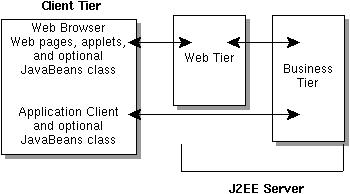
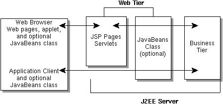
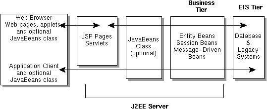
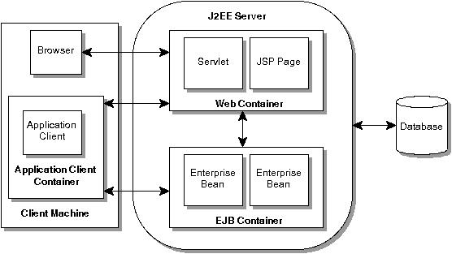

# Java EE Architecture #
## Introduction to the Java EE Architecture ##
1. For distributed, transactional applications
2. For speed, security and reliability of server side technology
3. Java EE solution:
	1. component-based approach to design, development, assembly, deployment of enterprise apps
		1. Multi-tiered distributed app model
		2. Component re-usability
		3. Unified security
		4. Flexible transaction control
		5. Components are not coupled to products and API vendors
4. Topics:
	1. Architecture
	2. Terms
	3. Concepts
	4. App programming, assembly, deployment

### Distributed Multitiered Applications ###
1. Application logic is divided into components according to function
	1. Each component can be installed on different machines
2. Parts
	1. Client tier components run on client machine
	2. Web tier components run on Java EE Server
	3. Business tier components run on Java EE Server
	4. Enterprise information system (EIS) tier software runs on EIS server
3. Machines
	1. Client machines
	2. Java EE server machine
		1. Multithreaded application server
	3. Database or legacy machines (back-end)
4. Tiers:

	

#### Java EE Application Components ####
1. Component: Self-contained functional software unit assembled into Java EE app (with related classes and files)
	1. Components
		1. App clients and applets (Client components)
		2. Java Servlet, JavaServer Pages (JSP) (web components)
		3. Enterprise JavaBeans (EJB) (business components)
	2. All written in Java
2. Java EE components are assembled into Java EE app (verified that they are well-formed and comply with Java EE spec, deployed and run by Java EE server)

#### Client Components ####
1. Client executes on client machine or non-web-based Java EE app.

##### Application Clients #####
1. Used by users for system and app administration
	1. Swing
	2. AWT
	3. Commandline interface
2. Can access enterprise beans in business layer
3. Can access Servlet in web tier

##### Web Browsers #####
1. Web browser downloads HTML, WML or XML from web tier.
2. Dynamic web pages are generated by servlets or JSP pages running in web tier

##### Applets #####
1. Web page can include embedded applet.
	1. Client app written in Java that executes in Java VM installed in web browser
	2. May need plug-in and security policy file
2. JSP: not plug-ins or security policy files
	1. Cleaner and more modular app design (separates app programming from web page design)
		1. No Java programming syntax
3. Applets running in network-based systems (handheld devices, car phones) render WML (Wireless Markup Language) pages generated by JSP page or Servlet (running on Java EE server).
	1. WML delivered over Wireless Application Protocol (WAP)
	2. Network config requires gateway to translate WAP to HTTP and back
	
			Handheld device - WML over WAP -> Gateway - HTTP request -> Java EE Server
			Java EE Server - HTTP Response -> Gateway - WML over WAP -> Handheld device

##### JavaBeans Component Architecture #####
1. JavaBeans: Used to manage data flow between app client or applet and components running on Java EE Server
	1. They are not components by Java EE specification
	2. They have instance variables, getters and setters
	3. Should confirm to naming and design conventions (outlined in JavaBeans component architecture)

##### Java EE Server Communications #####
1. Elements of client tier:

	

2. Client communicates with business tier (running on Java EE server)
	1. Directly
	2. By going through JSP pages or servlets running in web tier

#### Thin Clients ####
1. Does not query databases, execute complex business rules, connect to legacy apps.
	1. Heavy weight operations are offloaded to web or enterprise beans (executed on Java EE server - security, speed, services, reliability)

#### Web Components ####
1. Web components: JSP pages or Servlets
	1. Servlet: classes that dynamically process requests and construct responses
	2. JSP: static content and snippets of Java programming language code to generate dynamic content
		1. Background servlet executes the code snippet and returns a response
2. Static HTML + applets are bundled with web components during app assembly.
	1. Server side utility classes can be bundled with web components
3. Web tier can include JavaBeans to manage user input (send input to enterprise beans)

	

#### Business Components ####
1. Meets needs of business domain (banking, retail, finance)
	1. Handled by enterprise beans running in business tier
2. Three kinds of enterprise beans
	1. Session beans
		1. For transient conversation with client
		2. Session bean and its data are gone when client finishes executing
	2. Entity beans
		1. Represents persistent data stored in one row of a database table
		2. Entity bean data is saved if client terminates or server shuts down
	3. Message-driven beans
		1. Combines session bean and JMS message listener features
			1. Business component can receive JMS messages asynchronously
		2. [Java Message Service Tutorial](http://java.sun.com/products/jms/tutorial/)

	

#### Enterprise Information System Tier ####
1. Handles enterprise information system software
	1. Includes enterprise infrastructure systems
		1. Enterprise Resource Planning (ERP)
		2. Mainframe transaction processing
		3. Database systems
		4. Legacy information systems

### Java EE Architecture ###
1. Problem: Transaction, state management, multithreading, resource pooling ... code is required for thin-client multitiered apps
	1. Solution: component-based platform-independent Java EE architecture (easier to write)
		1. Business logic is organized into reusable components (just concentrate of this)
		2. Java EE server provides underlying services in the form of container for every component type

#### Containers and Services ####
1. Components are installed in containers during deployment
2. Container: interface between component and low-level platform-specific functionality
	1. All components are assembled into Java EE application and deployed into container
		1. Assembly process: specifying container settings for each component and Java EE app.
			1. Container settings: customizes underlying support provided by Java EE server (security, transaction management, JNDI lookups, remote connectivity)
				1. Java EE Security model: to configure web component or enterprise bean so that system resources are accessed only by authorized users
				2. Java EE transaction model: specifies relationships among methods that make up single transaction (all methods are treated as a single unit)
				3. JNDI lookup service: unified interface to multiple naming and directory services in enterprise
				4. Java EE remote connectivity model manages low-level communications between clients and enterprise beans.
					1. Client can invoke methods on enterprise bean as if it were in same virtual machine
	2. Configurable services can make app components within same Java EE apps behave differently based on where they are deployed.
		1. enterprise bean with security settigs that allow it certain level of access to database data (may be different for different production environments)
	3. Manages non-configurabel services: enterprise bean life cycle, servlet lifecycle, database connection resource pooling, data persistence, access to Java EE platform APIs [Java EE APIs](http://pawlan.com/monica/articles/j2eearch/#apis)
		1. We can override container-managed persistence (with code in enterprise bean)
			1. bean-managed persistence for finder methods or customized database cache (example)

#### Container Types ####
1. Components are installed in following types of containers
	1. Enterprise JavaBeans (EJB) container manages execution of enterprise beans
		1. EJBs and container run on Java EE server
	2. Web container manages execution of JSP and Servlet components
		1. Web components and container run on Java EE server
	3. App client container manages execution of all app client components for one Java EE app.
		1. Run on client machine
	4. Applet container: web browser and Java plugin
		1. Run on client machine

	

### Packaging ###
1. Java EE components are packaged into Java EE application for deployment
	1. Component(s) + GIF + HTML + Server side utility files + deployment descriptor (DD)
2. Java EE app: enterprise bean(s) + web component + app client component
	1. App and each module has its own deployment descriptor
		1. DD: Extensible Markup Language (XML) text-based file with .xml extension (describes component's deployment settings)
		2. EJB DD: transaction attributes, security authorizations
			1. Server reads DD at runtime
	2. Delivered as Enterprise ARchive (EAR) file. (Standard .jar file with .ear extension)
		1. GUI version of Java EE SDK: Build EAR file first and add JAR and WAR files to it
3. Java EE SDK tools [Tools](http://pawlan.com/monica/articles/j2eearch/#tool)
	1. EJB JAR: contains DD, related files, .class files for enterprise bean
	2. App client JAR: contains DD, related files, .class files for app client
	3. WAR: contains DD, related files, .class files for servlet or .jsp files
4. We can reuse the components and assemble different Java EE applications as EAR files

### Development Roles ###
1. App development and deployment processes can be divided into distinct roles (because of re-usable components)
	1. Different people or companies can perform different parts of the process
	2. Roles
		1. Purchasing and installing Java EE product and tools
		2. Development by application component providers
		3. Assembly by assemblers
		4. Deployment by application deployers
2. Why is this possible?
	1. Each earlier role outputs portable file which is input for subsequent role
		1. Product interface is independent of platform and is repeatable
		2. Components are reusable and portable
		3. Assembly is independent of platform and is repeatable
		4. Deployment process is independent of platform and is portable
	2. Example:
		1. App developer delivers EJB JAR files
		2. Another developer combines EJB JAR files into Java EE app (EAR)
		3. System admin uses EAR to install Java EE app into Java EE server

#### Java EE Product Provider ####
1. Company that builds Java EE platform, APIs, other features (must comply with Java EE spec). Vendors who provide
	1. OS
	2. Database
	3. App server
	4. Web server

#### Tool Provider ####
1. Company that builds development, assembly and packaging tools (used by component providers, assemblers, deployers)
	1. [Tools](http://pawlan.com/monica/articles/j2eearch/#tool)

#### Application Component Provider ####
1. Who builds web components, enterprise beans, applets, application clients

##### Enterprise Bean Creation #####
1. Software developer performs
	1. Writes and compiles source code
	2. Specifies deployment descriptor
	3. Bundles .class files and deployment descriptor into EJB JAR file

##### Web Component Creation #####
1. Web designer (JSP pages) or Software developer (Servlets) performs
	1. Writes and compiles servlet source code
	2. Writes JSP and HTML files
	3. Specifies deployment descriptor for web component
	4. Bundles .class, .jsp, .html and deployment descriptor files into WAR file

##### Java EE Application Client Creation #####
1. Software developer performs
	1. Writes and compiles source code
	2. Specifies deployment descriptor for client
	3. Bundles .class files and deployment descriptor into JAR file

#### Application Assembler ####
1. Company or person that gets App component JAR files from component providers and assembles them into Java EE app EAR file.
	1. Can edit deployment descriptor directly or use tools that correctly add XML tags according to interactive selections.
2. Software developer performs
	1. Assembles EJB JAR and web components (WAR) files into Java EE EAR file
	2. Specifies deployment descriptor for Java EE app
	3. Verifies that contents of EAR file are well-formed and comply with Java EE app

#### Application Deployer and Administrator ####
1. Configures and deployes Java EE app, administers computing and networking infrastructure, oversees runtime environment
	1. Sets transaction controls, security attributes, specifies connections to db
	2. Instructions are provided by component provider to resolve external dependencies, security settings, assign transaction attributes
	3. Container specific classes and interfaces are produced when app is moved to server
2. Deployer/System adiministrator performs
	1. Adds EAR file to Java EE server
	2. Configures Java EE app for operational environment by modifying deployment descriptor of Java EE app
	3. Verifies that contents of EAR file are well-formed and comply with Java EE spec
	4. Deploys (installs) Java EE app EAR file into Java EE server

### Reference Implementation Software ###
1. Java EE SDK - freely available
	1. Comes with Java EE app server, web server, relational database, Java EE APIs and development and deployment tools
		1. [Java EE SDK](http://java.sun.com/javaee/downloads/index.jsp)
2. Product providers use Java EE SDK to determine what the implementations must do under a given set of app conditions
	1. Run Java EE compatibility test suite to test the products if they comply with spec
3. App developers run Java EE apps on Java EE SDK to verify that app is fully portable across all Java EE products and tools

#### Web Server ####
1. Provides service for one or more web containers.
	1. Web container relies on Web server to provide HTTP message handling

#### Database Access ####
1. See list of databases currently supported by reference implementation

#### Java EE APIs ####
1. J2SE SDK is required for Java EE SDK
2. Provides APIs for writing 
	1. Java EE components
	2. Core development tools
	3. Java Virtual Machine (JVM)
3. The following APIs are provided

##### Enterprise JavaBeans Technology 2.0 #####
1. Enterprise bean:
	1. Code with fields and methods to implement modules of business logic
	2. Can be used with other enterprise beans to execute business logic
2. Three kinds
	1. session beans
	2. Entity beans
	3. Message-driven beans
3. No SQL code or JDBC API required for entity bean (EJB container handles it)
	1. Use JDBC API to override default container managed persistence
	2. Use JDBC API if Session bean must access database

##### JDBC 2.0 API #####
1. JDBC API:
	1. Used to invoke SQL commands from methods
	2. Used in enterprise bean (to override default container-managed persistence or for session bean)
	3. Used in Servlet or JSP to access database directly
2. Two parts
	1. Application-level interface (used by app components to access database)
	2. Service provider interface (to attach JDBC driver to Java EE platform)

##### Java Servlet Technology 2.3 #####
1. To define HTTP-specific servlet classes
	1. Servlet: extends capabilities of servers (using request response programming model)
		1. Commonly used to extend apps hosted by web servers

##### JavaServer Pages (JSP) #####
1. Used to combine Java code with static markup in a text document.
	1. Static data: HTML, WML, XML
	2. Dynamic content: JSP elements

##### Java Message Service (JMS) 1.0 #####
1. Messaging standard that allows Java EE app components to build, send, receive and read messages.
2. Enables distributed communication that is loosely coupled, reliable, asynchronous

##### Java Transaction API (JTA) 1.0 #####
1. JTA API:
	1. Provides standard demarcation interface for demarcating transactions.
	2. Default auto commit is provided to handle transaction commits and roll backs
		1. Auto commit: other app viewing data will see updated data after each database read or write operation
		2. If we want two separate database operations that depend on each other, use JTA API to demarcate where entire transaction including both operations begins, rolls back, and commits

##### JavaMail #####
1. To send mail
2. Two parts
	1. app-level interface (used by app components to send mail)
	2. Service provider interface

##### JavaBeans Activation Framework (?) #####
1. JavaMail uses it
2. Provides standard services to determine type of arbitrary piece of data, encapsulate access to it, discover operations available on it, creation of appropriate JavaBean component to perform those operations.
3. Used to interact with userlying resource manager (resource adapter is specific to resource manager - one resource adapter is required per resource manager)

##### Java API for XML (JAXP) #####

##### Java EE Connector API #####
1. JAAS - app can authenticate and authorize specific user or group of users to run it using JAAS.
	1. JAAS is Java version of Pluggable Authentication Module (PAM)
	2. Extends Java 2 platform security architecture

##### Java Authentication and Authorization Service (JAAS) #####
1. Connector API: used by Java EE tools vendors and system integrators to build resource adapters that support access to enterprise information systems (can be plugged into any Java EE product)

#### Tools ####
1. Java EE reference implementation
	1. App deployment tool
	2. Scripts for assembling, verifying, deploying Java EE apps and managing development and production envs
	3. [The Java EE Tutorial](http://java.sun.com/javaee/reference/tutorials/)

##### Application Deployment Tool #####
1. Two versions
	1. command-line
	2. GUI: Wizards, tabbed inspector panels
		1. Packaging, configuring and deploying apps
		2. Packaging, configuring enterprise beans
		3. Packaging, configuring web components
		4. Packaging, configuring app clients
		5. Packaging, configuring resource adaptors

##### Scripts #####
1. j2ee - start and stop Java EE server
2. cloudscape - start and stop default db
3. cloudIJ - Run interactive sql tool. (unsupported)
4. j2eeadmin - Add JDBC drivers, JMS destinations, connection factories for resources
5. keytool - public and private keys and generate X509 self-signed certificates
6. realmtool - Import certificate files. Add Java EE users to and remove Java EE users from authentication and authorization list for Java EE app
7. packager - Package Java EE app components into EAR, EJB JAR, app client JAR, and WAR
8. verifier - Verify that EAR, EJB JAR, app client JAR, and WAR files are well-formed and comply with Java EE spec
9. runclient - Run a Java EE app client
10. cleanup - Remove all deployed apps from Java EE server

### Conclusion ###
1. Java EE platform: provides everything to design, build, test and deploy distributed multi-tiered apps.
	1. [Java EE](http://java.sun.com/javaee/reference/tutorials/) - in-depth coverage on platform features, APIs and tools
	2. [Java EE Bluiprints Digest](http://java.sun.com/developer/technicalArticles/Java%20EE/DesignEntApps/) - Java EE app design
		1. High level intro to standard programming model for multitiered, thin-client apps on Java EE platform
		2. Technologies and principles to guide Java EE app developer for most appropriate implementation options, best use of JSPs, servlets, choosing good design when implementing business logic, effectively mapping Java EE security model to enterprise computing envs and infrastructures.