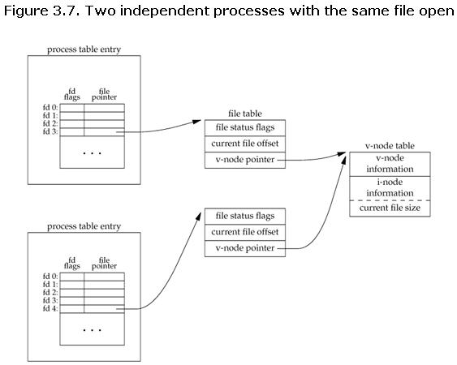

# Linux Commands #

## Distributions ##
1. Colleciton of software on top of Kernel
2. Bundles
	1. Server software
	2. System management tools
	3. Documentation
	4. Desktop apps in central secure software repo
3. Aim: common look and feel, secure and easy software management, specific operational purpose sometimes

### Red Hat ###
1. Commercial Linux
2. RHEL and Fedora are given away for free
3. RHEL is well tested before release and supported for seven years after release
4. Fedora: faster updates, no support

### Ubuntu ###
1. By Canonical
2. Popular for home users
3. Easy to use GUI desktop (commandline is discouraged)

### Debian ###
1. No company behind debian
2. Thousands of well organized developers that elect Debian project leader every two years
3. It is one of the most stable distributions
4. Basis of Ubuntu release
5. Three versions
	1. stable
	2. testing
	3. Unstable
6. Release is named after a character in toy story

### Other ###
1. CentOS, Oracle Enterprise Linux, Scientific Linux
	1. Based on RHEL
2. Linux Mint, Edubuntu, *buntu
	1. Based on Ubuntu
	2. Lot of Debian
3. Which one to choose
	1. RHEL: If I am a manager and I want good support contract
		1. Focus on stability
		2. Paid license
		3. Common on servers
	2. CentOS: Red Hat without support contract from Red Hat
		1. Based on the same code base as RHEL
		2. Stability of RHEL but reduced cost
		3. Free
		4. Community driven
		5. Not current
		6. Not for business critical services
	3. Fedora: Red Hat on Laptop or Desktop
		1. It is like a playground for new functionality
		2. Short release cycles
		3. Focus on fetures and new technology
		4. Common on desktop
		5. Feeds RHEL -> useful and enterprise demanding and stable features are moved in phases to RHEL
	4. Linux Mint: Personal graphical desktop for movies, music and games
	5. Debian: For servers, Laptops, ...
	6. Ubuntu: Very popular, based on Debian ...
	7. Kali: Pointy-clicky hacking interface
	8. Others: Arch, Gentoo, openSUSE, Scientific, ... for advanced users

## Licensing ##
1. FOSS (Free and Open Source Software)
	1. 
2. Proprietary Software
	1. Pay license fee for installation
	2. Not authorized to distribute copies
	3. Not authorized to modify the source code

### Public domain software and freeware ##
1. Public domain software:
	1. Author has given up all rights and nobody can enforce any rights
	2. Software can be used, reproduced, executed freely without permission or payment
	3. Modified versions can be taken out of public domain
2. Freeware:
	1. Proprietary software that can be used without any payment
	2. Examples:
		1. Adobe reader
		2. Skype
		3. Command and Conquer: Tiberian Sun

### Free Software or Open Source Software ###
1. Free Software, Open Source Software
	1. Free Software history: emphasis on rights
		1. Four freedoms
	2. Open Source Software: Source open for peer-to-peer development
		1. Free redistribution
		2. Source code: source code must be included in distribution
		3. Derived works: must allow modifications and distribute with the same terms as original software
		4. Integrity of author's source code: source-code is restricted from modifications unless distributed with patch files at build time. Derived works must carry different name and version number
		5. Distribution of license: rights to all to whom it is distributed
		6. Not be specific to a product: 
		7. Not restriction must be placed on other software: no restriction on other software distributed with the software
		8. Technology neutral
2. FOSS: Neutral alternative
	1. Examples: gcc, MySQL, gimp

### GNU GPL ###
1. A user who wants to distribute the improvements has to distribute with the same GNU GPL license
2. GPL v3: Internal modifications are not covered but external distributions must comply with GPL v3

## Installing Linux ##
### Installing Debian 8 ###
### Installing CentOS 7 ###
1. `who am i` **(M)**
2. `hostname` **(M)**
3. `date` **(M)**
4. `ifconfig` **(M)**
5. `ifdown eth0` **(M)** 
6. `ifup etho0`

#### Setting hostname ####
1. `hostname <name>` **(M)**
2. `cat /etc/hostname` **(M)**
3. `dnsdomainname` **(M)**: Show system's DNS domain name

#### Adding a static ip address ####
1. `ifconfig eth0:0 10.104.33.39` **(M)**
	1. Until next reboot or until `ifdown`
2. `vi /etc/network/interfaces` **(M)**
	
		auto eth0:0
		iface eth0:0 inet static
		address 10.104.33.39
		netmask 255.255.0.0

### Getting Linux at home ###

## Man Pages ##
1. `man $command`
2. `man $configfile` **(M)**
	1. `man syslog.conf`
3. `man $daemon` **(M)**
4. `man -k (apropos)` **(M)**: list of man pages containing string
5. `whatis <program>` **(M)**: single line man page description

## Working with Directories ##
1. `pwd`
2. `cd`: change directory
3. `cd ..`: change to parent directory
4. `cd -` **(M)**: change to previous directory 
5. `ls -a`: all
6. `ls -lh`: list in human readable file sizes
7. `mkdir -p`: parent directories if needed as well
8. `rmdir` **(M)**: remove if directory is empty
9. `rmdir -p`: recursively remove directories

## Working with Files ##
1. `file <file-name>` **(M)**: determines file type
2. `file -s /dev/sda` **(M)**
	1. `file -s /proc/cpuinfo`: `-s` special file(s)
3. `touch <filename>`
4. `touch -t <timestamp> <filename>` **(M)**
	1. `touch -t 200505050000 SinkoDeMayo`
5. `rm -i <file>` **(M)**: interactive remove
6. `cp -i <file>` **(M)**
7. `mv <file1> <file2>`
8. `mv -i` **(M)**
9. `rename 's/\.txt/\.png/' *.txt` **(M)**

## Working with File Contents ##
1. `head -n <file-name>` **(M)**
2. `head -4 /etc/passwd`
3. `head -c<bytes> <file-name>` **(M)**
5. `tail -n <file-name>`
6. `cat > winter.txt`
7. heredoc:

		cat > hot.txt <<EOF
		> It is hot!
		> Yes it is during summer.
		>EOF
8. `tac <file-name>` **(M)**
9. `more`, `less`
	1. `more`: old utility, cannot scroll backwards
	2. `less`: can scroll backwards
10. `strings <binary-file>` **(M)**: displays readable strings in a binary file

## The Linux File Tree ##
1. `man hier` **(M)**: info about filesystem hierarchy
1. Structure:
	1. `/bin`: binaries for users to use
	2. `/sbin`: binaries to configure operting system
	3. `/lib`: shared libraries which could be used by binaries in `/bin` and `/sbin`
	4. `/lib/modules`: Linux kernel loads modules from `/lib/modules/$kernel-version`
	5. `/lib32`, `/lib64`: register sizes used during compilation differs
	6. `/opt`: optional software
		1. `/opt/$packagename/bin`, `/opt/$packagename/man` ...
	7. `/boot`: files needed to boot the computer
		1. `/boot/grub`
	8. `/etc`: machine-specific configuration files
		1. `/etc/init.d`: scripts to start and stop daemons
		2. `/etc/X11`: Graphical display config file `/etc/X11/xorg.conf`
		3. `/etc/skel`: copied to home directory of a new user
		4. `/etc/sysconfig`: RHEL confi g files
2. Data directories
	1. `/home`: store personal project data
		1. `/home/$USERNAME`
			1. Contains data and user profiles
	2. `/root`: personal data and profile of root user
	3. `/srv`: data served by system
	4. `/media`: mount point for removable media devices (CD-ROM, digital cameras, usb-attached devices)
		1. `ls /media/`
	5. `/mnt`: empty directory used for temporary mount points
	6. `/tmp`: to store temporary data
		1. It can either use disk space or RAM.
3. In memory directories
	1. `/dev`: not located on hard disk
		1. populated with files as kernel is recognising hardware
		2. hardware is represented by device files in `/dev`s
		3. `/dev/tty1`: terminal or console attached to system
		4. `/dev/null`: black hole. Unlimited storage but nothing can be retrieved
			1. Used to discard unwanted output from commands
	2. `/proc` **(M)**: It is a view of kernel or what kernel manages.
		1. Means to interact with kernel directly
		2. `mount -t proc`
		3. `/proc/interrupts`: displays interrupts
		4. `/proc/kcore`: physicial memory representation
			1. File size is same as physical memory + 4 bytes
		5. `/sys`: kernel info about hardware
	3. `/usr` **(M)**: Unix System Resources (not User)
		1. Contains shareable read only data
		2. `/usr/bin`: contains commands
			1. `ls /usr/bin | wc -l`
		3. `/usr/include`: General include files for C
		4. `/usr/lib`: libraries not directly executed by users or scripts
		5. `/usr/local`: used by sys admin to install software locally
		6. `/usr/share`: arch independent data
			1. `/usr/share/man`: manual pages
			2. `/usr/share/games`: static game data
		7. `/usr/src` **(M)**: recommended directory for kernel source files
	4. `/var` **(M)**: variable data
		1. `/var/log` **(M)**: contains log files
		2. `/var/log/messages` RHEL **(M)**
			1. `/var/log/syslog` Ubuntu, Debian
		3. `/var/cache`: cache data for apps
		4. `/var/spool`: spool for main and cron and parent for other spool files
		5. `/var/lib`: application state info
			1. `/var/lib/rpm`: files pertaining to rpm
		6. `/var/tmp`: temporary files that survive a reboot
			1. `/var/lock`: file locks
4. `dd`: convert and copy files
5. `od`: octal dump (and other formats)

## Commands and Arguments ##
1. `echo 'A line with      single    quotes'` - spaces are retained
2. Double quotes can also be used
3. `echo -e 'Hello\nWorld'` **(M)**
4. Builtin commands
	1. `type <command-name>` **(M)**: tells the command type
5. `type -a <command-name>`: shows all versions of the command (builting and external)
6. `which <command-name>`: searches for commands in `$PATH`
7. `alias <alias-name>=<command-name>`
	1. `alias dog=cat`
	2. `alias c ll` **(M)**: view alias
8. `unalias ll`: remove alias
9. `set -x` **(M)**: displays shell expansion
10. `set +x` **(M)**: removes shell expansion mode
11. `echo -n Hello` **(M)**: remove new line at the end

## Control Operators ##
1. `<command>;<command>`: commands are executed one after the other
2. `<command> &`: command is executed in the background and shell returns
3. `echo $?`: exit code of last command
4. `<command> && <command>`: logical and
	1. second command is executed only if first command succeeds
5. `<command> || <command>`: second command is executed only if first command fails
6. `# Comment`
7. `\` escaping control characters
8. Multiple lines

		echo This command line \ 
		> is split in three \ 
		> parts

## Shell Variables ##
1. `$SHELL` **(M)**
2. `$USER` **(M)**
3. `$HOSTNAME` **(M)**
4. `$UID` **(M)**
5. `$HOME` **(M)**
6. `MyVar=555`
7. `env` **(M)**: prints a list of exported environment variables
	1. `env -i` **(M)**: cleans environment from subshell
		1. `env -i <VARIABLES> bash -c '<command>'`
8. `$PS1` **(M)**
	1. `PS1='\u@\h:\w# '`
9. `export <variable-name>`: exports variable to child shell but not to parent shell (child process inherits the variable)
10. `set -u`: displays error when shell variable does not exist
	1. `set +u`: unsets shell from displaying error message when shell variable does not exist
11. `set -o posix; set` **(M)**: displays all shell variables
12. `echo $-` **(M)**: lists all set options

## Shell Embedding and Options ##
1. `$()`: forks a new shell from current shell
	1. `echo $(var1=5;echo $var1)`
	2. We can also nest using `$()`
2. Back ticks: cannot be used for nesting

## Shell History ##
1. `!!` **(M)**: repeat last command
2. `!<characters>` **(M)**: repeat command with the given initial characters
3. `history n` **(M)**: shows last n commands
4. `!<command-number>` **(M)**: executes the command at command-number
5. `$HISTSIZE` **(M)**: number of commands remembered in current environment
6. `$HISTFILE` **(M)**: points to file that contains history
7. `$HISTFILESIZE` **(M)**: to set number of commands that can be stored in history file `$HISTFILE`
8. ` <command>` **(M)**: space prefix stops from command being recorded
9. `!c:s/1/2`: repaces 1 by 2 and runs the command in history
	1. `!<command-characters>:s/<string1>/<string2>/`

## File Globbing ##
1. `[!<character(s)>]`: excludes characters
2. `echo *` **(M)**: lists all files in current directory
3. `?`: used to match single character
	1. `File?`: Matches `File1`, `FileA`, ...
4. `[...]`: matches any one of the characters in between `[` and `]`
	1. `[a-z]`
	2. `[0-9]`
5. `$LANG`: some languages include lower case letters in upper case range
6. Preventing file globbing:
	1. Escape using special characters
		1. `echo *`
		2. `echo \*` **(M)**
		3. `echo '*'`
		4. `echo "*"`

## I/O Redirection ##
1. Streams: stdin, stdout, stderr
	1. stdin: 0
	2. stdout: 1
	3. stderr: 2
3. `>`: redirects stdout
	1. `> file` (same as `1> file`)
4. Prevent > from erasing existing file
	1. `set -o noclobber` **(M)**
5. `>|` **(M)**: overrules noclobber
6. `2>` **(M)**: redirecting error messages
7. `ls > dirlist 2>&1`: redirects both stdout and stderr to the file `dirlist`
	1. `ls 2>&1 > dirlist`: stderr makes a copy of stdout and then only stdout is redirected to dirlist
8. `&>`: joins stdout and stderr to a file
	1. `rm file42 &> out_and_err`
9. `<` or `0<`: redirecting stding
	
		myprog < input_file > output_file (myprog expects input from STDIN)
	
10. `<<`: heredoc

		cat <<EOF > text.txt
		> one
		> two
		> three
		> EOF
11. `<<<` **(M)**: herestring
	1. `base64 <<< linux-training.be`: directly passing string to a command

## Filters ##
1. `tac count.txt|cat|cat`
2. `tee`: puts stdin to stdout as well as writes to a file
	1. `tac count.txt | tee temp.txt | tac`
3. `grep -i` **(M)**: case insensitive
4. `grep -v` **(M)**: don't match
5. `grep -A1` **(M)**: 1 line After is also displayed
6. `grep -B1` **(M)**: 1 line Before is also displayed
7. `grep -C1` **(M)**: 1 line before and 1 line after are also displayed
8. `cut`: used to select columns from files
	1. `cut -d: -f1,3 /etc/passwd | tail -4` 
	2. `cut -c2-7 /etc/passwd`
9. `tr '<characters>' '<characters>'`
	1. `tr 'a-z' 'A-Z'` **(M)**
	2. `tr -d e` **(M)**: deletes e
	3. `tr -s <character>` **(M)**: squeeze
10. `wc -w`: word count
11. `wc -l`: line count
12. `wc -c`: character count
13. `sort -k<column> <file>` **(M)**:
	1. `sort -n -k<column> <file>` **(M)**: numerical sort
	2. `sort -r -k<column> <file>` **(M)**: reverse
14. `uniq <file>` **(M)**: removes duplicates from sorted list
	1. `uniq -c` **(M)**: count number of occurrences
15. `comm <file1> <file2>` **(M)**: compares streams (files)
	1. `comm -<1, 2 and/or 3> <file1> <file2>` 
16. `od`
	1. `od -t x1 <file>` **(M)**: hexadecimal
	2. `od -b <file>` **(M)**: octal
	3. `od -c <file>` **(M)**: ascii
17. `sed`
	1. `sed 's/level/jump/'`
	2. `sed 's/level/jump/g`
	3. `sed 's/<characters>/d'` **(M)**
18. `who` **(M)**: displays who is logged in

## Basic Unix Tools ##
1. `locate` **(M)**: uses index to locate files instead of traversing directories
	1. Disadvantages: it is outdated
	2. Run `updatedb` **(M)** to update the index
2. `date` **(M)**
	1. `date +'%A %d-%m-%y'` **(M)**
	2. `date +%s` **(M)**
	3. `date -d '1970-01-01 2000000000 seconds'`
3. `cal <month> <year>` **(M)**
4. `xargs`: groups input into sublists and executes the command once for each sublist
	1. `find /path -type f -print | xargs rm`
	2. `find /path -name '*.foo' | xargs -P 24 -I '{}' /cpu/bound/process '{}' -o '{}'.out`
		1. `-P <number-of-parallel-processes>`
		2. `--output <file>`: synchronize the output after parallel executions of processes
5. `time <command>` **(M)**: how long `<command>` has taken to execute
6. `gzip` **(M)**
7. `gunzip` **(M)**
8. `zcat` **(M)**: view zipped files
9. `zmore` **(M)**: view zipped files
10. `bzip2 <file(s)>`
11. `bunzip2 <file>` **(M)**
12. `bzcat`, `bzmore` **(M)**
13. `find /path -name <name> -newer <file>` **(M)**
	1. `find /path -name <name> -newerat "20100130 23:59:59"` **(M)**
		1. `newerXY`
			1. Timestamp X of file is newer than timestamp Y of file which is referenced
				1. X: 
					1. a - access time of file referenced
					2. B - Birth time of file referenced
					3. t - reference is directly interpreted as time
	2. `find ... ! -newer <file>` **(M)**

## Regular Expressions ##
1. `grep -G` **(M)**: Basic Regular Expressions
2. `grep -P`: Perl Regular Expressions
3. `grep -F`: force string to be read literally
4. `grep '\b<word>\b'` **(M)**: `\b` is word separator
	1. `grep -w <word> <file>` **(M)**
5. `rename -n`: shows what is being done instead of actual renaming
6. `sed 's:Sun:Mon:'`
7. `sed 's_Sun_Mon_'`
8. `sed 's|Sun|Mon|'`
9. `sed -i ...`: inline
10. `sed 's/Sun/&&/'` **(M)**
11. `sed 's/\(...\)/<string>/`
	1. `\1`, `\2`, ...: references to grouped substrings from regular expression
	2. `\s`: whitespace
	3. `o{n}` **(M)**: exactly n times
		1. `sed 's/o\{3\}/A/'`
	4. `o{m,n}` **(M)**: between m and n times
12. `!!:s/<pattern>/<string>/`

## Bash History ##
1. `!l`: runs the last ran `ls` command
2. `history 6`: shows the last 6 commands ran
	1. `!<number>`: runs the numbered cmmand (number is returned by `history` command)

## Scripting Introduction ##
1. `source`: forces script to run in the same shell
	
		./vars.sh
		
		#!/bin/bash
		#
		# simple variable in script
		#
		var1=4
		echo var1 = $var1
		
		source ./vars
		echo $var1
		
	1. Another way: `. ./vars.sh`
	
2. `bash -x`: see commands running (after expansion of variables)
3. `#!`: instructs shell to run the script in a particular shell
	1. `/etc/shells`: contains list of shells
4. `#!/bin/bash -` or `#!/bin/bash --`: shell will not accept any options

## Scripting Loops ##
1. test []
	1. `test` tests whether something is true or false
		
		`test 10 -gt 55; echo $?
		
2. []: test command

		[ 10 -gt 55 ] && echo true || echo false

4. Tests:

		[ -d foo] # does directory exist
		[ -e bar ] # does file exist
		[ '/etc' = $PWD ]
		[ $1 != 'secret' ]
		[ 55 -lt $bar ]
		[ $foo -ge 1000 ]
		[ "abc" < $bar ] # does abc sort before the value in $bar?
		[ -f foo ] # is foo a regular file?
		[ -r bar ] # is bar a readable file?
		[ foo -nt bar ] # is file foo newer than bar?
		[ -o nounset ] # is the option nounset set?
		[ -s foo ] # file is not zero size
		[ -d foo ] # file is a directory
		[ -b foo ] # file is a block device
		[ -c foo ] # file is a character device
		[ -p foo ] # file is a pipe
		[ -h foo ] # file is a symbolic link
		[ -L foo ] # file is a symbolic link
		[ -S foo ] # file is a socket
		[ -t foo ] # file descriptor (handle used to access file/socket/pipe) is associated with a terminal device
		[ -w foo ] # file has write permission (for the user who is running this test)
		[ -x foo ] # file has execute permission (for the user who is running this test)
		[ -s foo ] # set-group-id flag is set on the file or directory
		[ -u foo ] # set-user-id flag is set on the file or directory
		[ -k foo ] # sticky bit is set
		[ -O foo ] # i am owner of the file
		[ -G foo ] # group-id of file is same as mine
		[ -N foo ] # file modified since last read
		[ foo -ot bar ] # file foo is older than bar
		[ foo -ef bar ] # both foo and bar are hard links to the same file
		
		! # not - reverses the above tests
		[ ! -e foo ]

	
		
5. Logical and or or:

		[ 66 -gt 55 -a 66 -lt 500 ] && echo true || echo false
		[ 66 -gt 55 -o 660 -lt 500 ] && echo true || echo false
	
2. if then else

		#!/bin/bash
		
		if [ -f isit.txt ]
		then echo isit.txt exists!
		else echo isit.txt not found!
		fi

3. if then elif

		#!/bin/bash
		count=42
		if [ $count -eq 42 ]
		then
			echo "42 is correct."
		elif [ $count -gt 42 ]
		then
			echo "Too much."
		else
			echo "Not enough."
		fi

4. for loop

		for i in 1 2 4
		do
			echo $i
		done
		
	1. for loop with embedded shell
	
			#!/bin/bash
			for counter in `seq 1 20`
			do
				echo counting from 1 to 20, now at $counter
				sleep 1
			done
			
	2. Using `{from..to}` shorthand
	
			#!/bin/bash
			for counter in {1..20}
			do
				echo counting from 1 to 20, now at $counter
			done
			
	3. file globbing with for
	
			for file in *.ksh ; do cp $file $file.backup ; done

5. while loop

		i=100;
		while [ $i -gt 100 ] ;
		do
			echo Counting down, from 100 to 0, now at $i;
			let i--;
		done
		
	1. Endless loops with `while true` or `while :` (`:` means no operation)
	
			#!/bin/bash
			# endless loop
			while :
			do
				echo hello
				sleep 1
			done

6. until loop

		let i=100
		until [ $i -le 0 ]
		do
			echo Counting down, from 100 to 1, now at $i
			let i--;
		done

## Scripting Parameters ##
1. Script parameters
	
		#!/bin/bash
		echo The first argument is $1
		echo The second argument is $2
		echo The third argument is $3
	
		echo \$ $$ PID of the script
		echo \$ $# count arguments
		echo \$ $? last return code
		echo \$ $* all the arguments as a string

2. Shift through parameters
1. `shift` can parse parameters one by one

		#!/bin/ksh
		
		if [ "$#" == "0" ]
		then
			echo You have to give at least one parameter
			exit 1
		fi
		
		while  (( $# ))
		do
			echo You gave me $1
			shift
		done

3. Runtime input
	1. Use `read` command to ask input
	
			#!/bin/bash
			echo -n Enter a number:
			read number

4. Sourcing a config file
	1. one script can be sourced inside another and values of first script can be used in another
	
			#/bin/bash
			#
			# Welcome to the myApp application
			#
			
			. ./myApp.conf
			
			echo There are $quines quines

5. Get script options with getopts
	1. `getopts`: used to parse options given in commandline
	
			#!/bin/bash
			
			while getopts ":afz" option
			do
				case $option in
					a)
						echo received -a
						;;
					f)
						echo received -f
						;;
					z)
						echo received -z
						;;
					*)
						echo "invalid argument -$OPTARG"
						;;
				esac
			done
			
		1. Option that needs an argument
		
				

6. Get shell options with shopt
	1. `shopt`: used to toggle values of variables (which control behavior of shell)
	
			shopt -q cdspell ; echo $?
			shopt -s cdspell
			shopt -q cdspell ; echo $?
			cd /Etc
			
		1. first command checks if `cdspell` is set
		2. second command actually sets `cdspell`
		3. third command checks again if `cdspell` is set
		4. fourth command allows spelling mistake in `cd` command

## More Scripting ##
1. eval
	1. `eval` passing arguments to the shell (the command is executed)
		
			lastweek=date --date="1 week ago"
			eval $lastweek

2. (()): used for evaluation of numerical expressions

		(( 42 > 33 )) && echo true || echo false
		var42=42
		(( 42 == var42 )) && echo true || echo false

3. let
	1. evaluates an arithmetic expression
	
			let x="3 + 4" ; echo $x
			let x="10 + 100/10" ; echo $x
			
	2. Can convert between different bases
	
			let x="0xFF" ; echo $x
			let x="077" ; echo $x
			
			# x="0xFF" does not evaluate the expression but simply assigns the value given

4. case

		#!/bin/bash
		#
		# Wild Animals Helpdesk Advice
		#
		echo -n "What animal did you see ?"
		read animal
		case $animal in
			"lion" | "tiger")
				echo "You better start running fast!"
				;;
			"cat")
				echo "Let that mouse go..."
				;;
			"dog")
				echo "Don't worry, give it a cookie."
				;;
			"chicken" | "goose" | "duck")
				echo "Eggs for breakfast!"
				;;
			"liger")
				echo "Approach and say 'Ah you big fluffly kitty...'."
				;;
			"babelfish")
				echo "Did it fall out your ear ?"
				;;
			*)
				echo "You discovered an unknown animal, name it!"
				;;
		esac	

5. shell functions

		#!/bin/bash
		
		function greetings {
			echo Hello World!
			echo and hello to $USER too!
		}
		
	1. function can receive parameters
	
			function plus {
				let result="$1 + $2"
				echo $1 + $2 = $result
			}
			
			plus 4 6

## Introduction to Users ##
1. `whoami`: my username
2. `su username`: log in with same environment
	1. `su - username`: another environment
3. `sudo -u user bash -c '<command>'`: run command as another user

## User Management ##
1. `/etc/passwd`: local user database
2. `useradd -m -d /home/<user> -c "description" <user>` **(M)**:
	1. `-m`: force home directory creation
	2. `-d`: home directory path
	3. `-c`: description
3. `userdel -r <user>` **(M)**
	1. `-r`: removes home directory
4. `usermod` **(M)**: modify user properties

## User Passwords ##
1. `passwd <user>` **(M)**
	1. password is encrypted and kept in `/etc/shadow` **(M)**
2. Generating encrypted password:

		openssl passwd hunter2 # uses different salt for each run
		openssl passwd -salt 42 hunter2 # uses only one salt value given
3. Adding user with encrypted password:

		useradd -m -p $(openssl passwd hunter2) mohamed
4. `chage -E <expiration-date> -m <min-password-age> -M <max-password-age>`: sets expiration date for user account
	1. `chage -l <username>`
5. Disabling password:
	1. Put `!` in front of second field in `/etc/shadow` for the user

			laura:!$6$JYj4JZqp$stwwWACp3OtE1R2aZuE87j.nbW.puDkNUYVk7mCHfCVMa3CoDUJ

## User Profiles ##
1. `/etc/profile` is sourced if it exists first
2. `~/.bash_profile` bash will source it
	1. CentOS7: checks for `~/.bashrc` and sources it
	2. For bash shell only
3. `~/.bash_login` bash will source it if `~/.bash_profile` does not exist
4. `~/.profile` bash will execute it if `~/.bash_profile` and `~/.bash_login` do not exist
	1. In Debian, it executes `~/.bashrc`
	2. For original bourne shell
5. `~/.bashrc` often sourced by other scripts
6. `~/.bash_logout` executed by bash during logout

## Groups ##
1. `groupadd <groupname>` 
2. `usermod -a -G <groupname>`
3. `groupmod`: modify group
4. `groupdel`: delete a group
5. `groups`: displays groups the user belongs to

##  Standard File Permissions ##
1. `chgrp` **(M)**

##  Advanced File Permissions ##
1. sticky bit: only owner of the file or directory can remove or rename the file
	1. `chmod +t`
		1. `rwxrwxrwT`
			1. `T` if execute permission does not exist
			2. `t` if execute permission exists
2. setgid bit (on directory):
	1. makes sure files in a particular directory are owned by the group owner of the directory

		sudo chmod +s tom_dir/
		> tom_dir/file1
		ls -lrt tom_dir/

		-rw-rw-r-- 1 am tom 0 May 18 22:15 file1

3. setgit bit (on file):
	1. File is executed with permissions of file owner (not executing owner)
		1. If any user executes a file that belongs to root with setuid bit set, will execute as root 

##  Access Control Lists ##

## File Links ##
1. inode: metadata about a file
