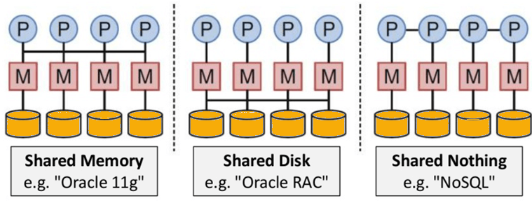
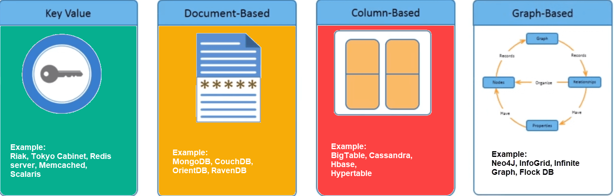
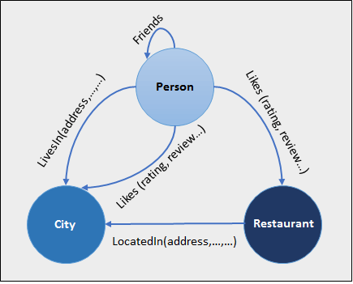

# NoSQL Tutorial: Types of NoSQL Databases, What is & Example #
## What is NoSQL? ##
1. It is non-relational data management system - it does not require a fixed schema
	1. Avoids joins
	2. Easy to scale
		1. For distributed data stores (with humongous data storage needs)
			1. Big data (Terabytes of user data every single day)
			2. real-time web apps
2. NoSQL - "Not Only SQL" or "Not SQL"
	1. Better term: "NoREL"
3. Traditional RDBMS uses SQL to store and retrieve data for further insights
	1. NoSQL encompasses a range of db technologies that can store data that is
		1. structured
		2. semi-structured
		3. unstructured
		4. polymorphic (?)

## Why NoSQL? ##
1. System response becomes slow when we use RDBMS for massive volumes of data
	1. One solution: Scaling up (upgrade existing hardware)
		1. Problem: expensive
	2. Second solution: Distribute db load on multiple hosts (whenever load increases)
		1. Scaling out
			1. Designed as non-relational - scales out better
				1. Good for web applications

## Features of NoSQL ##
### Non-Relational ###
1. NoSQL 
	1. Don't follow the [relational model](https://www.guru99.com/relational-data-model-dbms.html)
	2. Don't provide with flat flixed-column records
	3. Work with self-contained aggregates or BLOBs
	4. Doesn't require **object-relational mapping** and **data normalization**
	5. Has no complex features like 
		1. Query languages
		2. Query planners
		3. Referential integrity joins
		4. ACID
		 
### Schema-free ###
1. NoSQL dbs are schema-free or have relaxed schemas
	1. It has implicit schema (SQL has explicit schema)
2. NoSQL dbs do not require definition of the schema of data
3. NoSQL dbs offer heterogeneous structures of data in same domain

### Simple API ###
1. Easy to use interfaces for storage and querying data
2. APIs allow low level data manipulation & selection methods
3. Text-based protocols - REST with JSON mostly
4. No standard based NoSQL query language mostly
5. Web-enabled dbs running as internet-facing services

### Distributed ###
1. Multiple NoSQL dbs can be executed in distributed fashion
2. Auto-scaling & fail-over capabilities
3. ACID is often sacrificed for scalability & throughput
4. Replication types
	1. No synchronous replication
	2. Asynchronous multi-master replication
	3. Peer-to-peer
	4. HDFS replication
5. Eventual consistency only
6. Shared nothing architecture
	1. Less coordination & higher distribution

	

## Types of NoSQL Databases ##
1. Four types
	1. key-value pair
	2. Column-oriented
	3. Graph-based
	4. Document-oriented
2. Each type has unique attributes and limitations
	1. None will solve all problems
		1. Chosen based on product needs
3. Types:
	1. Key-value pair based
	2. Column-oriented Graph
	3. Graph based
	4. Document oriented

	

### Key Value Pair Based ###
1. Data is in key/value pairs
	1. Designed to handle **lots of data** & **heavy load**
		1. Stored as hash table - every key is unique
			1. Value can be
				1. JSON
				2. BLOB (Binary Large Object)
				3. String
				4. ...
	2. Example:

			Key				Value
			Name			Joe Bloggs
			Age				42
			Occupation	Stunt Double
			Height			175cm
			Weight			77kg
			
		1. The database is used as
			1. Collection
			2. Dictionairies
			3. Associative arrays (?)
			4. ...
		2. Developers can use it to store schemaless data
			1. Ex: Shopping cart content
2. Examples: (All based on Amazon's Dynamo Paper)
	1. Redis
	2. Dynamo
	3. Riak

### Column-based ###
1. They work on columns
	1. They are based on BigTable paper by Google
2. Every column is treated separately
	1. Values of single column databases are stored contiguously
3. Why store like this?
	1. High performance is delivered on aggregation queries
		1. SUM
		2. COUNT
		3. AVG
		4. MIN
		5. ...
	2. Why?
		1. Data is readily available in column
4. Use cases:
	1. Warehouses
	2. [Business Intelligence](https://www.guru99.com/business-intelligence-definition-example.html)
	3. CRM
	4. Library card catelogs
5. Example Implementations
	1. HBase
	2. Cassandra
	3. Hypertable
6. [Columnar Database](https://www.omnisci.com/technical-glossary/columnar-database#:~:text=Columnar%20databases%20are%20used%20in,together%2C%20which%20reduces%20seek%20time.)
	1. Advantages of columnar database:
		1. Fast for queries involving only few columns
		2. Fast for aggregation queries against vast amount of data
		3. Fast for column wise compression
	2. Disadvantages of columnar database:
		1. If multiple fields need to be read from each row
		2. Takes more time to write new data
			1. Each column has to be written one after the other
	2. Advantages of traditional database:
		1. Supports incremental data loading
		2. Good for online transaction processing (OLTP) usage
		3. Good for queries against only a few rows
7. Aggregation queries are faster: Reduces seek time for small number of columns because all values of a column are placed close to each other and all the values can be read one after the other
	1. O(c) - seek time, where c is the number of columns saught in the query
8. Analytical applications benefit from columnar database because retrieval is fast for columns of data
	1. Good for data warehouses
	2. Good for big data processing
		1. They can scale using distributed clusters of low-cost hardware to increase throughput 

### Document-Oriented ###
1. Stores and retrieves data as a key-value pair
	1. Value - stored as document
		1. in JSON or XML
2. The document structure doesn't have to be defined or consistent
3. Use cases
	1. CMS
	2. Blogging platforms
	3. Real-time analytics
	4. e-commerce applications
4. It should not be used for complex transactions
	1. Transactions that require multiple operations
	2. Queries against aggregate structures

### Graph-Based ###
1. Graph db stores
	1. Entities
	2. Relationships amongst entities
2. Entity is stored as a node with relationship as edges
	1. Each node and each edge has a unique id

	
	
3. Graph db is multi-relational in nature
4. Traversing relationships is faster
	1. The relationships are already captured into the DB
		1. No need to calculate the relationships on the fly
5. Use cases:
	1. Social networks
	2. Logistics
	3. Spatial data
6. Example implementations:
	1. Neo4J
	2. Infinite Graph
	3. OrientDB
	4. FlockDB

## Query Mechanism Tools for NoSQL ##
1. REST - most common data retrieval mechanism
	1. value - based on key or ID with GET resource
2. Document store vs key/value store
	1. Offers more difficult queries - they understand the value in key-value pair
		1. Example: CouchDB - allows defining views with MapReduce (?)

## What is the CAP Theorem? ##
### Consistency ###
1. Data should remain consistent even after execution of an operation
	1. Once data is written, any future read request should return the new data
		1. Example: After updating order status, all clients should be able to see same data

### Availability ###
1. Database should always be available and responsive
	1. It should not have any downtime

### Partition Tolerance ###
1. System should continue to function even if communication among servers is not stable
	1. Example: servers can be partitioned into multiple groups which may not communicate with each other
		1. If part of the db is unavailable, other parts are not affected

## Eventual Consistency ##
1. Having copies of data on multiple machines
	1. For:
		1. High availability
		2. Scalability
2. Changes made to any data item on one machine needs to be propagated to other replicas
	1. Data replication is not instantaneous
		1. Some copies will be updated immediately while others in due course of time
			1. Eventually consistent
3. BASE - Basically Available, Soft State, Eventual Consistency
	1. Basically Available: DB is available all the time (per CAP theorem)
	2. Soft state: Even without input, system state might change
	3. Eventual Consistency: System will become consistent over time

## Advantages of NoSQL ##
1. Can be used as
	1. Primary data store
	2. Analytic data store
2. Big data capability
3. No single point of failure
4. Easy replication
5. No need for separate caching layer
6. Provides fast performance and horizontal scalability
7. It can handle the following data with equal effect
	1. Structured
	2. Semi-structured
	3. Unstructered data
8. Easy to use with object-oriented programming
9. They do not require dedicated high performance server
10. They support key developer languages and platforms
11. Simple to implement than RDBMS
12. It can serve as primary data source for online applications
13. Handles big data which manages
	1. Data velocity
	2. Variety
	3. Volume
	4. Compexity
14. Excels at distributed database and multi-data center operations
15. Eliminates need for specific caching layer to store data
16. Offers flexible schema design which can easily be altered without downtime or service disruption

## Disadvantages of NoSQL ##
1. No standardization rules
2. Limited query capabilities (RDBMS has complex querying capabilities)
3. RDBMS databases and tools are comparitively mature
4. Does not offer traditional db capabilities
	1. Consistency - when multiple transactions are performed simultaneously
5. When volume of data increases, it is difficult to maintain unique values as keys
6. Doesn't work as well with relational data
7. Learning curve is stiff for new developers
8. Open source option is not so popular for enterprises

## Summary ##
1. No fixed schema
2. Avoids joins
3. Easy to scale
4. NoSQL is popular with huge volumes of data
5. It is schema free or has relaxed schema
6. Four types
	1. Key-value pair based
	2. Column oriented
	3. Graph based
	4. Document-oriented
7. NoSQL can handle
	1. Structured data
	2. Semi-structured data
	3. Unstructured data
8. CAP theorem
	1. Consistency
	2. Availability
	3. Partition Tolerance
9. BASE - Basically Available, Soft state, Eventual consistency
10. Eventual Consistency: to have copies of data on multiple machines to get high availability and scalability
11. NoSQL offer limited query capabilities