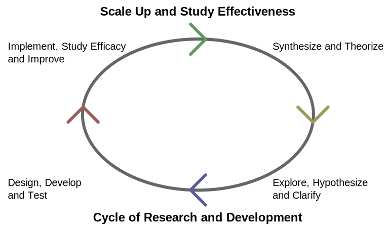

# Research and Development #

## Introduction ##
1. Innovative activities undertaken by corporations or governments in developing new services or products, or improving existing services or products
	1. It is the first stage of development of a potential new service or product
2. Models: 2
	1. Staff: Engineers, Task: Developing new products
	2. Staff: Industrial scientists, Task: Applied research (scientific or technological fields) - facilitates future product development (not immediate utility)
3. Drawbacks:
	1. No immediate profit
	2. Greater risk
	3. Uncertain return on investment
4. Advantages:
	1. Helps acquire larger shares of market through marketisation of new products

## Background ##
1. New product design and development is required for survival of a company
2. Design and range of products must be revised (due to competition + evolving preferences of customers)
	1. Alternative:
		1. Strategic alliances
		2. Acquisitions
		3. Tap into innovations of others
3. Marketing driven system:
	1. Customer needs first
		1. Produces goods known to sell
	2. Market research:
		1. Establishes needs of customers
		2. Establishes potential niche market of new product
4. Technology driven system:
	1. Develops products to meet unmet needs
5. Goal:
	1. Uses method of scientific research but directed toward desired outcomes and broad forecasts of commercial yield
6. R&D intensity: ratio of research and development for an industrial company

## Business R&D ##
1. Difficult to manage
	1. Researchers do not know in advance exactly how to accomplish desired result
2. Risky financial area
	1. Invention development + successful realization are uncertain (profitability)
	2. **Entrepreneurs** reduce uncertainties by buying license for a franchise (know-how (practical knowledge on how to accomplish something - confidentially held information in the form of unpatented inventions, formulae, designs, drawings, procedures and methods together with accumulated skills and experience in the hands of licensor firm's professional personnel which could assist (company) of the product in its manufacture and use and bring to it a competitive advantage) is incorporated in the license)
		1. Franchise: Authorization granted by government or company to individual or group (enables to carry out specified commercial activities - example: agent for company's products)

### Benefit by sector ###
1. Positive correlation between R&D and firm productivity (especially for high-tech firms)