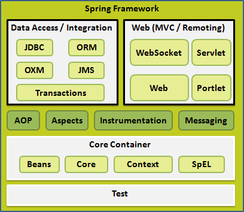
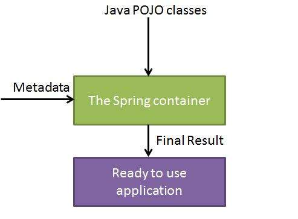

# Spring Tutorial #
## Introduction ##
1. Spring framework is open source Java platform
2. It gives comprehensive infrastructure support for robust Java apps to develop easily and rapidly.
3. Version: 4.2.6

### Audience ###
1. Java programmers who wants to learn architecture and usage.
2. Can gain intermediate level of expertise

### Prerequisites ###
1. Java
2. Eclipse

### Questions and Answers ###
1. For Certification Exams and Job interviews
2. Sample interview questions, MCQs
3. [Study Spring Questions and Answers](https://www.tutorialspoint.com/spring/spring_questions_answers.htm)

## Sprint Framework - Overview ##
1. It is an app development framework for enterprise Java
2. It is used for
	1. High performance
	2. Easily testable code
	3. Reusable code
3. Spring is lightweight in size and transparency (?)
	1. Basic version is around 2 MB
4. Core Spring features can be used to develop any Java app
	1. Extensions are used to develop web apps on top Java EE platform
5. Purpose: To make JavaEE development easier
	1. promotes POJO-based programming model for good programming practice

### Benefits of Using Spring Framework ###
1. Enables developers to develop enterprise-class apps using POJOs.
	1. No need for EJB container product like app server but can use robust container like Tomcat or some commercial product.
2. Spring is organized in modular fashion
	1. Consider only the packages and classes that you need and forget the rest.
3. Spring utilizes existing ORM frameworks, logging frameworks, JEE, Quarts and JDK timers and view technologies
4. Testing a Spring app is simple since environment dependent code is moved into framework.
	1. JavaBean-style POJOs make it easier to use dependency injection for injecting test data
5. Spring's web framework is well designed MVC framework (good alternative to Structs or other over engineered or less popular web frameworks)
6. Spring has API to translate technology-specific exceptions (thrown by JDBC, Hibernate, or JDO ...) into consistent, unchecked exceptions.
7. Lightweight IoC containers are lightweight when compared to EJB containers.
	1. Good for deploying to computers with limited memory or CPU
8. Spring provides consistent transaction management interface that can scale down to local transaction and scale up to global transactions (using JTA ...)

### Dependency Injection (DI): ###
1. DI is a flavor of Inverstion of Control.
	1. IoC: A general concept and DI is an example
3. For complex Java apps, app classes should be as independent as possible of Java classes which enables reuse of the classes while doing unit testing.
4. DI helps in gluing the classes together while keeping them independent.
5. DI:
	1. Dependency: an association between two classes
		1. Example: class A is dependent on class B.
	2. Injection: class B will get injected into class A by the IoC.
	3. Examples:
		1. parameters passed to constructor
		2. parameters passed to setter methods

### Aspect Oriented Programming (AOP) ###
1. AOP framework:
	1. cross-cutting concerns: functions that span multiple points of an app.
		1. functions are conceptually separate from app's business logic.
	2. Examples of aspects:
		1. logging
		2. declarative transactions
		3. security
		4. caching
2. The unit of modularity in AOP is aspect.
	1. aspect: 
3. AOP decouples cross-cutting concerns from objects that they affect.
4. Method-interceptors, Point-cuts: decouples code that implements functionality which must be separated.

## Sprint Framework - Architecture ##
1. We can choose only the modules applicable.
2. Spring framework has about 20 modules

### Core Container: ###
1. Consists of **Core**, **Beans**, **Context** and **Expression Language** modules
	1. **Core**: provides functional part of the framework (IoC, DI features)
	2. **Bean**: provides `BeanFactory` a sophisticated implementation of factory pattern.
	3. **Context**: Builds on **Core** and **Beans** modules which is a medium to access any objects defined and configured. `ApplicationContext`: interface is focal point of **Context** module.
	4. **SpEL**: Provides powerful expression language for querying and manipulating object graph at runtime.

### Data Access/ Integration ###
1. Consists of JDBC, ORM, OXM, JMS, Transaction modules
	1. **JDBC**: provides JDBC abstraction layer and removes the need for JDBC coding.
	2. **ORM**: provides integration layers for ORM APIs (JPA (?), JDO (?), Hibernate, iBatis (?))
	3. **OXM**: provides abstraction layer that supports Object/XML mapping implementations of JAXB, Castor, XMLBeans, JiBX, XStream.
	4. **JMS**: Java message service contains features for producing and consuming messages.
	5. **Transaction**: supports programmatic and declarative transaction management for classes that implement special interfaces for all POJOs.

### Web: ###
1. Consists of **Web**, **Web-MVC**, **Web-Socket**, **Web-Portlet** modules
	1. **Web**: provides web-oriented integration features such as multipart file-upload (?) and initialization of IoC container (?)
		1. multi-part file upload:
		2. initialization of IoC container: 
	2. **Web-MVC**: Contains MVC implementation for web apps.
	3. **Web-Socket**: provides support for WebSocket-based (?), two-way communication between client and server in web apps
		1. Web socket: 
	4. **Web-Portlet**: provides MVC implementation to be used in portlet environment (?) and mirrors functionality of Web-Servlet module.

### Miscellaneous: ###
1. **AOP**: provides aspect-oriented programming implementation.
	1. We can define method-interceptors, pointcuts to cleanly decouple code
2. **Aspects**: Provides integration with AspectJ (AOP framework)
3. **Instrumentation**: Provides class instrumentation support and class loader implemenatations (?) to be used in app servers.
4. **Messaging**: 
	1. Provides support from STOMP (?) as WebSocket sub-protocol.
	2. Provides annotation programming model for routing and processing STOMP messages from WebSocket clients.
5. **Test**: Supporst testing of Spring components with JUnit or TestNG frameworks.

## Spring - Environment Setup ##
1. JDK, Tomcat and Eclipse

### Step 1 - Setup Java Development Kit (JDK) ###

### Step 2 - Install Apache Common Logging API: ###
1. Download latest version of Apache Commons Logging API from [http://commons.apache.org/logging/](http://commons.apache.org/logging/)
2. Unpack the binary distribution into convenient location.
	1. `C:\commons-logging-1.1.1` or `/usr/local/commons-logging-1.1.1` on Linux/Unix.
3. Set CLASSPATH variable

### Step 3 - Setup Eclipse IDE ###

### Step 4 - Setup Spring Framework Libraries ###
1. Downlaod latest version of Spring framework [http://repo.spring.io/release/org/springframework/spring](http://repo.spring.io/release/org/springframework/spring)
2. Set CLASSPATH on `E:\spring\libs`

## Spring - Hello World Example ##
1. Prerequisites: 
	1. Setup spring environment.
	2. Setup Eclipse IDE
2. What does the app do?
	1. Simple spring app that prints "Hello World!"

### Step 1 - Create Java Project: ###
1. **File** -> **New** -> **Project** -> **Java Project**
2. Name: **HelloSpring**

### Step 2 - Add Required Libraries: ###
1. **Build Path** -> **Configure Build Path** -> **Add External JARs** (Under **Liberaries**)
2. Add the following core JARs from Spring framework and Common logging installation directories:
	1. `commons-logging-1.1.1`
	2. `spring-aop-4.1.6.RELEASE`
	3. `spring-aspects-4.1.6.RELEASE`
	4. `spring-beans-4.1.6.RELEASE`
	5. `spring-context-4.1.6.RELEASE`
	6. `spring-context-support-4.1.6.RELEASE`
	7. `spring-core-4.1.6.RELEASE`
	8. `spring-expression-4.1.6.RELEASE`
	9. `spring-instrument-4.1.6.RELEASE`
	10. `spring-instrument-tomcat-4.1.6.RELEASE`
	11. `spring-jdbc-4.1.6.RELEASE`
	12. `spring-jms-4.1.6.RELEASE`
	13. `spring-messaging-4.1.6.RELEASE`
	14. `spring-orm-4.1.6.RELEASE`
	15. `spring-oxm-4.1.6.RELEASE`
	16. `spring-test-4.1.6.RELEASE`
	17. `spring-tx-4.1.6.RELEASE`
	18. `spring-web-4.1.6.RELEASE`
	19. `spring-webmvc-4.1.6.RELEASE`
	20. `spring-webmvc-portlet-4.1.6.RELEASE`
	21. `spring-websocket-4.1.6.RELEASE`

### Step 3 - Creation of  Source Files: ###
1. Add a new package: `com.tutorialspoint`
2. Add the following files:
	1. **HelloWorld.java**

			package com.tutorialspoint;

			public class HelloWorld {
				private String message;
			
				public void setMessage(String message) {
					this.message = message;
				}

				public void getMessage() {
					System.out.println("Your Message: " + message);
				}
			}

	2. **MainApp.java**

			package com.tutorialspoint;

			import org.springframework.context.ApplicationContext;
			import org.springframework.context.support.ClassPathXmlApplicationContext;

			public class MainApp {
				public static void main(String[] args) {
					ApplicationContext context = new ClassPathXmlApplicationContext("Beans.xml");
		
					HelloWorld obj = context.getBean("helloWorld");

					obj.getMessage();
				}
			}

3. `ClassPathXmlApplicationContext()`: 	1. Loads beans configuration file
	2. Involved in creation and initialization of all objects (beans) specified in configuration file.
4. `getBean()`: method of `context`
	1. Uses bean ID to return generic object which is cast to target object type.
	2. The objet thus returned can be used to call any object method.

### Step 4 - Create Bean Configuration File: ###
1. It is an xml file
2. It glues beans together
3. Place the file `Beans.xml` in `src` folder:

		<?xml version="1.0" encoding="UTF-8"?>

		<beans xmlns="http://www.springframework.org/schema/beans" 
			xmlns:xsi="http://www.w3.org/2001/XMLSchema-instance" 
			xsi:schemaLocation="http://www.springframework.org/schema/beans
			http://www.springframework.org/schema/beans/spring-beans-3.0.xsd">

			<bean id="helloWorld" class="com.tutorialspoint.HelloWorld">
				<property name="message" value="Hello World!"/>
			</bean>
		</beans>

	1. Use the name of file in the main app
	2. It is used to assign unique IDs to different beans
	3. It is used to control creation of objects with different values without impacting source files
4. When spring app gets loaded into memory, the configuration file is used to assign unique ID (defined in `<bean>` **(M)**)
5. Pass values using `<property>` **(M)** tag

### Step 5 - Running the Program: ###
1. Can change message value in `Beans.xml`

## Spring - IoC Containers ##
1. It is the core component.
2. It is involved in creation of objects, wire them together, configure them, manage the complete lifecycle from creation to desctruction.
3. Container uses, DI to manage components (called Spring beans)
4. Container gets instructions on what objects to instantiate, configure, assemble from configuration metadata.
5. Configuration metadata:
	1. XML
	2. Java annotations
	3. Java code
6. Container uses POJO classes and configuration metadata to produce fully configured executable system or app.

7. Container types:
	1. **Spring BeanFactory Container**:
		1. Simple container
		2. Has basic support for DI.
		3. `org.springframework.beans.factory.BeanFactory`: interface defines the container.
		4. `BeanFactory`, `BeanFactoryAware`, `InitializingBean`, `DisposableBean` are present in Spring for backwards compatability with third-party frameworks
	2. **Spring ApplicationContext Container**:
		1. Adds more enterprise specific functionality
			1. Ability to resolve text messages from properties file
			2. Ability to publish app events to interested event listeners.
		2. `org.springframework.context.ApplicationContext` interface defines the container.
		3. Includes all functionality of `BeanFactory` container.
	3. Use `BeanFactory` for light weight apps like mobile devices or applet based apps where data volume and speed is significant.

## Spring - Bean Definition ##
1. Bean: Object that is managed by Spring IoC container.
	1. It is instantiated, assembled and managed by a Spring IoC container.
	2. Configuration metadata is used
2. Configuration metadata:
	1. How is bean created.
	2. Bean's lifecycle details.
	3. Bean's dependencies
3. Properties:
	1. `class`: 
		1. Mandatory attribute
		2. Specifies bean class used for creation of bean
	2. `name`:
		1. Specifies bean id uniquely.
		2. In XML metadata, we can specify bean id.
	3. `scope`:
		1. specifies scope of objects created from bean definition (?)
	4. `constructor-arg`:
		1. Used to inject dependencies
	5. `properties`:
		1. Used to inject dependencies
	6. **autowiring mode**:
		1. Used to inject dependencies
	7. **lazy-initialization mode**: lazy-initialized bean tells IoC container for creating bean instance when it is first requested, instead of at startup.
	8. **initialization method**:
		1. Callback called after all properties on bean have been set by container. (Used in bean lifecycle)
	9. **destruction method**:
		1. callback called when container containing the bean is destroyed.

### Spring Configuration Metadata ###
1. IoC is decoupled from format of configuration metadata.
2. Methods of writing configuration metadata
	1. XML based configuration file
	2. Annotation-based configuration
	3. Java-based configuration
3. Example: bean definitions with lazy initialization, initialization and desctruction methods

		<?xml version="1.0" encoding="UTF-8"?>

		<beans xmlns="http://www.springframework.org/schema/beans"
			xmlns:xsi="http://www.w3.org/2001/XMLSchema-instance"
			xsi:schemaLocation="http://www.springframework.org/schema/beans
			http://www.springframework.org/schema/beans/spring-beans-3.0.xsd">

			<!-- A simple bean definition -->
			<bean id="..." class="...">
				<!-- collaborators and configuration for this bean go here -->
			</bean>

			<!-- A bean definition with lazy init set on -->
			<bean id="..." class="..." lazy-init="true">
				<!-- collaborators and configuration for this bean go here -->
			</bean>

			<bean id="..." class="..." init-method="...">
				<!-- collaborators and configuration for this bean go here -->
			</bean>
			
			<bean id="..." class="..." destroy-method="...">
				<!-- collaborators and configuration for this bean go here -->
			</bean>

			<!-- more bean definitions go here -->
		</beans>

## Spring - Bean Scopes ##
1. **prototype**: forces Spring to produce a new bean each time it is needed.
2. **singleton**: same bean instance is returned each time it is needed.
3. Scopes supported:
	1. **singleton**: scopes bean to a single instance per Spring IoC container (default)
	2. **prototype**: scopes bean defintion to have any nubmer of object instances
	3. **request**: scopes bean definition to HTTP request.
		1. Valid in context of web-aware Spring ApplicationContext.
	4. **session**: scopes bean definition to HTTP session.
		1. Valid in context of web-aware Spring ApplicationContext
	5. **global-session**: scopes bean definition to global HTTP session.
		1. Valid in context of web-aware Spring ApplicationContext.

### The singleton scope: ###
1. Spring IoC container maintains exactly one instance of the object.
2. single instance is stored in cache and each request will return the cached object.
3. It is default scope
4. Syntax:

		<!-- A bean definition with singleton scope -->
		<bean id="..." class="..." scope="singleton">
			<!-- collaborators and configuration for this bean go here -->
		</bean>

5. Example:
	1. A project with name `SpringExample` and a package `com.tutorialspoint` under `src` folder
	2. Add required Spring libraries using *Add External JARs* option
	3. Add Java classes `HelloWorld` and `MainApp` under `com.tutorialspoint` package
	4. Add beans configuration file `Beans.xml` under `src` folder
	5. Add content to Java files and Bean configuration file and run app
6. **HelloWorld.java**

		package com.tutorialspoint;

		public class HelloWorld {
			private String message;

			public void setMessage(String message) {
				this.message = message;
			}
			
			public void getMessage() {
				System.out.println("Your Message: " + message);
			}
		}

7. **MainApp.java**

		package com.tutorialspoint;

		import org.springframework.context.ApplicationContext;
		import org.springframework.context.support.ClassPathXmlApplicationContext;

		public class MainApp {
			public static void main(String[] args) {
				ApplicationContext context = new ClassPathXmlApplicationContext("Bean.xml");

				HelloWorld objA = (HelloWorld) context.getBean("helloWorld");

				objA.setMessage("I'm object A");
				objA.getMessage();

				HelloWorld objB = (HelloWorld) context.getBean("helloWorld");
				objB.getMessage();
			}
		}

8. **Beans.xml**

		<?xml version="1.0" encoding="UTF-8"?>

		<beans xmlns="http://www.springframework.org/schema/beans"
			xmlns:xsi="http://www.w3.org/2001/XMLSchema-instance"
			xsi:schemaLocation="http://www.springframework.org/schema/beans
			http://www.springframework.org/schema/beans/spring-beans-3.0.xsd">
			
			<bean id="helloWorld" class="com.tutorialspoint.HelloWorld"
				scope="singleton">
			</bean>
		</beans>

### The prototype scope: ###
1. IoC container add new bean instance of object everytime request for specific bean is made.
2. Rule of thumb:
	1. Singleton for stateless beans
	2. Prototype for stateful beans
3. Syntax:

		<!-- A bean definition with prototype scope -->
		<bean id="..." class="..." scope="prototype">
			<!-- collaborators and configuration for this bean go here -->
		</bean>
4. Example:

		package com.tutorialspoint;

		import org.springframework.context.ApplicationContext;
		import org.springframework.context.support.ClassPathXmlApplicationContext;

		public class MainApp {
			public static void main(String[] args) {
				ApplicationContext context = new ClassPathXmlApplicationContext("Beans.xml");

				HelloWorld objA = (HelloWorld) context.getBean("helloWorld");

				objA.setMessage("I'm object A");
				objA.getMessage();

				HelloWorld objB = (HelloWorld) context.getBean("helloWorld");
				objB.getMessage();
			}
		}

## Spring - Bean Life Cycle ##
1. Initialization is performed to get a bean into a usable state.
2. When bean is removed from container, cleanup may be required to be performed.
3. A few activities take place behind the scenes between the time bean is instantiated and destroyed.

### Initialization callbacks: ###
1. `org.springframework.beans.factory.InitializingBean`: specifies a single method
	1. `void afterPropertiesSet() throws Exception;`
2. Implement the interface and initialize inside `afterPropertiesSet()` method
	
		public class ExampleBean implements InitializingBean {
			public void afterPropertiesSet() {
				// do some initialization work
			}
		}

	1. XML-based configuration

			<bean id="exampleBean" class="examples.ExampleBean" init-method="init"/>

	2. Class definition:

			public class ExampleBean {
				public void init() {
					// do some initialization work
				}
			}

### Destruction callbacks ###
1. `org.springframework.beans.factory.DisposableBean`: specifies single method:

		void destroy() throws Exception;

2. Implement the interface:

		public class ExampleBean implements DisposableBean {
			public void destroy() {
				// do some destruction work
			}
		}

3. XML based configuration:

		<bean id="exampleBean" class="examples.ExampleBean" destroy-method="destroy"/>
	1. Class definition:

			public class ExampleBean {
				public void destroy() {
					// do some destruction work
				}
			}

4. If using IoC container in non-web app, register shutdown hook with JVM. Ensures graceful shutdown and calls relevant destroy method on singleton beans
5. Not recommended the use of `InitializingBean` and `DisposableBean` callbacks (XML gives more flexibility in naming)
6. Example:
	1. **HelloWorld.java**

			package com.tutorialspoint;

			public class HelloWorld {
				private String message;

				public void setMessage(String message) {
					this.message = message;
				}
		
				public void getMessage() {
					System.out.println("Your Message : " + message);
				}

				public void init() {
					System.out.println("Bean is going through init.");
				}

				public void destroy() {
					System.out.println("Bean will destroy now.");
				}
			}
	
	2. Call `registerShutdownHook()` **(M)** method declared in `AbstractApplicationContext` class.
			1. Causes graceful shutdown
	3. `MainApp.java`

			package com.tutorialspoint;

			import org.springframework.context.support.AbstractApplicationContext;
			import org.springframework.context.support.ClassPathXmlApplicationContext;

			public class MainApp {
				public static void main(String[] args) {
					AbstractApplicationContext context = new ClassPathXmlApplicationContext("Beans.xml");

					HelloWorld obj = (HelloWorld) context.getBean("helloWorld");
					obj.getMessage();
					context.registerShutdownHook();
				}
			}

	4. **Beans.xml**

			<?xml version="1.0" encoding="UTF-8"?>
			
			<beans xmlns="https://www.springframework.org/schema/beans"
				xmlns:xsi="http://www.w3.org/2001/XMLSchema-instance"
				xsi:schemaLocation="http://www.springframework.org/shema/beans
				http://www.springframework.org/schema/beans/spring-beans-3.0.xsd">

				<bean id="helloWorld"
					class="com.tutorialspoint.HelloWorld"
					init-method="init" destroy-method="destroy">
					<property name="message" value="Hello World!"/>
				</bean>
			</beans>
				

### Default initalization and destroy methods: ###
1. If all beans need initialization method and destroy method define `default-init-method` **(M)** and `default-destroy-method` attributes on `<beans>`.

		<beans xmlns="http://www.springframework.org/schema/beans"
			xmlns:xsi="http://www.w3.org/2001/XMLSchema-instance"
			xsi:schemaLocation="http://www.springframework.org/schema/beans
			http://www.springframework.org/schema/beans/spring-beans-3.0.xsd"
			default-init-method="init"
			default-destroy-method="destroy">
			
			<bean id="..." class="...">
				<!-- collaborators and configuration for this bean go here -->
			</bean>
		</beans>

## Spring - Bean Post Processors ##
1. **BeanPostProcessor**:
	1. Interface
	2. It has callback methods which can be implemented to provide installation logic and dependency resolution logic
	3. Implement custom logic after spring finishes
		1. instantiating
		2. configuring
		3. initializing
			1. by plugging `BeanPostProcessor` implementations
	4. We can define multiple `BeanPostProcessor` interfaces and order them using `order` property (`BeanPostProcessor` must implement `Ordered` interface)
2. Once IoC container instantiates bean instance, `BeanPostProcessor` interface do their work
3. **ApplicationContext** detects beans defined with `BeanPostProcessor` implementation and registers the beans as post-processors.

### Example: ###
1. **HelloWorld.java**
	
		package com.tutorialspoint;

		public class HelloWorld {
			private String message;

			public void setMessage(String message) {
				this.message = message;
			}

			public void getMessage() {
				System.out.println("Your Message: " + message);
			}

			public void init() {
				System.out.println("Bean is going through init.");
			}

			public void destroy() {
				System.out.println("Bean will destroy now.");
			}
		}

2. **InitHelloWorld.java**

		package com.tutorialspoint;

		import org.springframework.beans.factory.config.BeanPostProcessor;
		import org.springframework.beans.BeansException;

		public class InitHelloWorld implements BeanPostProcessor {
			
			public Object postProcessBeforeInitialization(Object bean, String beanName) throws BeansException {
				System.out.println("BeforeInitialization : " + beanName);
				return bean;	// you can return any other object as well
			}

			public Object postProcessAfterInitialization(Object bean, String beanName) throws BeansException {
				System.out.println("AfterInitialization : " + beanName);
				return bean;	// you can return any other object as well
			}
		
		}

3. **MainApp.java**

		package com.tutorialspoint;

		import org.springframework.context.support.AbstractApplicationContext;
		import org.springframework.context.support.ClassPathXmlApplicationContext;

		public class MainApp {
			public static void main(String[] args) {
				AbstractApplicationContext context = new ClassPathXmlApplicationContext("Bean.xml");

				HelloWorld obj = (HelloWorld) context.getBean("helloWorld");
				obj.getMessage();
				context.registerShutdownHook();
			}
		}

4. **Beans.xml**

		<?xml version="1.0" encoding="UTF-8"?>

		<beans xmlns="http://www.springframework.org/schema/beans"
			xmlns:xsi="http://www.w3.org/2001/XMLSchema-instance"
			xsi:schemaLocation="http://www.springframework.org/schema/beans
			http://www.springframework.org/schema/beans/spring-beans-3.0.xsd">

			<bean id="helloWorld" class="com.tutorialspoint.HelloWorld"
				init-method="init" destroy-method="destroy">
				<property name="message" value="Hello World!"/>
			</bean>

		</beans>

## Spring - Bean Definition Inheritance ##
1. Configuration information:
	1. constructor arguments
	2. property values
	3. container-specific info
		1. initialization method
		2. static factory method name
2. Child bean definition inherits configuration data from parent definition
	1. Child bean can override some values, add others ...
	2. This is independent of Java inheritance but similar
	3. Parent bean definition can be a template for child beans
	4. In XML-based configuration metadata, specify `parent` attribute with the value of parent bean

### Example: ###
1. **beans.xml**

		<?xml version="1.0" encoding="UTF-8"?>

		<beans xmlns="http://www.springframework.org/schema/beans"
			xmlns:xsi="http://www.w3.org/2001/XMLSchema-instance"
			xsi:schemaLocation="http://www.springframework.org/schema/beans
			http://www.springframework.org/schema/beans/spring-beans-3.0.xsd">

			<bean id="helloWorld" class="com.tutorialspoint.HelloWorld">
				<property name="message1" value="Hello World!"/>
				<property name="message2" value="Hello Second World!"/>
			</bean>

			<bean id="helloIndia" class="com.tutorialspoint.HelloIndia" parent="helloWorld">
				<property name="message1" value="Hello India!"/>
				<property name="message3" value="Hei India!!"/>
			</bean>

		</beans>

2. **HelloWorld.java**

		package com.tutorialspoint;

		public class HelloWorld {
			private String message1;
			private String message2;
		
			public void setMessage1(String message) {
				this.message1 = message;
			}

			public void setMessage2(String message) {
				this.message2 = message;
			}

			public void getMessage1() {
				System.out.println("World Message1 : " + message1);
			}

			public void getMessage2() {
				System.out.println("World Message2 : " + message2);
			}
		}

3. **HelloIndia.java**

		package com.tutorialspoint;

		public class HelloIndia {
			private String message1;
			private String message2;
			private String message3;

			public void setMessage1(String message) {
				this.message1 = message;
			}

			public void setMessage2(String message) {
				this.message2 = message;
			}

			public void setMessage3(String message) {
				this.message3 = message;
			}

			public void getMessage1() {
				System.out.println("India Message1 : " + message1);
			}

			public void getMessage2() {
				System.out.println("India Message2 : " + message2);
			}

			public void getMessage3() {
				System.out.println("India Message3 : " + message3);
			}
		}

3. **MainApp.java**

		package com.tutorialspoint;

		import org.springframework.context.ApplicationContext;
		import org.springframework.context.support.ClassPathXmlApplicationContext;

		public class MainApp {
			public static void main(String[] args) {
				ApplicationContext context = new ClassPathXmlApplicationContext("Beans.xml");
		
				HelloWorld objA = (HelloWorld) context.getBean("helloWorld");

				objA.getMessage1();
				objA.getMessage2();

				HelloIndia objB = (HelloIndia) context.getBean("helloIndia");
				objB.getMessage1();
				objB.getMessage2();
				objB.getMessage3();
			}
		}

### Bean Definition Template: ###
1. Bean definition template can be used by child bean definitions.
2. Do not specify `class` attribute
3. Specify `abstract` attribute with value of `true`

		<?xml version="1.0" encoding="UTF-8"?>

		<beans xmlns="http://www.springframework.org/schema/beans"
			xmlns:xsi="http://www.w3.org/2001/XMLSchema-instance"
			xsi:schemaLocation="http://www.springframework.org/schema/beans
			http://www.springframework.org/schema/beans/spring-beans-3.0.xsd">

			<bean id="beanTemplate" abstract="true">
				<property name="message1" value="Hello World!"/>
				<property name="message2" value="Hello Second World!"/>
				<property name="message3" value="Hei India"/>
			</bean>

			<bean id="helloIndia" class="com.tutorialspoint.HelloIndia" parent="beanTemplate">
				<property name="message1" value="Hello India!"/>
				<property name="message3" value="Hei India!!!"/>
			</bean>
		</beans>

4. Parent bean cannot be instantiated because it is abstract.
5. It can only server as a parent definition for child definitions. 

## Spring - Dependency Injection ##
1. A java app has a few objects that work together
2. App classes should be as independent as possible of other Java classes to increase reuse and testability of each individual class during unit testing.
3. DI: glues classes together keeping them independent.
4. Example: Consider a text editor app which contains spell checker

		public class TextEditor {
			private SpellChecker spellChecker;

			public TextEditor() {
				spellChecker = new SpellChecker();
			}
		}

	1. `TextEditor` object depends on `SpellChecker` object
	2. Changing the class to utilize IoC

			public class TextEditor {
				private SpellChecker spellChecker;
			
				public TextEditor(SpellChecker spellChecker) {
					this.spellChecker = spellChecker;
				}
			}

	3. `TextEditor` does not worry about the implementation of `SpellChecker`.
		1. XML configuration file is used to inject dependency `SpellChecker` object into `TextEditor` object through **Class Constructor**
		2. Flow of control is inverted by DI because dependencies are inverted to external system.
5. Another method of DI:
	1. Through **Setter Methods** of TextEditor.
		1. A `SpellChecker` instance is created and setter methods are called to initialize `TextEditor`'s properties.
6. Two major variants of DI
	1. **Constructor-based dependency injection**: Container invokes class constructor with arguments with each argument representing dependency on another class
	2. **Setter-based dependency injection**: container calls setter methods on beans after invoking no-argument constructor or no-argument static factory method to instantiate bean (?).
7. Rule of thumb:
	1. Use constructor based DI for mandatory arguments
	2. Use setters for optional arguments
8. Benefits of DI:
	1. Code is cleaner
	2. Decoupling is effective if dependencies are provided to the objects
	3. Objects do not look up for dependencies and does not even know the location of class but Spring framework takes care of the everything

## Spring - Injecting Inner Beans ##
1. **Inner beans**: beans defined within the scope of another bean.
	1. `<bean/>` inside `<property/>` or `<constructor-arg/>` **(M)** 
	2. Example:

			<?xml version="1.0" encoding="UTF-8"?>

			<beans xmlns="http://www.springframework.org/schema/beans"
				xmlns:xsi="http://www.w3.org/2001/XMLSchema-instance"
				xsi:schemaLocation="http://www.springframework.org/schema/beans
				http://www.springframework.org/schema/beans/spring-beans-3.0.xsd">

				<bean id="outerBean" class="...">
					<property name="target">
						<bean id="innerBean" class="..."/>
					</property>
				</bean>

			</beans>

### Example: ###
1. **TextEditor.java**

		package com.tutorialspoint;

		public class TextEditor {
			private SpellChecker spellChecker;

			// a setter method to inject the dependency.
			public void setSpellChecker(SpellChecker spellChecker) {
				System.out.println("Inside setSpellChecker.");
				this.spellChecker = spellChecker;
			}

			// a getter method to return spellChecker
			public SpellChecker getSpellChecker() {
				return spellChecker;
			}

			public void spellCheck() {
				spellChecker.checkSpelling();
			}
		}

2. **SpellChecker.java**

		package com.tutorialspoint;

		public class SpellChecker {
			public SpellChecker() {
				System.out.println("Inside SpellChecker constructor.");
			}

			public void checkSpelling() {
				System.out.println("Inside checkSpelling.");
			}
		}

3. **MainApp.java**

		package com.tutorialspoint;

		import org.springframework.context.ApplicationContext;
		import org.springframework.context.support.ClassPathXmlApplicationContext;

		public class MainApp {
			public static void main(String[] args) {
				ApplicationContext context = new ClassPathXmlApplicationContext("Beans.xml");
		
				TextEditor te = (TextEditor) context.getBean("textEditor");

				te.spellCheck();
			}
		}

4. **Beans.xml**: Uses setter based injection

		<?xml version="1.0" encoding="UTF-8"?>

		<beans xmlns="http://www.springframework.org/schema/beans"
			xmlns:xsi="http://www.w3.org/2001/XMLSchema-instance"
			xsi:schemaLocation="http://www.springframework.org/schema/beans
			http://www.springframework.org/schema/beans/spring-beans-3.0.xsd">

			<!-- Definition for textEditor bean using inner bean -->
			<bean id="textEditor" class="com.tutorialspoint.TextEditor">
				<property name="spellChecker">
					<bean id="spellChecker" class="com.tutorialspoint.SpellChecker"/>
				</property>
			</bean>
		</beans>

## Spring - Injecting Collection ##
1. Collection configuration elements:
	1. `<list>` **(M)**: helps wire list of values (allows duplicates)
		1. We can wire any `java.util.Collection` or **array**
	2. `<set>` **(M)**: helps wire set of values (no duplicates allowed)
		1. We can wire any `java.util.Collection` or **array**
	3. `<map>` **(M)**: used to inject collection of name-value pairs where name and value can be of any type
	4. `<props>` **(M)**: used to inject a collection of name value pairs where name and value are both Strings
2. Scenarios:
	1. Passing collection of values directly
	2. Passing reference of bean as a collection element

### Example: ###
1. **JavaCollection.java**

		package com.tutorialspoint;
		import java.util.*;

		public class JavaCollection {
			List<?> addressList;
			Set<?> addressSet;
			Map<?, ?> addressMap;
			Properties addressProp;

			// a setter method to set List
			public void setAddressList(List<?> addressList) {
				this.addressList = addressList;
			}

			// prints and returns all the elements of the list.
			public List getAddressList() {
				System.out.println("List Elements : " + addressList);
				return addressList;
			}

			// a setter method to set Set
			public void setAddressSet(Set<?> addressSet) {
				this.addressSet = addressSet;
			}

			// prints and returns all the elements of the Set.
			public Set<?> getAddressSet() {
				System.out.println("Set Elements: " + addressSet);
				return addressSet;
			}

			// a setter method to set Map
			public void setAddressMap(Map<?, ?> addressMap) {
				this.addressMap = addressMap;
			}
	
			// prints and returns all the elements of the Map.
			public Map<?, ?> getAddressMap() {
				System.out.println("Map Elements: " + addressMap);
				return addressMap;
			}

			// a setter method to set Properties
			public void setAddressProp(Properties addressProp) {
				this.addressProp = addressProp;
			}

			// prints and returns all the elements of the Properties
			public Properties getAddressProp() {
				System.out.println("Properties Elements: " + addressProp);
				return addressProp;
			}
		}

2. **MainApp.java**

		package com.tutorialspoint;

		import org.springframework.context.ApplicationContext;
		import org.springframework.context.support.ClassPathXmlApplicationContext;

		public class MainApp {
			public static void main(String[] args) {
				ApplicationContext context = new ClassPathXmlApplicationContext("Beans.xml");

				JavaCollection jc = (JavaCollection) context.getBean("javaCollection");

				jc.getAddressList();
				jc.getAddressSet();
				jc.getAddressMap();
				jc.getAddressProp();
			}
		}

3. **Beans.xml**
	
		<?xml version="1.0" encoding="UTF-8"?>
		
		<beans xmlns="http://www.springframework.org/schema/beans"
			xmlns:xsi="http://www.w3.org/2001/XMLSchema-instance"
			xsi:schemaLocation="http://www.springframework.org/schema/beans
			http://www.springframework.org/schema/beans/spring-beans-3.0.xsd">

			<!-- Bean Definition to handle references and values -->
			<bean id="..." class="...">

				<!-- Passing bean reference for java.util.List -->
				<property name="addressList">
					<list>
						<value>India</value>
						<value>Pakistan</value>
						<value>USA</value>
						<value>USA</value>
					</list>
				</property>

				<!-- results in a setAddressSet(java.util.Set) call -->
				<property name="addressSet">
					<set>
						<value>India</value>
						<value>Pakistan</value>
						<value>USA</value>
						<value>USA</value>
					</set>
				</property>

				<!-- results in a setAddressMap(java.util.Map) call -->
				<property name="addressMap">
					<entity key="1" value="India"/>
					<entity key="2" value="Pakistan"/>
					<entity key="3" value="USA"/>
					<entity key="4" value="USA"/>
				</property>

				<!-- results in a setAddressProp(java.util.Properties) call -->
				<property name="addressProp">
					<props>
						<prop key="one">India</prop>
						<prop key="two">Pakistan</prop>
						<prop key="three">USA</prop>
						<prop key="four">USA</prop>
					</props>
				</property>

			</bean>

		</beans>

### Injecting Bean References: ###
1. We can mix references and values

		<?xml version="1.0" encoding="UTF-8"?>

		<beans xmlns="http://www.springframework.org/schema/beans"
			xmlns:xsi="http://www.w3.org/2001/XMLSchema-instance"
			xsi:schemaLocation="http://www.springframework.org/schema/beans
			http://www.springframework.org/schema/beans/spring-beans-3.0.xsd">

			<!-- Bean definition to handle references and values -->
			<bean id="..." class="...">

				<!-- Passing bean reference for java.util.List -->
				<property name="addressList">
					<list>
						<ref bean="address1"/>
						<ref bean="address2"/>
						<value>Pakistan</value>
					</list>
				</property>

				<!-- Passing bean reference for java.util.Set -->
				<property name="addressSet">
					<set>
						<ref bean="address1"/>
						<ref bean="address2"/>
						<value>Pakistan</value>
					</set>
				</property>

				<!-- Passing bean reference for java.util.Map -->
				<property name="addressMap">
					<map>
						<entry key="one" value="India"/>
						<entry key="two" value-ref="address1"/>
						<entry key="three" value-ref="address2"/>
					</map>
				</property>

			</bean>

		</beans>

	1. Define setter methods to handle references

### Injecting null and empty string values ###
1. To pass empty string

		<bean id="..." class="exampleBean">
			<property name="email" value=""/>
		</bean>

2. To pass null value

		<bean id="..." class="exampleBean">
			<property name="email"><null/></property>
		</bean>

## Spring - Beans Auto-Wiring ##
1. Spring can autowire relationships between collaborating beans using `<constructor-arg>` and `<property>` elements
2. Purpose: to cut down xml configuration for large Spring apps

### Autowiring Modes: ###
1. no:
	1. default
	2. no autowiring
	3. need to use explicit bean reference for wiring
2. **byName** **(M)**:
	1. autowiring by property name
	2. set `autowire` attribute of `<property>` to the value `byName`
		1. container tries to match and wire properties with beans defined by same names in config file
3. **byType** **(M)**:
	1. autowiring by property data type
	2. set `autowire` attribute of `<property>` to the value `byType`
		1. container tries to match and wire property if its type matches with one of the beans name in config file. (if more than one bean matches, fatal exception will get thrown) 
4. **constructor** **(M)**
	1. similar to byType but to constructor arguments
	2. There should be exactly one bean of constructor argument type
5. autodetect:
	1. First Spring tries to wire by constructor, if it does not work, Spring tries to autowire by **byType**

### Limitations with autowiring: ###
1. Disadvantages:
	1. Overriding possiblity: `<constructor-arg>` and `<property>` will override autowiring
	2. Primitive data types: primitives, Strings and Classes cannot be autowired
	3. Confusing nature: it is less exact as compared to explicit wiring so explicit wiring must be preferred.

## Spring - Annotation Based Configuration ##
1. Annotations can be used in classes, methods or fields to wire beans together
2. Takes precedence over XML injection
	1. XML injection overrides annotation based injection
3. First enable annotation based wiring (not enabled by default)
4. Configuration file:

		<?xml version="1.0" encoding="UTF-8"?>

		<beans xmlns="http://www.springframework.org/schema/beans"
			xmlns:xsi="http://www.w3.org/2001/XMLSchema-instance"
			xmlns:context="http://www.springframework.org/schema/context"
			xsi:schemaLocation="http://www.springframework.org/schema/beans
			http://www.springframework.org/schema/beans/spring-beans-3.0.xsd
			http://www.springframework.org/schema/context
			http://www.springframework.org/schema/context/spring-context-3.0.xsd">

			<context:annotation-config/>
			<!-- bean definition go here -->

		</beans>

5. `@Required` **(M)**: applies to bean property setter methods
6. `@Autowired` **(M)**: can apply to property setter methods, non-setter methods, constructor and properties
7. `@Qualifier` **(M)**: used along with `@Autowired`. Used to remove confusion by specifying exect bean that will be wired.
8. **JSR-250 Annotations**:
	1. `@Resource` **(M)**
	2. `@PostConstruct` **(M)**
	3. `@PreDestroy` **(M)**

## Spring - Java Based Configuration ##
1. Java based configuration is based on a few annotations

### @Configuration & @Bean Annotations: ###
1. `@Configuration`: indicates that the class can be used as a source of bean definition by the IoC container
2. `@Bean`: Method will return an object that should be registered as a bean in application context.
3. Example:

		package com.tutorialspoint;
		import org.springframework.context.annotation.*;
	
		@Configuration
		public class HelloWorldConfig {
		
			@Bean
			public HelloWorld helloWorld() {
				return new HelloWorld();
			}
		}

	1. The example is equivalent to:

			<beans>
				<bean id="helloWorld" class="com.tutorialspoint.HelloWorld"/>
			</beans>

	2. Method name is bean id
4. Loading configuration:

		public static void main(String[] args) {
			ApplicationContext ctx = new AnnotationConfigApplicationContext(HelloWorldConfig.class);

			HelloWorld helloWorld = ctx.getBean(HelloWorld.class);

			helloWorld.setMessage("Hello World!");
			helloWorld.getMessage();
		}

5. Loading multiple configuration classes:

		public static void main(String[] args) {
			AnnotationConfigApplicationContext ctx = new AnnotationConfigApplicationContext();

			ctx.register(AppConfig.class, OtherConfig.class);
			ctx.register(AdditionalConfig.class);
			ctx.refresh();

			MyService myService = ctx.getBean(MyService.class);
			myService.doStuff();
		}

#### Example: ####
1. 

### Injecting Bean Dependencies ###
#### Example: ####
### The @Import Annotation: ###
### Lifecycle Callbacks: ###
### Specifying Bean Scope: ###
## Event Handling in Spring ##
### Listening to Context Events: ###
## Custom Events in Spring ##
## AOP with Spring Framework ##
### AOP Terminologies: ###
### Types of Advice ###
### Custom Aspects Implementation ###
## Spring - JDBC Framework Overview ##
### JdbcTemplate Class ###
### Configuring Data Source ###
### Data Access Object (DAO) ###
### Executing SQL statements ###
### Executing DDL Statemnts ###
### Spring JDBC Framework Examples: ###
## Spring - Transaction Management ##
### Local vs. Global Transactions ###
### Programmatic vs. Declarative ###
### Spring Transaction Abstractions ###
## Spring - MVC Framework Tutorial ##
### The DispatcherServlet ###
### Required Configuration ###
### Defining a Controller ###
### Creating JSP Views ###
### Spring Web MVC Framework Examples: ###
## Spring - Logging with Log4J ##
### Jakarta Commons Logging (JCL) API ###
## Spring Questions and Answers ##

