# UML #
## UML 2.0 Tutorial ##
1. UML: Unified Modeling Language
2. Graphical way of describing software systems
3. Two types:
	1. UML Sketching: Just to convey ideas to laymen may be
	2. UML Blueprint: Very detail. Design decisions. Can be translated into code
	3. Platform independent/Platform specific
4. Development process
	1. Waterfall
		1. Analysis, Design, Coding and Testing
	2. Iterative (Most Common)
		1. Solve in pieces
			1. Waterfall for each piece
5. Planning process
	1. Predictive planning: If we can easily list all requirements
		1. If everyperson is avialable
	2. Adaptive Planning (Agile Development)
		1. Contually work with users to add more and more functionality
6. Use Case Diagram
	1. List of steps a system needs to follow to reach a goal
		1. Define what is required and how those requirements are met
		2. Don't try to write code in a Use Case Diagram
		3. Shall vs. Should Requirements
			1. Shall: are required
			2. Should: useful not critical
	2. Steps normally include interactions with an Actor (Human/ External System)
7. Diagram
	1. Actor: Role
		1. Note: Description
	2. Usecase: Task
	3. Communication line: Connects actors to use cases
	4. System boundary line
		1. Surrounds system and separates system from actors
	5. <<include>>: Used when two or more elements use a usecase
		1. **Insert Card** uses **Verify Card**
		2. **Enter Pin** uses **Verify Card**
	6. <<extend>>: Defines an optional usecase
		1. **Verify Card** - - <<extend>> - -> **Stolen Card** (if invalid destroys card or eats it which is not required but optional)
	7. More specific use cases:

			Select Amount (general usecase)
				^
				|
				|
			Amount in $10 (specific usecase)

8. Steps:
	1. Write a usecase description before writing a use case diagram
		1. Description
			1. The user enters their card and PIN. Security verifies the card. The user selects the amount to use. They select an amount. Security verifies if the amount is available. The system comes to a conclusion on if money is provided. The user selects funds as $10s or $20s. Security provides the funds if possible. Security provides a receipt and the users card.
	2. List Trigger (What is going to happen before the system gets triggered)
		1. Machine receives a card
		2. User enters a PIN
	3. Actors (Outside system boundary lines)
		1. Customer
		2. Security
	4. Preconditions (conditions that must be true to start operating)
		1. Secure connection to Bank
		2. Bank has cash
	5. Goals (Successful conclusion)
		1. Secure Client Accounts
		2. Provide Customer with Funds
	6. Failed Conclusion
		1. Invalid Card
		2. Invalid PIN
		3. Customer Insufficient Funds
		4. ATM Insufficient Funds
		5. Over Daily Limit
		6. Stolen Card
	7. Extensions (Alternatives) <<extend>>
		1. If PIN is Invalid 3 Times (Eat card)
		2. If Card Marked as Stolen (Eat card)
	8. Steps of Execution (Requirements) (All possible things that can happen)
		1. Customer Inserts Card
			1. Card is Invalid (exceptional case)
			2. Eject Card
		2. Card is Validated
		3. Customer Enters PIN
			1. PIN is invalid
			2. PIN is invalid 3 times
			3. Card Marked as stolen
		4. PIN is Validated
		5. Account is selected
		6. Amount is selected
			1. Over daily maximum
			2. Over account funds available
			3. Over funds in machine
			4. Ask for new amount
		7. Provide $10 or $20
		8. Provide funds
		9. Provide receipt
		10. Eject card			

## UML 2.0 Activity Diagrams ##
1. What is it?
	1. What actions occur to achieve an ultimate goal
	2. Similar to flowchart
2. Symbols
	1. Activity flow: Start to finish
	2. Note:
		1. Inital Node
	3. Dot: start
	4. Incoming edges
	5. Outgoing edges
	6. Diamond: Merge (options)
		1. [guard condition]
		2. Parallel execution (wihout guard condition)
	7. Hourglass: time event (wait for 30 seconds)
		1. Also initial node (every often update system - separate)
	8. Pitch fork - docuemnted as a separate diagram
	9. Object node - represents data flowing through (rectangle)
	10. Interruption region - dashed rectangle (can end before the entire flow gets completed)
		1. spiked arrow: interrupting event
			1. user cancels -^-> Account Cancelled -> *
	11. Circle with x - Represents end of asking for additional information but not the end of the activity flow 
	12. Thick line - partion (different department (another software))
		1. (Annotations) - alternatives
3. UMLet (Free Software)
	13. Object pin: small box atached to an activity
		1. Object leaves (object output pin) or enters the pin (object input pin)
		
				<<transformation>>
				order.items

			1. what part of items are passed
	14. Signals:
		
			 _____________		______________	
			|			  \		\			  |
			| Verify CC	   \____\\ Received   |	
			|   Funds	   /	//Verification|
			|_____________/		/_____________|

		1. Send signal to external system (send signal and pause)
		2. Receive signal from external system (message or data) (pause until you receive signal)
	15. Ending node (*)
	16. Connectors (C)
	17. Expansion regions: Represents groups of items on which certain actions need to be performed

			___
			|__|
		___\|__|___\
		   /|__|   /
			|__|

		1. group of items are sent (Out of Stock items) for processing

## UML 2.0 Class Diagrams ##
1. Classes (types of objects)
	1. Class diagrams
	2. Abstraction
	3. Encapsulation
2. Class diagram notaion
		1. State (attributes, fields, variables)
		2. Behavior (what object can do or what can be done to the object)
3. Abstraction: Remove as many details as possible until they represent all objects of a type
4. Encapsulation: Protect fields
	1. private variables
5. UML Class item visibility
	1. Public (+): Accessible to all
	2. Protected (#): Accessible to class and subclasses
	3. Package/Defaut (~): Can be called by any class within the same package
	4. Private (-): Class Methods can call (not subclasses)
		1. Preferred
6. Multiplicity
	1. Group of objects
		1. Set Number: [1..10]
		2. Unknown Number: [*]
		3. {unique}, {notUnique}, {ordered}, {readOnly}
	
				favortieFood: Food [1..10]
				friends: Friend[*] {unique}
				owners: Owner[*] {ordered}

		4. Static
			1. Underline
	2. Dependency (loosely coupled)
		1. Objects work briefly with objects of another class
			1. Dog passed as parameter and/or used as output (generally not used)
				
						   Dog
							^
							.
							.			
						WashAnimal
					+ washAnimal(dog : Dog) : void
	
		2. Association: Classes have a direct relationship with each other, (but don't necessarily have attributes - indirectly related (no teachers without students))
			1. Teachers may have many students

							 ______		Student
							|		- name: String
							|
						Teacher				 School (relationship defined here)
					- name: String		- teachers: Teacher[*]
										- students: Student[*]

		3. Aggregation & Composition
			
						Dog
					- name : String
					- breed : Breed
					   /^\   |
					   \ /   |
						|    |
						|	/^\		
						|	\ /
						Breed
					- name : String (Dog "has a" Breed)

			1. Breed has aggregate relationship with Dog
			2. Aggregation: Dog is the aggregate of many other Objects (that describe it like Breed does) - every dog is going to have a breed
				1. Breed may be used in composite instances
				2. There is possibility of different Dog classes to have a Breed (may be same breed but different classes)
			3. Composition: Dog owns attribute Breed
		4. Inheritance
			1. When a subclass is created from another class
			2. all public, protected or default attributes are shared with subclasses

						Dog
					- name : String
					- breed : Breed
						 |
						 |
						_|_
						\ /
						Animal
					- name : String

7. Constraints
	1. Define rules for parts of classes

				Dog					_______________________
			- name: String - - - - |self.name -> notEmpty()|
			- breed: Breed		   |_______________________|

	2. Pre and Post Condition constraints
		1. Pre-condition: Must be true before a method is executed
		2. Post-condition: Must be true after execution

					Dog
				balance: double {balance >= 0}	      _____________________________
				setBalance(newBal : double) : void - | context Customer::setBalance|
												     | (newBal:double):void        |
												     | pre:balance >= 0            |
												     | post:balance <= $100        |
												     |_____________________________|

		3. How to define constraints: (Object Constraint Language (OCL))
			1. Data types: Boolean, Integer, Real, String
			2. Arithmetic: +, -, *, /, a->mod(b), abs(), min(), max()
			3. Comparison: <,>,<=,>=,=,<>
			4. Boolan: and,or,xor,not
8. Abstract class diagrams
	1. Some methods are abstract
	2. Abstract classnames and methods are italic

				*Animal*
			*eat(): void*
			*noise(): void*
	
9. Interface
	1. Interface contains abstract methods (Attributes are either static or constants)

				() (empty ball)
			  Animal
			-eat():void
			-noise():void

				<<interface>> (steriotype)
					Animal
				-eat():void
				-noise():void

10. Object Diagrams:
	1. Describes how objects work together

			gameBoard : GameBoard ---  : ActionListener(grabs events from gameboard)
				|					   + void actionPerformed(ActionEvent e)
				|dispays		contains
			badShip : EnemyShip -------- x12Engine : Engine

## UML 2.0 Sequence Diagrams ##
1. Models sequence of interactions in a program
	1. Which interactions are triggered and when
2. Elements
	1. Objects: |object : class| (or anonymous)
	2. timelines or lifelines
		1. Does not define the time between interactions but only order
	3. Messages are sent

			atmCardInserted(card : ATMCard)
			--------------------------------|> (filled arrows are for synchronous)

		1. Description: Message signature

				attr=messName(arg1:class):returnType
				validCard=atmCardInserted(card:ATMCard):Boolean

		2. Asynchronous messages: no filled in arrow

				---------> (does not wait for response)

		3. Creation

					<<create>>
				-----------------|>

		4. Destroyed

					<<delete>>
				-------------------x

	4. Sequence fragments: boxes that surround interactions in a sequence diagram

			 __________________________________________________________
			| opt		|		[pinEnteredWrong >= 3]                 |
			|__________/				[bad PIN]:                     |
			|		|<- - - - - - - -  - - - - - - - -  - - - - - - - -|
			|_______|__________________________________________________|

		1. executed only when pinEnteredWrong for more than 3 times
		2. `neg` - never executed at this time
		3. `ref` - reference fragment (refers to other sequence fragment)
			1. `sd <Name>`
		4. `loop(amt <= balance)` `- - - Loop Sequence Fragment`
										 `loop(1,10) loop(5)` 
		5. `par` - parallel (interactions can occur in parallel)
			1. dashed line in between interactions enforces order
		6. `alt` - alternatives
			1. `else`
	5. Timing
		1. diagonal lines (`call{>10ms}`) (`reply{>5ms}`)
	6. Lost message: `--------->0`
	7. Found message: `0--------->`
	8. Assert:

				 _______
				|assert |
				|_______/
	
		1. Interaction inside must work perfectly or an exception is thrown
	9. Break:

				 ______
				|break |
				|______/

		1. Used inside loop to break out
	10. Critical:
		1. To disallow multiple operations on the same object
		2. Locks out operations on the participant until all the operations are performed
	11. Nested messages
		1. One message causes receiving participant to send out one or more messages

## UML 2.0 Communication Diagrams ##
1. Example:

	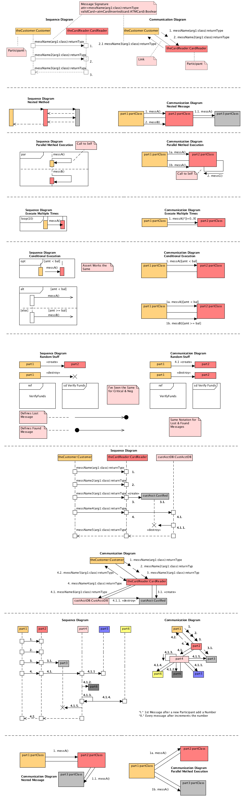

1. Shows links between participants
	1. Participants
	2. Links
	3. Messages passed (same as sequence diagram)
	4. Number (labels how the participants are going to interact)
		1. First participants number is single digit starting from 1
		2. Second participants number is second digit after .
				
										1. messName(arg1:class):returnType
				theCustomer: Customer -------> theCardReader:CardReader

										2. messName2(arg1:class):returnType
				theCustomer: Customer -------> theCardReader:CardReader

											2.1 messName3(arg1:class):returnType
				theCardReader: CardReader -------> theCustomer: Customer

2. Nested Messages
	1. Not required return arrows
3. Parallel messages

		1a.messA()
		----------|>

		1b.messA()
		----------|>

4. Calling itself (box)

		_____________
		|part2:Class |
		|			 |___
		|____________|	 |
			   |_________|
				<|-------
				  2. messC()

5. Execute multiple times
					
						 1. messA()*[i=0..9]
		|part1:partClass|--------------------|>|part2:partClass|
		|_______________|----------------------|_______________|

6. Guard conditions

						 1. messA()[amt < bal]
		|part1:partClass|--------------------|>|part2:partClass|

						 1a.messA()[amt < bal]
		|part1:partClass|--------------------|>|part2:partClass|
		|				|----------------------|               |
		|_______________|--------------------|>|_______________|
						 1b.messA()[amt >= bal]

	1. Use Object Constraint Language (OCL)
		1. Data types: Boolean, Integer, Real, String
		2. Arithmetic: +, -, *, /, a->mod(b), abs(), min(), max()
		3. Comparison: <, >, <=, >=, =, <>
		4. Boolean: and, or, xor, not
7. Creation

			   4.1. <<create>>
		|part1|---------->|part2|

8. Destruction

			   <<destroy>>
		|part1|---------->|part2|

9. Ref, Critical from sequence diagrams can be used
10. Message lost or message got back are same as sequence diagram
11. Note: No return arrows

## UML 2.0 Timing Diagrams ##
1. Find states for different participants
	1. Customer Inserts Card
		1. Card is invalid
		2. Eject card
	2. Card is valid
	3. Customer enters PIN
		1. PIN is invalid
	4. PIN is validated
	5. Account is selected
	6. Amount is selected
	7. Provide funds
	8. Provide receipt
	9. Eject card
2. Figure out participants (from use case diagram)
	1. Customer
		1. Card in Hand (state)
		2. Insert Card
		3. Enter PIN
		4. Select account
		5. Select amount
	2. Card Reader
		1. No card
		2. Receive Card
		3. Card Valid
		4. Card Invalid
		5. Invalid Amount
		6. Eject Money
		7. Eject Receipt
		8. Eject Card
	3. Bank System
		1. No Card
		2. Valid Pin
		3. Invalid Pin
		4. Account Valid
		5. Amount Valid
		6. Amount Invalid
		7. Account Invalid
3. Transfer the above to timing diagram

	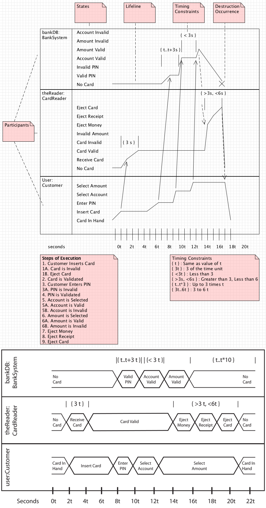

	1. bottom has increments of time (seconds say)
	2. First column: Participant - name:class
		1. Next column: states
		2. Line diagram:
			1. Insert Card triggers Receive Card in Card Reader
				1. Receive Card to Card Valid (constraint can be placed)

									   |{3s}| (t for relative time)
										 | |
						Card Valid		  /
						Receive Card  ___/

				2. Arrow that shows that an event triggering a state change
4. Different types of constraints
	1. {t}: Same as value of t
	2. {3t}: 3 of time unit
	3. {<3t}: less than 3
	4. {>3s, <6s}: Greater than 3, Less than 6
	5. {t..t*3}: Up to 3 times t
	6. {3t..6t}: 3 to 6 t
5. Description: similar to other diagrams
6. Alternative timing diagram (conserves space)
	1. Diamond like polygons

## UML 2.0 Component Diagrams ##
1. Examples:

	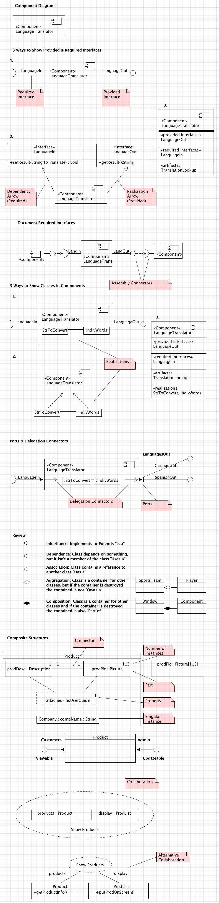

2. Component diagram
	1. For showing re-usable pieces of code
	2. Components are combined to show the who program
	3. Components perform operations, interact with classes and implement interfaces ... (more than a regular class)
	4. Components must communicate through interfaces (loosely coupled and easily swappable)
		1. Interfaces

					LanguageIn					    LanguageOut
				)-------------| <<Component>>	   |---------------o
							  | LanguageTranslator |

			1. LanguageIn (language input is required for component to function)
				1. )--- : required interface
				2. ---o : provided interface

	5. Another representation

			|	<<interface>>		  |		|	<<interface>>   |
			|	  LanguageIn		  |		|	 LanguageOut    |
			|_________________________|		|___________________|
			|+setResult				  |		|+getResult():String|
			|(String toTranslate):void|		|___________________|
						 ^						  /_\
						  \	(dependency arrow)	  / (realization arrow not required)
						   \| <<Component>>  	|/
							| LanguageTranslator|

	6. Another representation

			|	<<Component>>	     |
			|   LanguageTranslator   |
			|________________________|
			| <<provided interfaces>>|
			| LanguageOut			 |
			|________________________|
			| <<required interfaces>>|
			| LanguageIn			 |
			|________________________|
			| <<artifacts>>			 | (files/ databases/datasheets)
			| TranslationLookup		 |
			|________________________|

	7. Another representation (combining components)

			|<<Component>>| --o - ->)---|<<Component>>| --o- ->)--|<<Component>>|
												         (assembly connectors)

3. Component: Combination of classes that do something pretty big
4. Showing classes inside components:

				 _____________________________________
				|<<Component>>					      |
				|LanguageTranslator				      |				|  ____________ 		  __________  |
		)-------| |StrToConvert|---------|IndivWords| |---------o
				|_____________________________________|

	1. StrToConvert, IndivWords - classes (realizations) and how they are going to interact
	2. Another way: Outside component
	3. Another way: 

				<<realizations>>
				StrToConvert, IndivWords

5. Ports
	1. Port can shoot out different languages (GermanOut, SpanishOut)
		1. Interface: LanguageOut
	2. Delegation connectors: Arrows inside component (Shows flow inside component)
6. Relationship arrows:
	1. Inheritance: Implements of Extends "Is a"

			<|----------

	2. Dependence: Class depends on something, but it isn't a member of the class "Uses a"

			<- - - - - -

	3. Associations: Class contains a reference to another class "Has a"

			<-----------

	4. Aggregation: Class is a container for other classes, but if the container is destroyed the contained is not "Owns a"

			<>----------

		1. SportsTeam (if destroyed) - Player (would not be destroyed)

	5. Composition: Class is a container for other classes and if the container is destroyed the contained is also "Part of"

			<f>---------
		
		1. Window (if destroyed) - Component (destroyed)
7. Composite structure
	1. How objects work together (shows how pieces inside class work together)
					
										Connector
									  1			 1
			| |prodDesc: Description |------------| prodPic: Picture | |
							\					    /
						|   attachedFile: UserGuide    |
 
						   Company : compName : String

		1. <rollname> : <type of object>
		2. Number of instances of the object - upper right corner (multiplicity)
			1. `1..3`
		3. Connectors - numbers on both ends - shows how many instances match up with other instances - each prod description would have one picture
			1. Another

					prodPic: Picture[1..3]

		4. Properties: dashed boxes (attachedFile: UserGuide)
		5. Singular instance: Company : compName : String (shared by every product)
	2. Ports:
		1. Similar to component diagram
			1. Interface names
			2. Port names
	3. Collaborations: Shows how objects collaborate together to accomplish said tasks
		1. Roles of objects may change in an application so collaboration diagram shows changing specific tasks that objects will have through the use of the system

				| products : Product |---------| display : ProdList |

									Show Products (what task is done through the collaboration)
		2. Alternative:
						
						 _ _ _ _ _ _ _ _
						( Show Products )
				products/				\display
				|  	Product 		|	|	ProdList       |
				| +getProductInfo()	|	|+putProdOnScreen()|

## UML 2.0 State Machine Diagrams ##
### State Machine Diagrams ###
1. State machine diagrams and Package diagrams
	1. State machine diagram
		1. State
		2. Transition arrow
		3. Event (eject card) - triggers state changes
2. Example:

	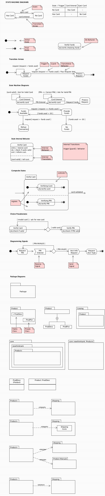

3. Table format:

		State / Trigger | Card Entered | Eject Card |
		No Card			| Has Card	   |    - 	    |
		Has Card		|      -	   | No Card    |

4. Initial State
5. Final State
6. Behavior: tells what is going on in the system when the system is in that state

				Verify Funds (state)
			------------------------
			do/verify checking funds

7. Transition arrows with description:
	1. List trigger first
	2. Then guard statement (boolean statement)
		1. [request <= funds avial]
		2. [card valid]
		3. [request > funds avial]
	3. Finally transitional behavior (behavior that occurs as we transition to the next state)
		1. Pass Request Amt (passing value)

				Request [request <= funds avail] / Pass Request Amt

8. State internal behavior (Actions performed when in the state)
	
			  Verify Card
		-------------------------
		entry / receive card
		do / check if cards valid <----- Internal behavior
		exit / informt cust.
		- - - - - - - - - - - - - 
		[card valid] / tell cust. <----- Internal Transitions

	1. entry: what happens when we reach this state
	2. exit: what happens at the end of the behavior (do not change the state)
	3. [card valid] / tell cust. : behavior that does not change the state
		1. Internal transition
9. Example:

		[card valid] / Ask for Valid Card		[PIN <> Correct PIN] / Ask for Valid PIN
		|-------|				           	    |-----|
		|	   \ /	 							|    \ /
		|	Card Entered		PIN Entered		Card Entered     Request Funds
		--- --------------- ------------------> --------------- ---------------> Process Funds 
			do/ verify card						do/ verify card

	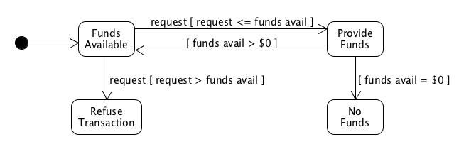

	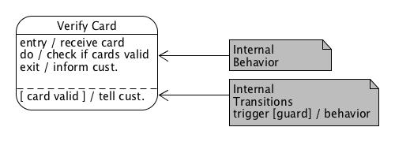
	
	1. Internal transitions: happen internally but do not force us to leave the state
	2. Internal behavior: 
			1. `entry/ receive card` - what is going to happen when we enter the state
			2. `do/ check if card is valid` - internal processing
			3. `exit/ inform cust` - End action before proceeding with external transition

10. Composite states: Two or more states active at a time

	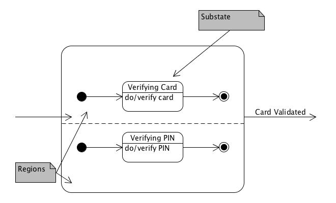

	1. Regions exist
	2. Preference: Draw two arrows out from each substate and fork them together or fork from into two arrows to the substates
11. Choice Pseudostates: conditional transition - goes to onse state if a condition is met or goes to another state if not

	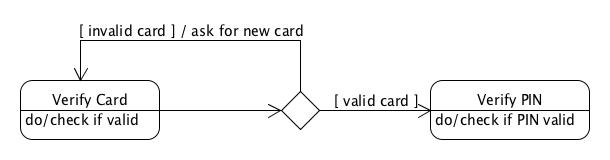

12. Diagramming Signals

	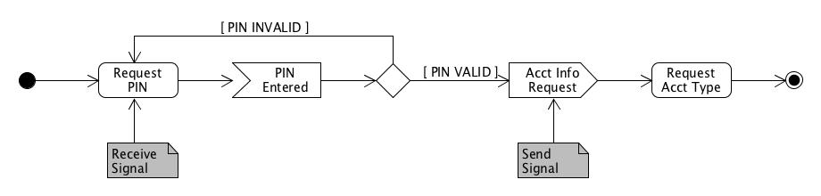

	1. Receiver: Trigger for the transition (when this signal occurs, the transition happens)
	2. Sender: sends signal (when this signal is initiated, the transition happens)

### Package Diagrams ###
1. Packages group similar classes
2. Package diagram shows dependencies between classes
3. Simple package diagram

	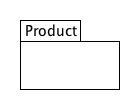

4. Package with content

	

5. Package inside package

	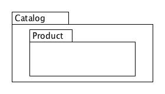

6. Package with reverse domain

	

7. Class diagram with package name

	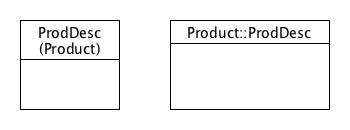

8. If one package depends on another package
	1. Draw a dependency arrow to the dependent package from the depending package
		1. Import
		2. Import class from another package
		3. Merge - for merging [related] packages into a single package
		4. Access - for imported package to have private visibility

	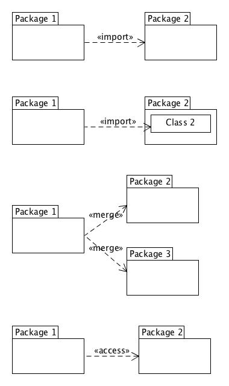

## UML 2.0 Deployment Diagrams ##
1. Node - Hardware node
	1. Hardware piece
	2. Executable environment (Software application)

		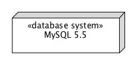
			
			 /-------------\
			|\_____________/|
			|  <<database>>	|
			|   MySQL 5.5	|
			\_______________/

			<<database>>
			{OS=Linux
			vendor=MySQL
			version=5.5}

2. Depends on who uses them and how diagrams help build systems

	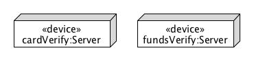

3. Node communication lines (line with label)

	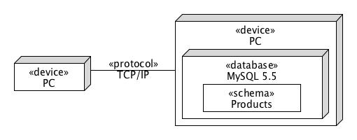

	1. lines should just describe "how" the nodes communicate (not specific messages, ...)
	2. Software is modelled as artifact: To model as software inside a piece of hardware
	3. Artifact inside node

		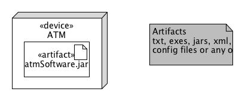

4. Deployment diagram used to communicate how system is to be designed
5. Dependency arrows:

	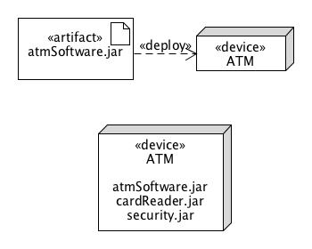

6. Relationship between software and component

	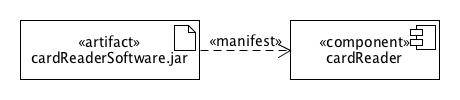
	
	1. Manifest: to implement a component
	2. Component(s): define requirements for software deployed to hardware
7. Deployment specifications
	1. Artifacts describing how another artifact is associated with a node

	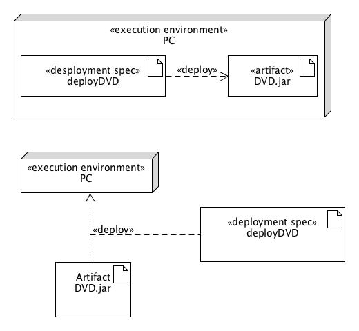

9. ATM machine deployment diagram example:

	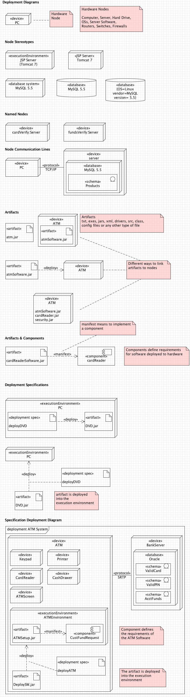
		
	